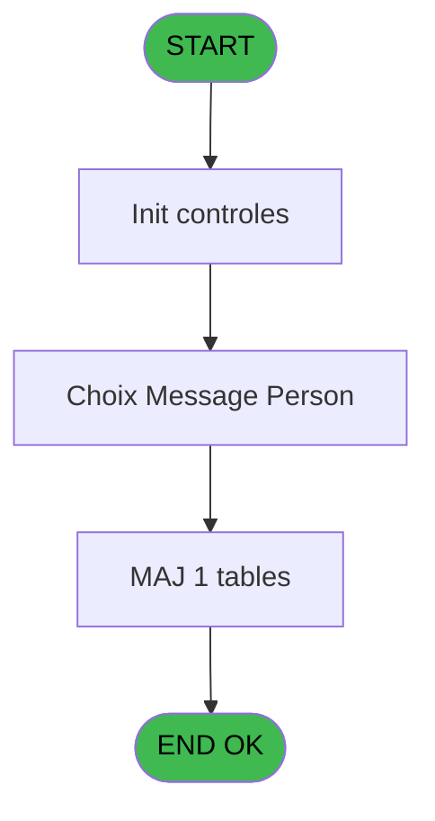

# PVE IDE 272 - Choix - Messages

> **Analyse**: Phases 1-4 2026-02-03 19:20 -> 19:20 (11s) | Assemblage 19:20
> **Pipeline**: V7.2 Enrichi
> **Structure**: 4 onglets (Resume | Ecrans | Donnees | Connexions)

<!-- TAB:Resume -->

## 1. FICHE D'IDENTITE

| Attribut | Valeur |
|----------|--------|
| Projet | PVE |
| IDE Position | 272 |
| Nom Programme | Choix - Messages |
| Fichier source | `Prg_272.xml` |
| Dossier IDE | Ticket |
| Taches | 3 (2 ecrans visibles) |
| Tables modifiees | 1 |
| Programmes appeles | 0 |

## 2. DESCRIPTION FONCTIONNELLE

**Choix - Messages** assure la gestion complete de ce processus, accessible depuis [Menu Administration (IDE 178)](PVE-IDE-178.md).

Le flux de traitement s'organise en **3 blocs fonctionnels** :

- **Calcul** (1 tache) : calculs de montants, stocks ou compteurs
- **Consultation** (1 tache) : ecrans de recherche, selection et consultation
- **Traitement** (1 tache) : traitements metier divers

**Donnees modifiees** : 1 tables en ecriture (maj_appli_tpe).

Detail : phases du traitement

#### Phase 1 : Traitement (1 tache)

- **272** - Messages **[[ECRAN]](#ecran-t1)**

#### Phase 2 : Consultation (1 tache)

- **272.1** - Choix Message Person **[[ECRAN]](#ecran-t2)**

#### Phase 3 : Calcul (1 tache)

- **272.2** - Calcul du Nbre enregistrement

#### Tables impactees

| Table | Operations | Role metier |
|-------|-----------|-------------|
| maj_appli_tpe | **W** (3 usages) |  |

## 3. BLOCS FONCTIONNELS

### 3.1 Traitement (1 tache)

Traitements internes.

---

#### 272 - Messages [[ECRAN]](#ecran-t1)

**Role** : Traitement : Messages.
**Ecran** : 480 x 374 DLU (MDI) | [Voir mockup](#ecran-t1)

### 3.2 Consultation (1 tache)

Ecrans de recherche et consultation.

---

#### 272.1 - Choix Message Person [[ECRAN]](#ecran-t2)

**Role** : Selection par l'operateur : Choix Message Person.
**Ecran** : 469 x 207 DLU | [Voir mockup](#ecran-t2)
**Variables liees** : B (v.%Message Person)

### 3.3 Calcul (1 tache)

Calculs metier : montants, stocks, compteurs.

---

#### 272.2 - Calcul du Nbre enregistrement

**Role** : Calcul : Calcul du Nbre enregistrement.
**Variables liees** : C (vNbre d'enregistrement)

## 5. REGLES METIER

*(Aucune regle metier identifiee)*

## 6. CONTEXTE

- **Appele par**: [Menu Administration (IDE 178)](PVE-IDE-178.md)
- **Appelle**: 0 programmes | **Tables**: 1 (W:1 R:0 L:0) | **Taches**: 3 | **Expressions**: 9

<!-- TAB:Ecrans -->

## 8. ECRANS

### 8.1 Forms visibles (2 / 3)

| # | Position | Tache | Nom | Type | Largeur | Hauteur | Bloc |
|---|----------|-------|-----|------|---------|---------|------|
| 1 | 272 | 272 | Messages | MDI | 480 | 374 | Traitement |
| 2 | 272.1 | 272.1 | Choix Message Person | Type0 | 469 | 207 | Consultation |

### 8.2 Mockups Ecrans

---

#### 272 - Messages
**Tache** : [272](#t1) | **Type** : MDI | **Dimensions** : 480 x 374 DLU
**Bloc** : Traitement | **Titre IDE** : Messages

<!-- FORM-DATA:
{
    "width":  480,
    "vFactor":  8,
    "type":  "MDI",
    "hFactor":  4,
    "controls":  [
                     {
                         "x":  3,
                         "type":  "line",
                         "var":  "",
                         "y":  134,
                         "w":  467,
                         "fmt":  "",
                         "name":  "",
                         "h":  0,
                         "color":  "",
                         "text":  "",
                         "parent":  null
                     },
                     {
                         "x":  12,
                         "type":  "label",
                         "var":  "",
                         "y":  138,
                         "w":  115,
                         "fmt":  "",
                         "name":  "",
                         "h":  14,
                         "color":  "183",
                         "text":  "Custom Message",
                         "parent":  null
                     },
                     {
                         "x":  4,
                         "type":  "line",
                         "var":  "",
                         "y":  155,
                         "w":  467,
                         "fmt":  "",
                         "name":  "",
                         "h":  0,
                         "color":  "",
                         "text":  "",
                         "parent":  null
                     },
                     {
                         "x":  0,
                         "type":  "label",
                         "var":  "",
                         "y":  0,
                         "w":  477,
                         "fmt":  "",
                         "name":  "",
                         "h":  38,
                         "color":  "182",
                         "text":  "",
                         "parent":  null
                     },
                     {
                         "x":  15,
                         "type":  "label",
                         "var":  "",
                         "y":  15,
                         "w":  271,
                         "fmt":  "",
                         "name":  "",
                         "h":  10,
                         "color":  "186",
                         "text":  "Add or select a message",
                         "parent":  4
                     },
                     {
                         "x":  0,
                         "type":  "label",
                         "var":  "",
                         "y":  38,
                         "w":  477,
                         "fmt":  "",
                         "name":  "",
                         "h":  55,
                         "color":  "182",
                         "text":  "Default Message",
                         "parent":  null
                     },
                     {
                         "x":  0,
                         "type":  "label",
                         "var":  "",
                         "y":  93,
                         "w":  477,
                         "fmt":  "",
                         "name":  "",
                         "h":  36,
                         "color":  "182",
                         "text":  "",
                         "parent":  null
                     },
                     {
                         "x":  426,
                         "type":  "image",
                         "var":  "",
                         "y":  5,
                         "w":  48,
                         "fmt":  "",
                         "name":  "",
                         "h":  31,
                         "color":  "",
                         "text":  "",
                         "parent":  4
                     },
                     {
                         "x":  9,
                         "type":  "edit",
                         "var":  "",
                         "y":  53,
                         "w":  463,
                         "fmt":  "",
                         "name":  "pv_message_defaut_0001",
                         "h":  35,
                         "color":  "110",
                         "text":  "",
                         "parent":  7
                     },
                     {
                         "x":  8,
                         "type":  "button",
                         "var":  "",
                         "y":  100,
                         "w":  70,
                         "fmt":  "\u0026Modify mode",
                         "name":  "",
                         "h":  28,
                         "color":  "",
                         "text":  "",
                         "parent":  9
                     },
                     {
                         "x":  262,
                         "type":  "button",
                         "var":  "",
                         "y":  99,
                         "w":  70,
                         "fmt":  "\u0026Delete",
                         "name":  "",
                         "h":  28,
                         "color":  "",
                         "text":  "",
                         "parent":  9
                     },
                     {
                         "x":  331,
                         "type":  "button",
                         "var":  "",
                         "y":  99,
                         "w":  70,
                         "fmt":  "\u0026Cancel",
                         "name":  "",
                         "h":  28,
                         "color":  "",
                         "text":  "",
                         "parent":  9
                     },
                     {
                         "x":  403,
                         "type":  "button",
                         "var":  "",
                         "y":  99,
                         "w":  70,
                         "fmt":  "\u0026Exit",
                         "name":  " v.quit",
                         "h":  28,
                         "color":  "",
                         "text":  "",
                         "parent":  9
                     },
                     {
                         "x":  0,
                         "type":  "subform",
                         "var":  "",
                         "y":  158,
                         "w":  480,
                         "fmt":  "",
                         "name":  "Perso",
                         "h":  214,
                         "color":  "",
                         "text":  "",
                         "parent":  null
                     }
                 ],
    "taskId":  "272",
    "height":  374
}
-->

<strong>Champs : 1 champs</strong>

| Pos (x,y) | Nom | Variable | Type |
|-----------|-----|----------|------|
| 9,53 | pv_message_defaut_0001 | - | edit |

<strong>Boutons : 4 boutons</strong>

| Bouton | Pos (x,y) | Action |
|--------|-----------|--------|
| Modify mode | 8,100 | Modifie l'element |
| Delete | 262,99 | Supprime l'element selectionne |
| Cancel | 331,99 | Annule et retour au menu |
| Exit | 403,99 | Quitte le programme |

---

#### 272.1 - Choix Message Person
**Tache** : [272.1](#t2) | **Type** : Type0 | **Dimensions** : 469 x 207 DLU
**Bloc** : Consultation | **Titre IDE** : Choix Message Person

<!-- FORM-DATA:
{
    "width":  469,
    "vFactor":  8,
    "type":  "Type0",
    "hFactor":  4,
    "controls":  [
                     {
                         "x":  128,
                         "type":  "label",
                         "var":  "",
                         "y":  0,
                         "w":  79,
                         "fmt":  "",
                         "name":  "",
                         "h":  10,
                         "color":  "183",
                         "text":  "Start Date",
                         "parent":  null
                     },
                     {
                         "x":  271,
                         "type":  "label",
                         "var":  "",
                         "y":  0,
                         "w":  56,
                         "fmt":  "",
                         "name":  "",
                         "h":  10,
                         "color":  "183",
                         "text":  "End Date",
                         "parent":  null
                     },
                     {
                         "x":  122,
                         "type":  "table",
                         "var":  "",
                         "name":  "",
                         "titleH":  12,
                         "color":  "6",
                         "w":  244,
                         "y":  12,
                         "fmt":  "",
                         "parent":  null,
                         "text":  "",
                         "rowH":  18,
                         "h":  90,
                         "cols":  [
                                      {
                                          "title":  "pv_date_debut_val_message",
                                          "layer":  1,
                                          "w":  115
                                      },
                                      {
                                          "title":  "pv_date_fin_val_message",
                                          "layer":  2,
                                          "w":  105
                                      }
                                  ],
                         "rows":  2
                     },
                     {
                         "x":  3,
                         "type":  "label",
                         "var":  "",
                         "y":  107,
                         "w":  465,
                         "fmt":  "",
                         "name":  "",
                         "h":  55,
                         "color":  "182",
                         "text":  "Message",
                         "parent":  null
                     },
                     {
                         "x":  3,
                         "type":  "label",
                         "var":  "",
                         "y":  164,
                         "w":  465,
                         "fmt":  "",
                         "name":  "",
                         "h":  40,
                         "color":  "182",
                         "text":  "",
                         "parent":  null
                     },
                     {
                         "x":  130,
                         "type":  "edit",
                         "var":  "",
                         "y":  18,
                         "w":  79,
                         "fmt":  "",
                         "name":  "pv_date_debut_val_message",
                         "h":  10,
                         "color":  "110",
                         "text":  "",
                         "parent":  3
                     },
                     {
                         "x":  263,
                         "type":  "edit",
                         "var":  "",
                         "y":  18,
                         "w":  79,
                         "fmt":  "",
                         "name":  "pv_date_fin_val_message",
                         "h":  10,
                         "color":  "110",
                         "text":  "",
                         "parent":  3
                     },
                     {
                         "x":  5,
                         "type":  "edit",
                         "var":  "",
                         "y":  120,
                         "w":  458,
                         "fmt":  "",
                         "name":  "pv_message_defaut_0001",
                         "h":  35,
                         "color":  "110",
                         "text":  "",
                         "parent":  8
                     },
                     {
                         "x":  6,
                         "type":  "button",
                         "var":  "",
                         "y":  172,
                         "w":  70,
                         "fmt":  "\u0026Modify mode",
                         "name":  "",
                         "h":  28,
                         "color":  "",
                         "text":  "",
                         "parent":  null
                     },
                     {
                         "x":  247,
                         "type":  "button",
                         "var":  "",
                         "y":  172,
                         "w":  70,
                         "fmt":  "\u0026Create",
                         "name":  "",
                         "h":  28,
                         "color":  "",
                         "text":  "",
                         "parent":  null
                     },
                     {
                         "x":  321,
                         "type":  "button",
                         "var":  "",
                         "y":  172,
                         "w":  70,
                         "fmt":  "\u0026Delete",
                         "name":  "",
                         "h":  28,
                         "color":  "",
                         "text":  "",
                         "parent":  null
                     },
                     {
                         "x":  395,
                         "type":  "button",
                         "var":  "",
                         "y":  172,
                         "w":  70,
                         "fmt":  "\u0026Cancel",
                         "name":  "",
                         "h":  28,
                         "color":  "",
                         "text":  "",
                         "parent":  null
                     }
                 ],
    "taskId":  "272.1",
    "height":  207
}
-->

<strong>Champs : 3 champs</strong>

| Pos (x,y) | Nom | Variable | Type |
|-----------|-----|----------|------|
| 130,18 | pv_date_debut_val_message | - | edit |
| 263,18 | pv_date_fin_val_message | - | edit |
| 5,120 | pv_message_defaut_0001 | - | edit |

<strong>Boutons : 4 boutons</strong>

| Bouton | Pos (x,y) | Action |
|--------|-----------|--------|
| Modify mode | 6,172 | Modifie l'element |
| Create | 247,172 | Bouton fonctionnel |
| Delete | 321,172 | Supprime l'element selectionne |
| Cancel | 395,172 | Annule et retour au menu |

## 9. NAVIGATION

### 9.1 Enchainement des ecrans

**Detail par enchainement :**

| Depuis | Action | Vers | Retour |
|--------|--------|------|--------|

### 9.3 Structure hierarchique (3 taches)

| Position | Tache | Type | Dimensions | Bloc |
|----------|-------|------|------------|------|
| **272.1** | [**Messages** (272)](#t1) [mockup](#ecran-t1) | MDI | 480x374 | Traitement |
| **272.2** | [**Choix Message Person** (272.1)](#t2) [mockup](#ecran-t2) | - | 469x207 | Consultation |
| **272.3** | [**Calcul du Nbre enregistrement** (272.2)](#t3) | - | - | Calcul |

### 9.4 Algorigramme

> **Legende**: Vert = START/END OK | Rouge = END KO | Bleu = Decisions
> *Algorigramme auto-genere. Utiliser `/algorigramme` pour une synthese metier detaillee.*

<!-- TAB:Donnees -->

## 10. TABLES

### Tables utilisees (1)

| ID | Nom | Description | Type | R | W | L | Usages |
|----|-----|-------------|------|---|---|---|--------|
| 866 | maj_appli_tpe |  | DB |   | **W** |   | 3 |

### Colonnes par table (1 / 1 tables avec colonnes identifiees)

Table 866 - maj_appli_tpe (**W**) - 3 usages

| Lettre | Variable | Acces | Type |
|--------|----------|-------|------|
| A | v.Quit | W | Alpha |
| B | v.%Message Person | W | Alpha |
| C | vNbre d'enregistrement | W | Numeric |

## 11. VARIABLES

### 11.1 Variables de session (2)

Variables persistantes pendant toute la session.

| Lettre | Nom | Type | Usage dans |
|--------|-----|------|-----------|
| A | v.Quit | Alpha | - |
| B | v.%Message Person | Alpha | - |

### 11.2 Autres (1)

Variables diverses.

| Lettre | Nom | Type | Usage dans |
|--------|-----|------|-----------|
| C | vNbre d'enregistrement | Numeric | - |

## 12. EXPRESSIONS

**9 / 9 expressions decodees (100%)**

### 12.1 Repartition par type

| Type | Expressions | Regles |
|------|-------------|--------|
| CONSTANTE | 4 | 0 |
| DATE | 1 | 0 |
| OTHER | 2 | 0 |
| CONDITION | 1 | 0 |
| REFERENCE_VG | 1 | 0 |

### 12.2 Expressions cles par type

#### CONSTANTE (4 expressions)

| Type | IDE | Expression | Regle |
|------|-----|------------|-------|
| CONSTANTE | 4 | `'D'` | - |
| CONSTANTE | 7 | `1` | - |
| CONSTANTE | 1 | `'Custom message'` | - |
| CONSTANTE | 2 | `''` | - |

#### DATE (1 expressions)

| Type | IDE | Expression | Regle |
|------|-----|------------|-------|
| DATE | 3 | `Date()` | - |

#### OTHER (2 expressions)

| Type | IDE | Expression | Regle |
|------|-----|------------|-------|
| OTHER | 9 | `Stat(0,'M'MODE)` | - |
| OTHER | 5 | `GetParam ('SERVICE')` | - |

#### CONDITION (1 expressions)

| Type | IDE | Expression | Regle |
|------|-----|------------|-------|
| CONDITION | 6 | `[J]=0` | - |

#### REFERENCE_VG (1 expressions)

| Type | IDE | Expression | Regle |
|------|-----|------------|-------|
| REFERENCE_VG | 8 | `VG9` | - |

<!-- TAB:Connexions -->

## 13. GRAPHE D'APPELS

### 13.1 Chaine depuis Main (Callers)

Main -> ... -> [Menu Administration (IDE 178)](PVE-IDE-178.md) -> **Choix - Messages (IDE 272)**

### 13.2 Callers

| IDE | Nom Programme | Nb Appels |
|-----|---------------|-----------|
| [178](PVE-IDE-178.md) | Menu Administration | 1 |

### 13.3 Callees (programmes appeles)

### 13.4 Detail Callees avec contexte

| IDE | Nom Programme | Appels | Contexte |
|-----|---------------|--------|----------|
| - | (aucun) | - | - |

## 14. RECOMMANDATIONS MIGRATION

### 14.1 Profil du programme

| Metrique | Valeur | Impact migration |
|----------|--------|-----------------|
| Lignes de logique | 32 | Programme compact |
| Expressions | 9 | Peu de logique |
| Tables WRITE | 1 | Impact faible |
| Sous-programmes | 0 | Peu de dependances |
| Ecrans visibles | 2 | Quelques ecrans |
| Code desactive | 0% (0 / 32) | Code sain |
| Regles metier | 0 | Pas de regle identifiee |

### 14.2 Plan de migration par bloc

#### Traitement (1 tache: 1 ecran, 0 traitement)

- **Strategie** : 1 composant(s) UI (Razor/React) avec formulaires et validation.
- Decomposer les taches en services unitaires testables.

#### Consultation (1 tache: 1 ecran, 0 traitement)

- **Strategie** : Composants de recherche/selection en modales.
- 1 ecran : Choix Message Person

#### Calcul (1 tache: 0 ecran, 1 traitement)

- **Strategie** : Services de calcul purs (Domain Services).
- Migrer la logique de calcul (stock, compteurs, montants)

### 14.3 Dependances critiques

| Dependance | Type | Appels | Impact |
|------------|------|--------|--------|
| maj_appli_tpe | Table WRITE (Database) | 3x | Schema + repository |

---
*Spec DETAILED generee par Pipeline V7.2 - 2026-02-03 19:20*
