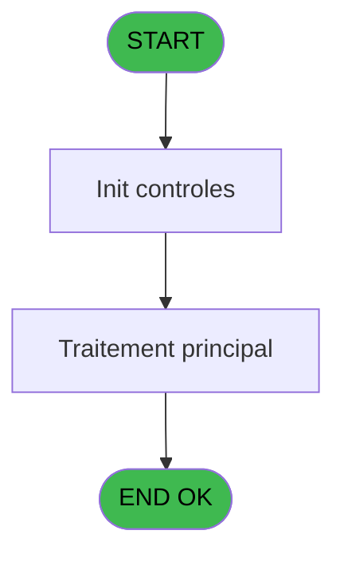
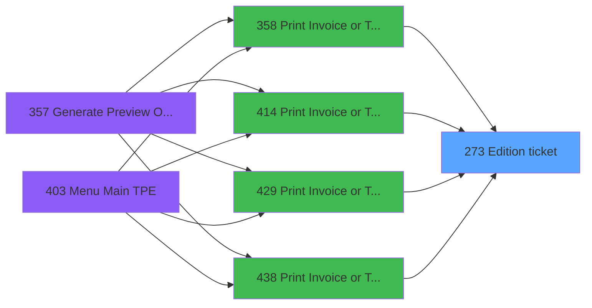
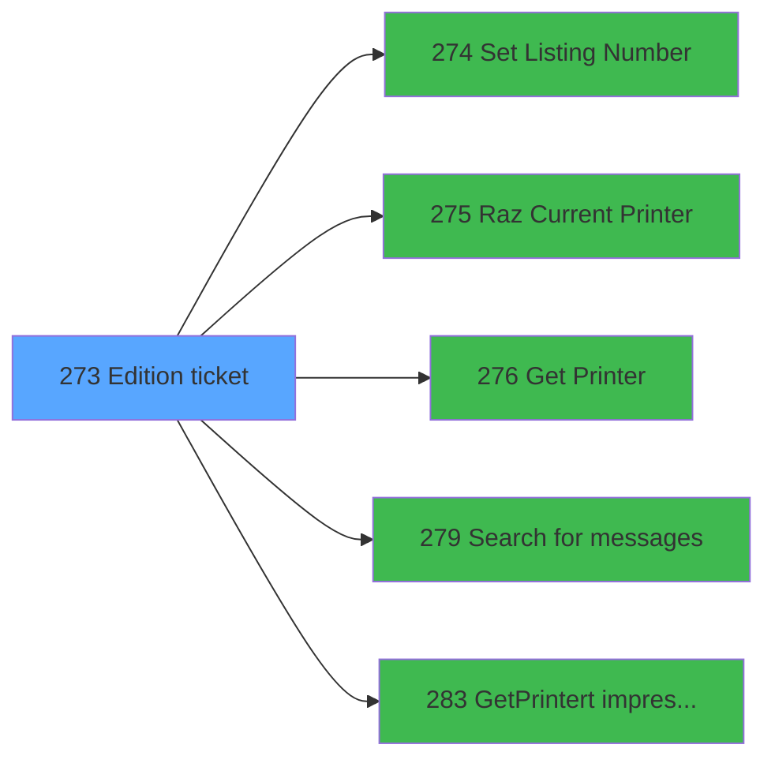

# PVE IDE 273 - Edition ticket

> **Analyse**: Phases 1-4 2026-02-03 19:20 -> 19:21 (13s) | Assemblage 19:21
> **Pipeline**: V7.2 Enrichi
> **Structure**: 4 onglets (Resume | Ecrans | Donnees | Connexions)

<!-- TAB:Resume -->

## 1. FICHE D'IDENTITE

| Attribut | Valeur |
|----------|--------|
| Projet | PVE |
| IDE Position | 273 |
| Nom Programme | Edition ticket |
| Fichier source | `Prg_273.xml` |
| Dossier IDE | Ticket |
| Taches | 16 (0 ecrans visibles) |
| Tables modifiees | 0 |
| Programmes appeles | 5 |

## 2. DESCRIPTION FONCTIONNELLE

**Edition ticket** assure la gestion complete de ce processus, accessible depuis [Print Invoice or Ticket (IDE 358)](PVE-IDE-358.md), [Print Invoice or Ticket==V4 (IDE 414)](PVE-IDE-414.md), [Print Invoice or Ticket==NEW (IDE 429)](PVE-IDE-429.md), [Print Invoice or Ticket v2 (IDE 438)](PVE-IDE-438.md).

Le flux de traitement s'organise en **2 blocs fonctionnels** :

- **Traitement** (14 taches) : traitements metier divers
- **Impression** (2 taches) : generation de tickets et documents

Detail : phases du traitement

#### Phase 1 : Traitement (14 taches)

- **273** - Please be patient ... **[[ECRAN]](#ecran-t1)**
- **273.1** - Counter
- **273.1.1** - Impression reçu change **[[ECRAN]](#ecran-t3)**
- **273.1.2** - Impression reçu change **[[ECRAN]](#ecran-t4)**
- **273.1.2.1** - Impression reçu change **[[ECRAN]](#ecran-t5)**
- **273.2** - Counter
- **273.2.1** - Impression reçu change
- **273.2.2** - Impression reçu change
- **273.3.1** - Veuillez patienter ... **[[ECRAN]](#ecran-t10)**
- **273.3.2** - Veuillez patienter ... **[[ECRAN]](#ecran-t11)**
- **273.3.2.1** - Impression reçu change **[[ECRAN]](#ecran-t12)**
- **273.4.1** - Veuillez patienter ... **[[ECRAN]](#ecran-t14)**
- **273.4.2** - Veuillez patienter ... **[[ECRAN]](#ecran-t15)**
- **273.4.2.1** - Veuillez patienter ... **[[ECRAN]](#ecran-t16)**

Delegue a : [Set Listing Number (IDE 274)](PVE-IDE-274.md), [Search  for messages (IDE 279)](PVE-IDE-279.md)

#### Phase 2 : Impression (2 taches)

- **273.3** - Printer 5 **[[ECRAN]](#ecran-t9)**
- **273.4** - Printer 9 **[[ECRAN]](#ecran-t13)**

Delegue a : [Set Listing Number (IDE 274)](PVE-IDE-274.md), [Raz Current Printer (IDE 275)](PVE-IDE-275.md), [Get Printer (IDE 276)](PVE-IDE-276.md), [GetPrinter/t impression (IDE 283)](PVE-IDE-283.md)

## 3. BLOCS FONCTIONNELS

### 3.1 Traitement (14 taches)

Traitements internes.

---

#### 273 - Please be patient ... [[ECRAN]](#ecran-t1)

**Role** : Tache d'orchestration : point d'entree du programme (14 sous-taches). Coordonne l'enchainement des traitements.
**Ecran** : 424 x 57 DLU (MDI) | [Voir mockup](#ecran-t1)

13 sous-taches directes

| Tache | Nom | Bloc |
|-------|-----|------|
| [273.1](#t2) | Counter | Traitement |
| [273.1.1](#t3) | Impression reçu change **[[ECRAN]](#ecran-t3)** | Traitement |
| [273.1.2](#t4) | Impression reçu change **[[ECRAN]](#ecran-t4)** | Traitement |
| [273.1.2.1](#t5) | Impression reçu change **[[ECRAN]](#ecran-t5)** | Traitement |
| [273.2](#t6) | Counter | Traitement |
| [273.2.1](#t7) | Impression reçu change | Traitement |
| [273.2.2](#t8) | Impression reçu change | Traitement |
| [273.3.1](#t10) | Veuillez patienter ... **[[ECRAN]](#ecran-t10)** | Traitement |
| [273.3.2](#t11) | Veuillez patienter ... **[[ECRAN]](#ecran-t11)** | Traitement |
| [273.3.2.1](#t12) | Impression reçu change **[[ECRAN]](#ecran-t12)** | Traitement |
| [273.4.1](#t14) | Veuillez patienter ... **[[ECRAN]](#ecran-t14)** | Traitement |
| [273.4.2](#t15) | Veuillez patienter ... **[[ECRAN]](#ecran-t15)** | Traitement |
| [273.4.2.1](#t16) | Veuillez patienter ... **[[ECRAN]](#ecran-t16)** | Traitement |

---

#### 273.1 - Counter

**Role** : Traitement : Counter.

---

#### 273.1.1 - Impression reçu change [[ECRAN]](#ecran-t3)

**Role** : Generation du document : Impression reçu change.
**Ecran** : 630 x 0 DLU (MDI) | [Voir mockup](#ecran-t3)

---

#### 273.1.2 - Impression reçu change [[ECRAN]](#ecran-t4)

**Role** : Generation du document : Impression reçu change.
**Ecran** : 574 x 0 DLU (MDI) | [Voir mockup](#ecran-t4)

---

#### 273.1.2.1 - Impression reçu change [[ECRAN]](#ecran-t5)

**Role** : Generation du document : Impression reçu change.
**Ecran** : 574 x 0 DLU (MDI) | [Voir mockup](#ecran-t5)

---

#### 273.2 - Counter

**Role** : Traitement : Counter.

---

#### 273.2.1 - Impression reçu change

**Role** : Generation du document : Impression reçu change.

---

#### 273.2.2 - Impression reçu change

**Role** : Generation du document : Impression reçu change.

---

#### 273.3.1 - Veuillez patienter ... [[ECRAN]](#ecran-t10)

**Role** : Traitement : Veuillez patienter ....
**Ecran** : 426 x 57 DLU (MDI) | [Voir mockup](#ecran-t10)

---

#### 273.3.2 - Veuillez patienter ... [[ECRAN]](#ecran-t11)

**Role** : Traitement : Veuillez patienter ....
**Ecran** : 424 x 56 DLU (MDI) | [Voir mockup](#ecran-t11)

---

#### 273.3.2.1 - Impression reçu change [[ECRAN]](#ecran-t12)

**Role** : Generation du document : Impression reçu change.
**Ecran** : 574 x 0 DLU (MDI) | [Voir mockup](#ecran-t12)

---

#### 273.4.1 - Veuillez patienter ... [[ECRAN]](#ecran-t14)

**Role** : Traitement : Veuillez patienter ....
**Ecran** : 424 x 56 DLU (MDI) | [Voir mockup](#ecran-t14)

---

#### 273.4.2 - Veuillez patienter ... [[ECRAN]](#ecran-t15)

**Role** : Traitement : Veuillez patienter ....
**Ecran** : 424 x 56 DLU (MDI) | [Voir mockup](#ecran-t15)

---

#### 273.4.2.1 - Veuillez patienter ... [[ECRAN]](#ecran-t16)

**Role** : Traitement : Veuillez patienter ....
**Ecran** : 424 x 56 DLU (MDI) | [Voir mockup](#ecran-t16)

### 3.2 Impression (2 taches)

Generation des documents et tickets.

---

#### 273.3 - Printer 5 [[ECRAN]](#ecran-t9)

**Role** : Generation du document : Printer 5.
**Ecran** : 424 x 56 DLU (MDI) | [Voir mockup](#ecran-t9)
**Delegue a** : [Raz Current Printer (IDE 275)](PVE-IDE-275.md), [Get Printer (IDE 276)](PVE-IDE-276.md), [GetPrinter/t impression (IDE 283)](PVE-IDE-283.md)

---

#### 273.4 - Printer 9 [[ECRAN]](#ecran-t13)

**Role** : Generation du document : Printer 9.
**Ecran** : 424 x 56 DLU (MDI) | [Voir mockup](#ecran-t13)
**Delegue a** : [Raz Current Printer (IDE 275)](PVE-IDE-275.md), [Get Printer (IDE 276)](PVE-IDE-276.md), [GetPrinter/t impression (IDE 283)](PVE-IDE-283.md)

## 5. REGLES METIER

*(Aucune regle metier identifiee)*

## 6. CONTEXTE

- **Appele par**: [Print Invoice or Ticket (IDE 358)](PVE-IDE-358.md), [Print Invoice or Ticket==V4 (IDE 414)](PVE-IDE-414.md), [Print Invoice or Ticket==NEW (IDE 429)](PVE-IDE-429.md), [Print Invoice or Ticket v2 (IDE 438)](PVE-IDE-438.md)
- **Appelle**: 5 programmes | **Tables**: 8 (W:0 R:3 L:7) | **Taches**: 16 | **Expressions**: 30

<!-- TAB:Ecrans -->

## 8. ECRANS

*(Programme sans ecran visible)*

## 9. NAVIGATION

### 9.3 Structure hierarchique (16 taches)

| Position | Tache | Type | Dimensions | Bloc |
|----------|-------|------|------------|------|
| **273.1** | [**Please be patient ...** (273)](#t1) [mockup](#ecran-t1) | MDI | 424x57 | Traitement |
| 273.1.1 | [Counter (273.1)](#t2) | MDI | - | |
| 273.1.2 | [Impression reçu change (273.1.1)](#t3) [mockup](#ecran-t3) | MDI | 630x0 | |
| 273.1.3 | [Impression reçu change (273.1.2)](#t4) [mockup](#ecran-t4) | MDI | 574x0 | |
| 273.1.4 | [Impression reçu change (273.1.2.1)](#t5) [mockup](#ecran-t5) | MDI | 574x0 | |
| 273.1.5 | [Counter (273.2)](#t6) | MDI | - | |
| 273.1.6 | [Impression reçu change (273.2.1)](#t7) | MDI | - | |
| 273.1.7 | [Impression reçu change (273.2.2)](#t8) | MDI | - | |
| 273.1.8 | [Veuillez patienter ... (273.3.1)](#t10) [mockup](#ecran-t10) | MDI | 426x57 | |
| 273.1.9 | [Veuillez patienter ... (273.3.2)](#t11) [mockup](#ecran-t11) | MDI | 424x56 | |
| 273.1.10 | [Impression reçu change (273.3.2.1)](#t12) [mockup](#ecran-t12) | MDI | 574x0 | |
| 273.1.11 | [Veuillez patienter ... (273.4.1)](#t14) [mockup](#ecran-t14) | MDI | 424x56 | |
| 273.1.12 | [Veuillez patienter ... (273.4.2)](#t15) [mockup](#ecran-t15) | MDI | 424x56 | |
| 273.1.13 | [Veuillez patienter ... (273.4.2.1)](#t16) [mockup](#ecran-t16) | MDI | 424x56 | |
| **273.2** | [**Printer 5** (273.3)](#t9) [mockup](#ecran-t9) | MDI | 424x56 | Impression |
| 273.2.1 | [Printer 9 (273.4)](#t13) [mockup](#ecran-t13) | MDI | 424x56 | |

### 9.4 Algorigramme

> **Legende**: Vert = START/END OK | Rouge = END KO | Bleu = Decisions
> *Algorigramme auto-genere. Utiliser `/algorigramme` pour une synthese metier detaillee.*

<!-- TAB:Donnees -->

## 10. TABLES

### Tables utilisees (8)

| ID | Nom | Description | Type | R | W | L | Usages |
|----|-----|-------------|------|---|---|---|--------|
| 31 | gm-complet_______gmc |  | DB | R |   |   | 1 |
| 67 | tables___________tab |  | DB |   |   | L | 1 |
| 69 | initialisation___ini |  | DB |   |   | L | 1 |
| 378 | pv_customer |  | DB | R |   | L | 4 |
| 382 | pv_discount_reasons |  | DB |   |   | L | 1 |
| 400 | pv_cust_rentals |  | DB | R |   | L | 11 |
| 403 | pv_sellers |  | DB |   |   | L | 6 |
| 533 | cumul_mvt_stock_histo | Articles et stock | TMP |   |   | L | 12 |

### Colonnes par table (3 / 3 tables avec colonnes identifiees)

Table 31 - gm-complet_______gmc (R) - 1 usages

| Lettre | Variable | Acces | Type |
|--------|----------|-------|------|
| A | P. Decimal | R | Numeric |
| B | P. PrintAgainExecution | R | Logical |
| C | P. PrintAgainPreview | R | Logical |
| D | P. Facture | R | Numeric |
| E | P.Service | R | Alpha |
| F | V Devise locale | R | Alpha |
| G | V Masque | R | Alpha |
| H | V Masque sans Z | R | Alpha |
| I | V Date | R | Date |
| J | V Fin tâche | R | Alpha |
| K | V Imprimante 2 | R | Numeric |
| L | V Copies | R | Numeric |
| M | L Avec Réduction | R | Logical |
| N | L Annulation | R | Logical |
| O | V Type Paiement | R | Alpha |
| P | V Masque TM88III | R | Alpha |
| Q | V.Customer | R | Alpha |
| R | V.Payer | R | Alpha |
| S | V.Message on Ticket ? | R | Logical |
| T | V.Message | R | Alpha |

Table 378 - pv_customer (R/L) - 4 usages

| Lettre | Variable | Acces | Type |
|--------|----------|-------|------|
| A | V Total Ticket | R | Numeric |
| B | V Ligne Montant TTC | R | Numeric |
| C | V Ligne Montant HT | R | Numeric |

Table 400 - pv_cust_rentals (R/L) - 11 usages

| Lettre | Variable | Acces | Type |
|--------|----------|-------|------|
| Q | V.Customer | R | Alpha |

## 11. VARIABLES

### 11.1 Parametres entrants (5)

Variables recues du programme appelant ([Print Invoice or Ticket (IDE 358)](PVE-IDE-358.md)).

| Lettre | Nom | Type | Usage dans |
|--------|-----|------|-----------|
| A | P. Decimal | Numeric | - |
| B | P. PrintAgainExecution | Logical | 1x parametre entrant |
| C | P. PrintAgainPreview | Logical | - |
| D | P. Facture | Numeric | - |
| E | P.Service | Alpha | - |

### 11.2 Variables de session (13)

Variables persistantes pendant toute la session.

| Lettre | Nom | Type | Usage dans |
|--------|-----|------|-----------|
| F | V Devise locale | Alpha | - |
| G | V Masque | Alpha | 1x session |
| H | V Masque sans Z | Alpha | - |
| I | V Date | Date | - |
| J | V Fin tâche | Alpha | - |
| K | V Imprimante 2 | Numeric | - |
| L | V Copies | Numeric | - |
| O | V Type Paiement | Alpha | 1x session |
| P | V Masque TM88III | Alpha | - |
| Q | V.Customer | Alpha | - |
| R | V.Payer | Alpha | - |
| S | V.Message on Ticket ? | Logical | - |
| T | V.Message | Alpha | - |

### 11.3 Autres (2)

Variables diverses.

| Lettre | Nom | Type | Usage dans |
|--------|-----|------|-----------|
| M | L Avec Réduction | Logical | - |
| N | L Annulation | Logical | - |

Toutes les 20 variables (liste complete)

| Cat | Lettre | Nom Variable | Type |
|-----|--------|--------------|------|
| P0 | **A** | P. Decimal | Numeric |
| P0 | **B** | P. PrintAgainExecution | Logical |
| P0 | **C** | P. PrintAgainPreview | Logical |
| P0 | **D** | P. Facture | Numeric |
| P0 | **E** | P.Service | Alpha |
| V. | **F** | V Devise locale | Alpha |
| V. | **G** | V Masque | Alpha |
| V. | **H** | V Masque sans Z | Alpha |
| V. | **I** | V Date | Date |
| V. | **J** | V Fin tâche | Alpha |
| V. | **K** | V Imprimante 2 | Numeric |
| V. | **L** | V Copies | Numeric |
| V. | **O** | V Type Paiement | Alpha |
| V. | **P** | V Masque TM88III | Alpha |
| V. | **Q** | V.Customer | Alpha |
| V. | **R** | V.Payer | Alpha |
| V. | **S** | V.Message on Ticket ? | Logical |
| V. | **T** | V.Message | Alpha |
| Autre | **M** | L Avec Réduction | Logical |
| Autre | **N** | L Annulation | Logical |

## 12. EXPRESSIONS

**30 / 30 expressions decodees (100%)**

### 12.1 Repartition par type

| Type | Expressions | Regles |
|------|-------------|--------|
| CALCULATION | 1 | 0 |
| CONSTANTE | 5 | 0 |
| DATE | 1 | 0 |
| OTHER | 14 | 0 |
| CONDITION | 5 | 0 |
| CONCATENATION | 3 | 0 |
| CAST_LOGIQUE | 1 | 0 |

### 12.2 Expressions cles par type

#### CALCULATION (1 expressions)

| Type | IDE | Expression | Regle |
|------|-----|------------|-------|
| CALCULATION | 9 | `Left (Trim (V Masque [G]),Len (Trim (V Masque [G]))-1)` | - |

#### CONSTANTE (5 expressions)

| Type | IDE | Expression | Regle |
|------|-----|------------|-------|
| CONSTANTE | 17 | `'O'` | - |
| CONSTANTE | 29 | `201` | - |
| CONSTANTE | 15 | `'VSERV'` | - |
| CONSTANTE | 11 | `201` | - |
| CONSTANTE | 12 | `1` | - |

#### DATE (1 expressions)

| Type | IDE | Expression | Regle |
|------|-----|------------|-------|
| DATE | 10 | `Date ()` | - |

#### OTHER (14 expressions)

| Type | IDE | Expression | Regle |
|------|-----|------------|-------|
| OTHER | 24 | `[U]` | - |
| OTHER | 23 | `[AA]` | - |
| OTHER | 22 | `[Z]` | - |
| OTHER | 25 | `[AH]` | - |
| OTHER | 30 | `P. PrintAgainExecution [B]` | - |
| ... | | *+9 autres* | |

#### CONDITION (5 expressions)

| Type | IDE | Expression | Regle |
|------|-----|------------|-------|
| CONDITION | 6 | `[AP]=9` | - |
| CONDITION | 13 | `[AQ]=0` | - |
| CONDITION | 5 | `[AP]=8` | - |
| CONDITION | 3 | `[AP]=1` | - |
| CONDITION | 4 | `[AP]=4` | - |

#### CONCATENATION (3 expressions)

| Type | IDE | Expression | Regle |
|------|-----|------------|-------|
| CONCATENATION | 19 | `Trim([AN])&' '&Trim([AO])` | - |
| CONCATENATION | 18 | `Trim([AE])&' '&Trim([AF])` | - |
| CONCATENATION | 14 | `'N'&Right ('## ### ### ###'&Left ('.',V Type Paiement [O])&Fill ('#',V Type Paiement [O]),13)` | - |

#### CAST_LOGIQUE (1 expressions)

| Type | IDE | Expression | Regle |
|------|-----|------------|-------|
| CAST_LOGIQUE | 28 | `'TRUE'LOG` | - |

### 12.3 Toutes les expressions (30)

Voir les 30 expressions

#### CALCULATION (1)

| IDE | Expression Decodee |
|-----|-------------------|
| 9 | `Left (Trim (V Masque [G]),Len (Trim (V Masque [G]))-1)` |

#### CONSTANTE (5)

| IDE | Expression Decodee |
|-----|-------------------|
| 11 | `201` |
| 12 | `1` |
| 15 | `'VSERV'` |
| 17 | `'O'` |
| 29 | `201` |

#### DATE (1)

| IDE | Expression Decodee |
|-----|-------------------|
| 10 | `Date ()` |

#### OTHER (14)

| IDE | Expression Decodee |
|-----|-------------------|
| 1 | `SetCrsr (2)` |
| 2 | `SetCrsr (1)` |
| 7 | `GetParam ('CURRENCYVALUE')` |
| 8 | `GetParam ('AMOUNTFORMAT')` |
| 16 | `GetParam ('SERVICE')` |
| 20 | `[V]` |
| 21 | `[Y]` |
| 22 | `[Z]` |
| 23 | `[AA]` |
| 24 | `[U]` |
| 25 | `[AH]` |
| 26 | `[AI]` |
| 27 | `[AJ]` |
| 30 | `P. PrintAgainExecution [B]` |

#### CONDITION (5)

| IDE | Expression Decodee |
|-----|-------------------|
| 3 | `[AP]=1` |
| 4 | `[AP]=4` |
| 5 | `[AP]=8` |
| 6 | `[AP]=9` |
| 13 | `[AQ]=0` |

#### CONCATENATION (3)

| IDE | Expression Decodee |
|-----|-------------------|
| 14 | `'N'&Right ('## ### ### ###'&Left ('.',V Type Paiement [O])&Fill ('#',V Type Paiement [O]),13)` |
| 18 | `Trim([AE])&' '&Trim([AF])` |
| 19 | `Trim([AN])&' '&Trim([AO])` |

#### CAST_LOGIQUE (1)

| IDE | Expression Decodee |
|-----|-------------------|
| 28 | `'TRUE'LOG` |

<!-- TAB:Connexions -->

## 13. GRAPHE D'APPELS

### 13.1 Chaine depuis Main (Callers)

Main -> ... -> [Print Invoice or Ticket (IDE 358)](PVE-IDE-358.md) -> **Edition ticket (IDE 273)**

Main -> ... -> [Print Invoice or Ticket==V4 (IDE 414)](PVE-IDE-414.md) -> **Edition ticket (IDE 273)**

Main -> ... -> [Print Invoice or Ticket==NEW (IDE 429)](PVE-IDE-429.md) -> **Edition ticket (IDE 273)**

Main -> ... -> [Print Invoice or Ticket v2 (IDE 438)](PVE-IDE-438.md) -> **Edition ticket (IDE 273)**

### 13.2 Callers

| IDE | Nom Programme | Nb Appels |
|-----|---------------|-----------|
| [358](PVE-IDE-358.md) | Print Invoice or Ticket | 1 |
| [414](PVE-IDE-414.md) | Print Invoice or Ticket==V4 | 1 |
| [429](PVE-IDE-429.md) | Print Invoice or Ticket==NEW | 1 |
| [438](PVE-IDE-438.md) | Print Invoice or Ticket v2 | 1 |

### 13.3 Callees (programmes appeles)

### 13.4 Detail Callees avec contexte

| IDE | Nom Programme | Appels | Contexte |
|-----|---------------|--------|----------|
| [274](PVE-IDE-274.md) | Set Listing Number | 1 | Configuration impression |
| [275](PVE-IDE-275.md) | Raz Current Printer | 1 | Impression ticket/document |
| [276](PVE-IDE-276.md) | Get Printer | 1 | Impression ticket/document |
| [279](PVE-IDE-279.md) | Search  for messages | 1 | Sous-programme |
| [283](PVE-IDE-283.md) | GetPrinter/t impression | 1 | Impression ticket/document |

## 14. RECOMMANDATIONS MIGRATION

### 14.1 Profil du programme

| Metrique | Valeur | Impact migration |
|----------|--------|-----------------|
| Lignes de logique | 721 | Programme volumineux |
| Expressions | 30 | Peu de logique |
| Tables WRITE | 0 | Impact faible |
| Sous-programmes | 5 | Peu de dependances |
| Ecrans visibles | 0 | Ecran unique ou traitement batch |
| Code desactive | 0% (0 / 721) | Code sain |
| Regles metier | 0 | Pas de regle identifiee |

### 14.2 Plan de migration par bloc

#### Traitement (14 taches: 10 ecrans, 4 traitements)

- **Strategie** : Orchestrateur avec 10 ecrans (Razor/React) et 4 traitements backend (services).
- Les ecrans deviennent des composants UI, les traitements invisibles deviennent des services injectables.
- 5 sous-programme(s) a migrer ou a reutiliser depuis les services existants.
- Decomposer les taches en services unitaires testables.

#### Impression (2 taches: 2 ecrans, 0 traitement)

- **Strategie** : Templates HTML -> PDF via wkhtmltopdf ou Puppeteer.
- `PrintService` injectable avec choix imprimante

### 14.3 Dependances critiques

| Dependance | Type | Appels | Impact |
|------------|------|--------|--------|
| [Search  for messages (IDE 279)](PVE-IDE-279.md) | Sous-programme | 1x | Normale - Sous-programme |
| [GetPrinter/t impression (IDE 283)](PVE-IDE-283.md) | Sous-programme | 1x | Normale - Impression ticket/document |
| [Get Printer (IDE 276)](PVE-IDE-276.md) | Sous-programme | 1x | Normale - Impression ticket/document |
| [Set Listing Number (IDE 274)](PVE-IDE-274.md) | Sous-programme | 1x | Normale - Configuration impression |
| [Raz Current Printer (IDE 275)](PVE-IDE-275.md) | Sous-programme | 1x | Normale - Impression ticket/document |

---
*Spec DETAILED generee par Pipeline V7.2 - 2026-02-03 19:21*
