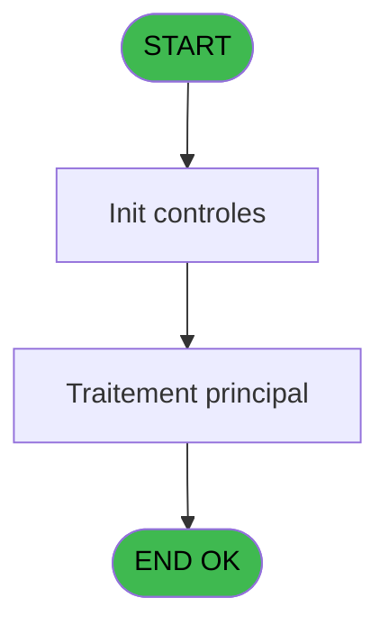
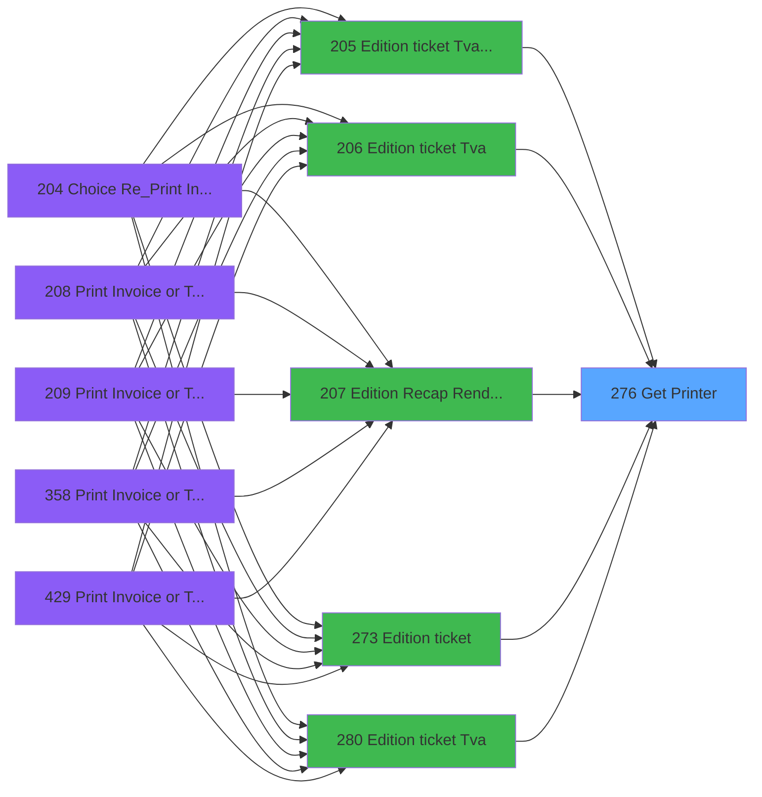

# PVE IDE 276 - Get Printer

> **Analyse**: Phases 1-4 2026-02-03 19:21 -> 19:22 (16s) | Assemblage 19:22
> **Pipeline**: V7.2 Enrichi
> **Structure**: 4 onglets (Resume | Ecrans | Donnees | Connexions)

<!-- TAB:Resume -->

## 1. FICHE D'IDENTITE

| Attribut | Valeur |
|----------|--------|
| Projet | PVE |
| IDE Position | 276 |
| Nom Programme | Get Printer |
| Fichier source | `Prg_276.xml` |
| Dossier IDE | Ticket |
| Taches | 3 (0 ecrans visibles) |
| Tables modifiees | 0 |
| Programmes appeles | 1 |

## 2. DESCRIPTION FONCTIONNELLE

**Get Printer** assure la gestion complete de ce processus, accessible depuis [Edition ticket (Tva) LEX (IDE 205)](PVE-IDE-205.md), [Edition ticket (Tva) (IDE 206)](PVE-IDE-206.md), [Edition Recap Rendez-vous (IDE 207)](PVE-IDE-207.md), [Edition ticket (IDE 273)](PVE-IDE-273.md), [Edition ticket (Tva) (IDE 280)](PVE-IDE-280.md), [Edition ticket (Tva) (IDE 362)](PVE-IDE-362.md), [Consultation Gift Pass (IDE 433)](PVE-IDE-433.md), [Edition ticket (Tva) (IDE 442)](PVE-IDE-442.md).

Le flux de traitement s'organise en **1 blocs fonctionnels** :

- **Impression** (3 taches) : generation de tickets et documents

## 3. BLOCS FONCTIONNELS

### 3.1 Impression (3 taches)

Generation des documents et tickets.

---

#### 276 - Get Printer

**Role** : Generation du document : Get Printer.

---

#### 276.1 - pms_print_param terminal

**Role** : Generation du document : pms_print_param terminal.

---

#### 276.2 - pms_print_param terminal

**Role** : Generation du document : pms_print_param terminal.

## 5. REGLES METIER

*(Aucune regle metier identifiee)*

## 6. CONTEXTE

- **Appele par**: [Edition ticket (Tva) LEX (IDE 205)](PVE-IDE-205.md), [Edition ticket (Tva) (IDE 206)](PVE-IDE-206.md), [Edition Recap Rendez-vous (IDE 207)](PVE-IDE-207.md), [Edition ticket (IDE 273)](PVE-IDE-273.md), [Edition ticket (Tva) (IDE 280)](PVE-IDE-280.md), [Edition ticket (Tva) (IDE 362)](PVE-IDE-362.md), [Consultation Gift Pass (IDE 433)](PVE-IDE-433.md), [Edition ticket (Tva) (IDE 442)](PVE-IDE-442.md)
- **Appelle**: 1 programmes | **Tables**: 3 (W:0 R:2 L:1) | **Taches**: 3 | **Expressions**: 20

<!-- TAB:Ecrans -->

## 8. ECRANS

*(Programme sans ecran visible)*

## 9. NAVIGATION

### 9.3 Structure hierarchique (3 taches)

| Position | Tache | Type | Dimensions | Bloc |
|----------|-------|------|------------|------|
| **276.1** | [**Get Printer** (276)](#t1) | MDI | - | Impression |
| 276.1.1 | [pms_print_param terminal (276.1)](#t2) | - | - | |
| 276.1.2 | [pms_print_param terminal (276.2)](#t3) | - | - | |

### 9.4 Algorigramme

> **Legende**: Vert = START/END OK | Rouge = END KO | Bleu = Decisions
> *Algorigramme auto-genere. Utiliser `/algorigramme` pour une synthese metier detaillee.*

<!-- TAB:Donnees -->

## 10. TABLES

### Tables utilisees (3)

| ID | Nom | Description | Type | R | W | L | Usages |
|----|-----|-------------|------|---|---|---|--------|
| 367 | pms_print_param_default |  | DB | R |   |   | 1 |
| 369 | presents_par_nationalite |  | DB |   |   | L | 1 |
| 370 | pv_accounting_date |  | DB | R |   |   | 2 |

### Colonnes par table (1 / 2 tables avec colonnes identifiees)

Table 367 - pms_print_param_default (R) - 1 usages

| Lettre | Variable | Acces | Type |
|--------|----------|-------|------|
| A | P Service | R | Alpha |
| B | v.Imprimante | R | Numeric |
| C | v.Copies | R | Numeric |

Table 370 - pv_accounting_date (R) - 2 usages

*Table utilisee uniquement en Link ou aucune colonne Real identifiee dans le DataView.*

## 11. VARIABLES

### 11.1 Parametres entrants (1)

Variables recues du programme appelant ([Edition ticket (Tva) LEX (IDE 205)](PVE-IDE-205.md)).

| Lettre | Nom | Type | Usage dans |
|--------|-----|------|-----------|
| A | P Service | Alpha | - |

### 11.2 Variables de session (2)

Variables persistantes pendant toute la session.

| Lettre | Nom | Type | Usage dans |
|--------|-----|------|-----------|
| B | v.Imprimante | Numeric | 4x session |
| C | v.Copies | Numeric | 1x session |

## 12. EXPRESSIONS

**20 / 20 expressions decodees (100%)**

### 12.1 Repartition par type

| Type | Expressions | Regles |
|------|-------------|--------|
| CONSTANTE | 3 | 0 |
| OTHER | 8 | 0 |
| CONDITION | 5 | 0 |
| NEGATION | 1 | 0 |
| REFERENCE_VG | 2 | 0 |
| FORMAT | 1 | 0 |

### 12.2 Expressions cles par type

#### CONSTANTE (3 expressions)

| Type | IDE | Expression | Regle |
|------|-----|------------|-------|
| CONSTANTE | 19 | `'ERR'` | - |
| CONSTANTE | 17 | `'Get printer'` | - |
| CONSTANTE | 16 | `'PARAM'` | - |

#### OTHER (8 expressions)

| Type | IDE | Expression | Regle |
|------|-----|------------|-------|
| OTHER | 7 | `SetParam ('CURRENTPRINTERNAME',[H])` | - |
| OTHER | 6 | `SetParam ('CURRENTPRINTERNUM',v.Imprimante [B])` | - |
| OTHER | 12 | `SetParam ('NUMBERCOPIES',1)` | - |
| OTHER | 10 | `SetParam ('NUMBERCOPIES',v.Copies [C])` | - |
| OTHER | 2 | `v.Imprimante [B]` | - |
| ... | | *+3 autres* | |

#### CONDITION (5 expressions)

| Type | IDE | Expression | Regle |
|------|-----|------------|-------|
| CONDITION | 11 | `GetParam ('NUMBERCOPIES')=0` | - |
| CONDITION | 15 | `v.Imprimante [B]=0 AND NOT VG104` | - |
| CONDITION | 9 | `GetParam ('CURRENTPRINTERNAME')='VOID'` | - |
| CONDITION | 3 | `SetParam ('CURRENTLISTINGNAME',IF (GetParam ('CODELANGUE')='FRA',[E],IF ([F]='',[E],[F])))` | - |
| CONDITION | 8 | `GetParam ('CURRENTPRINTERNUM')=0 OR GetParam ('CURRENTPRINTERNUM')=''` | - |

#### NEGATION (1 expressions)

| Type | IDE | Expression | Regle |
|------|-----|------------|-------|
| NEGATION | 13 | `NOT VG104` | - |

#### REFERENCE_VG (2 expressions)

| Type | IDE | Expression | Regle |
|------|-----|------------|-------|
| REFERENCE_VG | 20 | `VG10` | - |
| REFERENCE_VG | 14 | `VG104` | - |

#### FORMAT (1 expressions)

| Type | IDE | Expression | Regle |
|------|-----|------------|-------|
| FORMAT | 18 | `StrBuild('Unable to find a printer set up for @1@ and print number @2@', IF(VG104, GetHostName (), Str(VG105, 'N4')), Str(GetParam ('CURRENTLISTINGNUM'), 'N4'))` | - |

<!-- TAB:Connexions -->

## 13. GRAPHE D'APPELS

### 13.1 Chaine depuis Main (Callers)

Main -> ... -> [Edition ticket (Tva) LEX (IDE 205)](PVE-IDE-205.md) -> **Get Printer (IDE 276)**

Main -> ... -> [Edition ticket (Tva) (IDE 206)](PVE-IDE-206.md) -> **Get Printer (IDE 276)**

Main -> ... -> [Edition Recap Rendez-vous (IDE 207)](PVE-IDE-207.md) -> **Get Printer (IDE 276)**

Main -> ... -> [Edition ticket (IDE 273)](PVE-IDE-273.md) -> **Get Printer (IDE 276)**

Main -> ... -> [Edition ticket (Tva) (IDE 280)](PVE-IDE-280.md) -> **Get Printer (IDE 276)**

Main -> ... -> [Edition ticket (Tva) (IDE 362)](PVE-IDE-362.md) -> **Get Printer (IDE 276)**

Main -> ... -> [Consultation Gift Pass (IDE 433)](PVE-IDE-433.md) -> **Get Printer (IDE 276)**

Main -> ... -> [Edition ticket (Tva) (IDE 442)](PVE-IDE-442.md) -> **Get Printer (IDE 276)**

### 13.2 Callers

| IDE | Nom Programme | Nb Appels |
|-----|---------------|-----------|
| [205](PVE-IDE-205.md) | Edition ticket (Tva) LEX | 1 |
| [206](PVE-IDE-206.md) | Edition ticket (Tva) | 1 |
| [207](PVE-IDE-207.md) | Edition Recap Rendez-vous | 1 |
| [273](PVE-IDE-273.md) | Edition ticket | 1 |
| [280](PVE-IDE-280.md) | Edition ticket (Tva) | 1 |
| [362](PVE-IDE-362.md) | Edition ticket (Tva) | 1 |
| [433](PVE-IDE-433.md) | Consultation Gift Pass | 1 |
| [442](PVE-IDE-442.md) | Edition ticket (Tva) | 1 |

### 13.3 Callees (programmes appeles)

### 13.4 Detail Callees avec contexte

| IDE | Nom Programme | Appels | Contexte |
|-----|---------------|--------|----------|
| [277](PVE-IDE-277.md) | Set Village Address | 1 | Sous-programme |

## 14. RECOMMANDATIONS MIGRATION

### 14.1 Profil du programme

| Metrique | Valeur | Impact migration |
|----------|--------|-----------------|
| Lignes de logique | 52 | Programme compact |
| Expressions | 20 | Peu de logique |
| Tables WRITE | 0 | Impact faible |
| Sous-programmes | 1 | Peu de dependances |
| Ecrans visibles | 0 | Ecran unique ou traitement batch |
| Code desactive | 0% (0 / 52) | Code sain |
| Regles metier | 0 | Pas de regle identifiee |

### 14.2 Plan de migration par bloc

#### Impression (3 taches: 0 ecran, 3 traitements)

- **Strategie** : Templates HTML -> PDF via wkhtmltopdf ou Puppeteer.
- `PrintService` injectable avec choix imprimante

### 14.3 Dependances critiques

| Dependance | Type | Appels | Impact |
|------------|------|--------|--------|
| [Set Village Address (IDE 277)](PVE-IDE-277.md) | Sous-programme | 1x | Normale - Sous-programme |

---
*Spec DETAILED generee par Pipeline V7.2 - 2026-02-03 19:22*
