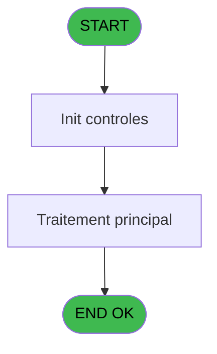
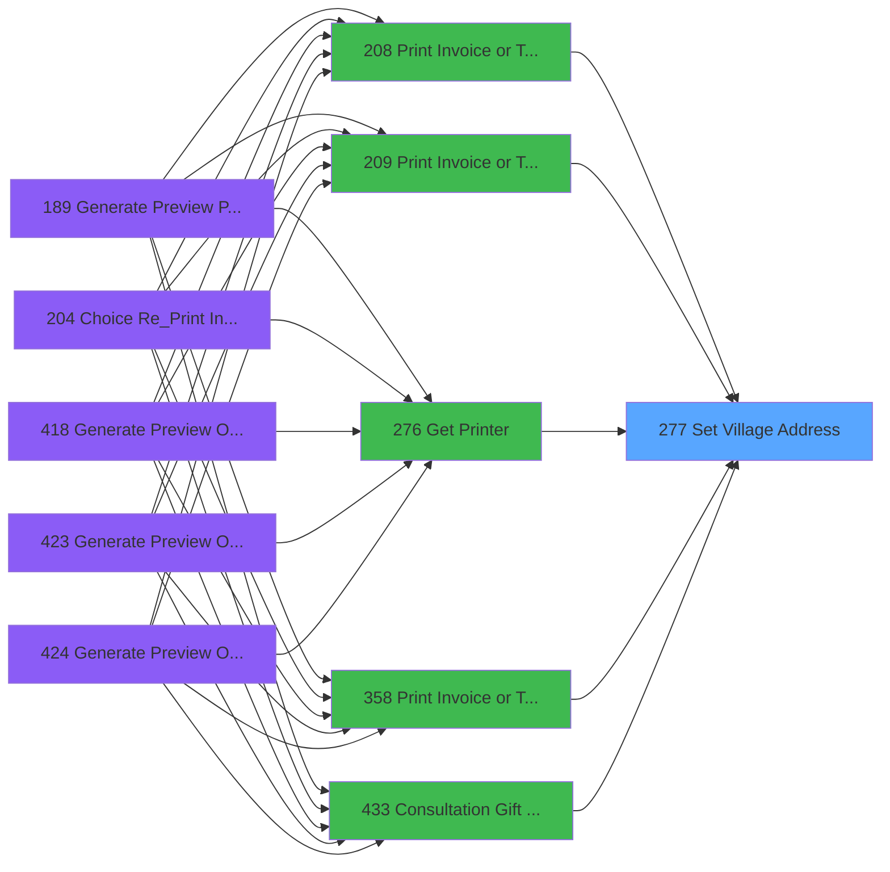

# PVE IDE 277 - Set Village Address

> **Analyse**: Phases 1-4 2026-02-03 19:22 -> 19:22 (13s) | Assemblage 19:22
> **Pipeline**: V7.2 Enrichi
> **Structure**: 4 onglets (Resume | Ecrans | Donnees | Connexions)

<!-- TAB:Resume -->

## 1. FICHE D'IDENTITE

| Attribut | Valeur |
|----------|--------|
| Projet | PVE |
| IDE Position | 277 |
| Nom Programme | Set Village Address |
| Fichier source | `Prg_277.xml` |
| Dossier IDE | Ticket |
| Taches | 1 (0 ecrans visibles) |
| Tables modifiees | 0 |
| Programmes appeles | 0 |

## 2. DESCRIPTION FONCTIONNELLE

**Set Village Address** assure la gestion complete de ce processus, accessible depuis [Print Invoice or Ticket (IDE 208)](PVE-IDE-208.md), [Print Invoice or Ticket-664 (IDE 209)](PVE-IDE-209.md), [Get Printer (IDE 276)](PVE-IDE-276.md), [Print Invoice or Ticket (IDE 358)](PVE-IDE-358.md), [Consultation Gift Pass (IDE 433)](PVE-IDE-433.md).

Le flux de traitement s'organise en **1 blocs fonctionnels** :

- **Traitement** (1 tache) : traitements metier divers

## 3. BLOCS FONCTIONNELS

### 3.1 Traitement (1 tache)

Traitements internes.

---

#### 277 - Set Village Address

**Role** : Traitement : Set Village Address.

## 5. REGLES METIER

*(Aucune regle metier identifiee)*

## 6. CONTEXTE

- **Appele par**: [Print Invoice or Ticket (IDE 208)](PVE-IDE-208.md), [Print Invoice or Ticket-664 (IDE 209)](PVE-IDE-209.md), [Get Printer (IDE 276)](PVE-IDE-276.md), [Print Invoice or Ticket (IDE 358)](PVE-IDE-358.md), [Consultation Gift Pass (IDE 433)](PVE-IDE-433.md)
- **Appelle**: 0 programmes | **Tables**: 3 (W:0 R:1 L:2) | **Taches**: 1 | **Expressions**: 16

<!-- TAB:Ecrans -->

## 8. ECRANS

*(Programme sans ecran visible)*

## 9. NAVIGATION

### 9.3 Structure hierarchique (1 tache)

| Position | Tache | Type | Dimensions | Bloc |
|----------|-------|------|------------|------|
| **277.1** | [**Set Village Address** (277)](#t1) | MDI | - | Traitement |

### 9.4 Algorigramme

> **Legende**: Vert = START/END OK | Rouge = END KO | Bleu = Decisions
> *Algorigramme auto-genere. Utiliser `/algorigramme` pour une synthese metier detaillee.*

<!-- TAB:Donnees -->

## 10. TABLES

### Tables utilisees (3)

| ID | Nom | Description | Type | R | W | L | Usages |
|----|-----|-------------|------|---|---|---|--------|
| 69 | initialisation___ini |  | DB | R |   |   | 1 |
| 372 | pv_budget |  | DB |   |   | L | 1 |
| 1490 | Table_1490 |  | MEM |   |   | L | 1 |

### Colonnes par table (1 / 1 tables avec colonnes identifiees)

Table 69 - initialisation___ini (R) - 1 usages

| Lettre | Variable | Acces | Type |
|--------|----------|-------|------|
| A | P.Service | R | Alpha |
| B | Buffer | R | Alpha |
| C | CounterTel | R | Numeric |
| D | CounterFax | R | Numeric |

## 11. VARIABLES

### 11.1 Parametres entrants (1)

Variables recues du programme appelant ([Print Invoice or Ticket (IDE 208)](PVE-IDE-208.md)).

| Lettre | Nom | Type | Usage dans |
|--------|-----|------|-----------|
| A | P.Service | Alpha | - |

### 11.2 Autres (3)

Variables diverses.

| Lettre | Nom | Type | Usage dans |
|--------|-----|------|-----------|
| B | Buffer | Alpha | - |
| C | CounterTel | Numeric | - |
| D | CounterFax | Numeric | - |

## 12. EXPRESSIONS

**16 / 16 expressions decodees (100%)**

### 12.1 Repartition par type

| Type | Expressions | Regles |
|------|-------------|--------|
| OTHER | 1 | 0 |
| REFERENCE_VG | 1 | 0 |
| STRING | 12 | 0 |
| CONDITION | 2 | 0 |

### 12.2 Expressions cles par type

#### OTHER (1 expressions)

| Type | IDE | Expression | Regle |
|------|-----|------------|-------|
| OTHER | 15 | `GetParam('SERVICE')` | - |

#### REFERENCE_VG (1 expressions)

| Type | IDE | Expression | Regle |
|------|-----|------------|-------|
| REFERENCE_VG | 16 | `VG120` | - |

#### STRING (12 expressions)

| Type | IDE | Expression | Regle |
|------|-----|------------|-------|
| STRING | 9 | `SetParam ('VI_FAXN',Trim([Y]))` | - |
| STRING | 8 | `SetParam ('VI_FAXN','Fax : ' &Trim([Y]))` | - |
| STRING | 7 | `SetParam ('VI_PHON',Trim([X]))` | - |
| STRING | 14 | `SetParam ('VI_VATN',Trim([AA]))` | - |
| STRING | 13 | `SetParam ('VI_SIRE',Trim([Z]))` | - |
| ... | | *+7 autres* | |

#### CONDITION (2 expressions)

| Type | IDE | Expression | Regle |
|------|-----|------------|-------|
| CONDITION | 12 | `SetParam ('VI_SIRE',IF(Trim([Z])<>'','Siret : '&Trim([Z]),''))` | - |
| CONDITION | 10 | `SetParam ('VI_MAIL',IF(Trim([AB])<>'','Email : '&Trim([AB]),''))` | - |

<!-- TAB:Connexions -->

## 13. GRAPHE D'APPELS

### 13.1 Chaine depuis Main (Callers)

Main -> ... -> [Print Invoice or Ticket (IDE 208)](PVE-IDE-208.md) -> **Set Village Address (IDE 277)**

Main -> ... -> [Print Invoice or Ticket-664 (IDE 209)](PVE-IDE-209.md) -> **Set Village Address (IDE 277)**

Main -> ... -> [Get Printer (IDE 276)](PVE-IDE-276.md) -> **Set Village Address (IDE 277)**

Main -> ... -> [Print Invoice or Ticket (IDE 358)](PVE-IDE-358.md) -> **Set Village Address (IDE 277)**

Main -> ... -> [Consultation Gift Pass (IDE 433)](PVE-IDE-433.md) -> **Set Village Address (IDE 277)**

### 13.2 Callers

| IDE | Nom Programme | Nb Appels |
|-----|---------------|-----------|
| [208](PVE-IDE-208.md) | Print Invoice or Ticket | 1 |
| [209](PVE-IDE-209.md) | Print Invoice or Ticket-664 | 1 |
| [276](PVE-IDE-276.md) | Get Printer | 1 |
| [358](PVE-IDE-358.md) | Print Invoice or Ticket | 1 |
| [433](PVE-IDE-433.md) | Consultation Gift Pass | 1 |

### 13.3 Callees (programmes appeles)

### 13.4 Detail Callees avec contexte

| IDE | Nom Programme | Appels | Contexte |
|-----|---------------|--------|----------|
| - | (aucun) | - | - |

## 14. RECOMMANDATIONS MIGRATION

### 14.1 Profil du programme

| Metrique | Valeur | Impact migration |
|----------|--------|-----------------|
| Lignes de logique | 62 | Programme compact |
| Expressions | 16 | Peu de logique |
| Tables WRITE | 0 | Impact faible |
| Sous-programmes | 0 | Peu de dependances |
| Ecrans visibles | 0 | Ecran unique ou traitement batch |
| Code desactive | 0% (0 / 62) | Code sain |
| Regles metier | 0 | Pas de regle identifiee |

### 14.2 Plan de migration par bloc

#### Traitement (1 tache: 0 ecran, 1 traitement)

- **Strategie** : 1 service(s) backend injectable(s) (Domain Services).
- Decomposer les taches en services unitaires testables.

### 14.3 Dependances critiques

| Dependance | Type | Appels | Impact |
|------------|------|--------|--------|

---
*Spec DETAILED generee par Pipeline V7.2 - 2026-02-03 19:22*
