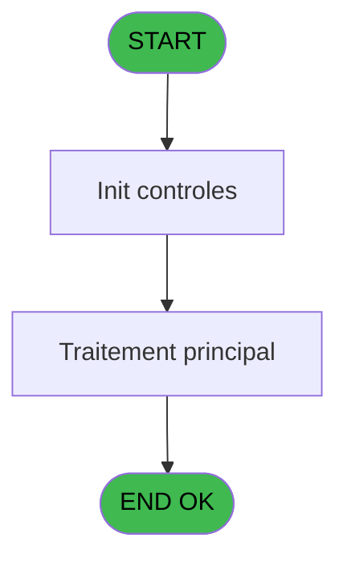
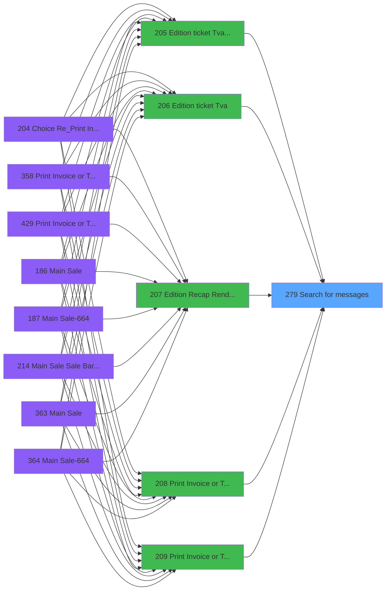

# PVE IDE 279 - Search  for messages

> **Analyse**: Phases 1-4 2026-02-03 19:22 -> 19:23 (12s) | Assemblage 19:23
> **Pipeline**: V7.2 Enrichi
> **Structure**: 4 onglets (Resume | Ecrans | Donnees | Connexions)

<!-- TAB:Resume -->

## 1. FICHE D'IDENTITE

| Attribut | Valeur |
|----------|--------|
| Projet | PVE |
| IDE Position | 279 |
| Nom Programme | Search  for messages |
| Fichier source | `Prg_279.xml` |
| Dossier IDE | Ticket |
| Taches | 3 (0 ecrans visibles) |
| Tables modifiees | 0 |
| Programmes appeles | 0 |

## 2. DESCRIPTION FONCTIONNELLE

**Search  for messages** assure la gestion complete de ce processus, accessible depuis [Edition ticket (Tva) LEX (IDE 205)](PVE-IDE-205.md), [Edition ticket (Tva) (IDE 206)](PVE-IDE-206.md), [Edition Recap Rendez-vous (IDE 207)](PVE-IDE-207.md), [Print Invoice or Ticket (IDE 208)](PVE-IDE-208.md), [Print Invoice or Ticket-664 (IDE 209)](PVE-IDE-209.md), [Edition ticket (IDE 273)](PVE-IDE-273.md), [Edition ticket (Tva) (IDE 280)](PVE-IDE-280.md), [Edition ticket (Tva) (IDE 362)](PVE-IDE-362.md), [Edition ticket (Tva) (IDE 442)](PVE-IDE-442.md).

Le flux de traitement s'organise en **2 blocs fonctionnels** :

- **Validation** (2 taches) : controles et verifications de coherence
- **Traitement** (1 tache) : traitements metier divers

Detail : phases du traitement

#### Phase 1 : Traitement (1 tache)

- **279** - Search  for messages **[[ECRAN]](#ecran-t1)**

#### Phase 2 : Validation (2 taches)

- **279.1** - Si message en cours de validit **[[ECRAN]](#ecran-t2)**
- **279.2** - Si message en cours de validit **[[ECRAN]](#ecran-t3)**

## 3. BLOCS FONCTIONNELS

### 3.1 Traitement (1 tache)

Traitements internes.

---

#### 279 - Search  for messages [[ECRAN]](#ecran-t1)

**Role** : Traitement : Search  for messages.
**Ecran** : 486 x 236 DLU | [Voir mockup](#ecran-t1)

### 3.2 Validation (2 taches)

Controles de coherence : 2 taches verifient les donnees et conditions.

---

#### 279.1 - Si message en cours de validit [[ECRAN]](#ecran-t2)

**Role** : Verification : Si message en cours de validit.
**Ecran** : 536 x 0 DLU | [Voir mockup](#ecran-t2)
**Variables liees** : A (P.Message), B (V.Message person. Ok), C (V.Message Defaut Ok)

---

#### 279.2 - Si message en cours de validit [[ECRAN]](#ecran-t3)

**Role** : Verification : Si message en cours de validit.
**Ecran** : 536 x 0 DLU | [Voir mockup](#ecran-t3)
**Variables liees** : A (P.Message), B (V.Message person. Ok), C (V.Message Defaut Ok)

## 5. REGLES METIER

*(Aucune regle metier identifiee)*

## 6. CONTEXTE

- **Appele par**: [Edition ticket (Tva) LEX (IDE 205)](PVE-IDE-205.md), [Edition ticket (Tva) (IDE 206)](PVE-IDE-206.md), [Edition Recap Rendez-vous (IDE 207)](PVE-IDE-207.md), [Print Invoice or Ticket (IDE 208)](PVE-IDE-208.md), [Print Invoice or Ticket-664 (IDE 209)](PVE-IDE-209.md), [Edition ticket (IDE 273)](PVE-IDE-273.md), [Edition ticket (Tva) (IDE 280)](PVE-IDE-280.md), [Edition ticket (Tva) (IDE 362)](PVE-IDE-362.md), [Edition ticket (Tva) (IDE 442)](PVE-IDE-442.md)
- **Appelle**: 0 programmes | **Tables**: 1 (W:0 R:1 L:0) | **Taches**: 3 | **Expressions**: 1

<!-- TAB:Ecrans -->

## 8. ECRANS

*(Programme sans ecran visible)*

## 9. NAVIGATION

### 9.3 Structure hierarchique (3 taches)

| Position | Tache | Type | Dimensions | Bloc |
|----------|-------|------|------------|------|
| **279.1** | [**Search  for messages** (279)](#t1) [mockup](#ecran-t1) | - | 486x236 | Traitement |
| **279.2** | [**Si message en cours de validit** (279.1)](#t2) [mockup](#ecran-t2) | - | 536x0 | Validation |
| 279.2.1 | [Si message en cours de validit (279.2)](#t3) [mockup](#ecran-t3) | - | 536x0 | |

### 9.4 Algorigramme

> **Legende**: Vert = START/END OK | Rouge = END KO | Bleu = Decisions
> *Algorigramme auto-genere. Utiliser `/algorigramme` pour une synthese metier detaillee.*

<!-- TAB:Donnees -->

## 10. TABLES

### Tables utilisees (1)

| ID | Nom | Description | Type | R | W | L | Usages |
|----|-----|-------------|------|---|---|---|--------|
| 866 | maj_appli_tpe |  | DB | R |   |   | 2 |

### Colonnes par table (0 / 1 tables avec colonnes identifiees)

Table 866 - maj_appli_tpe (R) - 2 usages

*Table utilisee uniquement en Link ou aucune colonne Real identifiee dans le DataView.*

## 11. VARIABLES

### 11.1 Parametres entrants (1)

Variables recues du programme appelant ([Edition ticket (Tva) LEX (IDE 205)](PVE-IDE-205.md)).

| Lettre | Nom | Type | Usage dans |
|--------|-----|------|-----------|
| A | P.Message | Alpha | 1x parametre entrant |

### 11.2 Variables de session (2)

Variables persistantes pendant toute la session.

| Lettre | Nom | Type | Usage dans |
|--------|-----|------|-----------|
| B | V.Message person. Ok | Logical | - |
| C | V.Message Defaut Ok | Logical | - |

## 12. EXPRESSIONS

**1 / 1 expressions decodees (100%)**

### 12.1 Repartition par type

| Type | Expressions | Regles |
|------|-------------|--------|
| CONDITION | 1 | 0 |

### 12.2 Expressions cles par type

#### CONDITION (1 expressions)

| Type | IDE | Expression | Regle |
|------|-----|------------|-------|
| CONDITION | 1 | `Trim(P.Message [A])=''` | - |

<!-- TAB:Connexions -->

## 13. GRAPHE D'APPELS

### 13.1 Chaine depuis Main (Callers)

Main -> ... -> [Edition ticket (Tva) LEX (IDE 205)](PVE-IDE-205.md) -> **Search  for messages (IDE 279)**

Main -> ... -> [Edition ticket (Tva) (IDE 206)](PVE-IDE-206.md) -> **Search  for messages (IDE 279)**

Main -> ... -> [Edition Recap Rendez-vous (IDE 207)](PVE-IDE-207.md) -> **Search  for messages (IDE 279)**

Main -> ... -> [Print Invoice or Ticket (IDE 208)](PVE-IDE-208.md) -> **Search  for messages (IDE 279)**

Main -> ... -> [Print Invoice or Ticket-664 (IDE 209)](PVE-IDE-209.md) -> **Search  for messages (IDE 279)**

Main -> ... -> [Edition ticket (IDE 273)](PVE-IDE-273.md) -> **Search  for messages (IDE 279)**

Main -> ... -> [Edition ticket (Tva) (IDE 280)](PVE-IDE-280.md) -> **Search  for messages (IDE 279)**

Main -> ... -> [Edition ticket (Tva) (IDE 362)](PVE-IDE-362.md) -> **Search  for messages (IDE 279)**

Main -> ... -> [Edition ticket (Tva) (IDE 442)](PVE-IDE-442.md) -> **Search  for messages (IDE 279)**

### 13.2 Callers

| IDE | Nom Programme | Nb Appels |
|-----|---------------|-----------|
| [205](PVE-IDE-205.md) | Edition ticket (Tva) LEX | 1 |
| [206](PVE-IDE-206.md) | Edition ticket (Tva) | 1 |
| [207](PVE-IDE-207.md) | Edition Recap Rendez-vous | 1 |
| [208](PVE-IDE-208.md) | Print Invoice or Ticket | 1 |
| [209](PVE-IDE-209.md) | Print Invoice or Ticket-664 | 1 |
| [273](PVE-IDE-273.md) | Edition ticket | 1 |
| [280](PVE-IDE-280.md) | Edition ticket (Tva) | 1 |
| [362](PVE-IDE-362.md) | Edition ticket (Tva) | 1 |
| [442](PVE-IDE-442.md) | Edition ticket (Tva) | 1 |

### 13.3 Callees (programmes appeles)

### 13.4 Detail Callees avec contexte

| IDE | Nom Programme | Appels | Contexte |
|-----|---------------|--------|----------|
| - | (aucun) | - | - |

## 14. RECOMMANDATIONS MIGRATION

### 14.1 Profil du programme

| Metrique | Valeur | Impact migration |
|----------|--------|-----------------|
| Lignes de logique | 27 | Programme compact |
| Expressions | 1 | Peu de logique |
| Tables WRITE | 0 | Impact faible |
| Sous-programmes | 0 | Peu de dependances |
| Ecrans visibles | 0 | Ecran unique ou traitement batch |
| Code desactive | 0% (0 / 27) | Code sain |
| Regles metier | 0 | Pas de regle identifiee |

### 14.2 Plan de migration par bloc

#### Traitement (1 tache: 1 ecran, 0 traitement)

- **Strategie** : 1 composant(s) UI (Razor/React) avec formulaires et validation.
- Decomposer les taches en services unitaires testables.

#### Validation (2 taches: 2 ecrans, 0 traitement)

- **Strategie** : FluentValidation avec validators specifiques.
- Chaque tache de validation -> un validator injectable

### 14.3 Dependances critiques

| Dependance | Type | Appels | Impact |
|------------|------|--------|--------|

---
*Spec DETAILED generee par Pipeline V7.2 - 2026-02-03 19:23*
