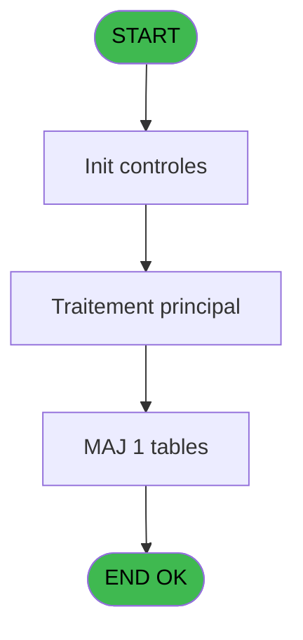
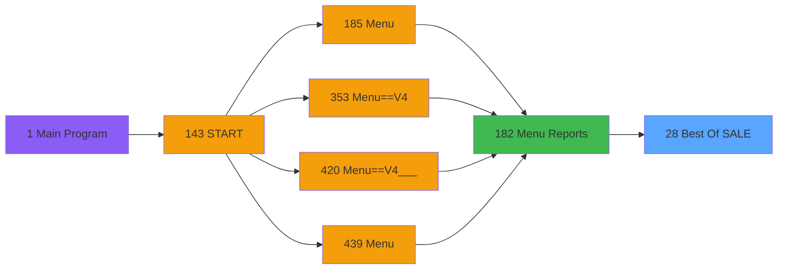

# PVE IDE 28 - Best Of (SALE)

> **Analyse**: Phases 1-4 2026-02-03 01:15 -> 01:16 (36s) | Assemblage 01:16
> **Pipeline**: V7.2 Enrichi
> **Structure**: 4 onglets (Resume | Ecrans | Donnees | Connexions)

<!-- TAB:Resume -->

## 1. FICHE D'IDENTITE

| Attribut | Valeur |
|----------|--------|
| Projet | PVE |
| IDE Position | 28 |
| Nom Programme | Best Of (SALE) |
| Fichier source | `Prg_28.xml` |
| Domaine metier | General |
| Taches | 7 (0 ecrans visibles) |
| Tables modifiees | 1 |
| Programmes appeles | 1 |

## 2. DESCRIPTION FONCTIONNELLE

**Best Of (SALE)** assure la gestion complete de ce processus, accessible depuis [Menu Reports (IDE 182)](PVE-IDE-182.md).

Le flux de traitement s'organise en **4 blocs fonctionnels** :

- **Impression** (3 taches) : generation de tickets et documents
- **Traitement** (2 taches) : traitements metier divers
- **Consultation** (1 tache) : ecrans de recherche, selection et consultation
- **Calcul** (1 tache) : calculs de montants, stocks ou compteurs

**Donnees modifiees** : 1 tables en ecriture (comptes_speciaux_spc_cash).

Detail : phases du traitement

#### Phase 1 : Impression (3 taches)

- **28** - Print Best Of **[[ECRAN]](#ecran-t1)**
- **28.1** - Print **[[ECRAN]](#ecran-t2)**
- **28.1.2** - Printing

#### Phase 2 : Consultation (1 tache)

- **28.1.1** - SELECTION **[[ECRAN]](#ecran-t3)**

Delegue a : [Get Temp Files (IDE 46)](PVE-IDE-46.md)

#### Phase 3 : Calcul (1 tache)

- **28.1.1.1** - Selection compta

#### Phase 4 : Traitement (2 taches)

- **28.1.1.1.1** - Temp generation
- **28.1.2.1** - Best of line

Delegue a : [Get Temp Files (IDE 46)](PVE-IDE-46.md)

#### Tables impactees

| Table | Operations | Role metier |
|-------|-----------|-------------|
| comptes_speciaux_spc_cash | **W**/L (2 usages) | Comptes GM (generaux) |

## 3. BLOCS FONCTIONNELS

### 3.1 Impression (3 taches)

Generation des documents et tickets.

---

#### 28 - Print Best Of [[ECRAN]](#ecran-t1)

**Role** : Generation du document : Print Best Of.
**Ecran** : 312 x 173 DLU (MDI) | [Voir mockup](#ecran-t1)

---

#### 28.1 - Print [[ECRAN]](#ecran-t2)

**Role** : Generation du document : Print.
**Ecran** : 591 x 382 DLU (MDI) | [Voir mockup](#ecran-t2)

---

#### 28.1.2 - Printing

**Role** : Generation du document : Printing.

### 3.2 Consultation (1 tache)

Ecrans de recherche et consultation.

---

#### 28.1.1 - SELECTION [[ECRAN]](#ecran-t3)

**Role** : Selection par l'operateur : SELECTION.
**Ecran** : 583 x 388 DLU (MDI) | [Voir mockup](#ecran-t3)

### 3.3 Calcul (1 tache)

Calculs metier : montants, stocks, compteurs.

---

#### 28.1.1.1 - Selection compta

**Role** : Selection par l'operateur : Selection compta.

### 3.4 Traitement (2 taches)

Traitements internes.

---

#### 28.1.1.1.1 - Temp generation

**Role** : Traitement : Temp generation.
**Delegue a** : [Get Temp Files (IDE 46)](PVE-IDE-46.md)

---

#### 28.1.2.1 - Best of line

**Role** : Traitement : Best of line.
**Delegue a** : [Get Temp Files (IDE 46)](PVE-IDE-46.md)

## 5. REGLES METIER

*(Aucune regle metier identifiee)*

## 6. CONTEXTE

- **Appele par**: [Menu Reports (IDE 182)](PVE-IDE-182.md)
- **Appelle**: 1 programmes | **Tables**: 4 (W:1 R:3 L:1) | **Taches**: 7 | **Expressions**: 2

<!-- TAB:Ecrans -->

## 8. ECRANS

*(Programme sans ecran visible)*

## 9. NAVIGATION

### 9.3 Structure hierarchique (7 taches)

| Position | Tache | Type | Dimensions | Bloc |
|----------|-------|------|------------|------|
| **28.1** | [**Print Best Of** (28)](#t1) [mockup](#ecran-t1) | MDI | 312x173 | Impression |
| 28.1.1 | [Print (28.1)](#t2) [mockup](#ecran-t2) | MDI | 591x382 | |
| 28.1.2 | [Printing (28.1.2)](#t6) | MDI | - | |
| **28.2** | [**SELECTION** (28.1.1)](#t3) [mockup](#ecran-t3) | MDI | 583x388 | Consultation |
| **28.3** | [**Selection compta** (28.1.1.1)](#t4) | MDI | - | Calcul |
| **28.4** | [**Temp generation** (28.1.1.1.1)](#t5) | MDI | - | Traitement |
| 28.4.1 | [Best of line (28.1.2.1)](#t7) | MDI | - | |

### 9.4 Algorigramme

> **Legende**: Vert = START/END OK | Rouge = END KO | Bleu = Decisions
> *Algorigramme auto-genere. Utiliser `/algorigramme` pour une synthese metier detaillee.*

<!-- TAB:Donnees -->

## 10. TABLES

### Tables utilisees (4)

| ID | Nom | Description | Type | R | W | L | Usages |
|----|-----|-------------|------|---|---|---|--------|
| 403 | pv_sellers |  | DB | R |   |   | 1 |
| 523 | synthese_garanties | Depots et garanties | TMP | R |   |   | 1 |
| 758 | comptes_speciaux_spc_cash | Comptes GM (generaux) | DB |   | **W** | L | 2 |
| 1471 | Table_1471 |  | MEM | R |   |   | 1 |

### Colonnes par table (0 / 4 tables avec colonnes identifiees)

Table 403 - pv_sellers (R) - 1 usages

*Table utilisee uniquement en Link ou aucune colonne Real identifiee dans le DataView.*

Table 523 - synthese_garanties (R) - 1 usages

*Table utilisee uniquement en Link ou aucune colonne Real identifiee dans le DataView.*

Table 758 - comptes_speciaux_spc_cash (**W**/L) - 2 usages

*Table utilisee uniquement en Link ou aucune colonne Real identifiee dans le DataView.*

Table 1471 - Table_1471 (R) - 1 usages

*Table utilisee uniquement en Link ou aucune colonne Real identifiee dans le DataView.*

## 11. VARIABLES

### 11.1 Parametres entrants (7)

Variables recues du programme appelant ([Menu Reports (IDE 182)](PVE-IDE-182.md)).

| Lettre | Nom | Type | Usage dans |
|--------|-----|------|-----------|
| A | P. Village name | Alpha | - |
| B | P. Currency | Alpha | - |
| C | P. Amount format | Alpha | - |
| D | P. Amount format sans Z | Alpha | - |
| E | P. Decimales | Numeric | - |
| F | P Date mini | Date | - |
| G | P Date maxi | Date | 1x parametre entrant |

### 11.2 Autres (1)

Variables diverses.

| Lettre | Nom | Type | Usage dans |
|--------|-----|------|-----------|
| H | S | Alpha | - |

## 12. EXPRESSIONS

**2 / 2 expressions decodees (100%)**

### 12.1 Repartition par type

| Type | Expressions | Regles |
|------|-------------|--------|
| CONDITION | 1 | 0 |
| REFERENCE_VG | 1 | 0 |

### 12.2 Expressions cles par type

#### CONDITION (1 expressions)

| Type | IDE | Expression | Regle |
|------|-----|------------|-------|
| CONDITION | 1 | `P Date maxi [G]<>'00/00/0000'DATE` | - |

#### REFERENCE_VG (1 expressions)

| Type | IDE | Expression | Regle |
|------|-----|------------|-------|
| REFERENCE_VG | 2 | `VG37` | - |

<!-- TAB:Connexions -->

## 13. GRAPHE D'APPELS

### 13.1 Chaine depuis Main (Callers)

Main -> ... -> [Menu Reports (IDE 182)](PVE-IDE-182.md) -> **Best Of (SALE) (IDE 28)**

### 13.2 Callers

| IDE | Nom Programme | Nb Appels |
|-----|---------------|-----------|
| [182](PVE-IDE-182.md) | Menu Reports | 1 |

### 13.3 Callees (programmes appeles)

### 13.4 Detail Callees avec contexte

| IDE | Nom Programme | Appels | Contexte |
|-----|---------------|--------|----------|
| [46](PVE-IDE-46.md) | Get Temp Files | 1 | Recuperation donnees |

## 14. RECOMMANDATIONS MIGRATION

### 14.1 Profil du programme

| Metrique | Valeur | Impact migration |
|----------|--------|-----------------|
| Lignes de logique | 91 | Programme compact |
| Expressions | 2 | Peu de logique |
| Tables WRITE | 1 | Impact faible |
| Sous-programmes | 1 | Peu de dependances |
| Ecrans visibles | 0 | Ecran unique ou traitement batch |
| Code desactive | 0% (0 / 91) | Code sain |
| Regles metier | 0 | Pas de regle identifiee |

### 14.2 Plan de migration par bloc

#### Impression (3 taches: 2 ecrans, 1 traitement)

- **Strategie** : Templates HTML -> PDF via wkhtmltopdf ou Puppeteer.
- `PrintService` injectable avec choix imprimante

#### Consultation (1 tache: 1 ecran, 0 traitement)

- **Strategie** : Composants de recherche/selection en modales.
- 1 ecran : SELECTION

#### Calcul (1 tache: 0 ecran, 1 traitement)

- **Strategie** : Services de calcul purs (Domain Services).
- Migrer la logique de calcul (stock, compteurs, montants)

#### Traitement (2 taches: 0 ecran, 2 traitements)

- **Strategie** : 2 service(s) backend injectable(s) (Domain Services).
- 1 sous-programme(s) a migrer ou a reutiliser depuis les services existants.
- Decomposer les taches en services unitaires testables.

### 14.3 Dependances critiques

| Dependance | Type | Appels | Impact |
|------------|------|--------|--------|
| comptes_speciaux_spc_cash | Table WRITE (Database) | 1x | Schema + repository |
| [Get Temp Files (IDE 46)](PVE-IDE-46.md) | Sous-programme | 1x | Normale - Recuperation donnees |

---
*Spec DETAILED generee par Pipeline V7.2 - 2026-02-03 01:16*
