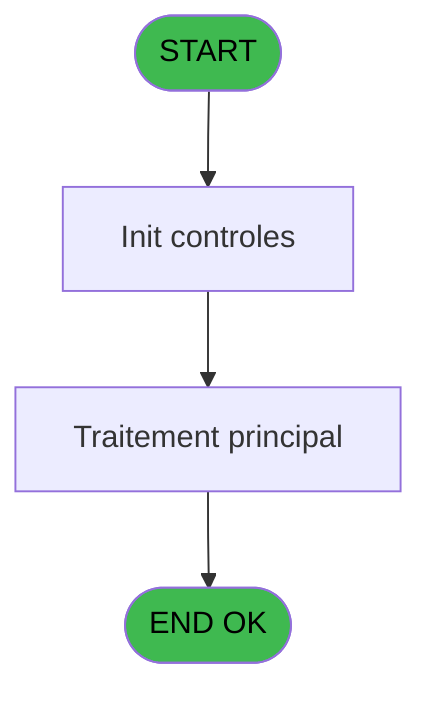
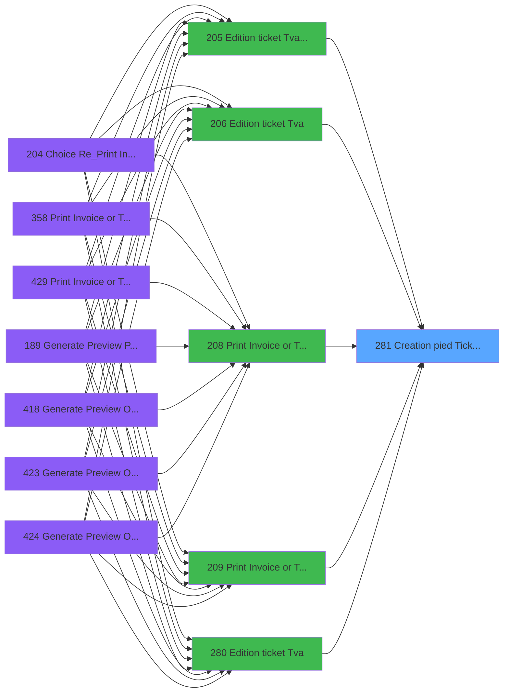

# PVE IDE 281 - Creation pied Ticket(Tva)

> **Analyse**: Phases 1-4 2026-02-03 19:23 -> 19:23 (13s) | Assemblage 19:23
> **Pipeline**: V7.2 Enrichi
> **Structure**: 4 onglets (Resume | Ecrans | Donnees | Connexions)

<!-- TAB:Resume -->

## 1. FICHE D'IDENTITE

| Attribut | Valeur |
|----------|--------|
| Projet | PVE |
| IDE Position | 281 |
| Nom Programme | Creation pied Ticket(Tva) |
| Fichier source | `Prg_281.xml` |
| Dossier IDE | TPE |
| Taches | 1 (0 ecrans visibles) |
| Tables modifiees | 0 |
| Programmes appeles | 0 |

## 2. DESCRIPTION FONCTIONNELLE

**Creation pied Ticket(Tva)** assure la gestion complete de ce processus, accessible depuis [Edition ticket (Tva) LEX (IDE 205)](PVE-IDE-205.md), [Edition ticket (Tva) (IDE 206)](PVE-IDE-206.md), [Edition ticket (Tva) (IDE 280)](PVE-IDE-280.md), [Edition ticket (Tva) (IDE 362)](PVE-IDE-362.md), [Edition ticket (Tva) (IDE 442)](PVE-IDE-442.md), [Print Invoice or Ticket (IDE 208)](PVE-IDE-208.md), [Print Invoice or Ticket-664 (IDE 209)](PVE-IDE-209.md).

Le flux de traitement s'organise en **1 blocs fonctionnels** :

- **Impression** (1 tache) : generation de tickets et documents

## 3. BLOCS FONCTIONNELS

### 3.1 Impression (1 tache)

Generation des documents et tickets.

---

#### 281 - Creation pied Ticket(Tva)

**Role** : Generation du document : Creation pied Ticket(Tva).

## 5. REGLES METIER

*(Aucune regle metier identifiee)*

## 6. CONTEXTE

- **Appele par**: [Edition ticket (Tva) LEX (IDE 205)](PVE-IDE-205.md), [Edition ticket (Tva) (IDE 206)](PVE-IDE-206.md), [Edition ticket (Tva) (IDE 280)](PVE-IDE-280.md), [Edition ticket (Tva) (IDE 362)](PVE-IDE-362.md), [Edition ticket (Tva) (IDE 442)](PVE-IDE-442.md), [Print Invoice or Ticket (IDE 208)](PVE-IDE-208.md), [Print Invoice or Ticket-664 (IDE 209)](PVE-IDE-209.md)
- **Appelle**: 0 programmes | **Tables**: 2 (W:0 R:1 L:1) | **Taches**: 1 | **Expressions**: 17

<!-- TAB:Ecrans -->

## 8. ECRANS

*(Programme sans ecran visible)*

## 9. NAVIGATION

### 9.3 Structure hierarchique (1 tache)

| Position | Tache | Type | Dimensions | Bloc |
|----------|-------|------|------------|------|
| **281.1** | [**Creation pied Ticket(Tva)** (281)](#t1) | - | - | Impression |

### 9.4 Algorigramme

> **Legende**: Vert = START/END OK | Rouge = END KO | Bleu = Decisions
> *Algorigramme auto-genere. Utiliser `/algorigramme` pour une synthese metier detaillee.*

<!-- TAB:Donnees -->

## 10. TABLES

### Tables utilisees (2)

| ID | Nom | Description | Type | R | W | L | Usages |
|----|-----|-------------|------|---|---|---|--------|
| 417 | pv_weight |  | DB | R |   |   | 1 |
| 868 | Affectation_Gift_Pass |  | DB |   |   | L | 1 |

### Colonnes par table (1 / 1 tables avec colonnes identifiees)

Table 417 - pv_weight (R) - 1 usages

| Lettre | Variable | Acces | Type |
|--------|----------|-------|------|
| A | P.Societe | R | Alpha |
| B | P.Compte_Gm | R | Numeric |
| C | P.filiation | R | Numeric |
| D | P.Taux | R | Numeric |
| E | P.Montant Ht | R | Numeric |
| F | P.Montant Tva | R | Numeric |
| G | P.Montant Ttc | R | Numeric |
| H | P Service | R | Alpha |

## 11. VARIABLES

### 11.1 Parametres entrants (8)

Variables recues du programme appelant ([Edition ticket (Tva) LEX (IDE 205)](PVE-IDE-205.md)).

| Lettre | Nom | Type | Usage dans |
|--------|-----|------|-----------|
| A | P.Societe | Alpha | 1x parametre entrant |
| B | P.Compte_Gm | Numeric | 1x parametre entrant |
| C | P.filiation | Numeric | 1x parametre entrant |
| D | P.Taux | Numeric | 2x parametre entrant |
| E | P.Montant Ht | Numeric | 2x parametre entrant |
| F | P.Montant Tva | Numeric | 2x parametre entrant |
| G | P.Montant Ttc | Numeric | 2x parametre entrant |
| H | P Service | Alpha | 1x parametre entrant |

## 12. EXPRESSIONS

**17 / 17 expressions decodees (100%)**

### 12.1 Repartition par type

| Type | Expressions | Regles |
|------|-------------|--------|
| CALCULATION | 6 | 0 |
| CONSTANTE | 2 | 0 |
| OTHER | 7 | 0 |
| NEGATION | 1 | 0 |
| STRING | 1 | 0 |

### 12.2 Expressions cles par type

#### CALCULATION (6 expressions)

| Type | IDE | Expression | Regle |
|------|-----|------------|-------|
| CALCULATION | 10 | `[AB]+P.Montant Ht [E]` | - |
| CALCULATION | 11 | `[AC]+P.Montant Tva [F]` | - |
| CALCULATION | 12 | `[AD]+P.Montant Ttc [G]` | - |
| CALCULATION | 6 | `[R]+P.Montant Ht [E]` | - |
| CALCULATION | 7 | `[S]+P.Montant Tva [F]` | - |
| ... | | *+1 autres* | |

#### CONSTANTE (2 expressions)

| Type | IDE | Expression | Regle |
|------|-----|------------|-------|
| CONSTANTE | 15 | `''` | - |
| CONSTANTE | 9 | `999` | - |

#### OTHER (7 expressions)

| Type | IDE | Expression | Regle |
|------|-----|------------|-------|
| OTHER | 13 | `P Service [H]` | - |
| OTHER | 16 | `P.Taux [D]` | - |
| OTHER | 17 | `[K]` | - |
| OTHER | 5 | `P.Taux [D]` | - |
| OTHER | 1 | `P.Societe [A]` | - |
| ... | | *+2 autres* | |

#### NEGATION (1 expressions)

| Type | IDE | Expression | Regle |
|------|-----|------------|-------|
| NEGATION | 14 | `NOT VG113` | - |

#### STRING (1 expressions)

| Type | IDE | Expression | Regle |
|------|-----|------------|-------|
| STRING | 4 | `Val(Fill ('9',10),'10')` | - |

<!-- TAB:Connexions -->

## 13. GRAPHE D'APPELS

### 13.1 Chaine depuis Main (Callers)

Main -> ... -> [Edition ticket (Tva) LEX (IDE 205)](PVE-IDE-205.md) -> **Creation pied Ticket(Tva) (IDE 281)**

Main -> ... -> [Edition ticket (Tva) (IDE 206)](PVE-IDE-206.md) -> **Creation pied Ticket(Tva) (IDE 281)**

Main -> ... -> [Edition ticket (Tva) (IDE 280)](PVE-IDE-280.md) -> **Creation pied Ticket(Tva) (IDE 281)**

Main -> ... -> [Edition ticket (Tva) (IDE 362)](PVE-IDE-362.md) -> **Creation pied Ticket(Tva) (IDE 281)**

Main -> ... -> [Edition ticket (Tva) (IDE 442)](PVE-IDE-442.md) -> **Creation pied Ticket(Tva) (IDE 281)**

Main -> ... -> [Print Invoice or Ticket (IDE 208)](PVE-IDE-208.md) -> **Creation pied Ticket(Tva) (IDE 281)**

Main -> ... -> [Print Invoice or Ticket-664 (IDE 209)](PVE-IDE-209.md) -> **Creation pied Ticket(Tva) (IDE 281)**

### 13.2 Callers

| IDE | Nom Programme | Nb Appels |
|-----|---------------|-----------|
| [205](PVE-IDE-205.md) | Edition ticket (Tva) LEX | 5 |
| [206](PVE-IDE-206.md) | Edition ticket (Tva) | 5 |
| [280](PVE-IDE-280.md) | Edition ticket (Tva) | 5 |
| [362](PVE-IDE-362.md) | Edition ticket (Tva) | 5 |
| [442](PVE-IDE-442.md) | Edition ticket (Tva) | 5 |
| [208](PVE-IDE-208.md) | Print Invoice or Ticket | 2 |
| [209](PVE-IDE-209.md) | Print Invoice or Ticket-664 | 2 |

### 13.3 Callees (programmes appeles)

### 13.4 Detail Callees avec contexte

| IDE | Nom Programme | Appels | Contexte |
|-----|---------------|--------|----------|
| - | (aucun) | - | - |

## 14. RECOMMANDATIONS MIGRATION

### 14.1 Profil du programme

| Metrique | Valeur | Impact migration |
|----------|--------|-----------------|
| Lignes de logique | 49 | Programme compact |
| Expressions | 17 | Peu de logique |
| Tables WRITE | 0 | Impact faible |
| Sous-programmes | 0 | Peu de dependances |
| Ecrans visibles | 0 | Ecran unique ou traitement batch |
| Code desactive | 0% (0 / 49) | Code sain |
| Regles metier | 0 | Pas de regle identifiee |

### 14.2 Plan de migration par bloc

#### Impression (1 tache: 0 ecran, 1 traitement)

- **Strategie** : Templates HTML -> PDF via wkhtmltopdf ou Puppeteer.
- `PrintService` injectable avec choix imprimante

### 14.3 Dependances critiques

| Dependance | Type | Appels | Impact |
|------------|------|--------|--------|

---
*Spec DETAILED generee par Pipeline V7.2 - 2026-02-03 19:23*
