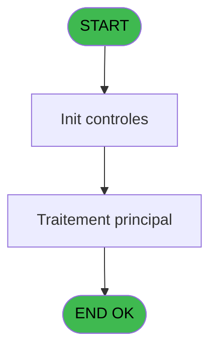
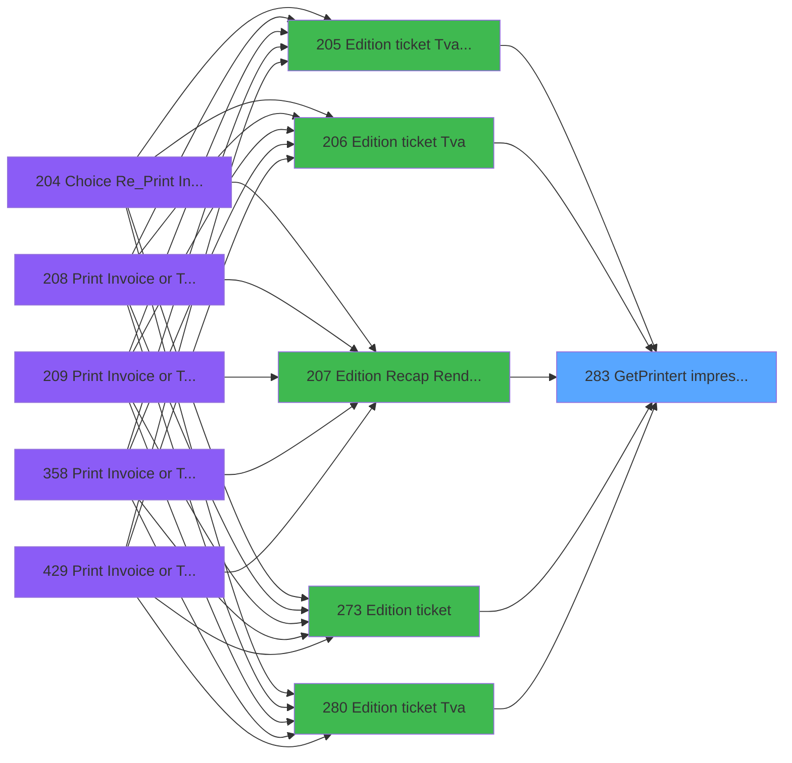

# PVE IDE 283 - GetPrinter/t impression

> **Analyse**: Phases 1-4 2026-02-03 19:24 -> 19:24 (12s) | Assemblage 19:24
> **Pipeline**: V7.2 Enrichi
> **Structure**: 4 onglets (Resume | Ecrans | Donnees | Connexions)

<!-- TAB:Resume -->

## 1. FICHE D'IDENTITE

| Attribut | Valeur |
|----------|--------|
| Projet | PVE |
| IDE Position | 283 |
| Nom Programme | GetPrinter/t impression |
| Fichier source | `Prg_283.xml` |
| Dossier IDE | TPE |
| Taches | 3 (0 ecrans visibles) |
| Tables modifiees | 0 |
| Programmes appeles | 0 |

## 2. DESCRIPTION FONCTIONNELLE

**GetPrinter/t impression** assure la gestion complete de ce processus, accessible depuis [Edition ticket (Tva) LEX (IDE 205)](PVE-IDE-205.md), [Edition ticket (Tva) (IDE 206)](PVE-IDE-206.md), [Edition Recap Rendez-vous (IDE 207)](PVE-IDE-207.md), [Edition ticket (IDE 273)](PVE-IDE-273.md), [Edition ticket (Tva) (IDE 280)](PVE-IDE-280.md), [Edition ticket (Tva) (IDE 362)](PVE-IDE-362.md), [Edition ticket (Tva) (IDE 442)](PVE-IDE-442.md).

Le flux de traitement s'organise en **1 blocs fonctionnels** :

- **Impression** (3 taches) : generation de tickets et documents

## 3. BLOCS FONCTIONNELS

### 3.1 Impression (3 taches)

Generation des documents et tickets.

---

#### 283 - GetPrinter/t impression

**Role** : Generation du document : GetPrinter/t impression.

---

#### 283.1 - pms_print_param terminal

**Role** : Generation du document : pms_print_param terminal.

---

#### 283.2 - pms_print_param terminal

**Role** : Generation du document : pms_print_param terminal.

## 5. REGLES METIER

*(Aucune regle metier identifiee)*

## 6. CONTEXTE

- **Appele par**: [Edition ticket (Tva) LEX (IDE 205)](PVE-IDE-205.md), [Edition ticket (Tva) (IDE 206)](PVE-IDE-206.md), [Edition Recap Rendez-vous (IDE 207)](PVE-IDE-207.md), [Edition ticket (IDE 273)](PVE-IDE-273.md), [Edition ticket (Tva) (IDE 280)](PVE-IDE-280.md), [Edition ticket (Tva) (IDE 362)](PVE-IDE-362.md), [Edition ticket (Tva) (IDE 442)](PVE-IDE-442.md)
- **Appelle**: 0 programmes | **Tables**: 1 (W:0 R:1 L:0) | **Taches**: 3 | **Expressions**: 6

<!-- TAB:Ecrans -->

## 8. ECRANS

*(Programme sans ecran visible)*

## 9. NAVIGATION

### 9.3 Structure hierarchique (3 taches)

| Position | Tache | Type | Dimensions | Bloc |
|----------|-------|------|------------|------|
| **283.1** | [**GetPrinter/t impression** (283)](#t1) | - | - | Impression |
| 283.1.1 | [pms_print_param terminal (283.1)](#t2) | - | - | |
| 283.1.2 | [pms_print_param terminal (283.2)](#t3) | - | - | |

### 9.4 Algorigramme

> **Legende**: Vert = START/END OK | Rouge = END KO | Bleu = Decisions
> *Algorigramme auto-genere. Utiliser `/algorigramme` pour une synthese metier detaillee.*

<!-- TAB:Donnees -->

## 10. TABLES

### Tables utilisees (1)

| ID | Nom | Description | Type | R | W | L | Usages |
|----|-----|-------------|------|---|---|---|--------|
| 370 | pv_accounting_date |  | DB | R |   |   | 2 |

### Colonnes par table (0 / 1 tables avec colonnes identifiees)

Table 370 - pv_accounting_date (R) - 2 usages

*Table utilisee uniquement en Link ou aucune colonne Real identifiee dans le DataView.*

## 11. VARIABLES

### 11.1 Parametres entrants (3)

Variables recues du programme appelant ([Edition ticket (Tva) LEX (IDE 205)](PVE-IDE-205.md)).

| Lettre | Nom | Type | Usage dans |
|--------|-----|------|-----------|
| A | p.i.Chrono edition | Numeric | 1x parametre entrant |
| B | p.o.Imprimante | Numeric | - |
| C | p.o.Copies | Numeric | - |

## 12. EXPRESSIONS

**6 / 6 expressions decodees (100%)**

### 12.1 Repartition par type

| Type | Expressions | Regles |
|------|-------------|--------|
| CONSTANTE | 2 | 0 |
| OTHER | 1 | 0 |
| CAST_LOGIQUE | 1 | 0 |
| NEGATION | 1 | 0 |
| REFERENCE_VG | 1 | 0 |

### 12.2 Expressions cles par type

#### CONSTANTE (2 expressions)

| Type | IDE | Expression | Regle |
|------|-----|------------|-------|
| CONSTANTE | 2 | `'PVE'` | - |
| CONSTANTE | 1 | `0` | - |

#### OTHER (1 expressions)

| Type | IDE | Expression | Regle |
|------|-----|------------|-------|
| OTHER | 3 | `p.i.Chrono edition [A]` | - |

#### CAST_LOGIQUE (1 expressions)

| Type | IDE | Expression | Regle |
|------|-----|------------|-------|
| CAST_LOGIQUE | 4 | `'TRUE'LOG` | - |

#### NEGATION (1 expressions)

| Type | IDE | Expression | Regle |
|------|-----|------------|-------|
| NEGATION | 5 | `NOT VG104` | - |

#### REFERENCE_VG (1 expressions)

| Type | IDE | Expression | Regle |
|------|-----|------------|-------|
| REFERENCE_VG | 6 | `VG104` | - |

<!-- TAB:Connexions -->

## 13. GRAPHE D'APPELS

### 13.1 Chaine depuis Main (Callers)

Main -> ... -> [Edition ticket (Tva) LEX (IDE 205)](PVE-IDE-205.md) -> **GetPrinter/t impression (IDE 283)**

Main -> ... -> [Edition ticket (Tva) (IDE 206)](PVE-IDE-206.md) -> **GetPrinter/t impression (IDE 283)**

Main -> ... -> [Edition Recap Rendez-vous (IDE 207)](PVE-IDE-207.md) -> **GetPrinter/t impression (IDE 283)**

Main -> ... -> [Edition ticket (IDE 273)](PVE-IDE-273.md) -> **GetPrinter/t impression (IDE 283)**

Main -> ... -> [Edition ticket (Tva) (IDE 280)](PVE-IDE-280.md) -> **GetPrinter/t impression (IDE 283)**

Main -> ... -> [Edition ticket (Tva) (IDE 362)](PVE-IDE-362.md) -> **GetPrinter/t impression (IDE 283)**

Main -> ... -> [Edition ticket (Tva) (IDE 442)](PVE-IDE-442.md) -> **GetPrinter/t impression (IDE 283)**

### 13.2 Callers

| IDE | Nom Programme | Nb Appels |
|-----|---------------|-----------|
| [205](PVE-IDE-205.md) | Edition ticket (Tva) LEX | 1 |
| [206](PVE-IDE-206.md) | Edition ticket (Tva) | 1 |
| [207](PVE-IDE-207.md) | Edition Recap Rendez-vous | 1 |
| [273](PVE-IDE-273.md) | Edition ticket | 1 |
| [280](PVE-IDE-280.md) | Edition ticket (Tva) | 1 |
| [362](PVE-IDE-362.md) | Edition ticket (Tva) | 1 |
| [442](PVE-IDE-442.md) | Edition ticket (Tva) | 1 |

### 13.3 Callees (programmes appeles)

### 13.4 Detail Callees avec contexte

| IDE | Nom Programme | Appels | Contexte |
|-----|---------------|--------|----------|
| - | (aucun) | - | - |

## 14. RECOMMANDATIONS MIGRATION

### 14.1 Profil du programme

| Metrique | Valeur | Impact migration |
|----------|--------|-----------------|
| Lignes de logique | 25 | Programme compact |
| Expressions | 6 | Peu de logique |
| Tables WRITE | 0 | Impact faible |
| Sous-programmes | 0 | Peu de dependances |
| Ecrans visibles | 0 | Ecran unique ou traitement batch |
| Code desactive | 0% (0 / 25) | Code sain |
| Regles metier | 0 | Pas de regle identifiee |

### 14.2 Plan de migration par bloc

#### Impression (3 taches: 0 ecran, 3 traitements)

- **Strategie** : Templates HTML -> PDF via wkhtmltopdf ou Puppeteer.
- `PrintService` injectable avec choix imprimante

### 14.3 Dependances critiques

| Dependance | Type | Appels | Impact |
|------------|------|--------|--------|

---
*Spec DETAILED generee par Pipeline V7.2 - 2026-02-03 19:24*
