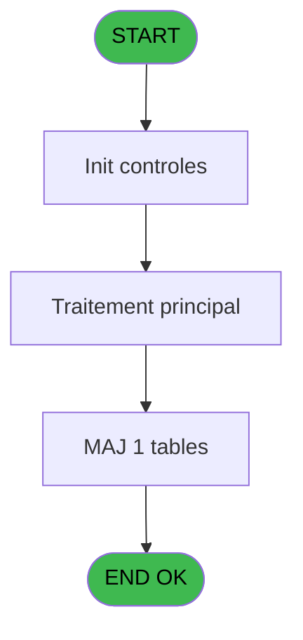
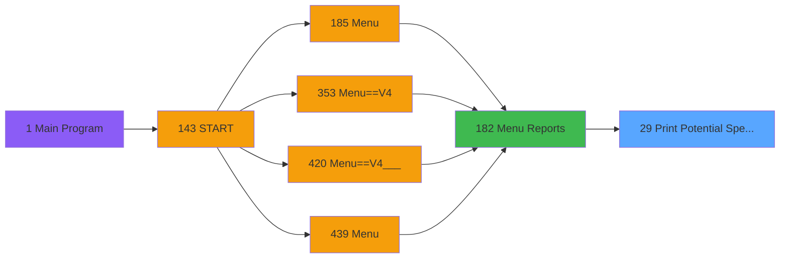
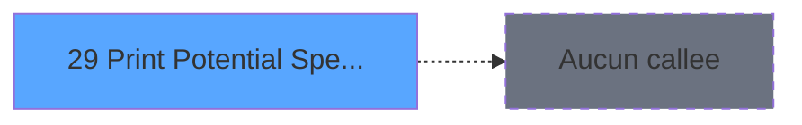

# PVE IDE 29 - Print Potential Spenders

> **Analyse**: Phases 1-4 2026-02-03 01:16 -> 01:17 (35s) | Assemblage 01:17
> **Pipeline**: V7.2 Enrichi
> **Structure**: 4 onglets (Resume | Ecrans | Donnees | Connexions)

<!-- TAB:Resume -->

## 1. FICHE D'IDENTITE

| Attribut | Valeur |
|----------|--------|
| Projet | PVE |
| IDE Position | 29 |
| Nom Programme | Print Potential Spenders |
| Fichier source | `Prg_29.xml` |
| Domaine metier | Impression |
| Taches | 4 (1 ecrans visibles) |
| Tables modifiees | 1 |
| Programmes appeles | 0 |

## 2. DESCRIPTION FONCTIONNELLE

**Print Potential Spenders** assure la gestion complete de ce processus, accessible depuis [Menu Reports (IDE 182)](PVE-IDE-182.md).

Le flux de traitement s'organise en **2 blocs fonctionnels** :

- **Impression** (2 taches) : generation de tickets et documents
- **Traitement** (2 taches) : traitements metier divers

**Donnees modifiees** : 1 tables en ecriture (client_gm).

Detail : phases du traitement

#### Phase 1 : Traitement (2 taches)

- **29** - In Resort Spending Potential **[[ECRAN]](#ecran-t1)**
- **29.1.1.1** - Filiations

#### Phase 2 : Impression (2 taches)

- **29.1** - Print
- **29.1.1** - EDITION

#### Tables impactees

| Table | Operations | Role metier |
|-------|-----------|-------------|
| client_gm | **W** (1 usages) |  |

## 3. BLOCS FONCTIONNELS

### 3.1 Traitement (2 taches)

Traitements internes.

---

#### 29 - In Resort Spending Potential [[ECRAN]](#ecran-t1)

**Role** : Calcul fidelite/avantage : In Resort Spending Potential.
**Ecran** : 604 x 192 DLU (MDI) | [Voir mockup](#ecran-t1)

---

#### 29.1.1.1 - Filiations

**Role** : Traitement : Filiations.

### 3.2 Impression (2 taches)

Generation des documents et tickets.

---

#### 29.1 - Print

**Role** : Generation du document : Print.

---

#### 29.1.1 - EDITION

**Role** : Generation du document : EDITION.

## 5. REGLES METIER

*(Aucune regle metier identifiee)*

## 6. CONTEXTE

- **Appele par**: [Menu Reports (IDE 182)](PVE-IDE-182.md)
- **Appelle**: 0 programmes | **Tables**: 1 (W:1 R:0 L:0) | **Taches**: 4 | **Expressions**: 4

<!-- TAB:Ecrans -->

## 8. ECRANS

### 8.1 Forms visibles (1 / 4)

| # | Position | Tache | Nom | Type | Largeur | Hauteur | Bloc |
|---|----------|-------|-----|------|---------|---------|------|
| 1 | 29 | 29 | In Resort Spending Potential | MDI | 604 | 192 | Traitement |

### 8.2 Mockups Ecrans

---

#### 29 - In Resort Spending Potential
**Tache** : [29](#t1) | **Type** : MDI | **Dimensions** : 604 x 192 DLU
**Bloc** : Traitement | **Titre IDE** : In Resort Spending Potential

<!-- FORM-DATA:
{
    "width":  604,
    "vFactor":  8,
    "type":  "MDI",
    "hFactor":  4,
    "controls":  [
                     {
                         "x":  6,
                         "type":  "label",
                         "var":  "",
                         "y":  46,
                         "w":  193,
                         "fmt":  "",
                         "name":  "",
                         "h":  15,
                         "color":  "187",
                         "text":  "Select your printing settings",
                         "parent":  null
                     },
                     {
                         "x":  290,
                         "type":  "label",
                         "var":  "",
                         "y":  46,
                         "w":  62,
                         "fmt":  "",
                         "name":  "",
                         "h":  15,
                         "color":  "187",
                         "text":  "Output",
                         "parent":  null
                     },
                     {
                         "x":  408,
                         "type":  "label",
                         "var":  "",
                         "y":  46,
                         "w":  191,
                         "fmt":  "",
                         "name":  "",
                         "h":  15,
                         "color":  "187",
                         "text":  "Only these score labels",
                         "parent":  null
                     },
                     {
                         "x":  6,
                         "type":  "label",
                         "var":  "",
                         "y":  70,
                         "w":  48,
                         "fmt":  "",
                         "name":  "",
                         "h":  12,
                         "color":  "183",
                         "text":  "Guests",
                         "parent":  null
                     },
                     {
                         "x":  6,
                         "type":  "label",
                         "var":  "",
                         "y":  104,
                         "w":  115,
                         "fmt":  "",
                         "name":  "",
                         "h":  12,
                         "color":  "183",
                         "text":  "Only Master Accounts",
                         "parent":  null
                     },
                     {
                         "x":  6,
                         "type":  "label",
                         "var":  "",
                         "y":  138,
                         "w":  112,
                         "fmt":  "",
                         "name":  "",
                         "h":  12,
                         "color":  "183",
                         "text":  "Sort by",
                         "parent":  null
                     },
                     {
                         "x":  0,
                         "type":  "label",
                         "var":  "",
                         "y":  0,
                         "w":  602,
                         "fmt":  "",
                         "name":  "",
                         "h":  42,
                         "color":  "182",
                         "text":  "",
                         "parent":  null
                     },
                     {
                         "x":  1,
                         "type":  "label",
                         "var":  "",
                         "y":  15,
                         "w":  243,
                         "fmt":  "",
                         "name":  "",
                         "h":  10,
                         "color":  "186",
                         "text":  "Settings selection and print options",
                         "parent":  7
                     },
                     {
                         "x":  0,
                         "type":  "label",
                         "var":  "",
                         "y":  155,
                         "w":  602,
                         "fmt":  "",
                         "name":  "",
                         "h":  34,
                         "color":  "183",
                         "text":  "",
                         "parent":  null
                     },
                     {
                         "x":  400,
                         "type":  "line",
                         "var":  "",
                         "y":  42,
                         "w":  0,
                         "fmt":  "",
                         "name":  "",
                         "h":  118,
                         "color":  "",
                         "text":  "",
                         "parent":  null
                     },
                     {
                         "x":  242,
                         "type":  "line",
                         "var":  "",
                         "y":  42,
                         "w":  0,
                         "fmt":  "",
                         "name":  "",
                         "h":  118,
                         "color":  "187",
                         "text":  "",
                         "parent":  null
                     },
                     {
                         "x":  532,
                         "type":  "button",
                         "var":  "",
                         "y":  160,
                         "w":  68,
                         "fmt":  "\u0026Execute",
                         "name":  "",
                         "h":  28,
                         "color":  "",
                         "text":  "",
                         "parent":  19
                     },
                     {
                         "x":  1,
                         "type":  "button",
                         "var":  "",
                         "y":  160,
                         "w":  68,
                         "fmt":  "\u0026Cancel",
                         "name":  "",
                         "h":  28,
                         "color":  "",
                         "text":  "",
                         "parent":  19
                     },
                     {
                         "x":  552,
                         "type":  "image",
                         "var":  "",
                         "y":  4,
                         "w":  48,
                         "fmt":  "",
                         "name":  "",
                         "h":  37,
                         "color":  "",
                         "text":  "",
                         "parent":  7
                     },
                     {
                         "x":  127,
                         "type":  "combobox",
                         "var":  "",
                         "y":  70,
                         "w":  99,
                         "fmt":  "",
                         "name":  "v.Arr / Pres",
                         "h":  12,
                         "color":  "",
                         "text":  "Arrivals,Presents",
                         "parent":  null
                     },
                     {
                         "x":  127,
                         "type":  "checkbox",
                         "var":  "",
                         "y":  106,
                         "w":  13,
                         "fmt":  "",
                         "name":  "v.Uniquement Compte Maitre",
                         "h":  10,
                         "color":  "183",
                         "text":  "",
                         "parent":  null
                     },
                     {
                         "x":  255,
                         "type":  "listbox",
                         "var":  "",
                         "y":  84,
                         "w":  133,
                         "fmt":  "",
                         "name":  "V Printer/Extract_0001",
                         "h":  30,
                         "color":  "110",
                         "text":  "Printer,Extraction",
                         "parent":  null
                     },
                     {
                         "x":  474,
                         "type":  "checkbox",
                         "var":  "",
                         "y":  70,
                         "w":  58,
                         "fmt":  "",
                         "name":  "v.Very High",
                         "h":  12,
                         "color":  "183",
                         "text":  "Very High",
                         "parent":  null
                     },
                     {
                         "x":  474,
                         "type":  "checkbox",
                         "var":  "",
                         "y":  87,
                         "w":  58,
                         "fmt":  "",
                         "name":  "v.High_0001",
                         "h":  12,
                         "color":  "183",
                         "text":  "High",
                         "parent":  null
                     },
                     {
                         "x":  474,
                         "type":  "checkbox",
                         "var":  "",
                         "y":  104,
                         "w":  58,
                         "fmt":  "",
                         "name":  "v.Moderate_0001",
                         "h":  12,
                         "color":  "183",
                         "text":  "Moderate",
                         "parent":  null
                     },
                     {
                         "x":  474,
                         "type":  "checkbox",
                         "var":  "",
                         "y":  121,
                         "w":  58,
                         "fmt":  "",
                         "name":  "v.Low_0001",
                         "h":  12,
                         "color":  "183",
                         "text":  "Low",
                         "parent":  null
                     },
                     {
                         "x":  474,
                         "type":  "checkbox",
                         "var":  "",
                         "y":  138,
                         "w":  58,
                         "fmt":  "",
                         "name":  "v.Very Low_0001",
                         "h":  12,
                         "color":  "183",
                         "text":  "Very Low",
                         "parent":  null
                     },
                     {
                         "x":  127,
                         "type":  "combobox",
                         "var":  "",
                         "y":  138,
                         "w":  99,
                         "fmt":  "",
                         "name":  "v.Sort_0001",
                         "h":  12,
                         "color":  "",
                         "text":  "Name,Spending Potential",
                         "parent":  null
                     }
                 ],
    "taskId":  "29",
    "height":  192
}
-->

<strong>Champs : 8 champs</strong>

| Pos (x,y) | Nom | Variable | Type |
|-----------|-----|----------|------|
| 127,70 | v.Arr / Pres | - | combobox |
| 127,106 | v.Uniquement Compte Maitre | - | checkbox |
| 474,70 | v.Very High | - | checkbox |
| 474,87 | v.High_0001 | - | checkbox |
| 474,104 | v.Moderate_0001 | - | checkbox |
| 474,121 | v.Low_0001 | - | checkbox |
| 474,138 | v.Very Low_0001 | - | checkbox |
| 127,138 | v.Sort_0001 | - | combobox |

<strong>Boutons : 2 boutons</strong>

| Bouton | Pos (x,y) | Action |
|--------|-----------|--------|
| Execute | 532,160 | Bouton fonctionnel |
| Cancel | 1,160 | Annule et retour au menu |

## 9. NAVIGATION

Ecran unique: **In Resort Spending Potential**

### 9.3 Structure hierarchique (4 taches)

| Position | Tache | Type | Dimensions | Bloc |
|----------|-------|------|------------|------|
| **29.1** | [**In Resort Spending Potential** (29)](#t1) [mockup](#ecran-t1) | MDI | 604x192 | Traitement |
| 29.1.1 | [Filiations (29.1.1.1)](#t4) | - | - | |
| **29.2** | [**Print** (29.1)](#t2) | MDI | - | Impression |
| 29.2.1 | [EDITION (29.1.1)](#t3) | - | - | |

### 9.4 Algorigramme

> **Legende**: Vert = START/END OK | Rouge = END KO | Bleu = Decisions
> *Algorigramme auto-genere. Utiliser `/algorigramme` pour une synthese metier detaillee.*

<!-- TAB:Donnees -->

## 10. TABLES

### Tables utilisees (1)

| ID | Nom | Description | Type | R | W | L | Usages |
|----|-----|-------------|------|---|---|---|--------|
| 36 | client_gm |  | DB |   | **W** |   | 1 |

### Colonnes par table (1 / 1 tables avec colonnes identifiees)

Table 36 - client_gm (**W**) - 1 usages

| Lettre | Variable | Acces | Type |
|--------|----------|-------|------|
| BC | v.Export Client | W | Alpha |

## 11. VARIABLES

### 11.1 Parametres entrants (3)

Variables recues du programme appelant ([Menu Reports (IDE 182)](PVE-IDE-182.md)).

| Lettre | Nom | Type | Usage dans |
|--------|-----|------|-----------|
| A | P.Village name | Alpha | - |
| B | P.Masque | Alpha | - |
| C | P.Avec Service | Logical | - |

### 11.2 Variables de session (15)

Variables persistantes pendant toute la session.

| Lettre | Nom | Type | Usage dans |
|--------|-----|------|-----------|
| D | v.Arr / Pres | Alpha | - |
| E | v.Uniquement Compte Maitre | Logical | - |
| F | v.Uniquement Big Spenders | Logical | - |
| G | v.Sort | Alpha | - |
| H | v.Output | Alpha | - |
| I | v.Very High | Logical | 1x session |
| J | v.High | Logical | 1x session |
| K | v.Moderate | Logical | 1x session |
| L | v.Low | Logical | 1x session |
| M | v.Very Low | Logical | 1x session |
| BA | v.Depenses Service | Numeric | - |
| BB | v.Depenses Globales | Numeric | - |
| BC | v.Export Client | Alpha | - |
| BD | v.Export Depenses | Alpha | - |
| BE | v.Export | Alpha | - |

### 11.3 Autres (13)

Variables diverses.

| Lettre | Nom | Type | Usage dans |
|--------|-----|------|-----------|
| N | heure_depart | Unicode | - |
| O | vol_depart | Unicode | - |
| P | mil_new_fidelisation | Unicode | - |
| Q | mil_nbpoints | Numeric | - |
| R | mil_montant_score | Numeric | - |
| S | mil_score | Alpha | - |
| T | mil_topact | Unicode | - |
| U | lib_fid | Unicode | - |
| V | statut | Unicode | - |
| W | qualite | Unicode | - |
| X | Comp_qualite | Unicode | - |
| Y | chambre | Unicode | - |
| Z | Nationalite | Unicode | - |

Toutes les 31 variables (liste complete)

| Cat | Lettre | Nom Variable | Type |
|-----|--------|--------------|------|
| P0 | **A** | P.Village name | Alpha |
| P0 | **B** | P.Masque | Alpha |
| P0 | **C** | P.Avec Service | Logical |
| V. | **D** | v.Arr / Pres | Alpha |
| V. | **E** | v.Uniquement Compte Maitre | Logical |
| V. | **F** | v.Uniquement Big Spenders | Logical |
| V. | **G** | v.Sort | Alpha |
| V. | **H** | v.Output | Alpha |
| V. | **I** | v.Very High | Logical |
| V. | **J** | v.High | Logical |
| V. | **K** | v.Moderate | Logical |
| V. | **L** | v.Low | Logical |
| V. | **M** | v.Very Low | Logical |
| V. | **BA** | v.Depenses Service | Numeric |
| V. | **BB** | v.Depenses Globales | Numeric |
| V. | **BC** | v.Export Client | Alpha |
| V. | **BD** | v.Export Depenses | Alpha |
| V. | **BE** | v.Export | Alpha |
| Autre | **N** | heure_depart | Unicode |
| Autre | **O** | vol_depart | Unicode |
| Autre | **P** | mil_new_fidelisation | Unicode |
| Autre | **Q** | mil_nbpoints | Numeric |
| Autre | **R** | mil_montant_score | Numeric |
| Autre | **S** | mil_score | Alpha |
| Autre | **T** | mil_topact | Unicode |
| Autre | **U** | lib_fid | Unicode |
| Autre | **V** | statut | Unicode |
| Autre | **W** | qualite | Unicode |
| Autre | **X** | Comp_qualite | Unicode |
| Autre | **Y** | chambre | Unicode |
| Autre | **Z** | Nationalite | Unicode |

## 12. EXPRESSIONS

**4 / 4 expressions decodees (100%)**

### 12.1 Repartition par type

| Type | Expressions | Regles |
|------|-------------|--------|
| CONSTANTE | 2 | 0 |
| CAST_LOGIQUE | 1 | 0 |
| OTHER | 1 | 0 |

### 12.2 Expressions cles par type

#### CONSTANTE (2 expressions)

| Type | IDE | Expression | Regle |
|------|-----|------------|-------|
| CONSTANTE | 4 | `'S'` | - |
| CONSTANTE | 1 | `'P'` | - |

#### CAST_LOGIQUE (1 expressions)

| Type | IDE | Expression | Regle |
|------|-----|------------|-------|
| CAST_LOGIQUE | 2 | `'TRUE'LOG` | - |

#### OTHER (1 expressions)

| Type | IDE | Expression | Regle |
|------|-----|------------|-------|
| OTHER | 3 | `v.Very High [I] OR v.High [J] OR v.Moderate [K] OR v.Low [L] OR v.Very Low [M]` | - |

<!-- TAB:Connexions -->

## 13. GRAPHE D'APPELS

### 13.1 Chaine depuis Main (Callers)

Main -> ... -> [Menu Reports (IDE 182)](PVE-IDE-182.md) -> **Print Potential Spenders (IDE 29)**

### 13.2 Callers

| IDE | Nom Programme | Nb Appels |
|-----|---------------|-----------|
| [182](PVE-IDE-182.md) | Menu Reports | 1 |

### 13.3 Callees (programmes appeles)

### 13.4 Detail Callees avec contexte

| IDE | Nom Programme | Appels | Contexte |
|-----|---------------|--------|----------|
| - | (aucun) | - | - |

## 14. RECOMMANDATIONS MIGRATION

### 14.1 Profil du programme

| Metrique | Valeur | Impact migration |
|----------|--------|-----------------|
| Lignes de logique | 116 | Programme compact |
| Expressions | 4 | Peu de logique |
| Tables WRITE | 1 | Impact faible |
| Sous-programmes | 0 | Peu de dependances |
| Ecrans visibles | 1 | Ecran unique ou traitement batch |
| Code desactive | 0% (0 / 116) | Code sain |
| Regles metier | 0 | Pas de regle identifiee |

### 14.2 Plan de migration par bloc

#### Traitement (2 taches: 1 ecran, 1 traitement)

- **Strategie** : Orchestrateur avec 1 ecrans (Razor/React) et 1 traitements backend (services).
- Les ecrans deviennent des composants UI, les traitements invisibles deviennent des services injectables.
- Decomposer les taches en services unitaires testables.

#### Impression (2 taches: 0 ecran, 2 traitements)

- **Strategie** : Templates HTML -> PDF via wkhtmltopdf ou Puppeteer.
- `PrintService` injectable avec choix imprimante

### 14.3 Dependances critiques

| Dependance | Type | Appels | Impact |
|------------|------|--------|--------|
| client_gm | Table WRITE (Database) | 1x | Schema + repository |

---
*Spec DETAILED generee par Pipeline V7.2 - 2026-02-03 01:17*
