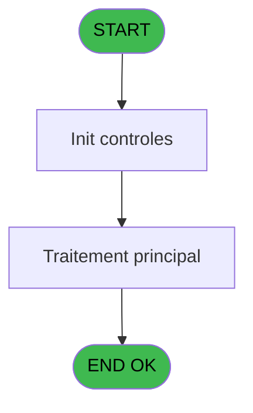

# PVE IDE 294 - Get Service

> **Analyse**: Phases 1-4 2026-02-03 19:27 -> 19:27 (12s) | Assemblage 19:27
> **Pipeline**: V7.2 Enrichi
> **Structure**: 4 onglets (Resume | Ecrans | Donnees | Connexions)

<!-- TAB:Resume -->

## 1. FICHE D'IDENTITE

| Attribut | Valeur |
|----------|--------|
| Projet | PVE |
| IDE Position | 294 |
| Nom Programme | Get Service |
| Fichier source | `Prg_294.xml` |
| Dossier IDE | Utilitaires |
| Taches | 1 (0 ecrans visibles) |
| Tables modifiees | 0 |
| Programmes appeles | 1 |

## 2. DESCRIPTION FONCTIONNELLE

**Get Service** assure la gestion complete de ce processus, accessible depuis [START (IDE 143)](PVE-IDE-143.md).

Le flux de traitement s'organise en **1 blocs fonctionnels** :

- **Traitement** (1 tache) : traitements metier divers

**Logique metier** : 1 regles identifiees couvrant conditions metier.

## 3. BLOCS FONCTIONNELS

### 3.1 Traitement (1 tache)

Traitements internes.

---

#### 294 - (sans nom)

**Role** : Traitement interne.

## 5. REGLES METIER

1 regles identifiees:

### Autres (1 regles)

#### [RM-001] Condition toujours vraie (flag actif)

| Element | Detail |
|---------|--------|
| **Condition** | `Trim ([D])='INFORMATICIEN' OR Trim ([D])='GESTION' OR Trim([D])='CDV - R Pole'` |
| **Si vrai** | 'FALSE'LOG |
| **Si faux** | IF (NOT ([P]),'TRUE'LOG,'FALSE'LOG)) |
| **Expression source** | Expression 15 : `IF (Trim ([D])='INFORMATICIEN' OR Trim ([D])='GESTION' OR Tr` |
| **Exemple** | Si Trim ([D])='INFORMATICIEN' OR Trim ([D])='GESTION' OR Trim([D])='CDV - R Pole' → 'FALSE'LOG. Sinon → IF (NOT ([P]),'TRUE'LOG,'FALSE'LOG)) |

## 6. CONTEXTE

- **Appele par**: [START (IDE 143)](PVE-IDE-143.md)
- **Appelle**: 1 programmes | **Tables**: 4 (W:0 R:1 L:3) | **Taches**: 1 | **Expressions**: 23

<!-- TAB:Ecrans -->

## 8. ECRANS

*(Programme sans ecran visible)*

## 9. NAVIGATION

### 9.3 Structure hierarchique (1 tache)

| Position | Tache | Type | Dimensions | Bloc |
|----------|-------|------|------------|------|
| **294.1** | [**(sans nom)** (294)](#t1) | MDI | - | Traitement |

### 9.4 Algorigramme

> **Legende**: Vert = START/END OK | Rouge = END KO | Bleu = Decisions
> *Algorigramme auto-genere. Utiliser `/algorigramme` pour une synthese metier detaillee.*

<!-- TAB:Donnees -->

## 10. TABLES

### Tables utilisees (4)

| ID | Nom | Description | Type | R | W | L | Usages |
|----|-----|-------------|------|---|---|---|--------|
| 67 | tables___________tab |  | DB |   |   | L | 1 |
| 723 | arc_client_gm |  | DB |   |   | L | 1 |
| 734 | arc_pv_cust_packages |  | DB |   |   | L | 1 |
| 740 | pv_stock_movements | Articles et stock | DB | R |   |   | 1 |

### Colonnes par table (1 / 1 tables avec colonnes identifiees)

Table 740 - pv_stock_movements (R) - 1 usages

| Lettre | Variable | Acces | Type |
|--------|----------|-------|------|
| A | P. Anomalie T/S | R | Logical |
| B | v.Service ? | R | Logical |
| C | v.Terminal/Service ? | R | Logical |

## 11. VARIABLES

### 11.1 Parametres entrants (1)

Variables recues du programme appelant ([START (IDE 143)](PVE-IDE-143.md)).

| Lettre | Nom | Type | Usage dans |
|--------|-----|------|-----------|
| A | P. Anomalie T/S | Logical | - |

### 11.2 Variables de session (2)

Variables persistantes pendant toute la session.

| Lettre | Nom | Type | Usage dans |
|--------|-----|------|-----------|
| B | v.Service ? | Logical | - |
| C | v.Terminal/Service ? | Logical | - |

## 12. EXPRESSIONS

**23 / 23 expressions decodees (100%)**

### 12.1 Repartition par type

| Type | Expressions | Regles |
|------|-------------|--------|
| FORMAT | 2 | 0 |
| CAST_LOGIQUE | 3 | 5 |
| CONSTANTE | 3 | 0 |
| REFERENCE_VG | 3 | 0 |
| OTHER | 11 | 0 |
| NEGATION | 1 | 0 |

### 12.2 Expressions cles par type

#### FORMAT (2 expressions)

| Type | IDE | Expression | Regle |
|------|-----|------------|-------|
| FORMAT | 22 | `DNSet(DNCast(DotNet.System.Windows.Forms.Control.FromHandle(DNCast(VG106,DotNet.System.IntPtr)),DotNet.System.Windows.Forms.Form).Text,RTrim(VG107) & ' Terminal : ' & Trim(Str(VG105, '3')) & IF(VG24 AND VG25<>'', ' - TPE : '& VG25 , '')  )` | - |
| FORMAT | 21 | `DNSet(DNCast(DotNet.System.Windows.Forms.Control.FromHandle(DNCast(VG106,DotNet.System.IntPtr)),DotNet.System.Windows.Forms.Form).Text,RTrim(VG107) & ' Computer : ' & GetHostName()& '/' & Trim(Str(VG105, '3')) & IF(VG24 AND VG25<>'', ' - TPE : '& VG25, '') )` | - |

#### CAST_LOGIQUE (3 expressions)

| Type | IDE | Expression | Regle |
|------|-----|------------|-------|
| CAST_LOGIQUE | 15 | `IF (Trim ([D])='INFORMATICIEN' OR Trim ([D])='GESTION' OR Trim([D])='CDV - R Pole','FALSE'LOG,IF (NOT ([P]),'TRUE'LOG,'FALSE'LOG))` | [RM-001](#rm-RM-001) |
| CAST_LOGIQUE | 14 | `'FALSE'LOG` | - |
| CAST_LOGIQUE | 13 | `'TRUE'LOG` | - |

#### CONSTANTE (3 expressions)

| Type | IDE | Expression | Regle |
|------|-----|------------|-------|
| CONSTANTE | 5 | `'O'` | - |
| CONSTANTE | 4 | `'VSERV'` | - |
| CONSTANTE | 1 | `'C'` | - |

#### REFERENCE_VG (3 expressions)

| Type | IDE | Expression | Regle |
|------|-----|------------|-------|
| REFERENCE_VG | 20 | `VG104` | - |
| REFERENCE_VG | 7 | `VG105` | - |
| REFERENCE_VG | 2 | `VG1` | - |

#### OTHER (11 expressions)

| Type | IDE | Expression | Regle |
|------|-----|------------|-------|
| OTHER | 17 | `[J]` | - |
| OTHER | 16 | `[I]` | - |
| OTHER | 18 | `[L]` | - |
| OTHER | 23 | `GetPseudoTerminal ()` | - |
| OTHER | 19 | `[K]` | - |
| ... | | *+6 autres* | |

#### NEGATION (1 expressions)

| Type | IDE | Expression | Regle |
|------|-----|------------|-------|
| NEGATION | 8 | `NOT ([M])` | - |

### 12.3 Toutes les expressions (23)

Voir les 23 expressions

#### FORMAT (2)

| IDE | Expression Decodee |
|-----|-------------------|
| 21 | `DNSet(DNCast(DotNet.System.Windows.Forms.Control.FromHandle(DNCast(VG106,DotNet.System.IntPtr)),DotNet.System.Windows.Forms.Form).Text,RTrim(VG107) & ' Computer : ' & GetHostName()& '/' & Trim(Str(VG105, '3')) & IF(VG24 AND VG25<>'', ' - TPE : '& VG25, '') )` |
| 22 | `DNSet(DNCast(DotNet.System.Windows.Forms.Control.FromHandle(DNCast(VG106,DotNet.System.IntPtr)),DotNet.System.Windows.Forms.Form).Text,RTrim(VG107) & ' Terminal : ' & Trim(Str(VG105, '3')) & IF(VG24 AND VG25<>'', ' - TPE : '& VG25 , '')  )` |

#### CAST_LOGIQUE (3)

| IDE | Expression Decodee |
|-----|-------------------|
| 15 | `IF (Trim ([D])='INFORMATICIEN' OR Trim ([D])='GESTION' OR Trim([D])='CDV - R Pole','FALSE'LOG,IF (NOT ([P]),'TRUE'LOG,'FALSE'LOG))` |
| 13 | `'TRUE'LOG` |
| 14 | `'FALSE'LOG` |

#### CONSTANTE (3)

| IDE | Expression Decodee |
|-----|-------------------|
| 1 | `'C'` |
| 4 | `'VSERV'` |
| 5 | `'O'` |

#### REFERENCE_VG (3)

| IDE | Expression Decodee |
|-----|-------------------|
| 2 | `VG1` |
| 7 | `VG105` |
| 20 | `VG104` |

#### OTHER (11)

| IDE | Expression Decodee |
|-----|-------------------|
| 3 | `[D]` |
| 6 | `[F]` |
| 9 | `SetParam ('SERVICE',[F])` |
| 10 | `SetParam ('GROUP',[D])` |
| 11 | `SetParam ('SERVICELIB',[J])` |
| 12 | `[M]` |
| 16 | `[I]` |
| 17 | `[J]` |
| 18 | `[L]` |
| 19 | `[K]` |
| 23 | `GetPseudoTerminal ()` |

#### NEGATION (1)

| IDE | Expression Decodee |
|-----|-------------------|
| 8 | `NOT ([M])` |

<!-- TAB:Connexions -->

## 13. GRAPHE D'APPELS

### 13.1 Chaine depuis Main (Callers)

Main -> ... -> [START (IDE 143)](PVE-IDE-143.md) -> **Get Service (IDE 294)**

### 13.2 Callers

| IDE | Nom Programme | Nb Appels |
|-----|---------------|-----------|
| [143](PVE-IDE-143.md) | START | 1 |

### 13.3 Callees (programmes appeles)

### 13.4 Detail Callees avec contexte

| IDE | Nom Programme | Appels | Contexte |
|-----|---------------|--------|----------|
| [332](PVE-IDE-332.md) | Choix - Services | 1 | Selection/consultation |

## 14. RECOMMANDATIONS MIGRATION

### 14.1 Profil du programme

| Metrique | Valeur | Impact migration |
|----------|--------|-----------------|
| Lignes de logique | 60 | Programme compact |
| Expressions | 23 | Peu de logique |
| Tables WRITE | 0 | Impact faible |
| Sous-programmes | 1 | Peu de dependances |
| Ecrans visibles | 0 | Ecran unique ou traitement batch |
| Code desactive | 0% (0 / 60) | Code sain |
| Regles metier | 1 | Quelques regles a preserver |

### 14.2 Plan de migration par bloc

#### Traitement (1 tache: 0 ecran, 1 traitement)

- **Strategie** : 1 service(s) backend injectable(s) (Domain Services).
- 1 sous-programme(s) a migrer ou a reutiliser depuis les services existants.
- Decomposer les taches en services unitaires testables.

### 14.3 Dependances critiques

| Dependance | Type | Appels | Impact |
|------------|------|--------|--------|
| [Choix - Services (IDE 332)](PVE-IDE-332.md) | Sous-programme | 1x | Normale - Selection/consultation |

---
*Spec DETAILED generee par Pipeline V7.2 - 2026-02-03 19:27*
