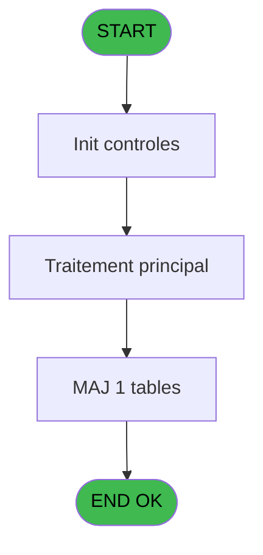

# PVE IDE 295 - Create calendar days

> **Analyse**: Phases 1-4 2026-02-03 19:27 -> 19:27 (12s) | Assemblage 19:27
> **Pipeline**: V7.2 Enrichi
> **Structure**: 4 onglets (Resume | Ecrans | Donnees | Connexions)

<!-- TAB:Resume -->

## 1. FICHE D'IDENTITE

| Attribut | Valeur |
|----------|--------|
| Projet | PVE |
| IDE Position | 295 |
| Nom Programme | Create calendar days |
| Fichier source | `Prg_295.xml` |
| Dossier IDE | Utilitaires |
| Taches | 2 (0 ecrans visibles) |
| Tables modifiees | 1 |
| Programmes appeles | 0 |

## 2. DESCRIPTION FONCTIONNELLE

**Create calendar days** assure la gestion complete de ce processus, accessible depuis [Calendar control (IDE 293)](PVE-IDE-293.md).

Le flux de traitement s'organise en **2 blocs fonctionnels** :

- **Traitement** (1 tache) : traitements metier divers
- **Creation** (1 tache) : insertion d'enregistrements en base (mouvements, prestations)

**Donnees modifiees** : 1 tables en ecriture (pv_equipment).

**Logique metier** : 2 regles identifiees couvrant conditions metier.

Detail : phases du traitement

#### Phase 1 : Creation (1 tache)

- **295** - Calendar creation **[[ECRAN]](#ecran-t1)**

#### Phase 2 : Traitement (1 tache)

- **295.1** - batch **[[ECRAN]](#ecran-t2)**

#### Tables impactees

| Table | Operations | Role metier |
|-------|-----------|-------------|
| pv_equipment | **W** (1 usages) |  |

## 3. BLOCS FONCTIONNELS

### 3.1 Creation (1 tache)

Insertion de nouveaux enregistrements en base.

---

#### 295 - Calendar creation [[ECRAN]](#ecran-t1)

**Role** : Creation d'enregistrement : Calendar creation.
**Ecran** : 307 x 115 DLU (MDI) | [Voir mockup](#ecran-t1)

### 3.2 Traitement (1 tache)

Traitements internes.

---

#### 295.1 - batch [[ECRAN]](#ecran-t2)

**Role** : Traitement : batch.
**Ecran** : 130 x 116 DLU (MDI) | [Voir mockup](#ecran-t2)

## 5. REGLES METIER

2 regles identifiees:

### Autres (2 regles)

#### [RM-001] Traitement conditionnel si P. Year [A] est a zero

| Element | Detail |
|---------|--------|
| **Condition** | `P. Year [A]=0` |
| **Si vrai** | {1 |
| **Si faux** | 2},P. Year [A]+1) |
| **Variables** | A (P. Year) |
| **Expression source** | Expression 1 : `IF (P. Year [A]=0,{1,2},P. Year [A]+1)` |
| **Exemple** | Si P. Year [A]=0 → {1. Sinon → 2},P. Year [A]+1) |

#### [RM-002] Traitement conditionnel si P. Date début [B] est a zero

| Element | Detail |
|---------|--------|
| **Condition** | `P. Date début [B]=0` |
| **Si vrai** | 1 |
| **Si faux** | IF (DOW (P. Year [A])=2,P. Date début [B]+1,P. Date début [B])) |
| **Variables** | A (P. Year), B (P. Date début) |
| **Expression source** | Expression 2 : `IF (P. Date début [B]=0,1,IF (DOW (P. Year [A])=2,P. Date dé` |
| **Exemple** | Si P. Date début [B]=0 → 1 |

## 6. CONTEXTE

- **Appele par**: [Calendar control (IDE 293)](PVE-IDE-293.md)
- **Appelle**: 0 programmes | **Tables**: 1 (W:1 R:0 L:0) | **Taches**: 2 | **Expressions**: 6

<!-- TAB:Ecrans -->

## 8. ECRANS

*(Programme sans ecran visible)*

## 9. NAVIGATION

### 9.3 Structure hierarchique (2 taches)

| Position | Tache | Type | Dimensions | Bloc |
|----------|-------|------|------------|------|
| **295.1** | [**Calendar creation** (295)](#t1) [mockup](#ecran-t1) | MDI | 307x115 | Creation |
| **295.2** | [**batch** (295.1)](#t2) [mockup](#ecran-t2) | MDI | 130x116 | Traitement |

### 9.4 Algorigramme

> **Legende**: Vert = START/END OK | Rouge = END KO | Bleu = Decisions
> *Algorigramme auto-genere. Utiliser `/algorigramme` pour une synthese metier detaillee.*

<!-- TAB:Donnees -->

## 10. TABLES

### Tables utilisees (1)

| ID | Nom | Description | Type | R | W | L | Usages |
|----|-----|-------------|------|---|---|---|--------|
| 385 | pv_equipment |  | DB |   | **W** |   | 1 |

### Colonnes par table (1 / 1 tables avec colonnes identifiees)

Table 385 - pv_equipment (**W**) - 1 usages

| Lettre | Variable | Acces | Type |
|--------|----------|-------|------|
| A | V Date courante | W | Date |
| B | V Semaine | W | Numeric |

## 11. VARIABLES

### 11.1 Parametres entrants (3)

Variables recues du programme appelant ([Calendar control (IDE 293)](PVE-IDE-293.md)).

| Lettre | Nom | Type | Usage dans |
|--------|-----|------|-----------|
| A | P. Year | Numeric | 4x parametre entrant |
| B | P. Date début | Date | 2x parametre entrant |
| C | P. Date fin | Date | - |

## 12. EXPRESSIONS

**6 / 6 expressions decodees (100%)**

### 12.1 Repartition par type

| Type | Expressions | Regles |
|------|-------------|--------|
| CONDITION | 3 | 2 |
| OTHER | 3 | 0 |

### 12.2 Expressions cles par type

#### CONDITION (3 expressions)

| Type | IDE | Expression | Regle |
|------|-----|------------|-------|
| CONDITION | 2 | `IF (P. Date début [B]=0,1,IF (DOW (P. Year [A])=2,P. Date début [B]+1,P. Date début [B]))` | [RM-002](#rm-RM-002) |
| CONDITION | 1 | `IF (P. Year [A]=0,{1,2},P. Year [A]+1)` | [RM-001](#rm-RM-001) |
| CONDITION | 6 | `P. Year [A]={1,3}` | - |

#### OTHER (3 expressions)

| Type | IDE | Expression | Regle |
|------|-----|------------|-------|
| OTHER | 5 | `P. Year [A]` | - |
| OTHER | 4 | `P. Date début [B]` | - |
| OTHER | 3 | `{1,1}` | - |

<!-- TAB:Connexions -->

## 13. GRAPHE D'APPELS

### 13.1 Chaine depuis Main (Callers)

Main -> ... -> [Calendar control (IDE 293)](PVE-IDE-293.md) -> **Create calendar days (IDE 295)**

### 13.2 Callers

| IDE | Nom Programme | Nb Appels |
|-----|---------------|-----------|
| [293](PVE-IDE-293.md) | Calendar control | 2 |

### 13.3 Callees (programmes appeles)

### 13.4 Detail Callees avec contexte

| IDE | Nom Programme | Appels | Contexte |
|-----|---------------|--------|----------|
| - | (aucun) | - | - |

## 14. RECOMMANDATIONS MIGRATION

### 14.1 Profil du programme

| Metrique | Valeur | Impact migration |
|----------|--------|-----------------|
| Lignes de logique | 16 | Programme compact |
| Expressions | 6 | Peu de logique |
| Tables WRITE | 1 | Impact faible |
| Sous-programmes | 0 | Peu de dependances |
| Ecrans visibles | 0 | Ecran unique ou traitement batch |
| Code desactive | 0% (0 / 16) | Code sain |
| Regles metier | 2 | Quelques regles a preserver |

### 14.2 Plan de migration par bloc

#### Creation (1 tache: 1 ecran, 0 traitement)

- **Strategie** : Repository pattern avec Entity Framework Core.
- Insertion via `IRepository<T>.CreateAsync()`

#### Traitement (1 tache: 1 ecran, 0 traitement)

- **Strategie** : 1 composant(s) UI (Razor/React) avec formulaires et validation.
- Decomposer les taches en services unitaires testables.

### 14.3 Dependances critiques

| Dependance | Type | Appels | Impact |
|------------|------|--------|--------|
| pv_equipment | Table WRITE (Database) | 1x | Schema + repository |

---
*Spec DETAILED generee par Pipeline V7.2 - 2026-02-03 19:27*
