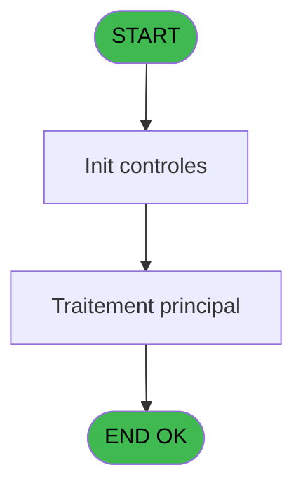
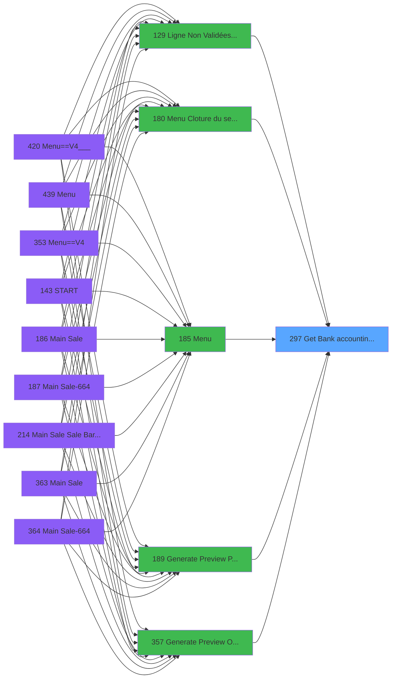

# PVE IDE 297 - Get Bank accounting date

> **Analyse**: Phases 1-4 2026-02-03 19:28 -> 19:28 (10s) | Assemblage 19:28
> **Pipeline**: V7.2 Enrichi
> **Structure**: 4 onglets (Resume | Ecrans | Donnees | Connexions)

<!-- TAB:Resume -->

## 1. FICHE D'IDENTITE

| Attribut | Valeur |
|----------|--------|
| Projet | PVE |
| IDE Position | 297 |
| Nom Programme | Get Bank accounting date |
| Fichier source | `Prg_297.xml` |
| Dossier IDE | Utilitaires |
| Taches | 1 (0 ecrans visibles) |
| Tables modifiees | 0 |
| Programmes appeles | 0 |

## 2. DESCRIPTION FONCTIONNELLE

**Get Bank accounting date** assure la gestion complete de ce processus, accessible depuis [Menu Cloture du service (IDE 180)](PVE-IDE-180.md), [Menu Service cloture v2 (IDE 397)](PVE-IDE-397.md), [Menu Service cloture (IDE 402)](PVE-IDE-402.md), [Ligne Non Validées & Edit Book (IDE 129)](PVE-IDE-129.md), [Menu (IDE 185)](PVE-IDE-185.md), [Generate Preview Payments (IDE 189)](PVE-IDE-189.md), [Generate Preview OD==V4 (IDE 357)](PVE-IDE-357.md), [Menu Main (TPE) (IDE 403)](PVE-IDE-403.md), [Generate Preview OD==LEX Book (IDE 418)](PVE-IDE-418.md), [Generate Preview OD==V4 (IDE 423)](PVE-IDE-423.md), [Generate Preview OD==LEX (IDE 424)](PVE-IDE-424.md), [Generate Preview Payments 1212 (IDE 434)](PVE-IDE-434.md), [Generate Preview Payments 1112 (IDE 435)](PVE-IDE-435.md), [Generate Preview Payments 1012 (IDE 436)](PVE-IDE-436.md), [Generate Preview Payment 1212E (IDE 437)](PVE-IDE-437.md), [Generate Preview Payments (IDE 441)](PVE-IDE-441.md).

Le flux de traitement s'organise en **1 blocs fonctionnels** :

- **Traitement** (1 tache) : traitements metier divers

## 3. BLOCS FONCTIONNELS

### 3.1 Traitement (1 tache)

Traitements internes.

---

#### 297 - Bank accounting date

**Role** : Traitement : Bank accounting date.
**Variables liees** : B (P. Date)

## 5. REGLES METIER

*(Aucune regle metier identifiee)*

## 6. CONTEXTE

- **Appele par**: [Menu Cloture du service (IDE 180)](PVE-IDE-180.md), [Menu Service cloture v2 (IDE 397)](PVE-IDE-397.md), [Menu Service cloture (IDE 402)](PVE-IDE-402.md), [Ligne Non Validées & Edit Book (IDE 129)](PVE-IDE-129.md), [Menu (IDE 185)](PVE-IDE-185.md), [Generate Preview Payments (IDE 189)](PVE-IDE-189.md), [Generate Preview OD==V4 (IDE 357)](PVE-IDE-357.md), [Menu Main (TPE) (IDE 403)](PVE-IDE-403.md), [Generate Preview OD==LEX Book (IDE 418)](PVE-IDE-418.md), [Generate Preview OD==V4 (IDE 423)](PVE-IDE-423.md), [Generate Preview OD==LEX (IDE 424)](PVE-IDE-424.md), [Generate Preview Payments 1212 (IDE 434)](PVE-IDE-434.md), [Generate Preview Payments 1112 (IDE 435)](PVE-IDE-435.md), [Generate Preview Payments 1012 (IDE 436)](PVE-IDE-436.md), [Generate Preview Payment 1212E (IDE 437)](PVE-IDE-437.md), [Generate Preview Payments (IDE 441)](PVE-IDE-441.md)
- **Appelle**: 0 programmes | **Tables**: 1 (W:0 R:1 L:0) | **Taches**: 1 | **Expressions**: 3

<!-- TAB:Ecrans -->

## 8. ECRANS

*(Programme sans ecran visible)*

## 9. NAVIGATION

### 9.3 Structure hierarchique (1 tache)

| Position | Tache | Type | Dimensions | Bloc |
|----------|-------|------|------------|------|
| **297.1** | [**Bank accounting date** (297)](#t1) | MDI | - | Traitement |

### 9.4 Algorigramme

> **Legende**: Vert = START/END OK | Rouge = END KO | Bleu = Decisions
> *Algorigramme auto-genere. Utiliser `/algorigramme` pour une synthese metier detaillee.*

<!-- TAB:Donnees -->

## 10. TABLES

### Tables utilisees (1)

| ID | Nom | Description | Type | R | W | L | Usages |
|----|-----|-------------|------|---|---|---|--------|
| 70 | date_comptable___dat |  | DB | R |   |   | 1 |

### Colonnes par table (1 / 1 tables avec colonnes identifiees)

Table 70 - date_comptable___dat (R) - 1 usages

| Lettre | Variable | Acces | Type |
|--------|----------|-------|------|
| A | P. Société | R | Alpha |
| B | P. Date | R | Date |

## 11. VARIABLES

### 11.1 Parametres entrants (2)

Variables recues du programme appelant ([Menu Cloture du service (IDE 180)](PVE-IDE-180.md)).

| Lettre | Nom | Type | Usage dans |
|--------|-----|------|-----------|
| A | P. Société | Alpha | 1x parametre entrant |
| B | P. Date | Date | [297](#t1) |

## 12. EXPRESSIONS

**3 / 3 expressions decodees (100%)**

### 12.1 Repartition par type

| Type | Expressions | Regles |
|------|-------------|--------|
| OTHER | 3 | 0 |

### 12.2 Expressions cles par type

#### OTHER (3 expressions)

| Type | IDE | Expression | Regle |
|------|-----|------------|-------|
| OTHER | 3 | `SetParam ('SKIACCOUNTINGDATE',P. Date [B])` | - |
| OTHER | 2 | `[D]` | - |
| OTHER | 1 | `P. Société [A]` | - |

<!-- TAB:Connexions -->

## 13. GRAPHE D'APPELS

### 13.1 Chaine depuis Main (Callers)

Main -> ... -> [Menu Cloture du service (IDE 180)](PVE-IDE-180.md) -> **Get Bank accounting date (IDE 297)**

Main -> ... -> [Menu Service cloture v2 (IDE 397)](PVE-IDE-397.md) -> **Get Bank accounting date (IDE 297)**

Main -> ... -> [Menu Service cloture (IDE 402)](PVE-IDE-402.md) -> **Get Bank accounting date (IDE 297)**

Main -> ... -> [Ligne Non Validées & Edit Book (IDE 129)](PVE-IDE-129.md) -> **Get Bank accounting date (IDE 297)**

Main -> ... -> [Menu (IDE 185)](PVE-IDE-185.md) -> **Get Bank accounting date (IDE 297)**

Main -> ... -> [Generate Preview Payments (IDE 189)](PVE-IDE-189.md) -> **Get Bank accounting date (IDE 297)**

Main -> ... -> [Generate Preview OD==V4 (IDE 357)](PVE-IDE-357.md) -> **Get Bank accounting date (IDE 297)**

Main -> ... -> [Menu Main (TPE) (IDE 403)](PVE-IDE-403.md) -> **Get Bank accounting date (IDE 297)**

Main -> ... -> [Generate Preview OD==LEX Book (IDE 418)](PVE-IDE-418.md) -> **Get Bank accounting date (IDE 297)**

Main -> ... -> [Generate Preview OD==V4 (IDE 423)](PVE-IDE-423.md) -> **Get Bank accounting date (IDE 297)**

Main -> ... -> [Generate Preview OD==LEX (IDE 424)](PVE-IDE-424.md) -> **Get Bank accounting date (IDE 297)**

Main -> ... -> [Generate Preview Payments 1212 (IDE 434)](PVE-IDE-434.md) -> **Get Bank accounting date (IDE 297)**

Main -> ... -> [Generate Preview Payments 1112 (IDE 435)](PVE-IDE-435.md) -> **Get Bank accounting date (IDE 297)**

Main -> ... -> [Generate Preview Payments 1012 (IDE 436)](PVE-IDE-436.md) -> **Get Bank accounting date (IDE 297)**

Main -> ... -> [Generate Preview Payment 1212E (IDE 437)](PVE-IDE-437.md) -> **Get Bank accounting date (IDE 297)**

Main -> ... -> [Generate Preview Payments (IDE 441)](PVE-IDE-441.md) -> **Get Bank accounting date (IDE 297)**

### 13.2 Callers

| IDE | Nom Programme | Nb Appels |
|-----|---------------|-----------|
| [180](PVE-IDE-180.md) | Menu Cloture du service | 2 |
| [397](PVE-IDE-397.md) | Menu Service cloture v2 | 2 |
| [402](PVE-IDE-402.md) | Menu Service cloture | 2 |
| [129](PVE-IDE-129.md) | Ligne Non Validées & Edit Book | 1 |
| [185](PVE-IDE-185.md) | Menu | 1 |
| [189](PVE-IDE-189.md) | Generate Preview Payments | 1 |
| [357](PVE-IDE-357.md) | Generate Preview OD==V4 | 1 |
| [403](PVE-IDE-403.md) | Menu Main (TPE) | 1 |
| [418](PVE-IDE-418.md) | Generate Preview OD==LEX Book | 1 |
| [423](PVE-IDE-423.md) | Generate Preview OD==V4 | 1 |
| [424](PVE-IDE-424.md) | Generate Preview OD==LEX | 1 |
| [434](PVE-IDE-434.md) | Generate Preview Payments 1212 | 1 |
| [435](PVE-IDE-435.md) | Generate Preview Payments 1112 | 1 |
| [436](PVE-IDE-436.md) | Generate Preview Payments 1012 | 1 |
| [437](PVE-IDE-437.md) | Generate Preview Payment 1212E | 1 |
| [441](PVE-IDE-441.md) | Generate Preview Payments | 1 |

### 13.3 Callees (programmes appeles)

### 13.4 Detail Callees avec contexte

| IDE | Nom Programme | Appels | Contexte |
|-----|---------------|--------|----------|
| - | (aucun) | - | - |

## 14. RECOMMANDATIONS MIGRATION

### 14.1 Profil du programme

| Metrique | Valeur | Impact migration |
|----------|--------|-----------------|
| Lignes de logique | 10 | Programme compact |
| Expressions | 3 | Peu de logique |
| Tables WRITE | 0 | Impact faible |
| Sous-programmes | 0 | Peu de dependances |
| Ecrans visibles | 0 | Ecran unique ou traitement batch |
| Code desactive | 0% (0 / 10) | Code sain |
| Regles metier | 0 | Pas de regle identifiee |

### 14.2 Plan de migration par bloc

#### Traitement (1 tache: 0 ecran, 1 traitement)

- **Strategie** : 1 service(s) backend injectable(s) (Domain Services).
- Decomposer les taches en services unitaires testables.

### 14.3 Dependances critiques

| Dependance | Type | Appels | Impact |
|------------|------|--------|--------|

---
*Spec DETAILED generee par Pipeline V7.2 - 2026-02-03 19:28*
