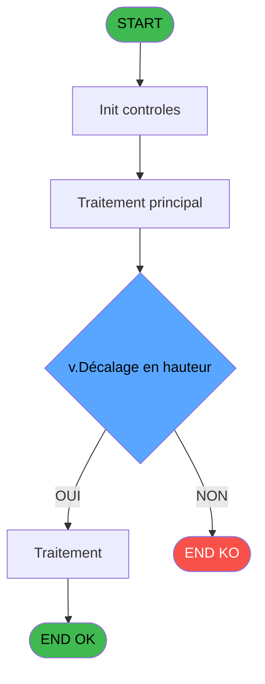
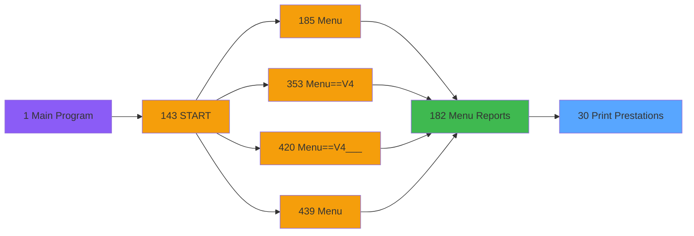

# PVE IDE 30 - Print Prestations

> **Analyse**: Phases 1-4 2026-02-03 01:17 -> 01:17 (38s) | Assemblage 01:17
> **Pipeline**: V7.2 Enrichi
> **Structure**: 4 onglets (Resume | Ecrans | Donnees | Connexions)

<!-- TAB:Resume -->

## 1. FICHE D'IDENTITE

| Attribut | Valeur |
|----------|--------|
| Projet | PVE |
| IDE Position | 30 |
| Nom Programme | Print Prestations |
| Fichier source | `Prg_30.xml` |
| Domaine metier | Impression |
| Taches | 8 (1 ecrans visibles) |
| Tables modifiees | 0 |
| Programmes appeles | 0 |

## 2. DESCRIPTION FONCTIONNELLE

**Print Prestations** assure la gestion complete de ce processus, accessible depuis [Menu Reports (IDE 182)](PVE-IDE-182.md).

Le flux de traitement s'organise en **2 blocs fonctionnels** :

- **Impression** (6 taches) : generation de tickets et documents
- **Traitement** (2 taches) : traitements metier divers

**Logique metier** : 1 regles identifiees couvrant conditions metier.

Detail : phases du traitement

#### Phase 1 : Impression (6 taches)

- **30** - Print Prepaid Packages **[[ECRAN]](#ecran-t1)**
- **30.1** - Print
- **30.1.1** - EDITION
- **30.1.3** - EDITION
- **30.1.4** - EDITION
- **30.1.5** - EDITION

#### Phase 2 : Traitement (2 taches)

- **30.1.2** - Prestations SKI
- **30.1.2.1** - Prestations PMS

## 3. BLOCS FONCTIONNELS

### 3.1 Impression (6 taches)

Generation des documents et tickets.

---

#### 30 - Print Prepaid Packages [[ECRAN]](#ecran-t1)

**Role** : Tache d'orchestration : point d'entree du programme (6 sous-taches). Coordonne l'enchainement des traitements.
**Ecran** : 314 x 219 DLU (MDI) | [Voir mockup](#ecran-t1)

5 sous-taches directes

| Tache | Nom | Bloc |
|-------|-----|------|
| [30.1](#t2) | Print | Impression |
| [30.1.1](#t3) | EDITION | Impression |
| [30.1.3](#t6) | EDITION | Impression |
| [30.1.4](#t7) | EDITION | Impression |
| [30.1.5](#t8) | EDITION | Impression |

---

#### 30.1 - Print

**Role** : Generation du document : Print.

---

#### 30.1.1 - EDITION

**Role** : Generation du document : EDITION.
**Variables liees** : F (Type Edition)

---

#### 30.1.3 - EDITION

**Role** : Generation du document : EDITION.
**Variables liees** : F (Type Edition)

---

#### 30.1.4 - EDITION

**Role** : Generation du document : EDITION.
**Variables liees** : F (Type Edition)

---

#### 30.1.5 - EDITION

**Role** : Generation du document : EDITION.
**Variables liees** : F (Type Edition)

### 3.2 Traitement (2 taches)

Traitements internes.

---

#### 30.1.2 - Prestations SKI

**Role** : Traitement : Prestations SKI.

---

#### 30.1.2.1 - Prestations PMS

**Role** : Traitement : Prestations PMS.

## 5. REGLES METIER

1 regles identifiees:

### Autres (1 regles)

#### [RM-001] Si VG123 alors 15.875 sinon 15.875-v.Décalage en hauteur [G])

| Element | Detail |
|---------|--------|
| **Condition** | `VG123` |
| **Si vrai** | 15.875 |
| **Si faux** | 15.875-v.Décalage en hauteur [G]) |
| **Variables** | G (v.Décalage en hauteur) |
| **Expression source** | Expression 7 : `IF(VG123,15.875,15.875-v.Décalage en hauteur [G])` |
| **Exemple** | Si VG123 → 15.875. Sinon → 15.875-v.Décalage en hauteur [G]) |

## 6. CONTEXTE

- **Appele par**: [Menu Reports (IDE 182)](PVE-IDE-182.md)
- **Appelle**: 0 programmes | **Tables**: 13 (W:0 R:4 L:12) | **Taches**: 8 | **Expressions**: 10

<!-- TAB:Ecrans -->

## 8. ECRANS

### 8.1 Forms visibles (1 / 8)

| # | Position | Tache | Nom | Type | Largeur | Hauteur | Bloc |
|---|----------|-------|-----|------|---------|---------|------|
| 1 | 30 | 30 | Print Prepaid Packages | MDI | 314 | 219 | Impression |

### 8.2 Mockups Ecrans

---

#### 30 - Print Prepaid Packages
**Tache** : [30](#t1) | **Type** : MDI | **Dimensions** : 314 x 219 DLU
**Bloc** : Impression | **Titre IDE** : Print Prepaid Packages

<!-- FORM-DATA:
{
    "width":  314,
    "vFactor":  8,
    "type":  "MDI",
    "hFactor":  4,
    "controls":  [
                     {
                         "x":  25,
                         "type":  "label",
                         "var":  "",
                         "y":  59,
                         "w":  265,
                         "fmt":  "",
                         "name":  "",
                         "h":  10,
                         "color":  "187",
                         "text":  "Select the range of starting dates for prepaid packages",
                         "parent":  null
                     },
                     {
                         "x":  8,
                         "type":  "label",
                         "var":  "",
                         "y":  75,
                         "w":  48,
                         "fmt":  "",
                         "name":  "",
                         "h":  12,
                         "color":  "183",
                         "text":  "Date min",
                         "parent":  null
                     },
                     {
                         "x":  185,
                         "type":  "label",
                         "var":  "",
                         "y":  75,
                         "w":  51,
                         "fmt":  "",
                         "name":  "",
                         "h":  12,
                         "color":  "183",
                         "text":  "Date max",
                         "parent":  null
                     },
                     {
                         "x":  24,
                         "type":  "label",
                         "var":  "",
                         "y":  97,
                         "w":  265,
                         "fmt":  "",
                         "name":  "",
                         "h":  12,
                         "color":  "187",
                         "text":  "Select the range of creation dates for prepaid packages",
                         "parent":  null
                     },
                     {
                         "x":  7,
                         "type":  "label",
                         "var":  "",
                         "y":  113,
                         "w":  48,
                         "fmt":  "",
                         "name":  "",
                         "h":  12,
                         "color":  "183",
                         "text":  "Date min",
                         "parent":  null
                     },
                     {
                         "x":  184,
                         "type":  "label",
                         "var":  "",
                         "y":  113,
                         "w":  51,
                         "fmt":  "",
                         "name":  "",
                         "h":  12,
                         "color":  "183",
                         "text":  "Date max",
                         "parent":  null
                     },
                     {
                         "x":  0,
                         "type":  "label",
                         "var":  "",
                         "y":  0,
                         "w":  312,
                         "fmt":  "",
                         "name":  "",
                         "h":  41,
                         "color":  "182",
                         "text":  "",
                         "parent":  null
                     },
                     {
                         "x":  8,
                         "type":  "label",
                         "var":  "",
                         "y":  16,
                         "w":  253,
                         "fmt":  "",
                         "name":  "",
                         "h":  10,
                         "color":  "186",
                         "text":  "List of prepaid packages for a specific period",
                         "parent":  11
                     },
                     {
                         "x":  0,
                         "type":  "label",
                         "var":  "",
                         "y":  183,
                         "w":  312,
                         "fmt":  "",
                         "name":  "",
                         "h":  34,
                         "color":  "6",
                         "text":  "",
                         "parent":  null
                     },
                     {
                         "x":  61,
                         "type":  "edit",
                         "var":  "",
                         "y":  75,
                         "w":  73,
                         "fmt":  "",
                         "name":  "",
                         "h":  12,
                         "color":  "110",
                         "text":  "",
                         "parent":  null
                     },
                     {
                         "x":  238,
                         "type":  "edit",
                         "var":  "",
                         "y":  75,
                         "w":  73,
                         "fmt":  "",
                         "name":  "",
                         "h":  12,
                         "color":  "110",
                         "text":  "",
                         "parent":  null
                     },
                     {
                         "x":  242,
                         "type":  "button",
                         "var":  "",
                         "y":  188,
                         "w":  68,
                         "fmt":  "Print",
                         "name":  "",
                         "h":  28,
                         "color":  "",
                         "text":  "",
                         "parent":  16
                     },
                     {
                         "x":  175,
                         "type":  "button",
                         "var":  "",
                         "y":  188,
                         "w":  68,
                         "fmt":  "Exit",
                         "name":  "",
                         "h":  28,
                         "color":  "",
                         "text":  "",
                         "parent":  16
                     },
                     {
                         "x":  262,
                         "type":  "image",
                         "var":  "",
                         "y":  3,
                         "w":  48,
                         "fmt":  "",
                         "name":  "",
                         "h":  37,
                         "color":  "",
                         "text":  "",
                         "parent":  11
                     },
                     {
                         "x":  57,
                         "type":  "radio",
                         "var":  "",
                         "y":  127,
                         "w":  200,
                         "fmt":  "",
                         "name":  "Type Edition",
                         "h":  46,
                         "color":  "183",
                         "text":  "N,P,S,E",
                         "parent":  null
                     },
                     {
                         "x":  60,
                         "type":  "edit",
                         "var":  "",
                         "y":  113,
                         "w":  73,
                         "fmt":  "",
                         "name":  "Date mini_creation",
                         "h":  12,
                         "color":  "110",
                         "text":  "",
                         "parent":  null
                     },
                     {
                         "x":  237,
                         "type":  "edit",
                         "var":  "",
                         "y":  113,
                         "w":  73,
                         "fmt":  "",
                         "name":  "Date maxi_creation",
                         "h":  12,
                         "color":  "110",
                         "text":  "",
                         "parent":  null
                     },
                     {
                         "x":  9,
                         "type":  "checkbox",
                         "var":  "",
                         "y":  97,
                         "w":  15,
                         "fmt":  "",
                         "name":  "v.Selection sur Date Creation?",
                         "h":  12,
                         "color":  "183",
                         "text":  "",
                         "parent":  null
                     }
                 ],
    "taskId":  "30",
    "height":  219
}
-->

<strong>Champs : 5 champs</strong>

| Pos (x,y) | Nom | Variable | Type |
|-----------|-----|----------|------|
| 61,75 | (sans nom) | - | edit |
| 238,75 | (sans nom) | - | edit |
| 60,113 | Date mini_creation | - | edit |
| 237,113 | Date maxi_creation | - | edit |
| 9,97 | v.Selection sur Date Creation? | - | checkbox |

<strong>Boutons : 2 boutons</strong>

| Bouton | Pos (x,y) | Action |
|--------|-----------|--------|
| Print | 242,188 | Lance l'impression |
| Exit | 175,188 | Quitte le programme |

## 9. NAVIGATION

Ecran unique: **Print Prepaid Packages**

### 9.3 Structure hierarchique (8 taches)

| Position | Tache | Type | Dimensions | Bloc |
|----------|-------|------|------------|------|
| **30.1** | [**Print Prepaid Packages** (30)](#t1) [mockup](#ecran-t1) | MDI | 314x219 | Impression |
| 30.1.1 | [Print (30.1)](#t2) | MDI | - | |
| 30.1.2 | [EDITION (30.1.1)](#t3) | MDI | - | |
| 30.1.3 | [EDITION (30.1.3)](#t6) | MDI | - | |
| 30.1.4 | [EDITION (30.1.4)](#t7) | MDI | - | |
| 30.1.5 | [EDITION (30.1.5)](#t8) | MDI | - | |
| **30.2** | [**Prestations SKI** (30.1.2)](#t4) | MDI | - | Traitement |
| 30.2.1 | [Prestations PMS (30.1.2.1)](#t5) | MDI | - | |

### 9.4 Algorigramme

> **Legende**: Vert = START/END OK | Rouge = END KO | Bleu = Decisions
> *Algorigramme auto-genere. Utiliser `/algorigramme` pour une synthese metier detaillee.*

<!-- TAB:Donnees -->

## 10. TABLES

### Tables utilisees (13)

| ID | Nom | Description | Type | R | W | L | Usages |
|----|-----|-------------|------|---|---|---|--------|
| 30 | gm-recherche_____gmr | Index de recherche | DB | R |   | L | 4 |
| 31 | gm-complet_______gmc |  | DB | R |   |   | 1 |
| 33 | prestations______pre | Prestations/services vendus | DB |   |   | L | 1 |
| 34 | hebergement______heb | Hebergement (chambres) | DB |   |   | L | 1 |
| 382 | pv_discount_reasons |  | DB |   |   | L | 1 |
| 401 | pv_cust_rentals_histo | Historique / journal | DB | R |   | L | 2 |
| 402 | pv_sboarder_types |  | DB | R |   | L | 2 |
| 403 | pv_sellers |  | DB |   |   | L | 1 |
| 413 | pv_tva |  | DB |   |   | L | 1 |
| 419 | realise_articles_caution | Articles et stock | DB |   |   | L | 2 |
| 536 | listing_telecollecte |  | TMP |   |   | L | 4 |
| 805 | vente_par_moyen_paiement | Donnees de ventes | DB |   |   | L | 2 |
| 808 | Selection des noms a supprimer |  | DB |   |   | L | 1 |

### Colonnes par table (3 / 4 tables avec colonnes identifiees)

Table 30 - gm-recherche_____gmr (R/L) - 4 usages

| Lettre | Variable | Acces | Type |
|--------|----------|-------|------|
| A | v.Nom a éditer? | R | Logical |
| B | v.Séparation Filiatio à éditer? | R | Logical |
| C | v.Séparation Compte à éditer? | R | Logical |
| D | v.Edition Date? | R | Logical |
| E | v.Nom 1 | R | Unicode |
| F | v.Prenom 1 | R | Unicode |
| G | v.Age 1 | R | Numeric |
| H | v.Chaussure 1 | R | Unicode |
| I | v.Ski/Snow 1 | R | Unicode |
| J | v.Casque 1 | R | Unicode |
| K | v.Date 2 | R | Date |
| L | v.Nom Maitre 2 | R | Unicode |
| M | v.Nom 2 | R | Unicode |
| N | v.Prenom 2 | R | Unicode |
| O | v.Age 2 | R | Numeric |
| P | v.Chaussure 2 | R | Unicode |
| Q | v.Ski/Snow 2 | R | Unicode |
| R | v.Casque 2 | R | Unicode |
| S | v.Compteur GM | R | Numeric |
| T | v.CompteFiliation | R | Alpha |

Table 31 - gm-complet_______gmc (R) - 1 usages

*Table utilisee uniquement en Link ou aucune colonne Real identifiee dans le DataView.*

Table 401 - pv_cust_rentals_histo (R/L) - 2 usages

*Table utilisee uniquement en Link ou aucune colonne Real identifiee dans le DataView.*

Table 402 - pv_sboarder_types (R/L) - 2 usages

| Lettre | Variable | Acces | Type |
|--------|----------|-------|------|
| A | v.Nom1 | R | Unicode |
| B | v.Prenom1 | R | Unicode |
| C | v.Sexe1 | R | Unicode |
| D | v.Age1 | R | Numeric |
| E | v.NomLogement1 | R | Unicode |
| F | v.PointureSki1 | R | Unicode |
| G | v.PointureChaussure1 | R | Unicode |
| H | v.TailleCasque1 | R | Unicode |
| I | v.Taille1 | R | Numeric |
| J | v.Poids1 | R | Numeric |
| K | v.TypePratique1 | R | Unicode |
| L | v.NiveauPratique1 | R | Unicode |
| M | v.ClassificationSkiSnow1 | R | Unicode |
| N | v.TypeMatosCat1 | R | Unicode |
| O | v.TypeChaussure1 | R | Unicode |
| P | v.Nom2 | R | Unicode |
| Q | v.Prenom2 | R | Unicode |
| R | v.Sexe2 | R | Unicode |
| S | v.Age2 | R | Numeric |
| T | v.NomLogement2 | R | Unicode |
| U | v.PointureSki2 | R | Unicode |
| V | v.PointureChaussure2 | R | Unicode |
| W | v.TailleCasque2 | R | Unicode |
| X | v.Taille2 | R | Numeric |
| Y | v.Poids2 | R | Numeric |
| Z | v.TypePratique2 | R | Unicode |
| BA | v.NiveauPratique2 | R | Unicode |
| BB | v.ClassificationSkiSnow2 | R | Unicode |
| BC | v.TypeMatosCat2 | R | Unicode |
| BD | v.TypeChaussure2 | R | Unicode |
| BE | v.Nom3 | R | Unicode |
| BF | v.Prenom3 | R | Unicode |
| BG | v.Sexe3 | R | Unicode |
| BH | v.Age3 | R | Numeric |
| BI | v.NomLogement3 | R | Unicode |
| BJ | v.PointureSki3 | R | Unicode |
| BK | v.PointureChaussure3 | R | Unicode |
| BL | v.TailleCasque3 | R | Unicode |
| BM | v.Taille3 | R | Numeric |
| BN | v.Poids3 | R | Numeric |
| BO | v.TypePratique3 | R | Unicode |
| BP | v.NiveauPratique3 | R | Unicode |
| BQ | v.ClassificationSkiSnow3 | R | Unicode |
| BR | v.TypeMatosCat3 | R | Unicode |
| BS | v.TypeChaussure3 | R | Unicode |
| BT | v.Compteur GM | R | Numeric |
| BU | v.Position 1er prénom | R | Numeric |
| BV | v.Longueur 1er prénom | R | Numeric |
| BW | v.Longueur 1er nom | R | Numeric |
| BX | v.Longueur 1er reste | R | Numeric |
| BY | v.Longueur max dispo 1er | R | Numeric |
| BZ | v.Position 2e prénom | R | Numeric |
| CA | v.Longueur 2e prénom | R | Numeric |
| CB | v.Longueur 2e nom | R | Numeric |
| CC | v.Longueur 2e reste | R | Numeric |
| CD | v.Longueur max dispo 2e | R | Numeric |
| CE | v.Position 3e prénom | R | Numeric |
| CF | v.Longueur 3e prénom | R | Numeric |
| CG | v.Longueur 3e nom | R | Numeric |
| CH | v.Longueur 3e reste | R | Numeric |
| CI | v.Longueur max dispo 3e | R | Numeric |
| CJ | v.Coefficiant taille réelle | R | Numeric |

## 11. VARIABLES

### 11.1 Variables de session (57)

Variables persistantes pendant toute la session.

| Lettre | Nom | Type | Usage dans |
|--------|-----|------|-----------|
| C | v.Selection sur Date Creation? | Logical | - |
| G | v.Décalage en hauteur | Numeric | 3x session |
| H | v.TailleCasque1 | Unicode | - |
| I | v.Taille1 | Numeric | - |
| J | v.Poids1 | Numeric | - |
| K | v.TypePratique1 | Unicode | - |
| L | v.NiveauPratique1 | Unicode | - |
| M | v.ClassificationSkiSnow1 | Unicode | - |
| N | v.TypeMatosCat1 | Unicode | - |
| O | v.TypeChaussure1 | Unicode | - |
| P | v.Nom2 | Unicode | - |
| Q | v.Prenom2 | Unicode | - |
| R | v.Sexe2 | Unicode | - |
| S | v.Age2 | Numeric | - |
| T | v.NomLogement2 | Unicode | - |
| U | v.PointureSki2 | Unicode | - |
| V | v.PointureChaussure2 | Unicode | - |
| W | v.TailleCasque2 | Unicode | - |
| X | v.Taille2 | Numeric | - |
| Y | v.Poids2 | Numeric | - |
| Z | v.TypePratique2 | Unicode | - |
| BA | v.NiveauPratique2 | Unicode | - |
| BB | v.ClassificationSkiSnow2 | Unicode | - |
| BC | v.TypeMatosCat2 | Unicode | - |
| BD | v.TypeChaussure2 | Unicode | - |
| BE | v.Nom3 | Unicode | - |
| BF | v.Prenom3 | Unicode | - |
| BG | v.Sexe3 | Unicode | - |
| BH | v.Age3 | Numeric | - |
| BI | v.NomLogement3 | Unicode | - |
| BJ | v.PointureSki3 | Unicode | - |
| BK | v.PointureChaussure3 | Unicode | - |
| BL | v.TailleCasque3 | Unicode | - |
| BM | v.Taille3 | Numeric | - |
| BN | v.Poids3 | Numeric | - |
| BO | v.TypePratique3 | Unicode | - |
| BP | v.NiveauPratique3 | Unicode | - |
| BQ | v.ClassificationSkiSnow3 | Unicode | - |
| BR | v.TypeMatosCat3 | Unicode | - |
| BS | v.TypeChaussure3 | Unicode | - |
| BT | v.Compteur GM | Numeric | - |
| BU | v.Position 1er prénom | Numeric | - |
| BV | v.Longueur 1er prénom | Numeric | - |
| BW | v.Longueur 1er nom | Numeric | - |
| BX | v.Longueur 1er reste | Numeric | - |
| BY | v.Longueur max dispo 1er | Numeric | - |
| BZ | v.Position 2e prénom | Numeric | - |
| CA | v.Longueur 2e prénom | Numeric | - |
| CB | v.Longueur 2e nom | Numeric | - |
| CC | v.Longueur 2e reste | Numeric | - |
| CD | v.Longueur max dispo 2e | Numeric | - |
| CE | v.Position 3e prénom | Numeric | - |
| CF | v.Longueur 3e prénom | Numeric | - |
| CG | v.Longueur 3e nom | Numeric | - |
| CH | v.Longueur 3e reste | Numeric | - |
| CI | v.Longueur max dispo 3e | Numeric | - |
| CJ | v.Coefficiant taille réelle | Numeric | - |

### 11.2 Autres (5)

Variables diverses.

| Lettre | Nom | Type | Usage dans |
|--------|-----|------|-----------|
| A | Date mini | Date | - |
| B | Date maxi | Date | - |
| D | Date mini_creation | Date | - |
| E | Date maxi_creation | Date | - |
| F | Type Edition | Alpha | - |

Toutes les 62 variables (liste complete)

| Cat | Lettre | Nom Variable | Type |
|-----|--------|--------------|------|
| V. | **C** | v.Selection sur Date Creation? | Logical |
| V. | **G** | v.Décalage en hauteur | Numeric |
| V. | **H** | v.TailleCasque1 | Unicode |
| V. | **I** | v.Taille1 | Numeric |
| V. | **J** | v.Poids1 | Numeric |
| V. | **K** | v.TypePratique1 | Unicode |
| V. | **L** | v.NiveauPratique1 | Unicode |
| V. | **M** | v.ClassificationSkiSnow1 | Unicode |
| V. | **N** | v.TypeMatosCat1 | Unicode |
| V. | **O** | v.TypeChaussure1 | Unicode |
| V. | **P** | v.Nom2 | Unicode |
| V. | **Q** | v.Prenom2 | Unicode |
| V. | **R** | v.Sexe2 | Unicode |
| V. | **S** | v.Age2 | Numeric |
| V. | **T** | v.NomLogement2 | Unicode |
| V. | **U** | v.PointureSki2 | Unicode |
| V. | **V** | v.PointureChaussure2 | Unicode |
| V. | **W** | v.TailleCasque2 | Unicode |
| V. | **X** | v.Taille2 | Numeric |
| V. | **Y** | v.Poids2 | Numeric |
| V. | **Z** | v.TypePratique2 | Unicode |
| V. | **BA** | v.NiveauPratique2 | Unicode |
| V. | **BB** | v.ClassificationSkiSnow2 | Unicode |
| V. | **BC** | v.TypeMatosCat2 | Unicode |
| V. | **BD** | v.TypeChaussure2 | Unicode |
| V. | **BE** | v.Nom3 | Unicode |
| V. | **BF** | v.Prenom3 | Unicode |
| V. | **BG** | v.Sexe3 | Unicode |
| V. | **BH** | v.Age3 | Numeric |
| V. | **BI** | v.NomLogement3 | Unicode |
| V. | **BJ** | v.PointureSki3 | Unicode |
| V. | **BK** | v.PointureChaussure3 | Unicode |
| V. | **BL** | v.TailleCasque3 | Unicode |
| V. | **BM** | v.Taille3 | Numeric |
| V. | **BN** | v.Poids3 | Numeric |
| V. | **BO** | v.TypePratique3 | Unicode |
| V. | **BP** | v.NiveauPratique3 | Unicode |
| V. | **BQ** | v.ClassificationSkiSnow3 | Unicode |
| V. | **BR** | v.TypeMatosCat3 | Unicode |
| V. | **BS** | v.TypeChaussure3 | Unicode |
| V. | **BT** | v.Compteur GM | Numeric |
| V. | **BU** | v.Position 1er prénom | Numeric |
| V. | **BV** | v.Longueur 1er prénom | Numeric |
| V. | **BW** | v.Longueur 1er nom | Numeric |
| V. | **BX** | v.Longueur 1er reste | Numeric |
| V. | **BY** | v.Longueur max dispo 1er | Numeric |
| V. | **BZ** | v.Position 2e prénom | Numeric |
| V. | **CA** | v.Longueur 2e prénom | Numeric |
| V. | **CB** | v.Longueur 2e nom | Numeric |
| V. | **CC** | v.Longueur 2e reste | Numeric |
| V. | **CD** | v.Longueur max dispo 2e | Numeric |
| V. | **CE** | v.Position 3e prénom | Numeric |
| V. | **CF** | v.Longueur 3e prénom | Numeric |
| V. | **CG** | v.Longueur 3e nom | Numeric |
| V. | **CH** | v.Longueur 3e reste | Numeric |
| V. | **CI** | v.Longueur max dispo 3e | Numeric |
| V. | **CJ** | v.Coefficiant taille réelle | Numeric |
| Autre | **A** | Date mini | Date |
| Autre | **B** | Date maxi | Date |
| Autre | **D** | Date mini_creation | Date |
| Autre | **E** | Date maxi_creation | Date |
| Autre | **F** | Type Edition | Alpha |

## 12. EXPRESSIONS

**10 / 10 expressions decodees (100%)**

### 12.1 Repartition par type

| Type | Expressions | Regles |
|------|-------------|--------|
| CONDITION | 3 | 5 |
| CONSTANTE | 2 | 0 |
| DATE | 2 | 0 |
| CAST_LOGIQUE | 1 | 0 |
| OTHER | 1 | 0 |
| REFERENCE_VG | 1 | 0 |

### 12.2 Expressions cles par type

#### CONDITION (3 expressions)

| Type | IDE | Expression | Regle |
|------|-----|------------|-------|
| CONDITION | 7 | `IF(VG123,15.875,15.875-v.Décalage en hauteur [G])` | [RM-001](#rm-RM-001) |
| CONDITION | 9 | `IF(VG123,27.375,27.375-v.Décalage en hauteur [G])` | - |
| CONDITION | 8 | `IF(VG123,22.875,22.875-v.Décalage en hauteur [G])` | - |

#### CONSTANTE (2 expressions)

| Type | IDE | Expression | Regle |
|------|-----|------------|-------|
| CONSTANTE | 10 | `5` | - |
| CONSTANTE | 3 | `'P'` | - |

#### DATE (2 expressions)

| Type | IDE | Expression | Regle |
|------|-----|------------|-------|
| DATE | 2 | `Date ()-1` | - |
| DATE | 1 | `Date ()` | - |

#### CAST_LOGIQUE (1 expressions)

| Type | IDE | Expression | Regle |
|------|-----|------------|-------|
| CAST_LOGIQUE | 4 | `'FALSE'LOG` | - |

#### OTHER (1 expressions)

| Type | IDE | Expression | Regle |
|------|-----|------------|-------|
| OTHER | 5 | `v.Selection sur Date C... [C]` | - |

#### REFERENCE_VG (1 expressions)

| Type | IDE | Expression | Regle |
|------|-----|------------|-------|
| REFERENCE_VG | 6 | `VG123` | - |

<!-- TAB:Connexions -->

## 13. GRAPHE D'APPELS

### 13.1 Chaine depuis Main (Callers)

Main -> ... -> [Menu Reports (IDE 182)](PVE-IDE-182.md) -> **Print Prestations (IDE 30)**

### 13.2 Callers

| IDE | Nom Programme | Nb Appels |
|-----|---------------|-----------|
| [182](PVE-IDE-182.md) | Menu Reports | 1 |

### 13.3 Callees (programmes appeles)

### 13.4 Detail Callees avec contexte

| IDE | Nom Programme | Appels | Contexte |
|-----|---------------|--------|----------|
| - | (aucun) | - | - |

## 14. RECOMMANDATIONS MIGRATION

### 14.1 Profil du programme

| Metrique | Valeur | Impact migration |
|----------|--------|-----------------|
| Lignes de logique | 501 | Programme volumineux |
| Expressions | 10 | Peu de logique |
| Tables WRITE | 0 | Impact faible |
| Sous-programmes | 0 | Peu de dependances |
| Ecrans visibles | 1 | Ecran unique ou traitement batch |
| Code desactive | 0% (0 / 501) | Code sain |
| Regles metier | 1 | Quelques regles a preserver |

### 14.2 Plan de migration par bloc

#### Impression (6 taches: 1 ecran, 5 traitements)

- **Strategie** : Templates HTML -> PDF via wkhtmltopdf ou Puppeteer.
- `PrintService` injectable avec choix imprimante

#### Traitement (2 taches: 0 ecran, 2 traitements)

- **Strategie** : 2 service(s) backend injectable(s) (Domain Services).
- Decomposer les taches en services unitaires testables.

### 14.3 Dependances critiques

| Dependance | Type | Appels | Impact |
|------------|------|--------|--------|

---
*Spec DETAILED generee par Pipeline V7.2 - 2026-02-03 01:18*
