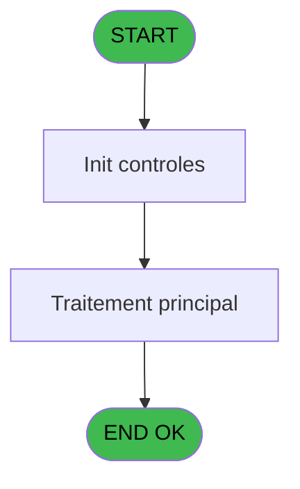
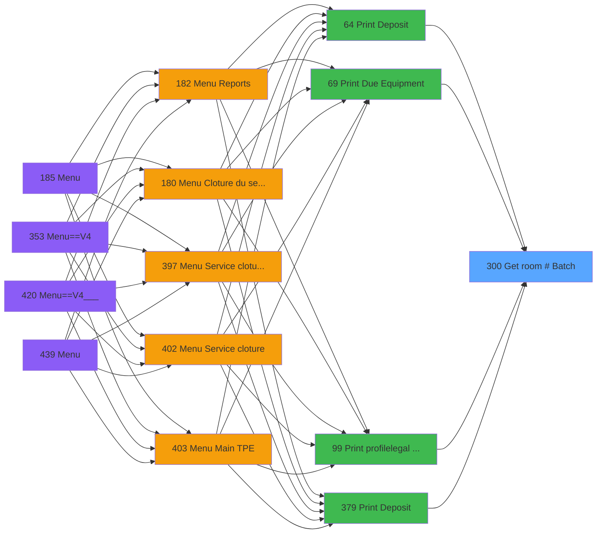

# PVE IDE 300 - Get room # (Batch)

> **Analyse**: Phases 1-4 2026-02-03 19:28 -> 19:29 (12s) | Assemblage 19:29
> **Pipeline**: V7.2 Enrichi
> **Structure**: 4 onglets (Resume | Ecrans | Donnees | Connexions)

<!-- TAB:Resume -->

## 1. FICHE D'IDENTITE

| Attribut | Valeur |
|----------|--------|
| Projet | PVE |
| IDE Position | 300 |
| Nom Programme | Get room # (Batch) |
| Fichier source | `Prg_300.xml` |
| Dossier IDE | Utilitaires |
| Taches | 1 (0 ecrans visibles) |
| Tables modifiees | 0 |
| Programmes appeles | 0 |

## 2. DESCRIPTION FONCTIONNELLE

**Get room # (Batch)** assure la gestion complete de ce processus, accessible depuis [Print Deposit (IDE 64)](PVE-IDE-64.md), [Print Due Equipment (IDE 69)](PVE-IDE-69.md), [Print profile/legal form (IDE 99)](PVE-IDE-99.md), [Print Deposit (IDE 379)](PVE-IDE-379.md).

Le flux de traitement s'organise en **1 blocs fonctionnels** :

- **Traitement** (1 tache) : traitements metier divers

**Logique metier** : 1 regles identifiees couvrant conditions metier.

## 3. BLOCS FONCTIONNELS

### 3.1 Traitement (1 tache)

Traitements internes.

---

#### 300 - room [[ECRAN]](#ecran-t1)

**Role** : Traitement : room.
**Ecran** : 466 x 126 DLU (Modal) | [Voir mockup](#ecran-t1)
**Variables liees** : D (p.room number)

## 5. REGLES METIER

1 regles identifiees:

### Autres (1 regles)

#### [RM-001] Traitement conditionnel si R.lien heberg. [E] est a zero

| Element | Detail |
|---------|--------|
| **Condition** | `R.lien heberg. [E]=0` |
| **Si vrai** | [R] |
| **Si faux** | IF (R.lien heberg. [E]<>0 AND R.Heb Déb à DatJour [F]=0 AND R.Heb Fin à DatJour [G]<>0,[X],'')) |
| **Variables** | E (R.lien heberg.), F (R.Heb Déb à DatJour), G (R.Heb Fin à DatJour) |
| **Expression source** | Expression 5 : `IF (R.lien heberg. [E]=0,[R],IF (R.lien heberg. [E]<>0 AND R` |
| **Exemple** | Si R.lien heberg. [E]=0 → [R] |

## 6. CONTEXTE

- **Appele par**: [Print Deposit (IDE 64)](PVE-IDE-64.md), [Print Due Equipment (IDE 69)](PVE-IDE-69.md), [Print profile/legal form (IDE 99)](PVE-IDE-99.md), [Print Deposit (IDE 379)](PVE-IDE-379.md)
- **Appelle**: 0 programmes | **Tables**: 1 (W:0 R:1 L:0) | **Taches**: 1 | **Expressions**: 7

<!-- TAB:Ecrans -->

## 8. ECRANS

*(Programme sans ecran visible)*

## 9. NAVIGATION

### 9.3 Structure hierarchique (1 tache)

| Position | Tache | Type | Dimensions | Bloc |
|----------|-------|------|------------|------|
| **300.1** | [**room** (300)](#t1) [mockup](#ecran-t1) | Modal | 466x126 | Traitement |

### 9.4 Algorigramme

> **Legende**: Vert = START/END OK | Rouge = END KO | Bleu = Decisions
> *Algorigramme auto-genere. Utiliser `/algorigramme` pour une synthese metier detaillee.*

<!-- TAB:Donnees -->

## 10. TABLES

### Tables utilisees (1)

| ID | Nom | Description | Type | R | W | L | Usages |
|----|-----|-------------|------|---|---|---|--------|
| 34 | hebergement______heb | Hebergement (chambres) | DB | R |   |   | 1 |

### Colonnes par table (1 / 1 tables avec colonnes identifiees)

Table 34 - hebergement______heb (R) - 1 usages

| Lettre | Variable | Acces | Type |
|--------|----------|-------|------|
| A | p.societe | R | Alpha |
| B | p.code gm | R | Numeric |
| C | p.filiation | R | Numeric |
| D | p.room number | R | Alpha |
| E | R.lien heberg. | R | Numeric |
| F | R.Heb Déb à DatJour | R | Numeric |
| G | R.Heb Fin à DatJour | R | Numeric |

## 11. VARIABLES

### 11.1 Parametres entrants (4)

Variables recues du programme appelant ([Print Deposit (IDE 64)](PVE-IDE-64.md)).

| Lettre | Nom | Type | Usage dans |
|--------|-----|------|-----------|
| A | p.societe | Alpha | 1x parametre entrant |
| B | p.code gm | Numeric | 1x parametre entrant |
| C | p.filiation | Numeric | 1x parametre entrant |
| D | p.room number | Alpha | 1x parametre entrant |

### 11.2 Autres (3)

Variables diverses.

| Lettre | Nom | Type | Usage dans |
|--------|-----|------|-----------|
| E | R.lien heberg. | Numeric | 1x refs |
| F | R.Heb Déb à DatJour | Numeric | 1x refs |
| G | R.Heb Fin à DatJour | Numeric | 1x refs |

## 12. EXPRESSIONS

**7 / 7 expressions decodees (100%)**

### 12.1 Repartition par type

| Type | Expressions | Regles |
|------|-------------|--------|
| CONDITION | 1 | 5 |
| CONSTANTE | 1 | 0 |
| DATE | 1 | 0 |
| OTHER | 4 | 0 |

### 12.2 Expressions cles par type

#### CONDITION (1 expressions)

| Type | IDE | Expression | Regle |
|------|-----|------------|-------|
| CONDITION | 5 | `IF (R.lien heberg. [E]=0,[R],IF (R.lien heberg. [E]<>0 AND R.Heb Déb à DatJour [F]=0 AND R.Heb Fin à DatJour [G]<>0,[X],''))` | [RM-001](#rm-RM-001) |

#### CONSTANTE (1 expressions)

| Type | IDE | Expression | Regle |
|------|-----|------------|-------|
| CONSTANTE | 4 | `'H'` | - |

#### DATE (1 expressions)

| Type | IDE | Expression | Regle |
|------|-----|------------|-------|
| DATE | 6 | `Date ()` | - |

#### OTHER (4 expressions)

| Type | IDE | Expression | Regle |
|------|-----|------------|-------|
| OTHER | 3 | `p.filiation [C]` | - |
| OTHER | 7 | `p.room number [D]` | - |
| OTHER | 1 | `p.societe [A]` | - |
| OTHER | 2 | `p.code gm [B]` | - |

<!-- TAB:Connexions -->

## 13. GRAPHE D'APPELS

### 13.1 Chaine depuis Main (Callers)

Main -> ... -> [Print Deposit (IDE 64)](PVE-IDE-64.md) -> **Get room # (Batch) (IDE 300)**

Main -> ... -> [Print Due Equipment (IDE 69)](PVE-IDE-69.md) -> **Get room # (Batch) (IDE 300)**

Main -> ... -> [Print profile/legal form (IDE 99)](PVE-IDE-99.md) -> **Get room # (Batch) (IDE 300)**

Main -> ... -> [Print Deposit (IDE 379)](PVE-IDE-379.md) -> **Get room # (Batch) (IDE 300)**

### 13.2 Callers

| IDE | Nom Programme | Nb Appels |
|-----|---------------|-----------|
| [64](PVE-IDE-64.md) | Print Deposit | 1 |
| [69](PVE-IDE-69.md) | Print Due Equipment | 1 |
| [99](PVE-IDE-99.md) | Print profile/legal form | 1 |
| [379](PVE-IDE-379.md) | Print Deposit | 1 |

### 13.3 Callees (programmes appeles)

### 13.4 Detail Callees avec contexte

| IDE | Nom Programme | Appels | Contexte |
|-----|---------------|--------|----------|
| - | (aucun) | - | - |

## 14. RECOMMANDATIONS MIGRATION

### 14.1 Profil du programme

| Metrique | Valeur | Impact migration |
|----------|--------|-----------------|
| Lignes de logique | 42 | Programme compact |
| Expressions | 7 | Peu de logique |
| Tables WRITE | 0 | Impact faible |
| Sous-programmes | 0 | Peu de dependances |
| Ecrans visibles | 0 | Ecran unique ou traitement batch |
| Code desactive | 0% (0 / 42) | Code sain |
| Regles metier | 1 | Quelques regles a preserver |

### 14.2 Plan de migration par bloc

#### Traitement (1 tache: 1 ecran, 0 traitement)

- **Strategie** : 1 composant(s) UI (Razor/React) avec formulaires et validation.
- Decomposer les taches en services unitaires testables.

### 14.3 Dependances critiques

| Dependance | Type | Appels | Impact |
|------------|------|--------|--------|

---
*Spec DETAILED generee par Pipeline V7.2 - 2026-02-03 19:29*
