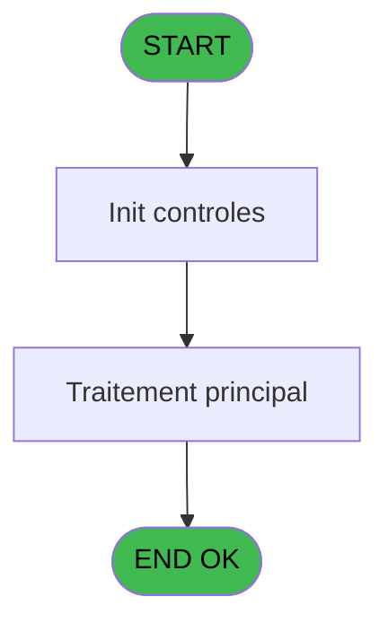
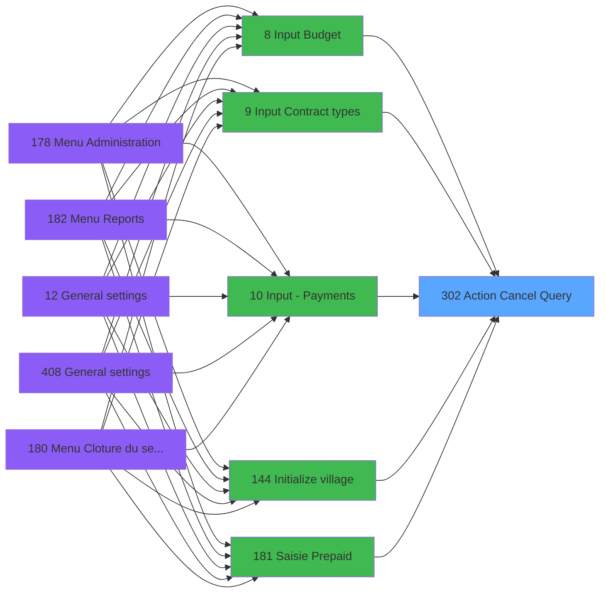

# PVE IDE 302 - Action Cancel Query

> **Analyse**: Phases 1-4 2026-02-03 19:29 -> 19:29 (12s) | Assemblage 19:29
> **Pipeline**: V7.2 Enrichi
> **Structure**: 4 onglets (Resume | Ecrans | Donnees | Connexions)

<!-- TAB:Resume -->

## 1. FICHE D'IDENTITE

| Attribut | Valeur |
|----------|--------|
| Projet | PVE |
| IDE Position | 302 |
| Nom Programme | Action Cancel Query |
| Fichier source | `Prg_302.xml` |
| Dossier IDE | Utilitaires |
| Taches | 1 (0 ecrans visibles) |
| Tables modifiees | 0 |
| Programmes appeles | 0 |

## 2. DESCRIPTION FONCTIONNELLE

**Action Cancel Query** assure la gestion complete de ce processus, accessible depuis [Input Budget (IDE 8)](PVE-IDE-8.md), [Input Contract types (IDE 9)](PVE-IDE-9.md), [Input - Payments (IDE 10)](PVE-IDE-10.md), [Initialize village (IDE 144)](PVE-IDE-144.md), [Saisie Prepaid (IDE 181)](PVE-IDE-181.md), [Choix - Classification (IDE 247)](PVE-IDE-247.md), [Choix - Status (IDE 248)](PVE-IDE-248.md), [Choix - Weight (IDE 249)](PVE-IDE-249.md), [Choix - Height (IDE 252)](PVE-IDE-252.md), [Choix - Types (skier) (IDE 254)](PVE-IDE-254.md), [Choix - Types (sb) (IDE 255)](PVE-IDE-255.md), [Choix - Manufacturers (IDE 258)](PVE-IDE-258.md), [Choix - Equipment models (IDE 259)](PVE-IDE-259.md), [Choix - Equipment owners (IDE 260)](PVE-IDE-260.md), [Choix - Discount list (IDE 261)](PVE-IDE-261.md), [Choix - Binding settings (IDE 262)](PVE-IDE-262.md), [Choix - Select AM/PM (IDE 263)](PVE-IDE-263.md), [Choix - Selling Units (IDE 265)](PVE-IDE-265.md), [Choix - Discounts (IDE 266)](PVE-IDE-266.md), [Choix - TVA (IDE 267)](PVE-IDE-267.md).

Le flux de traitement s'organise en **1 blocs fonctionnels** :

- **Traitement** (1 tache) : traitements metier divers

## 3. BLOCS FONCTIONNELS

### 3.1 Traitement (1 tache)

Traitements internes.

---

#### 302 - Action Cancel Exit

**Role** : Traitement : Action Cancel Exit.

## 5. REGLES METIER

*(Aucune regle metier identifiee)*

## 6. CONTEXTE

- **Appele par**: [Input Budget (IDE 8)](PVE-IDE-8.md), [Input Contract types (IDE 9)](PVE-IDE-9.md), [Input - Payments (IDE 10)](PVE-IDE-10.md), [Initialize village (IDE 144)](PVE-IDE-144.md), [Saisie Prepaid (IDE 181)](PVE-IDE-181.md), [Choix - Classification (IDE 247)](PVE-IDE-247.md), [Choix - Status (IDE 248)](PVE-IDE-248.md), [Choix - Weight (IDE 249)](PVE-IDE-249.md), [Choix - Height (IDE 252)](PVE-IDE-252.md), [Choix - Types (skier) (IDE 254)](PVE-IDE-254.md), [Choix - Types (sb) (IDE 255)](PVE-IDE-255.md), [Choix - Manufacturers (IDE 258)](PVE-IDE-258.md), [Choix - Equipment models (IDE 259)](PVE-IDE-259.md), [Choix - Equipment owners (IDE 260)](PVE-IDE-260.md), [Choix - Discount list (IDE 261)](PVE-IDE-261.md), [Choix - Binding settings (IDE 262)](PVE-IDE-262.md), [Choix - Select AM/PM (IDE 263)](PVE-IDE-263.md), [Choix - Selling Units (IDE 265)](PVE-IDE-265.md), [Choix - Discounts (IDE 266)](PVE-IDE-266.md), [Choix - TVA (IDE 267)](PVE-IDE-267.md)
- **Appelle**: 0 programmes | **Tables**: 0 (W:0 R:0 L:0) | **Taches**: 1 | **Expressions**: 0

<!-- TAB:Ecrans -->

## 8. ECRANS

*(Programme sans ecran visible)*

## 9. NAVIGATION

### 9.3 Structure hierarchique (1 tache)

| Position | Tache | Type | Dimensions | Bloc |
|----------|-------|------|------------|------|
| **302.1** | [**Action Cancel Exit** (302)](#t1) | MDI | - | Traitement |

### 9.4 Algorigramme

> **Legende**: Vert = START/END OK | Rouge = END KO | Bleu = Decisions
> *Algorigramme auto-genere. Utiliser `/algorigramme` pour une synthese metier detaillee.*

<!-- TAB:Donnees -->

## 10. TABLES

### Tables utilisees (0)

| ID | Nom | Description | Type | R | W | L | Usages |
|----|-----|-------------|------|---|---|---|--------|

### Colonnes par table (0 / 0 tables avec colonnes identifiees)

## 11. VARIABLES

*(Programme sans variables locales mappees)*

## 12. EXPRESSIONS

**0 / 0 expressions decodees (0%)**

### 12.1 Repartition par type

| Type | Expressions | Regles |
|------|-------------|--------|

### 12.2 Expressions cles par type

<!-- TAB:Connexions -->

## 13. GRAPHE D'APPELS

### 13.1 Chaine depuis Main (Callers)

Main -> ... -> [Input Budget (IDE 8)](PVE-IDE-8.md) -> **Action Cancel Query (IDE 302)**

Main -> ... -> [Input Contract types (IDE 9)](PVE-IDE-9.md) -> **Action Cancel Query (IDE 302)**

Main -> ... -> [Input - Payments (IDE 10)](PVE-IDE-10.md) -> **Action Cancel Query (IDE 302)**

Main -> ... -> [Initialize village (IDE 144)](PVE-IDE-144.md) -> **Action Cancel Query (IDE 302)**

Main -> ... -> [Saisie Prepaid (IDE 181)](PVE-IDE-181.md) -> **Action Cancel Query (IDE 302)**

Main -> ... -> [Choix - Classification (IDE 247)](PVE-IDE-247.md) -> **Action Cancel Query (IDE 302)**

Main -> ... -> [Choix - Status (IDE 248)](PVE-IDE-248.md) -> **Action Cancel Query (IDE 302)**

Main -> ... -> [Choix - Weight (IDE 249)](PVE-IDE-249.md) -> **Action Cancel Query (IDE 302)**

Main -> ... -> [Choix - Height (IDE 252)](PVE-IDE-252.md) -> **Action Cancel Query (IDE 302)**

Main -> ... -> [Choix - Types (skier) (IDE 254)](PVE-IDE-254.md) -> **Action Cancel Query (IDE 302)**

Main -> ... -> [Choix - Types (sb) (IDE 255)](PVE-IDE-255.md) -> **Action Cancel Query (IDE 302)**

Main -> ... -> [Choix - Manufacturers (IDE 258)](PVE-IDE-258.md) -> **Action Cancel Query (IDE 302)**

Main -> ... -> [Choix - Equipment models (IDE 259)](PVE-IDE-259.md) -> **Action Cancel Query (IDE 302)**

Main -> ... -> [Choix - Equipment owners (IDE 260)](PVE-IDE-260.md) -> **Action Cancel Query (IDE 302)**

Main -> ... -> [Choix - Discount list (IDE 261)](PVE-IDE-261.md) -> **Action Cancel Query (IDE 302)**

Main -> ... -> [Choix - Binding settings (IDE 262)](PVE-IDE-262.md) -> **Action Cancel Query (IDE 302)**

Main -> ... -> [Choix - Select AM/PM (IDE 263)](PVE-IDE-263.md) -> **Action Cancel Query (IDE 302)**

Main -> ... -> [Choix - Selling Units (IDE 265)](PVE-IDE-265.md) -> **Action Cancel Query (IDE 302)**

Main -> ... -> [Choix - Discounts (IDE 266)](PVE-IDE-266.md) -> **Action Cancel Query (IDE 302)**

Main -> ... -> [Choix - TVA (IDE 267)](PVE-IDE-267.md) -> **Action Cancel Query (IDE 302)**

### 13.2 Callers

| IDE | Nom Programme | Nb Appels |
|-----|---------------|-----------|
| [8](PVE-IDE-8.md) | Input Budget | 1 |
| [9](PVE-IDE-9.md) | Input Contract types | 1 |
| [10](PVE-IDE-10.md) | Input - Payments | 1 |
| [144](PVE-IDE-144.md) | Initialize village | 1 |
| [181](PVE-IDE-181.md) | Saisie Prepaid | 1 |
| [247](PVE-IDE-247.md) | Choix - Classification | 1 |
| [248](PVE-IDE-248.md) | Choix - Status | 1 |
| [249](PVE-IDE-249.md) | Choix - Weight | 1 |
| [252](PVE-IDE-252.md) | Choix - Height | 1 |
| [254](PVE-IDE-254.md) | Choix - Types (skier) | 1 |
| [255](PVE-IDE-255.md) | Choix - Types (sb) | 1 |
| [258](PVE-IDE-258.md) | Choix - Manufacturers | 1 |
| [259](PVE-IDE-259.md) | Choix - Equipment models | 1 |
| [260](PVE-IDE-260.md) | Choix - Equipment owners | 1 |
| [261](PVE-IDE-261.md) | Choix - Discount list | 1 |
| [262](PVE-IDE-262.md) | Choix - Binding settings | 1 |
| [263](PVE-IDE-263.md) | Choix - Select AM/PM | 1 |
| [265](PVE-IDE-265.md) | Choix - Selling Units | 1 |
| [266](PVE-IDE-266.md) | Choix - Discounts | 1 |
| [267](PVE-IDE-267.md) | Choix - TVA | 1 |

### 13.3 Callees (programmes appeles)

### 13.4 Detail Callees avec contexte

| IDE | Nom Programme | Appels | Contexte |
|-----|---------------|--------|----------|
| - | (aucun) | - | - |

## 14. RECOMMANDATIONS MIGRATION

### 14.1 Profil du programme

| Metrique | Valeur | Impact migration |
|----------|--------|-----------------|
| Lignes de logique | 3 | Programme compact |
| Expressions | 0 | Peu de logique |
| Tables WRITE | 0 | Impact faible |
| Sous-programmes | 0 | Peu de dependances |
| Ecrans visibles | 0 | Ecran unique ou traitement batch |
| Code desactive | 0% (0 / 3) | Code sain |
| Regles metier | 0 | Pas de regle identifiee |

### 14.2 Plan de migration par bloc

#### Traitement (1 tache: 0 ecran, 1 traitement)

- **Strategie** : 1 service(s) backend injectable(s) (Domain Services).
- Decomposer les taches en services unitaires testables.

### 14.3 Dependances critiques

| Dependance | Type | Appels | Impact |
|------------|------|--------|--------|

---
*Spec DETAILED generee par Pipeline V7.2 - 2026-02-03 19:29*
