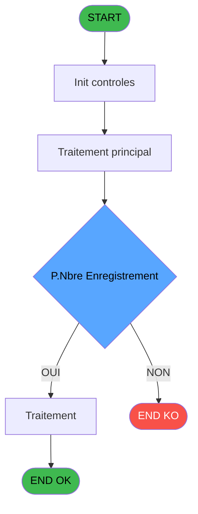
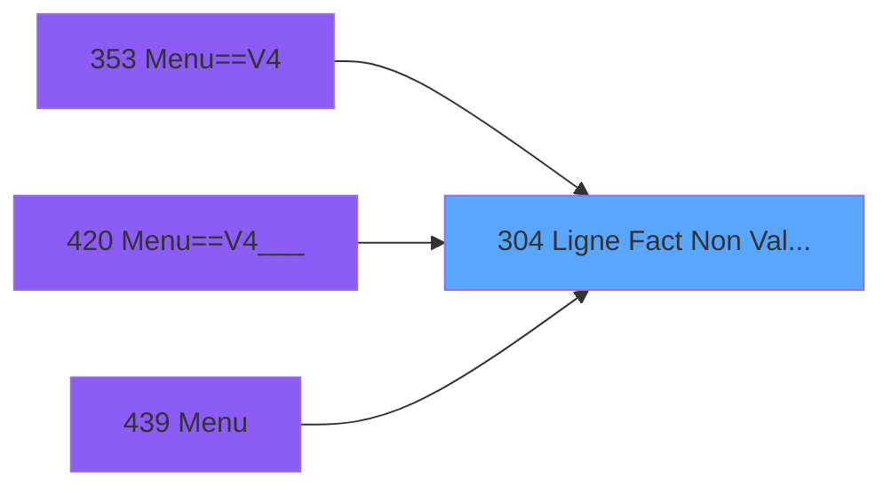

# PVE IDE 304 - Ligne Fact Non Validées & Edit

> **Analyse**: Phases 1-4 2026-02-03 19:30 -> 19:30 (13s) | Assemblage 19:30
> **Pipeline**: V7.2 Enrichi
> **Structure**: 4 onglets (Resume | Ecrans | Donnees | Connexions)

<!-- TAB:Resume -->

## 1. FICHE D'IDENTITE

| Attribut | Valeur |
|----------|--------|
| Projet | PVE |
| IDE Position | 304 |
| Nom Programme | Ligne Fact Non Validées & Edit |
| Fichier source | `Prg_304.xml` |
| Dossier IDE | Utilitaires |
| Taches | 3 (0 ecrans visibles) |
| Tables modifiees | 0 |
| Programmes appeles | 0 |

## 2. DESCRIPTION FONCTIONNELLE

**Ligne Fact Non Validées & Edit** assure la gestion complete de ce processus, accessible depuis [Menu==V4 (IDE 353)](PVE-IDE-353.md), [Menu==V4___ (IDE 420)](PVE-IDE-420.md), [Menu (IDE 439)](PVE-IDE-439.md).

Le flux de traitement s'organise en **2 blocs fonctionnels** :

- **Validation** (2 taches) : controles et verifications de coherence
- **Impression** (1 tache) : generation de tickets et documents

**Logique metier** : 1 regles identifiees couvrant conditions metier.

Detail : phases du traitement

#### Phase 1 : Validation (2 taches)

- **304** - Ligne Fact Non Validées & Edit
- **304.1** - Count Article non validé&Editi **[[ECRAN]](#ecran-t2)**

#### Phase 2 : Impression (1 tache)

- **304.2** - Print **[[ECRAN]](#ecran-t3)**

## 3. BLOCS FONCTIONNELS

### 3.1 Validation (2 taches)

Controles de coherence : 2 taches verifient les donnees et conditions.

---

#### 304 - Ligne Fact Non Validées & Edit

**Role** : Verification : Ligne Fact Non Validées & Edit.

---

#### 304.1 - Count Article non validé&Editi [[ECRAN]](#ecran-t2)

**Role** : Verification : Count Article non validé&Editi.
**Ecran** : 120 x 195 DLU | [Voir mockup](#ecran-t2)
**Variables liees** : K (discount), L (discount_reason), X (cpk_article)

### 3.2 Impression (1 tache)

Generation des documents et tickets.

---

#### 304.2 - Print [[ECRAN]](#ecran-t3)

**Role** : Generation du document : Print.
**Ecran** : 2551 x 195 DLU | [Voir mockup](#ecran-t3)
**Variables liees** : C (V. Print ?)

## 5. REGLES METIER

1 regles identifiees:

### Autres (1 regles)

#### [RM-001] Si P.Nbre Enregistrement [A]>1 alors Trim(Str(P.Nbre Enregistrement [A] sinon '10P'))&'  sales are not committed !',Trim(Str(P.Nbre Enregistrement [A],'10P'))&' sale is not committed !')

| Element | Detail |
|---------|--------|
| **Condition** | `P.Nbre Enregistrement [A]>1` |
| **Si vrai** | Trim(Str(P.Nbre Enregistrement [A] |
| **Si faux** | '10P'))&'  sales are not committed !',Trim(Str(P.Nbre Enregistrement [A],'10P'))&' sale is not committed !') |
| **Variables** | A (P.Nbre Enregistrement) |
| **Expression source** | Expression 4 : `IF(P.Nbre Enregistrement [A]>1,Trim(Str(P.Nbre Enregistremen` |
| **Exemple** | Si P.Nbre Enregistrement [A]>1 → Trim(Str(P.Nbre Enregistrement [A] |

## 6. CONTEXTE

- **Appele par**: [Menu==V4 (IDE 353)](PVE-IDE-353.md), [Menu==V4___ (IDE 420)](PVE-IDE-420.md), [Menu (IDE 439)](PVE-IDE-439.md)
- **Appelle**: 0 programmes | **Tables**: 1 (W:0 R:1 L:0) | **Taches**: 3 | **Expressions**: 7

<!-- TAB:Ecrans -->

## 8. ECRANS

*(Programme sans ecran visible)*

## 9. NAVIGATION

### 9.3 Structure hierarchique (3 taches)

| Position | Tache | Type | Dimensions | Bloc |
|----------|-------|------|------------|------|
| **304.1** | [**Ligne Fact Non Validées & Edit** (304)](#t1) | - | - | Validation |
| 304.1.1 | [Count Article non validé&Editi (304.1)](#t2) [mockup](#ecran-t2) | - | 120x195 | |
| **304.2** | [**Print** (304.2)](#t3) [mockup](#ecran-t3) | - | 2551x195 | Impression |

### 9.4 Algorigramme

> **Legende**: Vert = START/END OK | Rouge = END KO | Bleu = Decisions
> *Algorigramme auto-genere. Utiliser `/algorigramme` pour une synthese metier detaillee.*

<!-- TAB:Donnees -->

## 10. TABLES

### Tables utilisees (1)

| ID | Nom | Description | Type | R | W | L | Usages |
|----|-----|-------------|------|---|---|---|--------|
| 382 | pv_discount_reasons |  | DB | R |   |   | 1 |

### Colonnes par table (1 / 1 tables avec colonnes identifiees)

Table 382 - pv_discount_reasons (R) - 1 usages

| Lettre | Variable | Acces | Type |
|--------|----------|-------|------|
| A | pos_id | R | Numeric |
| B | package_id_out | R | Numeric |
| C | package_id_in | R | Numeric |
| D | date__start_ | R | Alpha |
| E | date__end_ | R | Alpha |
| F | cat | R | Numeric |
| G | sub_cat | R | Numeric |
| H | sub_sub_cat | R | Numeric |
| I | description | R | Unicode |
| J | price | R | Numeric |
| K | discount | R | Numeric |
| L | discount_reason | R | Numeric |
| M | payer_xcust_id | R | Numeric |
| N | payment_type | R | Unicode |
| O | validated__ | R | Logical |
| P | comment | R | Unicode |
| Q | date_create | R | Alpha |
| R | time_create | R | Alpha |
| S | user_create | R | Unicode |
| T | pv_service | R | Unicode |
| U | cpk_quantity | R | Numeric |
| V | cpk_unit_price | R | Numeric |
| W | cpk_vat | R | Numeric |
| X | cpk_article | R | Unicode |
| Y | lieu_vente | R | Unicode |
| Z | vendeur | R | Unicode |
| BA | cpk_montant_prepaid | R | Numeric |

## 11. VARIABLES

### 11.1 Parametres entrants (2)

Variables recues du programme appelant ([Menu==V4 (IDE 353)](PVE-IDE-353.md)).

| Lettre | Nom | Type | Usage dans |
|--------|-----|------|-----------|
| A | P.Nbre Enregistrement | Numeric | 2x parametre entrant |
| B | P.Service | Alpha | - |

### 11.2 Variables de session (4)

Variables persistantes pendant toute la session.

| Lettre | Nom | Type | Usage dans |
|--------|-----|------|-----------|
| C | V. Print ? | Numeric | [304.2](#t3) |
| D | V.Amount Format | Alpha | 1x session |
| E | V.Amount Format sans Z | Alpha | - |
| F | V.Decimal | Numeric | - |

### 11.3 Autres (21)

Variables diverses.

| Lettre | Nom | Type | Usage dans |
|--------|-----|------|-----------|
| G | sub_cat | Numeric | - |
| H | sub_sub_cat | Numeric | - |
| I | description | Unicode | - |
| J | price | Numeric | - |
| K | discount | Numeric | - |
| L | discount_reason | Numeric | - |
| M | payer_xcust_id | Numeric | - |
| N | payment_type | Unicode | - |
| O | validated__ | Logical | - |
| P | comment | Unicode | - |
| Q | date_create | Alpha | - |
| R | time_create | Alpha | - |
| S | user_create | Unicode | - |
| T | pv_service | Unicode | - |
| U | cpk_quantity | Numeric | - |
| V | cpk_unit_price | Numeric | - |
| W | cpk_vat | Numeric | - |
| X | cpk_article | Unicode | - |
| Y | lieu_vente | Unicode | - |
| Z | vendeur | Unicode | - |
| BA | cpk_montant_prepaid | Numeric | - |

Toutes les 27 variables (liste complete)

| Cat | Lettre | Nom Variable | Type |
|-----|--------|--------------|------|
| P0 | **A** | P.Nbre Enregistrement | Numeric |
| P0 | **B** | P.Service | Alpha |
| V. | **C** | V. Print ? | Numeric |
| V. | **D** | V.Amount Format | Alpha |
| V. | **E** | V.Amount Format sans Z | Alpha |
| V. | **F** | V.Decimal | Numeric |
| Autre | **G** | sub_cat | Numeric |
| Autre | **H** | sub_sub_cat | Numeric |
| Autre | **I** | description | Unicode |
| Autre | **J** | price | Numeric |
| Autre | **K** | discount | Numeric |
| Autre | **L** | discount_reason | Numeric |
| Autre | **M** | payer_xcust_id | Numeric |
| Autre | **N** | payment_type | Unicode |
| Autre | **O** | validated__ | Logical |
| Autre | **P** | comment | Unicode |
| Autre | **Q** | date_create | Alpha |
| Autre | **R** | time_create | Alpha |
| Autre | **S** | user_create | Unicode |
| Autre | **T** | pv_service | Unicode |
| Autre | **U** | cpk_quantity | Numeric |
| Autre | **V** | cpk_unit_price | Numeric |
| Autre | **W** | cpk_vat | Numeric |
| Autre | **X** | cpk_article | Unicode |
| Autre | **Y** | lieu_vente | Unicode |
| Autre | **Z** | vendeur | Unicode |
| Autre | **BA** | cpk_montant_prepaid | Numeric |

## 12. EXPRESSIONS

**7 / 7 expressions decodees (100%)**

### 12.1 Repartition par type

| Type | Expressions | Regles |
|------|-------------|--------|
| CALCULATION | 1 | 0 |
| CONDITION | 3 | 5 |
| CONSTANTE | 1 | 0 |
| OTHER | 2 | 0 |

### 12.2 Expressions cles par type

#### CALCULATION (1 expressions)

| Type | IDE | Expression | Regle |
|------|-----|------------|-------|
| CALCULATION | 6 | `Left (Trim (V.Amount Format [D]),Len (Trim (V.Amount Format [D]))-1)` | - |

#### CONDITION (3 expressions)

| Type | IDE | Expression | Regle |
|------|-----|------------|-------|
| CONDITION | 4 | `IF(P.Nbre Enregistrement [A]>1,Trim(Str(P.Nbre Enregistrement [A],'10P'))&'  sales are not committed !',Trim(Str(P.Nbre Enregistrement [A],'10P'))&' sale is not committed !')` | [RM-001](#rm-RM-001) |
| CONDITION | 3 | `V. Print ? [C]=6` | - |
| CONDITION | 1 | `P.Nbre Enregistrement [A]>0` | - |

#### CONSTANTE (1 expressions)

| Type | IDE | Expression | Regle |
|------|-----|------------|-------|
| CONSTANTE | 2 | `'Do you want to print the result ?'` | - |

#### OTHER (2 expressions)

| Type | IDE | Expression | Regle |
|------|-----|------------|-------|
| OTHER | 7 | `GetParam ('DECIMALNUMBER')` | - |
| OTHER | 5 | `GetParam ('AMOUNTFORMAT')` | - |

<!-- TAB:Connexions -->

## 13. GRAPHE D'APPELS

### 13.1 Chaine depuis Main (Callers)

Main -> ... -> [Menu==V4 (IDE 353)](PVE-IDE-353.md) -> **Ligne Fact Non Validées & Edit (IDE 304)**

Main -> ... -> [Menu==V4___ (IDE 420)](PVE-IDE-420.md) -> **Ligne Fact Non Validées & Edit (IDE 304)**

Main -> ... -> [Menu (IDE 439)](PVE-IDE-439.md) -> **Ligne Fact Non Validées & Edit (IDE 304)**

### 13.2 Callers

| IDE | Nom Programme | Nb Appels |
|-----|---------------|-----------|
| [353](PVE-IDE-353.md) | Menu==V4 | 1 |
| [420](PVE-IDE-420.md) | Menu==V4___ | 1 |
| [439](PVE-IDE-439.md) | Menu | 1 |

### 13.3 Callees (programmes appeles)

### 13.4 Detail Callees avec contexte

| IDE | Nom Programme | Appels | Contexte |
|-----|---------------|--------|----------|
| - | (aucun) | - | - |

## 14. RECOMMANDATIONS MIGRATION

### 14.1 Profil du programme

| Metrique | Valeur | Impact migration |
|----------|--------|-----------------|
| Lignes de logique | 58 | Programme compact |
| Expressions | 7 | Peu de logique |
| Tables WRITE | 0 | Impact faible |
| Sous-programmes | 0 | Peu de dependances |
| Ecrans visibles | 0 | Ecran unique ou traitement batch |
| Code desactive | 0% (0 / 58) | Code sain |
| Regles metier | 1 | Quelques regles a preserver |

### 14.2 Plan de migration par bloc

#### Validation (2 taches: 1 ecran, 1 traitement)

- **Strategie** : FluentValidation avec validators specifiques.
- Chaque tache de validation -> un validator injectable

#### Impression (1 tache: 1 ecran, 0 traitement)

- **Strategie** : Templates HTML -> PDF via wkhtmltopdf ou Puppeteer.
- `PrintService` injectable avec choix imprimante

### 14.3 Dependances critiques

| Dependance | Type | Appels | Impact |
|------------|------|--------|--------|

---
*Spec DETAILED generee par Pipeline V7.2 - 2026-02-03 19:30*
