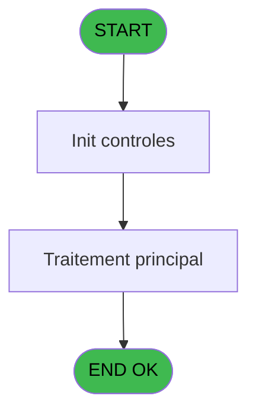

# PVE IDE 305 - Print Lg Fact Non Valid Ts Ser

> **Analyse**: Phases 1-4 2026-02-03 19:30 -> 19:30 (11s) | Assemblage 19:30
> **Pipeline**: V7.2 Enrichi
> **Structure**: 4 onglets (Resume | Ecrans | Donnees | Connexions)

<!-- TAB:Resume -->

## 1. FICHE D'IDENTITE

| Attribut | Valeur |
|----------|--------|
| Projet | PVE |
| IDE Position | 305 |
| Nom Programme | Print Lg Fact Non Valid Ts Ser |
| Fichier source | `Prg_305.xml` |
| Dossier IDE | Utilitaires |
| Taches | 1 (0 ecrans visibles) |
| Tables modifiees | 0 |
| Programmes appeles | 0 |
| :warning: Statut | **ORPHELIN_POTENTIEL** |

## 2. DESCRIPTION FONCTIONNELLE

**Print Lg Fact Non Valid Ts Ser** assure la gestion complete de ce processus.

Le flux de traitement s'organise en **1 blocs fonctionnels** :

- **Validation** (1 tache) : controles et verifications de coherence

## 3. BLOCS FONCTIONNELS

### 3.1 Validation (1 tache)

Controles de coherence : 1 tache verifie les donnees et conditions.

---

#### 305 - Print Lg Fact Non Valid Ts Ser [[ECRAN]](#ecran-t1)

**Role** : Generation du document : Print Lg Fact Non Valid Ts Ser.
**Ecran** : 2551 x 195 DLU | [Voir mockup](#ecran-t1)
**Variables liees** : O (validated__)

## 5. REGLES METIER

*(Aucune regle metier identifiee)*

## 6. CONTEXTE

- **Appele par**: (aucun)
- **Appelle**: 0 programmes | **Tables**: 2 (W:0 R:1 L:1) | **Taches**: 1 | **Expressions**: 19

<!-- TAB:Ecrans -->

## 8. ECRANS

*(Programme sans ecran visible)*

## 9. NAVIGATION

### 9.3 Structure hierarchique (1 tache)

| Position | Tache | Type | Dimensions | Bloc |
|----------|-------|------|------------|------|
| **305.1** | [**Print Lg Fact Non Valid Ts Ser** (305)](#t1) [mockup](#ecran-t1) | - | 2551x195 | Validation |

### 9.4 Algorigramme

> **Legende**: Vert = START/END OK | Rouge = END KO | Bleu = Decisions
> *Algorigramme auto-genere. Utiliser `/algorigramme` pour une synthese metier detaillee.*

<!-- TAB:Donnees -->

## 10. TABLES

### Tables utilisees (2)

| ID | Nom | Description | Type | R | W | L | Usages |
|----|-----|-------------|------|---|---|---|--------|
| 67 | tables___________tab |  | DB | R |   |   | 1 |
| 382 | pv_discount_reasons |  | DB |   |   | L | 1 |

### Colonnes par table (2 / 1 tables avec colonnes identifiees)

Table 67 - tables___________tab (R) - 1 usages

| Lettre | Variable | Acces | Type |
|--------|----------|-------|------|
| A | pos_id | R | Numeric |
| B | package_id_out | R | Numeric |
| C | package_id_in | R | Numeric |
| D | date__start_ | R | Alpha |
| E | date__end_ | R | Alpha |
| F | cat | R | Numeric |
| G | sub_cat | R | Numeric |
| H | sub_sub_cat | R | Numeric |
| I | description | R | Unicode |
| J | price | R | Numeric |
| K | discount | R | Numeric |
| L | discount_reason | R | Numeric |
| M | payer_xcust_id | R | Numeric |
| N | payment_type | R | Unicode |
| O | validated__ | R | Logical |
| P | comment | R | Unicode |
| Q | date_create | R | Alpha |
| R | time_create | R | Alpha |
| S | user_create | R | Unicode |
| T | pv_service | R | Unicode |
| U | cpk_quantity | R | Numeric |
| V | cpk_unit_price | R | Numeric |
| W | cpk_vat | R | Numeric |
| X | cpk_article | R | Unicode |
| Y | lieu_vente | R | Unicode |
| Z | vendeur | R | Unicode |
| BA | cpk_montant_prepaid | R | Numeric |

## 11. VARIABLES

### 11.1 Autres (27)

Variables diverses.

| Lettre | Nom | Type | Usage dans |
|--------|-----|------|-----------|
| A | pos_id | Numeric | 1x refs |
| B | package_id_out | Numeric | - |
| C | package_id_in | Numeric | - |
| D | date__start_ | Alpha | - |
| E | date__end_ | Alpha | - |
| F | cat | Numeric | - |
| G | sub_cat | Numeric | - |
| H | sub_sub_cat | Numeric | - |
| I | description | Unicode | - |
| J | price | Numeric | 1x refs |
| K | discount | Numeric | - |
| L | discount_reason | Numeric | - |
| M | payer_xcust_id | Numeric | - |
| N | payment_type | Unicode | - |
| O | validated__ | Logical | - |
| P | comment | Unicode | - |
| Q | date_create | Alpha | 1x refs |
| R | time_create | Alpha | - |
| S | user_create | Unicode | - |
| T | pv_service | Unicode | 1x refs |
| U | cpk_quantity | Numeric | - |
| V | cpk_unit_price | Numeric | - |
| W | cpk_vat | Numeric | - |
| X | cpk_article | Unicode | - |
| Y | lieu_vente | Unicode | - |
| Z | vendeur | Unicode | - |
| BA | cpk_montant_prepaid | Numeric | - |

Toutes les 27 variables (liste complete)

| Cat | Lettre | Nom Variable | Type |
|-----|--------|--------------|------|
| Autre | **A** | pos_id | Numeric |
| Autre | **B** | package_id_out | Numeric |
| Autre | **C** | package_id_in | Numeric |
| Autre | **D** | date__start_ | Alpha |
| Autre | **E** | date__end_ | Alpha |
| Autre | **F** | cat | Numeric |
| Autre | **G** | sub_cat | Numeric |
| Autre | **H** | sub_sub_cat | Numeric |
| Autre | **I** | description | Unicode |
| Autre | **J** | price | Numeric |
| Autre | **K** | discount | Numeric |
| Autre | **L** | discount_reason | Numeric |
| Autre | **M** | payer_xcust_id | Numeric |
| Autre | **N** | payment_type | Unicode |
| Autre | **O** | validated__ | Logical |
| Autre | **P** | comment | Unicode |
| Autre | **Q** | date_create | Alpha |
| Autre | **R** | time_create | Alpha |
| Autre | **S** | user_create | Unicode |
| Autre | **T** | pv_service | Unicode |
| Autre | **U** | cpk_quantity | Numeric |
| Autre | **V** | cpk_unit_price | Numeric |
| Autre | **W** | cpk_vat | Numeric |
| Autre | **X** | cpk_article | Unicode |
| Autre | **Y** | lieu_vente | Unicode |
| Autre | **Z** | vendeur | Unicode |
| Autre | **BA** | cpk_montant_prepaid | Numeric |

## 12. EXPRESSIONS

**19 / 19 expressions decodees (100%)**

### 12.1 Repartition par type

| Type | Expressions | Regles |
|------|-------------|--------|
| CONSTANTE | 1 | 0 |
| DATE | 1 | 0 |
| CONCATENATION | 3 | 0 |
| OTHER | 12 | 0 |
| CONDITION | 1 | 0 |
| STRING | 1 | 0 |

### 12.2 Expressions cles par type

#### CONSTANTE (1 expressions)

| Type | IDE | Expression | Regle |
|------|-----|------------|-------|
| CONSTANTE | 18 | `'VSERV'` | - |

#### DATE (1 expressions)

| Type | IDE | Expression | Regle |
|------|-----|------------|-------|
| DATE | 1 | `DVal(date_create [Q],'YYYYMMDD')` | - |

#### CONCATENATION (3 expressions)

| Type | IDE | Expression | Regle |
|------|-----|------------|-------|
| CONCATENATION | 15 | `Trim([AE])&' ' &Trim([AF])` | - |
| CONCATENATION | 17 | `'Price'&' '&GetParam ('CURRENCYVALUE')` | - |
| CONCATENATION | 4 | `DStr (Date (),'DD/MM/YYYY')&' - '&TStr (Time (),'HH:MM:SS')` | - |

#### OTHER (12 expressions)

| Type | IDE | Expression | Regle |
|------|-----|------------|-------|
| OTHER | 12 | `GetParam ('HEADERLINE08')` | - |
| OTHER | 11 | `GetParam ('HEADERLINE07')` | - |
| OTHER | 10 | `GetParam ('HEADERLINE06')` | - |
| OTHER | 19 | `pv_service [T]` | - |
| OTHER | 14 | `GetParam ('HEADERLINE10')` | - |
| ... | | *+7 autres* | |

#### CONDITION (1 expressions)

| Type | IDE | Expression | Regle |
|------|-----|------------|-------|
| CONDITION | 3 | `GetParam ('ShowPrinters')='O'` | - |

#### STRING (1 expressions)

| Type | IDE | Expression | Regle |
|------|-----|------------|-------|
| STRING | 16 | `'Page '&Trim (Str (Page (0,1),'2'))` | - |

<!-- TAB:Connexions -->

## 13. GRAPHE D'APPELS

### 13.1 Chaine depuis Main (Callers)

**Chemin**: (pas de callers directs)

### 13.2 Callers

| IDE | Nom Programme | Nb Appels |
|-----|---------------|-----------|
| - | (aucun) | - |

### 13.3 Callees (programmes appeles)

### 13.4 Detail Callees avec contexte

| IDE | Nom Programme | Appels | Contexte |
|-----|---------------|--------|----------|
| - | (aucun) | - | - |

## 14. RECOMMANDATIONS MIGRATION

### 14.1 Profil du programme

| Metrique | Valeur | Impact migration |
|----------|--------|-----------------|
| Lignes de logique | 48 | Programme compact |
| Expressions | 19 | Peu de logique |
| Tables WRITE | 0 | Impact faible |
| Sous-programmes | 0 | Peu de dependances |
| Ecrans visibles | 0 | Ecran unique ou traitement batch |
| Code desactive | 0% (0 / 48) | Code sain |
| Regles metier | 0 | Pas de regle identifiee |

### 14.2 Plan de migration par bloc

#### Validation (1 tache: 1 ecran, 0 traitement)

- **Strategie** : FluentValidation avec validators specifiques.
- Chaque tache de validation -> un validator injectable

### 14.3 Dependances critiques

| Dependance | Type | Appels | Impact |
|------------|------|--------|--------|

---
*Spec DETAILED generee par Pipeline V7.2 - 2026-02-03 19:30*
