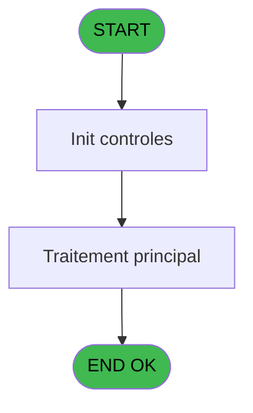
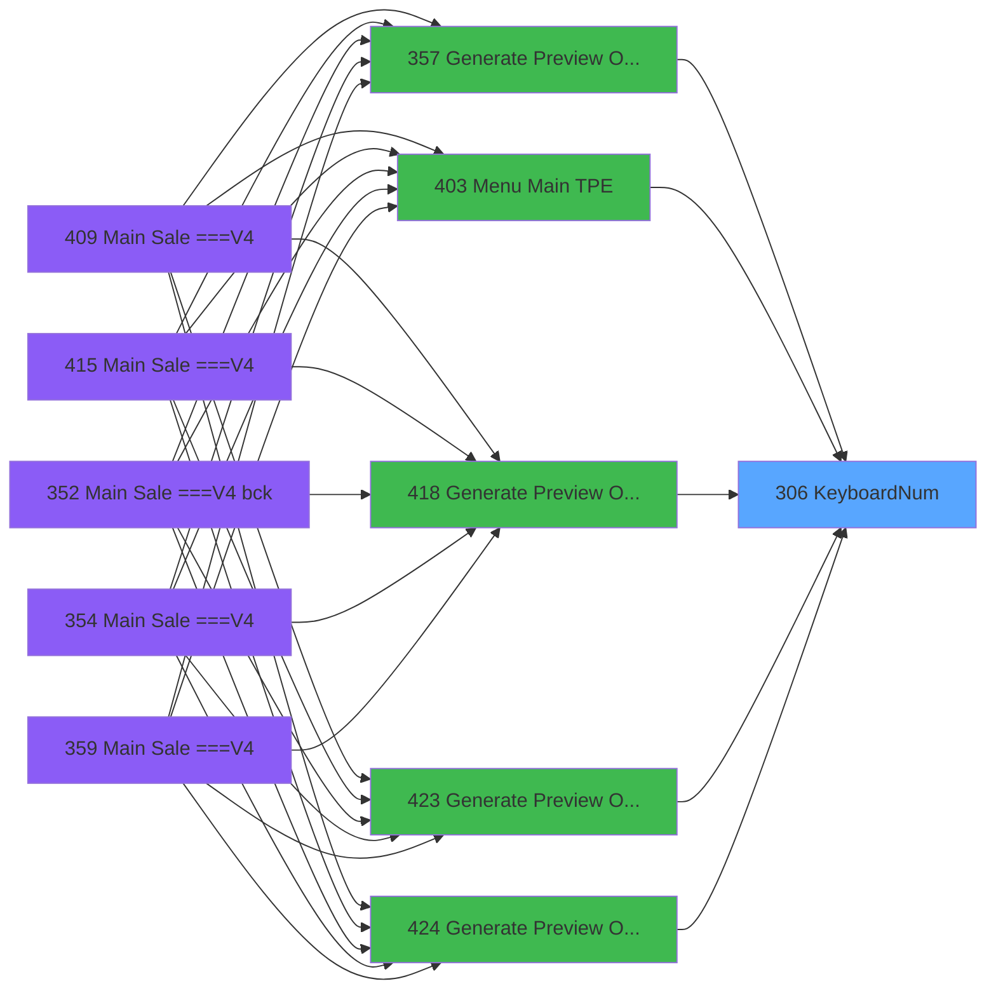

# PVE IDE 306 - KeyboardNum

> **Analyse**: Phases 1-4 2026-02-03 19:30 -> 19:30 (11s) | Assemblage 19:30
> **Pipeline**: V7.2 Enrichi
> **Structure**: 4 onglets (Resume | Ecrans | Donnees | Connexions)

<!-- TAB:Resume -->

## 1. FICHE D'IDENTITE

| Attribut | Valeur |
|----------|--------|
| Projet | PVE |
| IDE Position | 306 |
| Nom Programme | KeyboardNum |
| Fichier source | `Prg_306.xml` |
| Dossier IDE | Utilitaires |
| Taches | 2 (1 ecrans visibles) |
| Tables modifiees | 0 |
| Programmes appeles | 0 |

## 2. DESCRIPTION FONCTIONNELLE

**KeyboardNum** assure la gestion complete de ce processus, accessible depuis [Generate Preview OD==V4 (IDE 357)](PVE-IDE-357.md), [Menu Main (TPE) (IDE 403)](PVE-IDE-403.md), [Generate Preview OD==LEX Book (IDE 418)](PVE-IDE-418.md), [Generate Preview OD==V4 (IDE 423)](PVE-IDE-423.md), [Generate Preview OD==LEX (IDE 424)](PVE-IDE-424.md), [Generate Preview Payments (IDE 441)](PVE-IDE-441.md).

Le flux de traitement s'organise en **2 blocs fonctionnels** :

- **Calcul** (1 tache) : calculs de montants, stocks ou compteurs
- **Traitement** (1 tache) : traitements metier divers

**Logique metier** : 1 regles identifiees couvrant conditions metier.

Detail : phases du traitement

#### Phase 1 : Traitement (1 tache)

- **306** - KeyboardNum **[[ECRAN]](#ecran-t1)**

#### Phase 2 : Calcul (1 tache)

- **306.1** - Calcul

## 3. BLOCS FONCTIONNELS

### 3.1 Traitement (1 tache)

Traitements internes.

---

#### 306 - KeyboardNum [[ECRAN]](#ecran-t1)

**Role** : Traitement : KeyboardNum.
**Ecran** : 219 x 227 DLU (MDI) | [Voir mockup](#ecran-t1)

### 3.2 Calcul (1 tache)

Calculs metier : montants, stocks, compteurs.

---

#### 306.1 - Calcul

**Role** : Calcul : Calcul.

## 5. REGLES METIER

1 regles identifiees:

### Autres (1 regles)

#### [RM-001] Si P. vient de M(ain) [B]='M' alors 20 sinon 30)

| Element | Detail |
|---------|--------|
| **Condition** | `P. vient de M(ain) [B]='M'` |
| **Si vrai** | 20 |
| **Si faux** | 30) |
| **Variables** | B (P. vient de M(ain)) |
| **Expression source** | Expression 3 : `IF (P. vient de M(ain) [B]='M',20,30)` |
| **Exemple** | Si P. vient de M(ain) [B]='M' → 20. Sinon → 30) |

## 6. CONTEXTE

- **Appele par**: [Generate Preview OD==V4 (IDE 357)](PVE-IDE-357.md), [Menu Main (TPE) (IDE 403)](PVE-IDE-403.md), [Generate Preview OD==LEX Book (IDE 418)](PVE-IDE-418.md), [Generate Preview OD==V4 (IDE 423)](PVE-IDE-423.md), [Generate Preview OD==LEX (IDE 424)](PVE-IDE-424.md), [Generate Preview Payments (IDE 441)](PVE-IDE-441.md)
- **Appelle**: 0 programmes | **Tables**: 0 (W:0 R:0 L:0) | **Taches**: 2 | **Expressions**: 8

<!-- TAB:Ecrans -->

## 8. ECRANS

### 8.1 Forms visibles (1 / 2)

| # | Position | Tache | Nom | Type | Largeur | Hauteur | Bloc |
|---|----------|-------|-----|------|---------|---------|------|
| 1 | 306 | 306 | KeyboardNum | MDI | 219 | 227 | Traitement |

### 8.2 Mockups Ecrans

---

#### 306 - KeyboardNum
**Tache** : [306](#t1) | **Type** : MDI | **Dimensions** : 219 x 227 DLU
**Bloc** : Traitement | **Titre IDE** : KeyboardNum

<!-- FORM-DATA:
{
    "width":  219,
    "vFactor":  8,
    "type":  "MDI",
    "hFactor":  4,
    "controls":  [
                     {
                         "x":  7,
                         "type":  "label",
                         "var":  "",
                         "y":  4,
                         "w":  208,
                         "fmt":  "",
                         "name":  "",
                         "h":  192,
                         "color":  "183",
                         "text":  "",
                         "parent":  null
                     },
                     {
                         "x":  44,
                         "type":  "edit",
                         "var":  "",
                         "y":  12,
                         "w":  132,
                         "fmt":  "",
                         "name":  "",
                         "h":  21,
                         "color":  "144",
                         "text":  "",
                         "parent":  1
                     },
                     {
                         "x":  133,
                         "type":  "button",
                         "var":  "",
                         "y":  199,
                         "w":  82,
                         "fmt":  "\u0026Validate",
                         "name":  "VALID",
                         "h":  24,
                         "color":  "",
                         "text":  "",
                         "parent":  null
                     },
                     {
                         "x":  44,
                         "type":  "button",
                         "var":  "",
                         "y":  157,
                         "w":  132,
                         "fmt":  "Clear",
                         "name":  "CLEAR",
                         "h":  32,
                         "color":  "",
                         "text":  "",
                         "parent":  1
                     },
                     {
                         "x":  88,
                         "type":  "button",
                         "var":  "",
                         "y":  126,
                         "w":  44,
                         "fmt":  "Backspace",
                         "name":  "BACKSPACE",
                         "h":  32,
                         "color":  "",
                         "text":  "",
                         "parent":  1
                     },
                     {
                         "x":  7,
                         "type":  "button",
                         "var":  "",
                         "y":  199,
                         "w":  82,
                         "fmt":  "\u0026Exit",
                         "name":  "",
                         "h":  24,
                         "color":  "",
                         "text":  "",
                         "parent":  null
                     },
                     {
                         "x":  44,
                         "type":  "button",
                         "var":  "",
                         "y":  95,
                         "w":  44,
                         "fmt":  "1",
                         "name":  "*1",
                         "h":  32,
                         "color":  "",
                         "text":  "",
                         "parent":  1
                     },
                     {
                         "x":  88,
                         "type":  "button",
                         "var":  "",
                         "y":  95,
                         "w":  44,
                         "fmt":  "2",
                         "name":  "*2",
                         "h":  32,
                         "color":  "",
                         "text":  "",
                         "parent":  1
                     },
                     {
                         "x":  132,
                         "type":  "button",
                         "var":  "",
                         "y":  95,
                         "w":  44,
                         "fmt":  "3",
                         "name":  "*3",
                         "h":  32,
                         "color":  "",
                         "text":  "",
                         "parent":  1
                     },
                     {
                         "x":  44,
                         "type":  "button",
                         "var":  "",
                         "y":  64,
                         "w":  44,
                         "fmt":  "4",
                         "name":  "*4",
                         "h":  32,
                         "color":  "",
                         "text":  "",
                         "parent":  1
                     },
                     {
                         "x":  88,
                         "type":  "button",
                         "var":  "",
                         "y":  64,
                         "w":  44,
                         "fmt":  "5",
                         "name":  "*5",
                         "h":  32,
                         "color":  "",
                         "text":  "",
                         "parent":  1
                     },
                     {
                         "x":  132,
                         "type":  "button",
                         "var":  "",
                         "y":  64,
                         "w":  44,
                         "fmt":  "6",
                         "name":  "*6",
                         "h":  32,
                         "color":  "",
                         "text":  "",
                         "parent":  1
                     },
                     {
                         "x":  44,
                         "type":  "button",
                         "var":  "",
                         "y":  33,
                         "w":  44,
                         "fmt":  "7",
                         "name":  "*7",
                         "h":  32,
                         "color":  "",
                         "text":  "",
                         "parent":  1
                     },
                     {
                         "x":  88,
                         "type":  "button",
                         "var":  "",
                         "y":  33,
                         "w":  44,
                         "fmt":  "8",
                         "name":  "*8",
                         "h":  32,
                         "color":  "",
                         "text":  "",
                         "parent":  1
                     },
                     {
                         "x":  132,
                         "type":  "button",
                         "var":  "",
                         "y":  33,
                         "w":  44,
                         "fmt":  "9",
                         "name":  "*9",
                         "h":  32,
                         "color":  "",
                         "text":  "",
                         "parent":  1
                     },
                     {
                         "x":  44,
                         "type":  "button",
                         "var":  "",
                         "y":  126,
                         "w":  44,
                         "fmt":  "0",
                         "name":  "*0",
                         "h":  32,
                         "color":  "",
                         "text":  "",
                         "parent":  1
                     },
                     {
                         "x":  132,
                         "type":  "button",
                         "var":  "",
                         "y":  126,
                         "w":  44,
                         "fmt":  ".",
                         "name":  "*.",
                         "h":  32,
                         "color":  "",
                         "text":  "",
                         "parent":  1
                     }
                 ],
    "taskId":  "306",
    "height":  227
}
-->

<strong>Champs : 1 champs</strong>

| Pos (x,y) | Nom | Variable | Type |
|-----------|-----|----------|------|
| 44,12 | (sans nom) | - | edit |

<strong>Boutons : 15 boutons</strong>

| Bouton | Pos (x,y) | Action |
|--------|-----------|--------|
| Validate | 133,199 | Valide la saisie et enregistre |
| Clear | 44,157 | Bouton fonctionnel |
| Backspace | 88,126 | Bouton fonctionnel |
| Exit | 7,199 | Quitte le programme |
| 1 | 44,95 | Bouton fonctionnel |
| 2 | 88,95 | Bouton fonctionnel |
| 3 | 132,95 | Bouton fonctionnel |
| 4 | 44,64 | Bouton fonctionnel |
| 5 | 88,64 | Bouton fonctionnel |
| 6 | 132,64 | Bouton fonctionnel |
| 7 | 44,33 | Bouton fonctionnel |
| 8 | 88,33 | Bouton fonctionnel |
| 9 | 132,33 | Bouton fonctionnel |
| 0 | 44,126 | Bouton fonctionnel |
| . | 132,126 | Bouton fonctionnel |

## 9. NAVIGATION

Ecran unique: **KeyboardNum**

### 9.3 Structure hierarchique (2 taches)

| Position | Tache | Type | Dimensions | Bloc |
|----------|-------|------|------------|------|
| **306.1** | [**KeyboardNum** (306)](#t1) [mockup](#ecran-t1) | MDI | 219x227 | Traitement |
| **306.2** | [**Calcul** (306.1)](#t2) | MDI | - | Calcul |

### 9.4 Algorigramme

> **Legende**: Vert = START/END OK | Rouge = END KO | Bleu = Decisions
> *Algorigramme auto-genere. Utiliser `/algorigramme` pour une synthese metier detaillee.*

<!-- TAB:Donnees -->

## 10. TABLES

### Tables utilisees (0)

| ID | Nom | Description | Type | R | W | L | Usages |
|----|-----|-------------|------|---|---|---|--------|

### Colonnes par table (0 / 0 tables avec colonnes identifiees)

## 11. VARIABLES

### 11.1 Parametres entrants (3)

Variables recues du programme appelant ([Generate Preview OD==V4 (IDE 357)](PVE-IDE-357.md)).

| Lettre | Nom | Type | Usage dans |
|--------|-----|------|-----------|
| A | P. Saisie keyboard | Alpha | [306](#t1) |
| B | P. vient de M(ain) | Alpha | 1x parametre entrant |
| C | P.Password | Logical | 2x parametre entrant |

### 11.2 Variables de session (2)

Variables persistantes pendant toute la session.

| Lettre | Nom | Type | Usage dans |
|--------|-----|------|-----------|
| D | V Keyboard Input | Alpha | [306](#t1) |
| E | V.Keyboard pwd | Alpha | 1x session |

### 11.3 Autres (2)

Variables diverses.

| Lettre | Nom | Type | Usage dans |
|--------|-----|------|-----------|
| F | L Touche MAJ/Min | Logical | - |
| G | BP. Validate | Alpha | - |

## 12. EXPRESSIONS

**8 / 8 expressions decodees (100%)**

### 12.1 Repartition par type

| Type | Expressions | Regles |
|------|-------------|--------|
| CONDITION | 1 | 5 |
| CONSTANTE | 1 | 0 |
| CAST_LOGIQUE | 1 | 0 |
| OTHER | 2 | 0 |
| NEGATION | 1 | 0 |
| STRING | 2 | 0 |

### 12.2 Expressions cles par type

#### CONDITION (1 expressions)

| Type | IDE | Expression | Regle |
|------|-----|------------|-------|
| CONDITION | 3 | `IF (P. vient de M(ain) [B]='M',20,30)` | [RM-001](#rm-RM-001) |

#### CONSTANTE (1 expressions)

| Type | IDE | Expression | Regle |
|------|-----|------------|-------|
| CONSTANTE | 2 | `'&Validate'` | - |

#### CAST_LOGIQUE (1 expressions)

| Type | IDE | Expression | Regle |
|------|-----|------------|-------|
| CAST_LOGIQUE | 1 | `'TRUE'LOG` | - |

#### OTHER (2 expressions)

| Type | IDE | Expression | Regle |
|------|-----|------------|-------|
| OTHER | 8 | `P. Saisie keyboard [A]` | - |
| OTHER | 6 | `P.Password [C]` | - |

#### NEGATION (1 expressions)

| Type | IDE | Expression | Regle |
|------|-----|------------|-------|
| NEGATION | 7 | `NOT P.Password [C]` | - |

#### STRING (2 expressions)

| Type | IDE | Expression | Regle |
|------|-----|------------|-------|
| STRING | 5 | `Trim(V.Keyboard pwd [E])` | - |
| STRING | 4 | `Trim(V Keyboard Input [D])` | - |

<!-- TAB:Connexions -->

## 13. GRAPHE D'APPELS

### 13.1 Chaine depuis Main (Callers)

Main -> ... -> [Generate Preview OD==V4 (IDE 357)](PVE-IDE-357.md) -> **KeyboardNum (IDE 306)**

Main -> ... -> [Menu Main (TPE) (IDE 403)](PVE-IDE-403.md) -> **KeyboardNum (IDE 306)**

Main -> ... -> [Generate Preview OD==LEX Book (IDE 418)](PVE-IDE-418.md) -> **KeyboardNum (IDE 306)**

Main -> ... -> [Generate Preview OD==V4 (IDE 423)](PVE-IDE-423.md) -> **KeyboardNum (IDE 306)**

Main -> ... -> [Generate Preview OD==LEX (IDE 424)](PVE-IDE-424.md) -> **KeyboardNum (IDE 306)**

Main -> ... -> [Generate Preview Payments (IDE 441)](PVE-IDE-441.md) -> **KeyboardNum (IDE 306)**

### 13.2 Callers

| IDE | Nom Programme | Nb Appels |
|-----|---------------|-----------|
| [357](PVE-IDE-357.md) | Generate Preview OD==V4 | 1 |
| [403](PVE-IDE-403.md) | Menu Main (TPE) | 1 |
| [418](PVE-IDE-418.md) | Generate Preview OD==LEX Book | 1 |
| [423](PVE-IDE-423.md) | Generate Preview OD==V4 | 1 |
| [424](PVE-IDE-424.md) | Generate Preview OD==LEX | 1 |
| [441](PVE-IDE-441.md) | Generate Preview Payments | 1 |

### 13.3 Callees (programmes appeles)

### 13.4 Detail Callees avec contexte

| IDE | Nom Programme | Appels | Contexte |
|-----|---------------|--------|----------|
| - | (aucun) | - | - |

## 14. RECOMMANDATIONS MIGRATION

### 14.1 Profil du programme

| Metrique | Valeur | Impact migration |
|----------|--------|-----------------|
| Lignes de logique | 36 | Programme compact |
| Expressions | 8 | Peu de logique |
| Tables WRITE | 0 | Impact faible |
| Sous-programmes | 0 | Peu de dependances |
| Ecrans visibles | 1 | Ecran unique ou traitement batch |
| Code desactive | 0% (0 / 36) | Code sain |
| Regles metier | 1 | Quelques regles a preserver |

### 14.2 Plan de migration par bloc

#### Traitement (1 tache: 1 ecran, 0 traitement)

- **Strategie** : 1 composant(s) UI (Razor/React) avec formulaires et validation.
- Decomposer les taches en services unitaires testables.

#### Calcul (1 tache: 0 ecran, 1 traitement)

- **Strategie** : Services de calcul purs (Domain Services).
- Migrer la logique de calcul (stock, compteurs, montants)

### 14.3 Dependances critiques

| Dependance | Type | Appels | Impact |
|------------|------|--------|--------|

---
*Spec DETAILED generee par Pipeline V7.2 - 2026-02-03 19:30*
