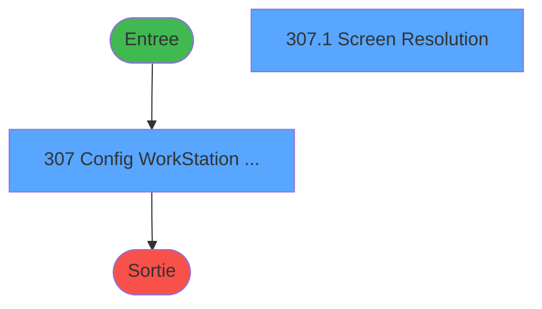
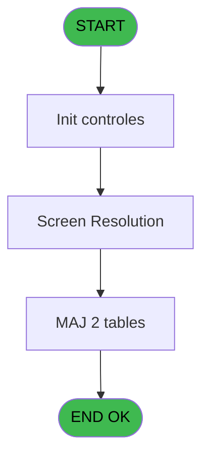
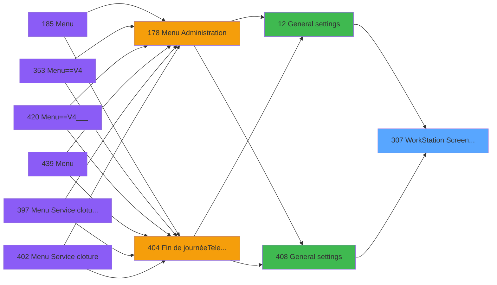
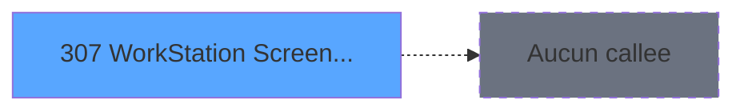

# PVE IDE 307 - WorkStation Screen Resolution

> **Analyse**: Phases 1-4 2026-02-03 19:30 -> 19:31 (11s) | Assemblage 19:31
> **Pipeline**: V7.2 Enrichi
> **Structure**: 4 onglets (Resume | Ecrans | Donnees | Connexions)

<!-- TAB:Resume -->

## 1. FICHE D'IDENTITE

| Attribut | Valeur |
|----------|--------|
| Projet | PVE |
| IDE Position | 307 |
| Nom Programme | WorkStation Screen Resolution |
| Fichier source | `Prg_307.xml` |
| Dossier IDE | Utilitaires |
| Taches | 2 (2 ecrans visibles) |
| Tables modifiees | 2 |
| Programmes appeles | 0 |

## 2. DESCRIPTION FONCTIONNELLE

**WorkStation Screen Resolution** assure la gestion complete de ce processus, accessible depuis [General settings (IDE 12)](PVE-IDE-12.md), [General settings (IDE 408)](PVE-IDE-408.md).

Le flux de traitement s'organise en **1 blocs fonctionnels** :

- **Traitement** (2 taches) : traitements metier divers

**Donnees modifiees** : 2 tables en ecriture (Table_1493, Table_1494).

## 3. BLOCS FONCTIONNELS

### 3.1 Traitement (2 taches)

Traitements internes.

---

#### 307 - Config WorkStation Screen Reso [[ECRAN]](#ecran-t1)

**Role** : Traitement : Config WorkStation Screen Reso.
**Ecran** : 1581 x 186 DLU | [Voir mockup](#ecran-t1)

---

#### 307.1 - Screen Resolution [[ECRAN]](#ecran-t2)

**Role** : Traitement : Screen Resolution.
**Ecran** : 1277 x 181 DLU | [Voir mockup](#ecran-t2)

## 5. REGLES METIER

*(Aucune regle metier identifiee)*

## 6. CONTEXTE

- **Appele par**: [General settings (IDE 12)](PVE-IDE-12.md), [General settings (IDE 408)](PVE-IDE-408.md)
- **Appelle**: 0 programmes | **Tables**: 2 (W:2 R:0 L:1) | **Taches**: 2 | **Expressions**: 4

<!-- TAB:Ecrans -->

## 8. ECRANS

### 8.1 Forms visibles (2 / 2)

| # | Position | Tache | Nom | Type | Largeur | Hauteur | Bloc |
|---|----------|-------|-----|------|---------|---------|------|
| 1 | 307 | 307 | Config WorkStation Screen Reso | Type0 | 1581 | 186 | Traitement |
| 2 | 307.1 | 307.1 | Screen Resolution | Type0 | 1277 | 181 | Traitement |

### 8.2 Mockups Ecrans

---

#### 307 - Config WorkStation Screen Reso
**Tache** : [307](#t1) | **Type** : Type0 | **Dimensions** : 1581 x 186 DLU
**Bloc** : Traitement | **Titre IDE** : Config WorkStation Screen Reso

<!-- FORM-DATA:
{
    "width":  1581,
    "vFactor":  8,
    "type":  "Type0",
    "hFactor":  8,
    "controls":  [
                     {
                         "x":  6,
                         "type":  "label",
                         "var":  "",
                         "y":  5,
                         "w":  1560,
                         "fmt":  "",
                         "name":  "",
                         "h":  18,
                         "color":  "183",
                         "text":  "",
                         "parent":  null
                     },
                     {
                         "x":  14,
                         "type":  "label",
                         "var":  "",
                         "y":  151,
                         "w":  1560,
                         "fmt":  "",
                         "name":  "",
                         "h":  29,
                         "color":  "183",
                         "text":  "",
                         "parent":  null
                     },
                     {
                         "x":  13,
                         "type":  "table",
                         "var":  "",
                         "name":  "",
                         "titleH":  12,
                         "color":  "6",
                         "w":  1560,
                         "y":  25,
                         "fmt":  "",
                         "parent":  null,
                         "text":  "",
                         "rowH":  15,
                         "h":  122,
                         "cols":  [
                                      {
                                          "title":  "Computer Name",
                                          "layer":  1,
                                          "w":  386
                                      },
                                      {
                                          "title":  "Resolution Id",
                                          "layer":  2,
                                          "w":  203
                                      },
                                      {
                                          "title":  "Label",
                                          "layer":  3,
                                          "w":  578
                                      }
                                  ],
                         "rows":  3
                     },
                     {
                         "x":  20,
                         "type":  "edit",
                         "var":  "",
                         "y":  7,
                         "w":  396,
                         "fmt":  "30",
                         "name":  "",
                         "h":  11,
                         "color":  "187",
                         "text":  "",
                         "parent":  null
                     },
                     {
                         "x":  1253,
                         "type":  "edit",
                         "var":  "",
                         "y":  9,
                         "w":  298,
                         "fmt":  "WWW DD MMM YYYYT",
                         "name":  "",
                         "h":  11,
                         "color":  "187",
                         "text":  "",
                         "parent":  null
                     },
                     {
                         "x":  19,
                         "type":  "edit",
                         "var":  "",
                         "y":  40,
                         "w":  352,
                         "fmt":  "U20",
                         "name":  "ctr_compturname",
                         "h":  12,
                         "color":  "6",
                         "text":  "",
                         "parent":  5
                     },
                     {
                         "x":  405,
                         "type":  "edit",
                         "var":  "",
                         "y":  40,
                         "w":  29,
                         "fmt":  "",
                         "name":  "ctr_type_resolution",
                         "h":  12,
                         "color":  "6",
                         "text":  "",
                         "parent":  5
                     },
                     {
                         "x":  608,
                         "type":  "edit",
                         "var":  "",
                         "y":  40,
                         "w":  880,
                         "fmt":  "",
                         "name":  "re_libelle",
                         "h":  12,
                         "color":  "6",
                         "text":  "",
                         "parent":  5
                     },
                     {
                         "x":  34,
                         "type":  "button",
                         "var":  "",
                         "y":  153,
                         "w":  168,
                         "fmt":  "\u0026Create",
                         "name":  "",
                         "h":  24,
                         "color":  "",
                         "text":  "",
                         "parent":  null
                     },
                     {
                         "x":  227,
                         "type":  "button",
                         "var":  "",
                         "y":  153,
                         "w":  168,
                         "fmt":  "\u0026Modify",
                         "name":  "",
                         "h":  24,
                         "color":  "",
                         "text":  "",
                         "parent":  null
                     },
                     {
                         "x":  1182,
                         "type":  "button",
                         "var":  "",
                         "y":  153,
                         "w":  168,
                         "fmt":  "Ca\u0026ncel",
                         "name":  "",
                         "h":  24,
                         "color":  "",
                         "text":  "",
                         "parent":  null
                     },
                     {
                         "x":  1394,
                         "type":  "button",
                         "var":  "",
                         "y":  153,
                         "w":  168,
                         "fmt":  "\u0026Quit",
                         "name":  "",
                         "h":  24,
                         "color":  "",
                         "text":  "",
                         "parent":  null
                     }
                 ],
    "taskId":  "307",
    "height":  186
}
-->

<strong>Champs : 5 champs</strong>

| Pos (x,y) | Nom | Variable | Type |
|-----------|-----|----------|------|
| 20,7 | 30 | - | edit |
| 1253,9 | WWW DD MMM YYYYT | - | edit |
| 19,40 | ctr_compturname | - | edit |
| 405,40 | ctr_type_resolution | - | edit |
| 608,40 | re_libelle | - | edit |

<strong>Boutons : 4 boutons</strong>

| Bouton | Pos (x,y) | Action |
|--------|-----------|--------|
| Create | 34,153 | Bouton fonctionnel |
| Modify | 227,153 | Modifie l'element |
| Cancel | 1182,153 | Annule et retour au menu |
| Quit | 1394,153 | Bouton fonctionnel |

---

#### 307.1 - Screen Resolution
**Tache** : [307.1](#t2) | **Type** : Type0 | **Dimensions** : 1277 x 181 DLU
**Bloc** : Traitement | **Titre IDE** : Screen Resolution

<!-- FORM-DATA:
{
    "width":  1277,
    "vFactor":  8,
    "type":  "Type0",
    "hFactor":  8,
    "controls":  [
                     {
                         "x":  5,
                         "type":  "label",
                         "var":  "",
                         "y":  2,
                         "w":  1259,
                         "fmt":  "",
                         "name":  "",
                         "h":  18,
                         "color":  "183",
                         "text":  "",
                         "parent":  null
                     },
                     {
                         "x":  13,
                         "type":  "label",
                         "var":  "",
                         "y":  148,
                         "w":  1257,
                         "fmt":  "",
                         "name":  "",
                         "h":  29,
                         "color":  "183",
                         "text":  "",
                         "parent":  null
                     },
                     {
                         "x":  12,
                         "type":  "table",
                         "var":  "",
                         "name":  "",
                         "titleH":  12,
                         "color":  "6",
                         "w":  1253,
                         "y":  22,
                         "fmt":  "",
                         "parent":  null,
                         "text":  "",
                         "rowH":  15,
                         "h":  122,
                         "cols":  [
                                      {
                                          "title":  "Type",
                                          "layer":  1,
                                          "w":  72
                                      },
                                      {
                                          "title":  "Label",
                                          "layer":  2,
                                          "w":  895
                                      },
                                      {
                                          "title":  "Width",
                                          "layer":  3,
                                          "w":  122
                                      },
                                      {
                                          "title":  "Height",
                                          "layer":  4,
                                          "w":  114
                                      }
                                  ],
                         "rows":  4
                     },
                     {
                         "x":  19,
                         "type":  "edit",
                         "var":  "",
                         "y":  4,
                         "w":  396,
                         "fmt":  "30",
                         "name":  "",
                         "h":  11,
                         "color":  "187",
                         "text":  "",
                         "parent":  null
                     },
                     {
                         "x":  956,
                         "type":  "edit",
                         "var":  "",
                         "y":  6,
                         "w":  298,
                         "fmt":  "WWW DD MMM YYYYT",
                         "name":  "",
                         "h":  11,
                         "color":  "187",
                         "text":  "",
                         "parent":  null
                     },
                     {
                         "x":  19,
                         "type":  "edit",
                         "var":  "",
                         "y":  37,
                         "w":  29,
                         "fmt":  "",
                         "name":  "ctr_type_resolution",
                         "h":  12,
                         "color":  "6",
                         "text":  "",
                         "parent":  5
                     },
                     {
                         "x":  91,
                         "type":  "edit",
                         "var":  "",
                         "y":  37,
                         "w":  880,
                         "fmt":  "",
                         "name":  "re_libelle",
                         "h":  12,
                         "color":  "6",
                         "text":  "",
                         "parent":  5
                     },
                     {
                         "x":  987,
                         "type":  "edit",
                         "var":  "",
                         "y":  37,
                         "w":  77,
                         "fmt":  "",
                         "name":  "re_largeur",
                         "h":  10,
                         "color":  "6",
                         "text":  "",
                         "parent":  5
                     },
                     {
                         "x":  1109,
                         "type":  "edit",
                         "var":  "",
                         "y":  37,
                         "w":  77,
                         "fmt":  "",
                         "name":  "re_hauteur",
                         "h":  10,
                         "color":  "6",
                         "text":  "",
                         "parent":  5
                     },
                     {
                         "x":  24,
                         "type":  "button",
                         "var":  "",
                         "y":  150,
                         "w":  168,
                         "fmt":  "\u0026Select",
                         "name":  "",
                         "h":  24,
                         "color":  "",
                         "text":  "",
                         "parent":  null
                     },
                     {
                         "x":  494,
                         "type":  "button",
                         "var":  "",
                         "y":  150,
                         "w":  168,
                         "fmt":  "\u0026Create",
                         "name":  "",
                         "h":  24,
                         "color":  "",
                         "text":  "",
                         "parent":  null
                     },
                     {
                         "x":  687,
                         "type":  "button",
                         "var":  "",
                         "y":  150,
                         "w":  168,
                         "fmt":  "\u0026Modify",
                         "name":  "",
                         "h":  24,
                         "color":  "",
                         "text":  "",
                         "parent":  null
                     },
                     {
                         "x":  872,
                         "type":  "button",
                         "var":  "",
                         "y":  150,
                         "w":  168,
                         "fmt":  "Ca\u0026ncel",
                         "name":  "",
                         "h":  24,
                         "color":  "",
                         "text":  "",
                         "parent":  null
                     },
                     {
                         "x":  1078,
                         "type":  "button",
                         "var":  "",
                         "y":  150,
                         "w":  166,
                         "fmt":  "\u0026Quit",
                         "name":  "",
                         "h":  24,
                         "color":  "",
                         "text":  "",
                         "parent":  null
                     }
                 ],
    "taskId":  "307.1",
    "height":  181
}
-->

<strong>Champs : 6 champs</strong>

| Pos (x,y) | Nom | Variable | Type |
|-----------|-----|----------|------|
| 19,4 | 30 | - | edit |
| 956,6 | WWW DD MMM YYYYT | - | edit |
| 19,37 | ctr_type_resolution | - | edit |
| 91,37 | re_libelle | - | edit |
| 987,37 | re_largeur | - | edit |
| 1109,37 | re_hauteur | - | edit |

<strong>Boutons : 5 boutons</strong>

| Bouton | Pos (x,y) | Action |
|--------|-----------|--------|
| Select | 24,150 | Ouvre la selection |
| Create | 494,150 | Bouton fonctionnel |
| Modify | 687,150 | Modifie l'element |
| Cancel | 872,150 | Annule et retour au menu |
| Quit | 1078,150 | Bouton fonctionnel |

## 9. NAVIGATION

### 9.1 Enchainement des ecrans

**Detail par enchainement :**

| Depuis | Action | Vers | Retour |
|--------|--------|------|--------|

### 9.3 Structure hierarchique (2 taches)

| Position | Tache | Type | Dimensions | Bloc |
|----------|-------|------|------------|------|
| **307.1** | [**Config WorkStation Screen Reso** (307)](#t1) [mockup](#ecran-t1) | - | 1581x186 | Traitement |
| 307.1.1 | [Screen Resolution (307.1)](#t2) [mockup](#ecran-t2) | - | 1277x181 | |

### 9.4 Algorigramme

> **Legende**: Vert = START/END OK | Rouge = END KO | Bleu = Decisions
> *Algorigramme auto-genere. Utiliser `/algorigramme` pour une synthese metier detaillee.*

<!-- TAB:Donnees -->

## 10. TABLES

### Tables utilisees (2)

| ID | Nom | Description | Type | R | W | L | Usages |
|----|-----|-------------|------|---|---|---|--------|
| 1493 | Table_1493 |  | MEM |   | **W** |   | 1 |
| 1494 | Table_1494 |  | MEM |   | **W** | L | 2 |

### Colonnes par table (0 / 2 tables avec colonnes identifiees)

Table 1493 - Table_1493 (**W**) - 1 usages

*Table utilisee uniquement en Link ou aucune colonne Real identifiee dans le DataView.*

Table 1494 - Table_1494 (**W**/L) - 2 usages

*Table utilisee uniquement en Link ou aucune colonne Real identifiee dans le DataView.*

## 11. VARIABLES

*(Programme sans variables locales mappees)*

## 12. EXPRESSIONS

**4 / 4 expressions decodees (100%)**

### 12.1 Repartition par type

| Type | Expressions | Regles |
|------|-------------|--------|
| DATE | 1 | 0 |
| CONDITION | 1 | 0 |
| REFERENCE_VG | 1 | 0 |
| OTHER | 1 | 0 |

### 12.2 Expressions cles par type

#### DATE (1 expressions)

| Type | IDE | Expression | Regle |
|------|-----|------------|-------|
| DATE | 3 | `Date()` | - |

#### CONDITION (1 expressions)

| Type | IDE | Expression | Regle |
|------|-----|------------|-------|
| CONDITION | 1 | `CndRange(P ComputerName [A]<>'',P ComputerName [A])` | - |

#### REFERENCE_VG (1 expressions)

| Type | IDE | Expression | Regle |
|------|-----|------------|-------|
| REFERENCE_VG | 2 | `VG2` | - |

#### OTHER (1 expressions)

| Type | IDE | Expression | Regle |
|------|-----|------------|-------|
| OTHER | 4 | `[C]` | - |

<!-- TAB:Connexions -->

## 13. GRAPHE D'APPELS

### 13.1 Chaine depuis Main (Callers)

Main -> ... -> [General settings (IDE 12)](PVE-IDE-12.md) -> **WorkStation Screen Resolution (IDE 307)**

Main -> ... -> [General settings (IDE 408)](PVE-IDE-408.md) -> **WorkStation Screen Resolution (IDE 307)**

### 13.2 Callers

| IDE | Nom Programme | Nb Appels |
|-----|---------------|-----------|
| [12](PVE-IDE-12.md) | General settings | 1 |
| [408](PVE-IDE-408.md) | General settings | 1 |

### 13.3 Callees (programmes appeles)

### 13.4 Detail Callees avec contexte

| IDE | Nom Programme | Appels | Contexte |
|-----|---------------|--------|----------|
| - | (aucun) | - | - |

## 14. RECOMMANDATIONS MIGRATION

### 14.1 Profil du programme

| Metrique | Valeur | Impact migration |
|----------|--------|-----------------|
| Lignes de logique | 29 | Programme compact |
| Expressions | 4 | Peu de logique |
| Tables WRITE | 2 | Impact faible |
| Sous-programmes | 0 | Peu de dependances |
| Ecrans visibles | 2 | Quelques ecrans |
| Code desactive | 0% (0 / 29) | Code sain |
| Regles metier | 0 | Pas de regle identifiee |

### 14.2 Plan de migration par bloc

#### Traitement (2 taches: 2 ecrans, 0 traitement)

- **Strategie** : 2 composant(s) UI (Razor/React) avec formulaires et validation.
- Decomposer les taches en services unitaires testables.

### 14.3 Dependances critiques

| Dependance | Type | Appels | Impact |
|------------|------|--------|--------|
| Table_1493 | Table WRITE (Memory) | 1x | Schema + repository |
| Table_1494 | Table WRITE (Memory) | 1x | Schema + repository |

---
*Spec DETAILED generee par Pipeline V7.2 - 2026-02-03 19:31*
