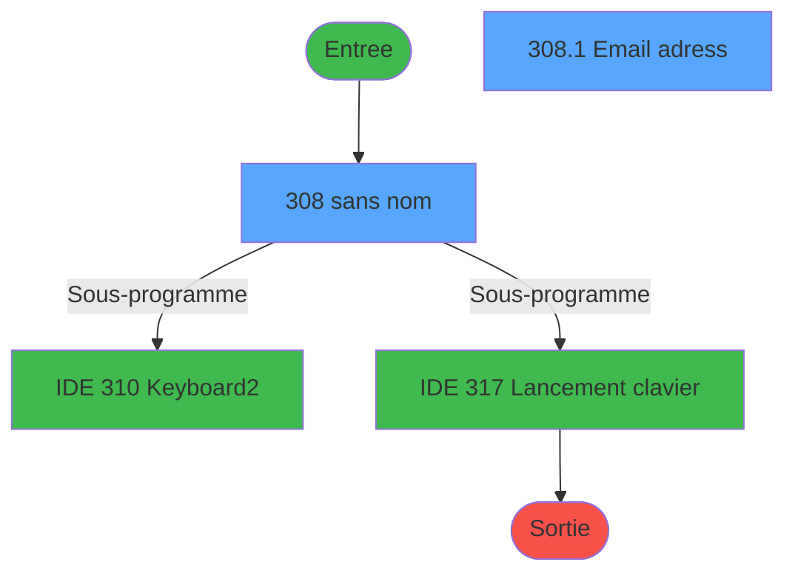
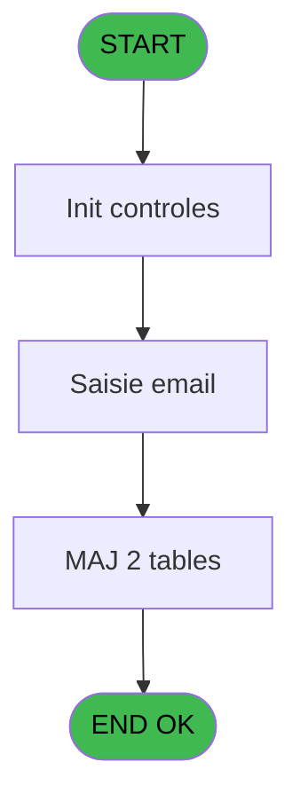
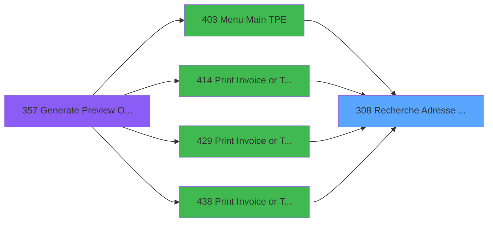
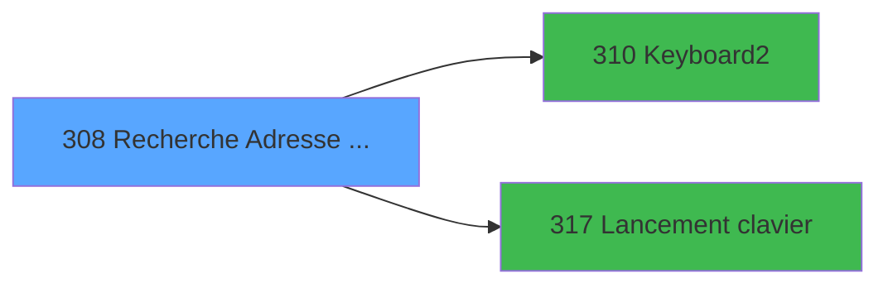

# PVE IDE 308 - Recherche Adresse Mail

> **Analyse**: Phases 1-4 2026-02-03 19:31 -> 19:31 (11s) | Assemblage 19:31
> **Pipeline**: V7.2 Enrichi
> **Structure**: 4 onglets (Resume | Ecrans | Donnees | Connexions)

<!-- TAB:Resume -->

## 1. FICHE D'IDENTITE

| Attribut | Valeur |
|----------|--------|
| Projet | PVE |
| IDE Position | 308 |
| Nom Programme | Recherche Adresse Mail |
| Fichier source | `Prg_308.xml` |
| Dossier IDE | Utilitaires |
| Taches | 5 (2 ecrans visibles) |
| Tables modifiees | 2 |
| Programmes appeles | 2 |

## 2. DESCRIPTION FONCTIONNELLE

**Recherche Adresse Mail** assure la gestion complete de ce processus, accessible depuis [Menu Main (TPE) (IDE 403)](PVE-IDE-403.md), [Print Invoice or Ticket==V4 (IDE 414)](PVE-IDE-414.md), [Print Invoice or Ticket==NEW (IDE 429)](PVE-IDE-429.md), [Print Invoice or Ticket v2 (IDE 438)](PVE-IDE-438.md).

Le flux de traitement s'organise en **2 blocs fonctionnels** :

- **Traitement** (4 taches) : traitements metier divers
- **Creation** (1 tache) : insertion d'enregistrements en base (mouvements, prestations)

**Donnees modifiees** : 2 tables en ecriture (gm-recherche_____gmr, email).

**Logique metier** : 1 regles identifiees couvrant conditions metier.

Detail : phases du traitement

#### Phase 1 : Traitement (4 taches)

- **308** - (sans nom) **[[ECRAN]](#ecran-t1)**
- **308.1** - Email adress **[[ECRAN]](#ecran-t2)**
- **308.1.1** - Update
- **308.1.2** - Lecture email

Delegue a : [Keyboard2 (IDE 310)](PVE-IDE-310.md), [Lancement clavier (IDE 317)](PVE-IDE-317.md)

#### Phase 2 : Creation (1 tache)

- **308.1.3** - Creation email

#### Tables impactees

| Table | Operations | Role metier |
|-------|-----------|-------------|
| email | R/**W**/L (4 usages) |  |
| gm-recherche_____gmr | **W** (1 usages) | Index de recherche |

## 3. BLOCS FONCTIONNELS

### 3.1 Traitement (4 taches)

Traitements internes.

---

#### 308 - (sans nom) [[ECRAN]](#ecran-t1)

**Role** : Traitement interne.
**Ecran** : 1266 x 227 DLU | [Voir mockup](#ecran-t1)

3 sous-taches directes

| Tache | Nom | Bloc |
|-------|-----|------|
| [308.1](#t2) | Email adress **[[ECRAN]](#ecran-t2)** | Traitement |
| [308.1.1](#t3) | Update | Traitement |
| [308.1.2](#t4) | Lecture email | Traitement |

**Delegue a** : [Keyboard2 (IDE 310)](PVE-IDE-310.md), [Lancement clavier (IDE 317)](PVE-IDE-317.md)

---

#### 308.1 - Email adress [[ECRAN]](#ecran-t2)

**Role** : Traitement : Email adress.
**Ecran** : 1181 x 188 DLU (MDI) | [Voir mockup](#ecran-t2)
**Variables liees** : D (P.Adresse Mail Retour), G (v Lien email), Q (LAST email), X (CHG_REASON_V email cnil), Y (CHG_PRV_V email cnil)
**Delegue a** : [Keyboard2 (IDE 310)](PVE-IDE-310.md), [Lancement clavier (IDE 317)](PVE-IDE-317.md)

---

#### 308.1.1 - Update

**Role** : Traitement : Update.
**Delegue a** : [Keyboard2 (IDE 310)](PVE-IDE-310.md), [Lancement clavier (IDE 317)](PVE-IDE-317.md)

---

#### 308.1.2 - Lecture email

**Role** : Traitement : Lecture email.
**Variables liees** : G (v Lien email), Q (LAST email), X (CHG_REASON_V email cnil), Y (CHG_PRV_V email cnil)
**Delegue a** : [Keyboard2 (IDE 310)](PVE-IDE-310.md), [Lancement clavier (IDE 317)](PVE-IDE-317.md)

### 3.2 Creation (1 tache)

Insertion de nouveaux enregistrements en base.

---

#### 308.1.3 - Creation email

**Role** : Creation d'enregistrement : Creation email.
**Variables liees** : G (v Lien email), Q (LAST email), X (CHG_REASON_V email cnil), Y (CHG_PRV_V email cnil)

## 5. REGLES METIER

1 regles identifiees:

### Autres (1 regles)

#### [RM-001] Si B Quit [O] vaut 'FR' alors 'FRA', sinon 'ENG'

| Element | Detail |
|---------|--------|
| **Condition** | `B Quit [O]='FR'` |
| **Si vrai** | 'FRA' |
| **Si faux** | 'ENG') |
| **Variables** | O (B Quit) |
| **Expression source** | Expression 14 : `IF(B Quit [O]='FR','FRA','ENG')` |
| **Exemple** | Si B Quit [O]='FR' → 'FRA'. Sinon → 'ENG') |

## 6. CONTEXTE

- **Appele par**: [Menu Main (TPE) (IDE 403)](PVE-IDE-403.md), [Print Invoice or Ticket==V4 (IDE 414)](PVE-IDE-414.md), [Print Invoice or Ticket==NEW (IDE 429)](PVE-IDE-429.md), [Print Invoice or Ticket v2 (IDE 438)](PVE-IDE-438.md)
- **Appelle**: 2 programmes | **Tables**: 4 (W:2 R:1 L:3) | **Taches**: 5 | **Expressions**: 19

<!-- TAB:Ecrans -->

## 8. ECRANS

### 8.1 Forms visibles (2 / 5)

| # | Position | Tache | Nom | Type | Largeur | Hauteur | Bloc |
|---|----------|-------|-----|------|---------|---------|------|
| 1 | 308 | 308 | (sans nom) | Type0 | 1266 | 227 | Traitement |
| 2 | 308.1 | 308.1 | Email adress | MDI | 1181 | 188 | Traitement |

### 8.2 Mockups Ecrans

---

#### 308 - (sans nom)
**Tache** : [308](#t1) | **Type** : Type0 | **Dimensions** : 1266 x 227 DLU
**Bloc** : Traitement | **Titre IDE** : (sans nom)

<!-- FORM-DATA:
{
    "width":  1266,
    "vFactor":  8,
    "type":  "Type0",
    "hFactor":  8,
    "controls":  [
                     {
                         "x":  8,
                         "type":  "label",
                         "var":  "",
                         "y":  2,
                         "w":  1249,
                         "fmt":  "",
                         "name":  "",
                         "h":  40,
                         "color":  "186",
                         "text":  "",
                         "parent":  null
                     },
                     {
                         "x":  21,
                         "type":  "label",
                         "var":  "",
                         "y":  16,
                         "w":  258,
                         "fmt":  "",
                         "name":  "",
                         "h":  12,
                         "color":  "186",
                         "text":  "Select an email adress",
                         "parent":  1
                     },
                     {
                         "x":  13,
                         "type":  "table",
                         "var":  "",
                         "name":  "",
                         "titleH":  12,
                         "color":  "110",
                         "w":  1245,
                         "y":  45,
                         "fmt":  "",
                         "parent":  null,
                         "text":  "",
                         "rowH":  16,
                         "h":  141,
                         "cols":  [
                                      {
                                          "title":  "Adherent",
                                          "layer":  1,
                                          "w":  154
                                      },
                                      {
                                          "title":  "Filiation",
                                          "layer":  2,
                                          "w":  94
                                      },
                                      {
                                          "title":  "Prenom",
                                          "layer":  3,
                                          "w":  128
                                      },
                                      {
                                          "title":  "Nom",
                                          "layer":  4,
                                          "w":  356
                                      },
                                      {
                                          "title":  "Adresse Mail",
                                          "layer":  5,
                                          "w":  451
                                      }
                                  ],
                         "rows":  5
                     },
                     {
                         "x":  21,
                         "type":  "edit",
                         "var":  "",
                         "y":  60,
                         "w":  138,
                         "fmt":  "",
                         "name":  "gmr_code_gm",
                         "h":  12,
                         "color":  "110",
                         "text":  "",
                         "parent":  3
                     },
                     {
                         "x":  203,
                         "type":  "edit",
                         "var":  "",
                         "y":  60,
                         "w":  29,
                         "fmt":  "",
                         "name":  "gmr_filiation_villag",
                         "h":  12,
                         "color":  "110",
                         "text":  "",
                         "parent":  3
                     },
                     {
                         "x":  269,
                         "type":  "edit",
                         "var":  "",
                         "y":  60,
                         "w":  112,
                         "fmt":  "",
                         "name":  "gmr_prenom__8_",
                         "h":  12,
                         "color":  "110",
                         "text":  "",
                         "parent":  3
                     },
                     {
                         "x":  398,
                         "type":  "edit",
                         "var":  "",
                         "y":  60,
                         "w":  336,
                         "fmt":  "",
                         "name":  "gmr_nom__30_",
                         "h":  12,
                         "color":  "110",
                         "text":  "",
                         "parent":  3
                     },
                     {
                         "x":  752,
                         "type":  "edit",
                         "var":  "",
                         "y":  60,
                         "w":  441,
                         "fmt":  "",
                         "name":  "ema_email",
                         "h":  12,
                         "color":  "110",
                         "text":  "",
                         "parent":  3
                     },
                     {
                         "x":  13,
                         "type":  "button",
                         "var":  "",
                         "y":  192,
                         "w":  167,
                         "fmt":  "\u0026Quit",
                         "name":  "B No Mail",
                         "h":  31,
                         "color":  "",
                         "text":  "",
                         "parent":  null
                     },
                     {
                         "x":  668,
                         "type":  "button",
                         "var":  "",
                         "y":  192,
                         "w":  167,
                         "fmt":  "\u0026Create",
                         "name":  "B Create",
                         "h":  31,
                         "color":  "",
                         "text":  "",
                         "parent":  null
                     },
                     {
                         "x":  848,
                         "type":  "button",
                         "var":  "",
                         "y":  192,
                         "w":  167,
                         "fmt":  "\u0026Modify",
                         "name":  "B Modify",
                         "h":  31,
                         "color":  "",
                         "text":  "",
                         "parent":  null
                     },
                     {
                         "x":  1089,
                         "type":  "button",
                         "var":  "",
                         "y":  192,
                         "w":  167,
                         "fmt":  "\u0026Select",
                         "name":  "B Choose",
                         "h":  31,
                         "color":  "",
                         "text":  "",
                         "parent":  null
                     }
                 ],
    "taskId":  "308",
    "height":  227
}
-->

<strong>Champs : 5 champs</strong>

| Pos (x,y) | Nom | Variable | Type |
|-----------|-----|----------|------|
| 21,60 | gmr_code_gm | - | edit |
| 203,60 | gmr_filiation_villag | - | edit |
| 269,60 | gmr_prenom__8_ | - | edit |
| 398,60 | gmr_nom__30_ | - | edit |
| 752,60 | ema_email | - | edit |

<strong>Boutons : 4 boutons</strong>

| Bouton | Pos (x,y) | Action |
|--------|-----------|--------|
| Quit | 13,192 | Bouton fonctionnel |
| Create | 668,192 | Bouton fonctionnel |
| Modify | 848,192 | Modifie l'element |
| Select | 1089,192 | Ouvre la selection |

---

#### 308.1 - Email adress
**Tache** : [308.1](#t2) | **Type** : MDI | **Dimensions** : 1181 x 188 DLU
**Bloc** : Traitement | **Titre IDE** : Email adress

<!-- FORM-DATA:
{
    "width":  1181,
    "vFactor":  8,
    "type":  "MDI",
    "hFactor":  8,
    "controls":  [
                     {
                         "x":  10,
                         "type":  "label",
                         "var":  "",
                         "y":  8,
                         "w":  181,
                         "fmt":  "",
                         "name":  "",
                         "h":  9,
                         "color":  "187",
                         "text":  "Email adresse",
                         "parent":  null
                     },
                     {
                         "x":  3,
                         "type":  "edit",
                         "var":  "",
                         "y":  23,
                         "w":  1166,
                         "fmt":  "L129",
                         "name":  "V email texte",
                         "h":  18,
                         "color":  "148",
                         "text":  "",
                         "parent":  null
                     },
                     {
                         "x":  3,
                         "type":  "combobox",
                         "var":  "",
                         "y":  63,
                         "w":  165,
                         "fmt":  "",
                         "name":  "V email cnil",
                         "h":  12,
                         "color":  "110",
                         "text":  "Accepté,Refusé",
                         "parent":  null
                     },
                     {
                         "x":  181,
                         "type":  "edit",
                         "var":  "",
                         "y":  63,
                         "w":  440,
                         "fmt":  "",
                         "name":  "",
                         "h":  18,
                         "color":  "148",
                         "text":  "",
                         "parent":  null
                     },
                     {
                         "x":  1022,
                         "type":  "button",
                         "var":  "",
                         "y":  161,
                         "w":  149,
                         "fmt":  "\u0026Validate",
                         "name":  "",
                         "h":  25,
                         "color":  "",
                         "text":  "",
                         "parent":  null
                     },
                     {
                         "x":  3,
                         "type":  "edit",
                         "var":  "",
                         "y":  84,
                         "w":  1166,
                         "fmt":  "256",
                         "name":  "",
                         "h":  32,
                         "color":  "187",
                         "text":  "",
                         "parent":  null
                     },
                     {
                         "x":  3,
                         "type":  "edit",
                         "var":  "",
                         "y":  122,
                         "w":  1166,
                         "fmt":  "256",
                         "name":  "",
                         "h":  32,
                         "color":  "187",
                         "text":  "",
                         "parent":  null
                     },
                     {
                         "x":  5,
                         "type":  "edit",
                         "var":  "",
                         "y":  44,
                         "w":  528,
                         "fmt":  "30",
                         "name":  "",
                         "h":  15,
                         "color":  "187",
                         "text":  "",
                         "parent":  null
                     },
                     {
                         "x":  857,
                         "type":  "button",
                         "var":  "",
                         "y":  161,
                         "w":  149,
                         "fmt":  "\u0026Quit",
                         "name":  "B Cancel",
                         "h":  25,
                         "color":  "",
                         "text":  "",
                         "parent":  null
                     },
                     {
                         "x":  3,
                         "type":  "button",
                         "var":  "",
                         "y":  161,
                         "w":  149,
                         "fmt":  "\u0026Keyboard",
                         "name":  "B Keyboard",
                         "h":  25,
                         "color":  "",
                         "text":  "",
                         "parent":  null
                     }
                 ],
    "taskId":  "308.1",
    "height":  188
}
-->

<strong>Champs : 6 champs</strong>

| Pos (x,y) | Nom | Variable | Type |
|-----------|-----|----------|------|
| 3,23 | V email texte | - | edit |
| 3,63 | V email cnil | - | combobox |
| 181,63 | (sans nom) | - | edit |
| 3,84 | 256 | - | edit |
| 3,122 | 256 | - | edit |
| 5,44 | 30 | - | edit |

<strong>Boutons : 3 boutons</strong>

| Bouton | Pos (x,y) | Action |
|--------|-----------|--------|
| Validate | 1022,161 | Valide la saisie et enregistre |
| Quit | 857,161 | Bouton fonctionnel |
| Keyboard | 3,161 | Appel [Keyboard2 (IDE 310)](PVE-IDE-310.md) |

## 9. NAVIGATION

### 9.1 Enchainement des ecrans

**Detail par enchainement :**

| Depuis | Action | Vers | Retour |
|--------|--------|------|--------|
|  | Sous-programme | [Keyboard2 (IDE 310)](PVE-IDE-310.md) | Retour ecran |
|  | Sous-programme | [Lancement clavier (IDE 317)](PVE-IDE-317.md) | Retour ecran |

### 9.3 Structure hierarchique (5 taches)

| Position | Tache | Type | Dimensions | Bloc |
|----------|-------|------|------------|------|
| **308.1** | [**(sans nom)** (308)](#t1) [mockup](#ecran-t1) | - | 1266x227 | Traitement |
| 308.1.1 | [Email adress (308.1)](#t2) [mockup](#ecran-t2) | MDI | 1181x188 | |
| 308.1.2 | [Update (308.1.1)](#t3) | MDI | - | |
| 308.1.3 | [Lecture email (308.1.2)](#t4) | MDI | - | |
| **308.2** | [**Creation email** (308.1.3)](#t5) | MDI | - | Creation |

### 9.4 Algorigramme

> **Legende**: Vert = START/END OK | Rouge = END KO | Bleu = Decisions
> *Algorigramme auto-genere. Utiliser `/algorigramme` pour une synthese metier detaillee.*

<!-- TAB:Donnees -->

## 10. TABLES

### Tables utilisees (4)

| ID | Nom | Description | Type | R | W | L | Usages |
|----|-----|-------------|------|---|---|---|--------|
| 30 | gm-recherche_____gmr | Index de recherche | DB |   | **W** |   | 1 |
| 130 | fichier_langue |  | DB |   |   | L | 1 |
| 285 | email |  | DB | R | **W** | L | 4 |
| 720 | arc_transac_entete_bar |  | DB |   |   | L | 2 |

### Colonnes par table (3 / 2 tables avec colonnes identifiees)

Table 30 - gm-recherche_____gmr (**W**) - 1 usages

| Lettre | Variable | Acces | Type |
|--------|----------|-------|------|
| A | P Societe | W | Alpha |
| B | P Adherent | W | Numeric |
| C | P Filiation | W | Numeric |
| D | P.Adresse Mail Retour | W | Alpha |
| E | P Langue Mail Retour | W | Alpha |
| F | P Envoi Mail ? | W | Logical |
| G | v Lien email | W | Logical |
| H | v Retour Mail Non Renseigné | W | Numeric |
| I | v Retour Quit | W | Numeric |
| J | v Retour No Mail | W | Numeric |
| K | B Create | W | Alpha |
| L | B Modify | W | Alpha |
| M | B Choose | W | Alpha |
| N | B No Mail | W | Alpha |
| O | B Quit | W | Alpha |

Table 285 - email (R/**W**/L) - 4 usages

| Lettre | Variable | Acces | Type |
|--------|----------|-------|------|
| A | V ADHERENT | W | Numeric |
| B | V FILIATION adh | W | Numeric |
| C | V DOSSIER | W | Numeric |

## 11. VARIABLES

### 11.1 Parametres entrants (6)

Variables recues du programme appelant ([Menu Main (TPE) (IDE 403)](PVE-IDE-403.md)).

| Lettre | Nom | Type | Usage dans |
|--------|-----|------|-----------|
| A | P Societe | Alpha | 1x parametre entrant |
| B | P Adherent | Numeric | 1x parametre entrant |
| C | P Filiation | Numeric | - |
| D | P.Adresse Mail Retour | Alpha | - |
| E | P Langue Mail Retour | Alpha | - |
| F | P Envoi Mail ? | Logical | - |

### 11.2 Variables de session (6)

Variables persistantes pendant toute la session.

| Lettre | Nom | Type | Usage dans |
|--------|-----|------|-----------|
| G | v Lien email | Logical | [308.1](#t2), [308.1.2](#t4), [308.1.3](#t5) |
| H | v Retour Mail Non Renseigné | Numeric | - |
| I | v Retour Quit | Numeric | 1x session |
| J | v Retour No Mail | Numeric | - |
| P | V Couleur | Numeric | 2x session |
| U | V.Sortie loop | Logical | 1x session |

### 11.3 Autres (13)

Variables diverses.

| Lettre | Nom | Type | Usage dans |
|--------|-----|------|-----------|
| K | B Create | Alpha | - |
| L | B Modify | Alpha | 1x refs |
| M | B Choose | Alpha | - |
| N | B No Mail | Alpha | - |
| O | B Quit | Alpha | 1x refs |
| Q | LAST email | Alpha | - |
| R | LAST cnil | Alpha | - |
| S | LAST report filiation | Logical | - |
| T | LAST Telephone portable | Alpha | 4x refs |
| V | B Cancel | Alpha | - |
| W | B Keyboard | Alpha | 1x refs |
| X | CHG_REASON_V email cnil | Numeric | - |
| Y | CHG_PRV_V email cnil | Alpha | - |

Toutes les 25 variables (liste complete)

| Cat | Lettre | Nom Variable | Type |
|-----|--------|--------------|------|
| P0 | **A** | P Societe | Alpha |
| P0 | **B** | P Adherent | Numeric |
| P0 | **C** | P Filiation | Numeric |
| P0 | **D** | P.Adresse Mail Retour | Alpha |
| P0 | **E** | P Langue Mail Retour | Alpha |
| P0 | **F** | P Envoi Mail ? | Logical |
| V. | **G** | v Lien email | Logical |
| V. | **H** | v Retour Mail Non Renseigné | Numeric |
| V. | **I** | v Retour Quit | Numeric |
| V. | **J** | v Retour No Mail | Numeric |
| V. | **P** | V Couleur | Numeric |
| V. | **U** | V.Sortie loop | Logical |
| Autre | **K** | B Create | Alpha |
| Autre | **L** | B Modify | Alpha |
| Autre | **M** | B Choose | Alpha |
| Autre | **N** | B No Mail | Alpha |
| Autre | **O** | B Quit | Alpha |
| Autre | **Q** | LAST email | Alpha |
| Autre | **R** | LAST cnil | Alpha |
| Autre | **S** | LAST report filiation | Logical |
| Autre | **T** | LAST Telephone portable | Alpha |
| Autre | **V** | B Cancel | Alpha |
| Autre | **W** | B Keyboard | Alpha |
| Autre | **X** | CHG_REASON_V email cnil | Numeric |
| Autre | **Y** | CHG_PRV_V email cnil | Alpha |

## 12. EXPRESSIONS

**19 / 19 expressions decodees (100%)**

### 12.1 Repartition par type

| Type | Expressions | Regles |
|------|-------------|--------|
| CONDITION | 5 | 5 |
| CONSTANTE | 3 | 0 |
| OTHER | 9 | 0 |
| CAST_LOGIQUE | 2 | 0 |

### 12.2 Expressions cles par type

#### CONDITION (5 expressions)

| Type | IDE | Expression | Regle |
|------|-----|------------|-------|
| CONDITION | 14 | `IF(B Quit [O]='FR','FRA','ENG')` | [RM-001](#rm-RM-001) |
| CONDITION | 12 | `V.Sortie loop [U]=6 OR LAST Telephone portable [T]<>''` | - |
| CONDITION | 17 | `B Keyboard [W]=6` | - |
| CONDITION | 9 | `LAST Telephone portable [T]<>''` | - |
| CONDITION | 11 | `LAST Telephone portable [T]=''` | - |

#### CONSTANTE (3 expressions)

| Type | IDE | Expression | Regle |
|------|-----|------------|-------|
| CONSTANTE | 16 | `'Email address has not been selected ! Confirm your choice '` | - |
| CONSTANTE | 15 | `''` | - |
| CONSTANTE | 10 | `'Email adress is empty ! Confirm '` | - |

#### OTHER (9 expressions)

| Type | IDE | Expression | Regle |
|------|-----|------------|-------|
| OTHER | 7 | `V Couleur [P]` | - |
| OTHER | 6 | `NOT(V Couleur [P])` | - |
| OTHER | 13 | `B Modify [L]` | - |
| OTHER | 8 | `LAST Telephone portable [T]` | - |
| OTHER | 5 | `v Retour Quit [I]` | - |
| ... | | *+4 autres* | |

#### CAST_LOGIQUE (2 expressions)

| Type | IDE | Expression | Regle |
|------|-----|------------|-------|
| CAST_LOGIQUE | 19 | `'TRUE'LOG` | - |
| CAST_LOGIQUE | 18 | `'FALSE'LOG` | - |

<!-- TAB:Connexions -->

## 13. GRAPHE D'APPELS

### 13.1 Chaine depuis Main (Callers)

Main -> ... -> [Menu Main (TPE) (IDE 403)](PVE-IDE-403.md) -> **Recherche Adresse Mail (IDE 308)**

Main -> ... -> [Print Invoice or Ticket==V4 (IDE 414)](PVE-IDE-414.md) -> **Recherche Adresse Mail (IDE 308)**

Main -> ... -> [Print Invoice or Ticket==NEW (IDE 429)](PVE-IDE-429.md) -> **Recherche Adresse Mail (IDE 308)**

Main -> ... -> [Print Invoice or Ticket v2 (IDE 438)](PVE-IDE-438.md) -> **Recherche Adresse Mail (IDE 308)**

### 13.2 Callers

| IDE | Nom Programme | Nb Appels |
|-----|---------------|-----------|
| [403](PVE-IDE-403.md) | Menu Main (TPE) | 1 |
| [414](PVE-IDE-414.md) | Print Invoice or Ticket==V4 | 1 |
| [429](PVE-IDE-429.md) | Print Invoice or Ticket==NEW | 1 |
| [438](PVE-IDE-438.md) | Print Invoice or Ticket v2 | 1 |

### 13.3 Callees (programmes appeles)

### 13.4 Detail Callees avec contexte

| IDE | Nom Programme | Appels | Contexte |
|-----|---------------|--------|----------|
| [310](PVE-IDE-310.md) | Keyboard2 | 1 | Sous-programme |
| [317](PVE-IDE-317.md) | Lancement clavier | 1 | Sous-programme |

## 14. RECOMMANDATIONS MIGRATION

### 14.1 Profil du programme

| Metrique | Valeur | Impact migration |
|----------|--------|-----------------|
| Lignes de logique | 292 | Taille moyenne |
| Expressions | 19 | Peu de logique |
| Tables WRITE | 2 | Impact faible |
| Sous-programmes | 2 | Peu de dependances |
| Ecrans visibles | 2 | Quelques ecrans |
| Code desactive | 2.1% (6 / 292) | Code sain |
| Regles metier | 1 | Quelques regles a preserver |

### 14.2 Plan de migration par bloc

#### Traitement (4 taches: 2 ecrans, 2 traitements)

- **Strategie** : Orchestrateur avec 2 ecrans (Razor/React) et 2 traitements backend (services).
- Les ecrans deviennent des composants UI, les traitements invisibles deviennent des services injectables.
- 2 sous-programme(s) a migrer ou a reutiliser depuis les services existants.
- Decomposer les taches en services unitaires testables.

#### Creation (1 tache: 0 ecran, 1 traitement)

- **Strategie** : Repository pattern avec Entity Framework Core.
- Insertion via `IRepository<T>.CreateAsync()`

### 14.3 Dependances critiques

| Dependance | Type | Appels | Impact |
|------------|------|--------|--------|
| gm-recherche_____gmr | Table WRITE (Database) | 1x | Schema + repository |
| email | Table WRITE (Database) | 2x | Schema + repository |
| [Lancement clavier (IDE 317)](PVE-IDE-317.md) | Sous-programme | 1x | Normale - Sous-programme |
| [Keyboard2 (IDE 310)](PVE-IDE-310.md) | Sous-programme | 1x | Normale - Sous-programme |

---
*Spec DETAILED generee par Pipeline V7.2 - 2026-02-03 19:31*
