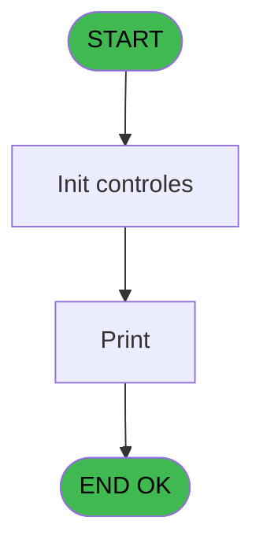
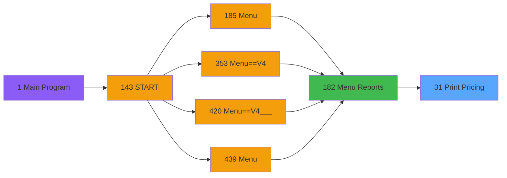

# PVE IDE 31 - Print Pricing

> **Analyse**: Phases 1-4 2026-02-03 01:18 -> 01:18 (40s) | Assemblage 01:18
> **Pipeline**: V7.2 Enrichi
> **Structure**: 4 onglets (Resume | Ecrans | Donnees | Connexions)

<!-- TAB:Resume -->

## 1. FICHE D'IDENTITE

| Attribut | Valeur |
|----------|--------|
| Projet | PVE |
| IDE Position | 31 |
| Nom Programme | Print Pricing |
| Fichier source | `Prg_31.xml` |
| Domaine metier | Impression |
| Taches | 4 (1 ecrans visibles) |
| Tables modifiees | 0 |
| Programmes appeles | 1 |

## 2. DESCRIPTION FONCTIONNELLE

**Print Pricing** assure la gestion complete de ce processus, accessible depuis [Menu Reports (IDE 182)](PVE-IDE-182.md).

Le flux de traitement s'organise en **3 blocs fonctionnels** :

- **Impression** (2 taches) : generation de tickets et documents
- **Initialisation** (1 tache) : reinitialisation d'etats et de variables de travail
- **Traitement** (1 tache) : traitements metier divers

Detail : phases du traitement

#### Phase 1 : Impression (2 taches)

- **31** - Print Price List **[[ECRAN]](#ecran-t1)**
- **31.1** - EDITION

#### Phase 2 : Traitement (1 tache)

- **31.1.1** - Read Packages Price

#### Phase 3 : Initialisation (1 tache)

- **31.2** - Init cat

## 3. BLOCS FONCTIONNELS

### 3.1 Impression (2 taches)

Generation des documents et tickets.

---

#### 31 - Print Price List [[ECRAN]](#ecran-t1)

**Role** : Generation du document : Print Price List.
**Ecran** : 314 x 175 DLU (MDI) | [Voir mockup](#ecran-t1)

---

#### 31.1 - EDITION

**Role** : Generation du document : EDITION.

### 3.2 Traitement (1 tache)

Traitements internes.

---

#### 31.1.1 - Read Packages Price

**Role** : Traitement : Read Packages Price.

### 3.3 Initialisation (1 tache)

Reinitialisation d'etats et variables de travail.

---

#### 31.2 - Init cat

**Role** : Reinitialisation : Init cat.

## 5. REGLES METIER

*(Aucune regle metier identifiee)*

## 6. CONTEXTE

- **Appele par**: [Menu Reports (IDE 182)](PVE-IDE-182.md)
- **Appelle**: 1 programmes | **Tables**: 3 (W:0 R:1 L:2) | **Taches**: 4 | **Expressions**: 5

<!-- TAB:Ecrans -->

## 8. ECRANS

### 8.1 Forms visibles (1 / 4)

| # | Position | Tache | Nom | Type | Largeur | Hauteur | Bloc |
|---|----------|-------|-----|------|---------|---------|------|
| 1 | 31 | 31 | Print Price List | MDI | 314 | 175 | Impression |

### 8.2 Mockups Ecrans

---

#### 31 - Print Price List
**Tache** : [31](#t1) | **Type** : MDI | **Dimensions** : 314 x 175 DLU
**Bloc** : Impression | **Titre IDE** : Print Price List

<!-- FORM-DATA:
{
    "width":  314,
    "vFactor":  8,
    "type":  "MDI",
    "hFactor":  4,
    "controls":  [
                     {
                         "x":  21,
                         "type":  "label",
                         "var":  "",
                         "y":  55,
                         "w":  265,
                         "fmt":  "",
                         "name":  "",
                         "h":  10,
                         "color":  "187",
                         "text":  "Select the range of categories you want to print",
                         "parent":  null
                     },
                     {
                         "x":  46,
                         "type":  "label",
                         "var":  "",
                         "y":  81,
                         "w":  69,
                         "fmt":  "",
                         "name":  "",
                         "h":  12,
                         "color":  "183",
                         "text":  "Category min",
                         "parent":  null
                     },
                     {
                         "x":  46,
                         "type":  "label",
                         "var":  "",
                         "y":  105,
                         "w":  72,
                         "fmt":  "",
                         "name":  "",
                         "h":  12,
                         "color":  "183",
                         "text":  "Category max",
                         "parent":  null
                     },
                     {
                         "x":  0,
                         "type":  "label",
                         "var":  "",
                         "y":  0,
                         "w":  312,
                         "fmt":  "",
                         "name":  "",
                         "h":  42,
                         "color":  "182",
                         "text":  "",
                         "parent":  null
                     },
                     {
                         "x":  14,
                         "type":  "label",
                         "var":  "",
                         "y":  14,
                         "w":  241,
                         "fmt":  "",
                         "name":  "",
                         "h":  10,
                         "color":  "186",
                         "text":  "Price list of a specific category",
                         "parent":  8
                     },
                     {
                         "x":  0,
                         "type":  "label",
                         "var":  "",
                         "y":  139,
                         "w":  312,
                         "fmt":  "",
                         "name":  "",
                         "h":  34,
                         "color":  "6",
                         "text":  "",
                         "parent":  null
                     },
                     {
                         "x":  119,
                         "type":  "edit",
                         "var":  "",
                         "y":  81,
                         "w":  22,
                         "fmt":  "",
                         "name":  "CATMINI",
                         "h":  12,
                         "color":  "110",
                         "text":  "",
                         "parent":  null
                     },
                     {
                         "x":  148,
                         "type":  "edit",
                         "var":  "",
                         "y":  81,
                         "w":  152,
                         "fmt":  "",
                         "name":  "",
                         "h":  12,
                         "color":  "183",
                         "text":  "",
                         "parent":  null
                     },
                     {
                         "x":  119,
                         "type":  "edit",
                         "var":  "",
                         "y":  105,
                         "w":  22,
                         "fmt":  "",
                         "name":  "CATMAXI",
                         "h":  12,
                         "color":  "110",
                         "text":  "",
                         "parent":  null
                     },
                     {
                         "x":  149,
                         "type":  "edit",
                         "var":  "",
                         "y":  105,
                         "w":  152,
                         "fmt":  "",
                         "name":  "",
                         "h":  12,
                         "color":  "183",
                         "text":  "",
                         "parent":  null
                     },
                     {
                         "x":  243,
                         "type":  "button",
                         "var":  "",
                         "y":  144,
                         "w":  68,
                         "fmt":  "Print",
                         "name":  "",
                         "h":  28,
                         "color":  "",
                         "text":  "",
                         "parent":  null
                     },
                     {
                         "x":  176,
                         "type":  "button",
                         "var":  "",
                         "y":  144,
                         "w":  68,
                         "fmt":  "Exit",
                         "name":  "",
                         "h":  28,
                         "color":  "",
                         "text":  "",
                         "parent":  null
                     },
                     {
                         "x":  262,
                         "type":  "image",
                         "var":  "",
                         "y":  4,
                         "w":  48,
                         "fmt":  "",
                         "name":  "",
                         "h":  37,
                         "color":  "",
                         "text":  "",
                         "parent":  8
                     }
                 ],
    "taskId":  "31",
    "height":  175
}
-->

<strong>Champs : 4 champs</strong>

| Pos (x,y) | Nom | Variable | Type |
|-----------|-----|----------|------|
| 119,81 | CATMINI | - | edit |
| 148,81 | (sans nom) | - | edit |
| 119,105 | CATMAXI | - | edit |
| 149,105 | (sans nom) | - | edit |

<strong>Boutons : 2 boutons</strong>

| Bouton | Pos (x,y) | Action |
|--------|-----------|--------|
| Print | 243,144 | Lance l'impression |
| Exit | 176,144 | Quitte le programme |

## 9. NAVIGATION

Ecran unique: **Print Price List**

### 9.3 Structure hierarchique (4 taches)

| Position | Tache | Type | Dimensions | Bloc |
|----------|-------|------|------------|------|
| **31.1** | [**Print Price List** (31)](#t1) [mockup](#ecran-t1) | MDI | 314x175 | Impression |
| 31.1.1 | [EDITION (31.1)](#t2) | MDI | - | |
| **31.2** | [**Read Packages Price** (31.1.1)](#t3) | MDI | - | Traitement |
| **31.3** | [**Init cat** (31.2)](#t4) | MDI | - | Initialisation |

### 9.4 Algorigramme

> **Legende**: Vert = START/END OK | Rouge = END KO | Bleu = Decisions
> *Algorigramme auto-genere. Utiliser `/algorigramme` pour une synthese metier detaillee.*

<!-- TAB:Donnees -->

## 10. TABLES

### Tables utilisees (3)

| ID | Nom | Description | Type | R | W | L | Usages |
|----|-----|-------------|------|---|---|---|--------|
| 379 | pv_customer_temp |  | DB | R |   |   | 3 |
| 403 | pv_sellers |  | DB |   |   | L | 1 |
| 413 | pv_tva |  | DB |   |   | L | 1 |

### Colonnes par table (1 / 1 tables avec colonnes identifiees)

Table 379 - pv_customer_temp (R) - 3 usages

| Lettre | Variable | Acces | Type |
|--------|----------|-------|------|
| A | Cat mini | R | Numeric |
| B | Cat maxi | R | Numeric |
| C | V Masque sans Z | R | Alpha |
| D | v.NomFichierPdf | R | Alpha |

## 11. VARIABLES

### 11.1 Variables de session (2)

Variables persistantes pendant toute la session.

| Lettre | Nom | Type | Usage dans |
|--------|-----|------|-----------|
| C | V Masque sans Z | Alpha | - |
| D | v.NomFichierPdf | Alpha | - |

### 11.2 Autres (2)

Variables diverses.

| Lettre | Nom | Type | Usage dans |
|--------|-----|------|-----------|
| A | Cat mini | Numeric | 1x refs |
| B | Cat maxi | Numeric | - |

## 12. EXPRESSIONS

**5 / 5 expressions decodees (100%)**

### 12.1 Repartition par type

| Type | Expressions | Regles |
|------|-------------|--------|
| CALCULATION | 1 | 0 |
| CONCATENATION | 1 | 0 |
| OTHER | 3 | 0 |

### 12.2 Expressions cles par type

#### CALCULATION (1 expressions)

| Type | IDE | Expression | Regle |
|------|-----|------------|-------|
| CALCULATION | 4 | `Left (Trim (GetParam ('AMOUNTFORMAT')),Len (Trim (GetParam ('AMOUNTFORMAT')))-1)` | - |

#### CONCATENATION (1 expressions)

| Type | IDE | Expression | Regle |
|------|-----|------------|-------|
| CONCATENATION | 5 | `Translate ('%club_exportdata%')&Trim (GetParam ('VILLAGECODE'))&Trim (GetParam ('SERVICE'))&'_PRICE_LIST_'&DStr (Date(),'YYYYMMDD')&'_'&TStr (Time(),'HHMMSS')&'.Pdf'` | - |

#### OTHER (3 expressions)

| Type | IDE | Expression | Regle |
|------|-----|------------|-------|
| OTHER | 3 | `[E]` | - |
| OTHER | 2 | `Cat mini [A]` | - |
| OTHER | 1 | `GetParam ('SERVICE')` | - |

<!-- TAB:Connexions -->

## 13. GRAPHE D'APPELS

### 13.1 Chaine depuis Main (Callers)

Main -> ... -> [Menu Reports (IDE 182)](PVE-IDE-182.md) -> **Print Pricing (IDE 31)**

### 13.2 Callers

| IDE | Nom Programme | Nb Appels |
|-----|---------------|-----------|
| [182](PVE-IDE-182.md) | Menu Reports | 2 |

### 13.3 Callees (programmes appeles)

### 13.4 Detail Callees avec contexte

| IDE | Nom Programme | Appels | Contexte |
|-----|---------------|--------|----------|
| [333](PVE-IDE-333.md) | Choix - Category | 2 | Selection/consultation |

## 14. RECOMMANDATIONS MIGRATION

### 14.1 Profil du programme

| Metrique | Valeur | Impact migration |
|----------|--------|-----------------|
| Lignes de logique | 67 | Programme compact |
| Expressions | 5 | Peu de logique |
| Tables WRITE | 0 | Impact faible |
| Sous-programmes | 1 | Peu de dependances |
| Ecrans visibles | 1 | Ecran unique ou traitement batch |
| Code desactive | 0% (0 / 67) | Code sain |
| Regles metier | 0 | Pas de regle identifiee |

### 14.2 Plan de migration par bloc

#### Impression (2 taches: 1 ecran, 1 traitement)

- **Strategie** : Templates HTML -> PDF via wkhtmltopdf ou Puppeteer.
- `PrintService` injectable avec choix imprimante

#### Traitement (1 tache: 0 ecran, 1 traitement)

- **Strategie** : 1 service(s) backend injectable(s) (Domain Services).
- 1 sous-programme(s) a migrer ou a reutiliser depuis les services existants.
- Decomposer les taches en services unitaires testables.

#### Initialisation (1 tache: 0 ecran, 1 traitement)

- **Strategie** : Constructeur/methode `InitAsync()` dans l'orchestrateur.

### 14.3 Dependances critiques

| Dependance | Type | Appels | Impact |
|------------|------|--------|--------|
| [Choix - Category (IDE 333)](PVE-IDE-333.md) | Sous-programme | 2x | Haute - Selection/consultation |

---
*Spec DETAILED generee par Pipeline V7.2 - 2026-02-03 01:19*
