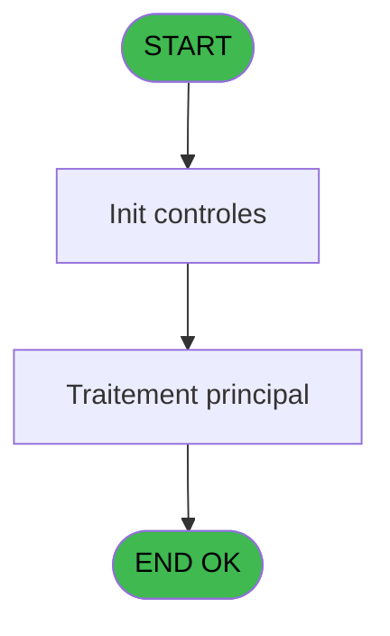
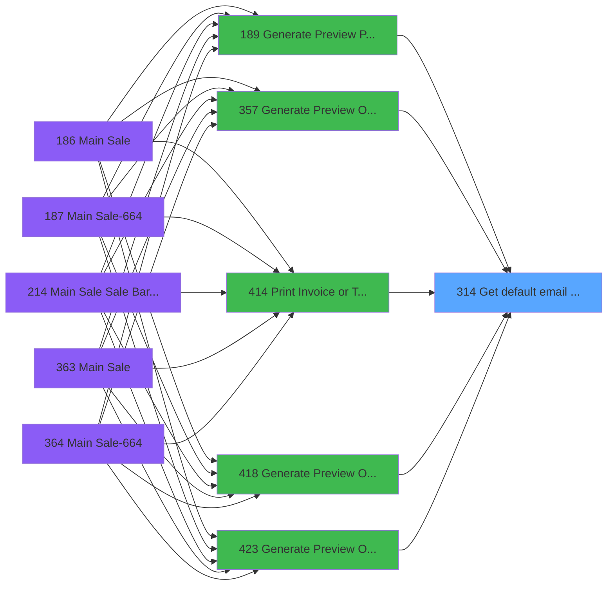

# PVE IDE 314 - Get default email address

> **Analyse**: Phases 1-4 2026-02-03 19:33 -> 19:33 (11s) | Assemblage 19:33
> **Pipeline**: V7.2 Enrichi
> **Structure**: 4 onglets (Resume | Ecrans | Donnees | Connexions)

<!-- TAB:Resume -->

## 1. FICHE D'IDENTITE

| Attribut | Valeur |
|----------|--------|
| Projet | PVE |
| IDE Position | 314 |
| Nom Programme | Get default email address |
| Fichier source | `Prg_314.xml` |
| Dossier IDE | Utilitaires |
| Taches | 1 (0 ecrans visibles) |
| Tables modifiees | 0 |
| Programmes appeles | 0 |

## 2. DESCRIPTION FONCTIONNELLE

**Get default email address** assure la gestion complete de ce processus, accessible depuis [Generate Preview Payments (IDE 189)](PVE-IDE-189.md), [Generate Preview OD==V4 (IDE 357)](PVE-IDE-357.md), [Print Invoice or Ticket==V4 (IDE 414)](PVE-IDE-414.md), [Generate Preview OD==LEX Book (IDE 418)](PVE-IDE-418.md), [Generate Preview OD==V4 (IDE 423)](PVE-IDE-423.md), [Generate Preview OD==LEX (IDE 424)](PVE-IDE-424.md), [Print Invoice or Ticket==NEW (IDE 429)](PVE-IDE-429.md), [Generate Preview Payments 1212 (IDE 434)](PVE-IDE-434.md), [Generate Preview Payments 1112 (IDE 435)](PVE-IDE-435.md), [Generate Preview Payments 1012 (IDE 436)](PVE-IDE-436.md), [Generate Preview Payment 1212E (IDE 437)](PVE-IDE-437.md), [Print Invoice or Ticket v2 (IDE 438)](PVE-IDE-438.md), [Generate Preview Payments (IDE 441)](PVE-IDE-441.md).

Le flux de traitement s'organise en **1 blocs fonctionnels** :

- **Traitement** (1 tache) : traitements metier divers

**Logique metier** : 1 regles identifiees couvrant conditions metier.

## 3. BLOCS FONCTIONNELS

### 3.1 Traitement (1 tache)

Traitements internes.

---

#### 314 - Get default email address

**Role** : Consultation/chargement : Get default email address.
**Variables liees** : F (p.email)

## 5. REGLES METIER

1 regles identifiees:

### Autres (1 regles)

#### [RM-001] Traitement si Trim([J]) est renseigne

| Element | Detail |
|---------|--------|
| **Condition** | `Trim([J])<>''` |
| **Si vrai** | [J] |
| **Si faux** | [N]) |
| **Expression source** | Expression 7 : `IF(Trim([J])<>'',[J],[N])` |
| **Exemple** | Si Trim([J])<>'' → [J]. Sinon → [N]) |

## 6. CONTEXTE

- **Appele par**: [Generate Preview Payments (IDE 189)](PVE-IDE-189.md), [Generate Preview OD==V4 (IDE 357)](PVE-IDE-357.md), [Print Invoice or Ticket==V4 (IDE 414)](PVE-IDE-414.md), [Generate Preview OD==LEX Book (IDE 418)](PVE-IDE-418.md), [Generate Preview OD==V4 (IDE 423)](PVE-IDE-423.md), [Generate Preview OD==LEX (IDE 424)](PVE-IDE-424.md), [Print Invoice or Ticket==NEW (IDE 429)](PVE-IDE-429.md), [Generate Preview Payments 1212 (IDE 434)](PVE-IDE-434.md), [Generate Preview Payments 1112 (IDE 435)](PVE-IDE-435.md), [Generate Preview Payments 1012 (IDE 436)](PVE-IDE-436.md), [Generate Preview Payment 1212E (IDE 437)](PVE-IDE-437.md), [Print Invoice or Ticket v2 (IDE 438)](PVE-IDE-438.md), [Generate Preview Payments (IDE 441)](PVE-IDE-441.md)
- **Appelle**: 0 programmes | **Tables**: 1 (W:0 R:1 L:0) | **Taches**: 1 | **Expressions**: 7

<!-- TAB:Ecrans -->

## 8. ECRANS

*(Programme sans ecran visible)*

## 9. NAVIGATION

### 9.3 Structure hierarchique (1 tache)

| Position | Tache | Type | Dimensions | Bloc |
|----------|-------|------|------------|------|
| **314.1** | [**Get default email address** (314)](#t1) | - | - | Traitement |

### 9.4 Algorigramme

> **Legende**: Vert = START/END OK | Rouge = END KO | Bleu = Decisions
> *Algorigramme auto-genere. Utiliser `/algorigramme` pour une synthese metier detaillee.*

<!-- TAB:Donnees -->

## 10. TABLES

### Tables utilisees (1)

| ID | Nom | Description | Type | R | W | L | Usages |
|----|-----|-------------|------|---|---|---|--------|
| 285 | email |  | DB | R |   |   | 1 |

### Colonnes par table (1 / 1 tables avec colonnes identifiees)

Table 285 - email (R) - 1 usages

| Lettre | Variable | Acces | Type |
|--------|----------|-------|------|
| A | p.Societe | R | Alpha |
| B | p.Compte payeur | R | Numeric |
| C | p.Filiation payeur | R | Numeric |
| D | p.Compte acheteur | R | Numeric |
| E | p.Filiation acheteur | R | Numeric |
| F | p.email | R | Unicode |

## 11. VARIABLES

### 11.1 Parametres entrants (6)

Variables recues du programme appelant ([Generate Preview Payments (IDE 189)](PVE-IDE-189.md)).

| Lettre | Nom | Type | Usage dans |
|--------|-----|------|-----------|
| A | p.Societe | Alpha | 1x parametre entrant |
| B | p.Compte payeur | Numeric | 1x parametre entrant |
| C | p.Filiation payeur | Numeric | 1x parametre entrant |
| D | p.Compte acheteur | Numeric | 1x parametre entrant |
| E | p.Filiation acheteur | Numeric | 1x parametre entrant |
| F | p.email | Unicode | - |

## 12. EXPRESSIONS

**7 / 7 expressions decodees (100%)**

### 12.1 Repartition par type

| Type | Expressions | Regles |
|------|-------------|--------|
| CONDITION | 1 | 5 |
| CONSTANTE | 1 | 0 |
| OTHER | 5 | 0 |

### 12.2 Expressions cles par type

#### CONDITION (1 expressions)

| Type | IDE | Expression | Regle |
|------|-----|------------|-------|
| CONDITION | 7 | `IF(Trim([J])<>'',[J],[N])` | [RM-001](#rm-RM-001) |

#### CONSTANTE (1 expressions)

| Type | IDE | Expression | Regle |
|------|-----|------------|-------|
| CONSTANTE | 6 | `''` | - |

#### OTHER (5 expressions)

| Type | IDE | Expression | Regle |
|------|-----|------------|-------|
| OTHER | 4 | `p.Compte acheteur [D]` | - |
| OTHER | 5 | `p.Filiation acheteur [E]` | - |
| OTHER | 3 | `p.Filiation payeur [C]` | - |
| OTHER | 1 | `p.Societe [A]` | - |
| OTHER | 2 | `p.Compte payeur [B]` | - |

<!-- TAB:Connexions -->

## 13. GRAPHE D'APPELS

### 13.1 Chaine depuis Main (Callers)

Main -> ... -> [Generate Preview Payments (IDE 189)](PVE-IDE-189.md) -> **Get default email address (IDE 314)**

Main -> ... -> [Generate Preview OD==V4 (IDE 357)](PVE-IDE-357.md) -> **Get default email address (IDE 314)**

Main -> ... -> [Print Invoice or Ticket==V4 (IDE 414)](PVE-IDE-414.md) -> **Get default email address (IDE 314)**

Main -> ... -> [Generate Preview OD==LEX Book (IDE 418)](PVE-IDE-418.md) -> **Get default email address (IDE 314)**

Main -> ... -> [Generate Preview OD==V4 (IDE 423)](PVE-IDE-423.md) -> **Get default email address (IDE 314)**

Main -> ... -> [Generate Preview OD==LEX (IDE 424)](PVE-IDE-424.md) -> **Get default email address (IDE 314)**

Main -> ... -> [Print Invoice or Ticket==NEW (IDE 429)](PVE-IDE-429.md) -> **Get default email address (IDE 314)**

Main -> ... -> [Generate Preview Payments 1212 (IDE 434)](PVE-IDE-434.md) -> **Get default email address (IDE 314)**

Main -> ... -> [Generate Preview Payments 1112 (IDE 435)](PVE-IDE-435.md) -> **Get default email address (IDE 314)**

Main -> ... -> [Generate Preview Payments 1012 (IDE 436)](PVE-IDE-436.md) -> **Get default email address (IDE 314)**

Main -> ... -> [Generate Preview Payment 1212E (IDE 437)](PVE-IDE-437.md) -> **Get default email address (IDE 314)**

Main -> ... -> [Print Invoice or Ticket v2 (IDE 438)](PVE-IDE-438.md) -> **Get default email address (IDE 314)**

Main -> ... -> [Generate Preview Payments (IDE 441)](PVE-IDE-441.md) -> **Get default email address (IDE 314)**

### 13.2 Callers

| IDE | Nom Programme | Nb Appels |
|-----|---------------|-----------|
| [189](PVE-IDE-189.md) | Generate Preview Payments | 1 |
| [357](PVE-IDE-357.md) | Generate Preview OD==V4 | 1 |
| [414](PVE-IDE-414.md) | Print Invoice or Ticket==V4 | 1 |
| [418](PVE-IDE-418.md) | Generate Preview OD==LEX Book | 1 |
| [423](PVE-IDE-423.md) | Generate Preview OD==V4 | 1 |
| [424](PVE-IDE-424.md) | Generate Preview OD==LEX | 1 |
| [429](PVE-IDE-429.md) | Print Invoice or Ticket==NEW | 1 |
| [434](PVE-IDE-434.md) | Generate Preview Payments 1212 | 1 |
| [435](PVE-IDE-435.md) | Generate Preview Payments 1112 | 1 |
| [436](PVE-IDE-436.md) | Generate Preview Payments 1012 | 1 |
| [437](PVE-IDE-437.md) | Generate Preview Payment 1212E | 1 |
| [438](PVE-IDE-438.md) | Print Invoice or Ticket v2 | 1 |
| [441](PVE-IDE-441.md) | Generate Preview Payments | 1 |

### 13.3 Callees (programmes appeles)

### 13.4 Detail Callees avec contexte

| IDE | Nom Programme | Appels | Contexte |
|-----|---------------|--------|----------|
| - | (aucun) | - | - |

## 14. RECOMMANDATIONS MIGRATION

### 14.1 Profil du programme

| Metrique | Valeur | Impact migration |
|----------|--------|-----------------|
| Lignes de logique | 23 | Programme compact |
| Expressions | 7 | Peu de logique |
| Tables WRITE | 0 | Impact faible |
| Sous-programmes | 0 | Peu de dependances |
| Ecrans visibles | 0 | Ecran unique ou traitement batch |
| Code desactive | 0% (0 / 23) | Code sain |
| Regles metier | 1 | Quelques regles a preserver |

### 14.2 Plan de migration par bloc

#### Traitement (1 tache: 0 ecran, 1 traitement)

- **Strategie** : 1 service(s) backend injectable(s) (Domain Services).
- Decomposer les taches en services unitaires testables.

### 14.3 Dependances critiques

| Dependance | Type | Appels | Impact |
|------------|------|--------|--------|

---
*Spec DETAILED generee par Pipeline V7.2 - 2026-02-03 19:33*
