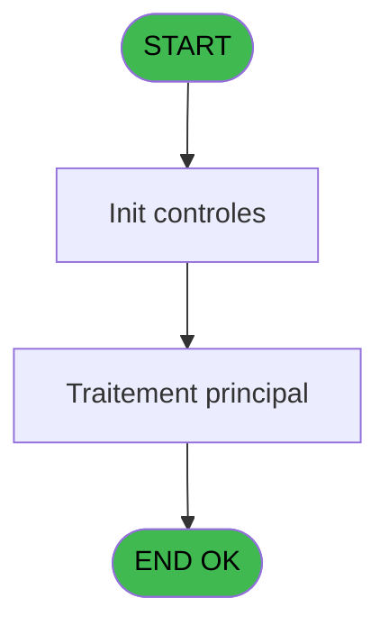
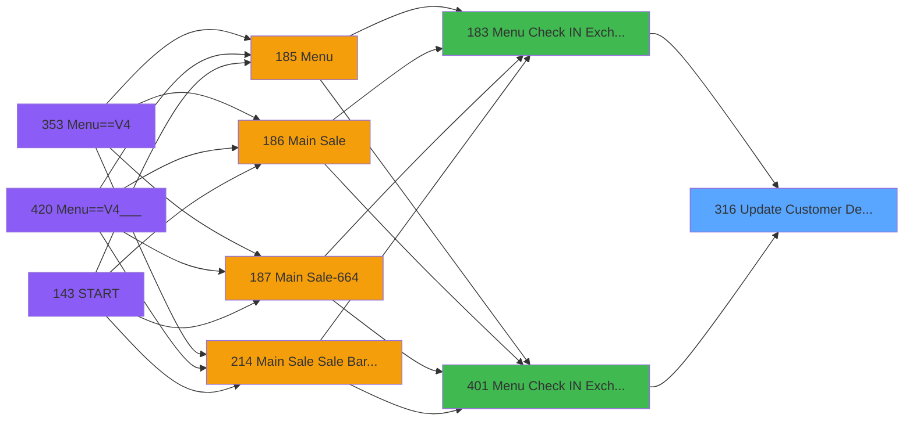

# PVE IDE 316 - Update Customer Details

> **Analyse**: Phases 1-4 2026-02-03 19:33 -> 19:33 (10s) | Assemblage 19:33
> **Pipeline**: V7.2 Enrichi
> **Structure**: 4 onglets (Resume | Ecrans | Donnees | Connexions)

<!-- TAB:Resume -->

## 1. FICHE D'IDENTITE

| Attribut | Valeur |
|----------|--------|
| Projet | PVE |
| IDE Position | 316 |
| Nom Programme | Update Customer Details |
| Fichier source | `Prg_316.xml` |
| Dossier IDE | Utilitaires |
| Taches | 1 (0 ecrans visibles) |
| Tables modifiees | 0 |
| Programmes appeles | 0 |

## 2. DESCRIPTION FONCTIONNELLE

**Update Customer Details** assure la gestion complete de ce processus, accessible depuis [Menu Check IN / Exchange (IDE 183)](PVE-IDE-183.md), [Menu Check IN / Exchange V4 (IDE 401)](PVE-IDE-401.md).

Le flux de traitement s'organise en **1 blocs fonctionnels** :

- **Traitement** (1 tache) : traitements metier divers

**Logique metier** : 1 regles identifiees couvrant conditions metier.

## 3. BLOCS FONCTIONNELS

### 3.1 Traitement (1 tache)

Traitements internes.

---

#### 316 - Update Customer Details

**Role** : Traitement : Update Customer Details.
**Variables liees** : A (P.Customer Id)

## 5. REGLES METIER

1 regles identifiees:

### Autres (1 regles)

#### [RM-001] Verification d'appartenance de [W] a une liste de valeurs

| Element | Detail |
|---------|--------|
| **Condition** | `IN([W]` |
| **Si vrai** | 'GM' |
| **Si faux** | 'GO'),Trim([W])&'-'&Trim([X]),'') |
| **Expression source** | Expression 18 : `IF(IN([W],'GM','GO'),Trim([W])&'-'&Trim([X]),'')` |
| **Exemple** | Si IN([W] → 'GM'. Sinon → 'GO'),Trim([W])&'-'&Trim([X]),'') |

## 6. CONTEXTE

- **Appele par**: [Menu Check IN / Exchange (IDE 183)](PVE-IDE-183.md), [Menu Check IN / Exchange V4 (IDE 401)](PVE-IDE-401.md)
- **Appelle**: 0 programmes | **Tables**: 4 (W:0 R:1 L:3) | **Taches**: 1 | **Expressions**: 18

<!-- TAB:Ecrans -->

## 8. ECRANS

*(Programme sans ecran visible)*

## 9. NAVIGATION

### 9.3 Structure hierarchique (1 tache)

| Position | Tache | Type | Dimensions | Bloc |
|----------|-------|------|------------|------|
| **316.1** | [**Update Customer Details** (316)](#t1) | - | - | Traitement |

### 9.4 Algorigramme

> **Legende**: Vert = START/END OK | Rouge = END KO | Bleu = Decisions
> *Algorigramme auto-genere. Utiliser `/algorigramme` pour une synthese metier detaillee.*

<!-- TAB:Donnees -->

## 10. TABLES

### Tables utilisees (4)

| ID | Nom | Description | Type | R | W | L | Usages |
|----|-----|-------------|------|---|---|---|--------|
| 30 | gm-recherche_____gmr | Index de recherche | DB | R |   |   | 1 |
| 34 | hebergement______heb | Hebergement (chambres) | DB |   |   | L | 1 |
| 312 | ez_card |  | DB |   |   | L | 1 |
| 382 | pv_discount_reasons |  | DB |   |   | L | 1 |

### Colonnes par table (0 / 1 tables avec colonnes identifiees)

Table 30 - gm-recherche_____gmr (R) - 1 usages

*Table utilisee uniquement en Link ou aucune colonne Real identifiee dans le DataView.*

## 11. VARIABLES

*(Programme sans variables locales mappees)*

## 12. EXPRESSIONS

**18 / 18 expressions decodees (100%)**

### 12.1 Repartition par type

| Type | Expressions | Regles |
|------|-------------|--------|
| CONDITION | 1 | 5 |
| CONSTANTE | 3 | 0 |
| DATE | 1 | 0 |
| OTHER | 12 | 0 |
| CONCATENATION | 1 | 0 |

### 12.2 Expressions cles par type

#### CONDITION (1 expressions)

| Type | IDE | Expression | Regle |
|------|-----|------------|-------|
| CONDITION | 18 | `IF(IN([W],'GM','GO'),Trim([W])&'-'&Trim([X]),'')` | [RM-001](#rm-RM-001) |

#### CONSTANTE (3 expressions)

| Type | IDE | Expression | Regle |
|------|-----|------------|-------|
| CONSTANTE | 13 | `0` | - |
| CONSTANTE | 7 | `'H'` | - |
| CONSTANTE | 5 | `'V'` | - |

#### DATE (1 expressions)

| Type | IDE | Expression | Regle |
|------|-----|------------|-------|
| DATE | 6 | `Date()` | - |

#### OTHER (12 expressions)

| Type | IDE | Expression | Regle |
|------|-----|------------|-------|
| OTHER | 14 | `[P]` | - |
| OTHER | 12 | `[D]` | - |
| OTHER | 11 | `[C]` | - |
| OTHER | 17 | `[Y]` | - |
| OTHER | 16 | `[L]` | - |
| ... | | *+7 autres* | |

#### CONCATENATION (1 expressions)

| Type | IDE | Expression | Regle |
|------|-----|------------|-------|
| CONCATENATION | 8 | `Trim([F])&' '&Trim([G])` | - |

<!-- TAB:Connexions -->

## 13. GRAPHE D'APPELS

### 13.1 Chaine depuis Main (Callers)

Main -> ... -> [Menu Check IN / Exchange (IDE 183)](PVE-IDE-183.md) -> **Update Customer Details (IDE 316)**

Main -> ... -> [Menu Check IN / Exchange V4 (IDE 401)](PVE-IDE-401.md) -> **Update Customer Details (IDE 316)**

### 13.2 Callers

| IDE | Nom Programme | Nb Appels |
|-----|---------------|-----------|
| [183](PVE-IDE-183.md) | Menu Check IN / Exchange | 1 |
| [401](PVE-IDE-401.md) | Menu Check IN / Exchange V4 | 1 |

### 13.3 Callees (programmes appeles)

### 13.4 Detail Callees avec contexte

| IDE | Nom Programme | Appels | Contexte |
|-----|---------------|--------|----------|
| - | (aucun) | - | - |

## 14. RECOMMANDATIONS MIGRATION

### 14.1 Profil du programme

| Metrique | Valeur | Impact migration |
|----------|--------|-----------------|
| Lignes de logique | 48 | Programme compact |
| Expressions | 18 | Peu de logique |
| Tables WRITE | 0 | Impact faible |
| Sous-programmes | 0 | Peu de dependances |
| Ecrans visibles | 0 | Ecran unique ou traitement batch |
| Code desactive | 0% (0 / 48) | Code sain |
| Regles metier | 1 | Quelques regles a preserver |

### 14.2 Plan de migration par bloc

#### Traitement (1 tache: 0 ecran, 1 traitement)

- **Strategie** : 1 service(s) backend injectable(s) (Domain Services).
- Decomposer les taches en services unitaires testables.

### 14.3 Dependances critiques

| Dependance | Type | Appels | Impact |
|------------|------|--------|--------|

---
*Spec DETAILED generee par Pipeline V7.2 - 2026-02-03 19:33*
