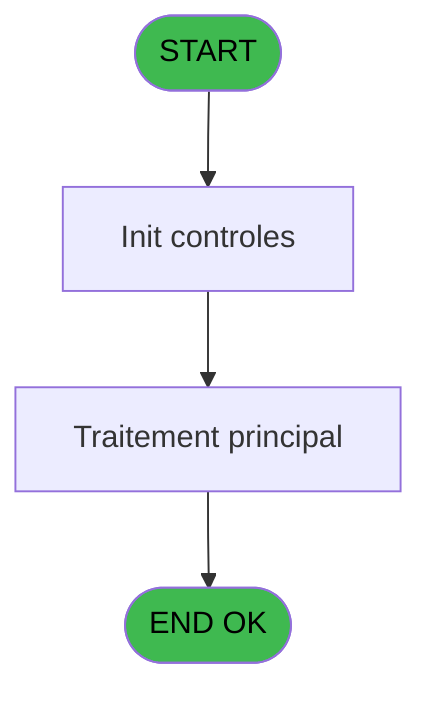
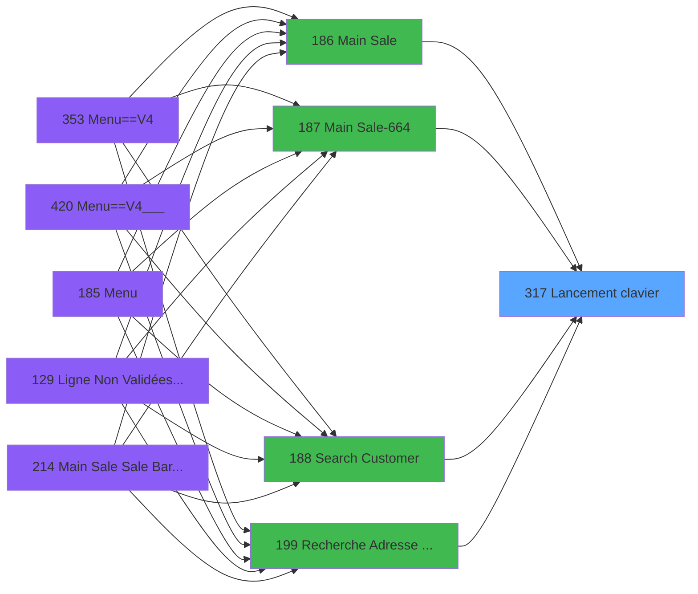

# PVE IDE 317 - Lancement clavier

> **Analyse**: Phases 1-4 2026-02-03 19:33 -> 19:34 (11s) | Assemblage 19:34
> **Pipeline**: V7.2 Enrichi
> **Structure**: 4 onglets (Resume | Ecrans | Donnees | Connexions)

<!-- TAB:Resume -->

## 1. FICHE D'IDENTITE

| Attribut | Valeur |
|----------|--------|
| Projet | PVE |
| IDE Position | 317 |
| Nom Programme | Lancement clavier |
| Fichier source | `Prg_317.xml` |
| Dossier IDE | Utilitaires |
| Taches | 1 (0 ecrans visibles) |
| Tables modifiees | 0 |
| Programmes appeles | 0 |

## 2. DESCRIPTION FONCTIONNELLE

**Lancement clavier** assure la gestion complete de ce processus, accessible depuis [Main Sale (IDE 186)](PVE-IDE-186.md), [Main Sale-664 (IDE 187)](PVE-IDE-187.md), [Main Sale Sale Bar Code (IDE 214)](PVE-IDE-214.md), [Main Sale (IDE 363)](PVE-IDE-363.md), [Main Sale-664 (IDE 364)](PVE-IDE-364.md), [Menu Main (TPE) (IDE 403)](PVE-IDE-403.md), [Main Sale ===V4 Booking ACTUEL (IDE 417)](PVE-IDE-417.md), [Main Sale (IDE 440)](PVE-IDE-440.md), [Main Sale ===V4 (IDE 0)](PVE-IDE-0.md), [Main Sale ===V4 (IDE 354)](PVE-IDE-354.md), [Main Sale ===V4 (IDE 359)](PVE-IDE-359.md), [Main Sale ===V4 (IDE 409)](PVE-IDE-409.md), [Main Sale ===V4 (IDE 415)](PVE-IDE-415.md), [Search Customer (IDE 188)](PVE-IDE-188.md), [Search Customer==V4 (IDE 355)](PVE-IDE-355.md), [Search Customer==V4 (IDE 412)](PVE-IDE-412.md), [Search Customer==V4 (IDE 425)](PVE-IDE-425.md), [Recherche Adresse Mail (IDE 199)](PVE-IDE-199.md), [Saisie commentaire (IDE 200)](PVE-IDE-200.md), [Discounts (IDE 201)](PVE-IDE-201.md).

Le flux de traitement s'organise en **1 blocs fonctionnels** :

- **Traitement** (1 tache) : traitements metier divers

## 3. BLOCS FONCTIONNELS

### 3.1 Traitement (1 tache)

Traitements internes.

---

#### 317 - Lancement clavier

**Role** : Traitement : Lancement clavier.

## 5. REGLES METIER

*(Aucune regle metier identifiee)*

## 6. CONTEXTE

- **Appele par**: [Main Sale (IDE 186)](PVE-IDE-186.md), [Main Sale-664 (IDE 187)](PVE-IDE-187.md), [Main Sale Sale Bar Code (IDE 214)](PVE-IDE-214.md), [Main Sale (IDE 363)](PVE-IDE-363.md), [Main Sale-664 (IDE 364)](PVE-IDE-364.md), [Menu Main (TPE) (IDE 403)](PVE-IDE-403.md), [Main Sale ===V4 Booking ACTUEL (IDE 417)](PVE-IDE-417.md), [Main Sale (IDE 440)](PVE-IDE-440.md), [Main Sale ===V4 (IDE 0)](PVE-IDE-0.md), [Main Sale ===V4 (IDE 354)](PVE-IDE-354.md), [Main Sale ===V4 (IDE 359)](PVE-IDE-359.md), [Main Sale ===V4 (IDE 409)](PVE-IDE-409.md), [Main Sale ===V4 (IDE 415)](PVE-IDE-415.md), [Search Customer (IDE 188)](PVE-IDE-188.md), [Search Customer==V4 (IDE 355)](PVE-IDE-355.md), [Search Customer==V4 (IDE 412)](PVE-IDE-412.md), [Search Customer==V4 (IDE 425)](PVE-IDE-425.md), [Recherche Adresse Mail (IDE 199)](PVE-IDE-199.md), [Saisie commentaire (IDE 200)](PVE-IDE-200.md), [Discounts (IDE 201)](PVE-IDE-201.md)
- **Appelle**: 0 programmes | **Tables**: 0 (W:0 R:0 L:0) | **Taches**: 1 | **Expressions**: 0

<!-- TAB:Ecrans -->

## 8. ECRANS

*(Programme sans ecran visible)*

## 9. NAVIGATION

### 9.3 Structure hierarchique (1 tache)

| Position | Tache | Type | Dimensions | Bloc |
|----------|-------|------|------------|------|
| **317.1** | [**Lancement clavier** (317)](#t1) | - | - | Traitement |

### 9.4 Algorigramme

> **Legende**: Vert = START/END OK | Rouge = END KO | Bleu = Decisions
> *Algorigramme auto-genere. Utiliser `/algorigramme` pour une synthese metier detaillee.*

<!-- TAB:Donnees -->

## 10. TABLES

### Tables utilisees (0)

| ID | Nom | Description | Type | R | W | L | Usages |
|----|-----|-------------|------|---|---|---|--------|

### Colonnes par table (0 / 0 tables avec colonnes identifiees)

## 11. VARIABLES

*(Programme sans variables locales mappees)*

## 12. EXPRESSIONS

**0 / 0 expressions decodees (0%)**

### 12.1 Repartition par type

| Type | Expressions | Regles |
|------|-------------|--------|

### 12.2 Expressions cles par type

<!-- TAB:Connexions -->

## 13. GRAPHE D'APPELS

### 13.1 Chaine depuis Main (Callers)

Main -> ... -> [Main Sale (IDE 186)](PVE-IDE-186.md) -> **Lancement clavier (IDE 317)**

Main -> ... -> [Main Sale-664 (IDE 187)](PVE-IDE-187.md) -> **Lancement clavier (IDE 317)**

Main -> ... -> [Main Sale Sale Bar Code (IDE 214)](PVE-IDE-214.md) -> **Lancement clavier (IDE 317)**

Main -> ... -> [Main Sale (IDE 363)](PVE-IDE-363.md) -> **Lancement clavier (IDE 317)**

Main -> ... -> [Main Sale-664 (IDE 364)](PVE-IDE-364.md) -> **Lancement clavier (IDE 317)**

Main -> ... -> [Menu Main (TPE) (IDE 403)](PVE-IDE-403.md) -> **Lancement clavier (IDE 317)**

Main -> ... -> [Main Sale ===V4 Booking ACTUEL (IDE 417)](PVE-IDE-417.md) -> **Lancement clavier (IDE 317)**

Main -> ... -> [Main Sale (IDE 440)](PVE-IDE-440.md) -> **Lancement clavier (IDE 317)**

Main -> ... -> [Main Sale ===V4 (IDE 0)](PVE-IDE-0.md) -> **Lancement clavier (IDE 317)**

Main -> ... -> [Main Sale ===V4 (IDE 354)](PVE-IDE-354.md) -> **Lancement clavier (IDE 317)**

Main -> ... -> [Main Sale ===V4 (IDE 359)](PVE-IDE-359.md) -> **Lancement clavier (IDE 317)**

Main -> ... -> [Main Sale ===V4 (IDE 409)](PVE-IDE-409.md) -> **Lancement clavier (IDE 317)**

Main -> ... -> [Main Sale ===V4 (IDE 415)](PVE-IDE-415.md) -> **Lancement clavier (IDE 317)**

Main -> ... -> [Search Customer (IDE 188)](PVE-IDE-188.md) -> **Lancement clavier (IDE 317)**

Main -> ... -> [Search Customer==V4 (IDE 355)](PVE-IDE-355.md) -> **Lancement clavier (IDE 317)**

Main -> ... -> [Search Customer==V4 (IDE 412)](PVE-IDE-412.md) -> **Lancement clavier (IDE 317)**

Main -> ... -> [Search Customer==V4 (IDE 425)](PVE-IDE-425.md) -> **Lancement clavier (IDE 317)**

Main -> ... -> [Recherche Adresse Mail (IDE 199)](PVE-IDE-199.md) -> **Lancement clavier (IDE 317)**

Main -> ... -> [Saisie commentaire (IDE 200)](PVE-IDE-200.md) -> **Lancement clavier (IDE 317)**

Main -> ... -> [Discounts (IDE 201)](PVE-IDE-201.md) -> **Lancement clavier (IDE 317)**

### 13.2 Callers

| IDE | Nom Programme | Nb Appels |
|-----|---------------|-----------|
| [186](PVE-IDE-186.md) | Main Sale | 6 |
| [187](PVE-IDE-187.md) | Main Sale-664 | 6 |
| [214](PVE-IDE-214.md) | Main Sale Sale Bar Code | 6 |
| [363](PVE-IDE-363.md) | Main Sale | 6 |
| [364](PVE-IDE-364.md) | Main Sale-664 | 6 |
| [403](PVE-IDE-403.md) | Menu Main (TPE) | 6 |
| [417](PVE-IDE-417.md) | Main Sale ===V4 Booking ACTUEL | 6 |
| [440](PVE-IDE-440.md) | Main Sale | 6 |
| [0](PVE-IDE-0.md) | Main Sale ===V4 | 4 |
| [354](PVE-IDE-354.md) | Main Sale ===V4 | 4 |
| [359](PVE-IDE-359.md) | Main Sale ===V4 | 4 |
| [409](PVE-IDE-409.md) | Main Sale ===V4 | 4 |
| [415](PVE-IDE-415.md) | Main Sale ===V4 | 4 |
| [188](PVE-IDE-188.md) | Search Customer | 3 |
| [355](PVE-IDE-355.md) | Search Customer==V4 | 3 |
| [412](PVE-IDE-412.md) | Search Customer==V4 | 3 |
| [425](PVE-IDE-425.md) | Search Customer==V4 | 3 |
| [199](PVE-IDE-199.md) | Recherche Adresse Mail | 1 |
| [200](PVE-IDE-200.md) | Saisie commentaire | 1 |
| [201](PVE-IDE-201.md) | Discounts | 1 |

### 13.3 Callees (programmes appeles)

### 13.4 Detail Callees avec contexte

| IDE | Nom Programme | Appels | Contexte |
|-----|---------------|--------|----------|
| - | (aucun) | - | - |

## 14. RECOMMANDATIONS MIGRATION

### 14.1 Profil du programme

| Metrique | Valeur | Impact migration |
|----------|--------|-----------------|
| Lignes de logique | 2 | Programme compact |
| Expressions | 0 | Peu de logique |
| Tables WRITE | 0 | Impact faible |
| Sous-programmes | 0 | Peu de dependances |
| Ecrans visibles | 0 | Ecran unique ou traitement batch |
| Code desactive | 0% (0 / 2) | Code sain |
| Regles metier | 0 | Pas de regle identifiee |

### 14.2 Plan de migration par bloc

#### Traitement (1 tache: 0 ecran, 1 traitement)

- **Strategie** : 1 service(s) backend injectable(s) (Domain Services).
- Decomposer les taches en services unitaires testables.

### 14.3 Dependances critiques

| Dependance | Type | Appels | Impact |
|------------|------|--------|--------|

---
*Spec DETAILED generee par Pipeline V7.2 - 2026-02-03 19:34*
