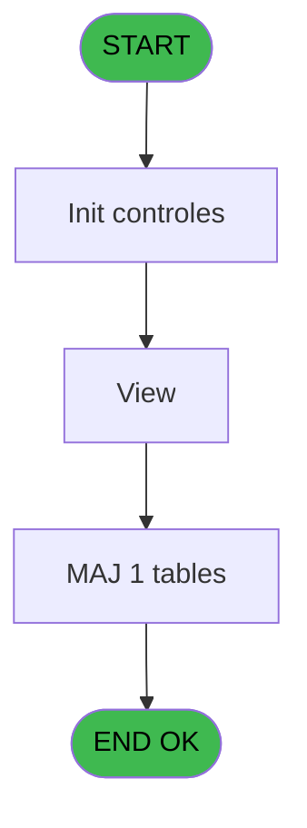
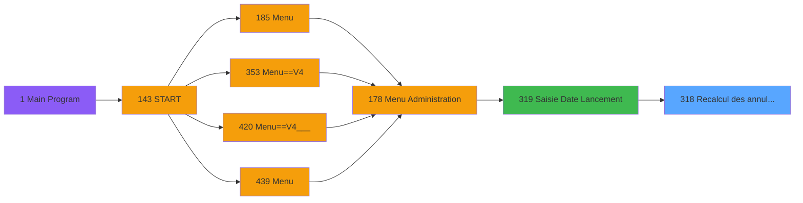

# PVE IDE 318 - Recalcul des annulations

> **Analyse**: Phases 1-4 2026-02-03 19:34 -> 19:34 (12s) | Assemblage 19:34
> **Pipeline**: V7.2 Enrichi
> **Structure**: 4 onglets (Resume | Ecrans | Donnees | Connexions)

<!-- TAB:Resume -->

## 1. FICHE D'IDENTITE

| Attribut | Valeur |
|----------|--------|
| Projet | PVE |
| IDE Position | 318 |
| Nom Programme | Recalcul des annulations |
| Fichier source | `Prg_318.xml` |
| Dossier IDE | Utilitaires |
| Taches | 4 (1 ecrans visibles) |
| Tables modifiees | 1 |
| Programmes appeles | 0 |

## 2. DESCRIPTION FONCTIONNELLE

**Recalcul des annulations** assure la gestion complete de ce processus, accessible depuis [Saisie Date Lancement (IDE 319)](PVE-IDE-319.md).

Le flux de traitement s'organise en **1 blocs fonctionnels** :

- **Traitement** (4 taches) : traitements metier divers

**Donnees modifiees** : 1 tables en ecriture (compte_gm________cgm).

**Logique metier** : 1 regles identifiees couvrant conditions metier.

Detail : phases du traitement

#### Phase 1 : Traitement (4 taches)

- **318** - Création d'un O.D **[[ECRAN]](#ecran-t1)**
- **318.1** - credit 18 **[[ECRAN]](#ecran-t2)**
- **318.2** - credit 18 **[[ECRAN]](#ecran-t3)**
- **318.3** - View **[[ECRAN]](#ecran-t4)**

#### Tables impactees

| Table | Operations | Role metier |
|-------|-----------|-------------|
| compte_gm________cgm | **W** (2 usages) | Comptes GM (generaux) |

## 3. BLOCS FONCTIONNELS

### 3.1 Traitement (4 taches)

Traitements internes.

---

#### 318 - Création d'un O.D [[ECRAN]](#ecran-t1)

**Role** : Traitement : Création d'un O.D.
**Ecran** : 1170 x 229 DLU (MDI) | [Voir mockup](#ecran-t1)

3 sous-taches directes

| Tache | Nom | Bloc |
|-------|-----|------|
| [318.1](#t2) | credit 18 **[[ECRAN]](#ecran-t2)** | Traitement |
| [318.2](#t3) | credit 18 **[[ECRAN]](#ecran-t3)** | Traitement |
| [318.3](#t4) | View **[[ECRAN]](#ecran-t4)** | Traitement |

---

#### 318.1 - credit 18 [[ECRAN]](#ecran-t2)

**Role** : Calcul fidelite/avantage : credit 18.
**Ecran** : 377 x 144 DLU (MDI) | [Voir mockup](#ecran-t2)

---

#### 318.2 - credit 18 [[ECRAN]](#ecran-t3)

**Role** : Calcul fidelite/avantage : credit 18.
**Ecran** : 377 x 144 DLU (MDI) | [Voir mockup](#ecran-t3)

---

#### 318.3 - View [[ECRAN]](#ecran-t4)

**Role** : Traitement : View.
**Ecran** : 662 x 486 DLU | [Voir mockup](#ecran-t4)

## 5. REGLES METIER

1 regles identifiees:

### Autres (1 regles)

#### [RM-001] Si [U]='RETURN-' alors [BL] sinon [BG]-[M]+1)

| Element | Detail |
|---------|--------|
| **Condition** | `[U]='RETURN-'` |
| **Si vrai** | [BL] |
| **Si faux** | [BG]-[M]+1) |
| **Expression source** | Expression 7 : `IF ([U]='RETURN-',[BL],[BG]-[M]+1)` |
| **Exemple** | Si [U]='RETURN-' → [BL]. Sinon → [BG]-[M]+1) |

## 6. CONTEXTE

- **Appele par**: [Saisie Date Lancement (IDE 319)](PVE-IDE-319.md)
- **Appelle**: 0 programmes | **Tables**: 11 (W:1 R:1 L:9) | **Taches**: 4 | **Expressions**: 31

<!-- TAB:Ecrans -->

## 8. ECRANS

### 8.1 Forms visibles (1 / 4)

| # | Position | Tache | Nom | Type | Largeur | Hauteur | Bloc |
|---|----------|-------|-----|------|---------|---------|------|
| 1 | 318.3 | 318.3 | View | Type0 | 662 | 486 | Traitement |

### 8.2 Mockups Ecrans

## 9. NAVIGATION

Ecran unique: **View**

### 9.3 Structure hierarchique (4 taches)

| Position | Tache | Type | Dimensions | Bloc |
|----------|-------|------|------------|------|
| **318.1** | [**Création d'un O.D** (318)](#t1) [mockup](#ecran-t1) | MDI | 1170x229 | Traitement |
| 318.1.1 | [credit 18 (318.1)](#t2) [mockup](#ecran-t2) | MDI | 377x144 | |
| 318.1.2 | [credit 18 (318.2)](#t3) [mockup](#ecran-t3) | MDI | 377x144 | |
| 318.1.3 | [View (318.3)](#t4) [mockup](#ecran-t4) | - | 662x486 | |

### 9.4 Algorigramme

> **Legende**: Vert = START/END OK | Rouge = END KO | Bleu = Decisions
> *Algorigramme auto-genere. Utiliser `/algorigramme` pour une synthese metier detaillee.*

<!-- TAB:Donnees -->

## 10. TABLES

### Tables utilisees (11)

| ID | Nom | Description | Type | R | W | L | Usages |
|----|-----|-------------|------|---|---|---|--------|
| 40 | comptable________cte |  | DB |   |   | L | 2 |
| 47 | compte_gm________cgm | Comptes GM (generaux) | DB |   | **W** |   | 2 |
| 67 | tables___________tab |  | DB | R |   |   | 1 |
| 77 | articles_________art | Articles et stock | DB |   |   | L | 2 |
| 312 | ez_card |  | DB |   |   | L | 1 |
| 382 | pv_discount_reasons |  | DB |   |   | L | 1 |
| 400 | pv_cust_rentals |  | DB |   |   | L | 1 |
| 403 | pv_sellers |  | DB |   |   | L | 1 |
| 404 | pv_sellers_by_week |  | DB |   |   | L | 1 |
| 413 | pv_tva |  | DB |   |   | L | 3 |
| 418 | pv_years |  | DB |   |   | L | 1 |

### Colonnes par table (1 / 2 tables avec colonnes identifiees)

Table 47 - compte_gm________cgm (**W**) - 2 usages

*Table utilisee uniquement en Link ou aucune colonne Real identifiee dans le DataView.*

Table 67 - tables___________tab (R) - 1 usages

| Lettre | Variable | Acces | Type |
|--------|----------|-------|------|
| A | P.Accounting Date Tested Begin | R | Date |
| B | P.Accounting Date Tested End | R | Date |
| C | P.Accounting Date for Sales | R | Date |
| D | ----------------package OUT | R | Alpha |
| E | --- paiement to take | R | Alpha |
| F | ----------------package IN | R | Alpha |
| G | L.Retour Equip non affect | R | Logical |
| H | v.Lien Club Med Pass | R | Logical |
| I | v.Lien VSERV | R | Logical |

## 11. VARIABLES

### 11.1 Parametres entrants (3)

Variables recues du programme appelant ([Saisie Date Lancement (IDE 319)](PVE-IDE-319.md)).

| Lettre | Nom | Type | Usage dans |
|--------|-----|------|-----------|
| A | P.Accounting Date Tested Begin | Date | - |
| B | P.Accounting Date Tested End | Date | - |
| C | P.Accounting Date for Sales | Date | - |

### 11.2 Variables de session (2)

Variables persistantes pendant toute la session.

| Lettre | Nom | Type | Usage dans |
|--------|-----|------|-----------|
| H | v.Lien Club Med Pass | Logical | - |
| I | v.Lien VSERV | Logical | - |

### 11.3 Autres (4)

Variables diverses.

| Lettre | Nom | Type | Usage dans |
|--------|-----|------|-----------|
| D | ----------------package OUT | Alpha | - |
| E | --- paiement to take | Alpha | 1x refs |
| F | ----------------package IN | Alpha | - |
| G | L.Retour Equip non affect | Logical | - |

## 12. EXPRESSIONS

**31 / 31 expressions decodees (100%)**

### 12.1 Repartition par type

| Type | Expressions | Regles |
|------|-------------|--------|
| CONDITION | 2 | 5 |
| CONSTANTE | 6 | 0 |
| OTHER | 20 | 0 |
| CAST_LOGIQUE | 1 | 0 |
| NEGATION | 1 | 0 |
| REFERENCE_VG | 1 | 0 |

### 12.2 Expressions cles par type

#### CONDITION (2 expressions)

| Type | IDE | Expression | Regle |
|------|-----|------------|-------|
| CONDITION | 7 | `IF ([U]='RETURN-',[BL],[BG]-[M]+1)` | [RM-001](#rm-RM-001) |
| CONDITION | 28 | `[U]<>'CANCEL' AND NOT(IN([U],'SALE','RENTAL'))` | - |

#### CONSTANTE (6 expressions)

| Type | IDE | Expression | Regle |
|------|-----|------------|-------|
| CONSTANTE | 20 | `'VSERV'` | - |
| CONSTANTE | 24 | `1` | - |
| CONSTANTE | 29 | `'CLUBMED PASS'` | - |
| CONSTANTE | 12 | `''` | - |
| CONSTANTE | 15 | `1` | - |
| ... | | *+1 autres* | |

#### OTHER (20 expressions)

| Type | IDE | Expression | Regle |
|------|-----|------------|-------|
| OTHER | 17 | `[AS]` | - |
| OTHER | 18 | `[AT]` | - |
| OTHER | 16 | `[AR]` | - |
| OTHER | 13 | `[N]` | - |
| OTHER | 14 | `[O]` | - |
| ... | | *+15 autres* | |

#### CAST_LOGIQUE (1 expressions)

| Type | IDE | Expression | Regle |
|------|-----|------------|-------|
| CAST_LOGIQUE | 25 | `'TRUE'LOG` | - |

#### NEGATION (1 expressions)

| Type | IDE | Expression | Regle |
|------|-----|------------|-------|
| NEGATION | 30 | `NOT VG104` | - |

#### REFERENCE_VG (1 expressions)

| Type | IDE | Expression | Regle |
|------|-----|------------|-------|
| REFERENCE_VG | 31 | `VG104` | - |

### 12.3 Toutes les expressions (31)

Voir les 31 expressions

#### CONDITION (2)

| IDE | Expression Decodee |
|-----|-------------------|
| 7 | `IF ([U]='RETURN-',[BL],[BG]-[M]+1)` |
| 28 | `[U]<>'CANCEL' AND NOT(IN([U],'SALE','RENTAL'))` |

#### CONSTANTE (6)

| IDE | Expression Decodee |
|-----|-------------------|
| 12 | `''` |
| 15 | `1` |
| 19 | `'V'` |
| 20 | `'VSERV'` |
| 24 | `1` |
| 29 | `'CLUBMED PASS'` |

#### OTHER (20)

| IDE | Expression Decodee |
|-----|-------------------|
| 1 | `GetParam ('SERVICE')` |
| 2 | `--- paiement to take [E]` |
| 3 | `----------------packag... [F]` |
| 4 | `[AA]` |
| 5 | `[BH]` |
| 6 | `[BI]` |
| 8 | `[L]` |
| 9 | `[BN]` |
| 10 | `[U]` |
| 11 | `[K]` |
| 13 | `[N]` |
| 14 | `[O]` |
| 16 | `[AR]` |
| 17 | `[AS]` |
| 18 | `[AT]` |
| 21 | `[N]` |
| 22 | `[O]` |
| 23 | `[T]` |
| 26 | `P.Accounting Date Test... [A]` |
| 27 | `P.Accounting Date Test... [B]` |

#### CAST_LOGIQUE (1)

| IDE | Expression Decodee |
|-----|-------------------|
| 25 | `'TRUE'LOG` |

#### NEGATION (1)

| IDE | Expression Decodee |
|-----|-------------------|
| 30 | `NOT VG104` |

#### REFERENCE_VG (1)

| IDE | Expression Decodee |
|-----|-------------------|
| 31 | `VG104` |

<!-- TAB:Connexions -->

## 13. GRAPHE D'APPELS

### 13.1 Chaine depuis Main (Callers)

Main -> ... -> [Saisie Date Lancement (IDE 319)](PVE-IDE-319.md) -> **Recalcul des annulations (IDE 318)**

### 13.2 Callers

| IDE | Nom Programme | Nb Appels |
|-----|---------------|-----------|
| [319](PVE-IDE-319.md) | Saisie Date Lancement | 1 |

### 13.3 Callees (programmes appeles)

### 13.4 Detail Callees avec contexte

| IDE | Nom Programme | Appels | Contexte |
|-----|---------------|--------|----------|
| - | (aucun) | - | - |

## 14. RECOMMANDATIONS MIGRATION

### 14.1 Profil du programme

| Metrique | Valeur | Impact migration |
|----------|--------|-----------------|
| Lignes de logique | 314 | Taille moyenne |
| Expressions | 31 | Peu de logique |
| Tables WRITE | 1 | Impact faible |
| Sous-programmes | 0 | Peu de dependances |
| Ecrans visibles | 1 | Ecran unique ou traitement batch |
| Code desactive | 3.8% (12 / 314) | Code sain |
| Regles metier | 1 | Quelques regles a preserver |

### 14.2 Plan de migration par bloc

#### Traitement (4 taches: 4 ecrans, 0 traitement)

- **Strategie** : 4 composant(s) UI (Razor/React) avec formulaires et validation.
- Decomposer les taches en services unitaires testables.

### 14.3 Dependances critiques

| Dependance | Type | Appels | Impact |
|------------|------|--------|--------|
| compte_gm________cgm | Table WRITE (Database) | 2x | Schema + repository |

---
*Spec DETAILED generee par Pipeline V7.2 - 2026-02-03 19:34*
