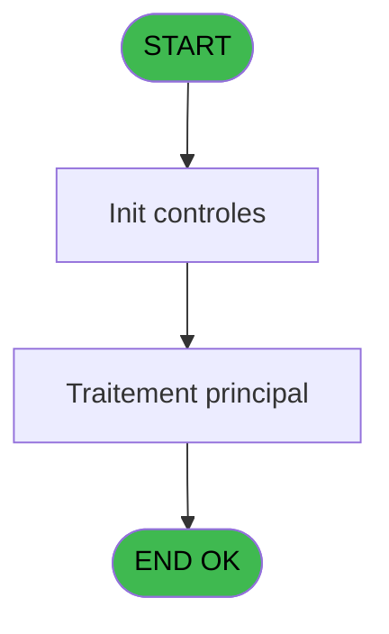
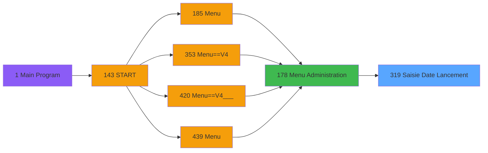

# PVE IDE 319 - Saisie Date Lancement

> **Analyse**: Phases 1-4 2026-02-03 19:34 -> 19:34 (11s) | Assemblage 19:34
> **Pipeline**: V7.2 Enrichi
> **Structure**: 4 onglets (Resume | Ecrans | Donnees | Connexions)

<!-- TAB:Resume -->

## 1. FICHE D'IDENTITE

| Attribut | Valeur |
|----------|--------|
| Projet | PVE |
| IDE Position | 319 |
| Nom Programme | Saisie Date Lancement |
| Fichier source | `Prg_319.xml` |
| Dossier IDE | Utilitaires |
| Taches | 1 (1 ecrans visibles) |
| Tables modifiees | 0 |
| Programmes appeles | 1 |

## 2. DESCRIPTION FONCTIONNELLE

**Saisie Date Lancement** assure la gestion complete de ce processus, accessible depuis [Menu Administration (IDE 178)](PVE-IDE-178.md).

Le flux de traitement s'organise en **1 blocs fonctionnels** :

- **Traitement** (1 tache) : traitements metier divers

## 3. BLOCS FONCTIONNELS

### 3.1 Traitement (1 tache)

Traitements internes.

---

#### 319 - Accounting Date [[ECRAN]](#ecran-t1)

**Role** : Traitement : Accounting Date.
**Ecran** : 440 x 136 DLU (Type6) | [Voir mockup](#ecran-t1)
**Variables liees** : A (Accounting Date), B (Accounting Date End)

## 5. REGLES METIER

*(Aucune regle metier identifiee)*

## 6. CONTEXTE

- **Appele par**: [Menu Administration (IDE 178)](PVE-IDE-178.md)
- **Appelle**: 1 programmes | **Tables**: 1 (W:0 R:1 L:0) | **Taches**: 1 | **Expressions**: 4

<!-- TAB:Ecrans -->

## 8. ECRANS

### 8.1 Forms visibles (1 / 1)

| # | Position | Tache | Nom | Type | Largeur | Hauteur | Bloc |
|---|----------|-------|-----|------|---------|---------|------|
| 1 | 319 | 319 | Accounting Date | Type6 | 440 | 136 | Traitement |

### 8.2 Mockups Ecrans

---

#### 319 - Accounting Date
**Tache** : [319](#t1) | **Type** : Type6 | **Dimensions** : 440 x 136 DLU
**Bloc** : Traitement | **Titre IDE** : Accounting Date

<!-- FORM-DATA:
{
    "width":  440,
    "vFactor":  8,
    "type":  "Type6",
    "hFactor":  4,
    "controls":  [
                     {
                         "x":  41,
                         "type":  "label",
                         "var":  "",
                         "y":  59,
                         "w":  38,
                         "fmt":  "",
                         "name":  "",
                         "h":  19,
                         "color":  "187",
                         "text":  "From",
                         "parent":  null
                     },
                     {
                         "x":  235,
                         "type":  "label",
                         "var":  "",
                         "y":  59,
                         "w":  38,
                         "fmt":  "",
                         "name":  "",
                         "h":  19,
                         "color":  "187",
                         "text":  "To",
                         "parent":  null
                     },
                     {
                         "x":  4,
                         "type":  "label",
                         "var":  "",
                         "y":  102,
                         "w":  434,
                         "fmt":  "",
                         "name":  "",
                         "h":  32,
                         "color":  "6",
                         "text":  "",
                         "parent":  null
                     },
                     {
                         "x":  4,
                         "type":  "label",
                         "var":  "",
                         "y":  0,
                         "w":  434,
                         "fmt":  "",
                         "name":  "",
                         "h":  42,
                         "color":  "186",
                         "text":  "",
                         "parent":  null
                     },
                     {
                         "x":  14,
                         "type":  "label",
                         "var":  "",
                         "y":  10,
                         "w":  235,
                         "fmt":  "",
                         "name":  "",
                         "h":  22,
                         "color":  "186",
                         "text":  "Enter the accounting date \r\n",
                         "parent":  6
                     },
                     {
                         "x":  389,
                         "type":  "image",
                         "var":  "",
                         "y":  4,
                         "w":  48,
                         "fmt":  "",
                         "name":  "",
                         "h":  37,
                         "color":  "",
                         "text":  "",
                         "parent":  8
                     },
                     {
                         "x":  109,
                         "type":  "edit",
                         "var":  "",
                         "y":  59,
                         "w":  96,
                         "fmt":  "",
                         "name":  "Comment",
                         "h":  19,
                         "color":  "110",
                         "text":  "",
                         "parent":  null
                     },
                     {
                         "x":  304,
                         "type":  "edit",
                         "var":  "",
                         "y":  59,
                         "w":  96,
                         "fmt":  "",
                         "name":  "Accounting Date End_0001",
                         "h":  19,
                         "color":  "110",
                         "text":  "",
                         "parent":  null
                     },
                     {
                         "x":  8,
                         "type":  "button",
                         "var":  "",
                         "y":  107,
                         "w":  121,
                         "fmt":  "\u0026Exit",
                         "name":  "",
                         "h":  24,
                         "color":  "",
                         "text":  "",
                         "parent":  5
                     },
                     {
                         "x":  316,
                         "type":  "button",
                         "var":  "",
                         "y":  107,
                         "w":  121,
                         "fmt":  "\u0026OK",
                         "name":  "OK",
                         "h":  24,
                         "color":  "",
                         "text":  "",
                         "parent":  5
                     }
                 ],
    "taskId":  "319",
    "height":  136
}
-->

<strong>Champs : 2 champs</strong>

| Pos (x,y) | Nom | Variable | Type |
|-----------|-----|----------|------|
| 109,59 | Comment | - | edit |
| 304,59 | Accounting Date End_0001 | - | edit |

<strong>Boutons : 2 boutons</strong>

| Bouton | Pos (x,y) | Action |
|--------|-----------|--------|
| Exit | 8,107 | Quitte le programme |
| OK | 316,107 | Valide la saisie et enregistre |

## 9. NAVIGATION

Ecran unique: **Accounting Date**

### 9.3 Structure hierarchique (1 tache)

| Position | Tache | Type | Dimensions | Bloc |
|----------|-------|------|------------|------|
| **319.1** | [**Accounting Date** (319)](#t1) [mockup](#ecran-t1) | Type6 | 440x136 | Traitement |

### 9.4 Algorigramme

> **Legende**: Vert = START/END OK | Rouge = END KO | Bleu = Decisions
> *Algorigramme auto-genere. Utiliser `/algorigramme` pour une synthese metier detaillee.*

<!-- TAB:Donnees -->

## 10. TABLES

### Tables utilisees (1)

| ID | Nom | Description | Type | R | W | L | Usages |
|----|-----|-------------|------|---|---|---|--------|
| 70 | date_comptable___dat |  | DB | R |   |   | 1 |

### Colonnes par table (1 / 1 tables avec colonnes identifiees)

Table 70 - date_comptable___dat (R) - 1 usages

| Lettre | Variable | Acces | Type |
|--------|----------|-------|------|
| A | Accounting Date | R | Date |
| B | Accounting Date End | R | Date |
| C | B Ok | R | Alpha |

## 11. VARIABLES

### 11.1 Autres (3)

Variables diverses.

| Lettre | Nom | Type | Usage dans |
|--------|-----|------|-----------|
| A | Accounting Date | Date | [319](#t1) |
| B | Accounting Date End | Date | - |
| C | B Ok | Alpha | - |

## 12. EXPRESSIONS

**4 / 4 expressions decodees (100%)**

### 12.1 Repartition par type

| Type | Expressions | Regles |
|------|-------------|--------|
| CONSTANTE | 1 | 0 |
| DATE | 2 | 0 |
| CONDITION | 1 | 0 |

### 12.2 Expressions cles par type

#### CONSTANTE (1 expressions)

| Type | IDE | Expression | Regle |
|------|-----|------------|-------|
| CONSTANTE | 2 | `'C'` | - |

#### DATE (2 expressions)

| Type | IDE | Expression | Regle |
|------|-----|------------|-------|
| DATE | 4 | `Date()-1` | - |
| DATE | 3 | `Date()-DOW(Date())+1` | - |

#### CONDITION (1 expressions)

| Type | IDE | Expression | Regle |
|------|-----|------------|-------|
| CONDITION | 1 | `Accounting Date [A]=0` | - |

<!-- TAB:Connexions -->

## 13. GRAPHE D'APPELS

### 13.1 Chaine depuis Main (Callers)

Main -> ... -> [Menu Administration (IDE 178)](PVE-IDE-178.md) -> **Saisie Date Lancement (IDE 319)**

### 13.2 Callers

| IDE | Nom Programme | Nb Appels |
|-----|---------------|-----------|
| [178](PVE-IDE-178.md) | Menu Administration | 1 |

### 13.3 Callees (programmes appeles)

### 13.4 Detail Callees avec contexte

| IDE | Nom Programme | Appels | Contexte |
|-----|---------------|--------|----------|
| [318](PVE-IDE-318.md) | Recalcul des annulations | 1 | Calcul de donnees |

## 14. RECOMMANDATIONS MIGRATION

### 14.1 Profil du programme

| Metrique | Valeur | Impact migration |
|----------|--------|-----------------|
| Lignes de logique | 12 | Programme compact |
| Expressions | 4 | Peu de logique |
| Tables WRITE | 0 | Impact faible |
| Sous-programmes | 1 | Peu de dependances |
| Ecrans visibles | 1 | Ecran unique ou traitement batch |
| Code desactive | 0% (0 / 12) | Code sain |
| Regles metier | 0 | Pas de regle identifiee |

### 14.2 Plan de migration par bloc

#### Traitement (1 tache: 1 ecran, 0 traitement)

- **Strategie** : 1 composant(s) UI (Razor/React) avec formulaires et validation.
- 1 sous-programme(s) a migrer ou a reutiliser depuis les services existants.
- Decomposer les taches en services unitaires testables.

### 14.3 Dependances critiques

| Dependance | Type | Appels | Impact |
|------------|------|--------|--------|
| [Recalcul des annulations (IDE 318)](PVE-IDE-318.md) | Sous-programme | 1x | Normale - Calcul de donnees |

---
*Spec DETAILED generee par Pipeline V7.2 - 2026-02-03 19:34*
