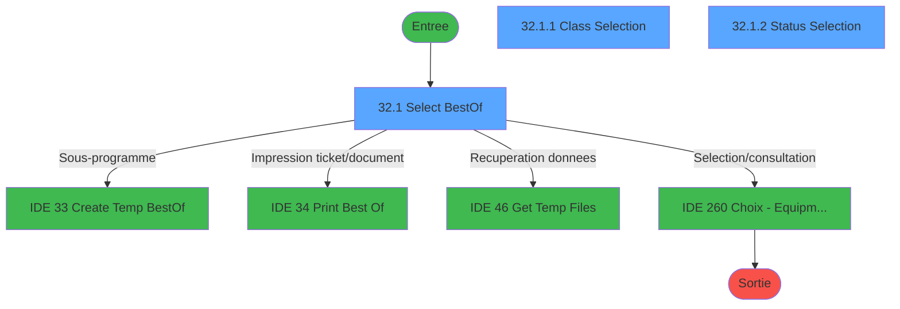
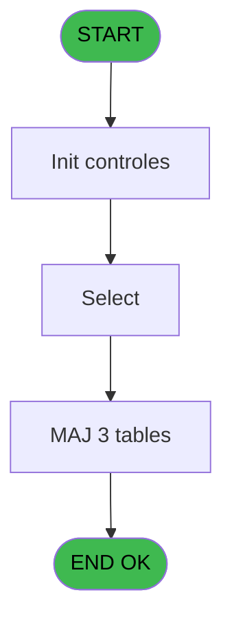
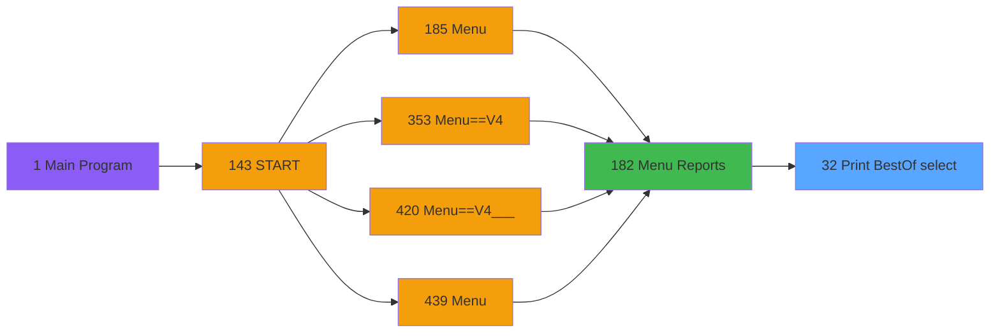
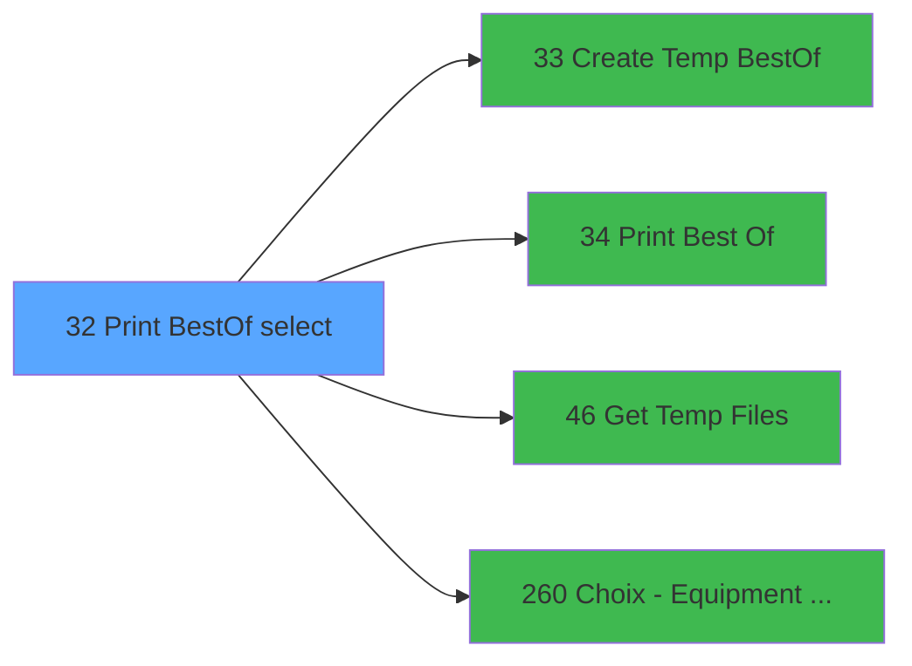

# PVE IDE 32 - Print BestOf (select)

> **Analyse**: Phases 1-4 2026-02-03 01:19 -> 01:19 (35s) | Assemblage 01:19
> **Pipeline**: V7.2 Enrichi
> **Structure**: 4 onglets (Resume | Ecrans | Donnees | Connexions)

<!-- TAB:Resume -->

## 1. FICHE D'IDENTITE

| Attribut | Valeur |
|----------|--------|
| Projet | PVE |
| IDE Position | 32 |
| Nom Programme | Print BestOf (select) |
| Fichier source | `Prg_32.xml` |
| Domaine metier | Impression |
| Taches | 10 (3 ecrans visibles) |
| Tables modifiees | 3 |
| Programmes appeles | 4 |

## 2. DESCRIPTION FONCTIONNELLE

**Print BestOf (select)** assure la gestion complete de ce processus, accessible depuis [Menu Reports (IDE 182)](PVE-IDE-182.md).

Le flux de traitement s'organise en **3 blocs fonctionnels** :

- **Consultation** (5 taches) : ecrans de recherche, selection et consultation
- **Traitement** (3 taches) : traitements metier divers
- **Creation** (2 taches) : insertion d'enregistrements en base (mouvements, prestations)

**Donnees modifiees** : 3 tables en ecriture (pv_package_price, update_table_ensemble, edition_cloture_service).

Detail : phases du traitement

#### Phase 1 : Consultation (5 taches)

- **32** - Select Equipment / Status **[[ECRAN]](#ecran-t1)**
- **32.1** - Select BestOf **[[ECRAN]](#ecran-t2)**
- **32.1.1** - Class Selection **[[ECRAN]](#ecran-t3)**
- **32.1.2** - Status Selection **[[ECRAN]](#ecran-t5)**
- **32.1.3** - Check Selections

Delegue a : [Get Temp Files (IDE 46)](PVE-IDE-46.md), [Choix - Equipment owners (IDE 260)](PVE-IDE-260.md)

#### Phase 2 : Traitement (3 taches)

- **32.1.1.1** - Tick/Untick All
- **32.1.2.1** - Tick/Untick All
- **32.3** - Read Class

Delegue a : [Get Temp Files (IDE 46)](PVE-IDE-46.md)

#### Phase 3 : Creation (2 taches)

- **32.2** - Create Temp Status
- **32.3.1** - Create Temp Cat

Delegue a : [    Create Temp BestOf (IDE 33)](PVE-IDE-33.md)

#### Tables impactees

| Table | Operations | Role metier |
|-------|-----------|-------------|
| update_table_ensemble | **W** (4 usages) |  |
| edition_cloture_service | **W**/L (4 usages) | Donnees reseau/cloture |
| pv_package_price | **W** (1 usages) |  |

## 3. BLOCS FONCTIONNELS

### 3.1 Consultation (5 taches)

Ecrans de recherche et consultation.

---

#### 32 - Select Equipment / Status [[ECRAN]](#ecran-t1)

**Role** : Traitement : Select Equipment / Status.
**Ecran** : 312 x 173 DLU (MDI) | [Voir mockup](#ecran-t1)

4 sous-taches directes

| Tache | Nom | Bloc |
|-------|-----|------|
| [32.1](#t2) | Select BestOf **[[ECRAN]](#ecran-t2)** | Consultation |
| [32.1.1](#t3) | Class Selection **[[ECRAN]](#ecran-t3)** | Consultation |
| [32.1.2](#t5) | Status Selection **[[ECRAN]](#ecran-t5)** | Consultation |
| [32.1.3](#t7) | Check Selections | Consultation |

**Variables liees** : C (Rented equipment)
**Delegue a** : [Choix - Equipment owners (IDE 260)](PVE-IDE-260.md)

---

#### 32.1 - Select BestOf [[ECRAN]](#ecran-t2)

**Role** : Traitement : Select BestOf.
**Ecran** : 714 x 361 DLU (MDI) | [Voir mockup](#ecran-t2)
**Delegue a** : [Choix - Equipment owners (IDE 260)](PVE-IDE-260.md)

---

#### 32.1.1 - Class Selection [[ECRAN]](#ecran-t3)

**Role** : Selection par l'operateur : Class Selection.
**Ecran** : 320 x 242 DLU (Modal) | [Voir mockup](#ecran-t3)
**Variables liees** : I (v. action class)
**Delegue a** : [Choix - Equipment owners (IDE 260)](PVE-IDE-260.md)

---

#### 32.1.2 - Status Selection [[ECRAN]](#ecran-t5)

**Role** : Selection par l'operateur : Status Selection.
**Ecran** : 332 x 242 DLU (Modal) | [Voir mockup](#ecran-t5)
**Delegue a** : [Choix - Equipment owners (IDE 260)](PVE-IDE-260.md)

---

#### 32.1.3 - Check Selections

**Role** : Selection par l'operateur : Check Selections.
**Delegue a** : [Choix - Equipment owners (IDE 260)](PVE-IDE-260.md)

### 3.2 Traitement (3 taches)

Traitements internes.

---

#### 32.1.1.1 - Tick/Untick All

**Role** : Traitement : Tick/Untick All.
**Delegue a** : [Get Temp Files (IDE 46)](PVE-IDE-46.md)

---

#### 32.1.2.1 - Tick/Untick All

**Role** : Traitement : Tick/Untick All.
**Delegue a** : [Get Temp Files (IDE 46)](PVE-IDE-46.md)

---

#### 32.3 - Read Class

**Role** : Traitement : Read Class.
**Variables liees** : I (v. action class)
**Delegue a** : [Get Temp Files (IDE 46)](PVE-IDE-46.md)

### 3.3 Creation (2 taches)

Insertion de nouveaux enregistrements en base.

---

#### 32.2 - Create Temp Status

**Role** : Traitement : Create Temp Status.
**Delegue a** : [    Create Temp BestOf (IDE 33)](PVE-IDE-33.md)

---

#### 32.3.1 - Create Temp Cat

**Role** : Traitement : Create Temp Cat.
**Delegue a** : [    Create Temp BestOf (IDE 33)](PVE-IDE-33.md)

## 5. REGLES METIER

*(Aucune regle metier identifiee)*

## 6. CONTEXTE

- **Appele par**: [Menu Reports (IDE 182)](PVE-IDE-182.md)
- **Appelle**: 4 programmes | **Tables**: 7 (W:3 R:2 L:3) | **Taches**: 10 | **Expressions**: 3

<!-- TAB:Ecrans -->

## 8. ECRANS

### 8.1 Forms visibles (3 / 10)

| # | Position | Tache | Nom | Type | Largeur | Hauteur | Bloc |
|---|----------|-------|-----|------|---------|---------|------|
| 1 | 32.1 | 32.1 | Select BestOf | MDI | 714 | 361 | Consultation |
| 2 | 32.1.1 | 32.1.1 | Class Selection | Modal | 320 | 242 | Consultation |
| 3 | 32.1.2 | 32.1.2 | Status Selection | Modal | 332 | 242 | Consultation |

### 8.2 Mockups Ecrans

---

#### 32.1 - Select BestOf
**Tache** : [32.1](#t2) | **Type** : MDI | **Dimensions** : 714 x 361 DLU
**Bloc** : Consultation | **Titre IDE** : Select BestOf

<!-- FORM-DATA:
{
    "width":  714,
    "vFactor":  8,
    "type":  "MDI",
    "hFactor":  4,
    "controls":  [
                     {
                         "x":  49,
                         "type":  "label",
                         "var":  "",
                         "y":  44,
                         "w":  179,
                         "fmt":  "",
                         "name":  "",
                         "h":  12,
                         "color":  "183",
                         "text":  "Accounting period",
                         "parent":  null
                     },
                     {
                         "x":  284,
                         "type":  "label",
                         "var":  "",
                         "y":  44,
                         "w":  121,
                         "fmt":  "",
                         "name":  "",
                         "h":  12,
                         "color":  "183",
                         "text":  "Rented equipments only",
                         "parent":  null
                     },
                     {
                         "x":  451,
                         "type":  "label",
                         "var":  "",
                         "y":  44,
                         "w":  43,
                         "fmt":  "",
                         "name":  "",
                         "h":  12,
                         "color":  "183",
                         "text":  "Owner",
                         "parent":  null
                     },
                     {
                         "x":  636,
                         "type":  "label",
                         "var":  "",
                         "y":  44,
                         "w":  43,
                         "fmt":  "",
                         "name":  "",
                         "h":  12,
                         "color":  "183",
                         "text":  "Lenght",
                         "parent":  null
                     },
                     {
                         "x":  13,
                         "type":  "label",
                         "var":  "",
                         "y":  56,
                         "w":  29,
                         "fmt":  "",
                         "name":  "",
                         "h":  22,
                         "color":  "183",
                         "text":  "From",
                         "parent":  null
                     },
                     {
                         "x":  132,
                         "type":  "label",
                         "var":  "",
                         "y":  56,
                         "w":  25,
                         "fmt":  "",
                         "name":  "",
                         "h":  22,
                         "color":  "183",
                         "text":  "To",
                         "parent":  null
                     },
                     {
                         "x":  1,
                         "type":  "line",
                         "var":  "",
                         "y":  83,
                         "w":  711,
                         "fmt":  "",
                         "name":  "",
                         "h":  0,
                         "color":  "63",
                         "text":  "",
                         "parent":  null
                     },
                     {
                         "x":  0,
                         "type":  "label",
                         "var":  "",
                         "y":  0,
                         "w":  711,
                         "fmt":  "",
                         "name":  "",
                         "h":  41,
                         "color":  "182",
                         "text":  "",
                         "parent":  null
                     },
                     {
                         "x":  13,
                         "type":  "label",
                         "var":  "",
                         "y":  15,
                         "w":  573,
                         "fmt":  "",
                         "name":  "",
                         "h":  10,
                         "color":  "186",
                         "text":  "Select all criterias you want to apply to your selection of equipments you want to print",
                         "parent":  11
                     },
                     {
                         "x":  0,
                         "type":  "label",
                         "var":  "",
                         "y":  327,
                         "w":  712,
                         "fmt":  "",
                         "name":  "",
                         "h":  32,
                         "color":  "6",
                         "text":  "",
                         "parent":  null
                     },
                     {
                         "x":  46,
                         "type":  "edit",
                         "var":  "",
                         "y":  56,
                         "w":  73,
                         "fmt":  "",
                         "name":  "Date mini",
                         "h":  22,
                         "color":  "110",
                         "text":  "",
                         "parent":  null
                     },
                     {
                         "x":  161,
                         "type":  "edit",
                         "var":  "",
                         "y":  56,
                         "w":  68,
                         "fmt":  "",
                         "name":  "Date Maxi",
                         "h":  22,
                         "color":  "110",
                         "text":  "",
                         "parent":  null
                     },
                     {
                         "x":  285,
                         "type":  "combobox",
                         "var":  "",
                         "y":  61,
                         "w":  55,
                         "fmt":  "",
                         "name":  "Rented equipment",
                         "h":  12,
                         "color":  "110",
                         "text":  "YES,NO",
                         "parent":  null
                     },
                     {
                         "x":  451,
                         "type":  "button",
                         "var":  "",
                         "y":  56,
                         "w":  138,
                         "fmt":  "",
                         "name":  "CTRL_001",
                         "h":  22,
                         "color":  "",
                         "text":  "",
                         "parent":  null
                     },
                     {
                         "x":  634,
                         "type":  "edit",
                         "var":  "",
                         "y":  56,
                         "w":  42,
                         "fmt":  "",
                         "name":  "Length",
                         "h":  22,
                         "color":  "110",
                         "text":  "",
                         "parent":  null
                     },
                     {
                         "x":  576,
                         "type":  "button",
                         "var":  "",
                         "y":  331,
                         "w":  68,
                         "fmt":  "Print",
                         "name":  "Print",
                         "h":  28,
                         "color":  "",
                         "text":  "",
                         "parent":  18
                     },
                     {
                         "x":  643,
                         "type":  "button",
                         "var":  "",
                         "y":  331,
                         "w":  68,
                         "fmt":  "Exit",
                         "name":  "Exit",
                         "h":  28,
                         "color":  "",
                         "text":  "",
                         "parent":  18
                     },
                     {
                         "x":  662,
                         "type":  "image",
                         "var":  "",
                         "y":  3,
                         "w":  48,
                         "fmt":  "",
                         "name":  "",
                         "h":  37,
                         "color":  "",
                         "text":  "",
                         "parent":  11
                     },
                     {
                         "x":  18,
                         "type":  "subform",
                         "var":  "",
                         "y":  85,
                         "w":  320,
                         "fmt":  "",
                         "name":  "Class Selection",
                         "h":  239,
                         "color":  "",
                         "text":  "",
                         "parent":  null
                     },
                     {
                         "x":  377,
                         "type":  "subform",
                         "var":  "",
                         "y":  85,
                         "w":  320,
                         "fmt":  "",
                         "name":  "Models Selection",
                         "h":  239,
                         "color":  "",
                         "text":  "",
                         "parent":  null
                     }
                 ],
    "taskId":  "32.1",
    "height":  361
}
-->

<strong>Champs : 4 champs</strong>

| Pos (x,y) | Nom | Variable | Type |
|-----------|-----|----------|------|
| 46,56 | Date mini | - | edit |
| 161,56 | Date Maxi | - | edit |
| 285,61 | Rented equipment | - | combobox |
| 634,56 | Length | - | edit |

<strong>Boutons : 3 boutons</strong>

| Bouton | Pos (x,y) | Action |
|--------|-----------|--------|
| CTRL_001 | 451,56 | Bouton fonctionnel |
| Print | 576,331 | Appel [    Print Best Of (IDE 34)](PVE-IDE-34.md) |
| Exit | 643,331 | Quitte le programme |

---

#### 32.1.1 - Class Selection
**Tache** : [32.1.1](#t3) | **Type** : Modal | **Dimensions** : 320 x 242 DLU
**Bloc** : Consultation | **Titre IDE** : Class Selection

<!-- FORM-DATA:
{
    "width":  320,
    "vFactor":  8,
    "type":  "Modal",
    "hFactor":  4,
    "controls":  [
                     {
                         "x":  6,
                         "type":  "label",
                         "var":  "",
                         "y":  3,
                         "w":  100,
                         "fmt":  "",
                         "name":  "",
                         "h":  10,
                         "color":  "183",
                         "text":  "Classifications",
                         "parent":  null
                     },
                     {
                         "x":  4,
                         "type":  "table",
                         "var":  "",
                         "name":  "",
                         "titleH":  12,
                         "color":  "110",
                         "w":  272,
                         "y":  12,
                         "fmt":  "",
                         "parent":  null,
                         "text":  "",
                         "rowH":  28,
                         "h":  227,
                         "cols":  [
                                      {
                                          "title":  "",
                                          "layer":  1,
                                          "w":  54
                                      },
                                      {
                                          "title":  "",
                                          "layer":  2,
                                          "w":  181
                                      },
                                      {
                                          "title":  "",
                                          "layer":  3,
                                          "w":  34
                                      }
                                  ],
                         "rows":  3
                     },
                     {
                         "x":  9,
                         "type":  "edit",
                         "var":  "",
                         "y":  17,
                         "w":  42,
                         "fmt":  "",
                         "name":  "",
                         "h":  21,
                         "color":  "110",
                         "text":  "",
                         "parent":  2
                     },
                     {
                         "x":  64,
                         "type":  "edit",
                         "var":  "",
                         "y":  17,
                         "w":  170,
                         "fmt":  "20",
                         "name":  "",
                         "h":  21,
                         "color":  "110",
                         "text":  "",
                         "parent":  2
                     },
                     {
                         "x":  252,
                         "type":  "checkbox",
                         "var":  "",
                         "y":  17,
                         "w":  14,
                         "fmt":  "",
                         "name":  "",
                         "h":  21,
                         "color":  "110",
                         "text":  "",
                         "parent":  2
                     },
                     {
                         "x":  275,
                         "type":  "button",
                         "var":  "",
                         "y":  42,
                         "w":  44,
                         "fmt":  "ñ",
                         "name":  "",
                         "h":  99,
                         "color":  "",
                         "text":  "",
                         "parent":  null
                     },
                     {
                         "x":  275,
                         "type":  "button",
                         "var":  "",
                         "y":  141,
                         "w":  44,
                         "fmt":  "ò",
                         "name":  "",
                         "h":  99,
                         "color":  "",
                         "text":  "",
                         "parent":  null
                     },
                     {
                         "x":  275,
                         "type":  "button",
                         "var":  "",
                         "y":  13,
                         "w":  44,
                         "fmt":  "þ",
                         "name":  "",
                         "h":  29,
                         "color":  "",
                         "text":  "",
                         "parent":  null
                     }
                 ],
    "taskId":  "32.1.1",
    "height":  242
}
-->

<strong>Champs : 3 champs</strong>

| Pos (x,y) | Nom | Variable | Type |
|-----------|-----|----------|------|
| 9,17 | (sans nom) | - | edit |
| 64,17 | 20 | - | edit |
| 252,17 | (sans nom) | - | checkbox |

<strong>Boutons : 3 boutons</strong>

| Bouton | Pos (x,y) | Action |
|--------|-----------|--------|
| ñ | 275,42 | Bouton fonctionnel |
| ò | 275,141 | Bouton fonctionnel |
| þ | 275,13 | Bouton fonctionnel |

---

#### 32.1.2 - Status Selection
**Tache** : [32.1.2](#t5) | **Type** : Modal | **Dimensions** : 332 x 242 DLU
**Bloc** : Consultation | **Titre IDE** : Status Selection

<!-- FORM-DATA:
{
    "width":  332,
    "vFactor":  8,
    "type":  "Modal",
    "hFactor":  4,
    "controls":  [
                     {
                         "x":  5,
                         "type":  "label",
                         "var":  "",
                         "y":  3,
                         "w":  77,
                         "fmt":  "",
                         "name":  "",
                         "h":  9,
                         "color":  "183",
                         "text":  "Models",
                         "parent":  null
                     },
                     {
                         "x":  4,
                         "type":  "table",
                         "var":  "",
                         "name":  "",
                         "titleH":  12,
                         "color":  "110",
                         "w":  276,
                         "y":  13,
                         "fmt":  "",
                         "parent":  null,
                         "text":  "",
                         "rowH":  28,
                         "h":  227,
                         "cols":  [
                                      {
                                          "title":  "",
                                          "layer":  1,
                                          "w":  111
                                      },
                                      {
                                          "title":  "",
                                          "layer":  2,
                                          "w":  128
                                      },
                                      {
                                          "title":  "",
                                          "layer":  3,
                                          "w":  34
                                      }
                                  ],
                         "rows":  3
                     },
                     {
                         "x":  9,
                         "type":  "edit",
                         "var":  "",
                         "y":  17,
                         "w":  100,
                         "fmt":  "",
                         "name":  "",
                         "h":  21,
                         "color":  "110",
                         "text":  "",
                         "parent":  2
                     },
                     {
                         "x":  120,
                         "type":  "edit",
                         "var":  "",
                         "y":  17,
                         "w":  118,
                         "fmt":  "",
                         "name":  "",
                         "h":  21,
                         "color":  "110",
                         "text":  "",
                         "parent":  2
                     },
                     {
                         "x":  256,
                         "type":  "checkbox",
                         "var":  "",
                         "y":  17,
                         "w":  14,
                         "fmt":  "",
                         "name":  "",
                         "h":  21,
                         "color":  "110",
                         "text":  "",
                         "parent":  2
                     },
                     {
                         "x":  280,
                         "type":  "button",
                         "var":  "",
                         "y":  43,
                         "w":  44,
                         "fmt":  "ñ",
                         "name":  "",
                         "h":  100,
                         "color":  "",
                         "text":  "",
                         "parent":  null
                     },
                     {
                         "x":  280,
                         "type":  "button",
                         "var":  "",
                         "y":  142,
                         "w":  44,
                         "fmt":  "ò",
                         "name":  "",
                         "h":  99,
                         "color":  "",
                         "text":  "",
                         "parent":  null
                     },
                     {
                         "x":  280,
                         "type":  "button",
                         "var":  "",
                         "y":  14,
                         "w":  44,
                         "fmt":  "þ",
                         "name":  "",
                         "h":  29,
                         "color":  "",
                         "text":  "",
                         "parent":  null
                     }
                 ],
    "taskId":  "32.1.2",
    "height":  242
}
-->

<strong>Champs : 3 champs</strong>

| Pos (x,y) | Nom | Variable | Type |
|-----------|-----|----------|------|
| 9,17 | (sans nom) | - | edit |
| 120,17 | (sans nom) | - | edit |
| 256,17 | (sans nom) | - | checkbox |

<strong>Boutons : 3 boutons</strong>

| Bouton | Pos (x,y) | Action |
|--------|-----------|--------|
| ñ | 280,43 | Bouton fonctionnel |
| ò | 280,142 | Bouton fonctionnel |
| þ | 280,14 | Bouton fonctionnel |

## 9. NAVIGATION

### 9.1 Enchainement des ecrans

**Detail par enchainement :**

| Depuis | Action | Vers | Retour |
|--------|--------|------|--------|
| Select BestOf | Sous-programme | [    Create Temp BestOf (IDE 33)](PVE-IDE-33.md) | Retour ecran |
| Select BestOf | Impression ticket/document | [    Print Best Of (IDE 34)](PVE-IDE-34.md) | Retour ecran |
| Select BestOf | Recuperation donnees | [Get Temp Files (IDE 46)](PVE-IDE-46.md) | Retour ecran |
| Select BestOf | Selection/consultation | [Choix - Equipment owners (IDE 260)](PVE-IDE-260.md) | Retour ecran |

### 9.3 Structure hierarchique (10 taches)

| Position | Tache | Type | Dimensions | Bloc |
|----------|-------|------|------------|------|
| **32.1** | [**Select Equipment / Status** (32)](#t1) [mockup](#ecran-t1) | MDI | 312x173 | Consultation |
| 32.1.1 | [Select BestOf (32.1)](#t2) [mockup](#ecran-t2) | MDI | 714x361 | |
| 32.1.2 | [Class Selection (32.1.1)](#t3) [mockup](#ecran-t3) | Modal | 320x242 | |
| 32.1.3 | [Status Selection (32.1.2)](#t5) [mockup](#ecran-t5) | Modal | 332x242 | |
| 32.1.4 | [Check Selections (32.1.3)](#t7) | MDI | - | |
| **32.2** | [**Tick/Untick All** (32.1.1.1)](#t4) | MDI | - | Traitement |
| 32.2.1 | [Tick/Untick All (32.1.2.1)](#t6) | MDI | - | |
| 32.2.2 | [Read Class (32.3)](#t9) | MDI | - | |
| **32.3** | [**Create Temp Status** (32.2)](#t8) | MDI | - | Creation |
| 32.3.1 | [Create Temp Cat (32.3.1)](#t10) | MDI | - | |

### 9.4 Algorigramme

> **Legende**: Vert = START/END OK | Rouge = END KO | Bleu = Decisions
> *Algorigramme auto-genere. Utiliser `/algorigramme` pour une synthese metier detaillee.*

<!-- TAB:Donnees -->

## 10. TABLES

### Tables utilisees (7)

| ID | Nom | Description | Type | R | W | L | Usages |
|----|-----|-------------|------|---|---|---|--------|
| 380 | pv_day_modes |  | DB |   |   | L | 1 |
| 388 | pv_hotel_days |  | DB |   |   | L | 1 |
| 398 | pv_prestations | Prestations/services vendus | DB | R |   |   | 1 |
| 399 | pv_package_price |  | DB |   | **W** |   | 1 |
| 413 | pv_tva |  | DB | R |   |   | 1 |
| 525 | update_table_ensemble |  | TMP |   | **W** |   | 4 |
| 532 | edition_cloture_service | Donnees reseau/cloture | TMP |   | **W** | L | 4 |

### Colonnes par table (2 / 5 tables avec colonnes identifiees)

Table 398 - pv_prestations (R) - 1 usages

*Table utilisee uniquement en Link ou aucune colonne Real identifiee dans le DataView.*

Table 399 - pv_package_price (**W**) - 1 usages

| Lettre | Variable | Acces | Type |
|--------|----------|-------|------|
| A | Date mini | W | Date |
| B | Date Maxi | W | Date |
| C | Rented equipment | W | Alpha |
| D | Ownership | W | Numeric |
| E | Length | W | Numeric |
| F | Print | W | Alpha |
| G | Exit | W | Alpha |
| H | v. Error ? | W | Logical |
| I | v. action class | W | Logical |
| J | v. action models | W | Logical |
| K | v.Resultats? | W | Logical |

Table 413 - pv_tva (R) - 1 usages

*Table utilisee uniquement en Link ou aucune colonne Real identifiee dans le DataView.*

Table 525 - update_table_ensemble (**W**) - 4 usages

| Lettre | Variable | Acces | Type |
|--------|----------|-------|------|
| A | v. check models | W | Logical |
| B | v. check class | W | Logical |

Table 532 - edition_cloture_service (**W**/L) - 4 usages

*Table utilisee uniquement en Link ou aucune colonne Real identifiee dans le DataView.*

## 11. VARIABLES

### 11.1 Parametres entrants (2)

Variables recues du programme appelant ([Menu Reports (IDE 182)](PVE-IDE-182.md)).

| Lettre | Nom | Type | Usage dans |
|--------|-----|------|-----------|
| A | P. Date Mini | Date | - |
| B | P. Date Maxi | Date | - |

### 11.2 Variables de session (4)

Variables persistantes pendant toute la session.

| Lettre | Nom | Type | Usage dans |
|--------|-----|------|-----------|
| H | v. Error ? | Logical | - |
| I | v. action class | Logical | - |
| J | v. action models | Logical | - |
| K | v.Resultats? | Logical | - |

### 11.3 Autres (5)

Variables diverses.

| Lettre | Nom | Type | Usage dans |
|--------|-----|------|-----------|
| C | Rented equipment | Alpha | - |
| D | Ownership | Numeric | - |
| E | Length | Numeric | - |
| F | Print | Alpha | - |
| G | Exit | Alpha | - |

## 12. EXPRESSIONS

**3 / 3 expressions decodees (100%)**

### 12.1 Repartition par type

| Type | Expressions | Regles |
|------|-------------|--------|
| OTHER | 3 | 0 |

### 12.2 Expressions cles par type

#### OTHER (3 expressions)

| Type | IDE | Expression | Regle |
|------|-----|------------|-------|
| OTHER | 3 | `DbDel ('{532,3}'DSOURCE,'')` | - |
| OTHER | 2 | `DbDel ('{535,3}'DSOURCE,'')` | - |
| OTHER | 1 | `DbDel ('{525,3}'DSOURCE,'')` | - |

<!-- TAB:Connexions -->

## 13. GRAPHE D'APPELS

### 13.1 Chaine depuis Main (Callers)

Main -> ... -> [Menu Reports (IDE 182)](PVE-IDE-182.md) -> **Print BestOf (select) (IDE 32)**

### 13.2 Callers

| IDE | Nom Programme | Nb Appels |
|-----|---------------|-----------|
| [182](PVE-IDE-182.md) | Menu Reports | 1 |

### 13.3 Callees (programmes appeles)

### 13.4 Detail Callees avec contexte

| IDE | Nom Programme | Appels | Contexte |
|-----|---------------|--------|----------|
| [33](PVE-IDE-33.md) |     Create Temp BestOf | 1 | Sous-programme |
| [34](PVE-IDE-34.md) |     Print Best Of | 1 | Impression ticket/document |
| [46](PVE-IDE-46.md) | Get Temp Files | 1 | Recuperation donnees |
| [260](PVE-IDE-260.md) | Choix - Equipment owners | 1 | Selection/consultation |

## 14. RECOMMANDATIONS MIGRATION

### 14.1 Profil du programme

| Metrique | Valeur | Impact migration |
|----------|--------|-----------------|
| Lignes de logique | 123 | Programme compact |
| Expressions | 3 | Peu de logique |
| Tables WRITE | 3 | Impact modere |
| Sous-programmes | 4 | Peu de dependances |
| Ecrans visibles | 3 | Quelques ecrans |
| Code desactive | 1.6% (2 / 123) | Code sain |
| Regles metier | 0 | Pas de regle identifiee |

### 14.2 Plan de migration par bloc

#### Consultation (5 taches: 4 ecrans, 1 traitement)

- **Strategie** : Composants de recherche/selection en modales.
- 4 ecrans : Select Equipment / Status, Select BestOf, Class Selection, Status Selection

#### Traitement (3 taches: 0 ecran, 3 traitements)

- **Strategie** : 3 service(s) backend injectable(s) (Domain Services).
- 4 sous-programme(s) a migrer ou a reutiliser depuis les services existants.
- Decomposer les taches en services unitaires testables.

#### Creation (2 taches: 0 ecran, 2 traitements)

- **Strategie** : Repository pattern avec Entity Framework Core.
- Insertion via `IRepository<T>.CreateAsync()`

### 14.3 Dependances critiques

| Dependance | Type | Appels | Impact |
|------------|------|--------|--------|
| pv_package_price | Table WRITE (Database) | 1x | Schema + repository |
| update_table_ensemble | Table WRITE (Temp) | 4x | Schema + repository |
| edition_cloture_service | Table WRITE (Temp) | 2x | Schema + repository |
| [Get Temp Files (IDE 46)](PVE-IDE-46.md) | Sous-programme | 1x | Normale - Recuperation donnees |
| [Choix - Equipment owners (IDE 260)](PVE-IDE-260.md) | Sous-programme | 1x | Normale - Selection/consultation |
| [    Create Temp BestOf (IDE 33)](PVE-IDE-33.md) | Sous-programme | 1x | Normale - Sous-programme |
| [    Print Best Of (IDE 34)](PVE-IDE-34.md) | Sous-programme | 1x | Normale - Impression ticket/document |

---
*Spec DETAILED generee par Pipeline V7.2 - 2026-02-03 01:19*
