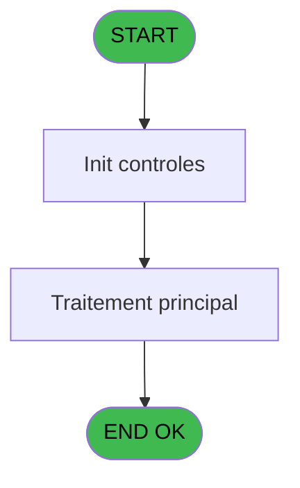
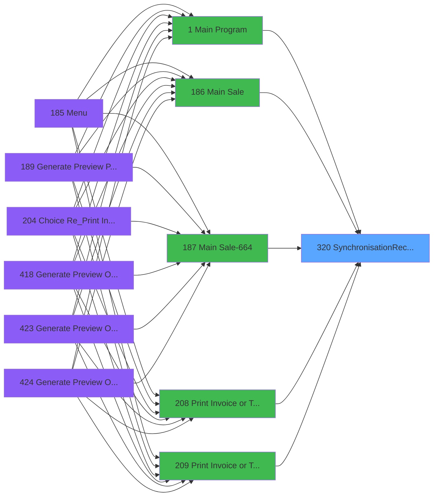

# PVE IDE 320 - SynchronisationRecuPDF

> **Analyse**: Phases 1-4 2026-02-03 19:34 -> 19:34 (11s) | Assemblage 19:34
> **Pipeline**: V7.2 Enrichi
> **Structure**: 4 onglets (Resume | Ecrans | Donnees | Connexions)

<!-- TAB:Resume -->

## 1. FICHE D'IDENTITE

| Attribut | Valeur |
|----------|--------|
| Projet | PVE |
| IDE Position | 320 |
| Nom Programme | SynchronisationRecuPDF |
| Fichier source | `Prg_320.xml` |
| Dossier IDE | Utilitaires |
| Taches | 1 (0 ecrans visibles) |
| Tables modifiees | 0 |
| Programmes appeles | 0 |

## 2. DESCRIPTION FONCTIONNELLE

**SynchronisationRecuPDF** assure la gestion complete de ce processus, accessible depuis [Main Sale (IDE 186)](PVE-IDE-186.md), [Main Sale-664 (IDE 187)](PVE-IDE-187.md), [Main Sale Sale Bar Code (IDE 214)](PVE-IDE-214.md), [Main Sale (IDE 363)](PVE-IDE-363.md), [Main Sale-664 (IDE 364)](PVE-IDE-364.md), [Main Sale ===V4 Booking ACTUEL (IDE 417)](PVE-IDE-417.md), [Main Sale (IDE 440)](PVE-IDE-440.md), [Main Program (IDE 1)](PVE-IDE-1.md), [Print Invoice or Ticket (IDE 208)](PVE-IDE-208.md), [Print Invoice or Ticket-664 (IDE 209)](PVE-IDE-209.md), [Print Invoice or Ticket (IDE 358)](PVE-IDE-358.md), [Print Invoice or Ticket==NEW (IDE 429)](PVE-IDE-429.md).

Le flux de traitement s'organise en **1 blocs fonctionnels** :

- **Traitement** (1 tache) : traitements metier divers

## 3. BLOCS FONCTIONNELS

### 3.1 Traitement (1 tache)

Traitements internes.

---

#### 320 - SynchronisationRecuPDF

**Role** : Consultation/chargement : SynchronisationRecuPDF.

## 5. REGLES METIER

*(Aucune regle metier identifiee)*

## 6. CONTEXTE

- **Appele par**: [Main Sale (IDE 186)](PVE-IDE-186.md), [Main Sale-664 (IDE 187)](PVE-IDE-187.md), [Main Sale Sale Bar Code (IDE 214)](PVE-IDE-214.md), [Main Sale (IDE 363)](PVE-IDE-363.md), [Main Sale-664 (IDE 364)](PVE-IDE-364.md), [Main Sale ===V4 Booking ACTUEL (IDE 417)](PVE-IDE-417.md), [Main Sale (IDE 440)](PVE-IDE-440.md), [Main Program (IDE 1)](PVE-IDE-1.md), [Print Invoice or Ticket (IDE 208)](PVE-IDE-208.md), [Print Invoice or Ticket-664 (IDE 209)](PVE-IDE-209.md), [Print Invoice or Ticket (IDE 358)](PVE-IDE-358.md), [Print Invoice or Ticket==NEW (IDE 429)](PVE-IDE-429.md)
- **Appelle**: 0 programmes | **Tables**: 0 (W:0 R:0 L:0) | **Taches**: 1 | **Expressions**: 19

<!-- TAB:Ecrans -->

## 8. ECRANS

*(Programme sans ecran visible)*

## 9. NAVIGATION

### 9.3 Structure hierarchique (1 tache)

| Position | Tache | Type | Dimensions | Bloc |
|----------|-------|------|------------|------|
| **320.1** | [**SynchronisationRecuPDF** (320)](#t1) | - | - | Traitement |

### 9.4 Algorigramme

> **Legende**: Vert = START/END OK | Rouge = END KO | Bleu = Decisions
> *Algorigramme auto-genere. Utiliser `/algorigramme` pour une synthese metier detaillee.*

<!-- TAB:Donnees -->

## 10. TABLES

### Tables utilisees (0)

| ID | Nom | Description | Type | R | W | L | Usages |
|----|-----|-------------|------|---|---|---|--------|

### Colonnes par table (0 / 0 tables avec colonnes identifiees)

## 11. VARIABLES

### 11.1 Autres (10)

Variables diverses.

| Lettre | Nom | Type | Usage dans |
|--------|-----|------|-----------|
| A | FolderTickets | Alpha | 2x refs |
| B | FolderImages | Alpha | - |
| C | FolderAppointments | Alpha | 2x refs |
| D | ServerName | Unicode | 1x refs |
| E | FilesTicketsList | Blob | 2x refs |
| F | FilesAppointmentsList | Blob | 2x refs |
| G | fileName | Alpha | 4x refs |
| H | OrigineFilePath | Alpha | 2x refs |
| I | DestinationFilePath | Alpha | 2x refs |
| J | CopyResult | Logical | - |

## 12. EXPRESSIONS

**19 / 19 expressions decodees (100%)**

### 12.1 Repartition par type

| Type | Expressions | Regles |
|------|-------------|--------|
| CONCATENATION | 3 | 0 |
| CAST_LOGIQUE | 2 | 0 |
| OTHER | 7 | 0 |
| CONDITION | 2 | 0 |
| STRING | 5 | 0 |

### 12.2 Expressions cles par type

#### CONCATENATION (3 expressions)

| Type | IDE | Expression | Regle |
|------|-----|------------|-------|
| CONCATENATION | 17 | `Translate ('%club_exportdata%') & 'appointments\' & fileName [G]` | - |
| CONCATENATION | 16 | `Translate ('%club_exportdata%') & 'Ticket\' & fileName [G]` | - |
| CONCATENATION | 5 | `'net use M: \\' & Trim(ServerName [D]) & '\share-01$'` | - |

#### CAST_LOGIQUE (2 expressions)

| Type | IDE | Expression | Regle |
|------|-----|------------|-------|
| CAST_LOGIQUE | 8 | `FileListGet(FolderAppointments [C],'*.pdf','TRUE'LOG)` | - |
| CAST_LOGIQUE | 7 | `FileListGet(FolderTickets [A],'*.pdf','TRUE'LOG)` | - |

#### OTHER (7 expressions)

| Type | IDE | Expression | Regle |
|------|-----|------------|-------|
| OTHER | 13 | `FileCopy(OrigineFilePath [H],DestinationFilePath [I])` | - |
| OTHER | 18 | `FileDelete(OrigineFilePath [H])` | - |
| OTHER | 19 | `FileExist(DestinationFilePath [I])` | - |
| OTHER | 12 | `VecGet(FilesAppointmentsList [F],LoopCounter())` | - |
| OTHER | 4 | `Translate ('%SERVER%')` | - |
| ... | | *+2 autres* | |

#### CONDITION (2 expressions)

| Type | IDE | Expression | Regle |
|------|-----|------------|-------|
| CONDITION | 10 | `LoopCounter() <= VecSize(FilesAppointmentsList [F])` | - |
| CONDITION | 9 | `LoopCounter() <= VecSize(FilesTicketsList [E])` | - |

#### STRING (5 expressions)

| Type | IDE | Expression | Regle |
|------|-----|------------|-------|
| STRING | 14 | `Trim(FolderTickets [A]) & Trim(fileName [G])` | - |
| STRING | 15 | `Trim(FolderAppointments [C]) & Trim(fileName [G])` | - |
| STRING | 3 | `Trim(VG81)` | - |
| STRING | 1 | `Trim(VG79)` | - |
| STRING | 2 | `Trim(VG80)` | - |

<!-- TAB:Connexions -->

## 13. GRAPHE D'APPELS

### 13.1 Chaine depuis Main (Callers)

Main -> ... -> [Main Sale (IDE 186)](PVE-IDE-186.md) -> **SynchronisationRecuPDF (IDE 320)**

Main -> ... -> [Main Sale-664 (IDE 187)](PVE-IDE-187.md) -> **SynchronisationRecuPDF (IDE 320)**

Main -> ... -> [Main Sale Sale Bar Code (IDE 214)](PVE-IDE-214.md) -> **SynchronisationRecuPDF (IDE 320)**

Main -> ... -> [Main Sale (IDE 363)](PVE-IDE-363.md) -> **SynchronisationRecuPDF (IDE 320)**

Main -> ... -> [Main Sale-664 (IDE 364)](PVE-IDE-364.md) -> **SynchronisationRecuPDF (IDE 320)**

Main -> ... -> [Main Sale ===V4 Booking ACTUEL (IDE 417)](PVE-IDE-417.md) -> **SynchronisationRecuPDF (IDE 320)**

Main -> ... -> [Main Sale (IDE 440)](PVE-IDE-440.md) -> **SynchronisationRecuPDF (IDE 320)**

Main -> ... -> [Main Program (IDE 1)](PVE-IDE-1.md) -> **SynchronisationRecuPDF (IDE 320)**

Main -> ... -> [Print Invoice or Ticket (IDE 208)](PVE-IDE-208.md) -> **SynchronisationRecuPDF (IDE 320)**

Main -> ... -> [Print Invoice or Ticket-664 (IDE 209)](PVE-IDE-209.md) -> **SynchronisationRecuPDF (IDE 320)**

Main -> ... -> [Print Invoice or Ticket (IDE 358)](PVE-IDE-358.md) -> **SynchronisationRecuPDF (IDE 320)**

Main -> ... -> [Print Invoice or Ticket==NEW (IDE 429)](PVE-IDE-429.md) -> **SynchronisationRecuPDF (IDE 320)**

### 13.2 Callers

| IDE | Nom Programme | Nb Appels |
|-----|---------------|-----------|
| [186](PVE-IDE-186.md) | Main Sale | 2 |
| [187](PVE-IDE-187.md) | Main Sale-664 | 2 |
| [214](PVE-IDE-214.md) | Main Sale Sale Bar Code | 2 |
| [363](PVE-IDE-363.md) | Main Sale | 2 |
| [364](PVE-IDE-364.md) | Main Sale-664 | 2 |
| [417](PVE-IDE-417.md) | Main Sale ===V4 Booking ACTUEL | 2 |
| [440](PVE-IDE-440.md) | Main Sale | 2 |
| [1](PVE-IDE-1.md) | Main Program | 1 |
| [208](PVE-IDE-208.md) | Print Invoice or Ticket | 1 |
| [209](PVE-IDE-209.md) | Print Invoice or Ticket-664 | 1 |
| [358](PVE-IDE-358.md) | Print Invoice or Ticket | 1 |
| [429](PVE-IDE-429.md) | Print Invoice or Ticket==NEW | 1 |

### 13.3 Callees (programmes appeles)

### 13.4 Detail Callees avec contexte

| IDE | Nom Programme | Appels | Contexte |
|-----|---------------|--------|----------|
| - | (aucun) | - | - |

## 14. RECOMMANDATIONS MIGRATION

### 14.1 Profil du programme

| Metrique | Valeur | Impact migration |
|----------|--------|-----------------|
| Lignes de logique | 44 | Programme compact |
| Expressions | 19 | Peu de logique |
| Tables WRITE | 0 | Impact faible |
| Sous-programmes | 0 | Peu de dependances |
| Ecrans visibles | 0 | Ecran unique ou traitement batch |
| Code desactive | 0% (0 / 44) | Code sain |
| Regles metier | 0 | Pas de regle identifiee |

### 14.2 Plan de migration par bloc

#### Traitement (1 tache: 0 ecran, 1 traitement)

- **Strategie** : 1 service(s) backend injectable(s) (Domain Services).
- Decomposer les taches en services unitaires testables.

### 14.3 Dependances critiques

| Dependance | Type | Appels | Impact |
|------------|------|--------|--------|

---
*Spec DETAILED generee par Pipeline V7.2 - 2026-02-03 19:34*
