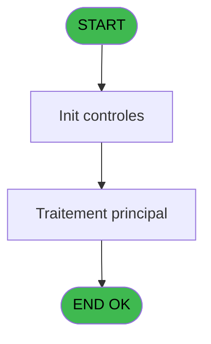
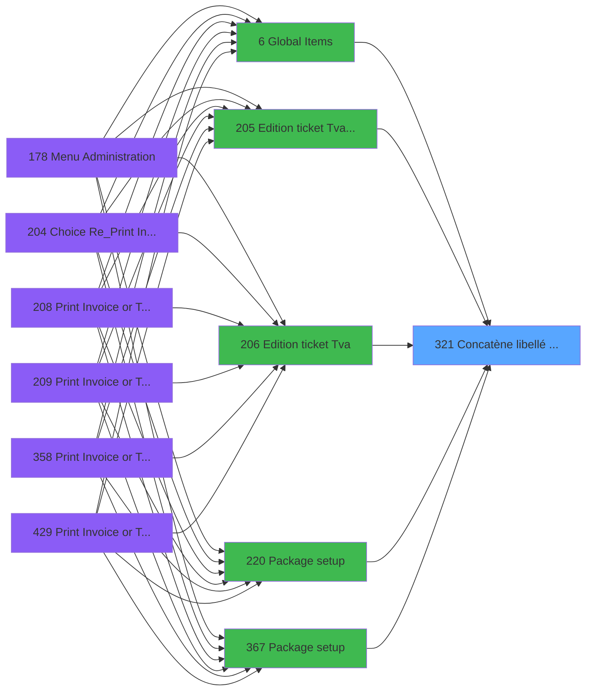

# PVE IDE 321 - Concatène libellé Cat/Ss-Cat

> **Analyse**: Phases 1-4 2026-02-03 19:35 -> 19:35 (11s) | Assemblage 19:35
> **Pipeline**: V7.2 Enrichi
> **Structure**: 4 onglets (Resume | Ecrans | Donnees | Connexions)

<!-- TAB:Resume -->

## 1. FICHE D'IDENTITE

| Attribut | Valeur |
|----------|--------|
| Projet | PVE |
| IDE Position | 321 |
| Nom Programme | Concatène libellé Cat/Ss-Cat |
| Fichier source | `Prg_321.xml` |
| Dossier IDE | Utilitaires |
| Taches | 3 (0 ecrans visibles) |
| Tables modifiees | 0 |
| Programmes appeles | 0 |

## 2. DESCRIPTION FONCTIONNELLE

**Concatène libellé Cat/Ss-Cat** assure la gestion complete de ce processus, accessible depuis [Edition ticket (Tva) LEX (IDE 205)](PVE-IDE-205.md), [Edition ticket (Tva) (IDE 206)](PVE-IDE-206.md), [Package setup (IDE 220)](PVE-IDE-220.md), [Package setup (IDE 367)](PVE-IDE-367.md), [Edition ticket (Tva) (IDE 442)](PVE-IDE-442.md), [Global Items (IDE 6)](PVE-IDE-6.md).

Le flux de traitement s'organise en **2 blocs fonctionnels** :

- **Traitement** (2 taches) : traitements metier divers
- **Consultation** (1 tache) : ecrans de recherche, selection et consultation

Detail : phases du traitement

#### Phase 1 : Traitement (2 taches)

- **321** - Concatène libellé Cat/Ss-Cat
- **321.1** - Concatène libellé Cat/Ss-Cat

#### Phase 2 : Consultation (1 tache)

- **321.2** - Recherche Sale Label

## 3. BLOCS FONCTIONNELS

### 3.1 Traitement (2 taches)

Traitements internes.

---

#### 321 - Concatène libellé Cat/Ss-Cat

**Role** : Traitement : Concatène libellé Cat/Ss-Cat.

---

#### 321.1 - Concatène libellé Cat/Ss-Cat

**Role** : Traitement : Concatène libellé Cat/Ss-Cat.

### 3.2 Consultation (1 tache)

Ecrans de recherche et consultation.

---

#### 321.2 - Recherche Sale Label

**Role** : Traitement : Recherche Sale Label.
**Variables liees** : D (PO.Label Concaténés), F (V.Modif Sale label autorisé ?)

## 5. REGLES METIER

*(Aucune regle metier identifiee)*

## 6. CONTEXTE

- **Appele par**: [Edition ticket (Tva) LEX (IDE 205)](PVE-IDE-205.md), [Edition ticket (Tva) (IDE 206)](PVE-IDE-206.md), [Package setup (IDE 220)](PVE-IDE-220.md), [Package setup (IDE 367)](PVE-IDE-367.md), [Edition ticket (Tva) (IDE 442)](PVE-IDE-442.md), [Global Items (IDE 6)](PVE-IDE-6.md)
- **Appelle**: 0 programmes | **Tables**: 4 (W:0 R:3 L:1) | **Taches**: 3 | **Expressions**: 5

<!-- TAB:Ecrans -->

## 8. ECRANS

*(Programme sans ecran visible)*

## 9. NAVIGATION

### 9.3 Structure hierarchique (3 taches)

| Position | Tache | Type | Dimensions | Bloc |
|----------|-------|------|------------|------|
| **321.1** | [**Concatène libellé Cat/Ss-Cat** (321)](#t1) | - | - | Traitement |
| 321.1.1 | [Concatène libellé Cat/Ss-Cat (321.1)](#t2) | - | - | |
| **321.2** | [**Recherche Sale Label** (321.2)](#t3) | - | - | Consultation |

### 9.4 Algorigramme

> **Legende**: Vert = START/END OK | Rouge = END KO | Bleu = Decisions
> *Algorigramme auto-genere. Utiliser `/algorigramme` pour une synthese metier detaillee.*

<!-- TAB:Donnees -->

## 10. TABLES

### Tables utilisees (4)

| ID | Nom | Description | Type | R | W | L | Usages |
|----|-----|-------------|------|---|---|---|--------|
| 67 | tables___________tab |  | DB | R |   |   | 1 |
| 379 | pv_customer_temp |  | DB | R |   |   | 1 |
| 403 | pv_sellers |  | DB | R |   |   | 1 |
| 413 | pv_tva |  | DB |   |   | L | 1 |

### Colonnes par table (1 / 3 tables avec colonnes identifiees)

Table 67 - tables___________tab (R) - 1 usages

| Lettre | Variable | Acces | Type |
|--------|----------|-------|------|
| A | PI.Service | R | Alpha |
| B | PI.Catégorie | R | Numeric |
| C | PI.Ss-Catégorie | R | Numeric |
| D | PO.Label Concaténés | R | Alpha |
| E | PI.Article | R | Numeric |
| F | V.Modif Sale label autorisé ? | R | Logical |

Table 379 - pv_customer_temp (R) - 1 usages

*Table utilisee uniquement en Link ou aucune colonne Real identifiee dans le DataView.*

Table 403 - pv_sellers (R) - 1 usages

*Table utilisee uniquement en Link ou aucune colonne Real identifiee dans le DataView.*

## 11. VARIABLES

### 11.1 Parametres entrants (5)

Variables recues du programme appelant ([Edition ticket (Tva) LEX (IDE 205)](PVE-IDE-205.md)).

| Lettre | Nom | Type | Usage dans |
|--------|-----|------|-----------|
| A | PI.Service | Alpha | 1x parametre entrant |
| B | PI.Catégorie | Numeric | - |
| C | PI.Ss-Catégorie | Numeric | - |
| D | PO.Label Concaténés | Alpha | - |
| E | PI.Article | Numeric | 2x parametre entrant |

### 11.2 Variables de session (1)

Variables persistantes pendant toute la session.

| Lettre | Nom | Type | Usage dans |
|--------|-----|------|-----------|
| F | V.Modif Sale label autorisé ? | Logical | - |

## 12. EXPRESSIONS

**5 / 5 expressions decodees (100%)**

### 12.1 Repartition par type

| Type | Expressions | Regles |
|------|-------------|--------|
| CONSTANTE | 1 | 0 |
| CONDITION | 2 | 0 |
| OTHER | 1 | 0 |
| CAST_LOGIQUE | 1 | 0 |

### 12.2 Expressions cles par type

#### CONSTANTE (1 expressions)

| Type | IDE | Expression | Regle |
|------|-----|------------|-------|
| CONSTANTE | 2 | `'VSERV'` | - |

#### CONDITION (2 expressions)

| Type | IDE | Expression | Regle |
|------|-----|------------|-------|
| CONDITION | 5 | `PI.Article [E]<>0 AND V.Modif Sale label aut... [F]` | - |
| CONDITION | 1 | `PI.Article [E]<>0` | - |

#### OTHER (1 expressions)

| Type | IDE | Expression | Regle |
|------|-----|------------|-------|
| OTHER | 3 | `PI.Service [A]` | - |

#### CAST_LOGIQUE (1 expressions)

| Type | IDE | Expression | Regle |
|------|-----|------------|-------|
| CAST_LOGIQUE | 4 | `'TRUE'LOG` | - |

<!-- TAB:Connexions -->

## 13. GRAPHE D'APPELS

### 13.1 Chaine depuis Main (Callers)

Main -> ... -> [Edition ticket (Tva) LEX (IDE 205)](PVE-IDE-205.md) -> **Concatène libellé Cat/Ss-Cat (IDE 321)**

Main -> ... -> [Edition ticket (Tva) (IDE 206)](PVE-IDE-206.md) -> **Concatène libellé Cat/Ss-Cat (IDE 321)**

Main -> ... -> [Package setup (IDE 220)](PVE-IDE-220.md) -> **Concatène libellé Cat/Ss-Cat (IDE 321)**

Main -> ... -> [Package setup (IDE 367)](PVE-IDE-367.md) -> **Concatène libellé Cat/Ss-Cat (IDE 321)**

Main -> ... -> [Edition ticket (Tva) (IDE 442)](PVE-IDE-442.md) -> **Concatène libellé Cat/Ss-Cat (IDE 321)**

Main -> ... -> [Global Items (IDE 6)](PVE-IDE-6.md) -> **Concatène libellé Cat/Ss-Cat (IDE 321)**

### 13.2 Callers

| IDE | Nom Programme | Nb Appels |
|-----|---------------|-----------|
| [205](PVE-IDE-205.md) | Edition ticket (Tva) LEX | 4 |
| [206](PVE-IDE-206.md) | Edition ticket (Tva) | 3 |
| [220](PVE-IDE-220.md) | Package setup | 3 |
| [367](PVE-IDE-367.md) | Package setup | 3 |
| [442](PVE-IDE-442.md) | Edition ticket (Tva) | 3 |
| [6](PVE-IDE-6.md) | Global Items | 1 |

### 13.3 Callees (programmes appeles)

### 13.4 Detail Callees avec contexte

| IDE | Nom Programme | Appels | Contexte |
|-----|---------------|--------|----------|
| - | (aucun) | - | - |

## 14. RECOMMANDATIONS MIGRATION

### 14.1 Profil du programme

| Metrique | Valeur | Impact migration |
|----------|--------|-----------------|
| Lignes de logique | 53 | Programme compact |
| Expressions | 5 | Peu de logique |
| Tables WRITE | 0 | Impact faible |
| Sous-programmes | 0 | Peu de dependances |
| Ecrans visibles | 0 | Ecran unique ou traitement batch |
| Code desactive | 0% (0 / 53) | Code sain |
| Regles metier | 0 | Pas de regle identifiee |

### 14.2 Plan de migration par bloc

#### Traitement (2 taches: 0 ecran, 2 traitements)

- **Strategie** : 2 service(s) backend injectable(s) (Domain Services).
- Decomposer les taches en services unitaires testables.

#### Consultation (1 tache: 0 ecran, 1 traitement)

- **Strategie** : Composants de recherche/selection en modales.

### 14.3 Dependances critiques

| Dependance | Type | Appels | Impact |
|------------|------|--------|--------|

---
*Spec DETAILED generee par Pipeline V7.2 - 2026-02-03 19:35*
