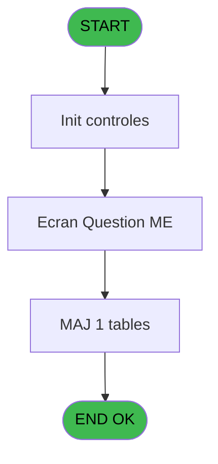
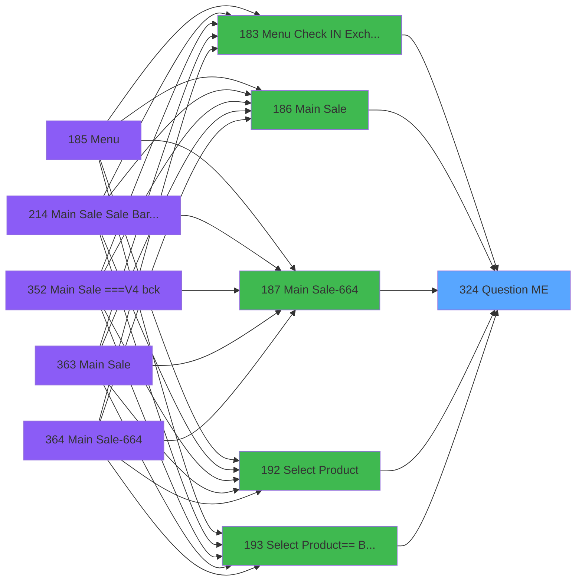

# PVE IDE 324 - Question M&E

> **Analyse**: Phases 1-4 2026-02-03 19:35 -> 19:36 (11s) | Assemblage 19:36
> **Pipeline**: V7.2 Enrichi
> **Structure**: 4 onglets (Resume | Ecrans | Donnees | Connexions)

<!-- TAB:Resume -->

## 1. FICHE D'IDENTITE

| Attribut | Valeur |
|----------|--------|
| Projet | PVE |
| IDE Position | 324 |
| Nom Programme | Question M&E |
| Fichier source | `Prg_324.xml` |
| Dossier IDE | Zoom |
| Taches | 3 (1 ecrans visibles) |
| Tables modifiees | 1 |
| Programmes appeles | 0 |

## 2. DESCRIPTION FONCTIONNELLE

**Question M&E** assure la gestion complete de ce processus, accessible depuis [Main Sale (IDE 186)](PVE-IDE-186.md), [Main Sale-664 (IDE 187)](PVE-IDE-187.md), [Main Sale Sale Bar Code (IDE 214)](PVE-IDE-214.md), [Menu Check IN / Exchange (IDE 183)](PVE-IDE-183.md), [Select Product (IDE 192)](PVE-IDE-192.md), [Select Product== Best Of (IDE 193)](PVE-IDE-193.md).

Le flux de traitement s'organise en **1 blocs fonctionnels** :

- **Traitement** (3 taches) : traitements metier divers

**Donnees modifiees** : 1 tables en ecriture (pv_sellers).

**Logique metier** : 3 regles identifiees couvrant conditions metier.

## 3. BLOCS FONCTIONNELS

### 3.1 Traitement (3 taches)

Traitements internes.

---

#### 324 - Question M&E [[ECRAN]](#ecran-t3)

**Role** : Traitement : Question M&E.
**Ecran** : 292 x 156 DLU | [Voir mockup](#ecran-t3)

---

#### 324.1 - Question M&E [[ECRAN]](#ecran-t25)

**Role** : Traitement : Question M&E.
**Ecran** : 392 x 171 DLU | [Voir mockup](#ecran-t25)

---

#### 324.2 - Question M&E [[ECRAN]](#ecran-t32)

**Role** : Traitement : Question M&E.
**Ecran** : 292 x 156 DLU | [Voir mockup](#ecran-t32)

## 5. REGLES METIER

3 regles identifiees:

### Autres (3 regles)

#### [RM-001] Si Po.Charge de l'entrepr... [G] alors [AT] sinon [AS])

| Element | Detail |
|---------|--------|
| **Condition** | `Po.Charge de l'entrepr... [G]` |
| **Si vrai** | [AT] |
| **Si faux** | [AS]) |
| **Expression source** | Expression 10 : `IF(Po.Charge de l'entrepr... [G],[AT],[AS])` |
| **Exemple** | Si Po.Charge de l'entrepr... [G] → [AT]. Sinon → [AS]) |

#### [RM-002] Si [AB] alors [AT] sinon [AS])

| Element | Detail |
|---------|--------|
| **Condition** | `[AB]` |
| **Si vrai** | [AT] |
| **Si faux** | [AS]) |
| **Expression source** | Expression 11 : `IF([AB],[AT],[AS])` |
| **Exemple** | Si [AB] → [AT]. Sinon → [AS]) |

#### [RM-003] Traitement conditionnel si [AI] est a zero

| Element | Detail |
|---------|--------|
| **Condition** | `[AI]=0` |
| **Si vrai** | [AS] |
| **Si faux** | [BD]) |
| **Expression source** | Expression 25 : `IF([AI]=0,[AS],[BD])` |
| **Exemple** | Si [AI]=0 → [AS]. Sinon → [BD]) |

## 6. CONTEXTE

- **Appele par**: [Main Sale (IDE 186)](PVE-IDE-186.md), [Main Sale-664 (IDE 187)](PVE-IDE-187.md), [Main Sale Sale Bar Code (IDE 214)](PVE-IDE-214.md), [Menu Check IN / Exchange (IDE 183)](PVE-IDE-183.md), [Select Product (IDE 192)](PVE-IDE-192.md), [Select Product== Best Of (IDE 193)](PVE-IDE-193.md)
- **Appelle**: 0 programmes | **Tables**: 4 (W:1 R:1 L:3) | **Taches**: 3 | **Expressions**: 28

<!-- TAB:Ecrans -->

## 8. ECRANS

### 8.1 Forms visibles (1 / 3)

| # | Position | Tache | Nom | Type | Largeur | Hauteur | Bloc |
|---|----------|-------|-----|------|---------|---------|------|
| 1 | 324.1.1 | 324.1 | Question M&E | Type0 | 392 | 171 | Traitement |

### 8.2 Mockups Ecrans

---

#### 324.1.1 - Question M&E
**Tache** : [324.1](#t25) | **Type** : Type0 | **Dimensions** : 392 x 171 DLU
**Bloc** : Traitement | **Titre IDE** : Question M&E

<!-- FORM-DATA:
{
    "width":  392,
    "vFactor":  8,
    "type":  "Type0",
    "hFactor":  4,
    "controls":  [
                     {
                         "x":  58,
                         "type":  "label",
                         "var":  "",
                         "y":  8,
                         "w":  276,
                         "fmt":  "",
                         "name":  "",
                         "h":  14,
                         "color":  "",
                         "text":  "Is this sale covered by the company?",
                         "parent":  null
                     },
                     {
                         "x":  58,
                         "type":  "label",
                         "var":  "",
                         "y":  60,
                         "w":  276,
                         "fmt":  "",
                         "name":  "",
                         "h":  14,
                         "color":  "",
                         "text":  "What price should we charge?",
                         "parent":  null
                     },
                     {
                         "x":  58,
                         "type":  "label",
                         "var":  "",
                         "y":  116,
                         "w":  276,
                         "fmt":  "",
                         "name":  "",
                         "h":  14,
                         "color":  "",
                         "text":  "Does this price apply to all participants in this seminar?",
                         "parent":  null
                     },
                     {
                         "x":  43,
                         "type":  "button",
                         "var":  "",
                         "y":  28,
                         "w":  94,
                         "fmt":  "Yes",
                         "name":  "V.Question 1 Yes",
                         "h":  24,
                         "color":  "",
                         "text":  "",
                         "parent":  null
                     },
                     {
                         "x":  255,
                         "type":  "button",
                         "var":  "",
                         "y":  28,
                         "w":  94,
                         "fmt":  "No",
                         "name":  "V.Question 1 No",
                         "h":  24,
                         "color":  "",
                         "text":  "",
                         "parent":  null
                     },
                     {
                         "x":  32,
                         "type":  "radio",
                         "var":  "",
                         "y":  32,
                         "w":  12,
                         "fmt":  "",
                         "name":  "P.o. Charge de l\u0027entreprise?",
                         "h":  14,
                         "color":  "",
                         "text":  "",
                         "parent":  null
                     },
                     {
                         "x":  244,
                         "type":  "radio",
                         "var":  "",
                         "y":  32,
                         "w":  12,
                         "fmt":  "",
                         "name":  "P.o. Charge de l\u0027entreprise?",
                         "h":  14,
                         "color":  "",
                         "text":  "",
                         "parent":  null
                     },
                     {
                         "x":  16,
                         "type":  "button",
                         "var":  "",
                         "y":  84,
                         "w":  148,
                         "fmt":  "30",
                         "name":  "V.Question 2 Negotiated rate",
                         "h":  24,
                         "color":  "",
                         "text":  "",
                         "parent":  null
                     },
                     {
                         "x":  228,
                         "type":  "button",
                         "var":  "",
                         "y":  84,
                         "w":  148,
                         "fmt":  "30",
                         "name":  "V.Question 2 Catalog rate",
                         "h":  24,
                         "color":  "",
                         "text":  "",
                         "parent":  null
                     },
                     {
                         "x":  4,
                         "type":  "radio",
                         "var":  "",
                         "y":  88,
                         "w":  12,
                         "fmt":  "",
                         "name":  "P.o. Charge de l\u0027entreprise?",
                         "h":  14,
                         "color":  "",
                         "text":  "",
                         "parent":  null
                     },
                     {
                         "x":  216,
                         "type":  "radio",
                         "var":  "",
                         "y":  88,
                         "w":  12,
                         "fmt":  "",
                         "name":  "P.o. Charge de l\u0027entreprise?",
                         "h":  14,
                         "color":  "",
                         "text":  "",
                         "parent":  null
                     },
                     {
                         "x":  43,
                         "type":  "button",
                         "var":  "",
                         "y":  140,
                         "w":  94,
                         "fmt":  "Yes",
                         "name":  "V.Question 3 Yes",
                         "h":  24,
                         "color":  "",
                         "text":  "",
                         "parent":  null
                     },
                     {
                         "x":  255,
                         "type":  "button",
                         "var":  "",
                         "y":  140,
                         "w":  94,
                         "fmt":  "No",
                         "name":  "V.Question 3 No",
                         "h":  24,
                         "color":  "",
                         "text":  "",
                         "parent":  null
                     }
                 ],
    "taskId":  "324.1.1",
    "height":  171
}
-->

<strong>Boutons : 6 boutons</strong>

| Bouton | Pos (x,y) | Action |
|--------|-----------|--------|
| Yes | 43,28 | Bouton fonctionnel |
| No | 255,28 | Bouton fonctionnel |
| 30 | 16,84 | Bouton fonctionnel |
| 30 | 228,84 | Bouton fonctionnel |
| Yes | 43,140 | Bouton fonctionnel |
| No | 255,140 | Bouton fonctionnel |

## 9. NAVIGATION

Ecran unique: **Question M&E**

### 9.3 Structure hierarchique (3 taches)

| Position | Tache | Type | Dimensions | Bloc |
|----------|-------|------|------------|------|
| **324.1** | [**Question M&E** (324)](#t3) [mockup](#ecran-t3) | - | 292x156 | Traitement |
| 324.1.1 | [Question M&E (324.1)](#t25) [mockup](#ecran-t25) | - | 392x171 | |
| 324.1.2 | [Question M&E (324.2)](#t32) [mockup](#ecran-t32) | - | 292x156 | |

### 9.4 Algorigramme

> **Legende**: Vert = START/END OK | Rouge = END KO | Bleu = Decisions
> *Algorigramme auto-genere. Utiliser `/algorigramme` pour une synthese metier detaillee.*

<!-- TAB:Donnees -->

## 10. TABLES

### Tables utilisees (4)

| ID | Nom | Description | Type | R | W | L | Usages |
|----|-----|-------------|------|---|---|---|--------|
| 379 | pv_customer_temp |  | DB | R |   |   | 1 |
| 403 | pv_sellers |  | DB |   | **W** | L | 3 |
| 413 | pv_tva |  | DB |   |   | L | 2 |
| 1670 | Table_1670 |  | MEM |   |   | L | 2 |

### Colonnes par table (2 / 2 tables avec colonnes identifiees)

Table 379 - pv_customer_temp (R) - 1 usages

| Lettre | Variable | Acces | Type |
|--------|----------|-------|------|
| A | V2. Charge de l'entreprise? | R | Logical |
| B | V2.Tarif négocié? | R | Logical |
| C | V2.Appliquer prix à tous le Sé | R | Logical |
| D | V.Question 1 Yes | R | Unicode |
| E | V.Question 1 No | R | Unicode |
| F | V.Question 2 Negotiated rate | R | Unicode |
| G | V.Question 2 Catalog rate | R | Unicode |
| H | V.Question 3 Yes | R | Unicode |
| I | V.Question 3 No | R | Unicode |
| J | V.Retour réponse | R | Numeric |

Table 403 - pv_sellers (**W**/L) - 3 usages

| Lettre | Variable | Acces | Type |
|--------|----------|-------|------|
| A | Pi.Qualité = GM-SEM? | W | Logical |
| B | Pi. seminar_name | W | Unicode |
| C | Pi. cat | W | Numeric |
| D | Pi. subcat | W | Numeric |
| E | Pi. product | W | Numeric |
| F | Pi.UPGRADE? | W | Logical |
| G | Po.Charge de l'entreprise? | W | Logical |
| H | Po. reduct % | W | Numeric |
| I | Po. final price | W | Numeric |
| J | V.Article pour Seminaire? | W | Logical |
| K | V.Article M&E? | W | Logical |
| L | V1. Charge de l'entreprise? | W | Logical |
| M | V1.Tarif négocié? | W | Logical |
| N | V1.Appliquer prix à tous le Sé | W | Logical |
| O | V1.Prix M&E calculé | W | Numeric |
| P | V. Trtmt erreur prix M&E à 0? | W | Logical |
| Q | v. validate m&e price? | W | Numeric |

## 11. VARIABLES

### 11.1 Parametres entrants (9)

Variables recues du programme appelant ([Main Sale (IDE 186)](PVE-IDE-186.md)).

| Lettre | Nom | Type | Usage dans |
|--------|-----|------|-----------|
| A | Pi.Qualité = GM-SEM? | Logical | - |
| B | Pi. seminar_name | Unicode | - |
| C | Pi. cat | Numeric | - |
| D | Pi. subcat | Numeric | - |
| E | Pi. product | Numeric | - |
| F | Pi.UPGRADE? | Logical | 1x parametre entrant |
| G | Po.Charge de l'entreprise? | Logical | - |
| H | Po. reduct % | Numeric | 1x parametre entrant |
| I | Po. final price | Numeric | - |

### 11.2 Variables de session (4)

Variables persistantes pendant toute la session.

| Lettre | Nom | Type | Usage dans |
|--------|-----|------|-----------|
| J | V.Article pour Seminaire? | Logical | - |
| K | V.Article M&E? | Logical | - |
| P | V. Trtmt erreur prix M&E à 0? | Logical | - |
| Q | v. validate m&e price? | Numeric | 1x session |

### 11.3 Autres (4)

Variables diverses.

| Lettre | Nom | Type | Usage dans |
|--------|-----|------|-----------|
| L | V1. Charge de l'entreprise? | Logical | - |
| M | V1.Tarif négocié? | Logical | - |
| N | V1.Appliquer prix à tous le Sé | Logical | - |
| O | V1.Prix M&E calculé | Numeric | - |

Toutes les 17 variables (liste complete)

| Cat | Lettre | Nom Variable | Type |
|-----|--------|--------------|------|
| P0 | **A** | Pi.Qualité = GM-SEM? | Logical |
| P0 | **B** | Pi. seminar_name | Unicode |
| P0 | **C** | Pi. cat | Numeric |
| P0 | **D** | Pi. subcat | Numeric |
| P0 | **E** | Pi. product | Numeric |
| P0 | **F** | Pi.UPGRADE? | Logical |
| P0 | **G** | Po.Charge de l'entreprise? | Logical |
| P0 | **H** | Po. reduct % | Numeric |
| P0 | **I** | Po. final price | Numeric |
| V. | **J** | V.Article pour Seminaire? | Logical |
| V. | **K** | V.Article M&E? | Logical |
| V. | **P** | V. Trtmt erreur prix M&E à 0? | Logical |
| V. | **Q** | v. validate m&e price? | Numeric |
| Autre | **L** | V1. Charge de l'entreprise? | Logical |
| Autre | **M** | V1.Tarif négocié? | Logical |
| Autre | **N** | V1.Appliquer prix à tous le Sé | Logical |
| Autre | **O** | V1.Prix M&E calculé | Numeric |

## 12. EXPRESSIONS

**28 / 28 expressions decodees (100%)**

### 12.1 Repartition par type

| Type | Expressions | Regles |
|------|-------------|--------|
| CALCULATION | 1 | 0 |
| CALCUL | 1 | 0 |
| CONDITION | 8 | 3 |
| CONSTANTE | 1 | 0 |
| OTHER | 15 | 0 |
| CAST_LOGIQUE | 2 | 0 |

### 12.2 Expressions cles par type

#### CALCULATION (1 expressions)

| Type | IDE | Expression | Regle |
|------|-----|------------|-------|
| CALCULATION | 12 | `([AS]-[AD])/[AS]*100` | - |

#### CALCUL (1 expressions)

| Type | IDE | Expression | Regle |
|------|-----|------------|-------|
| CALCUL | 26 | `[AS]-([AI]*[AS]/100)` | - |

#### CONDITION (8 expressions)

| Type | IDE | Expression | Regle |
|------|-----|------------|-------|
| CONDITION | 25 | `IF([AI]=0,[AS],[BD])` | [RM-003](#rm-RM-003) |
| CONDITION | 11 | `IF([AB],[AT],[AS])` | [RM-002](#rm-RM-002) |
| CONDITION | 10 | `IF(Po.Charge de l'entrepr... [G],[AT],[AS])` | [RM-001](#rm-RM-001) |
| CONDITION | 28 | `[BD]<>[AT]` | - |
| CONDITION | 20 | `VG140 AND Trim(V1.Appliquer prix à to... [N])<>'' AND [AY]` | - |
| ... | | *+3 autres* | |

#### CONSTANTE (1 expressions)

| Type | IDE | Expression | Regle |
|------|-----|------------|-------|
| CONSTANTE | 21 | `0` | - |

#### OTHER (15 expressions)

| Type | IDE | Expression | Regle |
|------|-----|------------|-------|
| OTHER | 15 | `[AX]` | - |
| OTHER | 14 | `[AV]` | - |
| OTHER | 13 | `[AW]` | - |
| OTHER | 18 | `[AS]` | - |
| OTHER | 27 | `[BD]` | - |
| ... | | *+10 autres* | |

#### CAST_LOGIQUE (2 expressions)

| Type | IDE | Expression | Regle |
|------|-----|------------|-------|
| CAST_LOGIQUE | 19 | `'FALSE'LOG` | - |
| CAST_LOGIQUE | 6 | `'TRUE'LOG` | - |

### 12.3 Toutes les expressions (28)

Voir les 28 expressions

#### CALCULATION (1)

| IDE | Expression Decodee |
|-----|-------------------|
| 12 | `([AS]-[AD])/[AS]*100` |

#### CALCUL (1)

| IDE | Expression Decodee |
|-----|-------------------|
| 26 | `[AS]-([AI]*[AS]/100)` |

#### CONDITION (8)

| IDE | Expression Decodee |
|-----|-------------------|
| 10 | `IF(Po.Charge de l'entrepr... [G],[AT],[AS])` |
| 11 | `IF([AB],[AT],[AS])` |
| 25 | `IF([AI]=0,[AS],[BD])` |
| 16 | `[AT]=0` |
| 17 | `[AI]<>0` |
| 24 | `[AZ]=6` |
| 28 | `[BD]<>[AT]` |
| 20 | `VG140 AND Trim(V1.Appliquer prix à to... [N])<>'' AND [AY]` |

#### CONSTANTE (1)

| IDE | Expression Decodee |
|-----|-------------------|
| 21 | `0` |

#### OTHER (15)

| IDE | Expression Decodee |
|-----|-------------------|
| 1 | `V1.Appliquer prix à to... [N]` |
| 2 | `GetParam('SERVICE')` |
| 3 | `V. Trtmt erreur prix M... [P]` |
| 4 | `v. validate m&e price? [Q]` |
| 5 | `[S]` |
| 7 | `[AA]` |
| 8 | `NOT([AJ])` |
| 9 | `Po. reduct % [H]` |
| 13 | `[AW]` |
| 14 | `[AV]` |
| 15 | `[AX]` |
| 18 | `[AS]` |
| 22 | `Pi.UPGRADE? [F]` |
| 23 | `GetParam ('RENTAL')` |
| 27 | `[BD]` |

#### CAST_LOGIQUE (2)

| IDE | Expression Decodee |
|-----|-------------------|
| 6 | `'TRUE'LOG` |
| 19 | `'FALSE'LOG` |

<!-- TAB:Connexions -->

## 13. GRAPHE D'APPELS

### 13.1 Chaine depuis Main (Callers)

Main -> ... -> [Main Sale (IDE 186)](PVE-IDE-186.md) -> **Question M&E (IDE 324)**

Main -> ... -> [Main Sale-664 (IDE 187)](PVE-IDE-187.md) -> **Question M&E (IDE 324)**

Main -> ... -> [Main Sale Sale Bar Code (IDE 214)](PVE-IDE-214.md) -> **Question M&E (IDE 324)**

Main -> ... -> [Menu Check IN / Exchange (IDE 183)](PVE-IDE-183.md) -> **Question M&E (IDE 324)**

Main -> ... -> [Select Product (IDE 192)](PVE-IDE-192.md) -> **Question M&E (IDE 324)**

Main -> ... -> [Select Product== Best Of (IDE 193)](PVE-IDE-193.md) -> **Question M&E (IDE 324)**

### 13.2 Callers

| IDE | Nom Programme | Nb Appels |
|-----|---------------|-----------|
| [186](PVE-IDE-186.md) | Main Sale | 2 |
| [187](PVE-IDE-187.md) | Main Sale-664 | 2 |
| [214](PVE-IDE-214.md) | Main Sale Sale Bar Code | 2 |
| [183](PVE-IDE-183.md) | Menu Check IN / Exchange | 1 |
| [192](PVE-IDE-192.md) | Select Product | 1 |
| [193](PVE-IDE-193.md) | Select Product== Best Of | 1 |

### 13.3 Callees (programmes appeles)

### 13.4 Detail Callees avec contexte

| IDE | Nom Programme | Appels | Contexte |
|-----|---------------|--------|----------|
| - | (aucun) | - | - |

## 14. RECOMMANDATIONS MIGRATION

### 14.1 Profil du programme

| Metrique | Valeur | Impact migration |
|----------|--------|-----------------|
| Lignes de logique | 174 | Programme compact |
| Expressions | 28 | Peu de logique |
| Tables WRITE | 1 | Impact faible |
| Sous-programmes | 0 | Peu de dependances |
| Ecrans visibles | 1 | Ecran unique ou traitement batch |
| Code desactive | 0% (0 / 174) | Code sain |
| Regles metier | 3 | Quelques regles a preserver |

### 14.2 Plan de migration par bloc

#### Traitement (3 taches: 3 ecrans, 0 traitement)

- **Strategie** : 3 composant(s) UI (Razor/React) avec formulaires et validation.
- Decomposer les taches en services unitaires testables.

### 14.3 Dependances critiques

| Dependance | Type | Appels | Impact |
|------------|------|--------|--------|
| pv_sellers | Table WRITE (Database) | 2x | Schema + repository |

---
*Spec DETAILED generee par Pipeline V7.2 - 2026-02-03 19:36*
