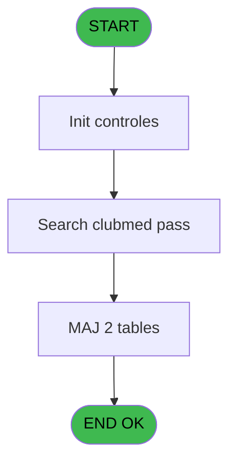
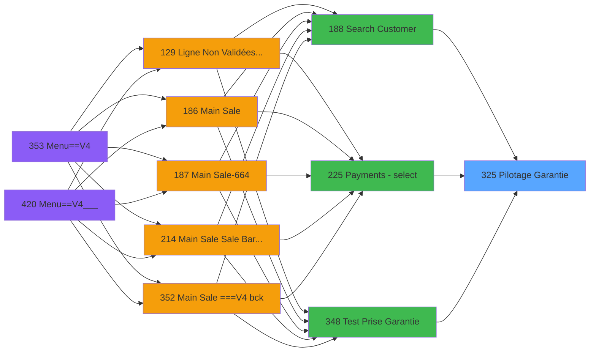
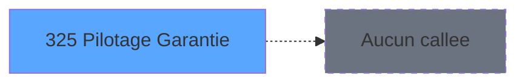

# PVE IDE 325 - Pilotage Garantie

> **Analyse**: Phases 1-4 2026-02-03 19:36 -> 19:36 (10s) | Assemblage 19:36
> **Pipeline**: V7.2 Enrichi
> **Structure**: 4 onglets (Resume | Ecrans | Donnees | Connexions)

<!-- TAB:Resume -->

## 1. FICHE D'IDENTITE

| Attribut | Valeur |
|----------|--------|
| Projet | PVE |
| IDE Position | 325 |
| Nom Programme | Pilotage Garantie |
| Fichier source | `Prg_325.xml` |
| Dossier IDE | Zoom |
| Taches | 4 (1 ecrans visibles) |
| Tables modifiees | 2 |
| Programmes appeles | 0 |

## 2. DESCRIPTION FONCTIONNELLE

**Pilotage Garantie** assure la gestion complete de ce processus, accessible depuis [Search Customer (IDE 188)](PVE-IDE-188.md), [Payments - select (IDE 225)](PVE-IDE-225.md), [Test Prise Garantie (IDE 348)](PVE-IDE-348.md).

Le flux de traitement s'organise en **1 blocs fonctionnels** :

- **Traitement** (4 taches) : traitements metier divers

**Donnees modifiees** : 2 tables en ecriture (ez_card, pv_cust_rentals).

**Logique metier** : 2 regles identifiees couvrant conditions metier.

Detail : phases du traitement

#### Phase 1 : Traitement (4 taches)

- **325** - (sans nom) **[[ECRAN]](#ecran-t1)**
- **325.1** - Club Med Pass Assignment **[[ECRAN]](#ecran-t2)**
- **325.1.1** - Enregistrement CMP
- **325.2** - Mise à jour Payment Type

#### Tables impactees

| Table | Operations | Role metier |
|-------|-----------|-------------|
| ez_card | R/**W** (2 usages) |  |
| pv_cust_rentals | **W** (1 usages) |  |

## 3. BLOCS FONCTIONNELS

### 3.1 Traitement (4 taches)

Traitements internes.

---

#### 325 - (sans nom) [[ECRAN]](#ecran-t1)

**Role** : Traitement interne.
**Ecran** : 290 x 22 DLU | [Voir mockup](#ecran-t1)

3 sous-taches directes

| Tache | Nom | Bloc |
|-------|-----|------|
| [325.1](#t2) | Club Med Pass Assignment **[[ECRAN]](#ecran-t2)** | Traitement |
| [325.1.1](#t3) | Enregistrement CMP | Traitement |
| [325.2](#t4) | Mise à jour Payment Type | Traitement |

---

#### 325.1 - Club Med Pass Assignment [[ECRAN]](#ecran-t2)

**Role** : Traitement : Club Med Pass Assignment.
**Ecran** : 363 x 134 DLU (MDI) | [Voir mockup](#ecran-t2)

---

#### 325.1.1 - Enregistrement CMP

**Role** : Traitement : Enregistrement CMP.

---

#### 325.2 - Mise à jour Payment Type

**Role** : Traitement : Mise à jour Payment Type.

## 5. REGLES METIER

2 regles identifiees:

### Autres (2 regles)

#### [RM-001] Si [K]='S' alors [O] sinon [N])

| Element | Detail |
|---------|--------|
| **Condition** | `[K]='S'` |
| **Si vrai** | [O] |
| **Si faux** | [N]) |
| **Expression source** | Expression 8 : `IF ([K]='S',[O],[N])` |
| **Exemple** | Si [K]='S' → [O]. Sinon → [N]) |

#### [RM-002] Si Trim([Q]) vaut 'B' alors 'B', sinon 'U'

| Element | Detail |
|---------|--------|
| **Condition** | `Trim([Q])='B'` |
| **Si vrai** | 'B' |
| **Si faux** | 'U') |
| **Expression source** | Expression 9 : `IF(Trim([Q])='B','B','U')` |
| **Exemple** | Si Trim([Q])='B' → 'B'. Sinon → 'U') |

## 6. CONTEXTE

- **Appele par**: [Search Customer (IDE 188)](PVE-IDE-188.md), [Payments - select (IDE 225)](PVE-IDE-225.md), [Test Prise Garantie (IDE 348)](PVE-IDE-348.md)
- **Appelle**: 0 programmes | **Tables**: 5 (W:2 R:2 L:2) | **Taches**: 4 | **Expressions**: 11

<!-- TAB:Ecrans -->

## 8. ECRANS

### 8.1 Forms visibles (1 / 4)

| # | Position | Tache | Nom | Type | Largeur | Hauteur | Bloc |
|---|----------|-------|-----|------|---------|---------|------|
| 1 | 325.1 | 325.1 | Club Med Pass Assignment | MDI | 363 | 134 | Traitement |

### 8.2 Mockups Ecrans

---

#### 325.1 - Club Med Pass Assignment
**Tache** : [325.1](#t2) | **Type** : MDI | **Dimensions** : 363 x 134 DLU
**Bloc** : Traitement | **Titre IDE** : Club Med Pass Assignment

<!-- FORM-DATA:
{
    "width":  363,
    "vFactor":  8,
    "type":  "MDI",
    "hFactor":  4,
    "controls":  [
                     {
                         "x":  132,
                         "type":  "label",
                         "var":  "",
                         "y":  24,
                         "w":  99,
                         "fmt":  "",
                         "name":  "",
                         "h":  8,
                         "color":  "6",
                         "text":  "Scan Clubmed Pass...",
                         "parent":  null
                     },
                     {
                         "x":  0,
                         "type":  "label",
                         "var":  "",
                         "y":  105,
                         "w":  363,
                         "fmt":  "",
                         "name":  "",
                         "h":  29,
                         "color":  "63",
                         "text":  "",
                         "parent":  null
                     },
                     {
                         "x":  132,
                         "type":  "edit",
                         "var":  "",
                         "y":  50,
                         "w":  171,
                         "fmt":  "",
                         "name":  "CardId",
                         "h":  16,
                         "color":  "110",
                         "text":  "",
                         "parent":  null
                     },
                     {
                         "x":  132,
                         "type":  "edit",
                         "var":  "",
                         "y":  72,
                         "w":  171,
                         "fmt":  "50",
                         "name":  "",
                         "h":  16,
                         "color":  "143",
                         "text":  "",
                         "parent":  null
                     },
                     {
                         "x":  262,
                         "type":  "button",
                         "var":  "",
                         "y":  110,
                         "w":  99,
                         "fmt":  "\u0026Cancel",
                         "name":  "CANCEL",
                         "h":  24,
                         "color":  "",
                         "text":  "",
                         "parent":  null
                     },
                     {
                         "x":  16,
                         "type":  "image",
                         "var":  "",
                         "y":  16,
                         "w":  102,
                         "fmt":  "",
                         "name":  "",
                         "h":  78,
                         "color":  "",
                         "text":  "",
                         "parent":  null
                     }
                 ],
    "taskId":  "325.1",
    "height":  134
}
-->

<strong>Champs : 2 champs</strong>

| Pos (x,y) | Nom | Variable | Type |
|-----------|-----|----------|------|
| 132,50 | CardId | - | edit |
| 132,72 | 50 | - | edit |

<strong>Boutons : 1 boutons</strong>

| Bouton | Pos (x,y) | Action |
|--------|-----------|--------|
| Cancel | 262,110 | Annule et retour au menu |

## 9. NAVIGATION

Ecran unique: **Club Med Pass Assignment**

### 9.3 Structure hierarchique (4 taches)

| Position | Tache | Type | Dimensions | Bloc |
|----------|-------|------|------------|------|
| **325.1** | [**(sans nom)** (325)](#t1) [mockup](#ecran-t1) | - | 290x22 | Traitement |
| 325.1.1 | [Club Med Pass Assignment (325.1)](#t2) [mockup](#ecran-t2) | MDI | 363x134 | |
| 325.1.2 | [Enregistrement CMP (325.1.1)](#t3) | - | - | |
| 325.1.3 | [Mise à jour Payment Type (325.2)](#t4) | - | - | |

### 9.4 Algorigramme

> **Legende**: Vert = START/END OK | Rouge = END KO | Bleu = Decisions
> *Algorigramme auto-genere. Utiliser `/algorigramme` pour une synthese metier detaillee.*

<!-- TAB:Donnees -->

## 10. TABLES

### Tables utilisees (5)

| ID | Nom | Description | Type | R | W | L | Usages |
|----|-----|-------------|------|---|---|---|--------|
| 47 | compte_gm________cgm | Comptes GM (generaux) | DB | R |   |   | 1 |
| 69 | initialisation___ini |  | DB |   |   | L | 1 |
| 122 | unilateral_bilateral |  | DB |   |   | L | 1 |
| 312 | ez_card |  | DB | R | **W** |   | 2 |
| 400 | pv_cust_rentals |  | DB |   | **W** |   | 1 |

### Colonnes par table (2 / 3 tables avec colonnes identifiees)

Table 47 - compte_gm________cgm (R) - 1 usages

| Lettre | Variable | Acces | Type |
|--------|----------|-------|------|
| A | p.Garantie Ok | R | Logical |
| B | p.Societe | R | Unicode |
| C | p.Compte | R | Numeric |
| D | p.Filiation | R | Numeric |
| E | v.compte garanti | R | Alpha |
| F | v.code retour | R | Alpha |
| G | v.code action garantie | R | Alpha |

Table 312 - ez_card (R/**W**) - 2 usages

| Lettre | Variable | Acces | Type |
|--------|----------|-------|------|
| A | V Card ID | W | Alpha |
| B | T Card | W | Logical |

Table 400 - pv_cust_rentals (**W**) - 1 usages

*Table utilisee uniquement en Link ou aucune colonne Real identifiee dans le DataView.*

## 11. VARIABLES

### 11.1 Parametres entrants (4)

Variables recues du programme appelant ([Search Customer (IDE 188)](PVE-IDE-188.md)).

| Lettre | Nom | Type | Usage dans |
|--------|-----|------|-----------|
| A | p.Garantie Ok | Logical | - |
| B | p.Societe | Unicode | - |
| C | p.Compte | Numeric | - |
| D | p.Filiation | Numeric | - |

### 11.2 Variables de session (3)

Variables persistantes pendant toute la session.

| Lettre | Nom | Type | Usage dans |
|--------|-----|------|-----------|
| E | v.compte garanti | Alpha | - |
| F | v.code retour | Alpha | - |
| G | v.code action garantie | Alpha | - |

## 12. EXPRESSIONS

**11 / 11 expressions decodees (100%)**

### 12.1 Repartition par type

| Type | Expressions | Regles |
|------|-------------|--------|
| CONDITION | 3 | 2 |
| CONSTANTE | 1 | 0 |
| REFERENCE_VG | 2 | 0 |
| OTHER | 4 | 0 |
| CAST_LOGIQUE | 1 | 0 |

### 12.2 Expressions cles par type

#### CONDITION (3 expressions)

| Type | IDE | Expression | Regle |
|------|-----|------------|-------|
| CONDITION | 9 | `IF(Trim([Q])='B','B','U')` | [RM-002](#rm-RM-002) |
| CONDITION | 8 | `IF ([K]='S',[O],[N])` | [RM-001](#rm-RM-001) |
| CONDITION | 11 | `[S]='D'` | - |

#### CONSTANTE (1 expressions)

| Type | IDE | Expression | Regle |
|------|-----|------------|-------|
| CONSTANTE | 4 | `'O'` | - |

#### REFERENCE_VG (2 expressions)

| Type | IDE | Expression | Regle |
|------|-----|------------|-------|
| REFERENCE_VG | 2 | `VG49` | - |
| REFERENCE_VG | 1 | `VG48` | - |

#### OTHER (4 expressions)

| Type | IDE | Expression | Regle |
|------|-----|------------|-------|
| OTHER | 6 | `[M]` | - |
| OTHER | 7 | `[K]` | - |
| OTHER | 3 | `GetParam ('AMOUNTFORMAT')` | - |
| OTHER | 5 | `[L]` | - |

#### CAST_LOGIQUE (1 expressions)

| Type | IDE | Expression | Regle |
|------|-----|------------|-------|
| CAST_LOGIQUE | 10 | `'TRUE'LOG` | - |

<!-- TAB:Connexions -->

## 13. GRAPHE D'APPELS

### 13.1 Chaine depuis Main (Callers)

Main -> ... -> [Search Customer (IDE 188)](PVE-IDE-188.md) -> **Pilotage Garantie (IDE 325)**

Main -> ... -> [Payments - select (IDE 225)](PVE-IDE-225.md) -> **Pilotage Garantie (IDE 325)**

Main -> ... -> [Test Prise Garantie (IDE 348)](PVE-IDE-348.md) -> **Pilotage Garantie (IDE 325)**

### 13.2 Callers

| IDE | Nom Programme | Nb Appels |
|-----|---------------|-----------|
| [188](PVE-IDE-188.md) | Search Customer | 3 |
| [225](PVE-IDE-225.md) | Payments - select | 1 |
| [348](PVE-IDE-348.md) | Test Prise Garantie | 1 |

### 13.3 Callees (programmes appeles)

### 13.4 Detail Callees avec contexte

| IDE | Nom Programme | Appels | Contexte |
|-----|---------------|--------|----------|
| - | (aucun) | - | - |

## 14. RECOMMANDATIONS MIGRATION

### 14.1 Profil du programme

| Metrique | Valeur | Impact migration |
|----------|--------|-----------------|
| Lignes de logique | 78 | Programme compact |
| Expressions | 11 | Peu de logique |
| Tables WRITE | 2 | Impact faible |
| Sous-programmes | 0 | Peu de dependances |
| Ecrans visibles | 1 | Ecran unique ou traitement batch |
| Code desactive | 0% (0 / 78) | Code sain |
| Regles metier | 2 | Quelques regles a preserver |

### 14.2 Plan de migration par bloc

#### Traitement (4 taches: 2 ecrans, 2 traitements)

- **Strategie** : Orchestrateur avec 2 ecrans (Razor/React) et 2 traitements backend (services).
- Les ecrans deviennent des composants UI, les traitements invisibles deviennent des services injectables.
- Decomposer les taches en services unitaires testables.

### 14.3 Dependances critiques

| Dependance | Type | Appels | Impact |
|------------|------|--------|--------|
| ez_card | Table WRITE (Database) | 1x | Schema + repository |
| pv_cust_rentals | Table WRITE (Database) | 1x | Schema + repository |

---
*Spec DETAILED generee par Pipeline V7.2 - 2026-02-03 19:36*
