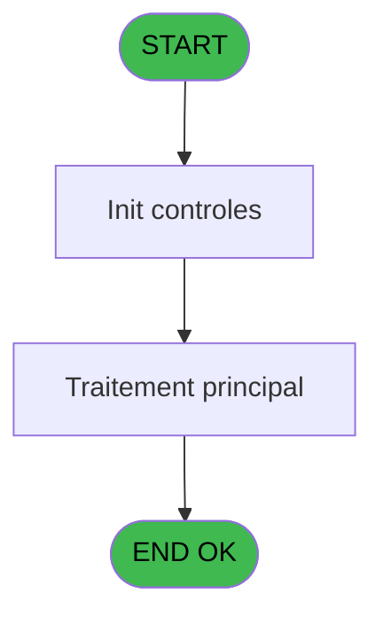
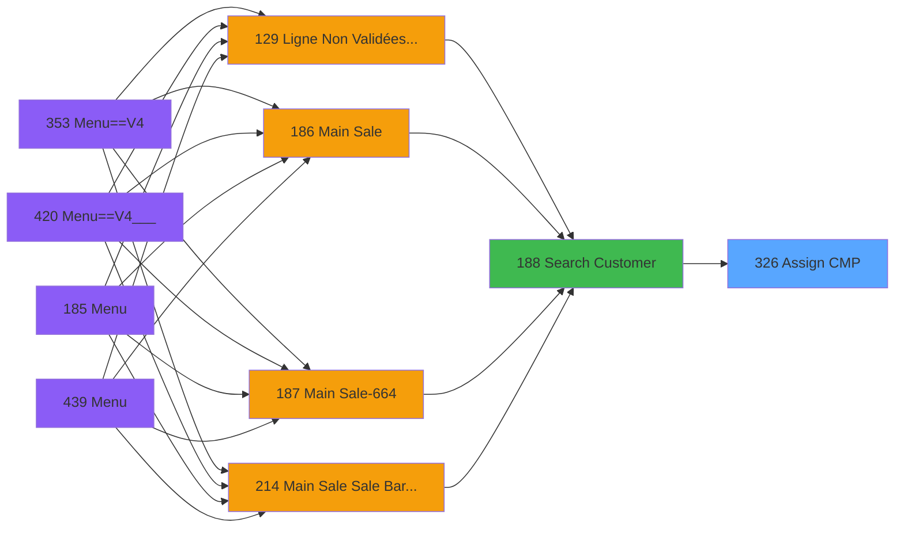
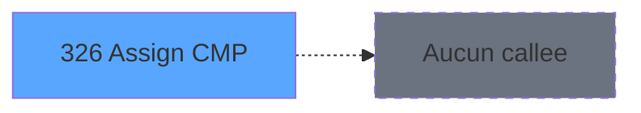

# PVE IDE 326 - Assign CMP

> **Analyse**: Phases 1-4 2026-02-03 19:36 -> 19:36 (11s) | Assemblage 19:36
> **Pipeline**: V7.2 Enrichi
> **Structure**: 4 onglets (Resume | Ecrans | Donnees | Connexions)

<!-- TAB:Resume -->

## 1. FICHE D'IDENTITE

| Attribut | Valeur |
|----------|--------|
| Projet | PVE |
| IDE Position | 326 |
| Nom Programme | Assign CMP |
| Fichier source | `Prg_326.xml` |
| Dossier IDE | Zoom |
| Taches | 1 (1 ecrans visibles) |
| Tables modifiees | 0 |
| Programmes appeles | 0 |

## 2. DESCRIPTION FONCTIONNELLE

**Assign CMP** assure la gestion complete de ce processus, accessible depuis [Search Customer (IDE 188)](PVE-IDE-188.md).

Le flux de traitement s'organise en **1 blocs fonctionnels** :

- **Traitement** (1 tache) : traitements metier divers

**Logique metier** : 1 regles identifiees couvrant conditions metier.

## 3. BLOCS FONCTIONNELS

### 3.1 Traitement (1 tache)

Traitements internes.

---

#### 326 - Assign CMP [[ECRAN]](#ecran-t1)

**Role** : Traitement : Assign CMP.
**Ecran** : 368 x 134 DLU | [Voir mockup](#ecran-t1)

## 5. REGLES METIER

1 regles identifiees:

### Autres (1 regles)

#### [RM-001] Si VG97 alors IF([K]='O' sinon 'V','I'),'V')

| Element | Detail |
|---------|--------|
| **Condition** | `VG97` |
| **Si vrai** | IF([K]='O' |
| **Si faux** | 'V','I'),'V') |
| **Expression source** | Expression 5 : `IF(VG97,IF([K]='O','V','I'),'V')` |
| **Exemple** | Si VG97 → IF([K]='O'. Sinon → 'V','I'),'V') |

## 6. CONTEXTE

- **Appele par**: [Search Customer (IDE 188)](PVE-IDE-188.md)
- **Appelle**: 0 programmes | **Tables**: 2 (W:0 R:1 L:1) | **Taches**: 1 | **Expressions**: 11

<!-- TAB:Ecrans -->

## 8. ECRANS

### 8.1 Forms visibles (1 / 1)

| # | Position | Tache | Nom | Type | Largeur | Hauteur | Bloc |
|---|----------|-------|-----|------|---------|---------|------|
| 1 | 326 | 326 | Assign CMP | Type0 | 368 | 134 | Traitement |

### 8.2 Mockups Ecrans

---

#### 326 - Assign CMP
**Tache** : [326](#t1) | **Type** : Type0 | **Dimensions** : 368 x 134 DLU
**Bloc** : Traitement | **Titre IDE** : Assign CMP

<!-- FORM-DATA:
{
    "width":  368,
    "vFactor":  8,
    "type":  "Type0",
    "hFactor":  4,
    "controls":  [
                     {
                         "x":  134,
                         "type":  "label",
                         "var":  "",
                         "y":  22,
                         "w":  99,
                         "fmt":  "",
                         "name":  "",
                         "h":  8,
                         "color":  "6",
                         "text":  "Scan Clubmed Pass...",
                         "parent":  null
                     },
                     {
                         "x":  2,
                         "type":  "label",
                         "var":  "",
                         "y":  103,
                         "w":  363,
                         "fmt":  "",
                         "name":  "",
                         "h":  29,
                         "color":  "63",
                         "text":  "",
                         "parent":  null
                     },
                     {
                         "x":  18,
                         "type":  "image",
                         "var":  "",
                         "y":  14,
                         "w":  102,
                         "fmt":  "",
                         "name":  "",
                         "h":  78,
                         "color":  "",
                         "text":  "",
                         "parent":  null
                     },
                     {
                         "x":  164,
                         "type":  "edit",
                         "var":  "",
                         "y":  48,
                         "w":  143,
                         "fmt":  "",
                         "name":  "V.Card Code",
                         "h":  16,
                         "color":  "110",
                         "text":  "",
                         "parent":  null
                     },
                     {
                         "x":  111,
                         "type":  "edit",
                         "var":  "",
                         "y":  70,
                         "w":  249,
                         "fmt":  "50",
                         "name":  "V.Message",
                         "h":  16,
                         "color":  "143",
                         "text":  "",
                         "parent":  null
                     },
                     {
                         "x":  263,
                         "type":  "button",
                         "var":  "",
                         "y":  108,
                         "w":  99,
                         "fmt":  "\u0026Cancel",
                         "name":  "CANCEL",
                         "h":  24,
                         "color":  "",
                         "text":  "",
                         "parent":  null
                     }
                 ],
    "taskId":  "326",
    "height":  134
}
-->

<strong>Champs : 2 champs</strong>

| Pos (x,y) | Nom | Variable | Type |
|-----------|-----|----------|------|
| 164,48 | V.Card Code | - | edit |
| 111,70 | V.Message | - | edit |

<strong>Boutons : 1 boutons</strong>

| Bouton | Pos (x,y) | Action |
|--------|-----------|--------|
| Cancel | 263,108 | Annule et retour au menu |

## 9. NAVIGATION

Ecran unique: **Assign CMP**

### 9.3 Structure hierarchique (1 tache)

| Position | Tache | Type | Dimensions | Bloc |
|----------|-------|------|------------|------|
| **326.1** | [**Assign CMP** (326)](#t1) [mockup](#ecran-t1) | - | 368x134 | Traitement |

### 9.4 Algorigramme

> **Legende**: Vert = START/END OK | Rouge = END KO | Bleu = Decisions
> *Algorigramme auto-genere. Utiliser `/algorigramme` pour une synthese metier detaillee.*

<!-- TAB:Donnees -->

## 10. TABLES

### Tables utilisees (2)

| ID | Nom | Description | Type | R | W | L | Usages |
|----|-----|-------------|------|---|---|---|--------|
| 47 | compte_gm________cgm | Comptes GM (generaux) | DB | R |   |   | 1 |
| 312 | ez_card |  | DB |   |   | L | 1 |

### Colonnes par table (2 / 1 tables avec colonnes identifiees)

Table 47 - compte_gm________cgm (R) - 1 usages

| Lettre | Variable | Acces | Type |
|--------|----------|-------|------|
| A | P.Societe | R | Unicode |
| B | P.Compte | R | Numeric |
| C | P.Filiation | R | Numeric |
| D | P.Card Code | R | Unicode |
| E | V.Card Code | R | Unicode |
| F | V.Retour Carte | R | Logical |
| G | V.Message | R | Unicode |

## 11. VARIABLES

### 11.1 Parametres entrants (4)

Variables recues du programme appelant ([Search Customer (IDE 188)](PVE-IDE-188.md)).

| Lettre | Nom | Type | Usage dans |
|--------|-----|------|-----------|
| A | P.Societe | Unicode | 1x parametre entrant |
| B | P.Compte | Numeric | 1x parametre entrant |
| C | P.Filiation | Numeric | 1x parametre entrant |
| D | P.Card Code | Unicode | - |

### 11.2 Variables de session (3)

Variables persistantes pendant toute la session.

| Lettre | Nom | Type | Usage dans |
|--------|-----|------|-----------|
| E | V.Card Code | Unicode | 1x session |
| F | V.Retour Carte | Logical | 1x session |
| G | V.Message | Unicode | - |

## 12. EXPRESSIONS

**11 / 11 expressions decodees (100%)**

### 12.1 Repartition par type

| Type | Expressions | Regles |
|------|-------------|--------|
| CONDITION | 1 | 5 |
| CONSTANTE | 2 | 0 |
| DATE | 1 | 0 |
| OTHER | 6 | 0 |
| REFERENCE_VG | 1 | 0 |

### 12.2 Expressions cles par type

#### CONDITION (1 expressions)

| Type | IDE | Expression | Regle |
|------|-----|------------|-------|
| CONDITION | 5 | `IF(VG97,IF([K]='O','V','I'),'V')` | [RM-001](#rm-RM-001) |

#### CONSTANTE (2 expressions)

| Type | IDE | Expression | Regle |
|------|-----|------------|-------|
| CONSTANTE | 11 | `'Card already assigned !'` | - |
| CONSTANTE | 9 | `''` | - |

#### DATE (1 expressions)

| Type | IDE | Expression | Regle |
|------|-----|------------|-------|
| DATE | 6 | `Date()` | - |

#### OTHER (6 expressions)

| Type | IDE | Expression | Regle |
|------|-----|------------|-------|
| OTHER | 4 | `P.Filiation [C]` | - |
| OTHER | 7 | `Time()` | - |
| OTHER | 10 | `V.Retour Carte [F]` | - |
| OTHER | 1 | `V.Card Code [E]` | - |
| OTHER | 2 | `P.Societe [A]` | - |
| ... | | *+1 autres* | |

#### REFERENCE_VG (1 expressions)

| Type | IDE | Expression | Regle |
|------|-----|------------|-------|
| REFERENCE_VG | 8 | `VG1` | - |

<!-- TAB:Connexions -->

## 13. GRAPHE D'APPELS

### 13.1 Chaine depuis Main (Callers)

Main -> ... -> [Search Customer (IDE 188)](PVE-IDE-188.md) -> **Assign CMP (IDE 326)**

### 13.2 Callers

| IDE | Nom Programme | Nb Appels |
|-----|---------------|-----------|
| [188](PVE-IDE-188.md) | Search Customer | 1 |

### 13.3 Callees (programmes appeles)

### 13.4 Detail Callees avec contexte

| IDE | Nom Programme | Appels | Contexte |
|-----|---------------|--------|----------|
| - | (aucun) | - | - |

## 14. RECOMMANDATIONS MIGRATION

### 14.1 Profil du programme

| Metrique | Valeur | Impact migration |
|----------|--------|-----------------|
| Lignes de logique | 35 | Programme compact |
| Expressions | 11 | Peu de logique |
| Tables WRITE | 0 | Impact faible |
| Sous-programmes | 0 | Peu de dependances |
| Ecrans visibles | 1 | Ecran unique ou traitement batch |
| Code desactive | 0% (0 / 35) | Code sain |
| Regles metier | 1 | Quelques regles a preserver |

### 14.2 Plan de migration par bloc

#### Traitement (1 tache: 1 ecran, 0 traitement)

- **Strategie** : 1 composant(s) UI (Razor/React) avec formulaires et validation.
- Decomposer les taches en services unitaires testables.

### 14.3 Dependances critiques

| Dependance | Type | Appels | Impact |
|------------|------|--------|--------|

---
*Spec DETAILED generee par Pipeline V7.2 - 2026-02-03 19:36*
