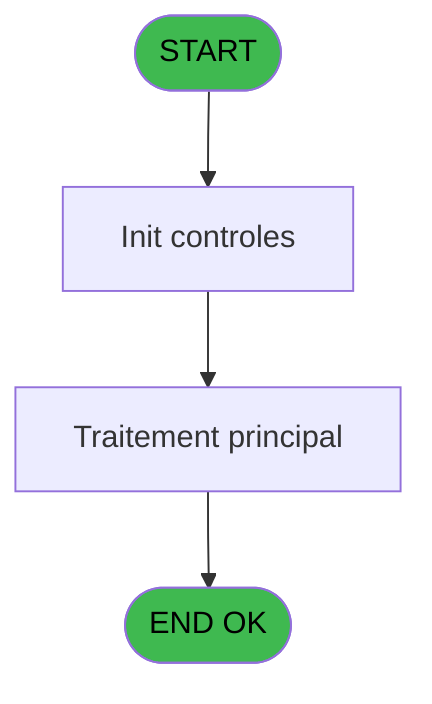
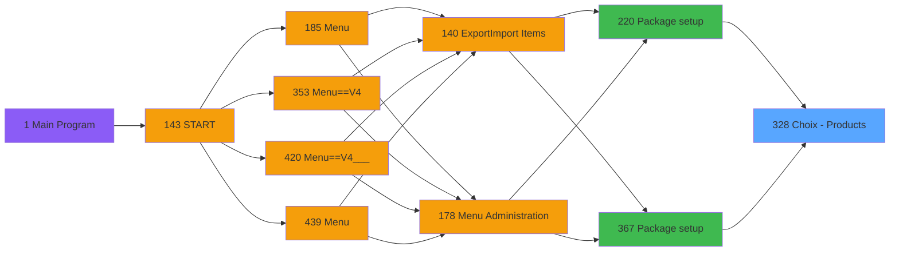

# PVE IDE 328 - Choix - Products

> **Analyse**: Phases 1-4 2026-02-03 19:36 -> 19:37 (11s) | Assemblage 19:37
> **Pipeline**: V7.2 Enrichi
> **Structure**: 4 onglets (Resume | Ecrans | Donnees | Connexions)

<!-- TAB:Resume -->

## 1. FICHE D'IDENTITE

| Attribut | Valeur |
|----------|--------|
| Projet | PVE |
| IDE Position | 328 |
| Nom Programme | Choix - Products |
| Fichier source | `Prg_328.xml` |
| Dossier IDE | Zoom |
| Taches | 1 (1 ecrans visibles) |
| Tables modifiees | 0 |
| Programmes appeles | 0 |

## 2. DESCRIPTION FONCTIONNELLE

**Choix - Products** assure la gestion complete de ce processus, accessible depuis [Package setup (IDE 220)](PVE-IDE-220.md), [Package setup (IDE 367)](PVE-IDE-367.md).

Le flux de traitement s'organise en **1 blocs fonctionnels** :

- **Traitement** (1 tache) : traitements metier divers

## 3. BLOCS FONCTIONNELS

### 3.1 Traitement (1 tache)

Traitements internes.

---

#### 328 - List of Products [[ECRAN]](#ecran-t1)

**Role** : Traitement : List of Products.
**Ecran** : 659 x 420 DLU (MDI) | [Voir mockup](#ecran-t1)

## 5. REGLES METIER

*(Aucune regle metier identifiee)*

## 6. CONTEXTE

- **Appele par**: [Package setup (IDE 220)](PVE-IDE-220.md), [Package setup (IDE 367)](PVE-IDE-367.md)
- **Appelle**: 0 programmes | **Tables**: 3 (W:0 R:1 L:2) | **Taches**: 1 | **Expressions**: 16

<!-- TAB:Ecrans -->

## 8. ECRANS

### 8.1 Forms visibles (1 / 1)

| # | Position | Tache | Nom | Type | Largeur | Hauteur | Bloc |
|---|----------|-------|-----|------|---------|---------|------|
| 1 | 328 | 328 | List of Products | MDI | 659 | 420 | Traitement |

### 8.2 Mockups Ecrans

---

#### 328 - List of Products
**Tache** : [328](#t1) | **Type** : MDI | **Dimensions** : 659 x 420 DLU
**Bloc** : Traitement | **Titre IDE** : List of Products

<!-- FORM-DATA:
{
    "width":  659,
    "vFactor":  8,
    "type":  "MDI",
    "hFactor":  4,
    "controls":  [
                     {
                         "x":  231,
                         "type":  "label",
                         "var":  "",
                         "y":  78,
                         "w":  116,
                         "fmt":  "",
                         "name":  "",
                         "h":  13,
                         "color":  "183",
                         "text":  "Sub category",
                         "parent":  null
                     },
                     {
                         "x":  43,
                         "type":  "label",
                         "var":  "",
                         "y":  79,
                         "w":  134,
                         "fmt":  "",
                         "name":  "",
                         "h":  13,
                         "color":  "183",
                         "text":  "Category",
                         "parent":  null
                     },
                     {
                         "x":  420,
                         "type":  "label",
                         "var":  "",
                         "y":  79,
                         "w":  116,
                         "fmt":  "",
                         "name":  "",
                         "h":  13,
                         "color":  "183",
                         "text":  "Product",
                         "parent":  null
                     },
                     {
                         "x":  2,
                         "type":  "label",
                         "var":  "",
                         "y":  0,
                         "w":  655,
                         "fmt":  "",
                         "name":  "",
                         "h":  41,
                         "color":  "182",
                         "text":  "",
                         "parent":  null
                     },
                     {
                         "x":  2,
                         "type":  "label",
                         "var":  "",
                         "y":  43,
                         "w":  655,
                         "fmt":  "",
                         "name":  "",
                         "h":  32,
                         "color":  "182",
                         "text":  "",
                         "parent":  null
                     },
                     {
                         "x":  36,
                         "type":  "table",
                         "var":  "",
                         "name":  "",
                         "titleH":  12,
                         "color":  "110",
                         "w":  542,
                         "y":  92,
                         "fmt":  "",
                         "parent":  null,
                         "text":  "",
                         "rowH":  28,
                         "h":  282,
                         "cols":  [
                                      {
                                          "title":  "",
                                          "layer":  1,
                                          "w":  179
                                      },
                                      {
                                          "title":  "",
                                          "layer":  2,
                                          "w":  170
                                      },
                                      {
                                          "title":  "",
                                          "layer":  3,
                                          "w":  190
                                      }
                                  ],
                         "rows":  3
                     },
                     {
                         "x":  38,
                         "type":  "label",
                         "var":  "",
                         "y":  95,
                         "w":  14,
                         "fmt":  "",
                         "name":  "",
                         "h":  24,
                         "color":  "144",
                         "text":  "ü",
                         "parent":  10
                     },
                     {
                         "x":  2,
                         "type":  "label",
                         "var":  "",
                         "y":  388,
                         "w":  655,
                         "fmt":  "",
                         "name":  "",
                         "h":  30,
                         "color":  "6",
                         "text":  "",
                         "parent":  null
                     },
                     {
                         "x":  92,
                         "type":  "edit",
                         "var":  "",
                         "y":  53,
                         "w":  337,
                         "fmt":  "20",
                         "name":  "V lancement recherche produit",
                         "h":  15,
                         "color":  "110",
                         "text":  "",
                         "parent":  7
                     },
                     {
                         "x":  55,
                         "type":  "edit",
                         "var":  "",
                         "y":  95,
                         "w":  116,
                         "fmt":  "",
                         "name":  "",
                         "h":  23,
                         "color":  "110",
                         "text":  "",
                         "parent":  10
                     },
                     {
                         "x":  219,
                         "type":  "edit",
                         "var":  "",
                         "y":  95,
                         "w":  116,
                         "fmt":  "",
                         "name":  "",
                         "h":  23,
                         "color":  "110",
                         "text":  "",
                         "parent":  10
                     },
                     {
                         "x":  387,
                         "type":  "button",
                         "var":  "",
                         "y":  94,
                         "w":  187,
                         "fmt":  "",
                         "name":  "",
                         "h":  28,
                         "color":  "",
                         "text":  "",
                         "parent":  10
                     },
                     {
                         "x":  14,
                         "type":  "edit",
                         "var":  "",
                         "y":  14,
                         "w":  583,
                         "fmt":  "100",
                         "name":  "",
                         "h":  10,
                         "color":  "186",
                         "text":  "",
                         "parent":  4
                     },
                     {
                         "x":  577,
                         "type":  "button",
                         "var":  "",
                         "y":  93,
                         "w":  44,
                         "fmt":  "ñ",
                         "name":  "",
                         "h":  142,
                         "color":  "",
                         "text":  "",
                         "parent":  null
                     },
                     {
                         "x":  577,
                         "type":  "button",
                         "var":  "",
                         "y":  235,
                         "w":  44,
                         "fmt":  "ò",
                         "name":  "",
                         "h":  141,
                         "color":  "",
                         "text":  "",
                         "parent":  null
                     },
                     {
                         "x":  577,
                         "type":  "button",
                         "var":  "",
                         "y":  393,
                         "w":  77,
                         "fmt":  "\u0026Exit",
                         "name":  "",
                         "h":  24,
                         "color":  "",
                         "text":  "",
                         "parent":  null
                     },
                     {
                         "x":  606,
                         "type":  "image",
                         "var":  "",
                         "y":  3,
                         "w":  48,
                         "fmt":  "",
                         "name":  "",
                         "h":  37,
                         "color":  "",
                         "text":  "",
                         "parent":  6
                     },
                     {
                         "x":  577,
                         "type":  "button",
                         "var":  "",
                         "y":  49,
                         "w":  77,
                         "fmt":  "\u0026Search",
                         "name":  "Search",
                         "h":  24,
                         "color":  "",
                         "text":  "",
                         "parent":  null
                     }
                 ],
    "taskId":  "328",
    "height":  420
}
-->

<strong>Champs : 4 champs</strong>

| Pos (x,y) | Nom | Variable | Type |
|-----------|-----|----------|------|
| 92,53 | V lancement recherche produit | - | edit |
| 55,95 | (sans nom) | - | edit |
| 219,95 | (sans nom) | - | edit |
| 14,14 | 100 | - | edit |

<strong>Boutons : 5 boutons</strong>

| Bouton | Pos (x,y) | Action |
|--------|-----------|--------|
| (sans nom) | 387,94 | Action declenchee |
| ñ | 577,93 | Bouton fonctionnel |
| ò | 577,235 | Bouton fonctionnel |
| Exit | 577,393 | Quitte le programme |
| Search | 577,49 | Ouvre la selection |

## 9. NAVIGATION

Ecran unique: **List of Products**

### 9.3 Structure hierarchique (1 tache)

| Position | Tache | Type | Dimensions | Bloc |
|----------|-------|------|------------|------|
| **328.1** | [**List of Products** (328)](#t1) [mockup](#ecran-t1) | MDI | 659x420 | Traitement |

### 9.4 Algorigramme

> **Legende**: Vert = START/END OK | Rouge = END KO | Bleu = Decisions
> *Algorigramme auto-genere. Utiliser `/algorigramme` pour une synthese metier detaillee.*

<!-- TAB:Donnees -->

## 10. TABLES

### Tables utilisees (3)

| ID | Nom | Description | Type | R | W | L | Usages |
|----|-----|-------------|------|---|---|---|--------|
| 379 | pv_customer_temp |  | DB | R |   |   | 1 |
| 403 | pv_sellers |  | DB |   |   | L | 1 |
| 413 | pv_tva |  | DB |   |   | L | 1 |

### Colonnes par table (1 / 1 tables avec colonnes identifiees)

Table 379 - pv_customer_temp (R) - 1 usages

| Lettre | Variable | Acces | Type |
|--------|----------|-------|------|
| A | P. Label Product origin | R | Alpha |
| B | P. Category | R | Numeric |
| C | P. Sub category | R | Numeric |
| D | P. Product | R | Numeric |
| E | V Visible | R | Logical |
| F | V Font | R | Numeric |
| G | V lancement recherche produit | R | Unicode |
| H | V recherche produit | R | Unicode |

## 11. VARIABLES

### 11.1 Parametres entrants (4)

Variables recues du programme appelant ([Package setup (IDE 220)](PVE-IDE-220.md)).

| Lettre | Nom | Type | Usage dans |
|--------|-----|------|-----------|
| A | P. Label Product origin | Alpha | [328](#t1) |
| B | P. Category | Numeric | - |
| C | P. Sub category | Numeric | - |
| D | P. Product | Numeric | [328](#t1) |

### 11.2 Variables de session (4)

Variables persistantes pendant toute la session.

| Lettre | Nom | Type | Usage dans |
|--------|-----|------|-----------|
| E | V Visible | Logical | 1x session |
| F | V Font | Numeric | 1x session |
| G | V lancement recherche produit | Unicode | - |
| H | V recherche produit | Unicode | - |

## 12. EXPRESSIONS

**16 / 16 expressions decodees (100%)**

### 12.1 Repartition par type

| Type | Expressions | Regles |
|------|-------------|--------|
| CONSTANTE | 2 | 0 |
| OTHER | 9 | 0 |
| CAST_LOGIQUE | 2 | 0 |
| CONDITION | 2 | 0 |
| CONCATENATION | 1 | 0 |

### 12.2 Expressions cles par type

#### CONSTANTE (2 expressions)

| Type | IDE | Expression | Regle |
|------|-----|------------|-------|
| CONSTANTE | 9 | `8` | - |
| CONSTANTE | 8 | `135` | - |

#### OTHER (9 expressions)

| Type | IDE | Expression | Regle |
|------|-----|------------|-------|
| OTHER | 11 | `[N]` | - |
| OTHER | 10 | `[J]` | - |
| OTHER | 13 | `'Choose a product to associate with '&P. Label Product origin [A]` | - |
| OTHER | 12 | `[T]` | - |
| OTHER | 5 | `V Font [F]` | - |
| ... | | *+4 autres* | |

#### CAST_LOGIQUE (2 expressions)

| Type | IDE | Expression | Regle |
|------|-----|------------|-------|
| CAST_LOGIQUE | 7 | `'FALSE'LOG` | - |
| CAST_LOGIQUE | 6 | `'TRUE'LOG` | - |

#### CONDITION (2 expressions)

| Type | IDE | Expression | Regle |
|------|-----|------------|-------|
| CONDITION | 16 | `P. Product [D]=[T]` | - |
| CONDITION | 14 | `[S]='SALE' AND [U]<>P. Label Product origin [A]` | - |

#### CONCATENATION (1 expressions)

| Type | IDE | Expression | Regle |
|------|-----|------------|-------|
| CONCATENATION | 15 | `'%'&Trim(V lancement recherche ... [G])&'%'` | - |

<!-- TAB:Connexions -->

## 13. GRAPHE D'APPELS

### 13.1 Chaine depuis Main (Callers)

Main -> ... -> [Package setup (IDE 220)](PVE-IDE-220.md) -> **Choix - Products (IDE 328)**

Main -> ... -> [Package setup (IDE 367)](PVE-IDE-367.md) -> **Choix - Products (IDE 328)**

### 13.2 Callers

| IDE | Nom Programme | Nb Appels |
|-----|---------------|-----------|
| [220](PVE-IDE-220.md) | Package setup | 1 |
| [367](PVE-IDE-367.md) | Package setup | 1 |

### 13.3 Callees (programmes appeles)

### 13.4 Detail Callees avec contexte

| IDE | Nom Programme | Appels | Contexte |
|-----|---------------|--------|----------|
| - | (aucun) | - | - |

## 14. RECOMMANDATIONS MIGRATION

### 14.1 Profil du programme

| Metrique | Valeur | Impact migration |
|----------|--------|-----------------|
| Lignes de logique | 42 | Programme compact |
| Expressions | 16 | Peu de logique |
| Tables WRITE | 0 | Impact faible |
| Sous-programmes | 0 | Peu de dependances |
| Ecrans visibles | 1 | Ecran unique ou traitement batch |
| Code desactive | 0% (0 / 42) | Code sain |
| Regles metier | 0 | Pas de regle identifiee |

### 14.2 Plan de migration par bloc

#### Traitement (1 tache: 1 ecran, 0 traitement)

- **Strategie** : 1 composant(s) UI (Razor/React) avec formulaires et validation.
- Decomposer les taches en services unitaires testables.

### 14.3 Dependances critiques

| Dependance | Type | Appels | Impact |
|------------|------|--------|--------|

---
*Spec DETAILED generee par Pipeline V7.2 - 2026-02-03 19:37*
