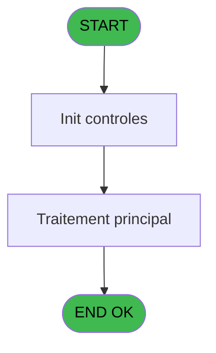
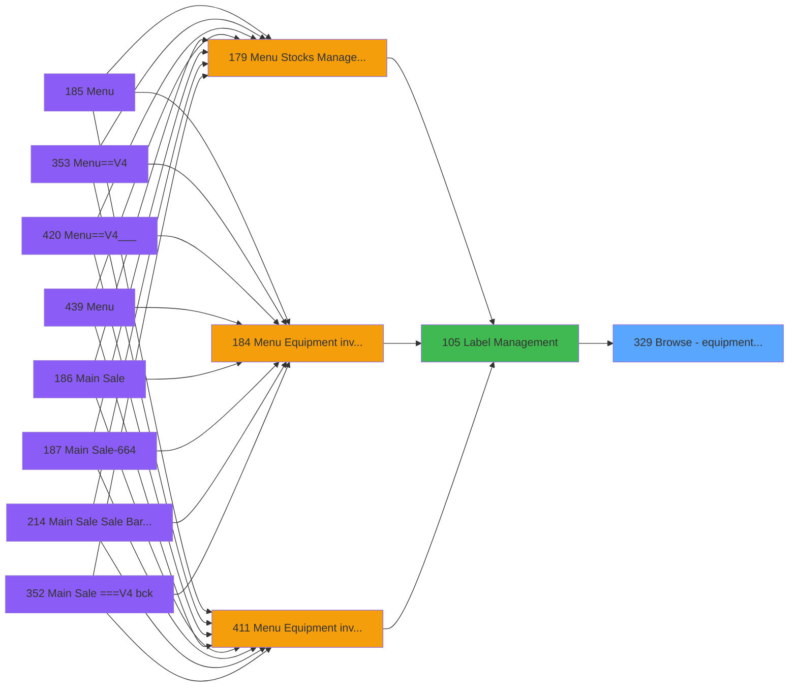

# PVE IDE 329 - Browse - equipment lenght

> **Analyse**: Phases 1-4 2026-02-03 19:37 -> 19:37 (11s) | Assemblage 19:37
> **Pipeline**: V7.2 Enrichi
> **Structure**: 4 onglets (Resume | Ecrans | Donnees | Connexions)

<!-- TAB:Resume -->

## 1. FICHE D'IDENTITE

| Attribut | Valeur |
|----------|--------|
| Projet | PVE |
| IDE Position | 329 |
| Nom Programme | Browse - equipment lenght |
| Fichier source | `Prg_329.xml` |
| Dossier IDE | Zoom |
| Taches | 1 (1 ecrans visibles) |
| Tables modifiees | 0 |
| Programmes appeles | 0 |

## 2. DESCRIPTION FONCTIONNELLE

**Browse - equipment lenght** assure la gestion complete de ce processus, accessible depuis [Label Management (IDE 105)](PVE-IDE-105.md).

Le flux de traitement s'organise en **1 blocs fonctionnels** :

- **Traitement** (1 tache) : traitements metier divers

## 3. BLOCS FONCTIONNELS

### 3.1 Traitement (1 tache)

Traitements internes.

---

#### 329 - Equipment Lenght [[ECRAN]](#ecran-t1)

**Role** : Traitement : Equipment Lenght.
**Ecran** : 517 x 290 DLU (MDI) | [Voir mockup](#ecran-t1)
**Variables liees** : C (p.lenght)

## 5. REGLES METIER

*(Aucune regle metier identifiee)*

## 6. CONTEXTE

- **Appele par**: [Label Management (IDE 105)](PVE-IDE-105.md)
- **Appelle**: 0 programmes | **Tables**: 3 (W:0 R:1 L:2) | **Taches**: 1 | **Expressions**: 6

<!-- TAB:Ecrans -->

## 8. ECRANS

### 8.1 Forms visibles (1 / 1)

| # | Position | Tache | Nom | Type | Largeur | Hauteur | Bloc |
|---|----------|-------|-----|------|---------|---------|------|
| 1 | 329 | 329 | Equipment Lenght | MDI | 517 | 290 | Traitement |

### 8.2 Mockups Ecrans

---

#### 329 - Equipment Lenght
**Tache** : [329](#t1) | **Type** : MDI | **Dimensions** : 517 x 290 DLU
**Bloc** : Traitement | **Titre IDE** : Equipment Lenght

<!-- FORM-DATA:
{
    "width":  517,
    "vFactor":  8,
    "type":  "MDI",
    "hFactor":  4,
    "controls":  [
                     {
                         "x":  18,
                         "type":  "label",
                         "var":  "",
                         "y":  58,
                         "w":  53,
                         "fmt":  "",
                         "name":  "",
                         "h":  13,
                         "color":  "183",
                         "text":  "Type",
                         "parent":  null
                     },
                     {
                         "x":  149,
                         "type":  "label",
                         "var":  "",
                         "y":  58,
                         "w":  97,
                         "fmt":  "",
                         "name":  "",
                         "h":  13,
                         "color":  "183",
                         "text":  "Classification",
                         "parent":  null
                     },
                     {
                         "x":  324,
                         "type":  "label",
                         "var":  "",
                         "y":  58,
                         "w":  53,
                         "fmt":  "",
                         "name":  "",
                         "h":  13,
                         "color":  "183",
                         "text":  "Lenght",
                         "parent":  null
                     },
                     {
                         "x":  373,
                         "type":  "label",
                         "var":  "",
                         "y":  58,
                         "w":  96,
                         "fmt":  "",
                         "name":  "",
                         "h":  13,
                         "color":  "183",
                         "text":  "Equipment Id",
                         "parent":  null
                     },
                     {
                         "x":  1,
                         "type":  "label",
                         "var":  "",
                         "y":  0,
                         "w":  513,
                         "fmt":  "",
                         "name":  "",
                         "h":  42,
                         "color":  "182",
                         "text":  "",
                         "parent":  null
                     },
                     {
                         "x":  14,
                         "type":  "label",
                         "var":  "",
                         "y":  15,
                         "w":  272,
                         "fmt":  "",
                         "name":  "",
                         "h":  10,
                         "color":  "186",
                         "text":  "Select a lenght",
                         "parent":  6
                     },
                     {
                         "x":  14,
                         "type":  "table",
                         "var":  "",
                         "name":  "",
                         "titleH":  12,
                         "color":  "110",
                         "w":  446,
                         "y":  72,
                         "fmt":  "",
                         "parent":  null,
                         "text":  "",
                         "rowH":  28,
                         "h":  169,
                         "cols":  [
                                      {
                                          "title":  "",
                                          "layer":  1,
                                          "w":  132
                                      },
                                      {
                                          "title":  "",
                                          "layer":  2,
                                          "w":  174
                                      },
                                      {
                                          "title":  "",
                                          "layer":  3,
                                          "w":  49
                                      },
                                      {
                                          "title":  "",
                                          "layer":  4,
                                          "w":  88
                                      }
                                  ],
                         "rows":  4
                     },
                     {
                         "x":  1,
                         "type":  "label",
                         "var":  "",
                         "y":  255,
                         "w":  514,
                         "fmt":  "",
                         "name":  "",
                         "h":  34,
                         "color":  "6",
                         "text":  "",
                         "parent":  null
                     },
                     {
                         "x":  18,
                         "type":  "edit",
                         "var":  "",
                         "y":  74,
                         "w":  20,
                         "fmt":  "",
                         "name":  "",
                         "h":  24,
                         "color":  "6",
                         "text":  "",
                         "parent":  null
                     },
                     {
                         "x":  149,
                         "type":  "edit",
                         "var":  "",
                         "y":  74,
                         "w":  20,
                         "fmt":  "",
                         "name":  "",
                         "h":  24,
                         "color":  "110",
                         "text":  "",
                         "parent":  9
                     },
                     {
                         "x":  373,
                         "type":  "edit",
                         "var":  "",
                         "y":  74,
                         "w":  80,
                         "fmt":  "",
                         "name":  "",
                         "h":  24,
                         "color":  "110",
                         "text":  "",
                         "parent":  9
                     },
                     {
                         "x":  324,
                         "type":  "edit",
                         "var":  "",
                         "y":  74,
                         "w":  40,
                         "fmt":  "",
                         "name":  "",
                         "h":  24,
                         "color":  "110",
                         "text":  "",
                         "parent":  9
                     },
                     {
                         "x":  175,
                         "type":  "edit",
                         "var":  "",
                         "y":  74,
                         "w":  140,
                         "fmt":  "",
                         "name":  "",
                         "h":  24,
                         "color":  "110",
                         "text":  "",
                         "parent":  9
                     },
                     {
                         "x":  42,
                         "type":  "edit",
                         "var":  "",
                         "y":  74,
                         "w":  100,
                         "fmt":  "",
                         "name":  "",
                         "h":  24,
                         "color":  "110",
                         "text":  "",
                         "parent":  9
                     },
                     {
                         "x":  460,
                         "type":  "button",
                         "var":  "",
                         "y":  73,
                         "w":  44,
                         "fmt":  "ñ",
                         "name":  "",
                         "h":  86,
                         "color":  "",
                         "text":  "",
                         "parent":  null
                     },
                     {
                         "x":  460,
                         "type":  "button",
                         "var":  "",
                         "y":  159,
                         "w":  44,
                         "fmt":  "ò",
                         "name":  "",
                         "h":  84,
                         "color":  "",
                         "text":  "",
                         "parent":  null
                     },
                     {
                         "x":  360,
                         "type":  "button",
                         "var":  "",
                         "y":  260,
                         "w":  77,
                         "fmt":  "Select",
                         "name":  "",
                         "h":  28,
                         "color":  "",
                         "text":  "",
                         "parent":  null
                     },
                     {
                         "x":  436,
                         "type":  "button",
                         "var":  "",
                         "y":  260,
                         "w":  77,
                         "fmt":  "Cancel",
                         "name":  "",
                         "h":  28,
                         "color":  "",
                         "text":  "",
                         "parent":  null
                     },
                     {
                         "x":  465,
                         "type":  "image",
                         "var":  "",
                         "y":  4,
                         "w":  48,
                         "fmt":  "",
                         "name":  "",
                         "h":  37,
                         "color":  "",
                         "text":  "",
                         "parent":  6
                     }
                 ],
    "taskId":  "329",
    "height":  290
}
-->

<strong>Champs : 6 champs</strong>

| Pos (x,y) | Nom | Variable | Type |
|-----------|-----|----------|------|
| 18,74 | (sans nom) | - | edit |
| 149,74 | (sans nom) | - | edit |
| 373,74 | (sans nom) | - | edit |
| 324,74 | (sans nom) | - | edit |
| 175,74 | (sans nom) | - | edit |
| 42,74 | (sans nom) | - | edit |

<strong>Boutons : 4 boutons</strong>

| Bouton | Pos (x,y) | Action |
|--------|-----------|--------|
| ñ | 460,73 | Bouton fonctionnel |
| ò | 460,159 | Bouton fonctionnel |
| Select | 360,260 | Ouvre la selection |
| Cancel | 436,260 | Annule et retour au menu |

## 9. NAVIGATION

Ecran unique: **Equipment Lenght**

### 9.3 Structure hierarchique (1 tache)

| Position | Tache | Type | Dimensions | Bloc |
|----------|-------|------|------------|------|
| **329.1** | [**Equipment Lenght** (329)](#t1) [mockup](#ecran-t1) | MDI | 517x290 | Traitement |

### 9.4 Algorigramme

> **Legende**: Vert = START/END OK | Rouge = END KO | Bleu = Decisions
> *Algorigramme auto-genere. Utiliser `/algorigramme` pour une synthese metier detaillee.*

<!-- TAB:Donnees -->

## 10. TABLES

### Tables utilisees (3)

| ID | Nom | Description | Type | R | W | L | Usages |
|----|-----|-------------|------|---|---|---|--------|
| 380 | pv_day_modes |  | DB |   |   | L | 1 |
| 389 | pv_equipment_inventory |  | DB | R |   |   | 1 |
| 419 | realise_articles_caution | Articles et stock | DB |   |   | L | 1 |

### Colonnes par table (1 / 1 tables avec colonnes identifiees)

Table 389 - pv_equipment_inventory (R) - 1 usages

| Lettre | Variable | Acces | Type |
|--------|----------|-------|------|
| A | p.type matos | R | Numeric |
| B | p.classification | R | Numeric |
| C | p.lenght | R | Numeric |

## 11. VARIABLES

### 11.1 Parametres entrants (3)

Variables recues du programme appelant ([Label Management (IDE 105)](PVE-IDE-105.md)).

| Lettre | Nom | Type | Usage dans |
|--------|-----|------|-----------|
| A | p.type matos | Numeric | 1x parametre entrant |
| B | p.classification | Numeric | 1x parametre entrant |
| C | p.lenght | Numeric | - |

## 12. EXPRESSIONS

**6 / 6 expressions decodees (100%)**

### 12.1 Repartition par type

| Type | Expressions | Regles |
|------|-------------|--------|
| OTHER | 4 | 0 |
| CONDITION | 2 | 0 |

### 12.2 Expressions cles par type

#### OTHER (4 expressions)

| Type | IDE | Expression | Regle |
|------|-----|------------|-------|
| OTHER | 5 | `[F]` | - |
| OTHER | 6 | `[E]` | - |
| OTHER | 1 | `GetParam ('SERVICE')` | - |
| OTHER | 4 | `[I]` | - |

#### CONDITION (2 expressions)

| Type | IDE | Expression | Regle |
|------|-----|------------|-------|
| CONDITION | 3 | `CndRange (p.classification [B]<>0,p.classification [B])` | - |
| CONDITION | 2 | `CndRange (p.type matos [A]<>0,p.type matos [A])` | - |

<!-- TAB:Connexions -->

## 13. GRAPHE D'APPELS

### 13.1 Chaine depuis Main (Callers)

Main -> ... -> [Label Management (IDE 105)](PVE-IDE-105.md) -> **Browse - equipment lenght (IDE 329)**

### 13.2 Callers

| IDE | Nom Programme | Nb Appels |
|-----|---------------|-----------|
| [105](PVE-IDE-105.md) | Label Management | 1 |

### 13.3 Callees (programmes appeles)

### 13.4 Detail Callees avec contexte

| IDE | Nom Programme | Appels | Contexte |
|-----|---------------|--------|----------|
| - | (aucun) | - | - |

## 14. RECOMMANDATIONS MIGRATION

### 14.1 Profil du programme

| Metrique | Valeur | Impact migration |
|----------|--------|-----------------|
| Lignes de logique | 25 | Programme compact |
| Expressions | 6 | Peu de logique |
| Tables WRITE | 0 | Impact faible |
| Sous-programmes | 0 | Peu de dependances |
| Ecrans visibles | 1 | Ecran unique ou traitement batch |
| Code desactive | 0% (0 / 25) | Code sain |
| Regles metier | 0 | Pas de regle identifiee |

### 14.2 Plan de migration par bloc

#### Traitement (1 tache: 1 ecran, 0 traitement)

- **Strategie** : 1 composant(s) UI (Razor/React) avec formulaires et validation.
- Decomposer les taches en services unitaires testables.

### 14.3 Dependances critiques

| Dependance | Type | Appels | Impact |
|------------|------|--------|--------|

---
*Spec DETAILED generee par Pipeline V7.2 - 2026-02-03 19:37*
