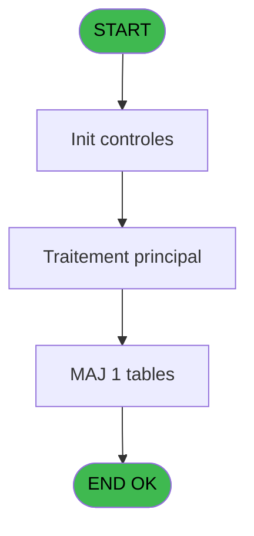
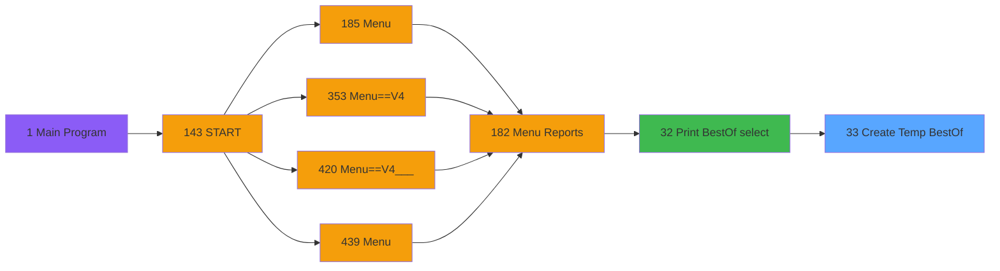

# PVE IDE 33 - Create Temp BestOf

> **Analyse**: Phases 1-4 2026-02-03 01:20 -> 01:20 (33s) | Assemblage 01:20
> **Pipeline**: V7.2 Enrichi
> **Structure**: 4 onglets (Resume | Ecrans | Donnees | Connexions)

<!-- TAB:Resume -->

## 1. FICHE D'IDENTITE

| Attribut | Valeur |
|----------|--------|
| Projet | PVE |
| IDE Position | 33 |
| Nom Programme | Create Temp BestOf |
| Fichier source | `Prg_33.xml` |
| Domaine metier | General |
| Taches | 5 (0 ecrans visibles) |
| Tables modifiees | 1 |
| Programmes appeles | 0 |

## 2. DESCRIPTION FONCTIONNELLE

**Create Temp BestOf** assure la gestion complete de ce processus, accessible depuis [Print BestOf (select) (IDE 32)](PVE-IDE-32.md).

Le flux de traitement s'organise en **2 blocs fonctionnels** :

- **Creation** (3 taches) : insertion d'enregistrements en base (mouvements, prestations)
- **Consultation** (2 taches) : ecrans de recherche, selection et consultation

**Donnees modifiees** : 1 tables en ecriture (tempo_listing_comptable).

Detail : phases du traitement

#### Phase 1 : Creation (3 taches)

- **33** - Create Temp BestOf
- **33.1.1** - Create Temp
- **33.2.1** - Create Temp

#### Phase 2 : Consultation (2 taches)

- **33.1** - Select rented
- **33.2** - Select not rented

#### Tables impactees

| Table | Operations | Role metier |
|-------|-----------|-------------|
| tempo_listing_comptable | **W**/L (4 usages) | Table temporaire ecran |

## 3. BLOCS FONCTIONNELS

### 3.1 Creation (3 taches)

Insertion de nouveaux enregistrements en base.

---

#### 33 - Create Temp BestOf

**Role** : Traitement : Create Temp BestOf.

---

#### 33.1.1 - Create Temp

**Role** : Traitement : Create Temp.

---

#### 33.2.1 - Create Temp

**Role** : Traitement : Create Temp.

### 3.2 Consultation (2 taches)

Ecrans de recherche et consultation.

---

#### 33.1 - Select rented

**Role** : Traitement : Select rented.
**Variables liees** : C (p. rented)

---

#### 33.2 - Select not rented

**Role** : Traitement : Select not rented.
**Variables liees** : C (p. rented)

## 5. REGLES METIER

*(Aucune regle metier identifiee)*

## 6. CONTEXTE

- **Appele par**: [Print BestOf (select) (IDE 32)](PVE-IDE-32.md)
- **Appelle**: 0 programmes | **Tables**: 6 (W:1 R:1 L:5) | **Taches**: 5 | **Expressions**: 4

<!-- TAB:Ecrans -->

## 8. ECRANS

*(Programme sans ecran visible)*

## 9. NAVIGATION

### 9.3 Structure hierarchique (5 taches)

| Position | Tache | Type | Dimensions | Bloc |
|----------|-------|------|------------|------|
| **33.1** | [**Create Temp BestOf** (33)](#t1) | MDI | - | Creation |
| 33.1.1 | [Create Temp (33.1.1)](#t3) | MDI | - | |
| 33.1.2 | [Create Temp (33.2.1)](#t5) | MDI | - | |
| **33.2** | [**Select rented** (33.1)](#t2) | MDI | - | Consultation |
| 33.2.1 | [Select not rented (33.2)](#t4) | MDI | - | |

### 9.4 Algorigramme

> **Legende**: Vert = START/END OK | Rouge = END KO | Bleu = Decisions
> *Algorigramme auto-genere. Utiliser `/algorigramme` pour une synthese metier detaillee.*

<!-- TAB:Donnees -->

## 10. TABLES

### Tables utilisees (6)

| ID | Nom | Description | Type | R | W | L | Usages |
|----|-----|-------------|------|---|---|---|--------|
| 389 | pv_equipment_inventory |  | DB | R |   |   | 2 |
| 525 | update_table_ensemble |  | TMP |   |   | L | 2 |
| 532 | edition_cloture_service | Donnees reseau/cloture | TMP |   |   | L | 2 |
| 535 | tempo_listing_comptable | Table temporaire ecran | TMP |   | **W** | L | 4 |
| 537 | sous-imputation_sup_100 |  | TMP |   |   | L | 1 |
| 1469 | Table_1469 |  | MEM |   |   | L | 1 |

### Colonnes par table (1 / 2 tables avec colonnes identifiees)

Table 389 - pv_equipment_inventory (R) - 2 usages

| Lettre | Variable | Acces | Type |
|--------|----------|-------|------|
| A | v. retour class | R | Logical |
| B | v. retour model | R | Logical |
| C | v. retour model | R | Logical |

Table 535 - tempo_listing_comptable (**W**/L) - 4 usages

*Table utilisee uniquement en Link ou aucune colonne Real identifiee dans le DataView.*

## 11. VARIABLES

### 11.1 Parametres entrants (6)

Variables recues du programme appelant ([Print BestOf (select) (IDE 32)](PVE-IDE-32.md)).

| Lettre | Nom | Type | Usage dans |
|--------|-----|------|-----------|
| A | p. date mini | Date | - |
| B | p. date maxi | Date | - |
| C | p. rented | Alpha | [33.1](#t2), [33.2](#t4) |
| D | p. owner | Numeric | - |
| E | p. length | Numeric | - |
| F | po.resultat? | Logical | 1x parametre entrant |

## 12. EXPRESSIONS

**4 / 4 expressions decodees (100%)**

### 12.1 Repartition par type

| Type | Expressions | Regles |
|------|-------------|--------|
| NEGATION | 1 | 0 |
| OTHER | 1 | 0 |
| CONDITION | 2 | 0 |

### 12.2 Expressions cles par type

#### NEGATION (1 expressions)

| Type | IDE | Expression | Regle |
|------|-----|------------|-------|
| NEGATION | 3 | `NOT (po.resultat? [F])` | - |

#### OTHER (1 expressions)

| Type | IDE | Expression | Regle |
|------|-----|------------|-------|
| OTHER | 4 | `SetCrsr (1)` | - |

#### CONDITION (2 expressions)

| Type | IDE | Expression | Regle |
|------|-----|------------|-------|
| CONDITION | 2 | `Trim (p. rented [C])<>'Y'` | - |
| CONDITION | 1 | `Trim (p. rented [C])<>'N'` | - |

<!-- TAB:Connexions -->

## 13. GRAPHE D'APPELS

### 13.1 Chaine depuis Main (Callers)

Main -> ... -> [Print BestOf (select) (IDE 32)](PVE-IDE-32.md) -> **Create Temp BestOf (IDE 33)**

### 13.2 Callers

| IDE | Nom Programme | Nb Appels |
|-----|---------------|-----------|
| [32](PVE-IDE-32.md) | Print BestOf (select) | 1 |

### 13.3 Callees (programmes appeles)

### 13.4 Detail Callees avec contexte

| IDE | Nom Programme | Appels | Contexte |
|-----|---------------|--------|----------|
| - | (aucun) | - | - |

## 14. RECOMMANDATIONS MIGRATION

### 14.1 Profil du programme

| Metrique | Valeur | Impact migration |
|----------|--------|-----------------|
| Lignes de logique | 104 | Programme compact |
| Expressions | 4 | Peu de logique |
| Tables WRITE | 1 | Impact faible |
| Sous-programmes | 0 | Peu de dependances |
| Ecrans visibles | 0 | Ecran unique ou traitement batch |
| Code desactive | 0% (0 / 104) | Code sain |
| Regles metier | 0 | Pas de regle identifiee |

### 14.2 Plan de migration par bloc

#### Creation (3 taches: 0 ecran, 3 traitements)

- **Strategie** : Repository pattern avec Entity Framework Core.
- Insertion via `IRepository<T>.CreateAsync()`

#### Consultation (2 taches: 0 ecran, 2 traitements)

- **Strategie** : Composants de recherche/selection en modales.

### 14.3 Dependances critiques

| Dependance | Type | Appels | Impact |
|------------|------|--------|--------|
| tempo_listing_comptable | Table WRITE (Temp) | 2x | Schema + repository |

---
*Spec DETAILED generee par Pipeline V7.2 - 2026-02-03 01:20*
