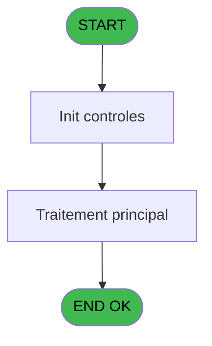
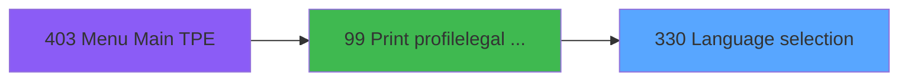
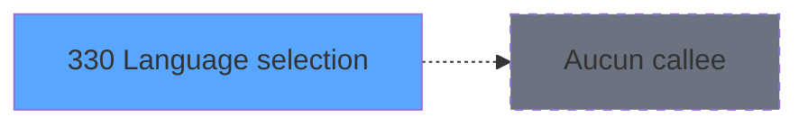

# PVE IDE 330 - Language selection

> **Analyse**: Phases 1-4 2026-02-03 19:37 -> 19:37 (11s) | Assemblage 19:37
> **Pipeline**: V7.2 Enrichi
> **Structure**: 4 onglets (Resume | Ecrans | Donnees | Connexions)

<!-- TAB:Resume -->

## 1. FICHE D'IDENTITE

| Attribut | Valeur |
|----------|--------|
| Projet | PVE |
| IDE Position | 330 |
| Nom Programme | Language selection |
| Fichier source | `Prg_330.xml` |
| Dossier IDE | Zoom |
| Taches | 1 (1 ecrans visibles) |
| Tables modifiees | 0 |
| Programmes appeles | 0 |

## 2. DESCRIPTION FONCTIONNELLE

**Language selection** assure la gestion complete de ce processus, accessible depuis [Print profile/legal form (IDE 99)](PVE-IDE-99.md).

Le flux de traitement s'organise en **1 blocs fonctionnels** :

- **Traitement** (1 tache) : traitements metier divers

## 3. BLOCS FONCTIONNELS

### 3.1 Traitement (1 tache)

Traitements internes.

---

#### 330 - language [[ECRAN]](#ecran-t1)

**Role** : Traitement : language.
**Ecran** : 428 x 233 DLU (MDI) | [Voir mockup](#ecran-t1)
**Variables liees** : A (v.language)

## 5. REGLES METIER

*(Aucune regle metier identifiee)*

## 6. CONTEXTE

- **Appele par**: [Print profile/legal form (IDE 99)](PVE-IDE-99.md)
- **Appelle**: 0 programmes | **Tables**: 0 (W:0 R:0 L:0) | **Taches**: 1 | **Expressions**: 1

<!-- TAB:Ecrans -->

## 8. ECRANS

### 8.1 Forms visibles (1 / 1)

| # | Position | Tache | Nom | Type | Largeur | Hauteur | Bloc |
|---|----------|-------|-----|------|---------|---------|------|
| 1 | 330 | 330 | language | MDI | 428 | 233 | Traitement |

### 8.2 Mockups Ecrans

---

#### 330 - language
**Tache** : [330](#t1) | **Type** : MDI | **Dimensions** : 428 x 233 DLU
**Bloc** : Traitement | **Titre IDE** : language

<!-- FORM-DATA:
{
    "width":  428,
    "vFactor":  8,
    "type":  "MDI",
    "hFactor":  4,
    "controls":  [
                     {
                         "x":  11,
                         "type":  "label",
                         "var":  "",
                         "y":  46,
                         "w":  400,
                         "fmt":  "",
                         "name":  "",
                         "h":  26,
                         "color":  "63",
                         "text":  "Please, select which language the waiver form has to be printed in.",
                         "parent":  null
                     },
                     {
                         "x":  0,
                         "type":  "label",
                         "var":  "",
                         "y":  0,
                         "w":  425,
                         "fmt":  "",
                         "name":  "",
                         "h":  32,
                         "color":  "182",
                         "text":  "",
                         "parent":  null
                     },
                     {
                         "x":  11,
                         "type":  "label",
                         "var":  "",
                         "y":  9,
                         "w":  380,
                         "fmt":  "",
                         "name":  "",
                         "h":  13,
                         "color":  "186",
                         "text":  "Language selection",
                         "parent":  6
                     },
                     {
                         "x":  0,
                         "type":  "label",
                         "var":  "",
                         "y":  194,
                         "w":  425,
                         "fmt":  "",
                         "name":  "",
                         "h":  36,
                         "color":  "6",
                         "text":  "",
                         "parent":  null
                     },
                     {
                         "x":  10,
                         "type":  "button",
                         "var":  "",
                         "y":  142,
                         "w":  93,
                         "fmt":  "English",
                         "name":  "ENG",
                         "h":  30,
                         "color":  "",
                         "text":  "",
                         "parent":  null
                     },
                     {
                         "x":  113,
                         "type":  "button",
                         "var":  "",
                         "y":  142,
                         "w":  93,
                         "fmt":  "\\Francais",
                         "name":  "FRE",
                         "h":  30,
                         "color":  "",
                         "text":  "",
                         "parent":  null
                     },
                     {
                         "x":  216,
                         "type":  "button",
                         "var":  "",
                         "y":  142,
                         "w":  93,
                         "fmt":  "Espanol",
                         "name":  "SPA",
                         "h":  30,
                         "color":  "",
                         "text":  "",
                         "parent":  null
                     },
                     {
                         "x":  319,
                         "type":  "button",
                         "var":  "",
                         "y":  142,
                         "w":  93,
                         "fmt":  "Portuguese",
                         "name":  "POR",
                         "h":  30,
                         "color":  "",
                         "text":  "",
                         "parent":  null
                     },
                     {
                         "x":  113,
                         "type":  "image",
                         "var":  "",
                         "y":  86,
                         "w":  92,
                         "fmt":  "",
                         "name":  "",
                         "h":  51,
                         "color":  "6",
                         "text":  "",
                         "parent":  null
                     },
                     {
                         "x":  217,
                         "type":  "image",
                         "var":  "",
                         "y":  86,
                         "w":  92,
                         "fmt":  "",
                         "name":  "",
                         "h":  51,
                         "color":  "6",
                         "text":  "",
                         "parent":  null
                     },
                     {
                         "x":  320,
                         "type":  "image",
                         "var":  "",
                         "y":  86,
                         "w":  92,
                         "fmt":  "",
                         "name":  "",
                         "h":  51,
                         "color":  "6",
                         "text":  "",
                         "parent":  null
                     },
                     {
                         "x":  332,
                         "type":  "button",
                         "var":  "",
                         "y":  199,
                         "w":  93,
                         "fmt":  "\u0026Exit",
                         "name":  "",
                         "h":  30,
                         "color":  "",
                         "text":  "",
                         "parent":  null
                     },
                     {
                         "x":  11,
                         "type":  "image",
                         "var":  "",
                         "y":  86,
                         "w":  92,
                         "fmt":  "",
                         "name":  "",
                         "h":  51,
                         "color":  "6",
                         "text":  "",
                         "parent":  null
                     }
                 ],
    "taskId":  "330",
    "height":  233
}
-->

<strong>Boutons : 5 boutons</strong>

| Bouton | Pos (x,y) | Action |
|--------|-----------|--------|
| English | 10,142 | Bouton fonctionnel |
| \Francais | 113,142 | Bouton fonctionnel |
| Espanol | 216,142 | Bouton fonctionnel |
| Portuguese | 319,142 | Bouton fonctionnel |
| Exit | 332,199 | Quitte le programme |

## 9. NAVIGATION

Ecran unique: **language**

### 9.3 Structure hierarchique (1 tache)

| Position | Tache | Type | Dimensions | Bloc |
|----------|-------|------|------------|------|
| **330.1** | [**language** (330)](#t1) [mockup](#ecran-t1) | MDI | 428x233 | Traitement |

### 9.4 Algorigramme

> **Legende**: Vert = START/END OK | Rouge = END KO | Bleu = Decisions
> *Algorigramme auto-genere. Utiliser `/algorigramme` pour une synthese metier detaillee.*

<!-- TAB:Donnees -->

## 10. TABLES

### Tables utilisees (0)

| ID | Nom | Description | Type | R | W | L | Usages |
|----|-----|-------------|------|---|---|---|--------|

### Colonnes par table (0 / 0 tables avec colonnes identifiees)

## 11. VARIABLES

### 11.1 Variables de session (1)

Variables persistantes pendant toute la session.

| Lettre | Nom | Type | Usage dans |
|--------|-----|------|-----------|
| A | v.language | Alpha | - |

### 11.2 Autres (4)

Variables diverses.

| Lettre | Nom | Type | Usage dans |
|--------|-----|------|-----------|
| B | btn 1 | Alpha | - |
| C | btn 2 | Alpha | - |
| D | btn 3 | Alpha | - |
| E | btn 4 | Alpha | - |

## 12. EXPRESSIONS

**1 / 1 expressions decodees (100%)**

### 12.1 Repartition par type

| Type | Expressions | Regles |
|------|-------------|--------|
| OTHER | 1 | 0 |

### 12.2 Expressions cles par type

#### OTHER (1 expressions)

| Type | IDE | Expression | Regle |
|------|-----|------------|-------|
| OTHER | 1 | `LastClicked ()` | - |

<!-- TAB:Connexions -->

## 13. GRAPHE D'APPELS

### 13.1 Chaine depuis Main (Callers)

Main -> ... -> [Print profile/legal form (IDE 99)](PVE-IDE-99.md) -> **Language selection (IDE 330)**

### 13.2 Callers

| IDE | Nom Programme | Nb Appels |
|-----|---------------|-----------|
| [99](PVE-IDE-99.md) | Print profile/legal form | 1 |

### 13.3 Callees (programmes appeles)

### 13.4 Detail Callees avec contexte

| IDE | Nom Programme | Appels | Contexte |
|-----|---------------|--------|----------|
| - | (aucun) | - | - |

## 14. RECOMMANDATIONS MIGRATION

### 14.1 Profil du programme

| Metrique | Valeur | Impact migration |
|----------|--------|-----------------|
| Lignes de logique | 8 | Programme compact |
| Expressions | 1 | Peu de logique |
| Tables WRITE | 0 | Impact faible |
| Sous-programmes | 0 | Peu de dependances |
| Ecrans visibles | 1 | Ecran unique ou traitement batch |
| Code desactive | 0% (0 / 8) | Code sain |
| Regles metier | 0 | Pas de regle identifiee |

### 14.2 Plan de migration par bloc

#### Traitement (1 tache: 1 ecran, 0 traitement)

- **Strategie** : 1 composant(s) UI (Razor/React) avec formulaires et validation.
- Decomposer les taches en services unitaires testables.

### 14.3 Dependances critiques

| Dependance | Type | Appels | Impact |
|------------|------|--------|--------|

---
*Spec DETAILED generee par Pipeline V7.2 - 2026-02-03 19:37*
