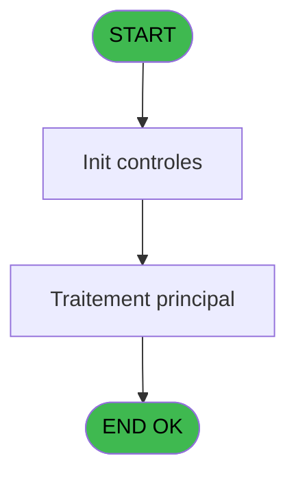
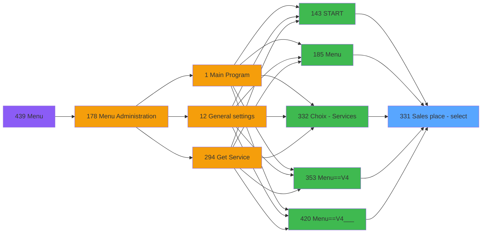

# PVE IDE 331 - Sales place - select

> **Analyse**: Phases 1-4 2026-02-03 19:37 -> 19:38 (13s) | Assemblage 19:38
> **Pipeline**: V7.2 Enrichi
> **Structure**: 4 onglets (Resume | Ecrans | Donnees | Connexions)

<!-- TAB:Resume -->

## 1. FICHE D'IDENTITE

| Attribut | Valeur |
|----------|--------|
| Projet | PVE |
| IDE Position | 331 |
| Nom Programme | Sales place - select |
| Fichier source | `Prg_331.xml` |
| Dossier IDE | Zoom |
| Taches | 1 (1 ecrans visibles) |
| Tables modifiees | 0 |
| Programmes appeles | 0 |

## 2. DESCRIPTION FONCTIONNELLE

**Sales place - select** assure la gestion complete de ce processus, accessible depuis [START (IDE 143)](PVE-IDE-143.md), [Menu (IDE 185)](PVE-IDE-185.md), [Choix - Services (IDE 332)](PVE-IDE-332.md), [Menu==V4 (IDE 353)](PVE-IDE-353.md), [Menu==V4___ (IDE 420)](PVE-IDE-420.md), [Menu (IDE 439)](PVE-IDE-439.md).

Le flux de traitement s'organise en **1 blocs fonctionnels** :

- **Traitement** (1 tache) : traitements metier divers

## 3. BLOCS FONCTIONNELS

### 3.1 Traitement (1 tache)

Traitements internes.

---

#### 331 - Sales place [[ECRAN]](#ecran-t1)

**Role** : Traitement : Sales place.
**Ecran** : 558 x 326 DLU (MDI) | [Voir mockup](#ecran-t1)

## 5. REGLES METIER

*(Aucune regle metier identifiee)*

## 6. CONTEXTE

- **Appele par**: [START (IDE 143)](PVE-IDE-143.md), [Menu (IDE 185)](PVE-IDE-185.md), [Choix - Services (IDE 332)](PVE-IDE-332.md), [Menu==V4 (IDE 353)](PVE-IDE-353.md), [Menu==V4___ (IDE 420)](PVE-IDE-420.md), [Menu (IDE 439)](PVE-IDE-439.md)
- **Appelle**: 0 programmes | **Tables**: 1 (W:0 R:1 L:0) | **Taches**: 1 | **Expressions**: 4

<!-- TAB:Ecrans -->

## 8. ECRANS

### 8.1 Forms visibles (1 / 1)

| # | Position | Tache | Nom | Type | Largeur | Hauteur | Bloc |
|---|----------|-------|-----|------|---------|---------|------|
| 1 | 331 | 331 | Sales place | MDI | 558 | 326 | Traitement |

### 8.2 Mockups Ecrans

---

#### 331 - Sales place
**Tache** : [331](#t1) | **Type** : MDI | **Dimensions** : 558 x 326 DLU
**Bloc** : Traitement | **Titre IDE** : Sales place

<!-- FORM-DATA:
{
    "width":  558,
    "vFactor":  8,
    "type":  "MDI",
    "hFactor":  4,
    "controls":  [
                     {
                         "x":  15,
                         "type":  "label",
                         "var":  "",
                         "y":  50,
                         "w":  99,
                         "fmt":  "",
                         "name":  "",
                         "h":  9,
                         "color":  "183",
                         "text":  "Place name",
                         "parent":  null
                     },
                     {
                         "x":  0,
                         "type":  "label",
                         "var":  "",
                         "y":  0,
                         "w":  557,
                         "fmt":  "",
                         "name":  "",
                         "h":  42,
                         "color":  "182",
                         "text":  "",
                         "parent":  null
                     },
                     {
                         "x":  16,
                         "type":  "label",
                         "var":  "",
                         "y":  15,
                         "w":  367,
                         "fmt":  "",
                         "name":  "",
                         "h":  10,
                         "color":  "186",
                         "text":  "Select sales place",
                         "parent":  2
                     },
                     {
                         "x":  15,
                         "type":  "table",
                         "var":  "",
                         "name":  "",
                         "titleH":  12,
                         "color":  "110",
                         "w":  487,
                         "y":  65,
                         "fmt":  "",
                         "parent":  null,
                         "text":  "",
                         "rowH":  30,
                         "h":  260,
                         "cols":  [
                                      {
                                          "title":  "",
                                          "layer":  1,
                                          "w":  474
                                      }
                                  ],
                         "rows":  1
                     },
                     {
                         "x":  18,
                         "type":  "button",
                         "var":  "",
                         "y":  79,
                         "w":  474,
                         "fmt":  "",
                         "name":  "",
                         "h":  28,
                         "color":  "",
                         "text":  "",
                         "parent":  5
                     },
                     {
                         "x":  507,
                         "type":  "image",
                         "var":  "",
                         "y":  3,
                         "w":  48,
                         "fmt":  "",
                         "name":  "",
                         "h":  37,
                         "color":  "",
                         "text":  "",
                         "parent":  2
                     },
                     {
                         "x":  504,
                         "type":  "button",
                         "var":  "",
                         "y":  66,
                         "w":  52,
                         "fmt":  "ñ",
                         "name":  "",
                         "h":  127,
                         "color":  "",
                         "text":  "",
                         "parent":  null
                     },
                     {
                         "x":  504,
                         "type":  "button",
                         "var":  "",
                         "y":  193,
                         "w":  52,
                         "fmt":  "ò",
                         "name":  "",
                         "h":  128,
                         "color":  "",
                         "text":  "",
                         "parent":  null
                     }
                 ],
    "taskId":  "331",
    "height":  326
}
-->

<strong>Boutons : 3 boutons</strong>

| Bouton | Pos (x,y) | Action |
|--------|-----------|--------|
| (sans nom) | 18,79 | Action declenchee |
| ñ | 504,66 | Bouton fonctionnel |
| ò | 504,193 | Bouton fonctionnel |

## 9. NAVIGATION

Ecran unique: **Sales place**

### 9.3 Structure hierarchique (1 tache)

| Position | Tache | Type | Dimensions | Bloc |
|----------|-------|------|------------|------|
| **331.1** | [**Sales place** (331)](#t1) [mockup](#ecran-t1) | MDI | 558x326 | Traitement |

### 9.4 Algorigramme

> **Legende**: Vert = START/END OK | Rouge = END KO | Bleu = Decisions
> *Algorigramme auto-genere. Utiliser `/algorigramme` pour une synthese metier detaillee.*

<!-- TAB:Donnees -->

## 10. TABLES

### Tables utilisees (1)

| ID | Nom | Description | Type | R | W | L | Usages |
|----|-----|-------------|------|---|---|---|--------|
| 766 | temp_forfait_ski |  | DB | R |   |   | 1 |

### Colonnes par table (0 / 1 tables avec colonnes identifiees)

Table 766 - temp_forfait_ski (R) - 1 usages

*Table utilisee uniquement en Link ou aucune colonne Real identifiee dans le DataView.*

## 11. VARIABLES

*(Programme sans variables locales mappees)*

## 12. EXPRESSIONS

**4 / 4 expressions decodees (100%)**

### 12.1 Repartition par type

| Type | Expressions | Regles |
|------|-------------|--------|
| CONSTANTE | 1 | 0 |
| OTHER | 3 | 0 |

### 12.2 Expressions cles par type

#### CONSTANTE (1 expressions)

| Type | IDE | Expression | Regle |
|------|-----|------------|-------|
| CONSTANTE | 4 | `'O'` | - |

#### OTHER (3 expressions)

| Type | IDE | Expression | Regle |
|------|-----|------------|-------|
| OTHER | 3 | `[C]` | - |
| OTHER | 2 | `[B]` | - |
| OTHER | 1 | `GetParam ('SERVICE')` | - |

<!-- TAB:Connexions -->

## 13. GRAPHE D'APPELS

### 13.1 Chaine depuis Main (Callers)

Main -> ... -> [START (IDE 143)](PVE-IDE-143.md) -> **Sales place - select (IDE 331)**

Main -> ... -> [Menu (IDE 185)](PVE-IDE-185.md) -> **Sales place - select (IDE 331)**

Main -> ... -> [Choix - Services (IDE 332)](PVE-IDE-332.md) -> **Sales place - select (IDE 331)**

Main -> ... -> [Menu==V4 (IDE 353)](PVE-IDE-353.md) -> **Sales place - select (IDE 331)**

Main -> ... -> [Menu==V4___ (IDE 420)](PVE-IDE-420.md) -> **Sales place - select (IDE 331)**

Main -> ... -> [Menu (IDE 439)](PVE-IDE-439.md) -> **Sales place - select (IDE 331)**

### 13.2 Callers

| IDE | Nom Programme | Nb Appels |
|-----|---------------|-----------|
| [143](PVE-IDE-143.md) | START | 1 |
| [185](PVE-IDE-185.md) | Menu | 1 |
| [332](PVE-IDE-332.md) | Choix - Services | 1 |
| [353](PVE-IDE-353.md) | Menu==V4 | 1 |
| [420](PVE-IDE-420.md) | Menu==V4___ | 1 |
| [439](PVE-IDE-439.md) | Menu | 1 |

### 13.3 Callees (programmes appeles)

### 13.4 Detail Callees avec contexte

| IDE | Nom Programme | Appels | Contexte |
|-----|---------------|--------|----------|
| - | (aucun) | - | - |

## 14. RECOMMANDATIONS MIGRATION

### 14.1 Profil du programme

| Metrique | Valeur | Impact migration |
|----------|--------|-----------------|
| Lignes de logique | 9 | Programme compact |
| Expressions | 4 | Peu de logique |
| Tables WRITE | 0 | Impact faible |
| Sous-programmes | 0 | Peu de dependances |
| Ecrans visibles | 1 | Ecran unique ou traitement batch |
| Code desactive | 0% (0 / 9) | Code sain |
| Regles metier | 0 | Pas de regle identifiee |

### 14.2 Plan de migration par bloc

#### Traitement (1 tache: 1 ecran, 0 traitement)

- **Strategie** : 1 composant(s) UI (Razor/React) avec formulaires et validation.
- Decomposer les taches en services unitaires testables.

### 14.3 Dependances critiques

| Dependance | Type | Appels | Impact |
|------------|------|--------|--------|

---
*Spec DETAILED generee par Pipeline V7.2 - 2026-02-03 19:38*
