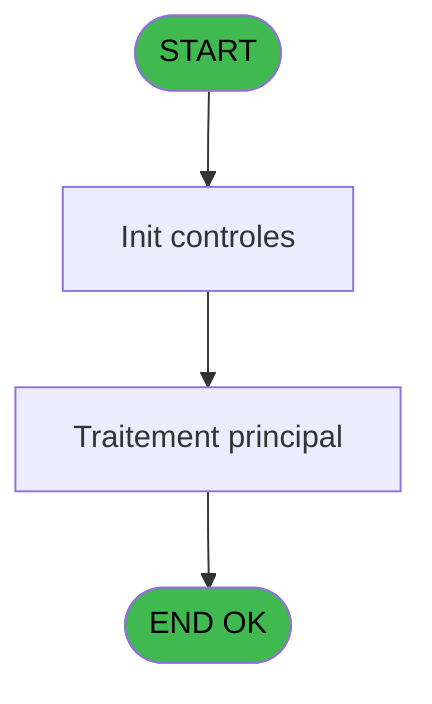
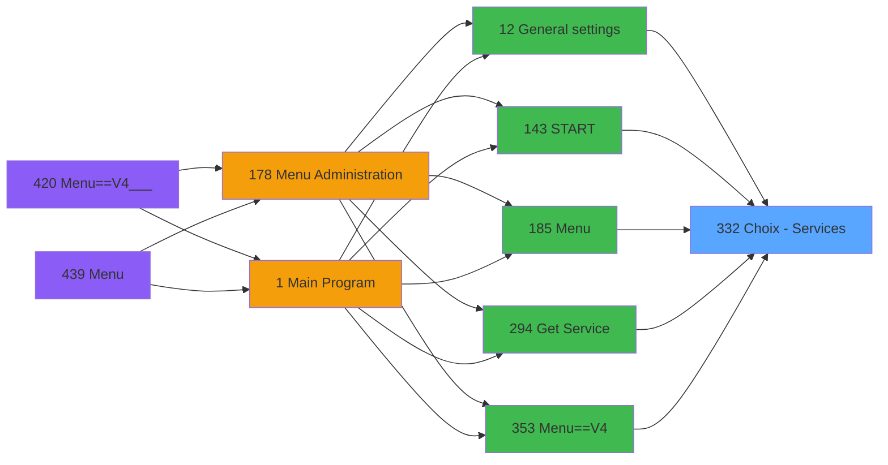
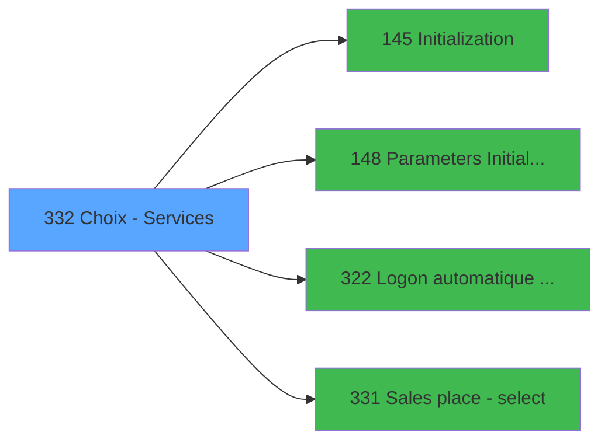

# PVE IDE 332 - Choix - Services

> **Analyse**: Phases 1-4 2026-02-03 19:38 -> 19:38 (12s) | Assemblage 19:38
> **Pipeline**: V7.2 Enrichi
> **Structure**: 4 onglets (Resume | Ecrans | Donnees | Connexions)

<!-- TAB:Resume -->

## 1. FICHE D'IDENTITE

| Attribut | Valeur |
|----------|--------|
| Projet | PVE |
| IDE Position | 332 |
| Nom Programme | Choix - Services |
| Fichier source | `Prg_332.xml` |
| Dossier IDE | Zoom |
| Taches | 3 (1 ecrans visibles) |
| Tables modifiees | 0 |
| Programmes appeles | 4 |

## 2. DESCRIPTION FONCTIONNELLE

**Choix - Services** assure la gestion complete de ce processus, accessible depuis [General settings (IDE 12)](PVE-IDE-12.md), [START (IDE 143)](PVE-IDE-143.md), [Menu (IDE 185)](PVE-IDE-185.md), [Get Service (IDE 294)](PVE-IDE-294.md), [Menu==V4 (IDE 353)](PVE-IDE-353.md), [General settings (IDE 408)](PVE-IDE-408.md), [Menu==V4___ (IDE 420)](PVE-IDE-420.md), [Menu (IDE 439)](PVE-IDE-439.md).

Le flux de traitement s'organise en **2 blocs fonctionnels** :

- **Traitement** (2 taches) : traitements metier divers
- **Validation** (1 tache) : controles et verifications de coherence

Detail : phases du traitement

#### Phase 1 : Traitement (2 taches)

- **332** - Accounting services list **[[ECRAN]](#ecran-t1)**
- **332.1** - Existe vendeur

Delegue a : [Logon automatique si DSI (IDE 322)](PVE-IDE-322.md)

#### Phase 2 : Validation (1 tache)

- **332.2** - verif lieu

## 3. BLOCS FONCTIONNELS

### 3.1 Traitement (2 taches)

Traitements internes.

---

#### 332 - Accounting services list [[ECRAN]](#ecran-t1)

**Role** : Traitement : Accounting services list.
**Ecran** : 362 x 310 DLU (Type6) | [Voir mockup](#ecran-t1)
**Delegue a** : [Logon automatique si DSI (IDE 322)](PVE-IDE-322.md)

---

#### 332.1 - Existe vendeur

**Role** : Traitement : Existe vendeur.
**Delegue a** : [Logon automatique si DSI (IDE 322)](PVE-IDE-322.md)

### 3.2 Validation (1 tache)

Controles de coherence : 1 tache verifie les donnees et conditions.

---

#### 332.2 - verif lieu

**Role** : Verification : verif lieu.
**Variables liees** : D (V.Lieu parametré ?)

## 5. REGLES METIER

*(Aucune regle metier identifiee)*

## 6. CONTEXTE

- **Appele par**: [General settings (IDE 12)](PVE-IDE-12.md), [START (IDE 143)](PVE-IDE-143.md), [Menu (IDE 185)](PVE-IDE-185.md), [Get Service (IDE 294)](PVE-IDE-294.md), [Menu==V4 (IDE 353)](PVE-IDE-353.md), [General settings (IDE 408)](PVE-IDE-408.md), [Menu==V4___ (IDE 420)](PVE-IDE-420.md), [Menu (IDE 439)](PVE-IDE-439.md)
- **Appelle**: 4 programmes | **Tables**: 4 (W:0 R:3 L:1) | **Taches**: 3 | **Expressions**: 10

<!-- TAB:Ecrans -->

## 8. ECRANS

### 8.1 Forms visibles (1 / 3)

| # | Position | Tache | Nom | Type | Largeur | Hauteur | Bloc |
|---|----------|-------|-----|------|---------|---------|------|
| 1 | 332 | 332 | Accounting services list | Type6 | 362 | 310 | Traitement |

### 8.2 Mockups Ecrans

---

#### 332 - Accounting services list
**Tache** : [332](#t1) | **Type** : Type6 | **Dimensions** : 362 x 310 DLU
**Bloc** : Traitement | **Titre IDE** : Accounting services list

<!-- FORM-DATA:
{
    "width":  362,
    "vFactor":  8,
    "type":  "Type6",
    "hFactor":  4,
    "controls":  [
                     {
                         "x":  38,
                         "type":  "label",
                         "var":  "",
                         "y":  53,
                         "w":  38,
                         "fmt":  "",
                         "name":  "",
                         "h":  13,
                         "color":  "183",
                         "text":  "Code",
                         "parent":  null
                     },
                     {
                         "x":  100,
                         "type":  "label",
                         "var":  "",
                         "y":  53,
                         "w":  152,
                         "fmt":  "",
                         "name":  "",
                         "h":  13,
                         "color":  "183",
                         "text":  "Service Village",
                         "parent":  null
                     },
                     {
                         "x":  0,
                         "type":  "label",
                         "var":  "",
                         "y":  0,
                         "w":  360,
                         "fmt":  "",
                         "name":  "",
                         "h":  42,
                         "color":  "182",
                         "text":  "",
                         "parent":  null
                     },
                     {
                         "x":  14,
                         "type":  "label",
                         "var":  "",
                         "y":  15,
                         "w":  259,
                         "fmt":  "",
                         "name":  "",
                         "h":  10,
                         "color":  "186",
                         "text":  "Select a service code",
                         "parent":  3
                     },
                     {
                         "x":  30,
                         "type":  "table",
                         "var":  "",
                         "name":  "",
                         "titleH":  12,
                         "color":  "110",
                         "w":  260,
                         "y":  68,
                         "fmt":  "",
                         "parent":  null,
                         "text":  "",
                         "rowH":  24,
                         "h":  191,
                         "cols":  [
                                      {
                                          "title":  "",
                                          "layer":  1,
                                          "w":  64
                                      },
                                      {
                                          "title":  "",
                                          "layer":  2,
                                          "w":  192
                                      }
                                  ],
                         "rows":  2
                     },
                     {
                         "x":  1,
                         "type":  "label",
                         "var":  "",
                         "y":  274,
                         "w":  360,
                         "fmt":  "",
                         "name":  "",
                         "h":  34,
                         "color":  "6",
                         "text":  "",
                         "parent":  null
                     },
                     {
                         "x":  38,
                         "type":  "edit",
                         "var":  "",
                         "y":  70,
                         "w":  52,
                         "fmt":  "",
                         "name":  "CTRL_001",
                         "h":  20,
                         "color":  "110",
                         "text":  "",
                         "parent":  6
                     },
                     {
                         "x":  100,
                         "type":  "edit",
                         "var":  "",
                         "y":  70,
                         "w":  183,
                         "fmt":  "",
                         "name":  "",
                         "h":  20,
                         "color":  "110",
                         "text":  "",
                         "parent":  6
                     },
                     {
                         "x":  310,
                         "type":  "image",
                         "var":  "",
                         "y":  4,
                         "w":  48,
                         "fmt":  "",
                         "name":  "",
                         "h":  37,
                         "color":  "",
                         "text":  "",
                         "parent":  3
                     },
                     {
                         "x":  289,
                         "type":  "button",
                         "var":  "",
                         "y":  69,
                         "w":  44,
                         "fmt":  "ñ",
                         "name":  "",
                         "h":  94,
                         "color":  "",
                         "text":  "",
                         "parent":  null
                     },
                     {
                         "x":  289,
                         "type":  "button",
                         "var":  "",
                         "y":  163,
                         "w":  44,
                         "fmt":  "ò",
                         "name":  "",
                         "h":  98,
                         "color":  "",
                         "text":  "",
                         "parent":  null
                     },
                     {
                         "x":  208,
                         "type":  "button",
                         "var":  "",
                         "y":  279,
                         "w":  77,
                         "fmt":  "\u0026Select",
                         "name":  "",
                         "h":  28,
                         "color":  "",
                         "text":  "",
                         "parent":  null
                     },
                     {
                         "x":  284,
                         "type":  "button",
                         "var":  "",
                         "y":  279,
                         "w":  77,
                         "fmt":  "\u0026Exit",
                         "name":  "",
                         "h":  28,
                         "color":  "",
                         "text":  "",
                         "parent":  null
                     }
                 ],
    "taskId":  "332",
    "height":  310
}
-->

<strong>Champs : 2 champs</strong>

| Pos (x,y) | Nom | Variable | Type |
|-----------|-----|----------|------|
| 38,70 | CTRL_001 | - | edit |
| 100,70 | (sans nom) | - | edit |

<strong>Boutons : 4 boutons</strong>

| Bouton | Pos (x,y) | Action |
|--------|-----------|--------|
| ñ | 289,69 | Bouton fonctionnel |
| ò | 289,163 | Bouton fonctionnel |
| Select | 208,279 | Appel [Sales place - select (IDE 331)](PVE-IDE-331.md) |
| Exit | 284,279 | Quitte le programme |

## 9. NAVIGATION

Ecran unique: **Accounting services list**

### 9.3 Structure hierarchique (3 taches)

| Position | Tache | Type | Dimensions | Bloc |
|----------|-------|------|------------|------|
| **332.1** | [**Accounting services list** (332)](#t1) [mockup](#ecran-t1) | Type6 | 362x310 | Traitement |
| 332.1.1 | [Existe vendeur (332.1)](#t2) | - | - | |
| **332.2** | [**verif lieu** (332.2)](#t3) | - | - | Validation |

### 9.4 Algorigramme

> **Legende**: Vert = START/END OK | Rouge = END KO | Bleu = Decisions
> *Algorigramme auto-genere. Utiliser `/algorigramme` pour une synthese metier detaillee.*

<!-- TAB:Donnees -->

## 10. TABLES

### Tables utilisees (4)

| ID | Nom | Description | Type | R | W | L | Usages |
|----|-----|-------------|------|---|---|---|--------|
| 67 | tables___________tab |  | DB | R |   |   | 1 |
| 765 | tranche_age |  | DB | R |   |   | 1 |
| 766 | temp_forfait_ski |  | DB | R |   |   | 1 |
| 767 | code_reduction |  | DB |   |   | L | 2 |

### Colonnes par table (2 / 3 tables avec colonnes identifiees)

Table 67 - tables___________tab (R) - 1 usages

| Lettre | Variable | Acces | Type |
|--------|----------|-------|------|
| A | P. Service code | R | Alpha |
| B | P. C(hange) service | R | Alpha |
| C | P.Exit | R | Logical |
| D | V.Lieu parametré ? | R | Logical |

Table 765 - tranche_age (R) - 1 usages

*Table utilisee uniquement en Link ou aucune colonne Real identifiee dans le DataView.*

Table 766 - temp_forfait_ski (R) - 1 usages

*Table utilisee uniquement en Link ou aucune colonne Real identifiee dans le DataView.*

## 11. VARIABLES

### 11.1 Parametres entrants (3)

Variables recues du programme appelant ([General settings (IDE 12)](PVE-IDE-12.md)).

| Lettre | Nom | Type | Usage dans |
|--------|-----|------|-----------|
| A | P. Service code | Alpha | [332](#t1) |
| B | P. C(hange) service | Alpha | [332](#t1) |
| C | P.Exit | Logical | - |

### 11.2 Variables de session (1)

Variables persistantes pendant toute la session.

| Lettre | Nom | Type | Usage dans |
|--------|-----|------|-----------|
| D | V.Lieu parametré ? | Logical | - |

## 12. EXPRESSIONS

**10 / 10 expressions decodees (100%)**

### 12.1 Repartition par type

| Type | Expressions | Regles |
|------|-------------|--------|
| CONSTANTE | 3 | 0 |
| OTHER | 3 | 0 |
| CONDITION | 1 | 0 |
| NEGATION | 1 | 0 |
| REFERENCE_VG | 1 | 0 |
| CAST_LOGIQUE | 1 | 0 |

### 12.2 Expressions cles par type

#### CONSTANTE (3 expressions)

| Type | IDE | Expression | Regle |
|------|-----|------------|-------|
| CONSTANTE | 7 | `''` | - |
| CONSTANTE | 2 | `'O'` | - |
| CONSTANTE | 1 | `'VSERV'` | - |

#### OTHER (3 expressions)

| Type | IDE | Expression | Regle |
|------|-----|------------|-------|
| OTHER | 6 | `[H]` | - |
| OTHER | 4 | `[F]` | - |
| OTHER | 3 | `P. Service code [A]` | - |

#### CONDITION (1 expressions)

| Type | IDE | Expression | Regle |
|------|-----|------------|-------|
| CONDITION | 5 | `P. C(hange) service [B]='C'` | - |

#### NEGATION (1 expressions)

| Type | IDE | Expression | Regle |
|------|-----|------------|-------|
| NEGATION | 8 | `NOT [H]` | - |

#### REFERENCE_VG (1 expressions)

| Type | IDE | Expression | Regle |
|------|-----|------------|-------|
| REFERENCE_VG | 9 | `VG10` | - |

#### CAST_LOGIQUE (1 expressions)

| Type | IDE | Expression | Regle |
|------|-----|------------|-------|
| CAST_LOGIQUE | 10 | `'TRUE'LOG` | - |

<!-- TAB:Connexions -->

## 13. GRAPHE D'APPELS

### 13.1 Chaine depuis Main (Callers)

Main -> ... -> [General settings (IDE 12)](PVE-IDE-12.md) -> **Choix - Services (IDE 332)**

Main -> ... -> [START (IDE 143)](PVE-IDE-143.md) -> **Choix - Services (IDE 332)**

Main -> ... -> [Menu (IDE 185)](PVE-IDE-185.md) -> **Choix - Services (IDE 332)**

Main -> ... -> [Get Service (IDE 294)](PVE-IDE-294.md) -> **Choix - Services (IDE 332)**

Main -> ... -> [Menu==V4 (IDE 353)](PVE-IDE-353.md) -> **Choix - Services (IDE 332)**

Main -> ... -> [General settings (IDE 408)](PVE-IDE-408.md) -> **Choix - Services (IDE 332)**

Main -> ... -> [Menu==V4___ (IDE 420)](PVE-IDE-420.md) -> **Choix - Services (IDE 332)**

Main -> ... -> [Menu (IDE 439)](PVE-IDE-439.md) -> **Choix - Services (IDE 332)**

### 13.2 Callers

| IDE | Nom Programme | Nb Appels |
|-----|---------------|-----------|
| [12](PVE-IDE-12.md) | General settings | 1 |
| [143](PVE-IDE-143.md) | START | 1 |
| [185](PVE-IDE-185.md) | Menu | 1 |
| [294](PVE-IDE-294.md) | Get Service | 1 |
| [353](PVE-IDE-353.md) | Menu==V4 | 1 |
| [408](PVE-IDE-408.md) | General settings | 1 |
| [420](PVE-IDE-420.md) | Menu==V4___ | 1 |
| [439](PVE-IDE-439.md) | Menu | 1 |

### 13.3 Callees (programmes appeles)

### 13.4 Detail Callees avec contexte

| IDE | Nom Programme | Appels | Contexte |
|-----|---------------|--------|----------|
| [145](PVE-IDE-145.md) | Initialization | 1 | Reinitialisation |
| [148](PVE-IDE-148.md) | Parameters Initialization | 1 | Reinitialisation |
| [322](PVE-IDE-322.md) | Logon automatique si DSI | 1 | Sous-programme |
| [331](PVE-IDE-331.md) | Sales place - select | 1 | Selection/consultation |

## 14. RECOMMANDATIONS MIGRATION

### 14.1 Profil du programme

| Metrique | Valeur | Impact migration |
|----------|--------|-----------------|
| Lignes de logique | 49 | Programme compact |
| Expressions | 10 | Peu de logique |
| Tables WRITE | 0 | Impact faible |
| Sous-programmes | 4 | Peu de dependances |
| Ecrans visibles | 1 | Ecran unique ou traitement batch |
| Code desactive | 0% (0 / 49) | Code sain |
| Regles metier | 0 | Pas de regle identifiee |

### 14.2 Plan de migration par bloc

#### Traitement (2 taches: 1 ecran, 1 traitement)

- **Strategie** : Orchestrateur avec 1 ecrans (Razor/React) et 1 traitements backend (services).
- Les ecrans deviennent des composants UI, les traitements invisibles deviennent des services injectables.
- 4 sous-programme(s) a migrer ou a reutiliser depuis les services existants.
- Decomposer les taches en services unitaires testables.

#### Validation (1 tache: 0 ecran, 1 traitement)

- **Strategie** : FluentValidation avec validators specifiques.
- Chaque tache de validation -> un validator injectable

### 14.3 Dependances critiques

| Dependance | Type | Appels | Impact |
|------------|------|--------|--------|
| [Logon automatique si DSI (IDE 322)](PVE-IDE-322.md) | Sous-programme | 1x | Normale - Sous-programme |
| [Sales place - select (IDE 331)](PVE-IDE-331.md) | Sous-programme | 1x | Normale - Selection/consultation |
| [Initialization (IDE 145)](PVE-IDE-145.md) | Sous-programme | 1x | Normale - Reinitialisation |
| [Parameters Initialization (IDE 148)](PVE-IDE-148.md) | Sous-programme | 1x | Normale - Reinitialisation |

---
*Spec DETAILED generee par Pipeline V7.2 - 2026-02-03 19:38*
