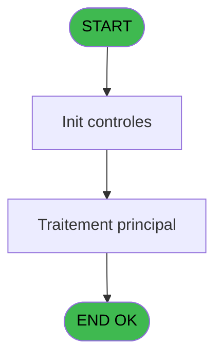
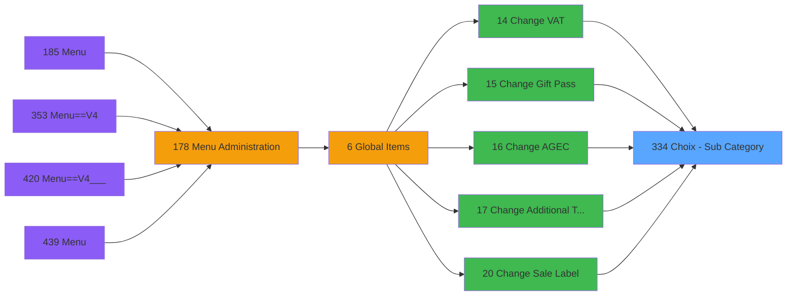

# PVE IDE 334 - Choix - Sub Category

> **Analyse**: Phases 1-4 2026-02-03 19:38 -> 19:38 (12s) | Assemblage 19:38
> **Pipeline**: V7.2 Enrichi
> **Structure**: 4 onglets (Resume | Ecrans | Donnees | Connexions)

<!-- TAB:Resume -->

## 1. FICHE D'IDENTITE

| Attribut | Valeur |
|----------|--------|
| Projet | PVE |
| IDE Position | 334 |
| Nom Programme | Choix - Sub Category |
| Fichier source | `Prg_334.xml` |
| Dossier IDE | Zoom |
| Taches | 1 (1 ecrans visibles) |
| Tables modifiees | 0 |
| Programmes appeles | 0 |

## 2. DESCRIPTION FONCTIONNELLE

**Choix - Sub Category** assure la gestion complete de ce processus, accessible depuis [Change VAT (IDE 14)](PVE-IDE-14.md), [Change Gift Pass (IDE 15)](PVE-IDE-15.md), [Change AGEC (IDE 16)](PVE-IDE-16.md), [Change Additional Taxes (IDE 17)](PVE-IDE-17.md), [Change Sale Label (IDE 20)](PVE-IDE-20.md).

Le flux de traitement s'organise en **1 blocs fonctionnels** :

- **Traitement** (1 tache) : traitements metier divers

## 3. BLOCS FONCTIONNELS

### 3.1 Traitement (1 tache)

Traitements internes.

---

#### 334 - Accounting services list [[ECRAN]](#ecran-t1)

**Role** : Traitement : Accounting services list.
**Ecran** : 362 x 310 DLU (MDI) | [Voir mockup](#ecran-t1)

## 5. REGLES METIER

*(Aucune regle metier identifiee)*

## 6. CONTEXTE

- **Appele par**: [Change VAT (IDE 14)](PVE-IDE-14.md), [Change Gift Pass (IDE 15)](PVE-IDE-15.md), [Change AGEC (IDE 16)](PVE-IDE-16.md), [Change Additional Taxes (IDE 17)](PVE-IDE-17.md), [Change Sale Label (IDE 20)](PVE-IDE-20.md)
- **Appelle**: 0 programmes | **Tables**: 1 (W:0 R:1 L:0) | **Taches**: 1 | **Expressions**: 6

<!-- TAB:Ecrans -->

## 8. ECRANS

### 8.1 Forms visibles (1 / 1)

| # | Position | Tache | Nom | Type | Largeur | Hauteur | Bloc |
|---|----------|-------|-----|------|---------|---------|------|
| 1 | 334 | 334 | Accounting services list | MDI | 362 | 310 | Traitement |

### 8.2 Mockups Ecrans

---

#### 334 - Accounting services list
**Tache** : [334](#t1) | **Type** : MDI | **Dimensions** : 362 x 310 DLU
**Bloc** : Traitement | **Titre IDE** : Accounting services list

<!-- FORM-DATA:
{
    "width":  362,
    "vFactor":  8,
    "type":  "MDI",
    "hFactor":  4,
    "controls":  [
                     {
                         "x":  38,
                         "type":  "label",
                         "var":  "",
                         "y":  53,
                         "w":  38,
                         "fmt":  "",
                         "name":  "",
                         "h":  13,
                         "color":  "183",
                         "text":  "Code",
                         "parent":  null
                     },
                     {
                         "x":  100,
                         "type":  "label",
                         "var":  "",
                         "y":  53,
                         "w":  152,
                         "fmt":  "",
                         "name":  "",
                         "h":  13,
                         "color":  "183",
                         "text":  "Sub Category",
                         "parent":  null
                     },
                     {
                         "x":  0,
                         "type":  "label",
                         "var":  "",
                         "y":  0,
                         "w":  360,
                         "fmt":  "",
                         "name":  "",
                         "h":  42,
                         "color":  "182",
                         "text":  "",
                         "parent":  null
                     },
                     {
                         "x":  14,
                         "type":  "label",
                         "var":  "",
                         "y":  15,
                         "w":  259,
                         "fmt":  "",
                         "name":  "",
                         "h":  10,
                         "color":  "186",
                         "text":  "Select a Sub category code",
                         "parent":  3
                     },
                     {
                         "x":  30,
                         "type":  "table",
                         "var":  "",
                         "name":  "",
                         "titleH":  12,
                         "color":  "110",
                         "w":  260,
                         "y":  68,
                         "fmt":  "",
                         "parent":  null,
                         "text":  "",
                         "rowH":  24,
                         "h":  191,
                         "cols":  [
                                      {
                                          "title":  "",
                                          "layer":  1,
                                          "w":  64
                                      },
                                      {
                                          "title":  "",
                                          "layer":  2,
                                          "w":  192
                                      }
                                  ],
                         "rows":  2
                     },
                     {
                         "x":  1,
                         "type":  "label",
                         "var":  "",
                         "y":  274,
                         "w":  360,
                         "fmt":  "",
                         "name":  "",
                         "h":  34,
                         "color":  "6",
                         "text":  "",
                         "parent":  null
                     },
                     {
                         "x":  38,
                         "type":  "edit",
                         "var":  "",
                         "y":  71,
                         "w":  52,
                         "fmt":  "",
                         "name":  "CTRL_001",
                         "h":  20,
                         "color":  "110",
                         "text":  "",
                         "parent":  6
                     },
                     {
                         "x":  100,
                         "type":  "edit",
                         "var":  "",
                         "y":  70,
                         "w":  183,
                         "fmt":  "",
                         "name":  "label",
                         "h":  20,
                         "color":  "110",
                         "text":  "",
                         "parent":  6
                     },
                     {
                         "x":  310,
                         "type":  "image",
                         "var":  "",
                         "y":  4,
                         "w":  48,
                         "fmt":  "",
                         "name":  "",
                         "h":  37,
                         "color":  "",
                         "text":  "",
                         "parent":  3
                     },
                     {
                         "x":  289,
                         "type":  "button",
                         "var":  "",
                         "y":  69,
                         "w":  44,
                         "fmt":  "ñ",
                         "name":  "",
                         "h":  94,
                         "color":  "",
                         "text":  "",
                         "parent":  null
                     },
                     {
                         "x":  289,
                         "type":  "button",
                         "var":  "",
                         "y":  163,
                         "w":  44,
                         "fmt":  "ò",
                         "name":  "",
                         "h":  98,
                         "color":  "",
                         "text":  "",
                         "parent":  null
                     },
                     {
                         "x":  208,
                         "type":  "button",
                         "var":  "",
                         "y":  279,
                         "w":  77,
                         "fmt":  "\u0026Select",
                         "name":  "",
                         "h":  28,
                         "color":  "",
                         "text":  "",
                         "parent":  null
                     },
                     {
                         "x":  284,
                         "type":  "button",
                         "var":  "",
                         "y":  279,
                         "w":  77,
                         "fmt":  "\u0026Exit",
                         "name":  "",
                         "h":  28,
                         "color":  "",
                         "text":  "",
                         "parent":  null
                     }
                 ],
    "taskId":  "334",
    "height":  310
}
-->

<strong>Champs : 2 champs</strong>

| Pos (x,y) | Nom | Variable | Type |
|-----------|-----|----------|------|
| 38,71 | CTRL_001 | - | edit |
| 100,70 | label | - | edit |

<strong>Boutons : 4 boutons</strong>

| Bouton | Pos (x,y) | Action |
|--------|-----------|--------|
| ñ | 289,69 | Bouton fonctionnel |
| ò | 289,163 | Bouton fonctionnel |
| Select | 208,279 | Ouvre la selection |
| Exit | 284,279 | Quitte le programme |

## 9. NAVIGATION

Ecran unique: **Accounting services list**

### 9.3 Structure hierarchique (1 tache)

| Position | Tache | Type | Dimensions | Bloc |
|----------|-------|------|------------|------|
| **334.1** | [**Accounting services list** (334)](#t1) [mockup](#ecran-t1) | MDI | 362x310 | Traitement |

### 9.4 Algorigramme

> **Legende**: Vert = START/END OK | Rouge = END KO | Bleu = Decisions
> *Algorigramme auto-genere. Utiliser `/algorigramme` pour une synthese metier detaillee.*

<!-- TAB:Donnees -->

## 10. TABLES

### Tables utilisees (1)

| ID | Nom | Description | Type | R | W | L | Usages |
|----|-----|-------------|------|---|---|---|--------|
| 413 | pv_tva |  | DB | R |   |   | 1 |

### Colonnes par table (1 / 1 tables avec colonnes identifiees)

Table 413 - pv_tva (R) - 1 usages

| Lettre | Variable | Acces | Type |
|--------|----------|-------|------|
| A | P.Cat code | R | Numeric |
| B | P.SubCat code | R | Numeric |

## 11. VARIABLES

### 11.1 Parametres entrants (2)

Variables recues du programme appelant ([Change VAT (IDE 14)](PVE-IDE-14.md)).

| Lettre | Nom | Type | Usage dans |
|--------|-----|------|-----------|
| A | P.Cat code | Numeric | 2x parametre entrant |
| B | P.SubCat code | Numeric | 1x parametre entrant |

## 12. EXPRESSIONS

**6 / 6 expressions decodees (100%)**

### 12.1 Repartition par type

| Type | Expressions | Regles |
|------|-------------|--------|
| OTHER | 5 | 0 |
| CONDITION | 1 | 0 |

### 12.2 Expressions cles par type

#### OTHER (5 expressions)

| Type | IDE | Expression | Regle |
|------|-----|------------|-------|
| OTHER | 4 | `[E]` | - |
| OTHER | 6 | `GetParam('SERVICE')` | - |
| OTHER | 3 | `[D]` | - |
| OTHER | 1 | `P.Cat code [A]` | - |
| OTHER | 2 | `P.SubCat code [B]` | - |

#### CONDITION (1 expressions)

| Type | IDE | Expression | Regle |
|------|-----|------------|-------|
| CONDITION | 5 | `CndRange(P.Cat code [A]<>0,P.Cat code [A])` | - |

<!-- TAB:Connexions -->

## 13. GRAPHE D'APPELS

### 13.1 Chaine depuis Main (Callers)

Main -> ... -> [Change VAT (IDE 14)](PVE-IDE-14.md) -> **Choix - Sub Category (IDE 334)**

Main -> ... -> [Change Gift Pass (IDE 15)](PVE-IDE-15.md) -> **Choix - Sub Category (IDE 334)**

Main -> ... -> [Change AGEC (IDE 16)](PVE-IDE-16.md) -> **Choix - Sub Category (IDE 334)**

Main -> ... -> [Change Additional Taxes (IDE 17)](PVE-IDE-17.md) -> **Choix - Sub Category (IDE 334)**

Main -> ... -> [Change Sale Label (IDE 20)](PVE-IDE-20.md) -> **Choix - Sub Category (IDE 334)**

### 13.2 Callers

| IDE | Nom Programme | Nb Appels |
|-----|---------------|-----------|
| [14](PVE-IDE-14.md) | Change VAT | 1 |
| [15](PVE-IDE-15.md) | Change Gift Pass | 1 |
| [16](PVE-IDE-16.md) | Change AGEC | 1 |
| [17](PVE-IDE-17.md) | Change Additional Taxes | 1 |
| [20](PVE-IDE-20.md) | Change Sale Label | 1 |

### 13.3 Callees (programmes appeles)

### 13.4 Detail Callees avec contexte

| IDE | Nom Programme | Appels | Contexte |
|-----|---------------|--------|----------|
| - | (aucun) | - | - |

## 14. RECOMMANDATIONS MIGRATION

### 14.1 Profil du programme

| Metrique | Valeur | Impact migration |
|----------|--------|-----------------|
| Lignes de logique | 10 | Programme compact |
| Expressions | 6 | Peu de logique |
| Tables WRITE | 0 | Impact faible |
| Sous-programmes | 0 | Peu de dependances |
| Ecrans visibles | 1 | Ecran unique ou traitement batch |
| Code desactive | 0% (0 / 10) | Code sain |
| Regles metier | 0 | Pas de regle identifiee |

### 14.2 Plan de migration par bloc

#### Traitement (1 tache: 1 ecran, 0 traitement)

- **Strategie** : 1 composant(s) UI (Razor/React) avec formulaires et validation.
- Decomposer les taches en services unitaires testables.

### 14.3 Dependances critiques

| Dependance | Type | Appels | Impact |
|------------|------|--------|--------|

---
*Spec DETAILED generee par Pipeline V7.2 - 2026-02-03 19:38*
