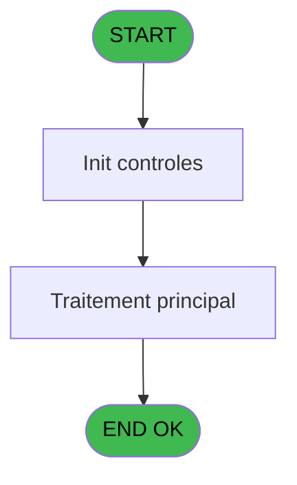
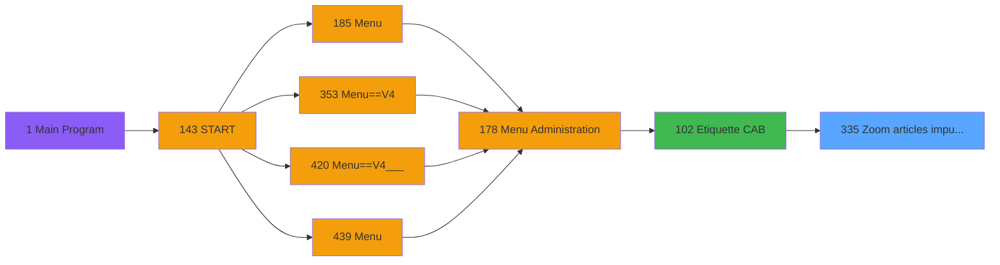
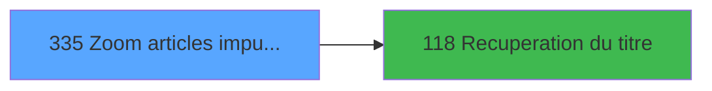

# PVE IDE 335 - Zoom articles imputation

> **Analyse**: Phases 1-4 2026-02-03 19:38 -> 19:39 (11s) | Assemblage 19:39
> **Pipeline**: V7.2 Enrichi
> **Structure**: 4 onglets (Resume | Ecrans | Donnees | Connexions)

<!-- TAB:Resume -->

## 1. FICHE D'IDENTITE

| Attribut | Valeur |
|----------|--------|
| Projet | PVE |
| IDE Position | 335 |
| Nom Programme | Zoom articles imputation |
| Fichier source | `Prg_335.xml` |
| Dossier IDE | Zoom |
| Taches | 1 (1 ecrans visibles) |
| Tables modifiees | 0 |
| Programmes appeles | 1 |

## 2. DESCRIPTION FONCTIONNELLE

**Zoom articles imputation** assure la gestion complete de ce processus, accessible depuis [Etiquette CAB (IDE 102)](PVE-IDE-102.md).

Le flux de traitement s'organise en **1 blocs fonctionnels** :

- **Consultation** (1 tache) : ecrans de recherche, selection et consultation

**Logique metier** : 1 regles identifiees couvrant conditions metier.

## 3. BLOCS FONCTIONNELS

### 3.1 Consultation (1 tache)

Ecrans de recherche et consultation.

---

#### 335 - Zoom articles [[ECRAN]](#ecran-t1)

**Role** : Selection par l'operateur : Zoom articles.
**Ecran** : 760 x 153 DLU (MDI) | [Voir mockup](#ecran-t1)

## 5. REGLES METIER

1 regles identifiees:

### Autres (1 regles)

#### [RM-001] Si > service village [A]>'' alors > service village [A] sinon '')

| Element | Detail |
|---------|--------|
| **Condition** | `> service village [A]>''` |
| **Si vrai** | > service village [A] |
| **Si faux** | '') |
| **Variables** | A (> service village) |
| **Expression source** | Expression 6 : `IF (> service village [A]>'',> service village [A],'')` |
| **Exemple** | Si > service village [A]>'' → > service village [A]. Sinon → '') |

## 6. CONTEXTE

- **Appele par**: [Etiquette CAB (IDE 102)](PVE-IDE-102.md)
- **Appelle**: 1 programmes | **Tables**: 1 (W:0 R:1 L:0) | **Taches**: 1 | **Expressions**: 15

<!-- TAB:Ecrans -->

## 8. ECRANS

### 8.1 Forms visibles (1 / 1)

| # | Position | Tache | Nom | Type | Largeur | Hauteur | Bloc |
|---|----------|-------|-----|------|---------|---------|------|
| 1 | 335 | 335 | Zoom articles | MDI | 760 | 153 | Consultation |

### 8.2 Mockups Ecrans

---

#### 335 - Zoom articles
**Tache** : [335](#t1) | **Type** : MDI | **Dimensions** : 760 x 153 DLU
**Bloc** : Consultation | **Titre IDE** : Zoom articles

<!-- FORM-DATA:
{
    "width":  760,
    "vFactor":  8,
    "type":  "MDI",
    "hFactor":  8,
    "controls":  [
                     {
                         "x":  0,
                         "type":  "label",
                         "var":  "",
                         "y":  132,
                         "w":  755,
                         "fmt":  "",
                         "name":  "",
                         "h":  19,
                         "color":  "",
                         "text":  "",
                         "parent":  null
                     },
                     {
                         "x":  21,
                         "type":  "table",
                         "var":  "",
                         "name":  "",
                         "titleH":  12,
                         "color":  "196",
                         "w":  728,
                         "y":  7,
                         "fmt":  "",
                         "parent":  null,
                         "text":  "",
                         "rowH":  13,
                         "h":  103,
                         "cols":  [
                                      {
                                          "title":  "Numéro article",
                                          "layer":  1,
                                          "w":  149
                                      },
                                      {
                                          "title":  "Code article",
                                          "layer":  2,
                                          "w":  163
                                      },
                                      {
                                          "title":  "Prix unitaire",
                                          "layer":  3,
                                          "w":  246
                                      },
                                      {
                                          "title":  "Réduction",
                                          "layer":  4,
                                          "w":  130
                                      }
                                  ],
                         "rows":  4
                     },
                     {
                         "x":  28,
                         "type":  "edit",
                         "var":  "",
                         "y":  22,
                         "w":  142,
                         "fmt":  "",
                         "name":  "CTRL_001",
                         "h":  8,
                         "color":  "196",
                         "text":  "",
                         "parent":  3
                     },
                     {
                         "x":  181,
                         "type":  "edit",
                         "var":  "",
                         "y":  22,
                         "w":  154,
                         "fmt":  "",
                         "name":  "CTRL_002",
                         "h":  8,
                         "color":  "196",
                         "text":  "",
                         "parent":  3
                     },
                     {
                         "x":  339,
                         "type":  "edit",
                         "var":  "",
                         "y":  22,
                         "w":  210,
                         "fmt":  "",
                         "name":  "CTRL_003",
                         "h":  8,
                         "color":  "196",
                         "text":  "",
                         "parent":  3
                     },
                     {
                         "x":  592,
                         "type":  "button",
                         "var":  "",
                         "y":  135,
                         "w":  144,
                         "fmt":  "\u0026Quitter",
                         "name":  "bouton quitter",
                         "h":  14,
                         "color":  "",
                         "text":  "",
                         "parent":  null
                     },
                     {
                         "x":  21,
                         "type":  "button",
                         "var":  "",
                         "y":  135,
                         "w":  144,
                         "fmt":  "\u0026Sélectionner",
                         "name":  "bouton selectionner",
                         "h":  14,
                         "color":  "",
                         "text":  "",
                         "parent":  null
                     },
                     {
                         "x":  641,
                         "type":  "checkbox",
                         "var":  "",
                         "y":  21,
                         "w":  25,
                         "fmt":  "",
                         "name":  "art_remise_autorisee",
                         "h":  9,
                         "color":  "196",
                         "text":  "",
                         "parent":  3
                     },
                     {
                         "x":  349,
                         "type":  "image",
                         "var":  "",
                         "y":  113,
                         "w":  58,
                         "fmt":  "",
                         "name":  "",
                         "h":  18,
                         "color":  "",
                         "text":  "",
                         "parent":  null
                     }
                 ],
    "taskId":  "335",
    "height":  153
}
-->

<strong>Champs : 4 champs</strong>

| Pos (x,y) | Nom | Variable | Type |
|-----------|-----|----------|------|
| 28,22 | CTRL_001 | - | edit |
| 181,22 | CTRL_002 | - | edit |
| 339,22 | CTRL_003 | - | edit |
| 641,21 | art_remise_autorisee | - | checkbox |

<strong>Boutons : 2 boutons</strong>

| Bouton | Pos (x,y) | Action |
|--------|-----------|--------|
| Quitter | 592,135 | Quitte le programme |
| Sélectionner | 21,135 | Bouton fonctionnel |

## 9. NAVIGATION

Ecran unique: **Zoom articles**

### 9.3 Structure hierarchique (1 tache)

| Position | Tache | Type | Dimensions | Bloc |
|----------|-------|------|------------|------|
| **335.1** | [**Zoom articles** (335)](#t1) [mockup](#ecran-t1) | MDI | 760x153 | Consultation |

### 9.4 Algorigramme

> **Legende**: Vert = START/END OK | Rouge = END KO | Bleu = Decisions
> *Algorigramme auto-genere. Utiliser `/algorigramme` pour une synthese metier detaillee.*

<!-- TAB:Donnees -->

## 10. TABLES

### Tables utilisees (1)

| ID | Nom | Description | Type | R | W | L | Usages |
|----|-----|-------------|------|---|---|---|--------|
| 77 | articles_________art | Articles et stock | DB | R |   |   | 1 |

### Colonnes par table (1 / 1 tables avec colonnes identifiees)

Table 77 - articles_________art (R) - 1 usages

| Lettre | Variable | Acces | Type |
|--------|----------|-------|------|
| A | > service village | R | Alpha |
| B | > code article | R | Numeric |
| C | < libellé article | R | Alpha |
| D | < imputation | R | Numeric |
| E | < sous imputation | R | Numeric |
| F | < prix unitaire | R | Numeric |
| G | < masque montant | R | Alpha |
| H | < numero article | R | Numeric |
| I | v. passage | R | Logical |
| J | v. titre ecran | R | Alpha |
| K | bouton quitter | R | Alpha |
| L | bouton selectionner | R | Alpha |

## 11. VARIABLES

### 11.1 Variables de session (2)

Variables persistantes pendant toute la session.

| Lettre | Nom | Type | Usage dans |
|--------|-----|------|-----------|
| I | v. passage | Logical | 1x session |
| J | v. titre ecran | Alpha | 1x session |

### 11.2 Autres (10)

Variables diverses.

| Lettre | Nom | Type | Usage dans |
|--------|-----|------|-----------|
| A | > service village | Alpha | 2x refs |
| B | > code article | Numeric | [335](#t1) |
| C | < libellé article | Alpha | - |
| D | < imputation | Numeric | - |
| E | < sous imputation | Numeric | - |
| F | < prix unitaire | Numeric | - |
| G | < masque montant | Alpha | - |
| H | < numero article | Numeric | - |
| K | bouton quitter | Alpha | 1x refs |
| L | bouton selectionner | Alpha | - |

## 12. EXPRESSIONS

**15 / 15 expressions decodees (100%)**

### 12.1 Repartition par type

| Type | Expressions | Regles |
|------|-------------|--------|
| CONDITION | 3 | 5 |
| CONSTANTE | 4 | 0 |
| CAST_LOGIQUE | 1 | 0 |
| OTHER | 5 | 0 |
| NEGATION | 1 | 0 |
| STRING | 1 | 0 |

### 12.2 Expressions cles par type

#### CONDITION (3 expressions)

| Type | IDE | Expression | Regle |
|------|-----|------------|-------|
| CONDITION | 6 | `IF (> service village [A]>'',> service village [A],'')` | [RM-001](#rm-RM-001) |
| CONDITION | 8 | `> code article [B]` | - |
| CONDITION | 7 | `> service village [A]` | - |

#### CONSTANTE (4 expressions)

| Type | IDE | Expression | Regle |
|------|-----|------------|-------|
| CONSTANTE | 5 | `'&Sélectionner'` | - |
| CONSTANTE | 14 | `' '` | - |
| CONSTANTE | 3 | `'&Quitter'` | - |
| CONSTANTE | 4 | `41` | - |

#### CAST_LOGIQUE (1 expressions)

| Type | IDE | Expression | Regle |
|------|-----|------------|-------|
| CAST_LOGIQUE | 1 | `'TRUE'LOG` | - |

#### OTHER (5 expressions)

| Type | IDE | Expression | Regle |
|------|-----|------------|-------|
| OTHER | 12 | `[N]` | - |
| OTHER | 13 | `[O]` | - |
| OTHER | 11 | `[M]` | - |
| OTHER | 9 | `v. titre ecran [J]` | - |
| OTHER | 10 | `bouton quitter [K]` | - |

#### NEGATION (1 expressions)

| Type | IDE | Expression | Regle |
|------|-----|------------|-------|
| NEGATION | 15 | `NOT (v. passage [I])` | - |

#### STRING (1 expressions)

| Type | IDE | Expression | Regle |
|------|-----|------------|-------|
| STRING | 2 | `Trim ([S])` | - |

<!-- TAB:Connexions -->

## 13. GRAPHE D'APPELS

### 13.1 Chaine depuis Main (Callers)

Main -> ... -> [Etiquette CAB (IDE 102)](PVE-IDE-102.md) -> **Zoom articles imputation (IDE 335)**

### 13.2 Callers

| IDE | Nom Programme | Nb Appels |
|-----|---------------|-----------|
| [102](PVE-IDE-102.md) | Etiquette CAB | 1 |

### 13.3 Callees (programmes appeles)

### 13.4 Detail Callees avec contexte

| IDE | Nom Programme | Appels | Contexte |
|-----|---------------|--------|----------|
| [118](PVE-IDE-118.md) | Recuperation du titre | 1 | Recuperation donnees |

## 14. RECOMMANDATIONS MIGRATION

### 14.1 Profil du programme

| Metrique | Valeur | Impact migration |
|----------|--------|-----------------|
| Lignes de logique | 38 | Programme compact |
| Expressions | 15 | Peu de logique |
| Tables WRITE | 0 | Impact faible |
| Sous-programmes | 1 | Peu de dependances |
| Ecrans visibles | 1 | Ecran unique ou traitement batch |
| Code desactive | 0% (0 / 38) | Code sain |
| Regles metier | 1 | Quelques regles a preserver |

### 14.2 Plan de migration par bloc

#### Consultation (1 tache: 1 ecran, 0 traitement)

- **Strategie** : Composants de recherche/selection en modales.
- 1 ecran : Zoom articles

### 14.3 Dependances critiques

| Dependance | Type | Appels | Impact |
|------------|------|--------|--------|
| [Recuperation du titre (IDE 118)](PVE-IDE-118.md) | Sous-programme | 1x | Normale - Recuperation donnees |

---
*Spec DETAILED generee par Pipeline V7.2 - 2026-02-03 19:39*
