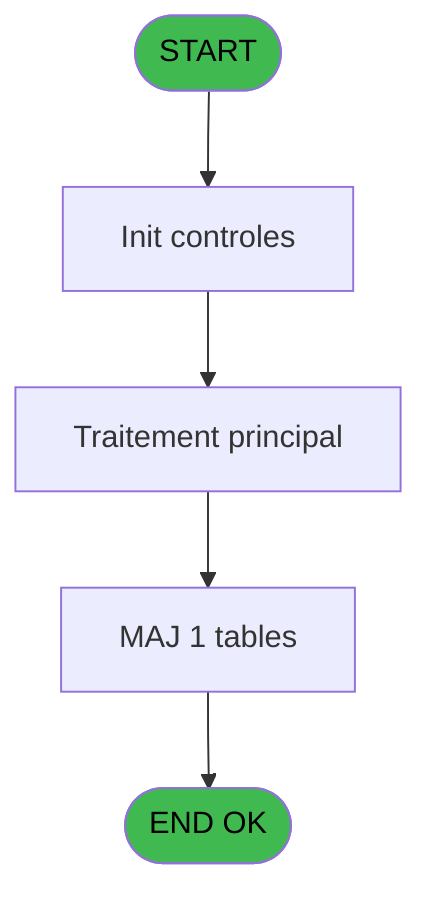
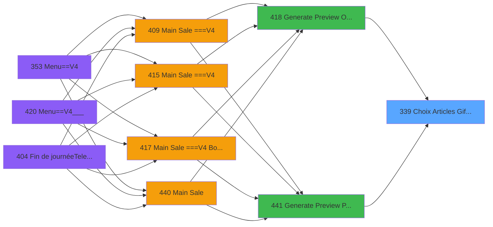
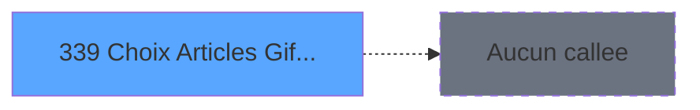

# PVE IDE 339 - Choix Articles Gift Pass

> **Analyse**: Phases 1-4 2026-02-03 19:40 -> 19:40 (11s) | Assemblage 19:40
> **Pipeline**: V7.2 Enrichi
> **Structure**: 4 onglets (Resume | Ecrans | Donnees | Connexions)

<!-- TAB:Resume -->

## 1. FICHE D'IDENTITE

| Attribut | Valeur |
|----------|--------|
| Projet | PVE |
| IDE Position | 339 |
| Nom Programme | Choix Articles Gift Pass |
| Fichier source | `Prg_339.xml` |
| Dossier IDE | Zoom |
| Taches | 1 (1 ecrans visibles) |
| Tables modifiees | 1 |
| Programmes appeles | 0 |

## 2. DESCRIPTION FONCTIONNELLE

**Choix Articles Gift Pass** assure la gestion complete de ce processus, accessible depuis [Generate Preview OD==LEX Book (IDE 418)](PVE-IDE-418.md), [Generate Preview Payments (IDE 441)](PVE-IDE-441.md).

Le flux de traitement s'organise en **1 blocs fonctionnels** :

- **Consultation** (1 tache) : ecrans de recherche, selection et consultation

**Donnees modifiees** : 1 tables en ecriture (Table_1564).

## 3. BLOCS FONCTIONNELS

### 3.1 Consultation (1 tache)

Ecrans de recherche et consultation.

---

#### 339 - Choix Articles Gift Pass [[ECRAN]](#ecran-t1)

**Role** : Selection par l'operateur : Choix Articles Gift Pass.
**Ecran** : 595 x 310 DLU (Type6) | [Voir mockup](#ecran-t1)
**Variables liees** : A (P.SoldeGiftPass), C (v.GiftPassTotal), D (v.Solde Gift Pass)

## 5. REGLES METIER

*(Aucune regle metier identifiee)*

## 6. CONTEXTE

- **Appele par**: [Generate Preview OD==LEX Book (IDE 418)](PVE-IDE-418.md), [Generate Preview Payments (IDE 441)](PVE-IDE-441.md)
- **Appelle**: 0 programmes | **Tables**: 1 (W:1 R:0 L:0) | **Taches**: 1 | **Expressions**: 5

<!-- TAB:Ecrans -->

## 8. ECRANS

### 8.1 Forms visibles (1 / 1)

| # | Position | Tache | Nom | Type | Largeur | Hauteur | Bloc |
|---|----------|-------|-----|------|---------|---------|------|
| 1 | 339 | 339 | Choix Articles Gift Pass | Type6 | 595 | 310 | Consultation |

### 8.2 Mockups Ecrans

---

#### 339 - Choix Articles Gift Pass
**Tache** : [339](#t1) | **Type** : Type6 | **Dimensions** : 595 x 310 DLU
**Bloc** : Consultation | **Titre IDE** : Choix Articles Gift Pass

<!-- FORM-DATA:
{
    "width":  595,
    "vFactor":  8,
    "type":  "Type6",
    "hFactor":  4,
    "controls":  [
                     {
                         "x":  5,
                         "type":  "label",
                         "var":  "",
                         "y":  46,
                         "w":  53,
                         "fmt":  "",
                         "name":  "",
                         "h":  9,
                         "color":  "181",
                         "text":  "Description",
                         "parent":  null
                     },
                     {
                         "x":  227,
                         "type":  "label",
                         "var":  "",
                         "y":  46,
                         "w":  35,
                         "fmt":  "",
                         "name":  "",
                         "h":  9,
                         "color":  "181",
                         "text":  "Amount",
                         "parent":  null
                     },
                     {
                         "x":  386,
                         "type":  "label",
                         "var":  "",
                         "y":  46,
                         "w":  42,
                         "fmt":  "",
                         "name":  "",
                         "h":  9,
                         "color":  "181",
                         "text":  "Gift pass",
                         "parent":  null
                     },
                     {
                         "x":  2,
                         "type":  "label",
                         "var":  "",
                         "y":  244,
                         "w":  593,
                         "fmt":  "",
                         "name":  "",
                         "h":  42,
                         "color":  "2",
                         "text":  "",
                         "parent":  null
                     },
                     {
                         "x":  409,
                         "type":  "label",
                         "var":  "",
                         "y":  250,
                         "w":  23,
                         "fmt":  "",
                         "name":  "",
                         "h":  10,
                         "color":  "",
                         "text":  "Total",
                         "parent":  4
                     },
                     {
                         "x":  355,
                         "type":  "label",
                         "var":  "",
                         "y":  268,
                         "w":  77,
                         "fmt":  "",
                         "name":  "",
                         "h":  10,
                         "color":  "",
                         "text":  "Gift Pass Balance",
                         "parent":  4
                     },
                     {
                         "x":  0,
                         "type":  "label",
                         "var":  "",
                         "y":  1,
                         "w":  594,
                         "fmt":  "",
                         "name":  "",
                         "h":  40,
                         "color":  "186",
                         "text":  "",
                         "parent":  null
                     },
                     {
                         "x":  16,
                         "type":  "label",
                         "var":  "",
                         "y":  15,
                         "w":  345,
                         "fmt":  "",
                         "name":  "",
                         "h":  12,
                         "color":  "186",
                         "text":  "Customize the use of the Gift Pass",
                         "parent":  9
                     },
                     {
                         "x":  2,
                         "type":  "table",
                         "var":  "",
                         "name":  "",
                         "titleH":  12,
                         "color":  "110",
                         "w":  542,
                         "y":  59,
                         "fmt":  "",
                         "parent":  null,
                         "text":  "",
                         "rowH":  16,
                         "h":  184,
                         "cols":  [
                                      {
                                          "title":  "",
                                          "layer":  1,
                                          "w":  220
                                      },
                                      {
                                          "title":  "",
                                          "layer":  2,
                                          "w":  1
                                      },
                                      {
                                          "title":  "",
                                          "layer":  3,
                                          "w":  159
                                      },
                                      {
                                          "title":  "",
                                          "layer":  4,
                                          "w":  159
                                      }
                                  ],
                         "rows":  4
                     },
                     {
                         "x":  546,
                         "type":  "image",
                         "var":  "",
                         "y":  3,
                         "w":  48,
                         "fmt":  "",
                         "name":  "",
                         "h":  35,
                         "color":  "",
                         "text":  "",
                         "parent":  9
                     },
                     {
                         "x":  5,
                         "type":  "edit",
                         "var":  "",
                         "y":  60,
                         "w":  192,
                         "fmt":  "30",
                         "name":  "libelle_article",
                         "h":  13,
                         "color":  "110",
                         "text":  "",
                         "parent":  12
                     },
                     {
                         "x":  227,
                         "type":  "edit",
                         "var":  "",
                         "y":  62,
                         "w":  148,
                         "fmt":  "11.3",
                         "name":  "montant",
                         "h":  13,
                         "color":  "110",
                         "text":  "",
                         "parent":  12
                     },
                     {
                         "x":  386,
                         "type":  "edit",
                         "var":  "",
                         "y":  62,
                         "w":  148,
                         "fmt":  "11.3",
                         "name":  "montant_gift_pass",
                         "h":  13,
                         "color":  "110",
                         "text":  "",
                         "parent":  12
                     },
                     {
                         "x":  546,
                         "type":  "button",
                         "var":  "",
                         "y":  59,
                         "w":  48,
                         "fmt":  "ñ",
                         "name":  "",
                         "h":  92,
                         "color":  "",
                         "text":  "",
                         "parent":  null
                     },
                     {
                         "x":  546,
                         "type":  "button",
                         "var":  "",
                         "y":  151,
                         "w":  48,
                         "fmt":  "ò",
                         "name":  "",
                         "h":  92,
                         "color":  "",
                         "text":  "",
                         "parent":  null
                     },
                     {
                         "x":  439,
                         "type":  "edit",
                         "var":  "",
                         "y":  248,
                         "w":  100,
                         "fmt":  "N11.3C",
                         "name":  "V Total",
                         "h":  12,
                         "color":  "146",
                         "text":  "",
                         "parent":  4
                     },
                     {
                         "x":  439,
                         "type":  "edit",
                         "var":  "",
                         "y":  266,
                         "w":  100,
                         "fmt":  "N11.3C",
                         "name":  "v.Solde Gift Pass_0001",
                         "h":  12,
                         "color":  "146",
                         "text":  "",
                         "parent":  4
                     },
                     {
                         "x":  2,
                         "type":  "button",
                         "var":  "",
                         "y":  286,
                         "w":  298,
                         "fmt":  "\u0026Cancel",
                         "name":  "B Exit",
                         "h":  24,
                         "color":  "",
                         "text":  "",
                         "parent":  null
                     },
                     {
                         "x":  301,
                         "type":  "button",
                         "var":  "",
                         "y":  286,
                         "w":  294,
                         "fmt":  "\u0026Validate",
                         "name":  "Btn.Valider",
                         "h":  24,
                         "color":  "",
                         "text":  "",
                         "parent":  null
                     }
                 ],
    "taskId":  "339",
    "height":  310
}
-->

<strong>Champs : 5 champs</strong>

| Pos (x,y) | Nom | Variable | Type |
|-----------|-----|----------|------|
| 5,60 | libelle_article | - | edit |
| 227,62 | montant | - | edit |
| 386,62 | montant_gift_pass | - | edit |
| 439,248 | V Total | - | edit |
| 439,266 | v.Solde Gift Pass_0001 | - | edit |

<strong>Boutons : 4 boutons</strong>

| Bouton | Pos (x,y) | Action |
|--------|-----------|--------|
| ñ | 546,59 | Bouton fonctionnel |
| ò | 546,151 | Bouton fonctionnel |
| Cancel | 2,286 | Annule et retour au menu |
| Validate | 301,286 | Valide la saisie et enregistre |

## 9. NAVIGATION

Ecran unique: **Choix Articles Gift Pass**

### 9.3 Structure hierarchique (1 tache)

| Position | Tache | Type | Dimensions | Bloc |
|----------|-------|------|------------|------|
| **339.1** | [**Choix Articles Gift Pass** (339)](#t1) [mockup](#ecran-t1) | Type6 | 595x310 | Consultation |

### 9.4 Algorigramme

> **Legende**: Vert = START/END OK | Rouge = END KO | Bleu = Decisions
> *Algorigramme auto-genere. Utiliser `/algorigramme` pour une synthese metier detaillee.*

<!-- TAB:Donnees -->

## 10. TABLES

### Tables utilisees (1)

| ID | Nom | Description | Type | R | W | L | Usages |
|----|-----|-------------|------|---|---|---|--------|
| 1564 | Table_1564 |  | MEM |   | **W** |   | 1 |

### Colonnes par table (1 / 1 tables avec colonnes identifiees)

Table 1564 - Table_1564 (**W**) - 1 usages

| Lettre | Variable | Acces | Type |
|--------|----------|-------|------|
| A | P.SoldeGiftPass | W | Numeric |
| B | P.Valider | W | Logical |
| C | v.GiftPassTotal | W | Numeric |
| D | v.Solde Gift Pass | W | Numeric |
| E | Btn.Valider | W | Alpha |
| F | Btn.Cancel | W | Alpha |

## 11. VARIABLES

### 11.1 Parametres entrants (2)

Variables recues du programme appelant ([Generate Preview OD==LEX Book (IDE 418)](PVE-IDE-418.md)).

| Lettre | Nom | Type | Usage dans |
|--------|-----|------|-----------|
| A | P.SoldeGiftPass | Numeric | 1x parametre entrant |
| B | P.Valider | Logical | - |

### 11.2 Variables de session (2)

Variables persistantes pendant toute la session.

| Lettre | Nom | Type | Usage dans |
|--------|-----|------|-----------|
| C | v.GiftPassTotal | Numeric | - |
| D | v.Solde Gift Pass | Numeric | - |

### 11.3 Autres (2)

Variables diverses.

| Lettre | Nom | Type | Usage dans |
|--------|-----|------|-----------|
| E | Btn.Valider | Alpha | 1x refs |
| F | Btn.Cancel | Alpha | 2x refs |

## 12. EXPRESSIONS

**5 / 5 expressions decodees (100%)**

### 12.1 Repartition par type

| Type | Expressions | Regles |
|------|-------------|--------|
| OTHER | 2 | 0 |
| CONDITION | 2 | 0 |
| CAST_LOGIQUE | 1 | 0 |

### 12.2 Expressions cles par type

#### OTHER (2 expressions)

| Type | IDE | Expression | Regle |
|------|-----|------------|-------|
| OTHER | 2 | `Btn.Cancel [F]` | - |
| OTHER | 1 | `P.SoldeGiftPass [A]` | - |

#### CONDITION (2 expressions)

| Type | IDE | Expression | Regle |
|------|-----|------------|-------|
| CONDITION | 5 | `Btn.Cancel [F] > Btn.Valider [E]` | - |
| CONDITION | 3 | `[G] > [H]` | - |

#### CAST_LOGIQUE (1 expressions)

| Type | IDE | Expression | Regle |
|------|-----|------------|-------|
| CAST_LOGIQUE | 4 | `'TRUE'LOG` | - |

<!-- TAB:Connexions -->

## 13. GRAPHE D'APPELS

### 13.1 Chaine depuis Main (Callers)

Main -> ... -> [Generate Preview OD==LEX Book (IDE 418)](PVE-IDE-418.md) -> **Choix Articles Gift Pass (IDE 339)**

Main -> ... -> [Generate Preview Payments (IDE 441)](PVE-IDE-441.md) -> **Choix Articles Gift Pass (IDE 339)**

### 13.2 Callers

| IDE | Nom Programme | Nb Appels |
|-----|---------------|-----------|
| [418](PVE-IDE-418.md) | Generate Preview OD==LEX Book | 1 |
| [441](PVE-IDE-441.md) | Generate Preview Payments | 1 |

### 13.3 Callees (programmes appeles)

### 13.4 Detail Callees avec contexte

| IDE | Nom Programme | Appels | Contexte |
|-----|---------------|--------|----------|
| - | (aucun) | - | - |

## 14. RECOMMANDATIONS MIGRATION

### 14.1 Profil du programme

| Metrique | Valeur | Impact migration |
|----------|--------|-----------------|
| Lignes de logique | 20 | Programme compact |
| Expressions | 5 | Peu de logique |
| Tables WRITE | 1 | Impact faible |
| Sous-programmes | 0 | Peu de dependances |
| Ecrans visibles | 1 | Ecran unique ou traitement batch |
| Code desactive | 0% (0 / 20) | Code sain |
| Regles metier | 0 | Pas de regle identifiee |

### 14.2 Plan de migration par bloc

#### Consultation (1 tache: 1 ecran, 0 traitement)

- **Strategie** : Composants de recherche/selection en modales.
- 1 ecran : Choix Articles Gift Pass

### 14.3 Dependances critiques

| Dependance | Type | Appels | Impact |
|------------|------|--------|--------|
| Table_1564 | Table WRITE (Memory) | 1x | Schema + repository |

---
*Spec DETAILED generee par Pipeline V7.2 - 2026-02-03 19:40*
