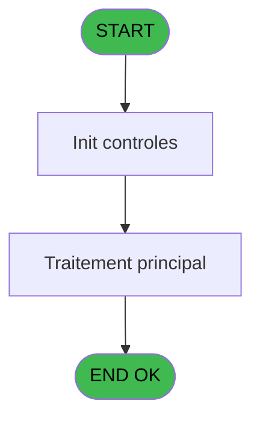
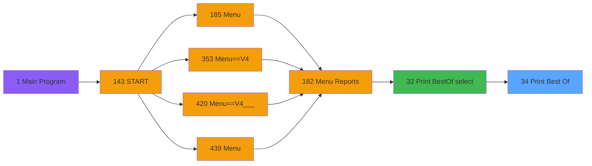

# PVE IDE 34 - Print Best Of

> **Analyse**: Phases 1-4 2026-02-03 01:21 -> 01:21 (37s) | Assemblage 01:21
> **Pipeline**: V7.2 Enrichi
> **Structure**: 4 onglets (Resume | Ecrans | Donnees | Connexions)

<!-- TAB:Resume -->

## 1. FICHE D'IDENTITE

| Attribut | Valeur |
|----------|--------|
| Projet | PVE |
| IDE Position | 34 |
| Nom Programme | Print Best Of |
| Fichier source | `Prg_34.xml` |
| Domaine metier | Impression |
| Taches | 2 (0 ecrans visibles) |
| Tables modifiees | 0 |
| Programmes appeles | 0 |

## 2. DESCRIPTION FONCTIONNELLE

**Print Best Of** assure la gestion complete de ce processus, accessible depuis [Print BestOf (select) (IDE 32)](PVE-IDE-32.md).

Le flux de traitement s'organise en **2 blocs fonctionnels** :

- **Traitement** (1 tache) : traitements metier divers
- **Impression** (1 tache) : generation de tickets et documents

Detail : phases du traitement

#### Phase 1 : Impression (1 tache)

- **34** - Print Equipment / Status

#### Phase 2 : Traitement (1 tache)

- **34.1** - Read Equipment

## 3. BLOCS FONCTIONNELS

### 3.1 Impression (1 tache)

Generation des documents et tickets.

---

#### 34 - Print Equipment / Status

**Role** : Generation du document : Print Equipment / Status.

### 3.2 Traitement (1 tache)

Traitements internes.

---

#### 34.1 - Read Equipment

**Role** : Traitement : Read Equipment.

## 5. REGLES METIER

*(Aucune regle metier identifiee)*

## 6. CONTEXTE

- **Appele par**: [Print BestOf (select) (IDE 32)](PVE-IDE-32.md)
- **Appelle**: 0 programmes | **Tables**: 2 (W:0 R:1 L:1) | **Taches**: 2 | **Expressions**: 16

<!-- TAB:Ecrans -->

## 8. ECRANS

*(Programme sans ecran visible)*

## 9. NAVIGATION

### 9.3 Structure hierarchique (2 taches)

| Position | Tache | Type | Dimensions | Bloc |
|----------|-------|------|------------|------|
| **34.1** | [**Print Equipment / Status** (34)](#t1) | MDI | - | Impression |
| **34.2** | [**Read Equipment** (34.1)](#t17) | MDI | - | Traitement |

### 9.4 Algorigramme

> **Legende**: Vert = START/END OK | Rouge = END KO | Bleu = Decisions
> *Algorigramme auto-genere. Utiliser `/algorigramme` pour une synthese metier detaillee.*

<!-- TAB:Donnees -->

## 10. TABLES

### Tables utilisees (2)

| ID | Nom | Description | Type | R | W | L | Usages |
|----|-----|-------------|------|---|---|---|--------|
| 525 | update_table_ensemble |  | TMP | R |   |   | 1 |
| 532 | edition_cloture_service | Donnees reseau/cloture | TMP |   |   | L | 1 |

### Colonnes par table (1 / 1 tables avec colonnes identifiees)

Table 525 - update_table_ensemble (R) - 1 usages

| Lettre | Variable | Acces | Type |
|--------|----------|-------|------|
| A | equipment_id | R | Unicode |
| B | class_id | R | Numeric |
| C | classification | R | Unicode |
| D | model_id | R | Numeric |
| E | model | R | Unicode |
| F | length | R | Numeric |
| G | manufacturer_id | R | Numeric |
| H | manufacturer | R | Unicode |
| I | owner | R | Unicode |
| J | #_days | R | Numeric |
| K | v.class_selected? | R | Logical |
| L | v.model_selected? | R | Logical |
| M | v.select? | R | Logical |
| N | Total Class | R | Numeric |
| O | Total Model | R | Numeric |
| P | Total Length | R | Numeric |
| Q | v.Extract | R | Alpha |

## 11. VARIABLES

### 11.1 Parametres entrants (5)

Variables recues du programme appelant ([Print BestOf (select) (IDE 32)](PVE-IDE-32.md)).

| Lettre | Nom | Type | Usage dans |
|--------|-----|------|-----------|
| A | p.datedeb | Date | - |
| B | p.datefin | Date | - |
| C | p.ownership_id | Numeric | - |
| D | p.length | Numeric | - |
| E | p. rented equip only | Logical | - |

### 11.2 Variables de session (4)

Variables persistantes pendant toute la session.

| Lettre | Nom | Type | Usage dans |
|--------|-----|------|-----------|
| K | v.class_selected? | Logical | - |
| L | v.model_selected? | Logical | - |
| M | v.select? | Logical | - |
| Q | v.Extract | Alpha | - |

### 11.3 Autres (8)

Variables diverses.

| Lettre | Nom | Type | Usage dans |
|--------|-----|------|-----------|
| F | Separateur | Alpha | - |
| G | manufacturer_id | Numeric | - |
| H | manufacturer | Unicode | - |
| I | owner | Unicode | - |
| J | #_days | Numeric | - |
| N | Total Class | Numeric | - |
| O | Total Model | Numeric | - |
| P | Total Length | Numeric | - |

Toutes les 17 variables (liste complete)

| Cat | Lettre | Nom Variable | Type |
|-----|--------|--------------|------|
| P0 | **A** | p.datedeb | Date |
| P0 | **B** | p.datefin | Date |
| P0 | **C** | p.ownership_id | Numeric |
| P0 | **D** | p.length | Numeric |
| P0 | **E** | p. rented equip only | Logical |
| V. | **K** | v.class_selected? | Logical |
| V. | **L** | v.model_selected? | Logical |
| V. | **M** | v.select? | Logical |
| V. | **Q** | v.Extract | Alpha |
| Autre | **F** | Separateur | Alpha |
| Autre | **G** | manufacturer_id | Numeric |
| Autre | **H** | manufacturer | Unicode |
| Autre | **I** | owner | Unicode |
| Autre | **J** | #_days | Numeric |
| Autre | **N** | Total Class | Numeric |
| Autre | **O** | Total Model | Numeric |
| Autre | **P** | Total Length | Numeric |

## 12. EXPRESSIONS

**16 / 16 expressions decodees (100%)**

### 12.1 Repartition par type

| Type | Expressions | Regles |
|------|-------------|--------|
| CONCATENATION | 1 | 0 |
| OTHER | 10 | 0 |
| CONDITION | 2 | 0 |
| CAST_LOGIQUE | 1 | 0 |
| REFERENCE_VG | 1 | 0 |
| STRING | 1 | 0 |

### 12.2 Expressions cles par type

#### CONCATENATION (1 expressions)

| Type | IDE | Expression | Regle |
|------|-----|------------|-------|
| CONCATENATION | 1 | `DStr (Date (),'DD/MM/YYYY')&' - '&TStr (Time (),'HH:MM:SS')` | - |

#### OTHER (10 expressions)

| Type | IDE | Expression | Regle |
|------|-----|------------|-------|
| OTHER | 9 | `GetParam ('HEADERLINE07')` | - |
| OTHER | 8 | `GetParam ('HEADERLINE06')` | - |
| OTHER | 10 | `GetParam ('HEADERLINE08')` | - |
| OTHER | 12 | `GetParam ('HEADERLINE10')` | - |
| OTHER | 11 | `GetParam ('HEADERLINE09')` | - |
| ... | | *+5 autres* | |

#### CONDITION (2 expressions)

| Type | IDE | Expression | Regle |
|------|-----|------------|-------|
| CONDITION | 14 | `GetParam ('ShowPrinters')='O'` | - |
| CONDITION | 13 | `GetParam ('PrintPreview')='O'` | - |

#### CAST_LOGIQUE (1 expressions)

| Type | IDE | Expression | Regle |
|------|-----|------------|-------|
| CAST_LOGIQUE | 15 | `GetParam ('LOGO')='TRUE'LOG` | - |

#### REFERENCE_VG (1 expressions)

| Type | IDE | Expression | Regle |
|------|-----|------------|-------|
| REFERENCE_VG | 16 | `VG37` | - |

#### STRING (1 expressions)

| Type | IDE | Expression | Regle |
|------|-----|------------|-------|
| STRING | 2 | `'Page '&Trim (Str (Page (0,1),'2'))` | - |

<!-- TAB:Connexions -->

## 13. GRAPHE D'APPELS

### 13.1 Chaine depuis Main (Callers)

Main -> ... -> [Print BestOf (select) (IDE 32)](PVE-IDE-32.md) -> **Print Best Of (IDE 34)**

### 13.2 Callers

| IDE | Nom Programme | Nb Appels |
|-----|---------------|-----------|
| [32](PVE-IDE-32.md) | Print BestOf (select) | 1 |

### 13.3 Callees (programmes appeles)

### 13.4 Detail Callees avec contexte

| IDE | Nom Programme | Appels | Contexte |
|-----|---------------|--------|----------|
| - | (aucun) | - | - |

## 14. RECOMMANDATIONS MIGRATION

### 14.1 Profil du programme

| Metrique | Valeur | Impact migration |
|----------|--------|-----------------|
| Lignes de logique | 58 | Programme compact |
| Expressions | 16 | Peu de logique |
| Tables WRITE | 0 | Impact faible |
| Sous-programmes | 0 | Peu de dependances |
| Ecrans visibles | 0 | Ecran unique ou traitement batch |
| Code desactive | 3.4% (2 / 58) | Code sain |
| Regles metier | 0 | Pas de regle identifiee |

### 14.2 Plan de migration par bloc

#### Impression (1 tache: 0 ecran, 1 traitement)

- **Strategie** : Templates HTML -> PDF via wkhtmltopdf ou Puppeteer.
- `PrintService` injectable avec choix imprimante

#### Traitement (1 tache: 0 ecran, 1 traitement)

- **Strategie** : 1 service(s) backend injectable(s) (Domain Services).
- Decomposer les taches en services unitaires testables.

### 14.3 Dependances critiques

| Dependance | Type | Appels | Impact |
|------------|------|--------|--------|

---
*Spec DETAILED generee par Pipeline V7.2 - 2026-02-03 01:21*
