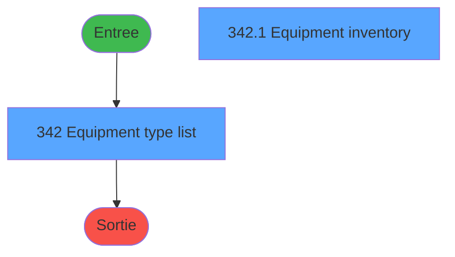
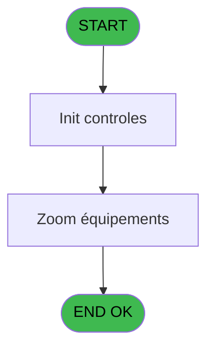
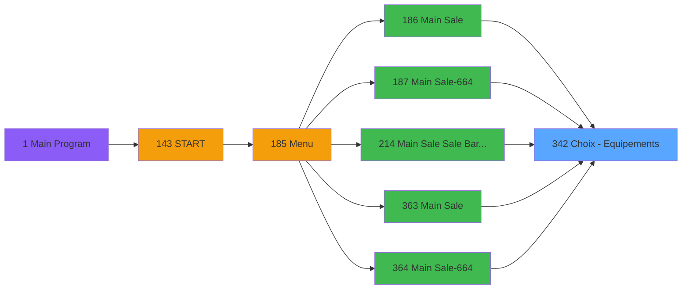
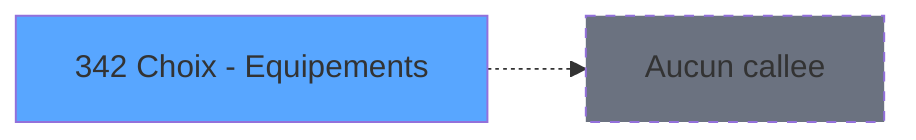

# PVE IDE 342 - Choix - Equipements

> **Analyse**: Phases 1-4 2026-02-03 19:40 -> 19:41 (10s) | Assemblage 19:41
> **Pipeline**: V7.2 Enrichi
> **Structure**: 4 onglets (Resume | Ecrans | Donnees | Connexions)

<!-- TAB:Resume -->

## 1. FICHE D'IDENTITE

| Attribut | Valeur |
|----------|--------|
| Projet | PVE |
| IDE Position | 342 |
| Nom Programme | Choix - Equipements |
| Fichier source | `Prg_342.xml` |
| Dossier IDE | Zoom |
| Taches | 2 (2 ecrans visibles) |
| Tables modifiees | 0 |
| Programmes appeles | 0 |

## 2. DESCRIPTION FONCTIONNELLE

**Choix - Equipements** assure la gestion complete de ce processus, accessible depuis [Main Sale (IDE 186)](PVE-IDE-186.md), [Main Sale-664 (IDE 187)](PVE-IDE-187.md), [Main Sale Sale Bar Code (IDE 214)](PVE-IDE-214.md), [Main Sale (IDE 363)](PVE-IDE-363.md), [Main Sale-664 (IDE 364)](PVE-IDE-364.md).

Le flux de traitement s'organise en **1 blocs fonctionnels** :

- **Traitement** (2 taches) : traitements metier divers

**Logique metier** : 1 regles identifiees couvrant valeurs par defaut.

## 3. BLOCS FONCTIONNELS

### 3.1 Traitement (2 taches)

Traitements internes.

---

#### 342 - Equipment type list [[ECRAN]](#ecran-t1)

**Role** : Traitement : Equipment type list.
**Ecran** : 954 x 382 DLU (MDI) | [Voir mockup](#ecran-t1)
**Variables liees** : C (v.Retour equipment)

---

#### 342.1 - Equipment inventory [[ECRAN]](#ecran-t2)

**Role** : Traitement : Equipment inventory.
**Ecran** : 600 x 295 DLU (Type6) | [Voir mockup](#ecran-t2)
**Variables liees** : C (v.Retour equipment)

## 5. REGLES METIER

1 regles identifiees:

### Autres (1 regles)

#### [RM-001] Valeur par defaut si p.i.Statut (optionnel) [B] est vide

| Element | Detail |
|---------|--------|
| **Condition** | `p.i.Statut (optionnel) [B]=''` |
| **Si vrai** | 'All' |
| **Si faux** | p.i.Statut (optionnel) [B]) |
| **Variables** | B (p.i.Statut (optionnel)) |
| **Expression source** | Expression 7 : `IF(p.i.Statut (optionnel) [B]='','All', p.i.Statut (optionne` |
| **Exemple** | Si p.i.Statut (optionnel) [B]='' → 'All'. Sinon → p.i.Statut (optionnel) [B]) |

## 6. CONTEXTE

- **Appele par**: [Main Sale (IDE 186)](PVE-IDE-186.md), [Main Sale-664 (IDE 187)](PVE-IDE-187.md), [Main Sale Sale Bar Code (IDE 214)](PVE-IDE-214.md), [Main Sale (IDE 363)](PVE-IDE-363.md), [Main Sale-664 (IDE 364)](PVE-IDE-364.md)
- **Appelle**: 0 programmes | **Tables**: 7 (W:0 R:2 L:6) | **Taches**: 2 | **Expressions**: 9

<!-- TAB:Ecrans -->

## 8. ECRANS

### 8.1 Forms visibles (2 / 2)

| # | Position | Tache | Nom | Type | Largeur | Hauteur | Bloc |
|---|----------|-------|-----|------|---------|---------|------|
| 1 | 342 | 342 | Equipment type list | MDI | 954 | 382 | Traitement |
| 2 | 342.1 | 342.1 | Equipment inventory | Type6 | 600 | 295 | Traitement |

### 8.2 Mockups Ecrans

---

#### 342 - Equipment type list
**Tache** : [342](#t1) | **Type** : MDI | **Dimensions** : 954 x 382 DLU
**Bloc** : Traitement | **Titre IDE** : Equipment type list

<!-- FORM-DATA:
{
    "width":  954,
    "vFactor":  8,
    "type":  "MDI",
    "hFactor":  4,
    "controls":  [
                     {
                         "x":  19,
                         "type":  "label",
                         "var":  "",
                         "y":  46,
                         "w":  53,
                         "fmt":  "",
                         "name":  "",
                         "h":  13,
                         "color":  "183",
                         "text":  "Code",
                         "parent":  null
                     },
                     {
                         "x":  85,
                         "type":  "label",
                         "var":  "",
                         "y":  46,
                         "w":  96,
                         "fmt":  "",
                         "name":  "",
                         "h":  13,
                         "color":  "183",
                         "text":  "Description",
                         "parent":  null
                     },
                     {
                         "x":  24,
                         "type":  "label",
                         "var":  "",
                         "y":  324,
                         "w":  56,
                         "fmt":  "",
                         "name":  "",
                         "h":  12,
                         "color":  "183",
                         "text":  "Status",
                         "parent":  null
                     },
                     {
                         "x":  0,
                         "type":  "label",
                         "var":  "",
                         "y":  0,
                         "w":  953,
                         "fmt":  "",
                         "name":  "",
                         "h":  42,
                         "color":  "182",
                         "text":  "",
                         "parent":  null
                     },
                     {
                         "x":  14,
                         "type":  "label",
                         "var":  "",
                         "y":  15,
                         "w":  272,
                         "fmt":  "",
                         "name":  "",
                         "h":  10,
                         "color":  "186",
                         "text":  "Select an equipment",
                         "parent":  4
                     },
                     {
                         "x":  14,
                         "type":  "table",
                         "var":  "",
                         "name":  "",
                         "titleH":  12,
                         "color":  "110",
                         "w":  291,
                         "y":  60,
                         "fmt":  "",
                         "parent":  null,
                         "text":  "",
                         "rowH":  28,
                         "h":  257,
                         "cols":  [
                                      {
                                          "title":  "",
                                          "layer":  1,
                                          "w":  65
                                      },
                                      {
                                          "title":  "",
                                          "layer":  2,
                                          "w":  221
                                      }
                                  ],
                         "rows":  2
                     },
                     {
                         "x":  0,
                         "type":  "label",
                         "var":  "",
                         "y":  348,
                         "w":  953,
                         "fmt":  "",
                         "name":  "",
                         "h":  34,
                         "color":  "6",
                         "text":  "",
                         "parent":  null
                     },
                     {
                         "x":  20,
                         "type":  "edit",
                         "var":  "",
                         "y":  62,
                         "w":  52,
                         "fmt":  "",
                         "name":  "",
                         "h":  24,
                         "color":  "110",
                         "text":  "",
                         "parent":  8
                     },
                     {
                         "x":  86,
                         "type":  "edit",
                         "var":  "",
                         "y":  63,
                         "w":  210,
                         "fmt":  "30",
                         "name":  "",
                         "h":  24,
                         "color":  "110",
                         "text":  "",
                         "parent":  8
                     },
                     {
                         "x":  902,
                         "type":  "image",
                         "var":  "",
                         "y":  4,
                         "w":  48,
                         "fmt":  "",
                         "name":  "",
                         "h":  37,
                         "color":  "",
                         "text":  "",
                         "parent":  4
                     },
                     {
                         "x":  302,
                         "type":  "button",
                         "var":  "",
                         "y":  61,
                         "w":  44,
                         "fmt":  "ñ",
                         "name":  "",
                         "h":  129,
                         "color":  "",
                         "text":  "",
                         "parent":  null
                     },
                     {
                         "x":  302,
                         "type":  "button",
                         "var":  "",
                         "y":  190,
                         "w":  44,
                         "fmt":  "ò",
                         "name":  "",
                         "h":  127,
                         "color":  "",
                         "text":  "",
                         "parent":  null
                     },
                     {
                         "x":  796,
                         "type":  "button",
                         "var":  "",
                         "y":  353,
                         "w":  77,
                         "fmt":  "\u0026Select",
                         "name":  "",
                         "h":  28,
                         "color":  "",
                         "text":  "",
                         "parent":  null
                     },
                     {
                         "x":  873,
                         "type":  "button",
                         "var":  "",
                         "y":  353,
                         "w":  77,
                         "fmt":  "\u0026Exit",
                         "name":  "",
                         "h":  28,
                         "color":  "",
                         "text":  "",
                         "parent":  null
                     },
                     {
                         "x":  353,
                         "type":  "subform",
                         "var":  "",
                         "y":  46,
                         "w":  599,
                         "fmt":  "",
                         "name":  "Zoom équipements",
                         "h":  298,
                         "color":  "",
                         "text":  "",
                         "parent":  null
                     },
                     {
                         "x":  84,
                         "type":  "combobox",
                         "var":  "",
                         "y":  324,
                         "w":  51,
                         "fmt":  "",
                         "name":  "v.Statut",
                         "h":  12,
                         "color":  "",
                         "text":  "",
                         "parent":  null
                     }
                 ],
    "taskId":  "342",
    "height":  382
}
-->

<strong>Champs : 3 champs</strong>

| Pos (x,y) | Nom | Variable | Type |
|-----------|-----|----------|------|
| 20,62 | (sans nom) | - | edit |
| 86,63 | 30 | - | edit |
| 84,324 | v.Statut | - | combobox |

<strong>Boutons : 4 boutons</strong>

| Bouton | Pos (x,y) | Action |
|--------|-----------|--------|
| ñ | 302,61 | Bouton fonctionnel |
| ò | 302,190 | Bouton fonctionnel |
| Select | 796,353 | Ouvre la selection |
| Exit | 873,353 | Quitte le programme |

---

#### 342.1 - Equipment inventory
**Tache** : [342.1](#t2) | **Type** : Type6 | **Dimensions** : 600 x 295 DLU
**Bloc** : Traitement | **Titre IDE** : Equipment inventory

<!-- FORM-DATA:
{
    "width":  600,
    "vFactor":  8,
    "type":  "Type6",
    "hFactor":  4,
    "controls":  [
                     {
                         "x":  0,
                         "type":  "table",
                         "var":  "",
                         "name":  "",
                         "titleH":  24,
                         "color":  "110",
                         "w":  548,
                         "y":  0,
                         "fmt":  "",
                         "parent":  null,
                         "text":  "",
                         "rowH":  24,
                         "h":  290,
                         "cols":  [
                                      {
                                          "title":  "Equipement Id",
                                          "layer":  1,
                                          "w":  82
                                      },
                                      {
                                          "title":  "Manufacturer",
                                          "layer":  2,
                                          "w":  94
                                      },
                                      {
                                          "title":  "Model",
                                          "layer":  3,
                                          "w":  122
                                      },
                                      {
                                          "title":  "Model year",
                                          "layer":  4,
                                          "w":  46
                                      },
                                      {
                                          "title":  "Length",
                                          "layer":  5,
                                          "w":  33
                                      },
                                      {
                                          "title":  "Status",
                                          "layer":  6,
                                          "w":  73
                                      },
                                      {
                                          "title":  "Classification",
                                          "layer":  7,
                                          "w":  88
                                      }
                                  ],
                         "rows":  7
                     },
                     {
                         "x":  4,
                         "type":  "edit",
                         "var":  "",
                         "y":  27,
                         "w":  78,
                         "fmt":  "8",
                         "name":  "CTRL_001",
                         "h":  20,
                         "color":  "110",
                         "text":  "",
                         "parent":  1
                     },
                     {
                         "x":  86,
                         "type":  "button",
                         "var":  "",
                         "y":  26,
                         "w":  91,
                         "fmt":  "",
                         "name":  "CTRL_003",
                         "h":  22,
                         "color":  "",
                         "text":  "",
                         "parent":  1
                     },
                     {
                         "x":  180,
                         "type":  "button",
                         "var":  "",
                         "y":  26,
                         "w":  122,
                         "fmt":  "",
                         "name":  "CTRL_004",
                         "h":  22,
                         "color":  "",
                         "text":  "",
                         "parent":  1
                     },
                     {
                         "x":  302,
                         "type":  "edit",
                         "var":  "",
                         "y":  27,
                         "w":  39,
                         "fmt":  "",
                         "name":  "CTRL_005",
                         "h":  20,
                         "color":  "110",
                         "text":  "",
                         "parent":  1
                     },
                     {
                         "x":  348,
                         "type":  "edit",
                         "var":  "",
                         "y":  27,
                         "w":  26,
                         "fmt":  "",
                         "name":  "CTRL_006",
                         "h":  20,
                         "color":  "110",
                         "text":  "",
                         "parent":  1
                     },
                     {
                         "x":  380,
                         "type":  "button",
                         "var":  "",
                         "y":  26,
                         "w":  72,
                         "fmt":  "",
                         "name":  "CTRL_010",
                         "h":  22,
                         "color":  "",
                         "text":  "",
                         "parent":  1
                     },
                     {
                         "x":  453,
                         "type":  "button",
                         "var":  "",
                         "y":  26,
                         "w":  88,
                         "fmt":  "30",
                         "name":  "btn classif",
                         "h":  22,
                         "color":  "",
                         "text":  "",
                         "parent":  1
                     },
                     {
                         "x":  550,
                         "type":  "button",
                         "var":  "",
                         "y":  0,
                         "w":  45,
                         "fmt":  "ñ",
                         "name":  "",
                         "h":  146,
                         "color":  "",
                         "text":  "",
                         "parent":  null
                     },
                     {
                         "x":  550,
                         "type":  "button",
                         "var":  "",
                         "y":  146,
                         "w":  45,
                         "fmt":  "ò",
                         "name":  "",
                         "h":  145,
                         "color":  "",
                         "text":  "",
                         "parent":  null
                     }
                 ],
    "taskId":  "342.1",
    "height":  295
}
-->

<strong>Champs : 3 champs</strong>

| Pos (x,y) | Nom | Variable | Type |
|-----------|-----|----------|------|
| 4,27 | CTRL_001 | - | edit |
| 302,27 | CTRL_005 | - | edit |
| 348,27 | CTRL_006 | - | edit |

<strong>Boutons : 6 boutons</strong>

| Bouton | Pos (x,y) | Action |
|--------|-----------|--------|
| CTRL_003 | 86,26 | Bouton fonctionnel |
| CTRL_004 | 180,26 | Bouton fonctionnel |
| CTRL_010 | 380,26 | Bouton fonctionnel |
| 30 | 453,26 | Bouton fonctionnel |
| ñ | 550,0 | Bouton fonctionnel |
| ò | 550,146 | Bouton fonctionnel |

## 9. NAVIGATION

### 9.1 Enchainement des ecrans

**Detail par enchainement :**

| Depuis | Action | Vers | Retour |
|--------|--------|------|--------|

### 9.3 Structure hierarchique (2 taches)

| Position | Tache | Type | Dimensions | Bloc |
|----------|-------|------|------------|------|
| **342.1** | [**Equipment type list** (342)](#t1) [mockup](#ecran-t1) | MDI | 954x382 | Traitement |
| 342.1.1 | [Equipment inventory (342.1)](#t2) [mockup](#ecran-t2) | Type6 | 600x295 | |

### 9.4 Algorigramme

> **Legende**: Vert = START/END OK | Rouge = END KO | Bleu = Decisions
> *Algorigramme auto-genere. Utiliser `/algorigramme` pour une synthese metier detaillee.*

<!-- TAB:Donnees -->

## 10. TABLES

### Tables utilisees (7)

| ID | Nom | Description | Type | R | W | L | Usages |
|----|-----|-------------|------|---|---|---|--------|
| 380 | pv_day_modes |  | DB |   |   | L | 1 |
| 388 | pv_hotel_days |  | DB |   |   | L | 1 |
| 389 | pv_equipment_inventory |  | DB | R |   | L | 2 |
| 398 | pv_prestations | Prestations/services vendus | DB |   |   | L | 1 |
| 399 | pv_package_price |  | DB |   |   | L | 1 |
| 404 | pv_sellers_by_week |  | DB | R |   |   | 1 |
| 419 | realise_articles_caution | Articles et stock | DB |   |   | L | 2 |

### Colonnes par table (2 / 2 tables avec colonnes identifiees)

Table 389 - pv_equipment_inventory (R/L) - 2 usages

| Lettre | Variable | Acces | Type |
|--------|----------|-------|------|
| A | p.o.Equipement | R | Unicode |
| B | p.i.Statut (optionnel) | R | Unicode |
| C | v.Retour equipment | R | Logical |
| D | v.Statut | R | Unicode |
| E | v.Select actif ? | R | Logical |
| F | CHG_REASON_v.Statut | R | Numeric |
| G | CHG_PRV_v.Statut | R | Unicode |

Table 404 - pv_sellers_by_week (R) - 1 usages

| Lettre | Variable | Acces | Type |
|--------|----------|-------|------|
| A | p.type matos | R | Numeric |
| B | v.retour cust rental | R | Logical |
| C | btn type matos | R | Alpha |
| D | btn classif | R | Alpha |

## 11. VARIABLES

### 11.1 Parametres entrants (2)

Variables recues du programme appelant ([Main Sale (IDE 186)](PVE-IDE-186.md)).

| Lettre | Nom | Type | Usage dans |
|--------|-----|------|-----------|
| A | p.o.Equipement | Unicode | - |
| B | p.i.Statut (optionnel) | Unicode | 1x parametre entrant |

### 11.2 Variables de session (3)

Variables persistantes pendant toute la session.

| Lettre | Nom | Type | Usage dans |
|--------|-----|------|-----------|
| C | v.Retour equipment | Logical | - |
| D | v.Statut | Unicode | 2x session |
| E | v.Select actif ? | Logical | - |

### 11.3 Autres (2)

Variables diverses.

| Lettre | Nom | Type | Usage dans |
|--------|-----|------|-----------|
| F | CHG_REASON_v.Statut | Numeric | - |
| G | CHG_PRV_v.Statut | Unicode | - |

## 12. EXPRESSIONS

**9 / 9 expressions decodees (100%)**

### 12.1 Repartition par type

| Type | Expressions | Regles |
|------|-------------|--------|
| CONDITION | 2 | 5 |
| CONSTANTE | 1 | 0 |
| OTHER | 4 | 0 |
| CAST_LOGIQUE | 2 | 0 |

### 12.2 Expressions cles par type

#### CONDITION (2 expressions)

| Type | IDE | Expression | Regle |
|------|-----|------------|-------|
| CONDITION | 7 | `IF(p.i.Statut (optionnel) [B]='','All', p.i.Statut (optionnel) [B])` | [RM-001](#rm-RM-001) |
| CONDITION | 9 | `[K]=0` | - |

#### CONSTANTE (1 expressions)

| Type | IDE | Expression | Regle |
|------|-----|------------|-------|
| CONSTANTE | 8 | `'Zoom équipements'` | - |

#### OTHER (4 expressions)

| Type | IDE | Expression | Regle |
|------|-----|------------|-------|
| OTHER | 5 | `v.Statut [D]` | - |
| OTHER | 6 | `[J]` | - |
| OTHER | 1 | `v.Statut [D]` | - |
| OTHER | 2 | `GetParam ('SERVICE')` | - |

#### CAST_LOGIQUE (2 expressions)

| Type | IDE | Expression | Regle |
|------|-----|------------|-------|
| CAST_LOGIQUE | 4 | `'FALSE'LOG` | - |
| CAST_LOGIQUE | 3 | `'TRUE'LOG` | - |

<!-- TAB:Connexions -->

## 13. GRAPHE D'APPELS

### 13.1 Chaine depuis Main (Callers)

Main -> ... -> [Main Sale (IDE 186)](PVE-IDE-186.md) -> **Choix - Equipements (IDE 342)**

Main -> ... -> [Main Sale-664 (IDE 187)](PVE-IDE-187.md) -> **Choix - Equipements (IDE 342)**

Main -> ... -> [Main Sale Sale Bar Code (IDE 214)](PVE-IDE-214.md) -> **Choix - Equipements (IDE 342)**

Main -> ... -> [Main Sale (IDE 363)](PVE-IDE-363.md) -> **Choix - Equipements (IDE 342)**

Main -> ... -> [Main Sale-664 (IDE 364)](PVE-IDE-364.md) -> **Choix - Equipements (IDE 342)**

### 13.2 Callers

| IDE | Nom Programme | Nb Appels |
|-----|---------------|-----------|
| [186](PVE-IDE-186.md) | Main Sale | 4 |
| [187](PVE-IDE-187.md) | Main Sale-664 | 4 |
| [214](PVE-IDE-214.md) | Main Sale Sale Bar Code | 4 |
| [363](PVE-IDE-363.md) | Main Sale | 4 |
| [364](PVE-IDE-364.md) | Main Sale-664 | 4 |

### 13.3 Callees (programmes appeles)

### 13.4 Detail Callees avec contexte

| IDE | Nom Programme | Appels | Contexte |
|-----|---------------|--------|----------|
| - | (aucun) | - | - |

## 14. RECOMMANDATIONS MIGRATION

### 14.1 Profil du programme

| Metrique | Valeur | Impact migration |
|----------|--------|-----------------|
| Lignes de logique | 112 | Programme compact |
| Expressions | 9 | Peu de logique |
| Tables WRITE | 0 | Impact faible |
| Sous-programmes | 0 | Peu de dependances |
| Ecrans visibles | 2 | Quelques ecrans |
| Code desactive | 0% (0 / 112) | Code sain |
| Regles metier | 1 | Quelques regles a preserver |

### 14.2 Plan de migration par bloc

#### Traitement (2 taches: 2 ecrans, 0 traitement)

- **Strategie** : 2 composant(s) UI (Razor/React) avec formulaires et validation.
- Decomposer les taches en services unitaires testables.

### 14.3 Dependances critiques

| Dependance | Type | Appels | Impact |
|------------|------|--------|--------|

---
*Spec DETAILED generee par Pipeline V7.2 - 2026-02-03 19:41*
