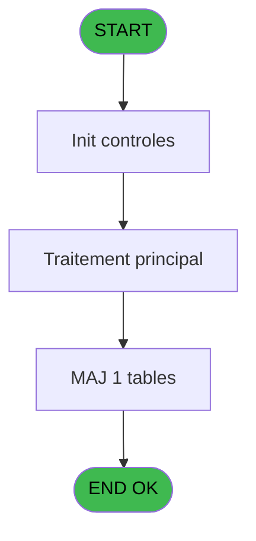

# PVE IDE 350 - Liste cloture service

> **Analyse**: Phases 1-4 2026-02-03 19:43 -> 19:43 (12s) | Assemblage 19:43
> **Pipeline**: V7.2 Enrichi
> **Structure**: 4 onglets (Resume | Ecrans | Donnees | Connexions)

<!-- TAB:Resume -->

## 1. FICHE D'IDENTITE

| Attribut | Valeur |
|----------|--------|
| Projet | PVE |
| IDE Position | 350 |
| Nom Programme | Liste cloture service |
| Fichier source | `Prg_350.xml` |
| Dossier IDE | Sauvegarde |
| Taches | 16 (0 ecrans visibles) |
| Tables modifiees | 1 |
| Programmes appeles | 0 |
| :warning: Statut | **ORPHELIN_POTENTIEL** |

## 2. DESCRIPTION FONCTIONNELLE

**Liste cloture service** assure la gestion complete de ce processus.

Le flux de traitement s'organise en **3 blocs fonctionnels** :

- **Traitement** (7 taches) : traitements metier divers
- **Calcul** (5 taches) : calculs de montants, stocks ou compteurs
- **Saisie** (4 taches) : ecrans de saisie utilisateur (formulaires, champs, donnees)

**Donnees modifiees** : 1 tables en ecriture (historique_pabx_restruc).

Detail : phases du traitement

#### Phase 1 : Traitement (7 taches)

- **350** - Liste cloture service
- **350.1** - qualification du service
- **350.2** - Lecture des PC
- **350.2.2** - Lecture des od
- **350.2.3** - Lecture des od bout
- **350.2.4** - Lecture des TPE
- **350.4** - impression

#### Phase 2 : Saisie (4 taches)

- **350.2.1** - Lecture des ventes
- **350.2.4.1** - Lecture saisie TPE
- **350.2.4.1.1** - tempo saisie
- **350.3** - Lecture saisie OD

#### Phase 3 : Calcul (5 taches)

- **350.2.1.1** - tempo calcul
- **350.2.2.1** - tempo calcul
- **350.2.3.1** - tempo calcul
- **350.2.5** - Comptes Boutique
- **350.2.5.1** - tempo calcul

#### Tables impactees

| Table | Operations | Role metier |
|-------|-----------|-------------|
| historique_pabx_restruc | **W**/L (7 usages) | Historique / journal |

## 3. BLOCS FONCTIONNELS

### 3.1 Traitement (7 taches)

Traitements internes.

---

#### 350 - Liste cloture service

**Role** : Tache d'orchestration : point d'entree du programme (7 sous-taches). Coordonne l'enchainement des traitements.

6 sous-taches directes

| Tache | Nom | Bloc |
|-------|-----|------|
| [350.1](#t2) | qualification du service | Traitement |
| [350.2](#t3) | Lecture des PC | Traitement |
| [350.2.2](#t6) | Lecture des od | Traitement |
| [350.2.3](#t8) | Lecture des od bout | Traitement |
| [350.2.4](#t10) | Lecture des TPE | Traitement |
| [350.4](#t16) | impression | Traitement |

**Variables liees** : B (PI Service), H (V Service Sans TRS), I (V Service Avec TRS), J (V Service Boutique)

---

#### 350.1 - qualification du service

**Role** : Traitement : qualification du service.
**Variables liees** : B (PI Service), H (V Service Sans TRS), I (V Service Avec TRS), J (V Service Boutique)

---

#### 350.2 - Lecture des PC

**Role** : Traitement : Lecture des PC.

---

#### 350.2.2 - Lecture des od

**Role** : Traitement : Lecture des od.

---

#### 350.2.3 - Lecture des od bout

**Role** : Traitement : Lecture des od bout.
**Variables liees** : J (V Service Boutique), K (V imputation boutique)

---

#### 350.2.4 - Lecture des TPE

**Role** : Traitement : Lecture des TPE.

---

#### 350.4 - impression

**Role** : Generation du document : impression.

### 3.2 Saisie (4 taches)

Ce bloc traite la saisie des donnees de la transaction.

---

#### 350.2.1 - Lecture des ventes

**Role** : Saisie des donnees : Lecture des ventes.

---

#### 350.2.4.1 - Lecture saisie TPE

**Role** : Saisie des donnees : Lecture saisie TPE.

---

#### 350.2.4.1.1 - tempo saisie

**Role** : Saisie des donnees : tempo saisie.

---

#### 350.3 - Lecture saisie OD

**Role** : Saisie des donnees : Lecture saisie OD.

### 3.3 Calcul (5 taches)

Calculs metier : montants, stocks, compteurs.

---

#### 350.2.1.1 - tempo calcul

**Role** : Calcul : tempo calcul.

---

#### 350.2.2.1 - tempo calcul

**Role** : Calcul : tempo calcul.

---

#### 350.2.3.1 - tempo calcul

**Role** : Calcul : tempo calcul.

---

#### 350.2.5 - Comptes Boutique

**Role** : Traitement : Comptes Boutique.
**Variables liees** : J (V Service Boutique), K (V imputation boutique)

---

#### 350.2.5.1 - tempo calcul

**Role** : Calcul : tempo calcul.

## 5. REGLES METIER

*(Aucune regle metier identifiee)*

## 6. CONTEXTE

- **Appele par**: (aucun)
- **Appelle**: 0 programmes | **Tables**: 11 (W:1 R:8 L:4) | **Taches**: 16 | **Expressions**: 1

<!-- TAB:Ecrans -->

## 8. ECRANS

*(Programme sans ecran visible)*

## 9. NAVIGATION

### 9.3 Structure hierarchique (16 taches)

| Position | Tache | Type | Dimensions | Bloc |
|----------|-------|------|------------|------|
| **350.1** | [**Liste cloture service** (350)](#t1) | MDI | - | Traitement |
| 350.1.1 | [qualification du service (350.1)](#t2) | MDI | - | |
| 350.1.2 | [Lecture des PC (350.2)](#t3) | MDI | - | |
| 350.1.3 | [Lecture des od (350.2.2)](#t6) | MDI | - | |
| 350.1.4 | [Lecture des od bout (350.2.3)](#t8) | MDI | - | |
| 350.1.5 | [Lecture des TPE (350.2.4)](#t10) | MDI | - | |
| 350.1.6 | [impression (350.4)](#t16) | MDI | - | |
| **350.2** | [**Lecture des ventes** (350.2.1)](#t4) | MDI | - | Saisie |
| 350.2.1 | [Lecture saisie TPE (350.2.4.1)](#t11) | MDI | - | |
| 350.2.2 | [tempo saisie (350.2.4.1.1)](#t12) | MDI | - | |
| 350.2.3 | [Lecture saisie OD (350.3)](#t15) | MDI | - | |
| **350.3** | [**tempo calcul** (350.2.1.1)](#t5) | MDI | - | Calcul |
| 350.3.1 | [tempo calcul (350.2.2.1)](#t7) | MDI | - | |
| 350.3.2 | [tempo calcul (350.2.3.1)](#t9) | MDI | - | |
| 350.3.3 | [Comptes Boutique (350.2.5)](#t13) | MDI | - | |
| 350.3.4 | [tempo calcul (350.2.5.1)](#t14) | MDI | - | |

### 9.4 Algorigramme

> **Legende**: Vert = START/END OK | Rouge = END KO | Bleu = Decisions
> *Algorigramme auto-genere. Utiliser `/algorigramme` pour une synthese metier detaillee.*

<!-- TAB:Donnees -->

## 10. TABLES

### Tables utilisees (11)

| ID | Nom | Description | Type | R | W | L | Usages |
|----|-----|-------------|------|---|---|---|--------|
| 40 | comptable________cte |  | DB | R |   |   | 2 |
| 89 | moyen_paiement___mop |  | DB | R |   | L | 3 |
| 240 | saisie_pdc_boutique |  | DB | R |   |   | 1 |
| 245 | saisie_od_par_service | Services / filieres | DB | R |   |   | 1 |
| 256 | terminaux_boutique |  | DB |   |   | L | 1 |
| 259 | tpe_par_service | Services / filieres | DB | R |   |   | 1 |
| 260 | tickets_tpe |  | DB | R |   |   | 1 |
| 263 | vente | Donnees de ventes | DB |   |   | L | 1 |
| 550 | historique_pabx_restruc | Historique / journal | TMP |   | **W** | L | 7 |
| 697 | droits_applications | Droits operateur | DB | R |   |   | 1 |
| 734 | arc_pv_cust_packages |  | DB | R |   |   | 1 |

### Colonnes par table (7 / 9 tables avec colonnes identifiees)

Table 40 - comptable________cte (R) - 2 usages

| Lettre | Variable | Acces | Type |
|--------|----------|-------|------|
| C | PI data comptable | R | Date |

Table 89 - moyen_paiement___mop (R/L) - 3 usages

*Table utilisee uniquement en Link ou aucune colonne Real identifiee dans le DataView.*

Table 240 - saisie_pdc_boutique (R) - 1 usages

| Lettre | Variable | Acces | Type |
|--------|----------|-------|------|
| B | total saisie | R | Numeric |
| C | v service Boutique | R | Logical |
| J | V Service Boutique | R | Logical |
| K | V imputation boutique | R | Numeric |

Table 245 - saisie_od_par_service (R) - 1 usages

| Lettre | Variable | Acces | Type |
|--------|----------|-------|------|
| A | v service sans TRS_IMS | R | Logical |
| B | PI Service | R | Alpha |
| C | v service Boutique | R | Logical |
| H | V Service Sans TRS | R | Logical |
| I | V Service Avec TRS | R | Logical |
| J | V Service Boutique | R | Logical |

Table 259 - tpe_par_service (R) - 1 usages

| Lettre | Variable | Acces | Type |
|--------|----------|-------|------|
| A | v service sans TRS_IMS | R | Logical |
| B | PI Service | R | Alpha |
| C | v service Boutique | R | Logical |
| H | V Service Sans TRS | R | Logical |
| I | V Service Avec TRS | R | Logical |
| J | V Service Boutique | R | Logical |

Table 260 - tickets_tpe (R) - 1 usages

*Table utilisee uniquement en Link ou aucune colonne Real identifiee dans le DataView.*

Table 550 - historique_pabx_restruc (**W**/L) - 7 usages

| Lettre | Variable | Acces | Type |
|--------|----------|-------|------|
| A | total calcul | W | Numeric |
| B | total saisie | W | Numeric |

Table 697 - droits_applications (R) - 1 usages

*Table utilisee uniquement en Link ou aucune colonne Real identifiee dans le DataView.*

Table 734 - arc_pv_cust_packages (R) - 1 usages

| Lettre | Variable | Acces | Type |
|--------|----------|-------|------|
| A | v service sans TRS_IMS | R | Logical |
| B | v service avec TRS_IMS | R | Logical |
| C | v service Boutique | R | Logical |
| D | v cumul bout comptes | R | Numeric |
| E | v cumul bout telecollecte | R | Numeric |

## 11. VARIABLES

### 11.1 Parametres entrants (5)

Variables recues en parametre.

| Lettre | Nom | Type | Usage dans |
|--------|-----|------|-----------|
| A | PI societe | Alpha | - |
| B | PI Service | Alpha | - |
| C | PI data comptable | Date | - |
| D | PI nomvillage | Alpha | - |
| E | PI masque | Alpha | - |

### 11.2 Variables de session (6)

Variables persistantes pendant toute la session.

| Lettre | Nom | Type | Usage dans |
|--------|-----|------|-----------|
| F | V Class OD | Alpha | - |
| G | V Mop OD | Alpha | - |
| H | V Service Sans TRS | Logical | - |
| I | V Service Avec TRS | Logical | - |
| J | V Service Boutique | Logical | - |
| K | V imputation boutique | Numeric | - |

## 12. EXPRESSIONS

**1 / 1 expressions decodees (100%)**

### 12.1 Repartition par type

| Type | Expressions | Regles |
|------|-------------|--------|
| OTHER | 1 | 0 |

### 12.2 Expressions cles par type

#### OTHER (1 expressions)

| Type | IDE | Expression | Regle |
|------|-----|------------|-------|
| OTHER | 1 | `DbDel ('{550,3}'DSOURCE,'')` | - |

<!-- TAB:Connexions -->

## 13. GRAPHE D'APPELS

### 13.1 Chaine depuis Main (Callers)

**Chemin**: (pas de callers directs)

### 13.2 Callers

| IDE | Nom Programme | Nb Appels |
|-----|---------------|-----------|
| - | (aucun) | - |

### 13.3 Callees (programmes appeles)

### 13.4 Detail Callees avec contexte

| IDE | Nom Programme | Appels | Contexte |
|-----|---------------|--------|----------|
| - | (aucun) | - | - |

## 14. RECOMMANDATIONS MIGRATION

### 14.1 Profil du programme

| Metrique | Valeur | Impact migration |
|----------|--------|-----------------|
| Lignes de logique | 246 | Taille moyenne |
| Expressions | 1 | Peu de logique |
| Tables WRITE | 1 | Impact faible |
| Sous-programmes | 0 | Peu de dependances |
| Ecrans visibles | 0 | Ecran unique ou traitement batch |
| Code desactive | 0% (0 / 246) | Code sain |
| Regles metier | 0 | Pas de regle identifiee |

### 14.2 Plan de migration par bloc

#### Traitement (7 taches: 0 ecran, 7 traitements)

- **Strategie** : 7 service(s) backend injectable(s) (Domain Services).
- Decomposer les taches en services unitaires testables.

#### Saisie (4 taches: 0 ecran, 4 traitements)

- **Strategie** : Formulaire React/Blazor avec validation Zod/FluentValidation.
- Validation temps reel cote client + serveur

#### Calcul (5 taches: 0 ecran, 5 traitements)

- **Strategie** : Services de calcul purs (Domain Services).
- Migrer la logique de calcul (stock, compteurs, montants)

### 14.3 Dependances critiques

| Dependance | Type | Appels | Impact |
|------------|------|--------|--------|
| historique_pabx_restruc | Table WRITE (Temp) | 6x | Schema + repository |

---
*Spec DETAILED generee par Pipeline V7.2 - 2026-02-03 19:43*
