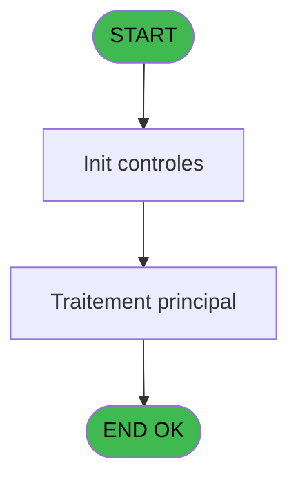
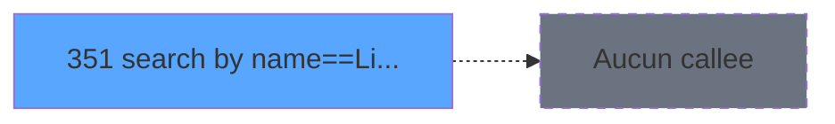

# PVE IDE 351 - search by name==Link I.J

> **Analyse**: Phases 1-4 2026-02-03 19:43 -> 19:43 (11s) | Assemblage 19:43
> **Pipeline**: V7.2 Enrichi
> **Structure**: 4 onglets (Resume | Ecrans | Donnees | Connexions)

<!-- TAB:Resume -->

## 1. FICHE D'IDENTITE

| Attribut | Valeur |
|----------|--------|
| Projet | PVE |
| IDE Position | 351 |
| Nom Programme | search by name==Link I.J |
| Fichier source | `Prg_351.xml` |
| Dossier IDE | Sauvegarde |
| Taches | 1 (1 ecrans visibles) |
| Tables modifiees | 0 |
| Programmes appeles | 0 |
| :warning: Statut | **ORPHELIN_POTENTIEL** |

## 2. DESCRIPTION FONCTIONNELLE

**search by name==Link I.J** assure la gestion complete de ce processus.

Le flux de traitement s'organise en **1 blocs fonctionnels** :

- **Traitement** (1 tache) : traitements metier divers

## 3. BLOCS FONCTIONNELS

### 3.1 Traitement (1 tache)

Traitements internes.

---

#### 351 - Search room [[ECRAN]](#ecran-t1)

**Role** : Traitement : Search room.
**Ecran** : 569 x 282 DLU (MDI) | [Voir mockup](#ecran-t1)
**Variables liees** : A (p.SearchName)

## 5. REGLES METIER

*(Aucune regle metier identifiee)*

## 6. CONTEXTE

- **Appele par**: (aucun)
- **Appelle**: 0 programmes | **Tables**: 7 (W:0 R:1 L:6) | **Taches**: 1 | **Expressions**: 10

<!-- TAB:Ecrans -->

## 8. ECRANS

### 8.1 Forms visibles (1 / 1)

| # | Position | Tache | Nom | Type | Largeur | Hauteur | Bloc |
|---|----------|-------|-----|------|---------|---------|------|
| 1 | 351 | 351 | Search room | MDI | 569 | 282 | Traitement |

### 8.2 Mockups Ecrans

---

#### 351 - Search room
**Tache** : [351](#t1) | **Type** : MDI | **Dimensions** : 569 x 282 DLU
**Bloc** : Traitement | **Titre IDE** : Search room

<!-- FORM-DATA:
{
    "width":  569,
    "vFactor":  8,
    "type":  "MDI",
    "hFactor":  4,
    "controls":  [
                     {
                         "x":  0,
                         "type":  "label",
                         "var":  "",
                         "y":  0,
                         "w":  569,
                         "fmt":  "",
                         "name":  "",
                         "h":  38,
                         "color":  "186",
                         "text":  "",
                         "parent":  null
                     },
                     {
                         "x":  17,
                         "type":  "label",
                         "var":  "",
                         "y":  14,
                         "w":  139,
                         "fmt":  "",
                         "name":  "",
                         "h":  12,
                         "color":  "186",
                         "text":  "Select the customer",
                         "parent":  2
                     },
                     {
                         "x":  0,
                         "type":  "table",
                         "var":  "",
                         "name":  "",
                         "titleH":  12,
                         "color":  "6",
                         "w":  519,
                         "y":  38,
                         "fmt":  "",
                         "parent":  null,
                         "text":  "",
                         "rowH":  30,
                         "h":  196,
                         "cols":  [
                                      {
                                          "title":  "Name",
                                          "layer":  1,
                                          "w":  146
                                      },
                                      {
                                          "title":  "First Name",
                                          "layer":  2,
                                          "w":  105
                                      },
                                      {
                                          "title":  "Sexe",
                                          "layer":  3,
                                          "w":  28
                                      },
                                      {
                                          "title":  "Room",
                                          "layer":  4,
                                          "w":  43
                                      },
                                      {
                                          "title":  "Information",
                                          "layer":  5,
                                          "w":  150
                                      },
                                      {
                                          "title":  "",
                                          "layer":  6,
                                          "w":  44
                                      }
                                  ],
                         "rows":  6
                     },
                     {
                         "x":  454,
                         "type":  "label",
                         "var":  "",
                         "y":  60,
                         "w":  15,
                         "fmt":  "",
                         "name":  "",
                         "h":  12,
                         "color":  "142",
                         "text":  "m",
                         "parent":  4
                     },
                     {
                         "x":  4,
                         "type":  "label",
                         "var":  "",
                         "y":  249,
                         "w":  563,
                         "fmt":  "",
                         "name":  "",
                         "h":  33,
                         "color":  "6",
                         "text":  "",
                         "parent":  null
                     },
                     {
                         "x":  315,
                         "type":  "button",
                         "var":  "",
                         "y":  256,
                         "w":  77,
                         "fmt":  "\u0026Cancel",
                         "name":  "",
                         "h":  24,
                         "color":  "",
                         "text":  "",
                         "parent":  null
                     },
                     {
                         "x":  491,
                         "type":  "button",
                         "var":  "",
                         "y":  256,
                         "w":  77,
                         "fmt":  "\u0026Select",
                         "name":  "",
                         "h":  24,
                         "color":  "",
                         "text":  "",
                         "parent":  null
                     },
                     {
                         "x":  270,
                         "type":  "image",
                         "var":  "",
                         "y":  1,
                         "w":  48,
                         "fmt":  "",
                         "name":  "",
                         "h":  37,
                         "color":  "",
                         "text":  "",
                         "parent":  null
                     },
                     {
                         "x":  403,
                         "type":  "image",
                         "var":  "",
                         "y":  60,
                         "w":  15,
                         "fmt":  "",
                         "name":  "v Image Garantie",
                         "h":  12,
                         "color":  "6",
                         "text":  "",
                         "parent":  4
                     },
                     {
                         "x":  4,
                         "type":  "edit",
                         "var":  "",
                         "y":  62,
                         "w":  139,
                         "fmt":  "",
                         "name":  "gm_nom",
                         "h":  11,
                         "color":  "6",
                         "text":  "",
                         "parent":  4
                     },
                     {
                         "x":  151,
                         "type":  "edit",
                         "var":  "",
                         "y":  62,
                         "w":  95,
                         "fmt":  "",
                         "name":  "gm_prenom",
                         "h":  11,
                         "color":  "6",
                         "text":  "",
                         "parent":  4
                     },
                     {
                         "x":  262,
                         "type":  "edit",
                         "var":  "",
                         "y":  62,
                         "w":  10,
                         "fmt":  "",
                         "name":  "gm_sexe",
                         "h":  11,
                         "color":  "6",
                         "text":  "",
                         "parent":  4
                     },
                     {
                         "x":  282,
                         "type":  "edit",
                         "var":  "",
                         "y":  62,
                         "w":  38,
                         "fmt":  "",
                         "name":  "heb_nom_logement",
                         "h":  11,
                         "color":  "6",
                         "text":  "",
                         "parent":  4
                     },
                     {
                         "x":  328,
                         "type":  "edit",
                         "var":  "",
                         "y":  62,
                         "w":  77,
                         "fmt":  "25",
                         "name":  "",
                         "h":  11,
                         "color":  "6",
                         "text":  "",
                         "parent":  4
                     },
                     {
                         "x":  420,
                         "type":  "image",
                         "var":  "",
                         "y":  62,
                         "w":  15,
                         "fmt":  "",
                         "name":  "",
                         "h":  11,
                         "color":  "6",
                         "text":  "",
                         "parent":  4
                     },
                     {
                         "x":  438,
                         "type":  "image",
                         "var":  "",
                         "y":  62,
                         "w":  15,
                         "fmt":  "",
                         "name":  "v Image Acheteur",
                         "h":  11,
                         "color":  "6",
                         "text":  "",
                         "parent":  4
                     },
                     {
                         "x":  478,
                         "type":  "button",
                         "var":  "",
                         "y":  54,
                         "w":  35,
                         "fmt":  "F",
                         "name":  "FILIATION",
                         "h":  24,
                         "color":  "",
                         "text":  "",
                         "parent":  4
                     },
                     {
                         "x":  519,
                         "type":  "button",
                         "var":  "",
                         "y":  142,
                         "w":  48,
                         "fmt":  "ò",
                         "name":  "DOWN",
                         "h":  92,
                         "color":  "",
                         "text":  "",
                         "parent":  null
                     },
                     {
                         "x":  519,
                         "type":  "button",
                         "var":  "",
                         "y":  38,
                         "w":  48,
                         "fmt":  "ñ",
                         "name":  "UP",
                         "h":  102,
                         "color":  "",
                         "text":  "",
                         "parent":  null
                     }
                 ],
    "taskId":  "351",
    "height":  282
}
-->

<strong>Champs : 5 champs</strong>

| Pos (x,y) | Nom | Variable | Type |
|-----------|-----|----------|------|
| 4,62 | gm_nom | - | edit |
| 151,62 | gm_prenom | - | edit |
| 262,62 | gm_sexe | - | edit |
| 282,62 | heb_nom_logement | - | edit |
| 328,62 | 25 | - | edit |

<strong>Boutons : 5 boutons</strong>

| Bouton | Pos (x,y) | Action |
|--------|-----------|--------|
| Cancel | 315,256 | Annule et retour au menu |
| Select | 491,256 | Ouvre la selection |
| F | 478,54 | Bouton fonctionnel |
| ò | 519,142 | Bouton fonctionnel |
| ñ | 519,38 | Bouton fonctionnel |

## 9. NAVIGATION

Ecran unique: **Search room**

### 9.3 Structure hierarchique (1 tache)

| Position | Tache | Type | Dimensions | Bloc |
|----------|-------|------|------------|------|
| **351.1** | [**Search room** (351)](#t1) [mockup](#ecran-t1) | MDI | 569x282 | Traitement |

### 9.4 Algorigramme

> **Legende**: Vert = START/END OK | Rouge = END KO | Bleu = Decisions
> *Algorigramme auto-genere. Utiliser `/algorigramme` pour une synthese metier detaillee.*

<!-- TAB:Donnees -->

## 10. TABLES

### Tables utilisees (7)

| ID | Nom | Description | Type | R | W | L | Usages |
|----|-----|-------------|------|---|---|---|--------|
| 30 | gm-recherche_____gmr | Index de recherche | DB | R |   |   | 1 |
| 34 | hebergement______heb | Hebergement (chambres) | DB |   |   | L | 1 |
| 47 | compte_gm________cgm | Comptes GM (generaux) | DB |   |   | L | 1 |
| 358 | import_mod |  | DB |   |   | L | 1 |
| 382 | pv_discount_reasons |  | DB |   |   | L | 1 |
| 738 | pv_selling_unit |  | DB |   |   | L | 1 |
| 845 | stat_vendeur_date |  | TMP |   |   | L | 1 |

### Colonnes par table (1 / 1 tables avec colonnes identifiees)

Table 30 - gm-recherche_____gmr (R) - 1 usages

| Lettre | Variable | Acces | Type |
|--------|----------|-------|------|
| A | p.SearchName | R | Alpha |
| B | v_Libelle_VIP | R | Alpha |
| C | v.Garantie | R | Alpha |
| D | R.xtrack cust | R | Logical |

## 11. VARIABLES

### 11.1 Parametres entrants (1)

Variables recues en parametre.

| Lettre | Nom | Type | Usage dans |
|--------|-----|------|-----------|
| A | p.SearchName | Alpha | - |

### 11.2 Variables de session (1)

Variables persistantes pendant toute la session.

| Lettre | Nom | Type | Usage dans |
|--------|-----|------|-----------|
| C | v.Garantie | Alpha | - |

### 11.3 Autres (2)

Variables diverses.

| Lettre | Nom | Type | Usage dans |
|--------|-----|------|-----------|
| B | v_Libelle_VIP | Alpha | - |
| D | R.xtrack cust | Logical | - |

## 12. EXPRESSIONS

**10 / 10 expressions decodees (100%)**

### 12.1 Repartition par type

| Type | Expressions | Regles |
|------|-------------|--------|
| CALCULATION | 1 | 0 |
| CONSTANTE | 3 | 0 |
| OTHER | 5 | 0 |
| REFERENCE_VG | 1 | 0 |

### 12.2 Expressions cles par type

#### CALCULATION (1 expressions)

| Type | IDE | Expression | Regle |
|------|-----|------------|-------|
| CALCULATION | 3 | `CallProg ('{305,-1}'PROG,[M],[N])` | - |

#### CONSTANTE (3 expressions)

| Type | IDE | Expression | Regle |
|------|-----|------------|-------|
| CONSTANTE | 7 | `'....'` | - |
| CONSTANTE | 2 | `'H'` | - |
| CONSTANTE | 1 | `'C'` | - |

#### OTHER (5 expressions)

| Type | IDE | Expression | Regle |
|------|-----|------------|-------|
| OTHER | 9 | `[X]` | - |
| OTHER | 10 | `[W]` | - |
| OTHER | 6 | `[P]` | - |
| OTHER | 4 | `[J]` | - |
| OTHER | 5 | `[K]` | - |

#### REFERENCE_VG (1 expressions)

| Type | IDE | Expression | Regle |
|------|-----|------------|-------|
| REFERENCE_VG | 8 | `VG19` | - |

<!-- TAB:Connexions -->

## 13. GRAPHE D'APPELS

### 13.1 Chaine depuis Main (Callers)

**Chemin**: (pas de callers directs)

### 13.2 Callers

| IDE | Nom Programme | Nb Appels |
|-----|---------------|-----------|
| - | (aucun) | - |

### 13.3 Callees (programmes appeles)

### 13.4 Detail Callees avec contexte

| IDE | Nom Programme | Appels | Contexte |
|-----|---------------|--------|----------|
| - | (aucun) | - | - |

## 14. RECOMMANDATIONS MIGRATION

### 14.1 Profil du programme

| Metrique | Valeur | Impact migration |
|----------|--------|-----------------|
| Lignes de logique | 57 | Programme compact |
| Expressions | 10 | Peu de logique |
| Tables WRITE | 0 | Impact faible |
| Sous-programmes | 0 | Peu de dependances |
| Ecrans visibles | 1 | Ecran unique ou traitement batch |
| Code desactive | 0% (0 / 57) | Code sain |
| Regles metier | 0 | Pas de regle identifiee |

### 14.2 Plan de migration par bloc

#### Traitement (1 tache: 1 ecran, 0 traitement)

- **Strategie** : 1 composant(s) UI (Razor/React) avec formulaires et validation.
- Decomposer les taches en services unitaires testables.

### 14.3 Dependances critiques

| Dependance | Type | Appels | Impact |
|------------|------|--------|--------|

---
*Spec DETAILED generee par Pipeline V7.2 - 2026-02-03 19:43*
