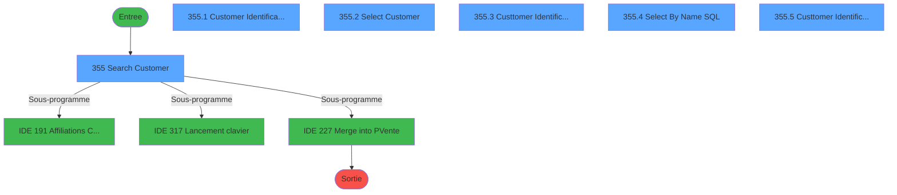
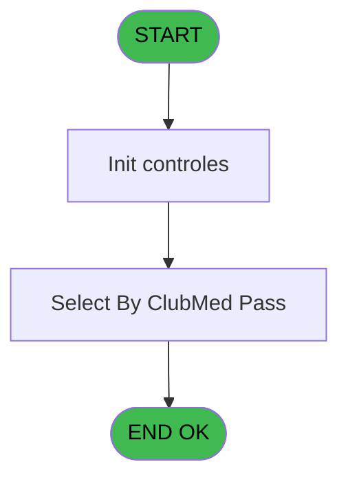
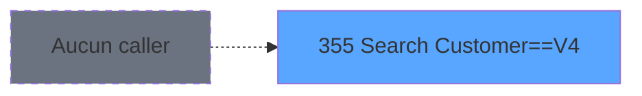
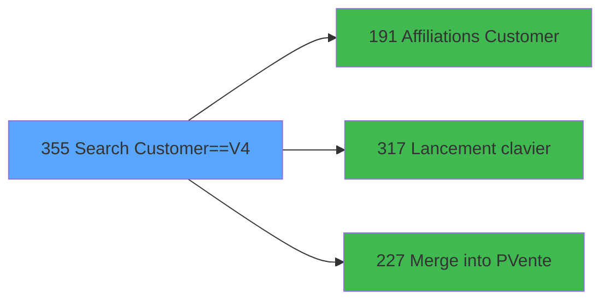

# PVE IDE 355 - Search Customer==V4

> **Analyse**: Phases 1-4 2026-02-03 19:44 -> 19:44 (11s) | Assemblage 19:44
> **Pipeline**: V7.2 Enrichi
> **Structure**: 4 onglets (Resume | Ecrans | Donnees | Connexions)

<!-- TAB:Resume -->

## 1. FICHE D'IDENTITE

| Attribut | Valeur |
|----------|--------|
| Projet | PVE |
| IDE Position | 355 |
| Nom Programme | Search Customer==V4 |
| Fichier source | `Prg_355.xml` |
| Dossier IDE | Sauvegarde |
| Taches | 7 (6 ecrans visibles) |
| Tables modifiees | 0 |
| Programmes appeles | 3 |
| :warning: Statut | **ORPHELIN_POTENTIEL** |

## 2. DESCRIPTION FONCTIONNELLE

**Search Customer==V4** assure la gestion complete de ce processus.

Le flux de traitement s'organise en **2 blocs fonctionnels** :

- **Traitement** (5 taches) : traitements metier divers
- **Consultation** (2 taches) : ecrans de recherche, selection et consultation

Detail : phases du traitement

#### Phase 1 : Traitement (5 taches)

- **355** - Search Customer **[[ECRAN]](#ecran-t1)**
- **355.1** - Customer Identification **[[ECRAN]](#ecran-t2)**
- **355.3** - Custtomer Identification **[[ECRAN]](#ecran-t4)**
- **355.3.1** - Chek Room **[[ECRAN]](#ecran-t5)**
- **355.5** - Custtomer Identification **[[ECRAN]](#ecran-t7)**

Delegue a : [Affiliations Customer (IDE 191)](PVE-IDE-191.md), [Lancement clavier (IDE 317)](PVE-IDE-317.md)

#### Phase 2 : Consultation (2 taches)

- **355.2** - Select Customer **[[ECRAN]](#ecran-t3)**
- **355.4** - Select By Name SQL **[[ECRAN]](#ecran-t6)**

## 3. BLOCS FONCTIONNELS

### 3.1 Traitement (5 taches)

Traitements internes.

---

#### 355 - Search Customer [[ECRAN]](#ecran-t1)

**Role** : Traitement : Search Customer.
**Ecran** : 992 x 432 DLU (MDI) | [Voir mockup](#ecran-t1)

4 sous-taches directes

| Tache | Nom | Bloc |
|-------|-----|------|
| [355.1](#t2) | Customer Identification **[[ECRAN]](#ecran-t2)** | Traitement |
| [355.3](#t4) | Custtomer Identification **[[ECRAN]](#ecran-t4)** | Traitement |
| [355.3.1](#t5) | Chek Room **[[ECRAN]](#ecran-t5)** | Traitement |
| [355.5](#t7) | Custtomer Identification **[[ECRAN]](#ecran-t7)** | Traitement |

**Variables liees** : G (p.Customer_Id), J (p.Lib_Bt_Customer), P (v.SearchName), Q (v.Search Room), R (v.Search*)
**Delegue a** : [Affiliations Customer (IDE 191)](PVE-IDE-191.md), [Lancement clavier (IDE 317)](PVE-IDE-317.md)

---

#### 355.1 - Customer Identification [[ECRAN]](#ecran-t2)

**Role** : Traitement : Customer Identification.
**Ecran** : 427 x 136 DLU (Type6) | [Voir mockup](#ecran-t2)
**Variables liees** : G (p.Customer_Id), J (p.Lib_Bt_Customer)
**Delegue a** : [Affiliations Customer (IDE 191)](PVE-IDE-191.md), [Lancement clavier (IDE 317)](PVE-IDE-317.md)

---

#### 355.3 - Custtomer Identification [[ECRAN]](#ecran-t4)

**Role** : Traitement : Custtomer Identification.
**Ecran** : 554 x 196 DLU (Type6) | [Voir mockup](#ecran-t4)
**Delegue a** : [Affiliations Customer (IDE 191)](PVE-IDE-191.md), [Lancement clavier (IDE 317)](PVE-IDE-317.md)

---

#### 355.3.1 - Chek Room [[ECRAN]](#ecran-t5)

**Role** : Traitement : Chek Room.
**Ecran** : 1043 x 157 DLU (Modal) | [Voir mockup](#ecran-t5)
**Variables liees** : K (p.RoomNumber), Q (v.Search Room)
**Delegue a** : [Affiliations Customer (IDE 191)](PVE-IDE-191.md), [Lancement clavier (IDE 317)](PVE-IDE-317.md)

---

#### 355.5 - Custtomer Identification [[ECRAN]](#ecran-t7)

**Role** : Traitement : Custtomer Identification.
**Ecran** : 554 x 196 DLU (Type6) | [Voir mockup](#ecran-t7)
**Delegue a** : [Affiliations Customer (IDE 191)](PVE-IDE-191.md), [Lancement clavier (IDE 317)](PVE-IDE-317.md)

### 3.2 Consultation (2 taches)

Ecrans de recherche et consultation.

---

#### 355.2 - Select Customer [[ECRAN]](#ecran-t3)

**Role** : Traitement : Select Customer.
**Ecran** : 734 x 370 DLU (Modal) | [Voir mockup](#ecran-t3)
**Variables liees** : G (p.Customer_Id), J (p.Lib_Bt_Customer), W (v.Select Filiation)

---

#### 355.4 - Select By Name SQL [[ECRAN]](#ecran-t6)

**Role** : Traitement : Select By Name SQL.
**Ecran** : 734 x 370 DLU | [Voir mockup](#ecran-t6)
**Variables liees** : P (v.SearchName), W (v.Select Filiation), U (CHG_REASON_v.SearchName), V (CHG_PRV_v.SearchName)

## 5. REGLES METIER

*(Aucune regle metier identifiee)*

## 6. CONTEXTE

- **Appele par**: (aucun)
- **Appelle**: 3 programmes | **Tables**: 8 (W:0 R:2 L:7) | **Taches**: 7 | **Expressions**: 11

<!-- TAB:Ecrans -->

## 8. ECRANS

### 8.1 Forms visibles (6 / 7)

| # | Position | Tache | Nom | Type | Largeur | Hauteur | Bloc |
|---|----------|-------|-----|------|---------|---------|------|
| 1 | 355 | 355 | Search Customer | MDI | 992 | 432 | Traitement |
| 2 | 355.1 | 355.1 | Customer Identification | Type6 | 427 | 136 | Traitement |
| 3 | 355.2 | 355.2 | Select Customer | Modal | 734 | 370 | Consultation |
| 4 | 355.3 | 355.3 | Custtomer Identification | Type6 | 554 | 196 | Traitement |
| 5 | 355.4 | 355.4 | Select By Name SQL | Type0 | 734 | 370 | Consultation |
| 6 | 355.5 | 355.5 | Custtomer Identification | Type6 | 554 | 196 | Traitement |

### 8.2 Mockups Ecrans

---

#### 355 - Search Customer
**Tache** : [355](#t1) | **Type** : MDI | **Dimensions** : 992 x 432 DLU
**Bloc** : Traitement | **Titre IDE** : Search Customer

<!-- FORM-DATA:
{
    "width":  992,
    "vFactor":  8,
    "type":  "MDI",
    "hFactor":  4,
    "controls":  [
                     {
                         "x":  0,
                         "type":  "label",
                         "var":  "",
                         "y":  4,
                         "w":  989,
                         "fmt":  "",
                         "name":  "",
                         "h":  42,
                         "color":  "182",
                         "text":  "",
                         "parent":  null
                     },
                     {
                         "x":  14,
                         "type":  "label",
                         "var":  "",
                         "y":  17,
                         "w":  512,
                         "fmt":  "",
                         "name":  "",
                         "h":  14,
                         "color":  "186",
                         "text":  "List of GM’s staying at Clubmed select them to merge them into the point of sale system",
                         "parent":  1
                     },
                     {
                         "x":  5,
                         "type":  "label",
                         "var":  "",
                         "y":  57,
                         "w":  240,
                         "fmt":  "",
                         "name":  "",
                         "h":  372,
                         "color":  "182",
                         "text":  "",
                         "parent":  null
                     },
                     {
                         "x":  11,
                         "type":  "label",
                         "var":  "",
                         "y":  84,
                         "w":  61,
                         "fmt":  "",
                         "name":  "",
                         "h":  20,
                         "color":  "182",
                         "text":  "Search Name",
                         "parent":  4
                     },
                     {
                         "x":  938,
                         "type":  "image",
                         "var":  "",
                         "y":  10,
                         "w":  48,
                         "fmt":  "",
                         "name":  "",
                         "h":  36,
                         "color":  "",
                         "text":  "",
                         "parent":  3
                     },
                     {
                         "x":  249,
                         "type":  "subform",
                         "var":  "",
                         "y":  57,
                         "w":  737,
                         "fmt":  "",
                         "name":  "Customer",
                         "h":  372,
                         "color":  "",
                         "text":  "",
                         "parent":  null
                     },
                     {
                         "x":  77,
                         "type":  "edit",
                         "var":  "",
                         "y":  84,
                         "w":  161,
                         "fmt":  "U30A",
                         "name":  "v.SearchName",
                         "h":  20,
                         "color":  "",
                         "text":  "",
                         "parent":  4
                     },
                     {
                         "x":  32,
                         "type":  "button",
                         "var":  "",
                         "y":  145,
                         "w":  185,
                         "fmt":  "Search Room",
                         "name":  "ROOM",
                         "h":  24,
                         "color":  "",
                         "text":  "",
                         "parent":  4
                     },
                     {
                         "x":  32,
                         "type":  "button",
                         "var":  "",
                         "y":  184,
                         "w":  185,
                         "fmt":  "Search Clubmed Pass",
                         "name":  "PASS",
                         "h":  24,
                         "color":  "",
                         "text":  "",
                         "parent":  4
                     },
                     {
                         "x":  32,
                         "type":  "button",
                         "var":  "",
                         "y":  223,
                         "w":  185,
                         "fmt":  "Search Equipment",
                         "name":  "Equip",
                         "h":  24,
                         "color":  "",
                         "text":  "",
                         "parent":  null
                     },
                     {
                         "x":  32,
                         "type":  "button",
                         "var":  "",
                         "y":  262,
                         "w":  185,
                         "fmt":  "Keyboard",
                         "name":  "KBD",
                         "h":  24,
                         "color":  "",
                         "text":  "",
                         "parent":  4
                     }
                 ],
    "taskId":  "355",
    "height":  432
}
-->

<strong>Champs : 1 champs</strong>

| Pos (x,y) | Nom | Variable | Type |
|-----------|-----|----------|------|
| 77,84 | v.SearchName | - | edit |

<strong>Boutons : 4 boutons</strong>

| Bouton | Pos (x,y) | Action |
|--------|-----------|--------|
| Search Room | 32,145 | Ouvre la selection |
| Search Clubmed Pass | 32,184 | Ouvre la selection |
| Search Equipment | 32,223 | Ouvre la selection |
| Keyboard | 32,262 | Bouton fonctionnel |

---

#### 355.1 - Customer Identification
**Tache** : [355.1](#t2) | **Type** : Type6 | **Dimensions** : 427 x 136 DLU
**Bloc** : Traitement | **Titre IDE** : Customer Identification

<!-- FORM-DATA:
{
    "width":  427,
    "vFactor":  8,
    "type":  "Type6",
    "hFactor":  4,
    "controls":  [
                     {
                         "x":  147,
                         "type":  "label",
                         "var":  "",
                         "y":  43,
                         "w":  250,
                         "fmt":  "",
                         "name":  "",
                         "h":  15,
                         "color":  "6",
                         "text":  "Scan Clubmed Pass",
                         "parent":  null
                     },
                     {
                         "x":  12,
                         "type":  "image",
                         "var":  "",
                         "y":  23,
                         "w":  103,
                         "fmt":  "",
                         "name":  "",
                         "h":  79,
                         "color":  "",
                         "text":  "",
                         "parent":  null
                     },
                     {
                         "x":  147,
                         "type":  "edit",
                         "var":  "",
                         "y":  59,
                         "w":  250,
                         "fmt":  "10",
                         "name":  "v.ClubMedPass",
                         "h":  15,
                         "color":  "",
                         "text":  "",
                         "parent":  null
                     },
                     {
                         "x":  147,
                         "type":  "edit",
                         "var":  "",
                         "y":  86,
                         "w":  250,
                         "fmt":  "",
                         "name":  "gm_nom",
                         "h":  12,
                         "color":  "6",
                         "text":  "",
                         "parent":  null
                     },
                     {
                         "x":  149,
                         "type":  "button",
                         "var":  "",
                         "y":  105,
                         "w":  129,
                         "fmt":  "\u0026Cancel",
                         "name":  "CANCEL",
                         "h":  24,
                         "color":  "",
                         "text":  "",
                         "parent":  null
                     }
                 ],
    "taskId":  "355.1",
    "height":  136
}
-->

<strong>Champs : 2 champs</strong>

| Pos (x,y) | Nom | Variable | Type |
|-----------|-----|----------|------|
| 147,59 | v.ClubMedPass | - | edit |
| 147,86 | gm_nom | - | edit |

<strong>Boutons : 1 boutons</strong>

| Bouton | Pos (x,y) | Action |
|--------|-----------|--------|
| Cancel | 149,105 | Annule et retour au menu |

---

#### 355.2 - Select Customer
**Tache** : [355.2](#t3) | **Type** : Modal | **Dimensions** : 734 x 370 DLU
**Bloc** : Consultation | **Titre IDE** : Select Customer

<!-- FORM-DATA:
{
    "width":  734,
    "vFactor":  8,
    "type":  "Modal",
    "hFactor":  4,
    "controls":  [
                     {
                         "x":  4,
                         "type":  "label",
                         "var":  "",
                         "y":  4,
                         "w":  140,
                         "fmt":  "",
                         "name":  "",
                         "h":  10,
                         "color":  "181",
                         "text":  "Last Name",
                         "parent":  null
                     },
                     {
                         "x":  181,
                         "type":  "label",
                         "var":  "",
                         "y":  4,
                         "w":  94,
                         "fmt":  "",
                         "name":  "",
                         "h":  10,
                         "color":  "181",
                         "text":  "First Name",
                         "parent":  null
                     },
                     {
                         "x":  297,
                         "type":  "label",
                         "var":  "",
                         "y":  4,
                         "w":  21,
                         "fmt":  "",
                         "name":  "",
                         "h":  10,
                         "color":  "181",
                         "text":  "Sex",
                         "parent":  null
                     },
                     {
                         "x":  327,
                         "type":  "label",
                         "var":  "",
                         "y":  4,
                         "w":  66,
                         "fmt":  "",
                         "name":  "",
                         "h":  10,
                         "color":  "181",
                         "text":  "Room",
                         "parent":  null
                     },
                     {
                         "x":  410,
                         "type":  "label",
                         "var":  "",
                         "y":  4,
                         "w":  94,
                         "fmt":  "",
                         "name":  "",
                         "h":  10,
                         "color":  "181",
                         "text":  "Information",
                         "parent":  null
                     },
                     {
                         "x":  0,
                         "type":  "label",
                         "var":  "",
                         "y":  336,
                         "w":  734,
                         "fmt":  "",
                         "name":  "",
                         "h":  32,
                         "color":  "189",
                         "text":  "",
                         "parent":  null
                     },
                     {
                         "x":  0,
                         "type":  "table",
                         "var":  "",
                         "name":  "",
                         "titleH":  12,
                         "color":  "6",
                         "w":  676,
                         "y":  15,
                         "fmt":  "",
                         "parent":  null,
                         "text":  "",
                         "rowH":  24,
                         "h":  312,
                         "cols":  [
                                      {
                                          "title":  "Name",
                                          "layer":  1,
                                          "w":  173
                                      },
                                      {
                                          "title":  "First Name",
                                          "layer":  2,
                                          "w":  116
                                      },
                                      {
                                          "title":  "Sex",
                                          "layer":  3,
                                          "w":  30
                                      },
                                      {
                                          "title":  "Room",
                                          "layer":  4,
                                          "w":  77
                                      },
                                      {
                                          "title":  "Information",
                                          "layer":  5,
                                          "w":  231
                                      },
                                      {
                                          "title":  "",
                                          "layer":  6,
                                          "w":  45
                                      }
                                  ],
                         "rows":  6
                     },
                     {
                         "x":  606,
                         "type":  "label",
                         "var":  "",
                         "y":  22,
                         "w":  15,
                         "fmt":  "",
                         "name":  "",
                         "h":  12,
                         "color":  "142",
                         "text":  "m",
                         "parent":  10
                     },
                     {
                         "x":  4,
                         "type":  "edit",
                         "var":  "",
                         "y":  22,
                         "w":  164,
                         "fmt":  "",
                         "name":  "gm_nom",
                         "h":  11,
                         "color":  "6",
                         "text":  "",
                         "parent":  10
                     },
                     {
                         "x":  181,
                         "type":  "edit",
                         "var":  "",
                         "y":  22,
                         "w":  105,
                         "fmt":  "",
                         "name":  "gm_prenom",
                         "h":  11,
                         "color":  "6",
                         "text":  "",
                         "parent":  10
                     },
                     {
                         "x":  301,
                         "type":  "edit",
                         "var":  "",
                         "y":  22,
                         "w":  10,
                         "fmt":  "",
                         "name":  "gm_sexe",
                         "h":  11,
                         "color":  "6",
                         "text":  "",
                         "parent":  10
                     },
                     {
                         "x":  327,
                         "type":  "edit",
                         "var":  "",
                         "y":  22,
                         "w":  63,
                         "fmt":  "",
                         "name":  "heb_nom_logement",
                         "h":  11,
                         "color":  "6",
                         "text":  "",
                         "parent":  10
                     },
                     {
                         "x":  410,
                         "type":  "edit",
                         "var":  "",
                         "y":  22,
                         "w":  141,
                         "fmt":  "25",
                         "name":  "",
                         "h":  11,
                         "color":  "6",
                         "text":  "",
                         "parent":  10
                     },
                     {
                         "x":  555,
                         "type":  "image",
                         "var":  "",
                         "y":  22,
                         "w":  15,
                         "fmt":  "",
                         "name":  "v Image Garantie",
                         "h":  12,
                         "color":  "6",
                         "text":  "",
                         "parent":  10
                     },
                     {
                         "x":  572,
                         "type":  "image",
                         "var":  "",
                         "y":  22,
                         "w":  15,
                         "fmt":  "",
                         "name":  "",
                         "h":  11,
                         "color":  "6",
                         "text":  "",
                         "parent":  10
                     },
                     {
                         "x":  590,
                         "type":  "image",
                         "var":  "",
                         "y":  22,
                         "w":  15,
                         "fmt":  "",
                         "name":  "v Image Acheteur",
                         "h":  11,
                         "color":  "6",
                         "text":  "",
                         "parent":  10
                     },
                     {
                         "x":  637,
                         "type":  "button",
                         "var":  "",
                         "y":  17,
                         "w":  35,
                         "fmt":  "F",
                         "name":  "FILIATION",
                         "h":  24,
                         "color":  "",
                         "text":  "",
                         "parent":  10
                     },
                     {
                         "x":  438,
                         "type":  "image",
                         "var":  "",
                         "y":  15,
                         "w":  10,
                         "fmt":  "",
                         "name":  "v Image Garantie",
                         "h":  17,
                         "color":  "6",
                         "text":  "",
                         "parent":  null
                     },
                     {
                         "x":  447,
                         "type":  "image",
                         "var":  "",
                         "y":  15,
                         "w":  10,
                         "fmt":  "",
                         "name":  "",
                         "h":  17,
                         "color":  "6",
                         "text":  "",
                         "parent":  null
                     },
                     {
                         "x":  676,
                         "type":  "button",
                         "var":  "",
                         "y":  15,
                         "w":  48,
                         "fmt":  "ñ",
                         "name":  "UP",
                         "h":  156,
                         "color":  "",
                         "text":  "",
                         "parent":  null
                     },
                     {
                         "x":  454,
                         "type":  "image",
                         "var":  "",
                         "y":  17,
                         "w":  10,
                         "fmt":  "",
                         "name":  "v Image Acheteur",
                         "h":  17,
                         "color":  "6",
                         "text":  "",
                         "parent":  null
                     },
                     {
                         "x":  676,
                         "type":  "button",
                         "var":  "",
                         "y":  171,
                         "w":  48,
                         "fmt":  "ò",
                         "name":  "DOWN",
                         "h":  156,
                         "color":  "",
                         "text":  "",
                         "parent":  null
                     },
                     {
                         "x":  503,
                         "type":  "button",
                         "var":  "",
                         "y":  340,
                         "w":  108,
                         "fmt":  "Select",
                         "name":  "SELECT",
                         "h":  24,
                         "color":  "",
                         "text":  "",
                         "parent":  9
                     },
                     {
                         "x":  622,
                         "type":  "button",
                         "var":  "",
                         "y":  340,
                         "w":  104,
                         "fmt":  "Cancel",
                         "name":  "CANCEL",
                         "h":  24,
                         "color":  "",
                         "text":  "",
                         "parent":  9
                     }
                 ],
    "taskId":  "355.2",
    "height":  370
}
-->

<strong>Champs : 5 champs</strong>

| Pos (x,y) | Nom | Variable | Type |
|-----------|-----|----------|------|
| 4,22 | gm_nom | - | edit |
| 181,22 | gm_prenom | - | edit |
| 301,22 | gm_sexe | - | edit |
| 327,22 | heb_nom_logement | - | edit |
| 410,22 | 25 | - | edit |

<strong>Boutons : 5 boutons</strong>

| Bouton | Pos (x,y) | Action |
|--------|-----------|--------|
| F | 637,17 | Bouton fonctionnel |
| ñ | 676,15 | Bouton fonctionnel |
| ò | 676,171 | Bouton fonctionnel |
| Select | 503,340 | Ouvre la selection |
| Cancel | 622,340 | Annule et retour au menu |

---

#### 355.3 - Custtomer Identification
**Tache** : [355.3](#t4) | **Type** : Type6 | **Dimensions** : 554 x 196 DLU
**Bloc** : Traitement | **Titre IDE** : Custtomer Identification

<!-- FORM-DATA:
{
    "width":  554,
    "vFactor":  8,
    "type":  "Type6",
    "hFactor":  4,
    "controls":  [
                     {
                         "x":  0,
                         "type":  "label",
                         "var":  "",
                         "y":  0,
                         "w":  552,
                         "fmt":  "",
                         "name":  "",
                         "h":  41,
                         "color":  "189",
                         "text":  "",
                         "parent":  null
                     },
                     {
                         "x":  19,
                         "type":  "label",
                         "var":  "",
                         "y":  12,
                         "w":  248,
                         "fmt":  "",
                         "name":  "",
                         "h":  16,
                         "color":  "186",
                         "text":  "Customer according to this room #",
                         "parent":  null
                     },
                     {
                         "x":  155,
                         "type":  "label",
                         "var":  "",
                         "y":  63,
                         "w":  171,
                         "fmt":  "",
                         "name":  "",
                         "h":  15,
                         "color":  "6",
                         "text":  "Type the room number",
                         "parent":  null
                     },
                     {
                         "x":  0,
                         "type":  "label",
                         "var":  "",
                         "y":  160,
                         "w":  552,
                         "fmt":  "",
                         "name":  "",
                         "h":  35,
                         "color":  "189",
                         "text":  "",
                         "parent":  null
                     },
                     {
                         "x":  499,
                         "type":  "image",
                         "var":  "",
                         "y":  3,
                         "w":  49,
                         "fmt":  "",
                         "name":  "",
                         "h":  35,
                         "color":  "",
                         "text":  "",
                         "parent":  null
                     },
                     {
                         "x":  20,
                         "type":  "image",
                         "var":  "",
                         "y":  54,
                         "w":  80,
                         "fmt":  "",
                         "name":  "",
                         "h":  62,
                         "color":  "",
                         "text":  "",
                         "parent":  null
                     },
                     {
                         "x":  155,
                         "type":  "edit",
                         "var":  "",
                         "y":  82,
                         "w":  111,
                         "fmt":  "U6A",
                         "name":  "Room_Number",
                         "h":  16,
                         "color":  "",
                         "text":  "",
                         "parent":  null
                     },
                     {
                         "x":  8,
                         "type":  "button",
                         "var":  "",
                         "y":  165,
                         "w":  100,
                         "fmt":  "\u0026Keyboard",
                         "name":  "KEYBOARD",
                         "h":  24,
                         "color":  "",
                         "text":  "",
                         "parent":  null
                     },
                     {
                         "x":  336,
                         "type":  "button",
                         "var":  "",
                         "y":  165,
                         "w":  100,
                         "fmt":  "\u0026Cancel",
                         "name":  "CANCEL",
                         "h":  24,
                         "color":  "",
                         "text":  "",
                         "parent":  null
                     },
                     {
                         "x":  445,
                         "type":  "button",
                         "var":  "",
                         "y":  165,
                         "w":  100,
                         "fmt":  "\u0026Search",
                         "name":  "CHECK",
                         "h":  24,
                         "color":  "",
                         "text":  "",
                         "parent":  null
                     }
                 ],
    "taskId":  "355.3",
    "height":  196
}
-->

<strong>Champs : 1 champs</strong>

| Pos (x,y) | Nom | Variable | Type |
|-----------|-----|----------|------|
| 155,82 | Room_Number | - | edit |

<strong>Boutons : 3 boutons</strong>

| Bouton | Pos (x,y) | Action |
|--------|-----------|--------|
| Keyboard | 8,165 | Bouton fonctionnel |
| Cancel | 336,165 | Annule et retour au menu |
| Search | 445,165 | Ouvre la selection |

---

#### 355.4 - Select By Name SQL
**Tache** : [355.4](#t6) | **Type** : Type0 | **Dimensions** : 734 x 370 DLU
**Bloc** : Consultation | **Titre IDE** : Select By Name SQL

<!-- FORM-DATA:
{
    "width":  734,
    "vFactor":  8,
    "type":  "Type0",
    "hFactor":  4,
    "controls":  [
                     {
                         "x":  6,
                         "type":  "label",
                         "var":  "",
                         "y":  2,
                         "w":  140,
                         "fmt":  "",
                         "name":  "",
                         "h":  10,
                         "color":  "181",
                         "text":  "Last Name",
                         "parent":  null
                     },
                     {
                         "x":  183,
                         "type":  "label",
                         "var":  "",
                         "y":  2,
                         "w":  94,
                         "fmt":  "",
                         "name":  "",
                         "h":  10,
                         "color":  "181",
                         "text":  "First Name",
                         "parent":  null
                     },
                     {
                         "x":  299,
                         "type":  "label",
                         "var":  "",
                         "y":  2,
                         "w":  21,
                         "fmt":  "",
                         "name":  "",
                         "h":  10,
                         "color":  "181",
                         "text":  "Sex",
                         "parent":  null
                     },
                     {
                         "x":  329,
                         "type":  "label",
                         "var":  "",
                         "y":  2,
                         "w":  66,
                         "fmt":  "",
                         "name":  "",
                         "h":  10,
                         "color":  "181",
                         "text":  "Room",
                         "parent":  null
                     },
                     {
                         "x":  412,
                         "type":  "label",
                         "var":  "",
                         "y":  2,
                         "w":  94,
                         "fmt":  "",
                         "name":  "",
                         "h":  10,
                         "color":  "181",
                         "text":  "Information",
                         "parent":  null
                     },
                     {
                         "x":  2,
                         "type":  "label",
                         "var":  "",
                         "y":  329,
                         "w":  730,
                         "fmt":  "",
                         "name":  "",
                         "h":  32,
                         "color":  "189",
                         "text":  "",
                         "parent":  null
                     },
                     {
                         "x":  2,
                         "type":  "table",
                         "var":  "",
                         "name":  "",
                         "titleH":  12,
                         "color":  "6",
                         "w":  676,
                         "y":  13,
                         "fmt":  "",
                         "parent":  null,
                         "text":  "",
                         "rowH":  24,
                         "h":  312,
                         "cols":  [
                                      {
                                          "title":  "Name",
                                          "layer":  1,
                                          "w":  173
                                      },
                                      {
                                          "title":  "First Name",
                                          "layer":  2,
                                          "w":  116
                                      },
                                      {
                                          "title":  "Sex",
                                          "layer":  3,
                                          "w":  30
                                      },
                                      {
                                          "title":  "Room",
                                          "layer":  4,
                                          "w":  77
                                      },
                                      {
                                          "title":  "Information",
                                          "layer":  5,
                                          "w":  231
                                      },
                                      {
                                          "title":  "",
                                          "layer":  6,
                                          "w":  45
                                      }
                                  ],
                         "rows":  6
                     },
                     {
                         "x":  608,
                         "type":  "label",
                         "var":  "",
                         "y":  20,
                         "w":  15,
                         "fmt":  "",
                         "name":  "",
                         "h":  12,
                         "color":  "142",
                         "text":  "m",
                         "parent":  10
                     },
                     {
                         "x":  6,
                         "type":  "edit",
                         "var":  "",
                         "y":  20,
                         "w":  164,
                         "fmt":  "U30",
                         "name":  "gm_nom",
                         "h":  11,
                         "color":  "6",
                         "text":  "",
                         "parent":  10
                     },
                     {
                         "x":  183,
                         "type":  "edit",
                         "var":  "",
                         "y":  20,
                         "w":  105,
                         "fmt":  "",
                         "name":  "gm_prenom",
                         "h":  11,
                         "color":  "6",
                         "text":  "",
                         "parent":  10
                     },
                     {
                         "x":  303,
                         "type":  "edit",
                         "var":  "",
                         "y":  20,
                         "w":  10,
                         "fmt":  "",
                         "name":  "gm_sexe",
                         "h":  11,
                         "color":  "6",
                         "text":  "",
                         "parent":  10
                     },
                     {
                         "x":  329,
                         "type":  "edit",
                         "var":  "",
                         "y":  20,
                         "w":  63,
                         "fmt":  "",
                         "name":  "heb_nom_logement",
                         "h":  11,
                         "color":  "6",
                         "text":  "",
                         "parent":  10
                     },
                     {
                         "x":  406,
                         "type":  "edit",
                         "var":  "",
                         "y":  20,
                         "w":  147,
                         "fmt":  "25",
                         "name":  "",
                         "h":  11,
                         "color":  "6",
                         "text":  "",
                         "parent":  10
                     },
                     {
                         "x":  557,
                         "type":  "image",
                         "var":  "",
                         "y":  20,
                         "w":  15,
                         "fmt":  "",
                         "name":  "v Image Garantie",
                         "h":  12,
                         "color":  "6",
                         "text":  "",
                         "parent":  10
                     },
                     {
                         "x":  574,
                         "type":  "image",
                         "var":  "",
                         "y":  20,
                         "w":  15,
                         "fmt":  "",
                         "name":  "",
                         "h":  11,
                         "color":  "6",
                         "text":  "",
                         "parent":  10
                     },
                     {
                         "x":  592,
                         "type":  "image",
                         "var":  "",
                         "y":  20,
                         "w":  15,
                         "fmt":  "",
                         "name":  "v Image Acheteur",
                         "h":  11,
                         "color":  "6",
                         "text":  "",
                         "parent":  10
                     },
                     {
                         "x":  639,
                         "type":  "button",
                         "var":  "",
                         "y":  15,
                         "w":  35,
                         "fmt":  "F",
                         "name":  "FILIATION",
                         "h":  24,
                         "color":  "",
                         "text":  "",
                         "parent":  10
                     },
                     {
                         "x":  440,
                         "type":  "image",
                         "var":  "",
                         "y":  13,
                         "w":  10,
                         "fmt":  "",
                         "name":  "v Image Garantie",
                         "h":  17,
                         "color":  "6",
                         "text":  "",
                         "parent":  null
                     },
                     {
                         "x":  449,
                         "type":  "image",
                         "var":  "",
                         "y":  13,
                         "w":  10,
                         "fmt":  "",
                         "name":  "",
                         "h":  17,
                         "color":  "6",
                         "text":  "",
                         "parent":  null
                     },
                     {
                         "x":  678,
                         "type":  "button",
                         "var":  "",
                         "y":  13,
                         "w":  48,
                         "fmt":  "ñ",
                         "name":  "UP",
                         "h":  156,
                         "color":  "",
                         "text":  "",
                         "parent":  null
                     },
                     {
                         "x":  456,
                         "type":  "image",
                         "var":  "",
                         "y":  15,
                         "w":  10,
                         "fmt":  "",
                         "name":  "v Image Acheteur",
                         "h":  17,
                         "color":  "6",
                         "text":  "",
                         "parent":  null
                     },
                     {
                         "x":  678,
                         "type":  "button",
                         "var":  "",
                         "y":  169,
                         "w":  48,
                         "fmt":  "ò",
                         "name":  "DOWN",
                         "h":  156,
                         "color":  "",
                         "text":  "",
                         "parent":  null
                     },
                     {
                         "x":  505,
                         "type":  "button",
                         "var":  "",
                         "y":  333,
                         "w":  108,
                         "fmt":  "Select",
                         "name":  "SELECT",
                         "h":  24,
                         "color":  "",
                         "text":  "",
                         "parent":  9
                     },
                     {
                         "x":  624,
                         "type":  "button",
                         "var":  "",
                         "y":  333,
                         "w":  104,
                         "fmt":  "Cancel",
                         "name":  "CANCEL",
                         "h":  24,
                         "color":  "",
                         "text":  "",
                         "parent":  9
                     }
                 ],
    "taskId":  "355.4",
    "height":  370
}
-->

<strong>Champs : 5 champs</strong>

| Pos (x,y) | Nom | Variable | Type |
|-----------|-----|----------|------|
| 6,20 | gm_nom | - | edit |
| 183,20 | gm_prenom | - | edit |
| 303,20 | gm_sexe | - | edit |
| 329,20 | heb_nom_logement | - | edit |
| 406,20 | 25 | - | edit |

<strong>Boutons : 5 boutons</strong>

| Bouton | Pos (x,y) | Action |
|--------|-----------|--------|
| F | 639,15 | Bouton fonctionnel |
| ñ | 678,13 | Bouton fonctionnel |
| ò | 678,169 | Bouton fonctionnel |
| Select | 505,333 | Ouvre la selection |
| Cancel | 624,333 | Annule et retour au menu |

---

#### 355.5 - Custtomer Identification
**Tache** : [355.5](#t7) | **Type** : Type6 | **Dimensions** : 554 x 196 DLU
**Bloc** : Traitement | **Titre IDE** : Custtomer Identification

<!-- FORM-DATA:
{
    "width":  554,
    "vFactor":  8,
    "type":  "Type6",
    "hFactor":  4,
    "controls":  [
                     {
                         "x":  0,
                         "type":  "label",
                         "var":  "",
                         "y":  0,
                         "w":  552,
                         "fmt":  "",
                         "name":  "",
                         "h":  41,
                         "color":  "189",
                         "text":  "",
                         "parent":  null
                     },
                     {
                         "x":  19,
                         "type":  "label",
                         "var":  "",
                         "y":  12,
                         "w":  248,
                         "fmt":  "",
                         "name":  "",
                         "h":  16,
                         "color":  "186",
                         "text":  "Customer according to his equipment",
                         "parent":  null
                     },
                     {
                         "x":  192,
                         "type":  "label",
                         "var":  "",
                         "y":  63,
                         "w":  171,
                         "fmt":  "",
                         "name":  "",
                         "h":  15,
                         "color":  "6",
                         "text":  "Type the Equipment Id",
                         "parent":  null
                     },
                     {
                         "x":  0,
                         "type":  "label",
                         "var":  "",
                         "y":  160,
                         "w":  552,
                         "fmt":  "",
                         "name":  "",
                         "h":  35,
                         "color":  "189",
                         "text":  "",
                         "parent":  null
                     },
                     {
                         "x":  499,
                         "type":  "image",
                         "var":  "",
                         "y":  3,
                         "w":  49,
                         "fmt":  "",
                         "name":  "",
                         "h":  35,
                         "color":  "",
                         "text":  "",
                         "parent":  null
                     },
                     {
                         "x":  20,
                         "type":  "image",
                         "var":  "",
                         "y":  54,
                         "w":  80,
                         "fmt":  "",
                         "name":  "",
                         "h":  62,
                         "color":  "",
                         "text":  "",
                         "parent":  null
                     },
                     {
                         "x":  192,
                         "type":  "edit",
                         "var":  "",
                         "y":  82,
                         "w":  171,
                         "fmt":  "U10",
                         "name":  "Equipment_Id",
                         "h":  16,
                         "color":  "",
                         "text":  "",
                         "parent":  null
                     },
                     {
                         "x":  8,
                         "type":  "button",
                         "var":  "",
                         "y":  165,
                         "w":  100,
                         "fmt":  "\u0026Keyboard",
                         "name":  "KEYBOARD",
                         "h":  24,
                         "color":  "",
                         "text":  "",
                         "parent":  null
                     },
                     {
                         "x":  336,
                         "type":  "button",
                         "var":  "",
                         "y":  165,
                         "w":  100,
                         "fmt":  "\u0026Cancel",
                         "name":  "CANCEL",
                         "h":  24,
                         "color":  "",
                         "text":  "",
                         "parent":  null
                     },
                     {
                         "x":  445,
                         "type":  "button",
                         "var":  "",
                         "y":  165,
                         "w":  100,
                         "fmt":  "\u0026Search",
                         "name":  "CHECK",
                         "h":  24,
                         "color":  "",
                         "text":  "",
                         "parent":  null
                     }
                 ],
    "taskId":  "355.5",
    "height":  196
}
-->

<strong>Champs : 1 champs</strong>

| Pos (x,y) | Nom | Variable | Type |
|-----------|-----|----------|------|
| 192,82 | Equipment_Id | - | edit |

<strong>Boutons : 3 boutons</strong>

| Bouton | Pos (x,y) | Action |
|--------|-----------|--------|
| Keyboard | 8,165 | Bouton fonctionnel |
| Cancel | 336,165 | Annule et retour au menu |
| Search | 445,165 | Ouvre la selection |

## 9. NAVIGATION

### 9.1 Enchainement des ecrans

**Detail par enchainement :**

| Depuis | Action | Vers | Retour |
|--------|--------|------|--------|
| Search Customer | Sous-programme | [Affiliations Customer (IDE 191)](PVE-IDE-191.md) | Retour ecran |
| Search Customer | Sous-programme | [Lancement clavier (IDE 317)](PVE-IDE-317.md) | Retour ecran |
| Search Customer | Sous-programme | [Merge into PVente (IDE 227)](PVE-IDE-227.md) | Retour ecran |

### 9.3 Structure hierarchique (7 taches)

| Position | Tache | Type | Dimensions | Bloc |
|----------|-------|------|------------|------|
| **355.1** | [**Search Customer** (355)](#t1) [mockup](#ecran-t1) | MDI | 992x432 | Traitement |
| 355.1.1 | [Customer Identification (355.1)](#t2) [mockup](#ecran-t2) | Type6 | 427x136 | |
| 355.1.2 | [Custtomer Identification (355.3)](#t4) [mockup](#ecran-t4) | Type6 | 554x196 | |
| 355.1.3 | [Chek Room (355.3.1)](#t5) [mockup](#ecran-t5) | Modal | 1043x157 | |
| 355.1.4 | [Custtomer Identification (355.5)](#t7) [mockup](#ecran-t7) | Type6 | 554x196 | |
| **355.2** | [**Select Customer** (355.2)](#t3) [mockup](#ecran-t3) | Modal | 734x370 | Consultation |
| 355.2.1 | [Select By Name SQL (355.4)](#t6) [mockup](#ecran-t6) | - | 734x370 | |

### 9.4 Algorigramme

> **Legende**: Vert = START/END OK | Rouge = END KO | Bleu = Decisions
> *Algorigramme auto-genere. Utiliser `/algorigramme` pour une synthese metier detaillee.*

<!-- TAB:Donnees -->

## 10. TABLES

### Tables utilisees (8)

| ID | Nom | Description | Type | R | W | L | Usages |
|----|-----|-------------|------|---|---|---|--------|
| 30 | gm-recherche_____gmr | Index de recherche | DB | R |   |   | 3 |
| 34 | hebergement______heb | Hebergement (chambres) | DB | R |   | L | 5 |
| 47 | compte_gm________cgm | Comptes GM (generaux) | DB |   |   | L | 1 |
| 312 | ez_card |  | DB |   |   | L | 4 |
| 358 | import_mod |  | DB |   |   | L | 1 |
| 382 | pv_discount_reasons |  | DB |   |   | L | 5 |
| 404 | pv_sellers_by_week |  | DB |   |   | L | 1 |
| 845 | stat_vendeur_date |  | TMP |   |   | L | 1 |

### Colonnes par table (4 / 2 tables avec colonnes identifiees)

Table 30 - gm-recherche_____gmr (R) - 3 usages

| Lettre | Variable | Acces | Type |
|--------|----------|-------|------|
| A | v.ClubMedPass | R | Unicode |
| B | L.RetourPass | R | Logical |
| C | V.Echap ? | R | Logical |
| D | v.SeletFiliation | R | Logical |
| E | v.Fin_Liste | R | Logical |

Table 34 - hebergement______heb (R/L) - 5 usages

| Lettre | Variable | Acces | Type |
|--------|----------|-------|------|
| A | v.RoomNumber | R | Unicode |
| B | V.RetourRoom | R | Logical |
| C | v.Nbre Occupant | R | Numeric |
| D | v.LHebergement | R | Logical |

## 11. VARIABLES

### 11.1 Parametres entrants (15)

Variables recues en parametre.

| Lettre | Nom | Type | Usage dans |
|--------|-----|------|-----------|
| A | p.VPosPayeur_ID_FromCard | Numeric | - |
| B | p.V.PmsAccount_From_Card | Numeric | - |
| C | p.V.PmsFiliation_From_Card | Numeric | - |
| D | p.Provenance | Alpha | - |
| E | p.V.EZ_Card | Unicode | - |
| F | p.Societe | Unicode | - |
| G | p.Customer_Id | Numeric | - |
| H | p.Compte | Numeric | - |
| I | p.Filiation | Numeric | - |
| J | p.Lib_Bt_Customer | Alpha | - |
| K | p.RoomNumber | Alpha | - |
| L | p.Recherche_ClubMed_Pass | Alpha | - |
| M | p.Deb_Sejour | Date | - |
| N | p.Fin_Sejour | Date | - |
| O | p.Qualite | Alpha | - |

### 11.2 Variables de session (10)

Variables persistantes pendant toute la session.

| Lettre | Nom | Type | Usage dans |
|--------|-----|------|-----------|
| P | v.SearchName | Unicode | 2x session |
| Q | v.Search Room | Unicode | [355.3.1](#t5) |
| R | v.Search* | Unicode | - |
| S | v.Fin | Logical | 1x session |
| T | v.Liste_Visible | Logical | 1x session |
| W | v.Select Filiation | Logical | - |
| X | v.Fin Liste | Logical | - |
| Y | v.Libelle VIP | Unicode | - |
| Z | v.debut sejour | Date | - |
| BA | v.fin sejour | Date | - |

### 11.3 Autres (2)

Variables diverses.

| Lettre | Nom | Type | Usage dans |
|--------|-----|------|-----------|
| U | CHG_REASON_v.SearchName | Numeric | - |
| V | CHG_PRV_v.SearchName | Unicode | - |

Toutes les 27 variables (liste complete)

| Cat | Lettre | Nom Variable | Type |
|-----|--------|--------------|------|
| P0 | **A** | p.VPosPayeur_ID_FromCard | Numeric |
| P0 | **B** | p.V.PmsAccount_From_Card | Numeric |
| P0 | **C** | p.V.PmsFiliation_From_Card | Numeric |
| P0 | **D** | p.Provenance | Alpha |
| P0 | **E** | p.V.EZ_Card | Unicode |
| P0 | **F** | p.Societe | Unicode |
| P0 | **G** | p.Customer_Id | Numeric |
| P0 | **H** | p.Compte | Numeric |
| P0 | **I** | p.Filiation | Numeric |
| P0 | **J** | p.Lib_Bt_Customer | Alpha |
| P0 | **K** | p.RoomNumber | Alpha |
| P0 | **L** | p.Recherche_ClubMed_Pass | Alpha |
| P0 | **M** | p.Deb_Sejour | Date |
| P0 | **N** | p.Fin_Sejour | Date |
| P0 | **O** | p.Qualite | Alpha |
| V. | **P** | v.SearchName | Unicode |
| V. | **Q** | v.Search Room | Unicode |
| V. | **R** | v.Search* | Unicode |
| V. | **S** | v.Fin | Logical |
| V. | **T** | v.Liste_Visible | Logical |
| V. | **W** | v.Select Filiation | Logical |
| V. | **X** | v.Fin Liste | Logical |
| V. | **Y** | v.Libelle VIP | Unicode |
| V. | **Z** | v.debut sejour | Date |
| V. | **BA** | v.fin sejour | Date |
| Autre | **U** | CHG_REASON_v.SearchName | Numeric |
| Autre | **V** | CHG_PRV_v.SearchName | Unicode |

## 12. EXPRESSIONS

**11 / 11 expressions decodees (100%)**

### 12.1 Repartition par type

| Type | Expressions | Regles |
|------|-------------|--------|
| CONCATENATION | 1 | 0 |
| CONSTANTE | 2 | 0 |
| OTHER | 4 | 0 |
| CAST_LOGIQUE | 2 | 0 |
| CONDITION | 2 | 0 |

### 12.2 Expressions cles par type

#### CONCATENATION (1 expressions)

| Type | IDE | Expression | Regle |
|------|-----|------------|-------|
| CONCATENATION | 1 | `Trim(v.SearchName [P])&'*'` | - |

#### CONSTANTE (2 expressions)

| Type | IDE | Expression | Regle |
|------|-----|------------|-------|
| CONSTANTE | 7 | `'Customer'` | - |
| CONSTANTE | 6 | `''` | - |

#### OTHER (4 expressions)

| Type | IDE | Expression | Regle |
|------|-----|------------|-------|
| OTHER | 5 | `v.Search Room [Q]` | - |
| OTHER | 8 | `CtrlGoto('v.SearchName',0,0)` | - |
| OTHER | 2 | `v.Fin [S]` | - |
| OTHER | 3 | `v.Liste_Visible [T]` | - |

#### CAST_LOGIQUE (2 expressions)

| Type | IDE | Expression | Regle |
|------|-----|------------|-------|
| CAST_LOGIQUE | 11 | `GetParam ('RENTAL')='TRUE'LOG` | - |
| CAST_LOGIQUE | 4 | `'TRUE'LOG` | - |

#### CONDITION (2 expressions)

| Type | IDE | Expression | Regle |
|------|-----|------------|-------|
| CONDITION | 10 | `VG33<>'TB'` | - |
| CONDITION | 9 | `VG33='TB'` | - |

<!-- TAB:Connexions -->

## 13. GRAPHE D'APPELS

### 13.1 Chaine depuis Main (Callers)

**Chemin**: (pas de callers directs)

### 13.2 Callers

| IDE | Nom Programme | Nb Appels |
|-----|---------------|-----------|
| - | (aucun) | - |

### 13.3 Callees (programmes appeles)

### 13.4 Detail Callees avec contexte

| IDE | Nom Programme | Appels | Contexte |
|-----|---------------|--------|----------|
| [191](PVE-IDE-191.md) | Affiliations Customer | 3 | Sous-programme |
| [317](PVE-IDE-317.md) | Lancement clavier | 3 | Sous-programme |
| [227](PVE-IDE-227.md) | Merge into PVente | 1 | Sous-programme |

## 14. RECOMMANDATIONS MIGRATION

### 14.1 Profil du programme

| Metrique | Valeur | Impact migration |
|----------|--------|-----------------|
| Lignes de logique | 394 | Taille moyenne |
| Expressions | 11 | Peu de logique |
| Tables WRITE | 0 | Impact faible |
| Sous-programmes | 3 | Peu de dependances |
| Ecrans visibles | 6 | Interface complexe multi-ecrans |
| Code desactive | 1% (4 / 394) | Code sain |
| Regles metier | 0 | Pas de regle identifiee |

### 14.2 Plan de migration par bloc

#### Traitement (5 taches: 5 ecrans, 0 traitement)

- **Strategie** : 5 composant(s) UI (Razor/React) avec formulaires et validation.
- 3 sous-programme(s) a migrer ou a reutiliser depuis les services existants.
- Decomposer les taches en services unitaires testables.

#### Consultation (2 taches: 2 ecrans, 0 traitement)

- **Strategie** : Composants de recherche/selection en modales.
- 2 ecrans : Select Customer, Select By Name SQL

### 14.3 Dependances critiques

| Dependance | Type | Appels | Impact |
|------------|------|--------|--------|
| [Lancement clavier (IDE 317)](PVE-IDE-317.md) | Sous-programme | 3x | **CRITIQUE** - Sous-programme |
| [Affiliations Customer (IDE 191)](PVE-IDE-191.md) | Sous-programme | 3x | **CRITIQUE** - Sous-programme |
| [Merge into PVente (IDE 227)](PVE-IDE-227.md) | Sous-programme | 1x | Normale - Sous-programme |

---
*Spec DETAILED generee par Pipeline V7.2 - 2026-02-03 19:44*
