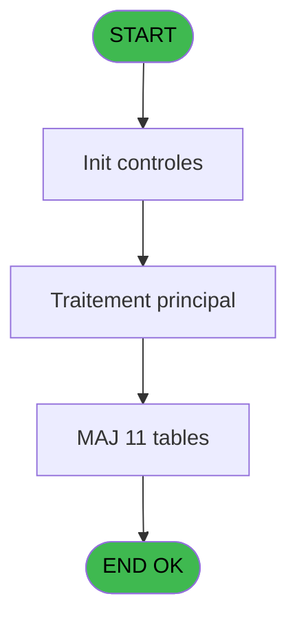
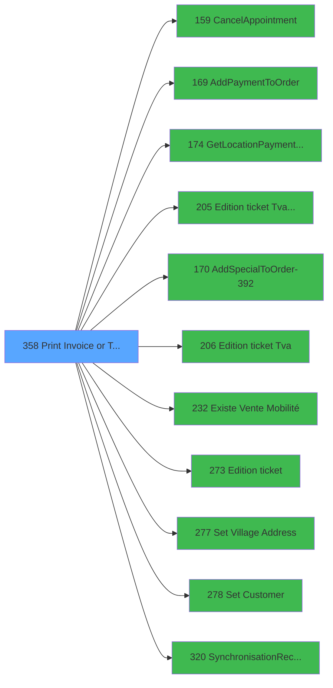

# PVE IDE 358 - Print Invoice or Ticket

> **Analyse**: Phases 1-4 2026-02-03 19:45 -> 19:45 (14s) | Assemblage 19:45
> **Pipeline**: V7.2 Enrichi
> **Structure**: 4 onglets (Resume | Ecrans | Donnees | Connexions)

<!-- TAB:Resume -->

## 1. FICHE D'IDENTITE

| Attribut | Valeur |
|----------|--------|
| Projet | PVE |
| IDE Position | 358 |
| Nom Programme | Print Invoice or Ticket |
| Fichier source | `Prg_358.xml` |
| Dossier IDE | Sauvegarde |
| Taches | 44 (1 ecrans visibles) |
| Tables modifiees | 11 |
| Programmes appeles | 11 |
| :warning: Statut | **ORPHELIN_POTENTIEL** |

## 2. DESCRIPTION FONCTIONNELLE

**Print Invoice or Ticket** assure la gestion complete de ce processus.

Le flux de traitement s'organise en **7 blocs fonctionnels** :

- **Traitement** (28 taches) : traitements metier divers
- **Consultation** (6 taches) : ecrans de recherche, selection et consultation
- **Impression** (4 taches) : generation de tickets et documents
- **Creation** (2 taches) : insertion d'enregistrements en base (mouvements, prestations)
- **Calcul** (2 taches) : calculs de montants, stocks ou compteurs
- **Validation** (1 tache) : controles et verifications de coherence
- **Initialisation** (1 tache) : reinitialisation d'etats et de variables de travail

**Donnees modifiees** : 11 tables en ecriture (transac_detail_bar, transac_entete_bar, comptable________cte, pv_ownership, pv_cust_packages, pv_package_composants, import_avertiss__an_val, cumul_mvt_stock_histo, arc_tai_gm, Table_1501, Table_1548).

**Logique metier** : 1 regles identifiees couvrant conditions metier.

Detail : phases du traitement

#### Phase 1 : Impression (4 taches)

- **358** - Print Invoice **[[ECRAN]](#ecran-t1)**
- **358.3** - EDITION
- **358.5** - PRINT AGAIN **[[ECRAN]](#ecran-t30)**
- **358.5.1** - Print Again Gener

Delegue a : [Edition ticket (Tva) LEX (IDE 205)](PVE-IDE-205.md), [Edition ticket (Tva) (IDE 206)](PVE-IDE-206.md), [Edition ticket (IDE 273)](PVE-IDE-273.md)

#### Phase 2 : Traitement (28 taches)

- **358.1** - PARAMETERS
- **358.2.1.1.1** - Temp generation Gift Pass
- **358.2.1.1.2** - Temp generation
- **358.2.1.1.3** - Temp generation
- **358.2.1.1.4** - Temp generation Gift Pass
- **358.2.1.2** - AddAppointmentToList
- **358.2.1.4.1** - AddAppointmentToList
- **358.2.3.1** - Temp generation
- **358.3.1** - Package line **[[ECRAN]](#ecran-t18)**
- **358.3.1.1** - Package line
- **358.3.2** - Package blank line
- **358.3.3** - Filiations
- **358.3.3.1** - Ski Shoes Name
- **358.4** - HISTO
- **358.4.1** - Generation
- **358.4.1.1** - header
- **358.4.1.1.1** - Entete Club Med Pass
- **358.4.1.2** - Lines
- **358.4.2** - Package line
- **358.4.2.1** - Club Med Pass
- **358.5.1.2.1** - Temp generation
- **358.5.2** - Trace Again
- **358.6** - CHECK HISTO
- **358.7.1** - Package
- **358.7.2** - Filiation
- **358.8** - Search for Gift Pass **[[ECRAN]](#ecran-t40)**
- **358.11** - Generation CGV Files
- **358.12** - Save File in DB

Delegue a : [CancelAppointment (IDE 159)](PVE-IDE-159.md), [AddPaymentToOrder (IDE 169)](PVE-IDE-169.md), [GetLocationPaymentSettings (IDE 174)](PVE-IDE-174.md), [AddSpecialToOrder-392 (IDE 170)](PVE-IDE-170.md), [Set Village Address (IDE 277)](PVE-IDE-277.md), [Set Customer (IDE 278)](PVE-IDE-278.md), [SynchronisationRecuPDF (IDE 320)](PVE-IDE-320.md)

#### Phase 3 : Consultation (6 taches)

- **358.2** - SELECTION **[[ECRAN]](#ecran-t3)**
- **358.2.1** - Selection Packages **[[ECRAN]](#ecran-t4)**
- **358.2.1.4** - Selection Packages **[[ECRAN]](#ecran-t12)**
- **358.2.2** - View Selection Packages **[[ECRAN]](#ecran-t14)**
- **358.2.3** - Selection Filiations
- **358.5.1.2** - Selection Filiations

Delegue a : [GetLocationPaymentSettings (IDE 174)](PVE-IDE-174.md), [SynchronisationRecuPDF (IDE 320)](PVE-IDE-320.md)

#### Phase 4 : Calcul (2 taches)

- **358.2.1.1** - Selection Pv_Compta
- **358.5.1.1** - Load temp compta

#### Phase 5 : Validation (1 tache)

- **358.2.1.3** - Validate/Cancel Booker

#### Phase 6 : Initialisation (1 tache)

- **358.7** - RAZ TEMPO

#### Phase 7 : Creation (2 taches)

- **358.9** - CreationMail pour File Traitem
- **358.10** - CreationMail File Traitem 2

#### Tables impactees

| Table | Operations | Role metier |
|-------|-----------|-------------|
| cumul_mvt_stock_histo | **W**/L (13 usages) | Articles et stock |
| import_avertiss__an_val | **W**/L (4 usages) |  |
| Table_1548 | **W** (3 usages) |  |
| pv_ownership | R/**W** (3 usages) |  |
| pv_cust_packages | **W**/L (2 usages) |  |
| Table_1501 | **W** (2 usages) |  |
| pv_package_composants | **W** (1 usages) |  |
| arc_tai_gm | **W** (1 usages) |  |
| transac_entete_bar | **W** (1 usages) |  |
| transac_detail_bar | **W** (1 usages) |  |
| comptable________cte | **W** (1 usages) |  |

## 3. BLOCS FONCTIONNELS

### 3.1 Impression (4 taches)

Generation des documents et tickets.

---

#### 358 - Print Invoice [[ECRAN]](#ecran-t1)

**Role** : Generation du document : Print Invoice.
**Ecran** : 869 x 291 DLU (MDI) | [Voir mockup](#ecran-t1)

3 sous-taches directes

| Tache | Nom | Bloc |
|-------|-----|------|
| [358.3](#t17) | EDITION | Impression |
| [358.5](#t30) | PRINT AGAIN **[[ECRAN]](#ecran-t30)** | Impression |
| [358.5.1](#t31) | Print Again Gener | Impression |

**Variables liees** : G (P. PrintAgain), U (P.PrintAgainPreview), BE (PrintAgainExecution), BF (PrintAgainCopy)
**Delegue a** : [Edition ticket (Tva) LEX (IDE 205)](PVE-IDE-205.md), [Edition ticket (Tva) (IDE 206)](PVE-IDE-206.md), [Edition ticket (IDE 273)](PVE-IDE-273.md)

---

#### 358.3 - EDITION

**Role** : Generation du document : EDITION.
**Delegue a** : [Edition ticket (Tva) LEX (IDE 205)](PVE-IDE-205.md), [Edition ticket (Tva) (IDE 206)](PVE-IDE-206.md), [Edition ticket (IDE 273)](PVE-IDE-273.md)

---

#### 358.5 - PRINT AGAIN [[ECRAN]](#ecran-t30)

**Role** : Generation du document : PRINT AGAIN.
**Ecran** : 375 x 240 DLU (MDI) | [Voir mockup](#ecran-t30)
**Variables liees** : G (P. PrintAgain), U (P.PrintAgainPreview), BE (PrintAgainExecution), BF (PrintAgainCopy)
**Delegue a** : [Edition ticket (Tva) LEX (IDE 205)](PVE-IDE-205.md), [Edition ticket (Tva) (IDE 206)](PVE-IDE-206.md), [Edition ticket (IDE 273)](PVE-IDE-273.md)

---

#### 358.5.1 - Print Again Gener

**Role** : Generation du document : Print Again Gener.
**Variables liees** : G (P. PrintAgain), U (P.PrintAgainPreview), BE (PrintAgainExecution), BF (PrintAgainCopy)
**Delegue a** : [Edition ticket (Tva) LEX (IDE 205)](PVE-IDE-205.md), [Edition ticket (Tva) (IDE 206)](PVE-IDE-206.md), [Edition ticket (IDE 273)](PVE-IDE-273.md)

### 3.2 Traitement (28 taches)

Traitements internes.

---

#### 358.1 - PARAMETERS

**Role** : Traitement : PARAMETERS.

---

#### 358.2.1.1.1 - Temp generation Gift Pass

**Role** : Calcul fidelite/avantage : Temp generation Gift Pass.
**Variables liees** : K (P. Club Med Pass), BT (v Solde Gift Pass), BU (v Existe Gift Pass), BV (v.Message Solde Gift Pass)

---

#### 358.2.1.1.2 - Temp generation

**Role** : Traitement : Temp generation.

---

#### 358.2.1.1.3 - Temp generation

**Role** : Traitement : Temp generation.

---

#### 358.2.1.1.4 - Temp generation Gift Pass

**Role** : Calcul fidelite/avantage : Temp generation Gift Pass.
**Variables liees** : K (P. Club Med Pass), BT (v Solde Gift Pass), BU (v Existe Gift Pass), BV (v.Message Solde Gift Pass)

---

#### 358.2.1.2 - AddAppointmentToList

**Role** : Traitement : AddAppointmentToList.

---

#### 358.2.1.4.1 - AddAppointmentToList

**Role** : Traitement : AddAppointmentToList.

---

#### 358.2.3.1 - Temp generation

**Role** : Traitement : Temp generation.

---

#### 358.3.1 - Package line [[ECRAN]](#ecran-t18)

**Role** : Traitement : Package line.
**Ecran** : 557 x 327 DLU (MDI) | [Voir mockup](#ecran-t18)
**Variables liees** : F (P. Package id), BH (HeaderLine01), BI (HeaderLine02), BJ (HeaderLine03), BK (HeaderLine04)

---

#### 358.3.1.1 - Package line

**Role** : Traitement : Package line.
**Variables liees** : F (P. Package id), BH (HeaderLine01), BI (HeaderLine02), BJ (HeaderLine03), BK (HeaderLine04)

---

#### 358.3.2 - Package blank line

**Role** : Traitement : Package blank line.
**Variables liees** : F (P. Package id), BH (HeaderLine01), BI (HeaderLine02), BJ (HeaderLine03), BK (HeaderLine04)

---

#### 358.3.3 - Filiations

**Role** : Traitement : Filiations.

---

#### 358.3.3.1 - Ski Shoes Name

**Role** : Traitement : Ski Shoes Name.
**Variables liees** : Q (P.File Name Signature), CC (v.CGV_FileName)

---

#### 358.4 - HISTO

**Role** : Traitement : HISTO.
**Variables liees** : BG (L ExistHistoric ?)

---

#### 358.4.1 - Generation

**Role** : Traitement : Generation.

---

#### 358.4.1.1 - header

**Role** : Traitement : header.
**Variables liees** : CD (V.header_chrono), BH (HeaderLine01), BI (HeaderLine02), BJ (HeaderLine03), BK (HeaderLine04)

---

#### 358.4.1.1.1 - Entete Club Med Pass

**Role** : Traitement : Entete Club Med Pass.
**Variables liees** : K (P. Club Med Pass), BT (v Solde Gift Pass), BU (v Existe Gift Pass), BV (v.Message Solde Gift Pass)

---

#### 358.4.1.2 - Lines

**Role** : Traitement : Lines.

---

#### 358.4.2 - Package line

**Role** : Traitement : Package line.
**Variables liees** : F (P. Package id), BH (HeaderLine01), BI (HeaderLine02), BJ (HeaderLine03), BK (HeaderLine04)

---

#### 358.4.2.1 - Club Med Pass

**Role** : Traitement : Club Med Pass.
**Variables liees** : K (P. Club Med Pass), BT (v Solde Gift Pass), BU (v Existe Gift Pass), BV (v.Message Solde Gift Pass)

---

#### 358.5.1.2.1 - Temp generation

**Role** : Traitement : Temp generation.

---

#### 358.5.2 - Trace Again

**Role** : Traitement : Trace Again.
**Variables liees** : G (P. PrintAgain), U (P.PrintAgainPreview), BE (PrintAgainExecution), BF (PrintAgainCopy)

---

#### 358.6 - CHECK HISTO

**Role** : Traitement : CHECK HISTO.
**Variables liees** : BG (L ExistHistoric ?)

---

#### 358.7.1 - Package

**Role** : Traitement : Package.
**Variables liees** : F (P. Package id)

---

#### 358.7.2 - Filiation

**Role** : Traitement : Filiation.
**Variables liees** : E (P. Filiation), P (P.Filiation)

---

#### 358.8 - Search for Gift Pass [[ECRAN]](#ecran-t40)

**Role** : Calcul fidelite/avantage : Search for Gift Pass.
**Ecran** : 175 x 195 DLU | [Voir mockup](#ecran-t40)
**Variables liees** : K (P. Club Med Pass), BT (v Solde Gift Pass), BU (v Existe Gift Pass), BV (v.Message Solde Gift Pass)

---

#### 358.11 - Generation CGV Files

**Role** : Traitement : Generation CGV Files.

---

#### 358.12 - Save File in DB

**Role** : Traitement : Save File in DB.
**Variables liees** : Q (P.File Name Signature), CC (v.CGV_FileName), CE (V.receipt_file)

### 3.3 Consultation (6 taches)

Ecrans de recherche et consultation.

---

#### 358.2 - SELECTION [[ECRAN]](#ecran-t3)

**Role** : Selection par l'operateur : SELECTION.
**Ecran** : 640 x 0 DLU (MDI) | [Voir mockup](#ecran-t3)

---

#### 358.2.1 - Selection Packages [[ECRAN]](#ecran-t4)

**Role** : Selection par l'operateur : Selection Packages.
**Ecran** : 814 x 0 DLU (MDI) | [Voir mockup](#ecran-t4)

---

#### 358.2.1.4 - Selection Packages [[ECRAN]](#ecran-t12)

**Role** : Selection par l'operateur : Selection Packages.
**Ecran** : 814 x 0 DLU (MDI) | [Voir mockup](#ecran-t12)

---

#### 358.2.2 - View Selection Packages [[ECRAN]](#ecran-t14)

**Role** : Selection par l'operateur : View Selection Packages.
**Ecran** : 1016 x 200 DLU (MDI) | [Voir mockup](#ecran-t14)
**Variables liees** : U (P.PrintAgainPreview)

---

#### 358.2.3 - Selection Filiations

**Role** : Selection par l'operateur : Selection Filiations.

---

#### 358.5.1.2 - Selection Filiations

**Role** : Selection par l'operateur : Selection Filiations.

### 3.4 Calcul (2 taches)

Calculs metier : montants, stocks, compteurs.

---

#### 358.2.1.1 - Selection Pv_Compta

**Role** : Selection par l'operateur : Selection Pv_Compta.

---

#### 358.5.1.1 - Load temp compta

**Role** : Traitement : Load temp compta.

### 3.5 Validation (1 tache)

Controles de coherence : 1 tache verifie les donnees et conditions.

---

#### 358.2.1.3 - Validate/Cancel Booker

**Role** : Verification : Validate/Cancel Booker.

### 3.6 Initialisation (1 tache)

Reinitialisation d'etats et variables de travail.

---

#### 358.7 - RAZ TEMPO

**Role** : Reinitialisation : RAZ TEMPO.

### 3.7 Creation (2 taches)

Insertion de nouveaux enregistrements en base.

---

#### 358.9 - CreationMail pour File Traitem

**Role** : Creation d'enregistrement : CreationMail pour File Traitem.
**Variables liees** : Q (P.File Name Signature), CC (v.CGV_FileName), CE (V.receipt_file)

---

#### 358.10 - CreationMail File Traitem 2

**Role** : Creation d'enregistrement : CreationMail File Traitem 2.
**Variables liees** : Q (P.File Name Signature), CC (v.CGV_FileName), CE (V.receipt_file)

## 5. REGLES METIER

1 regles identifiees:

### Autres (1 regles)

#### [RM-001] Si VG33='TB' alors Trim(VG79)&Trim(V AmountFormat [BA]) sinon '')

| Element | Detail |
|---------|--------|
| **Condition** | `VG33='TB'` |
| **Si vrai** | Trim(VG79)&Trim(V AmountFormat [BA]) |
| **Si faux** | '') |
| **Variables** | BA (V AmountFormat) |
| **Expression source** | Expression 19 : `IF(VG33='TB',Trim(VG79)&Trim(V AmountFormat [BA]),'')
` |
| **Exemple** | Si VG33='TB' → Trim(VG79)&Trim(V AmountFormat [BA]). Sinon → '') |

## 6. CONTEXTE

- **Appele par**: (aucun)
- **Appelle**: 11 programmes | **Tables**: 24 (W:11 R:7 L:12) | **Taches**: 44 | **Expressions**: 34

<!-- TAB:Ecrans -->

## 8. ECRANS

### 8.1 Forms visibles (1 / 44)

| # | Position | Tache | Nom | Type | Largeur | Hauteur | Bloc |
|---|----------|-------|-----|------|---------|---------|------|
| 1 | 358.2.2 | 358.2.2 | View Selection Packages | MDI | 1016 | 200 | Consultation |

### 8.2 Mockups Ecrans

---

#### 358.2.2 - View Selection Packages
**Tache** : [358.2.2](#t14) | **Type** : MDI | **Dimensions** : 1016 x 200 DLU
**Bloc** : Consultation | **Titre IDE** : View Selection Packages

<!-- FORM-DATA:
{
    "width":  1016,
    "vFactor":  8,
    "type":  "MDI",
    "hFactor":  4,
    "controls":  [
                     {
                         "x":  8,
                         "type":  "table",
                         "var":  "",
                         "name":  "",
                         "titleH":  12,
                         "color":  "",
                         "w":  1001,
                         "y":  8,
                         "fmt":  "",
                         "parent":  null,
                         "text":  "",
                         "rowH":  13,
                         "h":  182,
                         "cols":  [
                                      {
                                          "title":  "pv_service",
                                          "layer":  1,
                                          "w":  45
                                      },
                                      {
                                          "title":  "ordre_edition",
                                          "layer":  2,
                                          "w":  52
                                      },
                                      {
                                          "title":  "pos_id",
                                          "layer":  3,
                                          "w":  58
                                      },
                                      {
                                          "title":  "payment_type",
                                          "layer":  4,
                                          "w":  94
                                      },
                                      {
                                          "title":  "xcust_id",
                                          "layer":  5,
                                          "w":  58
                                      },
                                      {
                                          "title":  "gm_societe",
                                          "layer":  6,
                                          "w":  46
                                      },
                                      {
                                          "title":  "gm_compte",
                                          "layer":  7,
                                          "w":  49
                                      },
                                      {
                                          "title":  "gm_filiation",
                                          "layer":  8,
                                          "w":  45
                                      },
                                      {
                                          "title":  "package_id_out",
                                          "layer":  9,
                                          "w":  65
                                      },
                                      {
                                          "title":  "package_id_in",
                                          "layer":  10,
                                          "w":  59
                                      },
                                      {
                                          "title":  "action_type",
                                          "layer":  11,
                                          "w":  66
                                      },
                                      {
                                          "title":  "payer_xcust_id",
                                          "layer":  12,
                                          "w":  60
                                      },
                                      {
                                          "title":  "validated__",
                                          "layer":  13,
                                          "w":  47
                                      },
                                      {
                                          "title":  "id_booker",
                                          "layer":  14,
                                          "w":  58
                                      },
                                      {
                                          "title":  "booking_id",
                                          "layer":  15,
                                          "w":  178
                                      }
                                  ],
                         "rows":  15
                     },
                     {
                         "x":  12,
                         "type":  "edit",
                         "var":  "",
                         "y":  23,
                         "w":  26,
                         "fmt":  "",
                         "name":  "pv_service",
                         "h":  10,
                         "color":  "",
                         "text":  "",
                         "parent":  1
                     },
                     {
                         "x":  57,
                         "type":  "edit",
                         "var":  "",
                         "y":  23,
                         "w":  22,
                         "fmt":  "",
                         "name":  "ordre_edition",
                         "h":  10,
                         "color":  "",
                         "text":  "",
                         "parent":  1
                     },
                     {
                         "x":  109,
                         "type":  "edit",
                         "var":  "",
                         "y":  23,
                         "w":  51,
                         "fmt":  "",
                         "name":  "pos_id",
                         "h":  10,
                         "color":  "",
                         "text":  "",
                         "parent":  1
                     },
                     {
                         "x":  167,
                         "type":  "edit",
                         "var":  "",
                         "y":  23,
                         "w":  87,
                         "fmt":  "",
                         "name":  "payment_type",
                         "h":  10,
                         "color":  "",
                         "text":  "",
                         "parent":  1
                     },
                     {
                         "x":  261,
                         "type":  "edit",
                         "var":  "",
                         "y":  23,
                         "w":  51,
                         "fmt":  "",
                         "name":  "xcust_id",
                         "h":  10,
                         "color":  "",
                         "text":  "",
                         "parent":  1
                     },
                     {
                         "x":  319,
                         "type":  "edit",
                         "var":  "",
                         "y":  23,
                         "w":  9,
                         "fmt":  "",
                         "name":  "gm_societe",
                         "h":  10,
                         "color":  "",
                         "text":  "",
                         "parent":  1
                     },
                     {
                         "x":  365,
                         "type":  "edit",
                         "var":  "",
                         "y":  23,
                         "w":  42,
                         "fmt":  "",
                         "name":  "gm_compte",
                         "h":  10,
                         "color":  "",
                         "text":  "",
                         "parent":  1
                     },
                     {
                         "x":  414,
                         "type":  "edit",
                         "var":  "",
                         "y":  23,
                         "w":  18,
                         "fmt":  "",
                         "name":  "gm_filiation",
                         "h":  10,
                         "color":  "",
                         "text":  "",
                         "parent":  1
                     },
                     {
                         "x":  459,
                         "type":  "edit",
                         "var":  "",
                         "y":  23,
                         "w":  51,
                         "fmt":  "",
                         "name":  "package_id_out",
                         "h":  10,
                         "color":  "",
                         "text":  "",
                         "parent":  1
                     },
                     {
                         "x":  524,
                         "type":  "edit",
                         "var":  "",
                         "y":  23,
                         "w":  51,
                         "fmt":  "",
                         "name":  "package_id_in",
                         "h":  10,
                         "color":  "",
                         "text":  "",
                         "parent":  1
                     },
                     {
                         "x":  583,
                         "type":  "edit",
                         "var":  "",
                         "y":  23,
                         "w":  59,
                         "fmt":  "",
                         "name":  "action_type",
                         "h":  10,
                         "color":  "",
                         "text":  "",
                         "parent":  1
                     },
                     {
                         "x":  649,
                         "type":  "edit",
                         "var":  "",
                         "y":  23,
                         "w":  51,
                         "fmt":  "",
                         "name":  "payer_xcust_id",
                         "h":  10,
                         "color":  "",
                         "text":  "",
                         "parent":  1
                     },
                     {
                         "x":  709,
                         "type":  "edit",
                         "var":  "",
                         "y":  23,
                         "w":  31,
                         "fmt":  "",
                         "name":  "validated__",
                         "h":  10,
                         "color":  "",
                         "text":  "",
                         "parent":  1
                     },
                     {
                         "x":  756,
                         "type":  "edit",
                         "var":  "",
                         "y":  23,
                         "w":  51,
                         "fmt":  "",
                         "name":  "id_booker",
                         "h":  10,
                         "color":  "",
                         "text":  "",
                         "parent":  1
                     },
                     {
                         "x":  814,
                         "type":  "edit",
                         "var":  "",
                         "y":  23,
                         "w":  171,
                         "fmt":  "",
                         "name":  "booking_id",
                         "h":  10,
                         "color":  "",
                         "text":  "",
                         "parent":  1
                     }
                 ],
    "taskId":  "358.2.2",
    "height":  200
}
-->

<strong>Champs : 15 champs</strong>

| Pos (x,y) | Nom | Variable | Type |
|-----------|-----|----------|------|
| 12,23 | pv_service | - | edit |
| 57,23 | ordre_edition | - | edit |
| 109,23 | pos_id | - | edit |
| 167,23 | payment_type | - | edit |
| 261,23 | xcust_id | - | edit |
| 319,23 | gm_societe | - | edit |
| 365,23 | gm_compte | - | edit |
| 414,23 | gm_filiation | - | edit |
| 459,23 | package_id_out | - | edit |
| 524,23 | package_id_in | - | edit |
| 583,23 | action_type | - | edit |
| 649,23 | payer_xcust_id | - | edit |
| 709,23 | validated__ | - | edit |
| 756,23 | id_booker | - | edit |
| 814,23 | booking_id | - | edit |

## 9. NAVIGATION

Ecran unique: **View Selection Packages**

### 9.3 Structure hierarchique (44 taches)

| Position | Tache | Type | Dimensions | Bloc |
|----------|-------|------|------------|------|
| **358.1** | [**Print Invoice** (358)](#t1) [mockup](#ecran-t1) | MDI | 869x291 | Impression |
| 358.1.1 | [EDITION (358.3)](#t17) | MDI | - | |
| 358.1.2 | [PRINT AGAIN (358.5)](#t30) [mockup](#ecran-t30) | MDI | 375x240 | |
| 358.1.3 | [Print Again Gener (358.5.1)](#t31) | MDI | - | |
| **358.2** | [**PARAMETERS** (358.1)](#t2) | MDI | - | Traitement |
| 358.2.1 | [Temp generation Gift Pass (358.2.1.1.1)](#t6) | MDI | - | |
| 358.2.2 | [Temp generation (358.2.1.1.2)](#t7) | MDI | - | |
| 358.2.3 | [Temp generation (358.2.1.1.3)](#t8) | MDI | - | |
| 358.2.4 | [Temp generation Gift Pass (358.2.1.1.4)](#t9) | MDI | - | |
| 358.2.5 | [AddAppointmentToList (358.2.1.2)](#t10) | MDI | - | |
| 358.2.6 | [AddAppointmentToList (358.2.1.4.1)](#t13) | MDI | - | |
| 358.2.7 | [Temp generation (358.2.3.1)](#t16) | MDI | - | |
| 358.2.8 | [Package line (358.3.1)](#t18) [mockup](#ecran-t18) | MDI | 557x327 | |
| 358.2.9 | [Package line (358.3.1.1)](#t19) | MDI | - | |
| 358.2.10 | [Package blank line (358.3.2)](#t20) | MDI | - | |
| 358.2.11 | [Filiations (358.3.3)](#t21) | MDI | - | |
| 358.2.12 | [Ski Shoes Name (358.3.3.1)](#t22) | MDI | - | |
| 358.2.13 | [HISTO (358.4)](#t23) | MDI | - | |
| 358.2.14 | [Generation (358.4.1)](#t24) | MDI | - | |
| 358.2.15 | [header (358.4.1.1)](#t25) | MDI | - | |
| 358.2.16 | [Entete Club Med Pass (358.4.1.1.1)](#t26) | MDI | - | |
| 358.2.17 | [Lines (358.4.1.2)](#t27) | MDI | - | |
| 358.2.18 | [Package line (358.4.2)](#t28) | MDI | - | |
| 358.2.19 | [Club Med Pass (358.4.2.1)](#t29) | MDI | - | |
| 358.2.20 | [Temp generation (358.5.1.2.1)](#t34) | MDI | - | |
| 358.2.21 | [Trace Again (358.5.2)](#t35) | MDI | - | |
| 358.2.22 | [CHECK HISTO (358.6)](#t36) | MDI | - | |
| 358.2.23 | [Package (358.7.1)](#t38) | MDI | - | |
| 358.2.24 | [Filiation (358.7.2)](#t39) | MDI | - | |
| 358.2.25 | [Search for Gift Pass (358.8)](#t40) [mockup](#ecran-t40) | - | 175x195 | |
| 358.2.26 | [Generation CGV Files (358.11)](#t43) | - | - | |
| 358.2.27 | [Save File in DB (358.12)](#t44) | - | - | |
| **358.3** | [**SELECTION** (358.2)](#t3) [mockup](#ecran-t3) | MDI | 640x0 | Consultation |
| 358.3.1 | [Selection Packages (358.2.1)](#t4) [mockup](#ecran-t4) | MDI | 814x0 | |
| 358.3.2 | [Selection Packages (358.2.1.4)](#t12) [mockup](#ecran-t12) | MDI | 814x0 | |
| 358.3.3 | [View Selection Packages (358.2.2)](#t14) [mockup](#ecran-t14) | MDI | 1016x200 | |
| 358.3.4 | [Selection Filiations (358.2.3)](#t15) | MDI | - | |
| 358.3.5 | [Selection Filiations (358.5.1.2)](#t33) | MDI | - | |
| **358.4** | [**Selection Pv_Compta** (358.2.1.1)](#t5) | MDI | - | Calcul |
| 358.4.1 | [Load temp compta (358.5.1.1)](#t32) | MDI | - | |
| **358.5** | [**Validate/Cancel Booker** (358.2.1.3)](#t11) | MDI | - | Validation |
| **358.6** | [**RAZ TEMPO** (358.7)](#t37) | MDI | - | Initialisation |
| **358.7** | [**CreationMail pour File Traitem** (358.9)](#t41) | - | - | Creation |
| 358.7.1 | [CreationMail File Traitem 2 (358.10)](#t42) | - | - | |

### 9.4 Algorigramme

> **Legende**: Vert = START/END OK | Rouge = END KO | Bleu = Decisions
> *Algorigramme auto-genere. Utiliser `/algorigramme` pour une synthese metier detaillee.*

<!-- TAB:Donnees -->

## 10. TABLES

### Tables utilisees (24)

| ID | Nom | Description | Type | R | W | L | Usages |
|----|-----|-------------|------|---|---|---|--------|
| 14 | transac_detail_bar |  | DB |   | **W** |   | 1 |
| 15 | transac_entete_bar |  | DB |   | **W** |   | 1 |
| 31 | gm-complet_______gmc |  | DB | R |   |   | 2 |
| 34 | hebergement______heb | Hebergement (chambres) | DB |   |   | L | 1 |
| 40 | comptable________cte |  | DB |   | **W** |   | 1 |
| 67 | tables___________tab |  | DB | R |   |   | 1 |
| 263 | vente | Donnees de ventes | DB |   |   | L | 1 |
| 377 | pv_contracts |  | DB | R |   |   | 1 |
| 379 | pv_customer_temp |  | DB | R |   |   | 3 |
| 382 | pv_discount_reasons |  | DB | R |   | L | 10 |
| 395 | pv_ownership |  | DB | R | **W** |   | 3 |
| 396 | pv_cust_packages |  | DB |   | **W** | L | 2 |
| 397 | pv_package_composants |  | DB |   | **W** |   | 1 |
| 400 | pv_cust_rentals |  | DB |   |   | L | 7 |
| 403 | pv_sellers |  | DB |   |   | L | 2 |
| 404 | pv_sellers_by_week |  | DB | R |   | L | 4 |
| 413 | pv_tva |  | DB |   |   | L | 2 |
| 419 | realise_articles_caution | Articles et stock | DB |   |   | L | 3 |
| 531 | import_avertiss__an_val |  | DB |   | **W** | L | 4 |
| 533 | cumul_mvt_stock_histo | Articles et stock | TMP |   | **W** | L | 13 |
| 731 | arc_tai_gm |  | DB |   | **W** |   | 1 |
| 1501 | Table_1501 |  | MEM |   | **W** |   | 2 |
| 1539 | Table_1539 |  | MEM |   |   | L | 3 |
| 1548 | Table_1548 |  | MEM |   | **W** |   | 3 |

### Colonnes par table (12 / 17 tables avec colonnes identifiees)

Table 14 - transac_detail_bar (**W**) - 1 usages

*Table utilisee uniquement en Link ou aucune colonne Real identifiee dans le DataView.*

Table 15 - transac_entete_bar (**W**) - 1 usages

*Table utilisee uniquement en Link ou aucune colonne Real identifiee dans le DataView.*

Table 31 - gm-complet_______gmc (R) - 2 usages

| Lettre | Variable | Acces | Type |
|--------|----------|-------|------|
| A | CautionExist | R | Logical |
| B | PrintLinePackagesInCurrentPage | R | Numeric |
| C | CurrentLinePackagesChrono | R | Numeric |
| D | TotalLinePackagesChrono | R | Numeric |
| E | PageNumber | R | Numeric |
| F | TotalLinePackages | R | Numeric |
| G | TotalTVA | R | Numeric |
| H | TotalTTCDiscounted | R | Numeric |
| I | TotalTo Pay | R | Numeric |
| J | TotalOnAccount | R | Numeric |
| K | ExisteMontantTva | R | Logical |
| L | AssuranceOnly | R | Logical |

Table 40 - comptable________cte (**W**) - 1 usages

| Lettre | Variable | Acces | Type |
|--------|----------|-------|------|
| A | T OD ? | W | Logical |
| B | T Vente ? | W | Logical |

Table 67 - tables___________tab (R) - 1 usages

| Lettre | Variable | Acces | Type |
|--------|----------|-------|------|
| A | P. Payer XCust Id | R | Numeric |
| B | P. Customer Id | R | Numeric |
| C | P. Societe | R | Alpha |
| D | P. Compte | R | Numeric |
| E | P. Filiation | R | Numeric |
| F | P. Package id | R | Numeric |
| G | P. PrintAgain | R | Logical |
| H | P. Copies | R | Numeric |
| I | P. Total Ticket | R | Numeric |
| J | P. Total Crédit Conso | R | Numeric |
| K | P. Club Med Pass | R | Alpha |
| L | P. Card type | R | Alpha |
| M | P. Service | R | Alpha |
| N | P.Societe | R | Alpha |
| O | P.Adherent | R | Numeric |
| P | P.Filiation | R | Numeric |
| Q | P.File Name Signature | R | Numeric |
| R | p.ValidationMail | R | Logical |
| S | P Adresse Mail (MOB) | R | Alpha |
| T | p.No_Facture | R | Numeric |
| U | P.PrintAgainPreview | R | Logical |
| V | P.NomFichierPdf | R | Alpha |
| W | P.Num Dossier AXIS | R | Alpha |
| X | P.Num Acceptation | R | Alpha |
| Y | P.NotCancelBooking | R | Logical |
| Z | V VillageCode | R | Alpha |
| BA | V AmountFormat | R | Alpha |
| BB | V VatValue | R | Numeric |
| BC | V Currency | R | Alpha |
| BD | V Decimal | R | Numeric |
| BE | PrintAgainExecution | R | Logical |
| BF | PrintAgainCopy | R | Numeric |
| BG | L ExistHistoric ? | R | Logical |
| BH | HeaderLine01 | R | Alpha |
| BI | HeaderLine02 | R | Alpha |
| BJ | HeaderLine03 | R | Alpha |
| BK | HeaderLine04 | R | Alpha |
| BL | HeaderLine05 | R | Alpha |
| BM | HeaderLine06 | R | Alpha |
| BN | HeaderLine07 | R | Alpha |
| BO | HeaderLine08 | R | Alpha |
| BP | HeaderLine09 | R | Alpha |
| BQ | HeaderLine10 | R | Alpha |
| BR | HeaderLine11 | R | Alpha |
| BS | V Facture | R | Numeric |
| BT | v Solde Gift Pass | R | Numeric |
| BU | v Existe Gift Pass | R | Logical |
| BV | v.Message Solde Gift Pass | R | Alpha |
| BW | V Nom Fic Pdf Ticket Mobilit | R | Alpha |
| BX | v Langue Mail | R | Alpha |
| BY | v Existe Vente Mobilité | R | Logical |
| BZ | v Validation envoi mail ? | R | Logical |
| CA | v.NbrSales | R | Numeric |
| CB | v.NbrRentals | R | Numeric |
| CC | v.CGV_FileName | R | Alpha |
| CD | V.header_chrono | R | Numeric |
| CE | V.receipt_file | R | Unicode |

Table 377 - pv_contracts (R) - 1 usages

*Table utilisee uniquement en Link ou aucune colonne Real identifiee dans le DataView.*

Table 379 - pv_customer_temp (R) - 3 usages

| Lettre | Variable | Acces | Type |
|--------|----------|-------|------|
| A | V.packageID | R | Numeric |
| B | V.PaymentMethodeID | R | Numeric |
| C | FirstRecord | R | Logical |
| D | L.Forfait/Package existe | R | Logical |

Table 382 - pv_discount_reasons (R/L) - 10 usages

| Lettre | Variable | Acces | Type |
|--------|----------|-------|------|
| A | -------------package OUT | R | Alpha |
| B | v lien Package Out | R | Logical |
| C | -------------rentals OUT | R | Alpha |
| D | -------------package IN | R | Alpha |
| E | v lien Package In | R | Logical |
| F | -------------rentals IN | R | Alpha |
| G | Libellé | R | Alpha |
| H | StartDate | R | Date |
| I | EndDate | R | Date |
| J | Days | R | Numeric |
| K | LibelléAssurance | R | Alpha |
| L | Iteration Edit Gift Pass | R | Numeric |

Table 395 - pv_ownership (R/**W**) - 3 usages

*Table utilisee uniquement en Link ou aucune colonne Real identifiee dans le DataView.*

Table 396 - pv_cust_packages (**W**/L) - 2 usages

| Lettre | Variable | Acces | Type |
|--------|----------|-------|------|
| A | P. Payer XCust Id | W | Numeric |
| B | P. Customer Id | W | Numeric |
| C | CurrentLinePackagesChrono | W | Numeric |
| D | TotalLinePackagesChrono | W | Numeric |
| F | TotalLinePackages | W | Numeric |

Table 397 - pv_package_composants (**W**) - 1 usages

| Lettre | Variable | Acces | Type |
|--------|----------|-------|------|
| A | V.packageID | W | Numeric |
| B | PrintLinePackagesInCurrentPage | W | Numeric |
| C | CurrentLinePackagesChrono | W | Numeric |
| D | L.Forfait/Package existe | W | Logical |
| E | v lien Package In | W | Logical |
| F | P. Package id | W | Numeric |

Table 404 - pv_sellers_by_week (R/L) - 4 usages

*Table utilisee uniquement en Link ou aucune colonne Real identifiee dans le DataView.*

Table 531 - import_avertiss__an_val (**W**/L) - 4 usages

*Table utilisee uniquement en Link ou aucune colonne Real identifiee dans le DataView.*

Table 533 - cumul_mvt_stock_histo (**W**/L) - 13 usages

| Lettre | Variable | Acces | Type |
|--------|----------|-------|------|
| A | V.HeaderChrono | W | Numeric |
| B | V.Chrono TENV10 | W | Numeric |

Table 731 - arc_tai_gm (**W**) - 1 usages

| Lettre | Variable | Acces | Type |
|--------|----------|-------|------|
| A | v.sales_cgv_file_name | W | Alpha |
| B | v.rentals_cgv_file_name | W | Alpha |
| C | v.RepertoireCGV | W | Alpha |

Table 1501 - Table_1501 (**W**) - 2 usages

*Table utilisee uniquement en Link ou aucune colonne Real identifiee dans le DataView.*

Table 1548 - Table_1548 (**W**) - 3 usages

*Table utilisee uniquement en Link ou aucune colonne Real identifiee dans le DataView.*

## 11. VARIABLES

### 11.1 Parametres entrants (25)

Variables recues en parametre.

| Lettre | Nom | Type | Usage dans |
|--------|-----|------|-----------|
| A | P. Payer XCust Id | Numeric | 3x parametre entrant |
| B | P. Customer Id | Numeric | 2x parametre entrant |
| C | P. Societe | Alpha | - |
| D | P. Compte | Numeric | - |
| E | P. Filiation | Numeric | - |
| F | P. Package id | Numeric | [358.2.1](#t4), [358.2.1.4](#t12), [358.2.2](#t14) |
| G | P. PrintAgain | Logical | 2x parametre entrant |
| H | P. Copies | Numeric | - |
| I | P. Total Ticket | Numeric | - |
| J | P. Total Crédit Conso | Numeric | - |
| K | P. Club Med Pass | Alpha | - |
| L | P. Card type | Alpha | - |
| M | P. Service | Alpha | 3x parametre entrant |
| N | P.Societe | Alpha | - |
| O | P.Adherent | Numeric | - |
| P | P.Filiation | Numeric | - |
| Q | P.File Name Signature | Numeric | - |
| R | p.ValidationMail | Logical | 1x parametre entrant |
| S | P Adresse Mail (MOB) | Alpha | - |
| T | p.No_Facture | Numeric | - |
| U | P.PrintAgainPreview | Logical | - |
| V | P.NomFichierPdf | Alpha | - |
| W | P.Num Dossier AXIS | Alpha | - |
| X | P.Num Acceptation | Alpha | - |
| Y | P.NotCancelBooking | Logical | - |

### 11.2 Variables de session (18)

Variables persistantes pendant toute la session.

| Lettre | Nom | Type | Usage dans |
|--------|-----|------|-----------|
| Z | V VillageCode | Alpha | - |
| BA | V AmountFormat | Alpha | 2x session |
| BB | V VatValue | Numeric | - |
| BC | V Currency | Alpha | - |
| BD | V Decimal | Numeric | - |
| BS | V Facture | Numeric | - |
| BT | v Solde Gift Pass | Numeric | - |
| BU | v Existe Gift Pass | Logical | - |
| BV | v.Message Solde Gift Pass | Alpha | - |
| BW | V Nom Fic Pdf Ticket Mobilit | Alpha | - |
| BX | v Langue Mail | Alpha | - |
| BY | v Existe Vente Mobilité | Logical | - |
| BZ | v Validation envoi mail ? | Logical | - |
| CA | v.NbrSales | Numeric | - |
| CB | v.NbrRentals | Numeric | - |
| CC | v.CGV_FileName | Alpha | - |
| CD | V.header_chrono | Numeric | - |
| CE | V.receipt_file | Unicode | - |

### 11.3 Autres (14)

Variables diverses.

| Lettre | Nom | Type | Usage dans |
|--------|-----|------|-----------|
| BE | PrintAgainExecution | Logical | - |
| BF | PrintAgainCopy | Numeric | - |
| BG | L ExistHistoric ? | Logical | - |
| BH | HeaderLine01 | Alpha | - |
| BI | HeaderLine02 | Alpha | - |
| BJ | HeaderLine03 | Alpha | - |
| BK | HeaderLine04 | Alpha | - |
| BL | HeaderLine05 | Alpha | - |
| BM | HeaderLine06 | Alpha | 1x refs |
| BN | HeaderLine07 | Alpha | 1x refs |
| BO | HeaderLine08 | Alpha | - |
| BP | HeaderLine09 | Alpha | - |
| BQ | HeaderLine10 | Alpha | 1x refs |
| BR | HeaderLine11 | Alpha | - |

Toutes les 57 variables (liste complete)

| Cat | Lettre | Nom Variable | Type |
|-----|--------|--------------|------|
| P0 | **A** | P. Payer XCust Id | Numeric |
| P0 | **B** | P. Customer Id | Numeric |
| P0 | **C** | P. Societe | Alpha |
| P0 | **D** | P. Compte | Numeric |
| P0 | **E** | P. Filiation | Numeric |
| P0 | **F** | P. Package id | Numeric |
| P0 | **G** | P. PrintAgain | Logical |
| P0 | **H** | P. Copies | Numeric |
| P0 | **I** | P. Total Ticket | Numeric |
| P0 | **J** | P. Total Crédit Conso | Numeric |
| P0 | **K** | P. Club Med Pass | Alpha |
| P0 | **L** | P. Card type | Alpha |
| P0 | **M** | P. Service | Alpha |
| P0 | **N** | P.Societe | Alpha |
| P0 | **O** | P.Adherent | Numeric |
| P0 | **P** | P.Filiation | Numeric |
| P0 | **Q** | P.File Name Signature | Numeric |
| P0 | **R** | p.ValidationMail | Logical |
| P0 | **S** | P Adresse Mail (MOB) | Alpha |
| P0 | **T** | p.No_Facture | Numeric |
| P0 | **U** | P.PrintAgainPreview | Logical |
| P0 | **V** | P.NomFichierPdf | Alpha |
| P0 | **W** | P.Num Dossier AXIS | Alpha |
| P0 | **X** | P.Num Acceptation | Alpha |
| P0 | **Y** | P.NotCancelBooking | Logical |
| V. | **Z** | V VillageCode | Alpha |
| V. | **BA** | V AmountFormat | Alpha |
| V. | **BB** | V VatValue | Numeric |
| V. | **BC** | V Currency | Alpha |
| V. | **BD** | V Decimal | Numeric |
| V. | **BS** | V Facture | Numeric |
| V. | **BT** | v Solde Gift Pass | Numeric |
| V. | **BU** | v Existe Gift Pass | Logical |
| V. | **BV** | v.Message Solde Gift Pass | Alpha |
| V. | **BW** | V Nom Fic Pdf Ticket Mobilit | Alpha |
| V. | **BX** | v Langue Mail | Alpha |
| V. | **BY** | v Existe Vente Mobilité | Logical |
| V. | **BZ** | v Validation envoi mail ? | Logical |
| V. | **CA** | v.NbrSales | Numeric |
| V. | **CB** | v.NbrRentals | Numeric |
| V. | **CC** | v.CGV_FileName | Alpha |
| V. | **CD** | V.header_chrono | Numeric |
| V. | **CE** | V.receipt_file | Unicode |
| Autre | **BE** | PrintAgainExecution | Logical |
| Autre | **BF** | PrintAgainCopy | Numeric |
| Autre | **BG** | L ExistHistoric ? | Logical |
| Autre | **BH** | HeaderLine01 | Alpha |
| Autre | **BI** | HeaderLine02 | Alpha |
| Autre | **BJ** | HeaderLine03 | Alpha |
| Autre | **BK** | HeaderLine04 | Alpha |
| Autre | **BL** | HeaderLine05 | Alpha |
| Autre | **BM** | HeaderLine06 | Alpha |
| Autre | **BN** | HeaderLine07 | Alpha |
| Autre | **BO** | HeaderLine08 | Alpha |
| Autre | **BP** | HeaderLine09 | Alpha |
| Autre | **BQ** | HeaderLine10 | Alpha |
| Autre | **BR** | HeaderLine11 | Alpha |

## 12. EXPRESSIONS

**34 / 34 expressions decodees (100%)**

### 12.1 Repartition par type

| Type | Expressions | Regles |
|------|-------------|--------|
| CONDITION | 11 | 5 |
| CONSTANTE | 3 | 0 |
| FORMAT | 3 | 0 |
| NEGATION | 3 | 0 |
| OTHER | 10 | 0 |
| REFERENCE_VG | 2 | 0 |
| STRING | 1 | 0 |
| CONCATENATION | 1 | 0 |

### 12.2 Expressions cles par type

#### CONDITION (11 expressions)

| Type | IDE | Expression | Regle |
|------|-----|------------|-------|
| CONDITION | 19 | `IF(VG33='TB',Trim(VG79)&Trim(V AmountFormat [BA]),'')
` | [RM-001](#rm-RM-001) |
| CONDITION | 26 | `VG33='TB' AND NOT(VG95)` | - |
| CONDITION | 21 | `VG32 AND VG33='WS'` | - |
| CONDITION | 27 | `VG33='TB' AND VG95` | - |
| CONDITION | 32 | `HeaderLine06 [BM] > 0 OR HeaderLine07 [BN] > 0 AND VG33='TB'` | - |
| ... | | *+6 autres* | |

#### CONSTANTE (3 expressions)

| Type | IDE | Expression | Regle |
|------|-----|------------|-------|
| CONSTANTE | 12 | `'O'` | - |
| CONSTANTE | 11 | `'VSERV'` | - |
| CONSTANTE | 2 | `1` | - |

#### FORMAT (3 expressions)

| Type | IDE | Expression | Regle |
|------|-----|------------|-------|
| FORMAT | 28 | `'Error during the sale receipt generation.
Please contact the support with the following information :
Payer Id : '&Str(P. Payer XCust Id [A],'9')&ASCIIChr(13)
&'Customer Id : '&IF(P. Customer Id [B]=0,'All Filiations',Str(P. Customer Id [B],'9'))&ASCIIChr(13)
&'Package Id : '&IF(P. Package id [F]=0,'All Packages',Str(P. Package id [F],'9'))&ASCIIChr(13)
&'Date : '&DStr(Date(),'DD/MM/YYYY')&ASCIIChr(13)
&'Time : '&TStr(Time(),'HH:MM:SS')` | - |
| FORMAT | 20 | `'Receipt_'&Trim(P. Service [M])&'_'&Trim(Str([AS],'6Z'))&'_'&DStr(Date(),'YYYYMMDD')&'.pdf'` | - |
| FORMAT | 15 | `'Solde Gift Pass au : '&DStr(Date(),'DD/MM/YYYY')&' à : '&TStr(Time(),('HH:MM:SS'))` | - |

#### NEGATION (3 expressions)

| Type | IDE | Expression | Regle |
|------|-----|------------|-------|
| NEGATION | 10 | `NOT (P. Service [M]='SKIN')` | - |
| NEGATION | 8 | `NOT ([AG])` | - |
| NEGATION | 5 | `NOT (P. PrintAgain [G])` | - |

#### OTHER (10 expressions)

| Type | IDE | Expression | Regle |
|------|-----|------------|-------|
| OTHER | 23 | `P. Payer XCust Id [A]` | - |
| OTHER | 22 | `SetCrsr (1)` | - |
| OTHER | 24 | `P. Customer Id [B]` | - |
| OTHER | 34 | `NULL()` | - |
| OTHER | 25 | `p.ValidationMail [R]` | - |
| ... | | *+5 autres* | |

#### REFERENCE_VG (2 expressions)

| Type | IDE | Expression | Regle |
|------|-----|------------|-------|
| REFERENCE_VG | 31 | `VG83` | - |
| REFERENCE_VG | 16 | `VG29` | - |

#### STRING (1 expressions)

| Type | IDE | Expression | Regle |
|------|-----|------------|-------|
| STRING | 29 | `FileExist(Trim(HeaderLine10 [BQ]))` | - |

#### CONCATENATION (1 expressions)

| Type | IDE | Expression | Regle |
|------|-----|------------|-------|
| CONCATENATION | 33 | `Trim(VG79)&Trim(V AmountFormat [BA])` | - |

### 12.3 Toutes les expressions (34)

Voir les 34 expressions

#### CONDITION (11)

| IDE | Expression Decodee |
|-----|-------------------|
| 19 | `IF(VG33='TB',Trim(VG79)&Trim(V AmountFormat [BA]),'')
` |
| 1 | `P. Payer XCust Id [A]=0` |
| 3 | `DbRecs ('{533,3}'DSOURCE,'')=0` |
| 4 | `DbRecs ('{533,3}'DSOURCE,'')>0` |
| 9 | `P. Service [M]='SKIN'` |
| 18 | `VG33='TB'` |
| 21 | `VG32 AND VG33='WS'` |
| 26 | `VG33='TB' AND NOT(VG95)` |
| 27 | `VG33='TB' AND VG95` |
| 30 | `VG33='TB'` |
| 32 | `HeaderLine06 [BM] > 0 OR HeaderLine07 [BN] > 0 AND VG33='TB'` |

#### CONSTANTE (3)

| IDE | Expression Decodee |
|-----|-------------------|
| 2 | `1` |
| 11 | `'VSERV'` |
| 12 | `'O'` |

#### FORMAT (3)

| IDE | Expression Decodee |
|-----|-------------------|
| 15 | `'Solde Gift Pass au : '&DStr(Date(),'DD/MM/YYYY')&' à : '&TStr(Time(),('HH:MM:SS'))` |
| 20 | `'Receipt_'&Trim(P. Service [M])&'_'&Trim(Str([AS],'6Z'))&'_'&DStr(Date(),'YYYYMMDD')&'.pdf'` |
| 28 | `'Error during the sale receipt generation.
Please contact the support with the following information :
Payer Id : '&Str(P. Payer XCust Id [A],'9')&ASCIIChr(13)
&'Customer Id : '&IF(P. Customer Id [B]=0,'All Filiations',Str(P. Customer Id [B],'9'))&ASCIIChr(13)
&'Package Id : '&IF(P. Package id [F]=0,'All Packages',Str(P. Package id [F],'9'))&ASCIIChr(13)
&'Date : '&DStr(Date(),'DD/MM/YYYY')&ASCIIChr(13)
&'Time : '&TStr(Time(),'HH:MM:SS')` |

#### NEGATION (3)

| IDE | Expression Decodee |
|-----|-------------------|
| 5 | `NOT (P. PrintAgain [G])` |
| 8 | `NOT ([AG])` |
| 10 | `NOT (P. Service [M]='SKIN')` |

#### OTHER (10)

| IDE | Expression Decodee |
|-----|-------------------|
| 6 | `P. PrintAgain [G]` |
| 7 | `[AE]` |
| 13 | `GetParam('SERVICE')` |
| 14 | `NOT(VG20)` |
| 17 | `[AY]` |
| 22 | `SetCrsr (1)` |
| 23 | `P. Payer XCust Id [A]` |
| 24 | `P. Customer Id [B]` |
| 25 | `p.ValidationMail [R]` |
| 34 | `NULL()` |

#### REFERENCE_VG (2)

| IDE | Expression Decodee |
|-----|-------------------|
| 16 | `VG29` |
| 31 | `VG83` |

#### STRING (1)

| IDE | Expression Decodee |
|-----|-------------------|
| 29 | `FileExist(Trim(HeaderLine10 [BQ]))` |

#### CONCATENATION (1)

| IDE | Expression Decodee |
|-----|-------------------|
| 33 | `Trim(VG79)&Trim(V AmountFormat [BA])` |

<!-- TAB:Connexions -->

## 13. GRAPHE D'APPELS

### 13.1 Chaine depuis Main (Callers)

**Chemin**: (pas de callers directs)

### 13.2 Callers

| IDE | Nom Programme | Nb Appels |
|-----|---------------|-----------|
| - | (aucun) | - |

### 13.3 Callees (programmes appeles)

### 13.4 Detail Callees avec contexte

| IDE | Nom Programme | Appels | Contexte |
|-----|---------------|--------|----------|
| [159](PVE-IDE-159.md) | CancelAppointment | 2 | Sous-programme |
| [169](PVE-IDE-169.md) | AddPaymentToOrder | 2 | Sous-programme |
| [174](PVE-IDE-174.md) | GetLocationPaymentSettings | 2 | Recuperation donnees |
| [205](PVE-IDE-205.md) | Edition ticket (Tva) LEX | 2 | Impression ticket/document |
| [170](PVE-IDE-170.md) | AddSpecialToOrder-392 | 1 | Sous-programme |
| [206](PVE-IDE-206.md) | Edition ticket (Tva) | 1 | Impression ticket/document |
| [232](PVE-IDE-232.md) | Existe Vente Mobilité | 1 | Sous-programme |
| [273](PVE-IDE-273.md) | Edition ticket | 1 | Impression ticket/document |
| [277](PVE-IDE-277.md) | Set Village Address | 1 | Sous-programme |
| [278](PVE-IDE-278.md) | Set Customer | 1 | Sous-programme |
| [320](PVE-IDE-320.md) | SynchronisationRecuPDF | 1 | Recuperation donnees |

## 14. RECOMMANDATIONS MIGRATION

### 14.1 Profil du programme

| Metrique | Valeur | Impact migration |
|----------|--------|-----------------|
| Lignes de logique | 1495 | Programme volumineux |
| Expressions | 34 | Peu de logique |
| Tables WRITE | 11 | Fort impact donnees |
| Sous-programmes | 11 | Forte dependance |
| Ecrans visibles | 1 | Ecran unique ou traitement batch |
| Code desactive | 2.5% (38 / 1495) | Code sain |
| Regles metier | 1 | Quelques regles a preserver |

### 14.2 Plan de migration par bloc

#### Impression (4 taches: 2 ecrans, 2 traitements)

- **Strategie** : Templates HTML -> PDF via wkhtmltopdf ou Puppeteer.
- `PrintService` injectable avec choix imprimante

#### Traitement (28 taches: 2 ecrans, 26 traitements)

- **Strategie** : Orchestrateur avec 2 ecrans (Razor/React) et 26 traitements backend (services).
- Les ecrans deviennent des composants UI, les traitements invisibles deviennent des services injectables.
- 11 sous-programme(s) a migrer ou a reutiliser depuis les services existants.
- Decomposer les taches en services unitaires testables.

#### Consultation (6 taches: 4 ecrans, 2 traitements)

- **Strategie** : Composants de recherche/selection en modales.
- 4 ecrans : SELECTION, Selection Packages, Selection Packages, View Selection Packages

#### Calcul (2 taches: 0 ecran, 2 traitements)

- **Strategie** : Services de calcul purs (Domain Services).
- Migrer la logique de calcul (stock, compteurs, montants)

#### Validation (1 tache: 0 ecran, 1 traitement)

- **Strategie** : FluentValidation avec validators specifiques.
- Chaque tache de validation -> un validator injectable

#### Initialisation (1 tache: 0 ecran, 1 traitement)

- **Strategie** : Constructeur/methode `InitAsync()` dans l'orchestrateur.

#### Creation (2 taches: 0 ecran, 2 traitements)

- **Strategie** : Repository pattern avec Entity Framework Core.
- Insertion via `IRepository<T>.CreateAsync()`

### 14.3 Dependances critiques

| Dependance | Type | Appels | Impact |
|------------|------|--------|--------|
| transac_detail_bar | Table WRITE (Database) | 1x | Schema + repository |
| transac_entete_bar | Table WRITE (Database) | 1x | Schema + repository |
| comptable________cte | Table WRITE (Database) | 1x | Schema + repository |
| pv_ownership | Table WRITE (Database) | 2x | Schema + repository |
| pv_cust_packages | Table WRITE (Database) | 1x | Schema + repository |
| pv_package_composants | Table WRITE (Database) | 1x | Schema + repository |
| import_avertiss__an_val | Table WRITE (Database) | 3x | Schema + repository |
| cumul_mvt_stock_histo | Table WRITE (Temp) | 7x | Schema + repository |
| arc_tai_gm | Table WRITE (Database) | 1x | Schema + repository |
| Table_1501 | Table WRITE (Memory) | 2x | Schema + repository |
| Table_1548 | Table WRITE (Memory) | 3x | Schema + repository |
| [GetLocationPaymentSettings (IDE 174)](PVE-IDE-174.md) | Sous-programme | 2x | Haute - Recuperation donnees |
| [Edition ticket (Tva) LEX (IDE 205)](PVE-IDE-205.md) | Sous-programme | 2x | Haute - Impression ticket/document |
| [CancelAppointment (IDE 159)](PVE-IDE-159.md) | Sous-programme | 2x | Haute - Sous-programme |
| [AddPaymentToOrder (IDE 169)](PVE-IDE-169.md) | Sous-programme | 2x | Haute - Sous-programme |
| [Set Village Address (IDE 277)](PVE-IDE-277.md) | Sous-programme | 1x | Normale - Sous-programme |
| [Set Customer (IDE 278)](PVE-IDE-278.md) | Sous-programme | 1x | Normale - Sous-programme |
| [SynchronisationRecuPDF (IDE 320)](PVE-IDE-320.md) | Sous-programme | 1x | Normale - Recuperation donnees |
| [Edition ticket (IDE 273)](PVE-IDE-273.md) | Sous-programme | 1x | Normale - Impression ticket/document |
| [AddSpecialToOrder-392 (IDE 170)](PVE-IDE-170.md) | Sous-programme | 1x | Normale - Sous-programme |
| [Edition ticket (Tva) (IDE 206)](PVE-IDE-206.md) | Sous-programme | 1x | Normale - Impression ticket/document |

---
*Spec DETAILED generee par Pipeline V7.2 - 2026-02-03 19:45*
