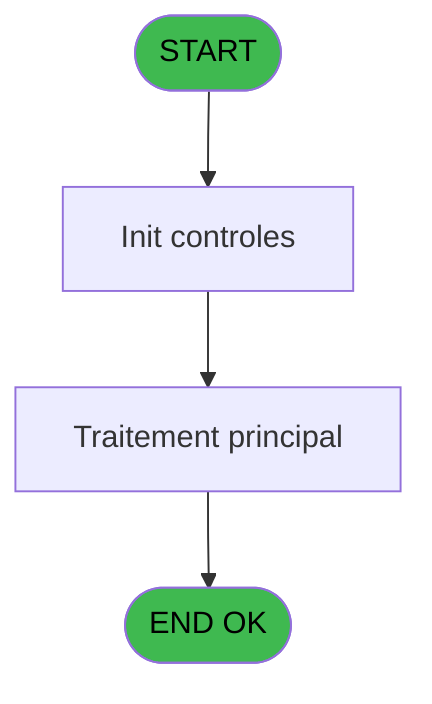
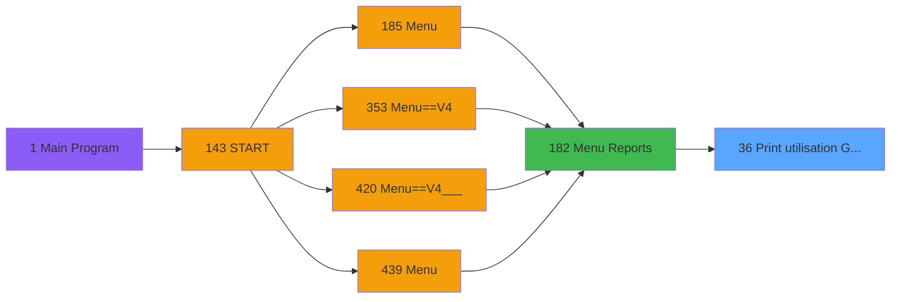

# PVE IDE 36 - Print utilisation Gift Pass

> **Analyse**: Phases 1-4 2026-02-03 01:22 -> 01:23 (35s) | Assemblage 01:23
> **Pipeline**: V7.2 Enrichi
> **Structure**: 4 onglets (Resume | Ecrans | Donnees | Connexions)

<!-- TAB:Resume -->

## 1. FICHE D'IDENTITE

| Attribut | Valeur |
|----------|--------|
| Projet | PVE |
| IDE Position | 36 |
| Nom Programme | Print utilisation Gift Pass |
| Fichier source | `Prg_36.xml` |
| Domaine metier | Impression |
| Taches | 3 (1 ecrans visibles) |
| Tables modifiees | 0 |
| Programmes appeles | 0 |

## 2. DESCRIPTION FONCTIONNELLE

**Print utilisation Gift Pass** assure la gestion complete de ce processus, accessible depuis [Menu Reports (IDE 182)](PVE-IDE-182.md).

Le flux de traitement s'organise en **2 blocs fonctionnels** :

- **Impression** (2 taches) : generation de tickets et documents
- **Traitement** (1 tache) : traitements metier divers

**Logique metier** : 1 regles identifiees couvrant conditions metier.

Detail : phases du traitement

#### Phase 1 : Traitement (1 tache)

- **36** - In Resort Spending Gift Pass **[[ECRAN]](#ecran-t1)**

#### Phase 2 : Impression (2 taches)

- **36.1** - Print
- **36.1.1** - EDITION **[[ECRAN]](#ecran-t3)**

## 3. BLOCS FONCTIONNELS

### 3.1 Traitement (1 tache)

Traitements internes.

---

#### 36 - In Resort Spending Gift Pass [[ECRAN]](#ecran-t1)

**Role** : Calcul fidelite/avantage : In Resort Spending Gift Pass.
**Ecran** : 285 x 192 DLU (MDI) | [Voir mockup](#ecran-t1)

### 3.2 Impression (2 taches)

Generation des documents et tickets.

---

#### 36.1 - Print

**Role** : Generation du document : Print.

---

#### 36.1.1 - EDITION [[ECRAN]](#ecran-t3)

**Role** : Generation du document : EDITION.
**Ecran** : 1201 x 195 DLU | [Voir mockup](#ecran-t3)

## 5. REGLES METIER

1 regles identifiees:

### Autres (1 regles)

#### [RM-001] Si Trim(P.Appli [B])='PVE' alors 'P.Appli [B]'FORM sinon 'v.Output [C]'FORM)

| Element | Detail |
|---------|--------|
| **Condition** | `Trim(P.Appli [B])='PVE'` |
| **Si vrai** | 'P.Appli [B]'FORM |
| **Si faux** | 'v.Output [C]'FORM) |
| **Variables** | B (P.Appli), C (v.Output) |
| **Expression source** | Expression 4 : `IF(Trim(P.Appli [B])='PVE','P.Appli [B]'FORM,'v.Output [C]'F` |
| **Exemple** | Si Trim(P.Appli [B])='PVE' → 'P.Appli [B]'FORM. Sinon → 'v.Output [C]'FORM) |

## 6. CONTEXTE

- **Appele par**: [Menu Reports (IDE 182)](PVE-IDE-182.md)
- **Appelle**: 0 programmes | **Tables**: 0 (W:0 R:0 L:0) | **Taches**: 3 | **Expressions**: 4

<!-- TAB:Ecrans -->

## 8. ECRANS

### 8.1 Forms visibles (1 / 3)

| # | Position | Tache | Nom | Type | Largeur | Hauteur | Bloc |
|---|----------|-------|-----|------|---------|---------|------|
| 1 | 36 | 36 | In Resort Spending Gift Pass | MDI | 285 | 192 | Traitement |

### 8.2 Mockups Ecrans

---

#### 36 - In Resort Spending Gift Pass
**Tache** : [36](#t1) | **Type** : MDI | **Dimensions** : 285 x 192 DLU
**Bloc** : Traitement | **Titre IDE** : In Resort Spending Gift Pass

<!-- FORM-DATA:
{
    "width":  285,
    "vFactor":  8,
    "type":  "MDI",
    "hFactor":  4,
    "controls":  [
                     {
                         "x":  61,
                         "type":  "label",
                         "var":  "",
                         "y":  50,
                         "w":  62,
                         "fmt":  "",
                         "name":  "",
                         "h":  15,
                         "color":  "187",
                         "text":  "Output",
                         "parent":  null
                     },
                     {
                         "x":  0,
                         "type":  "label",
                         "var":  "",
                         "y":  0,
                         "w":  285,
                         "fmt":  "",
                         "name":  "",
                         "h":  42,
                         "color":  "182",
                         "text":  "",
                         "parent":  null
                     },
                     {
                         "x":  5,
                         "type":  "label",
                         "var":  "",
                         "y":  15,
                         "w":  195,
                         "fmt":  "",
                         "name":  "",
                         "h":  11,
                         "color":  "186",
                         "text":  "Settings selection and print options",
                         "parent":  2
                     },
                     {
                         "x":  0,
                         "type":  "label",
                         "var":  "",
                         "y":  155,
                         "w":  285,
                         "fmt":  "",
                         "name":  "",
                         "h":  34,
                         "color":  "183",
                         "text":  "",
                         "parent":  null
                     },
                     {
                         "x":  283,
                         "type":  "line",
                         "var":  "",
                         "y":  42,
                         "w":  0,
                         "fmt":  "",
                         "name":  "",
                         "h":  118,
                         "color":  "187",
                         "text":  "",
                         "parent":  null
                     },
                     {
                         "x":  214,
                         "type":  "button",
                         "var":  "",
                         "y":  160,
                         "w":  68,
                         "fmt":  "\u0026Execute",
                         "name":  "Btn.Print",
                         "h":  28,
                         "color":  "",
                         "text":  "",
                         "parent":  7
                     },
                     {
                         "x":  1,
                         "type":  "button",
                         "var":  "",
                         "y":  160,
                         "w":  68,
                         "fmt":  "\u0026Cancel",
                         "name":  "",
                         "h":  28,
                         "color":  "",
                         "text":  "",
                         "parent":  7
                     },
                     {
                         "x":  235,
                         "type":  "image",
                         "var":  "",
                         "y":  4,
                         "w":  48,
                         "fmt":  "",
                         "name":  "",
                         "h":  37,
                         "color":  "",
                         "text":  "",
                         "parent":  2
                     },
                     {
                         "x":  26,
                         "type":  "listbox",
                         "var":  "",
                         "y":  68,
                         "w":  133,
                         "fmt":  "",
                         "name":  "V Printer/Extract_0001",
                         "h":  30,
                         "color":  "110",
                         "text":  "Printer,Extraction",
                         "parent":  null
                     },
                     {
                         "x":  26,
                         "type":  "checkbox",
                         "var":  "",
                         "y":  114,
                         "w":  192,
                         "fmt":  "",
                         "name":  "v.InclureSoldeGPNull",
                         "h":  12,
                         "color":  "183",
                         "text":  "include customers who spent all their  Gift Pass",
                         "parent":  null
                     }
                 ],
    "taskId":  "36",
    "height":  192
}
-->

<strong>Champs : 1 champs</strong>

| Pos (x,y) | Nom | Variable | Type |
|-----------|-----|----------|------|
| 26,114 | v.InclureSoldeGPNull | - | checkbox |

<strong>Boutons : 2 boutons</strong>

| Bouton | Pos (x,y) | Action |
|--------|-----------|--------|
| Execute | 214,160 | Bouton fonctionnel |
| Cancel | 1,160 | Annule et retour au menu |

## 9. NAVIGATION

Ecran unique: **In Resort Spending Gift Pass**

### 9.3 Structure hierarchique (3 taches)

| Position | Tache | Type | Dimensions | Bloc |
|----------|-------|------|------------|------|
| **36.1** | [**In Resort Spending Gift Pass** (36)](#t1) [mockup](#ecran-t1) | MDI | 285x192 | Traitement |
| **36.2** | [**Print** (36.1)](#t2) | MDI | - | Impression |
| 36.2.1 | [EDITION (36.1.1)](#t3) [mockup](#ecran-t3) | - | 1201x195 | |

### 9.4 Algorigramme

> **Legende**: Vert = START/END OK | Rouge = END KO | Bleu = Decisions
> *Algorigramme auto-genere. Utiliser `/algorigramme` pour une synthese metier detaillee.*

<!-- TAB:Donnees -->

## 10. TABLES

### Tables utilisees (0)

| ID | Nom | Description | Type | R | W | L | Usages |
|----|-----|-------------|------|---|---|---|--------|

### Colonnes par table (0 / 0 tables avec colonnes identifiees)

## 11. VARIABLES

### 11.1 Parametres entrants (2)

Variables recues du programme appelant ([Menu Reports (IDE 182)](PVE-IDE-182.md)).

| Lettre | Nom | Type | Usage dans |
|--------|-----|------|-----------|
| A | P.Village name | Alpha | - |
| B | P.Appli | Alpha | 1x parametre entrant |

### 11.2 Variables de session (3)

Variables persistantes pendant toute la session.

| Lettre | Nom | Type | Usage dans |
|--------|-----|------|-----------|
| C | v.Output | Alpha | 1x session |
| D | v.InclureSoldeGPNull | Logical | - |
| P | v.Export | Alpha | - |

### 11.3 Autres (11)

Variables diverses.

| Lettre | Nom | Type | Usage dans |
|--------|-----|------|-----------|
| E | Btn.Excel | Alpha | - |
| F | Btn.Impression | Alpha | - |
| G | IRPP(Level) | Alpha | - |
| H | cte_service | Unicode | - |
| I | tab_libelle20 | Unicode | - |
| J | Montant GP dépensé | Numeric | - |
| K | Solde disponible | Numeric | - |
| L | IRPP_NUM | Numeric | - |
| M | cte_societe | Unicode | - |
| N | cte_compte_gm | Numeric | - |
| O | cte_filiation | Numeric | - |

Toutes les 16 variables (liste complete)

| Cat | Lettre | Nom Variable | Type |
|-----|--------|--------------|------|
| P0 | **A** | P.Village name | Alpha |
| P0 | **B** | P.Appli | Alpha |
| V. | **C** | v.Output | Alpha |
| V. | **D** | v.InclureSoldeGPNull | Logical |
| V. | **P** | v.Export | Alpha |
| Autre | **E** | Btn.Excel | Alpha |
| Autre | **F** | Btn.Impression | Alpha |
| Autre | **G** | IRPP(Level) | Alpha |
| Autre | **H** | cte_service | Unicode |
| Autre | **I** | tab_libelle20 | Unicode |
| Autre | **J** | Montant GP dépensé | Numeric |
| Autre | **K** | Solde disponible | Numeric |
| Autre | **L** | IRPP_NUM | Numeric |
| Autre | **M** | cte_societe | Unicode |
| Autre | **N** | cte_compte_gm | Numeric |
| Autre | **O** | cte_filiation | Numeric |

## 12. EXPRESSIONS

**4 / 4 expressions decodees (100%)**

### 12.1 Repartition par type

| Type | Expressions | Regles |
|------|-------------|--------|
| CONDITION | 1 | 5 |
| CONSTANTE | 2 | 0 |
| DATE | 1 | 0 |

### 12.2 Expressions cles par type

#### CONDITION (1 expressions)

| Type | IDE | Expression | Regle |
|------|-----|------------|-------|
| CONDITION | 4 | `IF(Trim(P.Appli [B])='PVE','P.Appli [B]'FORM,'v.Output [C]'FORM)` | [RM-001](#rm-RM-001) |

#### CONSTANTE (2 expressions)

| Type | IDE | Expression | Regle |
|------|-----|------------|-------|
| CONSTANTE | 3 | `'E'` | - |
| CONSTANTE | 1 | `'P'` | - |

#### DATE (1 expressions)

| Type | IDE | Expression | Regle |
|------|-----|------------|-------|
| DATE | 2 | `Date()` | - |

<!-- TAB:Connexions -->

## 13. GRAPHE D'APPELS

### 13.1 Chaine depuis Main (Callers)

Main -> ... -> [Menu Reports (IDE 182)](PVE-IDE-182.md) -> **Print utilisation Gift Pass (IDE 36)**

### 13.2 Callers

| IDE | Nom Programme | Nb Appels |
|-----|---------------|-----------|
| [182](PVE-IDE-182.md) | Menu Reports | 1 |

### 13.3 Callees (programmes appeles)

### 13.4 Detail Callees avec contexte

| IDE | Nom Programme | Appels | Contexte |
|-----|---------------|--------|----------|
| - | (aucun) | - | - |

## 14. RECOMMANDATIONS MIGRATION

### 14.1 Profil du programme

| Metrique | Valeur | Impact migration |
|----------|--------|-----------------|
| Lignes de logique | 65 | Programme compact |
| Expressions | 4 | Peu de logique |
| Tables WRITE | 0 | Impact faible |
| Sous-programmes | 0 | Peu de dependances |
| Ecrans visibles | 1 | Ecran unique ou traitement batch |
| Code desactive | 0% (0 / 65) | Code sain |
| Regles metier | 1 | Quelques regles a preserver |

### 14.2 Plan de migration par bloc

#### Traitement (1 tache: 1 ecran, 0 traitement)

- **Strategie** : 1 composant(s) UI (Razor/React) avec formulaires et validation.
- Decomposer les taches en services unitaires testables.

#### Impression (2 taches: 1 ecran, 1 traitement)

- **Strategie** : Templates HTML -> PDF via wkhtmltopdf ou Puppeteer.
- `PrintService` injectable avec choix imprimante

### 14.3 Dependances critiques

| Dependance | Type | Appels | Impact |
|------------|------|--------|--------|

---
*Spec DETAILED generee par Pipeline V7.2 - 2026-02-03 01:23*
