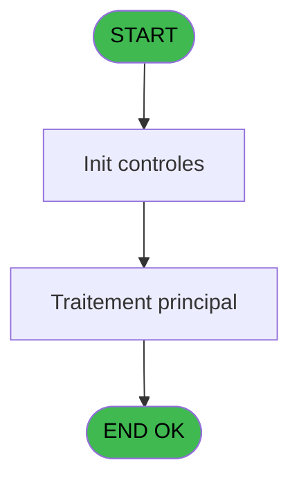
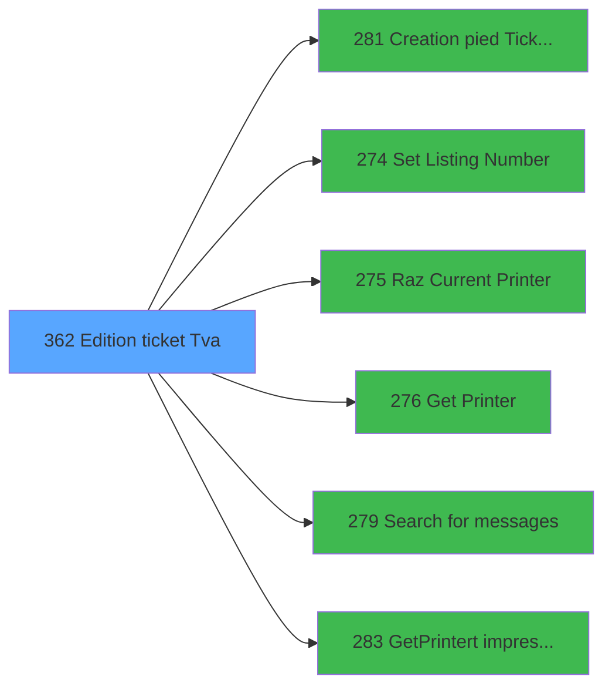

# PVE IDE 362 - Edition ticket (Tva)

> **Analyse**: Phases 1-4 2026-02-03 19:46 -> 19:46 (10s) | Assemblage 19:46
> **Pipeline**: V7.2 Enrichi
> **Structure**: 4 onglets (Resume | Ecrans | Donnees | Connexions)

<!-- TAB:Resume -->

## 1. FICHE D'IDENTITE

| Attribut | Valeur |
|----------|--------|
| Projet | PVE |
| IDE Position | 362 |
| Nom Programme | Edition ticket (Tva) |
| Fichier source | `Prg_362.xml` |
| Dossier IDE | Sauvegarde |
| Taches | 27 (1 ecrans visibles) |
| Tables modifiees | 0 |
| Programmes appeles | 6 |
| :warning: Statut | **ORPHELIN_POTENTIEL** |

## 2. DESCRIPTION FONCTIONNELLE

**Edition ticket (Tva)** assure la gestion complete de ce processus.

Le flux de traitement s'organise en **2 blocs fonctionnels** :

- **Traitement** (19 taches) : traitements metier divers
- **Impression** (8 taches) : generation de tickets et documents

Detail : phases du traitement

#### Phase 1 : Traitement (19 taches)

- **362** - Please be patient ... **[[ECRAN]](#ecran-t1)**
- **362.1.1** - Impression reçu change **[[ECRAN]](#ecran-t3)**
- **362.1.2** - Impression reçu change **[[ECRAN]](#ecran-t4)**
- **362.1.2.2** - Impression reçu change **[[ECRAN]](#ecran-t6)**
- **362.2** - Counter
- **362.2.1** - Impression reçu change
- **362.2.2** - Impression reçu change
- **362.2.2.2** - Impression reçu change **[[ECRAN]](#ecran-t11)**
- **362.3.1** - Veuillez patienter ... **[[ECRAN]](#ecran-t13)**
- **362.3.2** - Veuillez patienter ... **[[ECRAN]](#ecran-t14)**
- **362.3.2.2** - Veuillez patienter ... **[[ECRAN]](#ecran-t16)**
- **362.4.1** - Veuillez patienter ... **[[ECRAN]](#ecran-t18)**
- **362.4.2** - Veuillez patienter ... **[[ECRAN]](#ecran-t19)**
- **362.4.2.2** - Veuillez patienter ... **[[ECRAN]](#ecran-t21)**
- **362.5** - Counter
- **362.5.1** - Impression reçu change **[[ECRAN]](#ecran-t23)**
- **362.5.2** - Impression reçu change **[[ECRAN]](#ecran-t24)**
- **362.5.2.2** - Impression reçu change **[[ECRAN]](#ecran-t26)**
- **362.6** - Search Gift Pass

Delegue a : [Set Listing Number (IDE 274)](PVE-IDE-274.md), [Search  for messages (IDE 279)](PVE-IDE-279.md)

#### Phase 2 : Impression (8 taches)

- **362.1** - Printer 1
- **362.1.2.1** - Print Tva **[[ECRAN]](#ecran-t5)**
- **362.2.2.1** - Print Tva **[[ECRAN]](#ecran-t10)**
- **362.3** - Printer 5 **[[ECRAN]](#ecran-t12)**
- **362.3.2.1** - Print Tva **[[ECRAN]](#ecran-t15)**
- **362.4** - Printer 9 **[[ECRAN]](#ecran-t17)**
- **362.4.2.1** - Print Tva **[[ECRAN]](#ecran-t20)**
- **362.5.2.1** - Print Tva **[[ECRAN]](#ecran-t25)**

Delegue a : [Creation pied Ticket(Tva) (IDE 281)](PVE-IDE-281.md), [Set Listing Number (IDE 274)](PVE-IDE-274.md), [Raz Current Printer (IDE 275)](PVE-IDE-275.md), [Get Printer (IDE 276)](PVE-IDE-276.md), [GetPrinter/t impression (IDE 283)](PVE-IDE-283.md)

## 3. BLOCS FONCTIONNELS

### 3.1 Traitement (19 taches)

Traitements internes.

---

#### 362 - Please be patient ... [[ECRAN]](#ecran-t1)

**Role** : Tache d'orchestration : point d'entree du programme (19 sous-taches). Coordonne l'enchainement des traitements.
**Ecran** : 427 x 57 DLU (MDI) | [Voir mockup](#ecran-t1)

18 sous-taches directes

| Tache | Nom | Bloc |
|-------|-----|------|
| [362.1.1](#t3) | Impression reçu change **[[ECRAN]](#ecran-t3)** | Traitement |
| [362.1.2](#t4) | Impression reçu change **[[ECRAN]](#ecran-t4)** | Traitement |
| [362.1.2.2](#t6) | Impression reçu change **[[ECRAN]](#ecran-t6)** | Traitement |
| [362.2](#t7) | Counter | Traitement |
| [362.2.1](#t8) | Impression reçu change | Traitement |
| [362.2.2](#t9) | Impression reçu change | Traitement |
| [362.2.2.2](#t11) | Impression reçu change **[[ECRAN]](#ecran-t11)** | Traitement |
| [362.3.1](#t13) | Veuillez patienter ... **[[ECRAN]](#ecran-t13)** | Traitement |
| [362.3.2](#t14) | Veuillez patienter ... **[[ECRAN]](#ecran-t14)** | Traitement |
| [362.3.2.2](#t16) | Veuillez patienter ... **[[ECRAN]](#ecran-t16)** | Traitement |
| [362.4.1](#t18) | Veuillez patienter ... **[[ECRAN]](#ecran-t18)** | Traitement |
| [362.4.2](#t19) | Veuillez patienter ... **[[ECRAN]](#ecran-t19)** | Traitement |
| [362.4.2.2](#t21) | Veuillez patienter ... **[[ECRAN]](#ecran-t21)** | Traitement |
| [362.5](#t22) | Counter | Traitement |
| [362.5.1](#t23) | Impression reçu change **[[ECRAN]](#ecran-t23)** | Traitement |
| [362.5.2](#t24) | Impression reçu change **[[ECRAN]](#ecran-t24)** | Traitement |
| [362.5.2.2](#t26) | Impression reçu change **[[ECRAN]](#ecran-t26)** | Traitement |
| [362.6](#t27) | Search Gift Pass | Traitement |

---

#### 362.1.1 - Impression reçu change [[ECRAN]](#ecran-t3)

**Role** : Generation du document : Impression reçu change.
**Ecran** : 630 x 0 DLU (MDI) | [Voir mockup](#ecran-t3)

---

#### 362.1.2 - Impression reçu change [[ECRAN]](#ecran-t4)

**Role** : Generation du document : Impression reçu change.
**Ecran** : 574 x 0 DLU (MDI) | [Voir mockup](#ecran-t4)

---

#### 362.1.2.2 - Impression reçu change [[ECRAN]](#ecran-t6)

**Role** : Generation du document : Impression reçu change.
**Ecran** : 574 x 0 DLU (MDI) | [Voir mockup](#ecran-t6)

---

#### 362.2 - Counter

**Role** : Traitement : Counter.

---

#### 362.2.1 - Impression reçu change

**Role** : Generation du document : Impression reçu change.

---

#### 362.2.2 - Impression reçu change

**Role** : Generation du document : Impression reçu change.

---

#### 362.2.2.2 - Impression reçu change [[ECRAN]](#ecran-t11)

**Role** : Generation du document : Impression reçu change.
**Ecran** : 574 x 0 DLU (MDI) | [Voir mockup](#ecran-t11)

---

#### 362.3.1 - Veuillez patienter ... [[ECRAN]](#ecran-t13)

**Role** : Traitement : Veuillez patienter ....
**Ecran** : 426 x 57 DLU (MDI) | [Voir mockup](#ecran-t13)

---

#### 362.3.2 - Veuillez patienter ... [[ECRAN]](#ecran-t14)

**Role** : Traitement : Veuillez patienter ....
**Ecran** : 424 x 56 DLU (MDI) | [Voir mockup](#ecran-t14)

---

#### 362.3.2.2 - Veuillez patienter ... [[ECRAN]](#ecran-t16)

**Role** : Traitement : Veuillez patienter ....
**Ecran** : 424 x 56 DLU (MDI) | [Voir mockup](#ecran-t16)

---

#### 362.4.1 - Veuillez patienter ... [[ECRAN]](#ecran-t18)

**Role** : Traitement : Veuillez patienter ....
**Ecran** : 424 x 56 DLU (MDI) | [Voir mockup](#ecran-t18)

---

#### 362.4.2 - Veuillez patienter ... [[ECRAN]](#ecran-t19)

**Role** : Traitement : Veuillez patienter ....
**Ecran** : 1242 x 399 DLU (MDI) | [Voir mockup](#ecran-t19)

---

#### 362.4.2.2 - Veuillez patienter ... [[ECRAN]](#ecran-t21)

**Role** : Traitement : Veuillez patienter ....
**Ecran** : 424 x 56 DLU (MDI) | [Voir mockup](#ecran-t21)

---

#### 362.5 - Counter

**Role** : Traitement : Counter.

---

#### 362.5.1 - Impression reçu change [[ECRAN]](#ecran-t23)

**Role** : Generation du document : Impression reçu change.
**Ecran** : 630 x 0 DLU (MDI) | [Voir mockup](#ecran-t23)

---

#### 362.5.2 - Impression reçu change [[ECRAN]](#ecran-t24)

**Role** : Generation du document : Impression reçu change.
**Ecran** : 574 x 0 DLU (MDI) | [Voir mockup](#ecran-t24)

---

#### 362.5.2.2 - Impression reçu change [[ECRAN]](#ecran-t26)

**Role** : Generation du document : Impression reçu change.
**Ecran** : 574 x 0 DLU (MDI) | [Voir mockup](#ecran-t26)

---

#### 362.6 - Search Gift Pass

**Role** : Calcul fidelite/avantage : Search Gift Pass.
**Variables liees** : Y (V Existe Gift Pass), Z (V.Solde  Gift Pass), BA (V.Message Solde Gift Pass), BB (V Editer Solde Gift Pass a 0)

### 3.2 Impression (8 taches)

Generation des documents et tickets.

---

#### 362.1 - Printer 1

**Role** : Generation du document : Printer 1.
**Delegue a** : [Creation pied Ticket(Tva) (IDE 281)](PVE-IDE-281.md), [Raz Current Printer (IDE 275)](PVE-IDE-275.md), [Get Printer (IDE 276)](PVE-IDE-276.md)

---

#### 362.1.2.1 - Print Tva [[ECRAN]](#ecran-t5)

**Role** : Generation du document : Print Tva.
**Ecran** : 506 x 0 DLU | [Voir mockup](#ecran-t5)
**Variables liees** : B (P. PrintAgainExecution), C (P. PrintAgainPreview)
**Delegue a** : [Creation pied Ticket(Tva) (IDE 281)](PVE-IDE-281.md), [Raz Current Printer (IDE 275)](PVE-IDE-275.md), [Get Printer (IDE 276)](PVE-IDE-276.md)

---

#### 362.2.2.1 - Print Tva [[ECRAN]](#ecran-t10)

**Role** : Generation du document : Print Tva.
**Ecran** : 127 x 0 DLU | [Voir mockup](#ecran-t10)
**Variables liees** : B (P. PrintAgainExecution), C (P. PrintAgainPreview)
**Delegue a** : [Creation pied Ticket(Tva) (IDE 281)](PVE-IDE-281.md), [Raz Current Printer (IDE 275)](PVE-IDE-275.md), [Get Printer (IDE 276)](PVE-IDE-276.md)

---

#### 362.3 - Printer 5 [[ECRAN]](#ecran-t12)

**Role** : Generation du document : Printer 5.
**Ecran** : 424 x 56 DLU (MDI) | [Voir mockup](#ecran-t12)
**Delegue a** : [Creation pied Ticket(Tva) (IDE 281)](PVE-IDE-281.md), [Raz Current Printer (IDE 275)](PVE-IDE-275.md), [Get Printer (IDE 276)](PVE-IDE-276.md)

---

#### 362.3.2.1 - Print Tva [[ECRAN]](#ecran-t15)

**Role** : Generation du document : Print Tva.
**Ecran** : 506 x 0 DLU | [Voir mockup](#ecran-t15)
**Variables liees** : B (P. PrintAgainExecution), C (P. PrintAgainPreview)
**Delegue a** : [Creation pied Ticket(Tva) (IDE 281)](PVE-IDE-281.md), [Raz Current Printer (IDE 275)](PVE-IDE-275.md), [Get Printer (IDE 276)](PVE-IDE-276.md)

---

#### 362.4 - Printer 9 [[ECRAN]](#ecran-t17)

**Role** : Generation du document : Printer 9.
**Ecran** : 424 x 56 DLU (MDI) | [Voir mockup](#ecran-t17)
**Delegue a** : [Creation pied Ticket(Tva) (IDE 281)](PVE-IDE-281.md), [Raz Current Printer (IDE 275)](PVE-IDE-275.md), [Get Printer (IDE 276)](PVE-IDE-276.md)

---

#### 362.4.2.1 - Print Tva [[ECRAN]](#ecran-t20)

**Role** : Generation du document : Print Tva.
**Ecran** : 506 x 0 DLU | [Voir mockup](#ecran-t20)
**Variables liees** : B (P. PrintAgainExecution), C (P. PrintAgainPreview)
**Delegue a** : [Creation pied Ticket(Tva) (IDE 281)](PVE-IDE-281.md), [Raz Current Printer (IDE 275)](PVE-IDE-275.md), [Get Printer (IDE 276)](PVE-IDE-276.md)

---

#### 362.5.2.1 - Print Tva [[ECRAN]](#ecran-t25)

**Role** : Generation du document : Print Tva.
**Ecran** : 506 x 0 DLU | [Voir mockup](#ecran-t25)
**Variables liees** : B (P. PrintAgainExecution), C (P. PrintAgainPreview)
**Delegue a** : [Creation pied Ticket(Tva) (IDE 281)](PVE-IDE-281.md), [Raz Current Printer (IDE 275)](PVE-IDE-275.md), [Get Printer (IDE 276)](PVE-IDE-276.md)

## 5. REGLES METIER

*(Aucune regle metier identifiee)*

## 6. CONTEXTE

- **Appele par**: (aucun)
- **Appelle**: 6 programmes | **Tables**: 10 (W:0 R:5 L:7) | **Taches**: 27 | **Expressions**: 36

<!-- TAB:Ecrans -->

## 8. ECRANS

### 8.1 Forms visibles (1 / 27)

| # | Position | Tache | Nom | Type | Largeur | Hauteur | Bloc |
|---|----------|-------|-----|------|---------|---------|------|
| 1 | 362 | 362 | Please be patient ... | MDI | 427 | 57 | Traitement |

### 8.2 Mockups Ecrans

---

#### 362 - Please be patient ...
**Tache** : [362](#t1) | **Type** : MDI | **Dimensions** : 427 x 57 DLU
**Bloc** : Traitement | **Titre IDE** : Please be patient ...

<!-- FORM-DATA:
{
    "width":  427,
    "vFactor":  8,
    "type":  "MDI",
    "hFactor":  8,
    "controls":  [
                     {
                         "x":  0,
                         "type":  "label",
                         "var":  "",
                         "y":  0,
                         "w":  423,
                         "fmt":  "",
                         "name":  "",
                         "h":  29,
                         "color":  "",
                         "text":  "",
                         "parent":  null
                     },
                     {
                         "x":  120,
                         "type":  "label",
                         "var":  "",
                         "y":  10,
                         "w":  221,
                         "fmt":  "",
                         "name":  "",
                         "h":  8,
                         "color":  "7",
                         "text":  "Print in progress ...",
                         "parent":  null
                     },
                     {
                         "x":  0,
                         "type":  "label",
                         "var":  "",
                         "y":  29,
                         "w":  423,
                         "fmt":  "",
                         "name":  "",
                         "h":  27,
                         "color":  "",
                         "text":  "",
                         "parent":  null
                     },
                     {
                         "x":  114,
                         "type":  "label",
                         "var":  "",
                         "y":  38,
                         "w":  203,
                         "fmt":  "",
                         "name":  "",
                         "h":  8,
                         "color":  "",
                         "text":  "Ticket edition",
                         "parent":  null
                     },
                     {
                         "x":  4,
                         "type":  "image",
                         "var":  "",
                         "y":  2,
                         "w":  72,
                         "fmt":  "",
                         "name":  "",
                         "h":  25,
                         "color":  "",
                         "text":  "",
                         "parent":  null
                     }
                 ],
    "taskId":  "362",
    "height":  57
}
-->

## 9. NAVIGATION

Ecran unique: **Please be patient ...**

### 9.3 Structure hierarchique (27 taches)

| Position | Tache | Type | Dimensions | Bloc |
|----------|-------|------|------------|------|
| **362.1** | [**Please be patient ...** (362)](#t1) [mockup](#ecran-t1) | MDI | 427x57 | Traitement |
| 362.1.1 | [Impression reçu change (362.1.1)](#t3) [mockup](#ecran-t3) | MDI | 630x0 | |
| 362.1.2 | [Impression reçu change (362.1.2)](#t4) [mockup](#ecran-t4) | MDI | 574x0 | |
| 362.1.3 | [Impression reçu change (362.1.2.2)](#t6) [mockup](#ecran-t6) | MDI | 574x0 | |
| 362.1.4 | [Counter (362.2)](#t7) | MDI | - | |
| 362.1.5 | [Impression reçu change (362.2.1)](#t8) | MDI | - | |
| 362.1.6 | [Impression reçu change (362.2.2)](#t9) | MDI | - | |
| 362.1.7 | [Impression reçu change (362.2.2.2)](#t11) [mockup](#ecran-t11) | MDI | 574x0 | |
| 362.1.8 | [Veuillez patienter ... (362.3.1)](#t13) [mockup](#ecran-t13) | MDI | 426x57 | |
| 362.1.9 | [Veuillez patienter ... (362.3.2)](#t14) [mockup](#ecran-t14) | MDI | 424x56 | |
| 362.1.10 | [Veuillez patienter ... (362.3.2.2)](#t16) [mockup](#ecran-t16) | MDI | 424x56 | |
| 362.1.11 | [Veuillez patienter ... (362.4.1)](#t18) [mockup](#ecran-t18) | MDI | 424x56 | |
| 362.1.12 | [Veuillez patienter ... (362.4.2)](#t19) [mockup](#ecran-t19) | MDI | 1242x399 | |
| 362.1.13 | [Veuillez patienter ... (362.4.2.2)](#t21) [mockup](#ecran-t21) | MDI | 424x56 | |
| 362.1.14 | [Counter (362.5)](#t22) | MDI | - | |
| 362.1.15 | [Impression reçu change (362.5.1)](#t23) [mockup](#ecran-t23) | MDI | 630x0 | |
| 362.1.16 | [Impression reçu change (362.5.2)](#t24) [mockup](#ecran-t24) | MDI | 574x0 | |
| 362.1.17 | [Impression reçu change (362.5.2.2)](#t26) [mockup](#ecran-t26) | MDI | 574x0 | |
| 362.1.18 | [Search Gift Pass (362.6)](#t27) | - | - | |
| **362.2** | [**Printer 1** (362.1)](#t2) | MDI | - | Impression |
| 362.2.1 | [Print Tva (362.1.2.1)](#t5) [mockup](#ecran-t5) | - | 506x0 | |
| 362.2.2 | [Print Tva (362.2.2.1)](#t10) [mockup](#ecran-t10) | - | 127x0 | |
| 362.2.3 | [Printer 5 (362.3)](#t12) [mockup](#ecran-t12) | MDI | 424x56 | |
| 362.2.4 | [Print Tva (362.3.2.1)](#t15) [mockup](#ecran-t15) | - | 506x0 | |
| 362.2.5 | [Printer 9 (362.4)](#t17) [mockup](#ecran-t17) | MDI | 424x56 | |
| 362.2.6 | [Print Tva (362.4.2.1)](#t20) [mockup](#ecran-t20) | - | 506x0 | |
| 362.2.7 | [Print Tva (362.5.2.1)](#t25) [mockup](#ecran-t25) | - | 506x0 | |

### 9.4 Algorigramme

> **Legende**: Vert = START/END OK | Rouge = END KO | Bleu = Decisions
> *Algorigramme auto-genere. Utiliser `/algorigramme` pour une synthese metier detaillee.*

<!-- TAB:Donnees -->

## 10. TABLES

### Tables utilisees (10)

| ID | Nom | Description | Type | R | W | L | Usages |
|----|-----|-------------|------|---|---|---|--------|
| 31 | gm-complet_______gmc |  | DB | R |   |   | 1 |
| 67 | tables___________tab |  | DB |   |   | L | 1 |
| 69 | initialisation___ini |  | DB |   |   | L | 1 |
| 268 | cc_total_par_type |  | DB | R |   |   | 1 |
| 378 | pv_customer |  | DB | R |   | L | 5 |
| 382 | pv_discount_reasons |  | DB |   |   | L | 1 |
| 400 | pv_cust_rentals |  | DB | R |   | L | 15 |
| 403 | pv_sellers |  | DB |   |   | L | 7 |
| 533 | cumul_mvt_stock_histo | Articles et stock | TMP |   |   | L | 16 |
| 868 | Affectation_Gift_Pass |  | DB | R |   |   | 5 |

### Colonnes par table (5 / 5 tables avec colonnes identifiees)

Table 31 - gm-complet_______gmc (R) - 1 usages

| Lettre | Variable | Acces | Type |
|--------|----------|-------|------|
| A | P. Decimal | R | Numeric |
| B | P. PrintAgainExecution | R | Logical |
| C | P. PrintAgainPreview | R | Logical |
| D | P. Facture | R | Numeric |
| E | P.Service | R | Alpha |
| F | P.Nom Pdf Ticket Mobilite | R | Alpha |
| G | P Viens de reedition Mobilite | R | Logical |
| H | p.File_Name_Signature | R | Numeric |
| I | p.NomVendeur | R | Alpha |
| J | V Devise locale | R | Alpha |
| K | V Masque | R | Alpha |
| L | V Masque sans Z | R | Alpha |
| M | V Date | R | Date |
| N | V Fin tâche | R | Alpha |
| O | V Imprimante 2 | R | Numeric |
| P | V Copies | R | Numeric |
| Q | L Avec Réduction | R | Logical |
| R | L Annulation | R | Logical |
| S | V Type Paiement | R | Alpha |
| T | V Masque TM88III | R | Alpha |
| U | V.Customer | R | Alpha |
| V | V.Payer | R | Alpha |
| W | V.Message on Ticket ? | R | Logical |
| X | V.Message | R | Alpha |
| Y | V Existe Gift Pass | R | Logical |
| Z | V.Solde  Gift Pass | R | Numeric |
| BA | V.Message Solde Gift Pass | R | Alpha |
| BB | V Editer Solde Gift Pass a 0 | R | Logical |
| BC | v Editer TVA | R | Logical |

Table 268 - cc_total_par_type (R) - 1 usages

| Lettre | Variable | Acces | Type |
|--------|----------|-------|------|
| A | V TOTAL | R | Numeric |
| S | V Type Paiement | R | Alpha |

Table 378 - pv_customer (R/L) - 5 usages

| Lettre | Variable | Acces | Type |
|--------|----------|-------|------|
| A | V Total Ticket | R | Numeric |
| B | V Ligne Montant TTC | R | Numeric |
| C | V Ligne Montant HT | R | Numeric |

Table 400 - pv_cust_rentals (R/L) - 15 usages

| Lettre | Variable | Acces | Type |
|--------|----------|-------|------|
| U | V.Customer | R | Alpha |

Table 868 - Affectation_Gift_Pass (R) - 5 usages

| Lettre | Variable | Acces | Type |
|--------|----------|-------|------|
| BA | V.Message Solde Gift Pass | R | Alpha |
| BB | V Editer Solde Gift Pass a 0 | R | Logical |
| M | V Ecrire Ligne Gift Pass | R | Numeric |
| N | V Editer Ligne Gift Pass | R | Logical |
| Y | V Existe Gift Pass | R | Logical |
| Z | V.Solde  Gift Pass | R | Numeric |

## 11. VARIABLES

### 11.1 Parametres entrants (9)

Variables recues en parametre.

| Lettre | Nom | Type | Usage dans |
|--------|-----|------|-----------|
| A | P. Decimal | Numeric | - |
| B | P. PrintAgainExecution | Logical | - |
| C | P. PrintAgainPreview | Logical | - |
| D | P. Facture | Numeric | - |
| E | P.Service | Alpha | - |
| F | P.Nom Pdf Ticket Mobilite | Alpha | - |
| G | P Viens de reedition Mobilite | Logical | - |
| H | p.File_Name_Signature | Numeric | - |
| I | p.NomVendeur | Alpha | - |

### 11.2 Variables de session (18)

Variables persistantes pendant toute la session.

| Lettre | Nom | Type | Usage dans |
|--------|-----|------|-----------|
| J | V Devise locale | Alpha | - |
| K | V Masque | Alpha | 1x session |
| L | V Masque sans Z | Alpha | - |
| M | V Date | Date | - |
| N | V Fin tâche | Alpha | - |
| O | V Imprimante 2 | Numeric | - |
| P | V Copies | Numeric | - |
| S | V Type Paiement | Alpha | 1x session |
| T | V Masque TM88III | Alpha | - |
| U | V.Customer | Alpha | - |
| V | V.Payer | Alpha | - |
| W | V.Message on Ticket ? | Logical | 1x session |
| X | V.Message | Alpha | 1x session |
| Y | V Existe Gift Pass | Logical | [362.6](#t27) |
| Z | V.Solde  Gift Pass | Numeric | [362.6](#t27) |
| BA | V.Message Solde Gift Pass | Alpha | - |
| BB | V Editer Solde Gift Pass a 0 | Logical | - |
| BC | v Editer TVA | Logical | - |

### 11.3 Autres (2)

Variables diverses.

| Lettre | Nom | Type | Usage dans |
|--------|-----|------|-----------|
| Q | L Avec Réduction | Logical | - |
| R | L Annulation | Logical | - |

Toutes les 29 variables (liste complete)

| Cat | Lettre | Nom Variable | Type |
|-----|--------|--------------|------|
| P0 | **A** | P. Decimal | Numeric |
| P0 | **B** | P. PrintAgainExecution | Logical |
| P0 | **C** | P. PrintAgainPreview | Logical |
| P0 | **D** | P. Facture | Numeric |
| P0 | **E** | P.Service | Alpha |
| P0 | **F** | P.Nom Pdf Ticket Mobilite | Alpha |
| P0 | **G** | P Viens de reedition Mobilite | Logical |
| P0 | **H** | p.File_Name_Signature | Numeric |
| P0 | **I** | p.NomVendeur | Alpha |
| V. | **J** | V Devise locale | Alpha |
| V. | **K** | V Masque | Alpha |
| V. | **L** | V Masque sans Z | Alpha |
| V. | **M** | V Date | Date |
| V. | **N** | V Fin tâche | Alpha |
| V. | **O** | V Imprimante 2 | Numeric |
| V. | **P** | V Copies | Numeric |
| V. | **S** | V Type Paiement | Alpha |
| V. | **T** | V Masque TM88III | Alpha |
| V. | **U** | V.Customer | Alpha |
| V. | **V** | V.Payer | Alpha |
| V. | **W** | V.Message on Ticket ? | Logical |
| V. | **X** | V.Message | Alpha |
| V. | **Y** | V Existe Gift Pass | Logical |
| V. | **Z** | V.Solde  Gift Pass | Numeric |
| V. | **BA** | V.Message Solde Gift Pass | Alpha |
| V. | **BB** | V Editer Solde Gift Pass a 0 | Logical |
| V. | **BC** | v Editer TVA | Logical |
| Autre | **Q** | L Avec Réduction | Logical |
| Autre | **R** | L Annulation | Logical |

## 12. EXPRESSIONS

**36 / 36 expressions decodees (100%)**

### 12.1 Repartition par type

| Type | Expressions | Regles |
|------|-------------|--------|
| CALCULATION | 1 | 0 |
| CONSTANTE | 5 | 0 |
| DATE | 1 | 0 |
| FORMAT | 1 | 0 |
| OTHER | 16 | 0 |
| CONDITION | 7 | 0 |
| CONCATENATION | 3 | 0 |
| CAST_LOGIQUE | 1 | 0 |
| REFERENCE_VG | 1 | 0 |

### 12.2 Expressions cles par type

#### CALCULATION (1 expressions)

| Type | IDE | Expression | Regle |
|------|-----|------------|-------|
| CALCULATION | 9 | `Left (Trim (V Masque [K]),Len (Trim (V Masque [K]))-1)` | - |

#### CONSTANTE (5 expressions)

| Type | IDE | Expression | Regle |
|------|-----|------------|-------|
| CONSTANTE | 17 | `'O'` | - |
| CONSTANTE | 36 | `201` | - |
| CONSTANTE | 15 | `'VSERV'` | - |
| CONSTANTE | 11 | `201` | - |
| CONSTANTE | 12 | `1` | - |

#### DATE (1 expressions)

| Type | IDE | Expression | Regle |
|------|-----|------------|-------|
| DATE | 10 | `Date ()` | - |

#### FORMAT (1 expressions)

| Type | IDE | Expression | Regle |
|------|-----|------------|-------|
| FORMAT | 30 | `'Gift Pass Balance'&' : '&Str([BF],'N7.2')&' as of '&DStr(Date(),'DD/MM/YYYY')&' '&TStr(Time(),('HH:MM:SS'))` | - |

#### OTHER (16 expressions)

| Type | IDE | Expression | Regle |
|------|-----|------------|-------|
| OTHER | 25 | `[AM]` | - |
| OTHER | 26 | `[AN]` | - |
| OTHER | 23 | `[AE]` | - |
| OTHER | 24 | `V Existe Gift Pass [Y]` | - |
| OTHER | 32 | `[BE]` | - |
| ... | | *+11 autres* | |

#### CONDITION (7 expressions)

| Type | IDE | Expression | Regle |
|------|-----|------------|-------|
| CONDITION | 13 | `[AV]=0` | - |
| CONDITION | 34 | `VG32 AND VG33='TB'` | - |
| CONDITION | 35 | `NOT(VG32) OR (VG32 AND VG33='WS')` | - |
| CONDITION | 6 | `[AU]=9` | - |
| CONDITION | 3 | `[AU]=1` | - |
| ... | | *+2 autres* | |

#### CONCATENATION (3 expressions)

| Type | IDE | Expression | Regle |
|------|-----|------------|-------|
| CONCATENATION | 19 | `Trim([AS])&' '&Trim([AT])` | - |
| CONCATENATION | 18 | `Trim([AI])&' '&Trim([AJ])` | - |
| CONCATENATION | 14 | `'N'&Right ('## ### ### ###'&Left ('.',V Type Paiement [S])&Fill ('#',V Type Paiement [S]),13)` | - |

#### CAST_LOGIQUE (1 expressions)

| Type | IDE | Expression | Regle |
|------|-----|------------|-------|
| CAST_LOGIQUE | 28 | `'TRUE'LOG` | - |

#### REFERENCE_VG (1 expressions)

| Type | IDE | Expression | Regle |
|------|-----|------------|-------|
| REFERENCE_VG | 31 | `VG29` | - |

### 12.3 Toutes les expressions (36)

Voir les 36 expressions

#### CALCULATION (1)

| IDE | Expression Decodee |
|-----|-------------------|
| 9 | `Left (Trim (V Masque [K]),Len (Trim (V Masque [K]))-1)` |

#### CONSTANTE (5)

| IDE | Expression Decodee |
|-----|-------------------|
| 11 | `201` |
| 12 | `1` |
| 15 | `'VSERV'` |
| 17 | `'O'` |
| 36 | `201` |

#### DATE (1)

| IDE | Expression Decodee |
|-----|-------------------|
| 10 | `Date ()` |

#### FORMAT (1)

| IDE | Expression Decodee |
|-----|-------------------|
| 30 | `'Gift Pass Balance'&' : '&Str([BF],'N7.2')&' as of '&DStr(Date(),'DD/MM/YYYY')&' '&TStr(Time(),('HH:MM:SS'))` |

#### OTHER (16)

| IDE | Expression Decodee |
|-----|-------------------|
| 1 | `SetCrsr (2)` |
| 2 | `SetCrsr (1)` |
| 7 | `GetParam ('CURRENCYVALUE')` |
| 8 | `GetParam ('AMOUNTFORMAT')` |
| 16 | `GetParam ('SERVICE')` |
| 20 | `V.Solde  Gift Pass [Z]` |
| 21 | `[AC]` |
| 22 | `[AD]` |
| 23 | `[AE]` |
| 24 | `V Existe Gift Pass [Y]` |
| 25 | `[AM]` |
| 26 | `[AN]` |
| 27 | `[AO]` |
| 29 | `DbDel('{868,3}'DSOURCE,'')` |
| 32 | `[BE]` |
| 33 | `V.Message on Ticket ? [W]` |

#### CONDITION (7)

| IDE | Expression Decodee |
|-----|-------------------|
| 3 | `[AU]=1` |
| 4 | `[AU]=4` |
| 5 | `[AU]=8` |
| 6 | `[AU]=9` |
| 13 | `[AV]=0` |
| 34 | `VG32 AND VG33='TB'` |
| 35 | `NOT(VG32) OR (VG32 AND VG33='WS')` |

#### CONCATENATION (3)

| IDE | Expression Decodee |
|-----|-------------------|
| 14 | `'N'&Right ('## ### ### ###'&Left ('.',V Type Paiement [S])&Fill ('#',V Type Paiement [S]),13)` |
| 18 | `Trim([AI])&' '&Trim([AJ])` |
| 19 | `Trim([AS])&' '&Trim([AT])` |

#### CAST_LOGIQUE (1)

| IDE | Expression Decodee |
|-----|-------------------|
| 28 | `'TRUE'LOG` |

#### REFERENCE_VG (1)

| IDE | Expression Decodee |
|-----|-------------------|
| 31 | `VG29` |

<!-- TAB:Connexions -->

## 13. GRAPHE D'APPELS

### 13.1 Chaine depuis Main (Callers)

**Chemin**: (pas de callers directs)

### 13.2 Callers

| IDE | Nom Programme | Nb Appels |
|-----|---------------|-----------|
| - | (aucun) | - |

### 13.3 Callees (programmes appeles)

### 13.4 Detail Callees avec contexte

| IDE | Nom Programme | Appels | Contexte |
|-----|---------------|--------|----------|
| [281](PVE-IDE-281.md) | Creation pied Ticket(Tva) | 5 | Impression ticket/document |
| [274](PVE-IDE-274.md) | Set Listing Number | 1 | Configuration impression |
| [275](PVE-IDE-275.md) | Raz Current Printer | 1 | Impression ticket/document |
| [276](PVE-IDE-276.md) | Get Printer | 1 | Impression ticket/document |
| [279](PVE-IDE-279.md) | Search  for messages | 1 | Sous-programme |
| [283](PVE-IDE-283.md) | GetPrinter/t impression | 1 | Impression ticket/document |

## 14. RECOMMANDATIONS MIGRATION

### 14.1 Profil du programme

| Metrique | Valeur | Impact migration |
|----------|--------|-----------------|
| Lignes de logique | 1194 | Programme volumineux |
| Expressions | 36 | Peu de logique |
| Tables WRITE | 0 | Impact faible |
| Sous-programmes | 6 | Dependances moderees |
| Ecrans visibles | 1 | Ecran unique ou traitement batch |
| Code desactive | 0.6% (7 / 1194) | Code sain |
| Regles metier | 0 | Pas de regle identifiee |

### 14.2 Plan de migration par bloc

#### Traitement (19 taches: 14 ecrans, 5 traitements)

- **Strategie** : Orchestrateur avec 14 ecrans (Razor/React) et 5 traitements backend (services).
- Les ecrans deviennent des composants UI, les traitements invisibles deviennent des services injectables.
- 6 sous-programme(s) a migrer ou a reutiliser depuis les services existants.
- Decomposer les taches en services unitaires testables.

#### Impression (8 taches: 7 ecrans, 1 traitement)

- **Strategie** : Templates HTML -> PDF via wkhtmltopdf ou Puppeteer.
- `PrintService` injectable avec choix imprimante

### 14.3 Dependances critiques

| Dependance | Type | Appels | Impact |
|------------|------|--------|--------|
| [Creation pied Ticket(Tva) (IDE 281)](PVE-IDE-281.md) | Sous-programme | 5x | **CRITIQUE** - Impression ticket/document |
| [Search  for messages (IDE 279)](PVE-IDE-279.md) | Sous-programme | 1x | Normale - Sous-programme |
| [GetPrinter/t impression (IDE 283)](PVE-IDE-283.md) | Sous-programme | 1x | Normale - Impression ticket/document |
| [Get Printer (IDE 276)](PVE-IDE-276.md) | Sous-programme | 1x | Normale - Impression ticket/document |
| [Set Listing Number (IDE 274)](PVE-IDE-274.md) | Sous-programme | 1x | Normale - Configuration impression |
| [Raz Current Printer (IDE 275)](PVE-IDE-275.md) | Sous-programme | 1x | Normale - Impression ticket/document |

---
*Spec DETAILED generee par Pipeline V7.2 - 2026-02-03 19:46*
