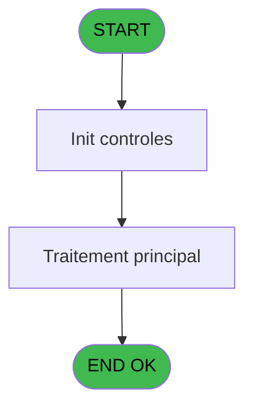
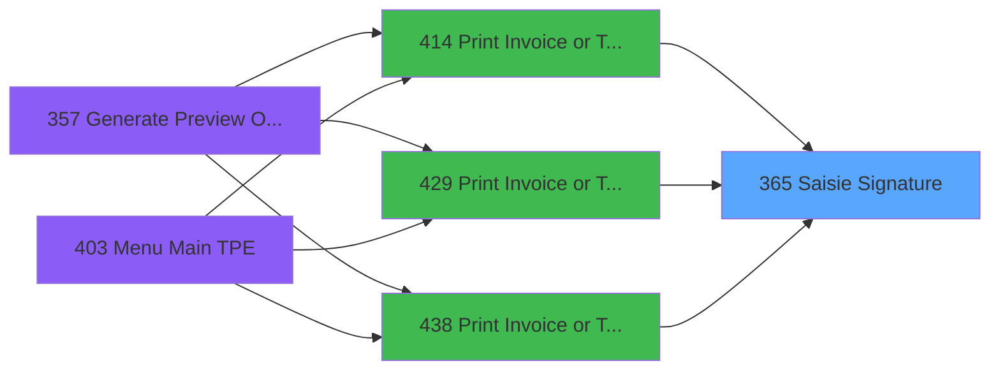
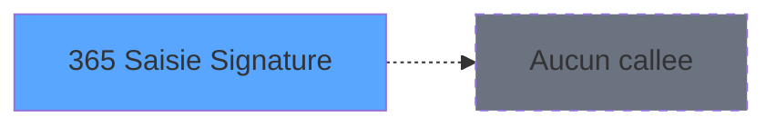

# PVE IDE 365 - Saisie Signature

> **Analyse**: Phases 1-4 2026-02-03 19:47 -> 19:47 (11s) | Assemblage 19:47
> **Pipeline**: V7.2 Enrichi
> **Structure**: 4 onglets (Resume | Ecrans | Donnees | Connexions)

<!-- TAB:Resume -->

## 1. FICHE D'IDENTITE

| Attribut | Valeur |
|----------|--------|
| Projet | PVE |
| IDE Position | 365 |
| Nom Programme | Saisie Signature |
| Fichier source | `Prg_365.xml` |
| Dossier IDE | A |
| Taches | 1 (1 ecrans visibles) |
| Tables modifiees | 0 |
| Programmes appeles | 0 |

## 2. DESCRIPTION FONCTIONNELLE

**Saisie Signature** assure la gestion complete de ce processus, accessible depuis [Print Invoice or Ticket==V4 (IDE 414)](PVE-IDE-414.md), [Print Invoice or Ticket==NEW (IDE 429)](PVE-IDE-429.md), [Print Invoice or Ticket v2 (IDE 438)](PVE-IDE-438.md).

Le flux de traitement s'organise en **1 blocs fonctionnels** :

- **Saisie** (1 tache) : ecrans de saisie utilisateur (formulaires, champs, donnees)

## 3. BLOCS FONCTIONNELS

### 3.1 Saisie (1 tache)

L'operateur saisit les donnees de la transaction via 1 ecran (Saisie Signature).

---

#### 365 - Saisie Signature [[ECRAN]](#ecran-t1)

**Role** : Saisie des donnees : Saisie Signature.
**Ecran** : 1285 x 399 DLU (Type6) | [Voir mockup](#ecran-t1)

## 5. REGLES METIER

*(Aucune regle metier identifiee)*

## 6. CONTEXTE

- **Appele par**: [Print Invoice or Ticket==V4 (IDE 414)](PVE-IDE-414.md), [Print Invoice or Ticket==NEW (IDE 429)](PVE-IDE-429.md), [Print Invoice or Ticket v2 (IDE 438)](PVE-IDE-438.md)
- **Appelle**: 0 programmes | **Tables**: 0 (W:0 R:0 L:0) | **Taches**: 1 | **Expressions**: 11

<!-- TAB:Ecrans -->

## 8. ECRANS

### 8.1 Forms visibles (1 / 1)

| # | Position | Tache | Nom | Type | Largeur | Hauteur | Bloc |
|---|----------|-------|-----|------|---------|---------|------|
| 1 | 365 | 365 | Saisie Signature | Type6 | 1285 | 399 | Saisie |

### 8.2 Mockups Ecrans

---

#### 365 - Saisie Signature
**Tache** : [365](#t1) | **Type** : Type6 | **Dimensions** : 1285 x 399 DLU
**Bloc** : Saisie | **Titre IDE** : Saisie Signature

<!-- FORM-DATA:
{
    "width":  1285,
    "vFactor":  8,
    "type":  "Type6",
    "hFactor":  8,
    "controls":  [
                     {
                         "x":  15,
                         "type":  "label",
                         "var":  "",
                         "y":  47,
                         "w":  1257,
                         "fmt":  "",
                         "name":  "",
                         "h":  12,
                         "color":  "186",
                         "text":  "Default Email",
                         "parent":  null
                     },
                     {
                         "x":  15,
                         "type":  "label",
                         "var":  "",
                         "y":  313,
                         "w":  1257,
                         "fmt":  "",
                         "name":  "",
                         "h":  24,
                         "color":  "186",
                         "text":  "After continuing, the receipt will be emailed to the chosen email address",
                         "parent":  null
                     },
                     {
                         "x":  15,
                         "type":  "label",
                         "var":  "",
                         "y":  3,
                         "w":  1257,
                         "fmt":  "",
                         "name":  "",
                         "h":  40,
                         "color":  "186",
                         "text":  "",
                         "parent":  null
                     },
                     {
                         "x":  22,
                         "type":  "label",
                         "var":  "",
                         "y":  17,
                         "w":  559,
                         "fmt":  "",
                         "name":  "",
                         "h":  12,
                         "color":  "186",
                         "text":  "Receipt Signature",
                         "parent":  4
                     },
                     {
                         "x":  13,
                         "type":  "edit",
                         "var":  "",
                         "y":  74,
                         "w":  1257,
                         "fmt":  "",
                         "name":  "",
                         "h":  220,
                         "color":  "",
                         "text":  "",
                         "parent":  null
                     },
                     {
                         "x":  16,
                         "type":  "button",
                         "var":  "",
                         "y":  353,
                         "w":  273,
                         "fmt":  "\u0026Erase Signature",
                         "name":  "B Erase",
                         "h":  31,
                         "color":  "",
                         "text":  "",
                         "parent":  null
                     },
                     {
                         "x":  508,
                         "type":  "button",
                         "var":  "",
                         "y":  353,
                         "w":  273,
                         "fmt":  "C\u0026hange email \u0026\u0026 Continue",
                         "name":  "B Change",
                         "h":  31,
                         "color":  "",
                         "text":  "",
                         "parent":  null
                     },
                     {
                         "x":  1001,
                         "type":  "button",
                         "var":  "",
                         "y":  353,
                         "w":  273,
                         "fmt":  "\u0026Continue with default email",
                         "name":  "B Continue",
                         "h":  31,
                         "color":  "",
                         "text":  "",
                         "parent":  null
                     }
                 ],
    "taskId":  "365",
    "height":  399
}
-->

<strong>Champs : 1 champs</strong>

| Pos (x,y) | Nom | Variable | Type |
|-----------|-----|----------|------|
| 13,74 | (sans nom) | - | edit |

<strong>Boutons : 3 boutons</strong>

| Bouton | Pos (x,y) | Action |
|--------|-----------|--------|
| Erase Signature | 16,353 | Bouton fonctionnel |
| Change email  Continue | 508,353 | Modifie l'element |
| Continue with default email | 1001,353 | Bouton fonctionnel |

## 9. NAVIGATION

Ecran unique: **Saisie Signature**

### 9.3 Structure hierarchique (1 tache)

| Position | Tache | Type | Dimensions | Bloc |
|----------|-------|------|------------|------|
| **365.1** | [**Saisie Signature** (365)](#t1) [mockup](#ecran-t1) | Type6 | 1285x399 | Saisie |

### 9.4 Algorigramme

> **Legende**: Vert = START/END OK | Rouge = END KO | Bleu = Decisions
> *Algorigramme auto-genere. Utiliser `/algorigramme` pour une synthese metier detaillee.*

<!-- TAB:Donnees -->

## 10. TABLES

### Tables utilisees (0)

| ID | Nom | Description | Type | R | W | L | Usages |
|----|-----|-------------|------|---|---|---|--------|

### Colonnes par table (0 / 0 tables avec colonnes identifiees)

## 11. VARIABLES

### 11.1 Parametres entrants (3)

Variables recues du programme appelant ([Print Invoice or Ticket==V4 (IDE 414)](PVE-IDE-414.md)).

| Lettre | Nom | Type | Usage dans |
|--------|-----|------|-----------|
| A | p.Filename | Alpha | - |
| B | p.Email address | Alpha | 2x parametre entrant |
| C | p.Continue | Logical | 1x parametre entrant |

### 11.2 Variables de session (2)

Variables persistantes pendant toute la session.

| Lettre | Nom | Type | Usage dans |
|--------|-----|------|-----------|
| D | v.InkPicture1 | Blob | 1x session |
| E | v.nb strokes | Numeric | - |

## 12. EXPRESSIONS

**11 / 11 expressions decodees (100%)**

### 12.1 Repartition par type

| Type | Expressions | Regles |
|------|-------------|--------|
| CONCATENATION | 1 | 0 |
| CONSTANTE | 1 | 0 |
| OTHER | 5 | 0 |
| CAST_LOGIQUE | 2 | 0 |
| STRING | 1 | 0 |
| CONDITION | 1 | 0 |

### 12.2 Expressions cles par type

#### CONCATENATION (1 expressions)

| Type | IDE | Expression | Regle |
|------|-----|------------|-------|
| CONCATENATION | 2 | `'cmd /c mkdir '&Translate ('%club_exportdata%')&'Ticket\images\'` | - |

#### CONSTANTE (1 expressions)

| Type | IDE | Expression | Regle |
|------|-----|------------|-------|
| CONSTANTE | 10 | `''` | - |

#### OTHER (5 expressions)

| Type | IDE | Expression | Regle |
|------|-----|------------|-------|
| OTHER | 7 | `SetCrsr(2)` | - |
| OTHER | 11 | `v.InkPicture1 [D].Ink.Strokes.Count.ToString()` | - |
| OTHER | 6 | `p.Continue [C]` | - |
| OTHER | 1 | `SetCrsr(1)` | - |
| OTHER | 3 | `NOT(FileExist(Translate ('%club_exportdata%')&'Ticket\images\'))` | - |

#### CAST_LOGIQUE (2 expressions)

| Type | IDE | Expression | Regle |
|------|-----|------------|-------|
| CAST_LOGIQUE | 5 | `'TRUE'LOG` | - |
| CAST_LOGIQUE | 4 | `'FALSE'LOG` | - |

#### STRING (1 expressions)

| Type | IDE | Expression | Regle |
|------|-----|------------|-------|
| STRING | 8 | `'Default Email : '&Trim(p.Email address [B])` | - |

#### CONDITION (1 expressions)

| Type | IDE | Expression | Regle |
|------|-----|------------|-------|
| CONDITION | 9 | `Trim(p.Email address [B])<>''` | - |

<!-- TAB:Connexions -->

## 13. GRAPHE D'APPELS

### 13.1 Chaine depuis Main (Callers)

Main -> ... -> [Print Invoice or Ticket==V4 (IDE 414)](PVE-IDE-414.md) -> **Saisie Signature (IDE 365)**

Main -> ... -> [Print Invoice or Ticket==NEW (IDE 429)](PVE-IDE-429.md) -> **Saisie Signature (IDE 365)**

Main -> ... -> [Print Invoice or Ticket v2 (IDE 438)](PVE-IDE-438.md) -> **Saisie Signature (IDE 365)**

### 13.2 Callers

| IDE | Nom Programme | Nb Appels |
|-----|---------------|-----------|
| [414](PVE-IDE-414.md) | Print Invoice or Ticket==V4 | 1 |
| [429](PVE-IDE-429.md) | Print Invoice or Ticket==NEW | 1 |
| [438](PVE-IDE-438.md) | Print Invoice or Ticket v2 | 1 |

### 13.3 Callees (programmes appeles)

### 13.4 Detail Callees avec contexte

| IDE | Nom Programme | Appels | Contexte |
|-----|---------------|--------|----------|
| - | (aucun) | - | - |

## 14. RECOMMANDATIONS MIGRATION

### 14.1 Profil du programme

| Metrique | Valeur | Impact migration |
|----------|--------|-----------------|
| Lignes de logique | 22 | Programme compact |
| Expressions | 11 | Peu de logique |
| Tables WRITE | 0 | Impact faible |
| Sous-programmes | 0 | Peu de dependances |
| Ecrans visibles | 1 | Ecran unique ou traitement batch |
| Code desactive | 4.5% (1 / 22) | Code sain |
| Regles metier | 0 | Pas de regle identifiee |

### 14.2 Plan de migration par bloc

#### Saisie (1 tache: 1 ecran, 0 traitement)

- **Strategie** : Formulaire React/Blazor avec validation Zod/FluentValidation.
- Reproduire 1 ecran : Saisie Signature
- Validation temps reel cote client + serveur

### 14.3 Dependances critiques

| Dependance | Type | Appels | Impact |
|------------|------|--------|--------|

---
*Spec DETAILED generee par Pipeline V7.2 - 2026-02-03 19:47*
